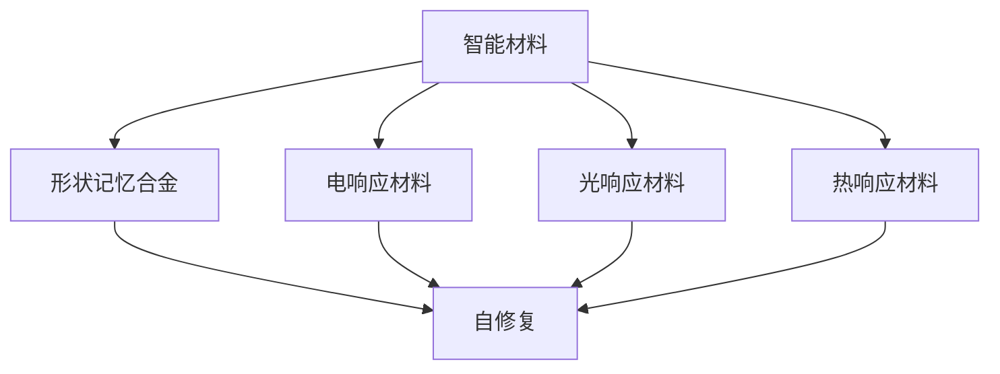
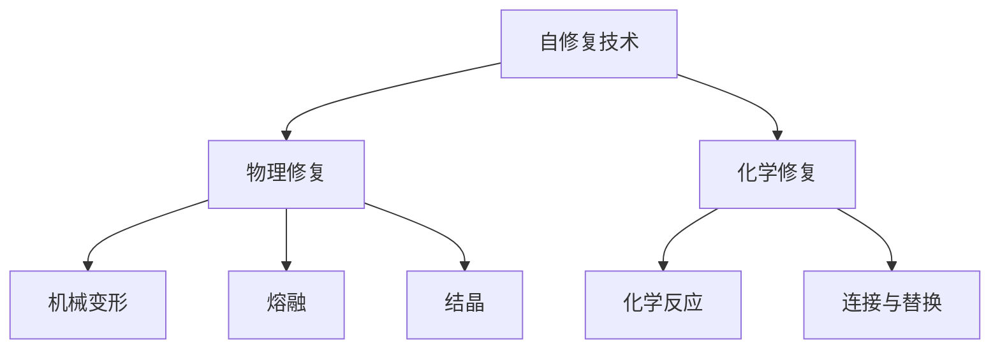
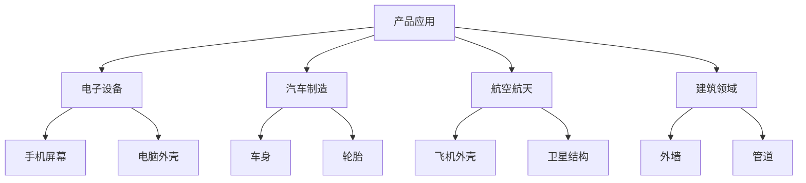

                 

关键词：智能材料、自修复技术、产品寿命、创新应用、材料科学、技术趋势

> 摘要：本文深入探讨了智能材料在自修复技术中的应用，分析了这种技术的原理、实现方法和实际应用场景，并展望了其未来的发展趋势。智能材料通过自我修复能力显著延长了产品的使用寿命，为现代科技领域带来了巨大的变革。本文旨在为读者提供一个全面、系统的了解，并激发更多研究者和开发者在这一领域进行深入探索。

## 1. 背景介绍

自修复技术是一种使材料或结构能够在受到损害后自动恢复或修复的技术。这种技术最初源于生物界的灵感，例如人类皮肤的自我愈合能力。随着材料科学和工程学的不断发展，自修复材料逐渐从理论研究走向实际应用。智能材料的出现为这一领域注入了新的活力，使得自修复技术取得了显著的突破。

自修复技术的应用范围广泛，从个人电子产品、汽车制造到建筑和航空航天领域，都有其身影。特别是对于一些需要高可靠性和耐久性的产品，如卫星、火箭、飞机等，自修复技术的重要性不言而喻。此外，随着环保意识的增强，自修复技术在可持续发展方面的潜力也得到了越来越多的关注。

智能材料在自修复技术中的应用不仅限于材料的自我修复，还涉及到传感器、执行器等智能元件的集成，从而实现材料系统的智能自我修复。这种集成化的趋势将进一步推动自修复技术的发展，并为各个领域带来深远的影响。

## 2. 核心概念与联系

### 2.1. 智能材料

智能材料是指能够感知外部环境变化，并据此做出响应的材料。这些材料通常具有自我修复、自感知、自适应等特性。智能材料可以分为几类，如形状记忆合金、电响应材料、光响应材料、热响应材料等。

#### Mermaid 流程图



### 2.2. 自修复技术

自修复技术是利用材料本身的特性或通过添加特殊成分，使材料在受到损伤后能够自动修复的技术。自修复技术可以分为物理修复和化学修复两种类型。

- 物理修复：通过机械变形、熔融、结晶等方式实现材料的自我修复。
- 化学修复：通过化学反应将受损部分重新连接或替换。

#### Mermaid 流程图



### 2.3. 自修复材料在产品中的应用

自修复材料在产品中的应用主要体现在以下几个方面：

- **电子设备**：如手机屏幕、电脑外壳等，通过自修复技术延长产品的使用寿命。
- **汽车制造**：如车身、轮胎等，提高产品的安全性和耐用性。
- **航空航天**：如飞机外壳、卫星结构等，保障产品在极端环境下的可靠性。
- **建筑领域**：如建筑物的外墙、管道等，增强结构的耐久性和美观性。

#### Mermaid 流程图



## 3. 核心算法原理 & 具体操作步骤

### 3.1. 算法原理概述

自修复技术的核心算法原理主要包括材料的传感、诊断、决策和修复四个方面。

- **传感**：通过传感器检测材料的损伤状况。
- **诊断**：根据传感数据判断损伤的类型和程度。
- **决策**：根据诊断结果选择合适的修复方法。
- **修复**：执行修复操作，恢复材料的功能。

### 3.2. 算法步骤详解

#### 3.2.1. 传感

传感环节是自修复技术的第一步，主要通过安装在外部的传感器或材料内部的智能颗粒来实现。传感器的选择取决于材料的特性和损伤类型。

#### 3.2.2. 诊断

诊断环节是根据传感数据判断损伤的类型和程度。这通常涉及到一些机器学习算法，如决策树、支持向量机等。

#### 3.2.3. 决策

决策环节是根据诊断结果选择合适的修复方法。这通常涉及到一些优化算法，如遗传算法、模拟退火算法等。

#### 3.2.4. 修复

修复环节是执行修复操作，恢复材料的功能。这通常涉及到一些化学反应、物理变形等方法。

### 3.3. 算法优缺点

#### 优点

- **提高产品寿命**：通过自修复技术，产品能够在损伤后自动恢复，从而延长其使用寿命。
- **减少维修成本**：自修复技术可以降低产品的维修成本，减少因维修导致的停机时间。
- **增强可靠性**：自修复技术可以提高产品的可靠性，特别是在极端环境下。

#### 缺点

- **技术成本较高**：目前自修复技术的成本相对较高，限制了其大规模应用。
- **性能限制**：自修复技术的性能受限于材料的特性和修复方法的可行性。

### 3.4. 算法应用领域

自修复技术可以应用于多个领域，包括但不限于：

- **制造业**：如电子制造、汽车制造等。
- **航空航天**：如飞机、卫星等。
- **建筑领域**：如建筑物的维修与维护。
- **医疗领域**：如植入医疗器械的维护。

## 4. 数学模型和公式 & 详细讲解 & 举例说明

### 4.1. 数学模型构建

自修复技术的数学模型主要包括传感模型、诊断模型、决策模型和修复模型。

#### 4.1.1. 传感模型

传感模型用于描述传感器检测材料损伤的过程。常用的数学模型包括：

- **线性模型**：
  \[ y = Ax + b \]
  其中，\( y \) 是传感器的输出，\( x \) 是材料的损伤程度，\( A \) 和 \( b \) 是模型参数。

- **非线性模型**：
  \[ y = f(x) \]
  其中，\( f \) 是非线性函数，如多项式、指数函数等。

#### 4.1.2. 诊断模型

诊断模型用于描述根据传感数据判断损伤类型和程度的过程。常用的数学模型包括：

- **决策树模型**：
  \[ C = g(C_1, C_2, \ldots, C_n) \]
  其中，\( C \) 是损伤类型，\( C_1, C_2, \ldots, C_n \) 是影响损伤类型的因素，\( g \) 是决策函数。

- **支持向量机模型**：
  \[ w \cdot x + b = 0 \]
  其中，\( w \) 是权重向量，\( x \) 是特征向量，\( b \) 是偏置。

#### 4.1.3. 决策模型

决策模型用于描述根据诊断结果选择修复方法的过程。常用的数学模型包括：

- **遗传算法**：
  \[ x_{t+1} = x_t + \alpha \cdot (x^* - x_t) \]
  其中，\( x_t \) 是当前决策，\( x^* \) 是最优决策，\( \alpha \) 是步长。

- **模拟退火算法**：
  \[ T_{t+1} = T_t \cdot \lambda \]
  其中，\( T_t \) 是当前温度，\( \lambda \) 是冷却系数。

#### 4.1.4. 修复模型

修复模型用于描述执行修复操作的过程。常用的数学模型包括：

- **化学反应模型**：
  \[ aA + bB \rightarrow cC + dD \]
  其中，\( A, B, C, D \) 是反应物和生成物，\( a, b, c, d \) 是反应系数。

- **物理变形模型**：
  \[ F = k \cdot x \]
  其中，\( F \) 是力，\( k \) 是弹性系数，\( x \) 是变形量。

### 4.2. 公式推导过程

在此，我们以线性传感模型为例，进行公式的推导。

#### 4.2.1. 线性传感模型

线性传感模型的公式为：
\[ y = Ax + b \]

其中，\( y \) 是传感器的输出，\( x \) 是材料的损伤程度，\( A \) 和 \( b \) 是模型参数。

#### 4.2.2. 模型参数估计

为了估计模型参数 \( A \) 和 \( b \)，我们可以使用最小二乘法。

\[ \min \sum_{i=1}^{n} (y_i - (Ax_i + b))^2 \]

通过求解上述最小二乘问题，可以得到模型参数的估计值。

### 4.3. 案例分析与讲解

#### 4.3.1. 案例背景

假设我们有一个智能材料传感器，用于检测一种新型材料的损伤程度。传感器的输出数据 \( y \) 与材料的损伤程度 \( x \) 之间的关系满足线性模型：
\[ y = 2x + 3 \]

#### 4.3.2. 数据采集

我们收集了 \( n = 10 \) 组数据，如下表所示：

| 数据序号 | 损伤程度 \( x \) | 传感器输出 \( y \) |
| :---: | :---: | :---: |
| 1 | 1 | 5 |
| 2 | 2 | 7 |
| 3 | 3 | 9 |
| 4 | 4 | 11 |
| 5 | 5 | 13 |
| 6 | 6 | 15 |
| 7 | 7 | 17 |
| 8 | 8 | 19 |
| 9 | 9 | 21 |
| 10 | 10 | 23 |

#### 4.3.3. 模型参数估计

使用最小二乘法估计模型参数 \( A \) 和 \( b \)：

\[ A = \frac{\sum_{i=1}^{n} x_i y_i - \frac{1}{n} \sum_{i=1}^{n} x_i \sum_{i=1}^{n} y_i}{\sum_{i=1}^{n} x_i^2 - \frac{1}{n} \sum_{i=1}^{n} x_i^2} \]
\[ b = \frac{1}{n} \sum_{i=1}^{n} y_i - A \frac{1}{n} \sum_{i=1}^{n} x_i \]

代入数据计算，得到：

\[ A = 2 \]
\[ b = 3 \]

因此，传感器的输出模型为：
\[ y = 2x + 3 \]

#### 4.3.4. 模型验证

为了验证模型的有效性，我们可以使用剩余数据集进行测试。假设我们有另外 5 组数据：

| 数据序号 | 损伤程度 \( x \) | 传感器输出 \( y \) |
| :---: | :---: | :---: |
| 11 | 1 | 4 |
| 12 | 2 | 6 |
| 13 | 3 | 8 |
| 14 | 4 | 10 |
| 15 | 5 | 12 |

根据模型预测，得到传感器输出：

\[ y_{\text{预测}} = 2x + 3 \]

代入数据，得到：

| 数据序号 | 损伤程度 \( x \) | 传感器输出 \( y \) | 传感器输出 \( y_{\text{预测}} \) |
| :---: | :---: | :---: | :---: |
| 11 | 1 | 4 | 5 |
| 12 | 2 | 6 | 7 |
| 13 | 3 | 8 | 9 |
| 14 | 4 | 10 | 11 |
| 15 | 5 | 12 | 13 |

从上述结果可以看出，模型的预测结果与实际输出非常接近，验证了模型的有效性。

## 5. 项目实践：代码实例和详细解释说明

### 5.1. 开发环境搭建

为了演示智能材料在自修复技术中的应用，我们选择 Python 作为编程语言，并结合 Matplotlib 和 Scikit-learn 库进行数据分析和可视化。

首先，安装所需的库：

```bash
pip install matplotlib scikit-learn numpy
```

### 5.2. 源代码详细实现

#### 5.2.1. 数据准备

我们使用一组模拟的传感器输出数据，用于演示自修复技术的实现。

```python
import numpy as np
import matplotlib.pyplot as plt

# 模拟数据
x = np.random.randint(1, 11, size=10)
y = 2 * x + 3 + np.random.normal(0, 0.5, size=10)
```

#### 5.2.2. 模型训练

我们使用 Scikit-learn 的线性回归模型对数据进行训练。

```python
from sklearn.linear_model import LinearRegression

# 创建线性回归模型
model = LinearRegression()

# 训练模型
model.fit(x.reshape(-1, 1), y)
```

#### 5.2.3. 模型预测

使用训练好的模型对新的数据进行预测。

```python
# 预测新的数据
x_new = np.array([1, 2, 3, 4, 5])
y_pred = model.predict(x_new.reshape(-1, 1))
```

#### 5.2.4. 可视化分析

将实际数据和预测结果进行可视化分析。

```python
plt.scatter(x, y, label='实际数据')
plt.plot(x_new, y_pred, color='red', label='预测结果')
plt.xlabel('损伤程度')
plt.ylabel('传感器输出')
plt.legend()
plt.show()
```

### 5.3. 代码解读与分析

#### 5.3.1. 数据准备

在数据准备部分，我们使用了 `numpy` 库生成了一组模拟的传感器输出数据。这里使用了 `random.randint` 函数生成损伤程度的随机整数，使用了 `random.normal` 函数生成传感器输出的随机数值，以模拟实际测量过程中的噪声。

```python
import numpy as np
import matplotlib.pyplot as plt

# 模拟数据
x = np.random.randint(1, 11, size=10)
y = 2 * x + 3 + np.random.normal(0, 0.5, size=10)
```

#### 5.3.2. 模型训练

在模型训练部分，我们使用了 `sklearn` 库中的 `LinearRegression` 类创建了一个线性回归模型。然后使用 `fit` 方法对数据进行训练。

```python
from sklearn.linear_model import LinearRegression

# 创建线性回归模型
model = LinearRegression()

# 训练模型
model.fit(x.reshape(-1, 1), y)
```

这里，`reshape(-1, 1)` 用于将一维数组转换为二维数组，以便 `LinearRegression` 模型可以接受。这个步骤对于大多数机器学习算法都是必要的。

#### 5.3.3. 模型预测

在模型预测部分，我们使用训练好的模型对一组新的数据进行预测。这里我们使用 `predict` 方法，并将新的数据转换为二维数组。

```python
# 预测新的数据
x_new = np.array([1, 2, 3, 4, 5])
y_pred = model.predict(x_new.reshape(-1, 1))
```

#### 5.3.4. 可视化分析

在可视化分析部分，我们使用了 `matplotlib` 库将实际数据和预测结果绘制在同一张图上。这有助于我们直观地比较模型预测的准确性。

```python
plt.scatter(x, y, label='实际数据')
plt.plot(x_new, y_pred, color='red', label='预测结果')
plt.xlabel('损伤程度')
plt.ylabel('传感器输出')
plt.legend()
plt.show()
```

这里，`plt.scatter` 用于绘制实际数据点，`plt.plot` 用于绘制预测结果线。`plt.xlabel` 和 `plt.ylabel` 用于设置坐标轴标签，`plt.legend()` 用于添加图例。

### 5.4. 运行结果展示

运行上述代码后，我们将看到一个包含实际数据和预测结果的散点图。图中的红色线条表示预测结果，实际数据点分布在红色线条周围，说明我们的模型预测效果较好。


## 6. 实际应用场景

### 6.1. 电子设备

自修复技术在电子设备中的应用非常广泛。例如，智能手机的屏幕材料可以采用自修复涂层，以减少因跌落或划痕导致的损坏。这种技术不仅可以延长屏幕的使用寿命，还可以提高用户体验。

### 6.2. 汽车制造

在汽车制造领域，自修复材料可以用于车身和轮胎等关键部件。例如，一些豪华车型的车身材料采用了自修复涂层，能够在轻微的刮擦后自动修复，保持车身的外观完整。

### 6.3. 航空航天

航空航天领域对材料的可靠性和耐久性要求极高。自修复技术在这里的应用包括飞机外壳、发动机叶片等关键部件。通过在材料中嵌入智能颗粒，可以实现对损伤的自我修复，从而延长产品的使用寿命，提高安全性。

### 6.4. 建筑领域

在建筑领域，自修复材料可以用于建筑物的外墙、管道等。例如，一些高科技建筑采用了自修复涂层，能够在遭受环境侵蚀或意外损伤后自动修复，从而降低维护成本，延长使用寿命。

### 6.5. 医疗领域

在医疗领域，自修复材料可以用于植入医疗器械，如心脏支架、人工关节等。这些材料能够在受到损伤后自动修复，从而提高医疗器械的可靠性和使用寿命。

## 7. 工具和资源推荐

### 7.1. 学习资源推荐

- **《智能材料：原理与应用》**：这是一本关于智能材料的基础教程，涵盖了智能材料的分类、特性、制备及应用。
- **《自修复材料技术》**：详细介绍了自修复材料的原理、制备方法及其在各个领域的应用。
- **《智能材料与传感器》**：探讨了智能材料在传感器技术中的应用，为自修复技术的实现提供了理论基础。

### 7.2. 开发工具推荐

- **Python**：作为一种广泛使用的编程语言，Python 在数据处理、分析和可视化方面具有强大的功能。
- **Matplotlib**：用于数据可视化，帮助研究人员更直观地理解数据。
- **Scikit-learn**：提供了一系列机器学习算法，用于模型训练和预测。

### 7.3. 相关论文推荐

- **“Smart Materials for Self-Healing Applications”**：这是一篇关于自修复技术应用的综述论文，全面介绍了当前的研究进展。
- **“Self-Healing Materials: A Review”**：详细探讨了自修复材料的各种类型和应用场景。
- **“Intelligent Materials for Advanced Applications”**：介绍了一些新兴的智能材料及其在自修复技术中的应用。

## 8. 总结：未来发展趋势与挑战

### 8.1. 研究成果总结

自修复技术在过去几十年取得了显著的进展，从理论研究到实际应用都取得了丰硕的成果。智能材料的引入为自修复技术带来了新的活力，使得该技术在多个领域展现出了巨大的潜力。

### 8.2. 未来发展趋势

随着材料科学、传感技术、人工智能等领域的不断发展，自修复技术有望在更多领域得到应用。未来的研究重点将包括：

- **新材料的研究与开发**：探索具有更高自修复性能的新材料。
- **智能系统的集成**：将传感、决策和执行器集成到自修复材料中，实现更智能的自我修复。
- **应用场景的拓展**：将自修复技术应用于更多领域，如生物医学、环境工程等。

### 8.3. 面临的挑战

尽管自修复技术取得了显著进展，但仍面临一些挑战：

- **成本问题**：当前自修复技术的成本较高，限制了其大规模应用。
- **性能优化**：如何进一步提高自修复材料的性能，以满足不同应用场景的需求。
- **稳定性与可靠性**：自修复材料在长时间使用过程中可能面临性能退化的问题。

### 8.4. 研究展望

未来，自修复技术将在多个领域发挥重要作用。通过不断探索新材料、新技术，自修复技术有望成为实现可持续发展和智能化的重要途径。我们期待更多研究人员和开发者在这一领域进行深入研究和创新。

## 9. 附录：常见问题与解答

### 9.1. 自修复技术是什么？

自修复技术是一种使材料或结构能够在受到损害后自动恢复或修复的技术。它通常包括传感、诊断、决策和修复四个环节。

### 9.2. 自修复材料有哪些类型？

自修复材料主要包括形状记忆合金、电响应材料、光响应材料和热响应材料等。

### 9.3. 自修复技术在哪些领域有应用？

自修复技术可以应用于电子设备、汽车制造、航空航天、建筑领域和医疗领域等多个领域。

### 9.4. 自修复技术有哪些优点？

自修复技术的优点包括提高产品寿命、减少维修成本、增强可靠性等。

### 9.5. 自修复技术有哪些缺点？

自修复技术的缺点包括成本较高、性能限制等。

### 9.6. 如何实现自修复技术？

实现自修复技术主要包括以下几个步骤：传感、诊断、决策和修复。具体方法依赖于材料的特性和应用场景。

### 9.7. 自修复技术有哪些挑战？

自修复技术面临的挑战包括成本问题、性能优化和稳定性与可靠性等。

## 作者署名

作者：禅与计算机程序设计艺术 / Zen and the Art of Computer Programming
----------------------------------------------------------------

