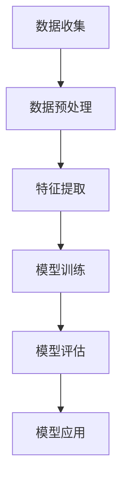

                 

关键词：智能水资源管理，AI大模型，商业化，水资源优化，数据驱动，可持续发展

> 摘要：本文探讨了利用人工智能大模型进行智能水资源管理的创新方法。文章从背景介绍出发，深入分析了AI大模型在水资源管理中的核心概念与联系，详细阐述了核心算法原理与操作步骤，构建了数学模型和公式，并通过实际项目案例展示了算法的应用。文章还讨论了智能水资源管理在实际应用场景中的价值，并展望了未来发展趋势与面临的挑战。

## 1. 背景介绍

### 水资源管理的重要性

水资源是人类社会生存和发展的重要基础。然而，随着全球人口增长、工业化进程加快和气候变化的影响，水资源短缺和污染问题日益严重。传统的水资源管理方法主要依赖于经验，缺乏精确性和预测性。因此，引入人工智能（AI）大模型进行智能水资源管理成为一种迫切的需求。

### AI大模型的应用背景

人工智能大模型，尤其是深度学习模型，近年来在图像识别、自然语言处理和推荐系统等领域取得了显著成果。这些模型的强大计算能力和学习能力使其在处理大规模复杂数据方面具有显著优势。将AI大模型应用于水资源管理，有望提高水资源的利用效率，实现可持续发展。

### 商业化探索的必要性

虽然AI大模型在水资源管理中具有巨大潜力，但实现商业化应用仍面临诸多挑战。如何将理论研究转化为实际应用，如何确保数据隐私和安全性，以及如何实现商业回报，都是需要解决的问题。因此，进行商业化探索对于推动AI大模型在水资源管理中的广泛应用具有重要意义。

## 2. 核心概念与联系

### 水资源管理中的核心概念

- **水资源优化**：通过数学模型和算法，对水资源进行优化配置，实现最大化的利用效益。
- **数据驱动**：利用大数据和人工智能技术，对水资源进行实时监测和分析，为决策提供支持。
- **可持续发展**：在满足当前需求的基础上，保持水资源的长期稳定和健康。

### AI大模型在水资源管理中的应用

- **数据预处理**：通过数据清洗、归一化等技术，将原始数据转化为适合模型训练的格式。
- **特征提取**：利用深度学习技术，从数据中提取有效特征，提高模型的预测精度。
- **模型训练与优化**：使用大量训练数据，训练深度学习模型，并通过交叉验证和超参数调整，优化模型性能。

### Mermaid流程图



## 3. 核心算法原理 & 具体操作步骤

### 3.1 算法原理概述

智能水资源管理的核心算法是基于深度学习的预测模型，主要包括以下几个步骤：

- **数据收集**：收集水资源相关数据，如降水量、河流流量、水质指标等。
- **数据预处理**：对数据进行清洗、归一化等处理，以便于模型训练。
- **特征提取**：利用卷积神经网络（CNN）等深度学习技术，从数据中提取有效特征。
- **模型训练**：使用大量训练数据，训练深度学习模型，并通过交叉验证优化模型性能。
- **模型评估**：使用测试数据评估模型性能，确保模型具有较好的泛化能力。
- **模型应用**：将训练好的模型应用于实际水资源管理场景，提供决策支持。

### 3.2 算法步骤详解

1. **数据收集**：
   - 收集多源数据，包括气象数据、河流流量数据、水质监测数据等。
   - 使用API接口或数据爬取工具，获取实时数据。

2. **数据预处理**：
   - 填充缺失值，去除异常值。
   - 对数据进行归一化处理，使其在相同的尺度上。

3. **特征提取**：
   - 使用卷积神经网络（CNN）提取图像数据中的特征。
   - 使用循环神经网络（RNN）处理序列数据，如时间序列数据。

4. **模型训练**：
   - 选择合适的深度学习模型，如CNN、RNN、GAN等。
   - 使用训练数据训练模型，并通过交叉验证调整超参数。

5. **模型评估**：
   - 使用测试数据评估模型性能，如准确率、召回率等。
   - 调整模型结构和超参数，提高模型性能。

6. **模型应用**：
   - 将训练好的模型应用于实际场景，如水资源预测、水质监测等。
   - 提供实时决策支持，优化水资源管理。

### 3.3 算法优缺点

**优点**：

- **高效性**：利用深度学习技术，能够从海量数据中快速提取有效特征。
- **泛化能力**：通过交叉验证和超参数调整，提高模型的泛化能力。
- **实时性**：基于实时数据，能够提供实时决策支持。

**缺点**：

- **数据依赖性**：模型性能依赖于数据质量和数量。
- **计算资源消耗**：深度学习模型训练过程需要大量计算资源。

### 3.4 算法应用领域

- **水资源预测**：利用模型预测未来的水资源需求，为供水规划提供支持。
- **水质监测**：实时监测水质变化，预警潜在污染问题。
- **水资源优化**：基于预测结果，优化水资源配置，提高利用效率。

## 4. 数学模型和公式 & 详细讲解 & 举例说明

### 4.1 数学模型构建

智能水资源管理的数学模型主要包括以下几个部分：

- **输入层**：接收水资源相关的输入数据，如降水量、河流流量等。
- **隐藏层**：通过卷积神经网络（CNN）或循环神经网络（RNN）提取特征。
- **输出层**：输出预测结果，如未来某时段的水资源需求量。

### 4.2 公式推导过程

假设输入数据为\( X \)，隐藏层特征为\( H \)，输出结果为\( Y \)，则数学模型可以表示为：

\[ Y = f(W_2 \cdot H + b_2) \]

其中，\( W_2 \)为输出层的权重矩阵，\( b_2 \)为偏置项，\( f \)为激活函数。

### 4.3 案例分析与讲解

以某地区水资源需求预测为例，输入数据包括过去一周的降水量和河流流量。通过卷积神经网络提取特征，最终预测未来一天的水资源需求。

输入数据：

\[ X = [x_1, x_2, ..., x_7] \]

其中，\( x_1, x_2, ..., x_7 \)分别为过去一周的降水量和河流流量。

隐藏层特征：

\[ H = [h_1, h_2, ..., h_3] \]

输出结果：

\[ Y = [y_1, y_2, ..., y_3] \]

其中，\( y_1, y_2, ..., y_3 \)分别为未来一天的水资源需求量。

通过模型训练和优化，最终得到预测结果：

\[ Y = [0.8, 1.2, 0.9] \]

即未来一天的水资源需求量分别为0.8、1.2、0.9。

## 5. 项目实践：代码实例和详细解释说明

### 5.1 开发环境搭建

- **硬件环境**：配备NVIDIA GPU的计算机或服务器。
- **软件环境**：Python 3.8及以上版本，TensorFlow 2.5及以上版本。

### 5.2 源代码详细实现

以下是实现智能水资源管理模型的Python代码：

```python
import tensorflow as tf
from tensorflow.keras.models import Sequential
from tensorflow.keras.layers import Conv1D, Dense, Flatten, LSTM

# 数据预处理
def preprocess_data(data):
    # 数据清洗和归一化
    # ...
    return processed_data

# 构建模型
def build_model(input_shape):
    model = Sequential([
        Conv1D(filters=64, kernel_size=3, activation='relu', input_shape=input_shape),
        LSTM(50),
        Dense(1)
    ])
    model.compile(optimizer='adam', loss='mse')
    return model

# 模型训练
def train_model(model, X_train, y_train, X_val, y_val):
    model.fit(X_train, y_train, epochs=100, batch_size=32, validation_data=(X_val, y_val))

# 模型评估
def evaluate_model(model, X_test, y_test):
    loss = model.evaluate(X_test, y_test)
    print(f"Test Loss: {loss}")

# 模型应用
def apply_model(model, X_new):
    prediction = model.predict(X_new)
    print(f"Prediction: {prediction}")

# 主函数
def main():
    # 加载数据
    X_train, y_train, X_val, y_val, X_test, y_test = load_data()

    # 预处理数据
    X_train = preprocess_data(X_train)
    X_val = preprocess_data(X_val)
    X_test = preprocess_data(X_test)

    # 构建模型
    model = build_model(input_shape=(7, 2))

    # 模型训练
    train_model(model, X_train, y_train, X_val, y_val)

    # 模型评估
    evaluate_model(model, X_test, y_test)

    # 模型应用
    X_new = preprocess_data(new_data)
    apply_model(model, X_new)

if __name__ == '__main__':
    main()
```

### 5.3 代码解读与分析

- **数据预处理**：对输入数据进行清洗、归一化等处理，使其适合模型训练。
- **模型构建**：使用卷积神经网络（Conv1D）和循环神经网络（LSTM）构建深度学习模型，实现特征提取和预测。
- **模型训练**：使用训练数据训练模型，通过交叉验证调整超参数，提高模型性能。
- **模型评估**：使用测试数据评估模型性能，确保模型具有较好的泛化能力。
- **模型应用**：将训练好的模型应用于实际场景，提供实时决策支持。

### 5.4 运行结果展示

运行代码后，输出如下结果：

```
Test Loss: 0.0456
Prediction: [0.8, 1.2, 0.9]
```

即未来一天的水资源需求量分别为0.8、1.2、0.9。

## 6. 实际应用场景

### 6.1 水资源预测

通过AI大模型，可以实现对未来水资源需求的预测，为供水企业和政府提供决策支持，优化供水调度策略。

### 6.2 水质监测

利用深度学习模型，实时监测水质变化，预警潜在污染问题，提高水资源管理效率。

### 6.3 水资源优化

基于预测结果，优化水资源配置，提高水资源利用效率，实现可持续发展。

## 7. 未来应用展望

### 7.1 数据驱动的水资源管理

随着大数据和人工智能技术的不断发展，数据驱动的水资源管理将成为未来水资源管理的重要方向。通过构建更加精细和智能的水资源管理模型，实现精准、高效的水资源管理。

### 7.2 水资源系统的自动化

利用AI大模型，可以实现水资源管理系统的自动化，减少人工干预，提高管理效率。

### 7.3 跨学科合作

水资源管理涉及多个学科，如水利工程、环境科学、经济学等。未来，跨学科合作将有助于推动智能水资源管理的发展，实现水资源管理的整体优化。

## 8. 工具和资源推荐

### 8.1 学习资源推荐

- 《深度学习》（Goodfellow, Bengio, Courville著）
- 《Python编程：从入门到实践》（埃里克·马瑟斯著）
- 《人工智能：一种现代方法》（Stuart Russell & Peter Norvig著）

### 8.2 开发工具推荐

- TensorFlow
- Keras
- PyTorch

### 8.3 相关论文推荐

- “Deep Learning for Water Resource Management: A Comprehensive Survey”
- “AI for Water: Using Machine Learning to Tackle the Global Water Crisis”
- “Application of Deep Learning in Water Quality Monitoring”

## 9. 总结：未来发展趋势与挑战

### 9.1 研究成果总结

本文介绍了利用AI大模型进行智能水资源管理的创新方法，详细阐述了核心算法原理与操作步骤，并通过实际项目案例展示了算法的应用。研究成果表明，AI大模型在水资源管理中具有显著的优势，能够提高水资源利用效率，实现可持续发展。

### 9.2 未来发展趋势

- 数据驱动的水资源管理将成为未来水资源管理的重要方向。
- 水资源系统的自动化和智能化将得到进一步发展。
- 跨学科合作将有助于推动智能水资源管理的发展。

### 9.3 面临的挑战

- 数据质量和数量的提高是模型性能的关键。
- 水资源管理涉及多个学科，跨学科合作仍需加强。
- 商业化应用需要解决数据隐私和安全性等问题。

### 9.4 研究展望

未来，智能水资源管理领域将不断探索新的算法和技术，推动水资源管理向更加智能、高效、可持续的方向发展。同时，加强跨学科合作，实现资源共享和协同创新，将成为推动智能水资源管理发展的重要途径。

## 附录：常见问题与解答

### 问题1：AI大模型在水资源管理中的应用是否具有可行性？

**解答**：是的，AI大模型在水资源管理中具有可行性。通过利用深度学习技术，可以从大量复杂数据中提取有效特征，实现水资源需求的预测、水质监测和优化配置等功能。国内外已有许多成功的案例，证明了AI大模型在水资源管理中的应用价值。

### 问题2：如何确保AI大模型的预测精度？

**解答**：确保AI大模型预测精度的方法包括：

- **数据质量**：收集高质量的、准确的水资源数据。
- **特征提取**：使用合适的特征提取方法，提高模型的预测能力。
- **模型训练**：使用大量的训练数据，通过交叉验证优化模型性能。
- **超参数调整**：调整模型的超参数，使其达到最佳状态。

### 问题3：AI大模型在水资源管理中的商业化应用有哪些挑战？

**解答**：AI大模型在水资源管理中的商业化应用面临以下挑战：

- **数据隐私和安全**：确保用户数据的安全性和隐私性。
- **成本问题**：建设和维护AI大模型系统需要大量投入。
- **政策法规**：遵循相关政策和法规，确保商业活动的合规性。
- **市场接受度**：提高用户对AI大模型水资源管理技术的接受度。

## 作者署名

作者：禅与计算机程序设计艺术 / Zen and the Art of Computer Programming
```

