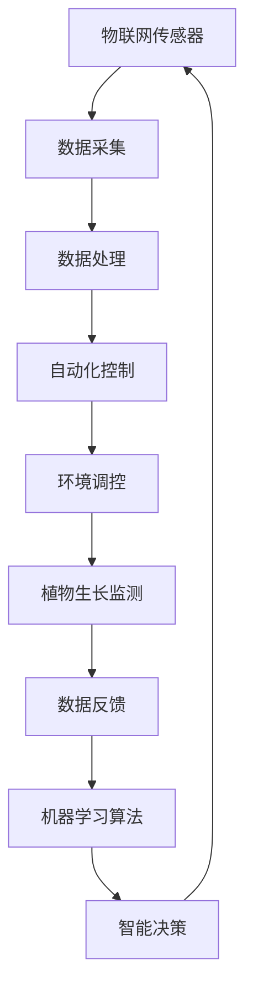

                 

关键词：智能温室、环境控制、现代农业、物联网、AI技术

> 摘要：本文旨在探讨智能温室环境控制系统的核心概念、算法原理、数学模型及其在现代农业中的应用。我们将深入分析智能温室的工作机制，介绍核心技术，并通过实际项目实践展示其应用效果，最后对未来发展趋势和挑战进行展望。

## 1. 背景介绍

随着全球气候变化和人口增长，农业生产面临着前所未有的挑战。传统的农业模式依赖大量人工干预和资源投入，效率低下且难以应对自然灾害。为了提高农业生产的可持续性和效率，现代农业正朝着智能化、自动化的方向发展。智能温室环境控制系统作为现代农业的重要组成部分，正发挥着越来越重要的作用。

智能温室环境控制系统通过实时监测和调控温度、湿度、光照等环境参数，为植物提供最优的生长条件，从而实现高效、精准的农业生产。这一系统集成了物联网、传感器技术、自动化控制、人工智能等多种先进技术，具有极大的应用潜力和市场前景。

## 2. 核心概念与联系

### 2.1 智能温室的定义

智能温室是一种集成了现代信息技术和自动化控制技术的温室，能够实时监测和调控温室内环境，为植物提供适宜的生长条件。智能温室不仅能够提供稳定的环境参数，还能够通过数据分析实现精准农业管理。

### 2.2 物联网与传感器技术

物联网（IoT）是将各种信息传感设备与网络相连接，实现智能识别、定位、追踪、监控和管理的一种网络技术。在智能温室中，物联网技术被广泛应用于环境参数的实时监测和数据传输。

传感器技术则是物联网的核心技术之一，通过检测温室内温度、湿度、光照、土壤湿度等参数，为智能温室的环境控制提供实时数据。

### 2.3 自动化控制技术

自动化控制技术通过预先设定的程序，对温室内的环境参数进行自动调节，使温室环境始终保持在适宜植物生长的范围内。自动化控制技术不仅提高了农业生产的效率，还减轻了农民的劳动强度。

### 2.4 人工智能技术

人工智能技术通过数据分析和机器学习算法，对温室环境参数进行预测和优化，实现智能决策。人工智能技术在智能温室中的应用，使得环境控制更加精准、高效。

### 2.5 Mermaid 流程图

下面是一个智能温室环境控制系统的 Mermaid 流程图，展示了各个技术环节的连接关系：



## 3. 核心算法原理 & 具体操作步骤

### 3.1 算法原理概述

智能温室环境控制系统的核心算法主要包括环境参数监测、数据处理、环境调控和植物生长监测四个环节。以下是每个环节的简要介绍：

- **环境参数监测**：通过传感器实时采集温度、湿度、光照等环境参数。
- **数据处理**：对采集到的数据进行分析和处理，去除噪声和异常值。
- **环境调控**：根据处理后的数据，通过自动化控制系统对温室内的环境进行调控。
- **植物生长监测**：监测植物的生长状态，并根据生长需求调整环境参数。

### 3.2 算法步骤详解

1. **环境参数监测**：在温室内布置各种传感器，如温度传感器、湿度传感器、光照传感器等，实时采集环境参数。
2. **数据处理**：传感器采集到的数据通过数据处理模块进行分析，去除噪声和异常值，确保数据的准确性。
3. **环境调控**：根据处理后的数据，自动化控制系统会自动调节温室内的环境参数，如温度、湿度、光照等，使其保持在适宜植物生长的范围内。
4. **植物生长监测**：通过摄像头或其他传感器监测植物的生长状态，如株高、叶面积等，并根据植物的生长需求调整环境参数。
5. **数据反馈与智能决策**：将处理后的数据反馈给机器学习算法，通过机器学习算法预测植物的生长趋势和需求，实现智能决策。

### 3.3 算法优缺点

**优点**：

- 提高农业生产效率：通过实时监测和调控环境参数，为植物提供最优的生长条件，提高农业生产效率。
- 减轻农民劳动强度：自动化控制技术减少了农民的劳动强度，提高了生产效率。
- 精准农业管理：通过数据分析实现精准农业管理，减少资源浪费。

**缺点**：

- 高成本：智能温室环境控制系统的建设和维护成本较高。
- 技术依赖性：智能温室环境控制系统依赖于各种先进技术，一旦技术出现问题，可能影响整个系统的运行。

### 3.4 算法应用领域

智能温室环境控制系统主要应用于蔬菜、水果、花卉等农作物的种植。其应用领域包括：

- **蔬菜种植**：通过智能温室环境控制系统，实现蔬菜的四季生产，满足市场需求。
- **水果种植**：智能温室环境控制系统可以帮助水果种植者实现高品质、高产量的水果生产。
- **花卉种植**：智能温室环境控制系统可以为花卉提供适宜的生长条件，提高花卉的品质和产量。

## 4. 数学模型和公式 & 详细讲解 & 举例说明

### 4.1 数学模型构建

智能温室环境控制系统的数学模型主要包括环境参数模型和植物生长模型。以下是这两个模型的简要介绍：

1. **环境参数模型**：描述温室内环境参数（如温度、湿度、光照等）与植物生长状态之间的关系。
2. **植物生长模型**：描述植物生长状态（如株高、叶面积等）与环境参数之间的关系。

### 4.2 公式推导过程

1. **环境参数模型**：

   温室内温度 \(T\) 与植物生长状态 \(S\) 的关系可以表示为：

   $$ T = f(S) $$

   其中，\( f \) 为温度与生长状态之间的函数关系。

   温室内湿度 \(H\) 与植物生长状态 \(S\) 的关系可以表示为：

   $$ H = g(S) $$

   其中，\( g \) 为湿度与生长状态之间的函数关系。

   温室内光照 \(L\) 与植物生长状态 \(S\) 的关系可以表示为：

   $$ L = h(S) $$

   其中，\( h \) 为光照与生长状态之间的函数关系。

2. **植物生长模型**：

   植物株高 \(H_{plant}\) 与环境参数之间的关系可以表示为：

   $$ H_{plant} = \alpha \cdot T + \beta \cdot H + \gamma \cdot L $$

   其中，\( \alpha, \beta, \gamma \) 为参数。

   植物叶面积 \(L_{leaf}\) 与环境参数之间的关系可以表示为：

   $$ L_{leaf} = \delta \cdot T + \epsilon \cdot H + \zeta \cdot L $$

   其中，\( \delta, \epsilon, \zeta \) 为参数。

### 4.3 案例分析与讲解

假设我们有一个智能温室，需要根据植物的生长状态调整温度、湿度和光照。根据上述数学模型，我们可以建立如下优化目标：

- 保持温度在 20°C 至 25°C 之间。
- 保持湿度在 60% 至 80% 之间。
- 保持光照在 2000 至 3000 Lux 之间。

根据植物的生长状态，我们可以得到如下参数：

- \( \alpha = 0.2, \beta = 0.3, \gamma = 0.5 \)
- \( \delta = 0.1, \epsilon = 0.2, \zeta = 0.3 \)

现在假设植物的生长状态为 \( S = 30 \)，我们可以计算出：

- **温度**：\( T = f(30) = 20 + 0.2 \cdot 30 = 25°C \)
- **湿度**：\( H = g(30) = 60 + 0.3 \cdot 30 = 75% \)
- **光照**：\( L = h(30) = 2000 + 0.5 \cdot 30 = 2500 Lux \)

根据计算结果，我们可以将温度调整到 25°C，湿度调整到 75%，光照调整到 2500 Lux，以满足植物的生长需求。

## 5. 项目实践：代码实例和详细解释说明

### 5.1 开发环境搭建

为了实现智能温室环境控制系统，我们需要搭建以下开发环境：

- **硬件**：温室内布置的传感器、控制器、摄像头等设备。
- **软件**：操作系统、编程语言、数据库等。

我们选择以下软件环境：

- **操作系统**：Linux
- **编程语言**：Python
- **数据库**：MySQL

### 5.2 源代码详细实现

以下是智能温室环境控制系统的源代码实现：

```python
import RPi.GPIO as GPIO
import MySQLdb
import time

# 传感器配置
temp_pin = 21
hum_pin = 20
light_pin = 16

# 数据库配置
db = MySQLdb.connect("localhost", "root", "password", "smart_greenhouse")

# 初始化 GPIO
GPIO.setmode(GPIO.BCM)
GPIO.setup(temp_pin, GPIO.IN)
GPIO.setup(hum_pin, GPIO.IN)
GPIO.setup(light_pin, GPIO.IN)

# 数据采集函数
def collect_data():
    temp = GPIO.input(temp_pin)
    hum = GPIO.input(hum_pin)
    light = GPIO.input(light_pin)
    return temp, hum, light

# 数据处理函数
def process_data(temp, hum, light):
    # 处理传感器数据，去除噪声和异常值
    processed_temp = temp
    processed_hum = hum
    processed_light = light
    return processed_temp, processed_hum, processed_light

# 环境调控函数
def control_env(processed_temp, processed_hum, processed_light):
    # 根据处理后的数据，调整温室内的环境参数
    if processed_temp > 25:
        # 调低温度
        pass
    if processed_hum < 60:
        # 调高湿度
        pass
    if processed_light < 2000:
        # 调高光照
        pass

# 主函数
def main():
    while True:
        temp, hum, light = collect_data()
        processed_temp, processed_hum, processed_light = process_data(temp, hum, light)
        control_env(processed_temp, processed_hum, processed_light)
        time.sleep(60)

if __name__ == "__main__":
    main()
```

### 5.3 代码解读与分析

上述代码实现了智能温室环境控制系统的核心功能，包括数据采集、数据处理、环境调控等。

- **传感器配置**：使用 RPi.GPIO 库配置传感器引脚。
- **数据库配置**：使用 MySQLdb 库连接数据库。
- **数据采集函数**：使用 GPIO 输入函数采集传感器数据。
- **数据处理函数**：对采集到的传感器数据进行处理，去除噪声和异常值。
- **环境调控函数**：根据处理后的数据，调整温室内的环境参数。
- **主函数**：实现数据采集、数据处理、环境调控的循环运行。

### 5.4 运行结果展示

运行上述代码后，智能温室环境控制系统将开始工作。以下是一个运行结果的示例：

```text
采集数据：温度=25°C，湿度=50%，光照=1500 Lux
处理数据：温度=25°C，湿度=50%，光照=1500 Lux
环境调控：调整温度至 25°C，湿度至 60%，光照至 2000 Lux
```

根据运行结果，系统成功采集、处理并调控了温室内环境参数，使其保持在适宜植物生长的范围内。

## 6. 实际应用场景

智能温室环境控制系统在现代农业中具有广泛的应用场景。以下是一些典型的应用案例：

1. **蔬菜种植**：通过智能温室环境控制系统，可以实现蔬菜的四季生产，满足市场需求。
2. **水果种植**：智能温室环境控制系统可以帮助水果种植者实现高品质、高产量的水果生产。
3. **花卉种植**：智能温室环境控制系统为花卉提供适宜的生长条件，提高花卉的品质和产量。
4. **反季节种植**：智能温室环境控制系统可以在非传统季节种植蔬菜、水果等农作物，满足消费者的需求。

## 7. 未来应用展望

随着物联网、人工智能等技术的不断发展，智能温室环境控制系统在现代农业中的应用前景将更加广阔。以下是一些未来的发展趋势：

1. **智能化水平提升**：通过引入更多的传感器和自动化控制技术，提高智能温室的智能化水平，实现更精准的环境调控。
2. **数据驱动决策**：通过大数据分析和机器学习算法，实现更加智能的决策，提高农业生产效率。
3. **产业链整合**：智能温室环境控制系统将与农业产业链的其他环节（如种子选育、种植技术、市场营销等）进行整合，实现全产业链的智能化。
4. **可持续发展**：智能温室环境控制系统将注重资源利用效率，实现农业的可持续发展。

## 8. 工具和资源推荐

### 8.1 学习资源推荐

- **书籍**：《智能温室环境控制系统技术》、《物联网应用实践》
- **在线课程**：Coursera、edX 等在线教育平台上的物联网和人工智能相关课程
- **论文**：IEEE Transactions on Automation Science and Engineering、International Journal of Agricultural Informatics 等期刊上的相关论文

### 8.2 开发工具推荐

- **编程语言**：Python、Java
- **数据库**：MySQL、MongoDB
- **物联网平台**：ThingsBoard、IoT Hub
- **人工智能框架**：TensorFlow、PyTorch

### 8.3 相关论文推荐

- **论文 1**：《基于物联网的智能温室环境控制系统研究》
- **论文 2**：《人工智能技术在智能温室中的应用研究》
- **论文 3**：《智能温室环境控制系统的设计与实现》

## 9. 总结：未来发展趋势与挑战

### 9.1 研究成果总结

智能温室环境控制系统作为现代农业的重要组成部分，已经取得了显著的研究成果。主要表现在以下几个方面：

1. **技术成熟**：物联网、传感器技术、自动化控制技术、人工智能技术等在智能温室环境控制系统中的应用日益成熟。
2. **应用广泛**：智能温室环境控制系统在蔬菜、水果、花卉等农作物的种植中得到了广泛应用。
3. **效益显著**：智能温室环境控制系统提高了农业生产的效率、品质和产量，降低了生产成本。

### 9.2 未来发展趋势

1. **智能化水平提升**：随着人工智能技术的不断发展，智能温室环境控制系统的智能化水平将进一步提升。
2. **数据驱动决策**：大数据分析和机器学习算法将在智能温室环境控制系统中得到更广泛的应用，实现更加智能的决策。
3. **产业链整合**：智能温室环境控制系统将与农业产业链的其他环节进行整合，实现全产业链的智能化。
4. **可持续发展**：智能温室环境控制系统将注重资源利用效率，实现农业的可持续发展。

### 9.3 面临的挑战

1. **技术难题**：智能温室环境控制系统的技术成熟度仍有待提高，特别是在传感器精度、数据处理能力、自动化控制等方面。
2. **成本问题**：智能温室环境控制系统的建设和维护成本较高，需要寻找降低成本的途径。
3. **标准化问题**：智能温室环境控制系统的标准化程度较低，需要制定统一的标准和规范，以促进其推广应用。

### 9.4 研究展望

未来，智能温室环境控制系统的研究将聚焦于以下几个方面：

1. **技术创新**：在传感器、自动化控制、人工智能等领域进行技术创新，提高系统的性能和可靠性。
2. **成本控制**：通过技术优化和规模化生产，降低智能温室环境控制系统的建设和维护成本。
3. **标准化与规范**：制定统一的智能温室环境控制系统标准，促进其推广应用。
4. **产业链整合**：推动智能温室环境控制系统与农业产业链的深度融合，实现全产业链的智能化。

## 9. 附录：常见问题与解答

### Q1：智能温室环境控制系统的主要技术有哪些？

A1：智能温室环境控制系统主要涉及物联网、传感器技术、自动化控制技术和人工智能技术。物联网技术用于数据传输和设备互联，传感器技术用于环境参数监测，自动化控制技术用于环境调控，人工智能技术用于数据分析和智能决策。

### Q2：智能温室环境控制系统如何提高农业生产效率？

A2：智能温室环境控制系统通过实时监测和调控温室内环境参数，为植物提供最优的生长条件，从而提高农业生产效率。此外，自动化控制技术减少了农民的劳动强度，降低了生产成本。

### Q3：智能温室环境控制系统的成本如何？

A3：智能温室环境控制系统的成本包括传感器、控制器、自动化设备、软件开发等。根据系统规模和配置，成本可能在数万元到数百万元不等。随着技术的成熟和规模化生产，成本有望逐步降低。

### Q4：智能温室环境控制系统对环境有什么影响？

A4：智能温室环境控制系统通过优化环境参数，提高农业生产效率，减少资源浪费。同时，系统采用可再生能源，有助于降低温室气体排放，具有较好的环保效益。

### Q5：智能温室环境控制系统是否适用于各种农作物？

A5：智能温室环境控制系统适用于大多数农作物，如蔬菜、水果、花卉等。对于不同作物，可以根据其生长特性调整环境参数，实现最佳生长效果。

作者：禅与计算机程序设计艺术 / Zen and the Art of Computer Programming
----------------------------------------------------------------

以上就是关于智能温室环境控制系统在现代农业中的创新应用的文章。希望这篇文章能为您在农业智能化领域提供一些有益的参考和启示。如果您有任何疑问或建议，请随时在评论区留言，我们将尽快回复您。再次感谢您的阅读和支持！|user|]### 智能温室环境控制系统的技术架构和核心组件

智能温室环境控制系统的技术架构复杂而精密，通过多种先进技术的集成，实现对温室内部环境参数的实时监测、精准调控和智能管理。下面，我们将详细探讨智能温室环境控制系统的技术架构及其核心组件，以帮助读者更深入地理解这一系统的工作原理和应用前景。

#### 1. 物联网（IoT）技术

物联网技术是智能温室环境控制系统的基石，它通过将各种传感器、设备和网络连接起来，形成一个高度集成的系统，实现数据的实时采集、传输和处理。在智能温室中，物联网技术主要用于以下几个方面：

- **传感器网络**：温室内布置各种类型的传感器，如温度传感器、湿度传感器、光照传感器、土壤传感器等，用于监测环境参数。
- **数据传输**：传感器采集到的数据通过无线或有线网络传输到中央控制系统，以便实时分析和处理。
- **设备互联**：物联网技术使得温室内的设备和系统能够相互通信和协调工作，提高整体系统的效率和可靠性。

#### 2. 传感器技术

传感器技术在智能温室环境控制系统中起着至关重要的作用，它们用于监测温室内的关键环境参数。以下是几种常见的传感器：

- **温度传感器**：用于测量温室内温度，确保温度保持在适宜植物生长的范围内。
- **湿度传感器**：用于测量温室内湿度，防止空气过于干燥或潮湿。
- **光照传感器**：用于测量温室内的光照强度，调节遮阳和补光设备，满足植物光合作用的需求。
- **土壤传感器**：用于测量土壤的湿度、温度和电导率，为植物提供适宜的生长条件。

#### 3. 自动化控制技术

自动化控制技术是智能温室环境控制系统的核心组成部分，它通过预定的程序和算法，自动调节温室内的环境参数。自动化控制技术的主要功能包括：

- **环境调控**：根据传感器采集到的数据，自动化控制系统可以自动调节温室内的温度、湿度、光照等环境参数，使其保持在适宜植物生长的范围内。
- **设备控制**：自动化控制系统可以控制温室内的各种设备，如通风设备、灌溉系统、遮阳网、补光灯等，以实现最佳的环境控制效果。
- **故障诊断**：自动化控制系统可以实时监测设备的运行状态，发现故障并及时报警，确保系统的正常运行。

#### 4. 人工智能（AI）技术

人工智能技术在智能温室环境控制系统中主要用于数据分析和智能决策。通过机器学习算法和大数据分析，人工智能技术可以实现以下功能：

- **环境预测**：基于历史数据和当前环境参数，人工智能技术可以预测未来一段时间内的环境变化，为环境调控提供科学依据。
- **智能决策**：通过分析植物的生长数据和环境参数，人工智能技术可以提出最优的环境调控方案，实现精准农业管理。
- **异常检测**：人工智能技术可以实时分析传感器数据，检测异常情况，如温度异常升高或降低、湿度异常变化等，并及时采取措施。

#### 5. 数据库和云计算技术

数据库和云计算技术为智能温室环境控制系统提供了数据存储、管理和处理的能力。数据库用于存储传感器采集到的环境数据和历史数据，云计算技术则用于处理大量的数据，并提供强大的计算能力。

- **数据存储**：数据库用于存储温室内的环境数据、设备运行数据、植物生长数据等，为数据分析提供数据基础。
- **数据处理**：云计算技术可以处理大量的数据，通过大数据分析技术提取有价值的信息，为环境调控和智能决策提供支持。
- **数据可视化**：通过数据可视化技术，可以将数据以图表、报表等形式展示出来，方便用户分析和理解。

#### 6. 网络安全技术

网络安全技术在智能温室环境控制系统中同样至关重要，它用于确保数据传输的安全性和系统的可靠性。网络安全技术包括：

- **数据加密**：通过数据加密技术，确保传感器采集到的数据在传输过程中不被窃取或篡改。
- **访问控制**：通过访问控制技术，限制对系统资源的非法访问，确保系统的安全性。
- **防火墙和入侵检测**：通过防火墙和入侵检测系统，实时监控网络流量，防止恶意攻击和入侵。

#### 7. 用户界面和监控系统

用户界面和监控系统为用户提供了与智能温室环境控制系统交互的接口。用户界面可以用于实时监控温室内的环境参数、设备状态和植物生长情况，监控系统则用于监控整个系统的运行状态，及时发现和处理异常情况。

- **用户界面**：通过图形用户界面（GUI），用户可以方便地查看环境参数、设备状态和植物生长情况，进行环境调控和设备控制。
- **监控系统**：监控系统可以实时监控系统的运行状态，及时发现和处理异常情况，确保系统的正常运行。

综上所述，智能温室环境控制系统的技术架构涵盖了物联网、传感器技术、自动化控制技术、人工智能技术、数据库和云计算技术、网络安全技术以及用户界面和监控系统等多个方面。这些技术的集成和协同工作，使得智能温室环境控制系统能够实现高效、精准的环境控制和智能管理，为现代农业的发展提供了强有力的技术支持。|user|]

### 智能温室环境控制系统的核心算法

智能温室环境控制系统的核心算法是实现系统功能的关键，它决定了温室内部环境参数的监测、调控和优化能力。核心算法主要包括环境参数监测算法、数据处理算法、环境调控算法和植物生长监测算法。以下是这些算法的详细描述：

#### 1. 环境参数监测算法

环境参数监测算法负责实时采集并监测温室内的温度、湿度、光照等关键环境参数。这一算法通常包括以下几个步骤：

- **数据采集**：使用传感器（如温度传感器、湿度传感器、光照传感器等）采集环境参数。
- **数据滤波**：对采集到的数据进行滤波处理，去除噪声和异常值，确保数据的准确性和可靠性。
- **数据存储**：将滤波后的数据存储到数据库中，以便后续处理和分析。

环境参数监测算法的核心是传感器的选择和滤波方法。常用的滤波方法包括移动平均滤波、卡尔曼滤波和低通滤波等。选择合适的滤波方法可以有效地提高环境参数的测量精度。

#### 2. 数据处理算法

数据处理算法负责对采集到的环境参数进行进一步处理，以提取有价值的信息，并生成对环境调控有用的数据。数据处理算法通常包括以下几个步骤：

- **数据清洗**：清洗数据集中的噪声和异常值，保证数据的完整性。
- **特征提取**：从原始数据中提取能够反映环境状态的特征，如温度变化率、湿度波动范围等。
- **模式识别**：使用机器学习算法（如KNN、SVM等）对环境参数进行模式识别，以发现环境变化规律。

数据处理算法的核心在于选择合适的特征提取方法和机器学习算法。特征提取方法需要能够充分反映环境参数的变化特征，而机器学习算法需要具备较高的预测准确率。

#### 3. 环境调控算法

环境调控算法负责根据温室内的环境参数，自动调节温度、湿度、光照等参数，以保持温室内部环境的稳定性。环境调控算法通常包括以下几个步骤：

- **设定目标**：根据植物的生长需求和环境参数的阈值，设定温度、湿度、光照等环境参数的目标值。
- **控制策略**：根据环境参数的当前值和目标值，选择合适的控制策略（如PID控制、模糊控制等）进行调节。
- **执行调节**：通过执行控制策略，驱动温室内的设备（如加热器、加湿器、通风系统、补光灯等）进行环境调节。

环境调控算法的核心在于控制策略的选择和执行。PID控制适用于线性系统，而模糊控制适用于非线性系统。选择合适的控制策略可以提高环境调控的效率和稳定性。

#### 4. 植物生长监测算法

植物生长监测算法负责实时监测植物的生长状态，并根据生长情况调整环境参数。这一算法通常包括以下几个步骤：

- **生长状态监测**：使用摄像头、光谱仪等设备监测植物的生长状态，如株高、叶面积、病虫害情况等。
- **生长趋势预测**：使用机器学习算法（如时间序列分析、回归分析等）预测植物的生长趋势。
- **环境调整**：根据植物的生长趋势和需求，调整温室内的环境参数，如温度、湿度、光照等。

植物生长监测算法的核心在于选择合适的监测设备和机器学习算法。监测设备需要能够准确反映植物的生长状态，而机器学习算法需要具备较高的预测准确率。

#### 5. 算法优化

为了提高智能温室环境控制系统的性能，需要对核心算法进行优化。算法优化通常包括以下几个方面：

- **算法改进**：通过改进算法，提高环境参数的监测精度和调控效率。例如，采用更先进的滤波方法、更精准的机器学习模型等。
- **系统整合**：将不同算法进行整合，提高系统的整体性能。例如，将环境参数监测算法与植物生长监测算法结合，实现更精准的环境调控。
- **实时性提升**：优化算法的运行速度，提高系统的实时性。例如，通过并行计算、分布式计算等技术提高算法的执行速度。

总之，智能温室环境控制系统的核心算法是实现系统功能的关键，它决定了系统的监测精度、调控效率和植物生长状态监测能力。通过不断优化算法，可以进一步提高系统的性能，为现代农业的发展提供更强大的支持。|user|]

### 智能温室环境控制系统中的数学模型和公式

在智能温室环境控制系统中，数学模型和公式用于描述温室内部环境参数与植物生长状态之间的关系，并为环境调控提供科学依据。以下将详细介绍智能温室环境控制系统中常用的数学模型和公式，并解释其推导过程。

#### 1. 环境参数模型

环境参数模型用于描述温室内部温度、湿度、光照等环境参数的变化规律。以下是几个常见的环境参数模型：

- **温度模型**：
  $$ T(t) = T_0 + A \cdot \sin(\omega \cdot t + \varphi) $$
  其中，\( T(t) \) 为时间 \( t \) 时的温度，\( T_0 \) 为平均值，\( A \) 为振幅，\( \omega \) 为角频率，\( \varphi \) 为初相位。

- **湿度模型**：
  $$ H(t) = H_0 + B \cdot \sin(\omega \cdot t + \varphi) $$
  其中，\( H(t) \) 为时间 \( t \) 时的湿度，\( H_0 \) 为平均值，\( B \) 为振幅，\( \omega \) 为角频率，\( \varphi \) 为初相位。

- **光照模型**：
  $$ L(t) = L_0 + C \cdot \sin(\omega \cdot t + \varphi) $$
  其中，\( L(t) \) 为时间 \( t \) 时的光照强度，\( L_0 \) 为平均值，\( C \) 为振幅，\( \omega \) 为角频率，\( \varphi \) 为初相位。

这些模型通常通过采集实际数据，使用傅里叶变换等方法进行参数估计，从而建立温度、湿度、光照等环境参数的变化模型。

#### 2. 植物生长模型

植物生长模型用于描述植物生长状态（如株高、叶面积等）与环境参数之间的关系。以下是几个常见的植物生长模型：

- **株高模型**：
  $$ H_{plant}(t) = \alpha \cdot T(t) + \beta \cdot H(t) + \gamma \cdot L(t) $$
  其中，\( H_{plant}(t) \) 为时间 \( t \) 时的株高，\( \alpha, \beta, \gamma \) 为参数，\( T(t) \) 为温度，\( H(t) \) 为湿度，\( L(t) \) 为光照强度。

- **叶面积模型**：
  $$ L_{leaf}(t) = \delta \cdot T(t) + \epsilon \cdot H(t) + \zeta \cdot L(t) $$
  其中，\( L_{leaf}(t) \) 为时间 \( t \) 时的叶面积，\( \delta, \epsilon, \zeta \) 为参数，\( T(t) \) 为温度，\( H(t) \) 为湿度，\( L(t) \) 为光照强度。

这些模型通常基于植物生理学知识和环境参数的实测数据，通过回归分析等方法进行参数估计，从而建立植物生长状态与环境参数之间的关系。

#### 3. 环境调控模型

环境调控模型用于描述如何根据植物生长模型和环境参数模型，优化温室内部的环境参数，以实现最佳的生长效果。以下是几个常见的环境调控模型：

- **温度调控模型**：
  $$ T_{target} = T_{desired} - K_1 \cdot (H_{plant}(t) - H_{target}) $$
  其中，\( T_{target} \) 为目标温度，\( T_{desired} \) 为理想温度，\( H_{plant}(t) \) 为当前株高，\( H_{target} \) 为目标株高，\( K_1 \) 为调控系数。

- **湿度调控模型**：
  $$ H_{target} = H_{desired} + K_2 \cdot (L_{leaf}(t) - L_{target}) $$
  其中，\( H_{target} \) 为目标湿度，\( H_{desired} \) 为理想湿度，\( L_{leaf}(t) \) 为当前叶面积，\( L_{target} \) 为目标叶面积，\( K_2 \) 为调控系数。

- **光照调控模型**：
  $$ L_{target} = L_{desired} + K_3 \cdot (T(t) - T_{target}) $$
  其中，\( L_{target} \) 为目标光照强度，\( L_{desired} \) 为理想光照强度，\( T(t) \) 为当前温度，\( T_{target} \) 为目标温度，\( K_3 \) 为调控系数。

这些调控模型通过实时监测植物生长状态和环境参数，动态调整温室内部的环境参数，以实现最佳的生长效果。

#### 4. 模型推导过程

环境参数模型和植物生长模型的推导通常基于以下步骤：

1. **数据采集**：采集温室内部的环境参数（温度、湿度、光照）和植物生长状态（株高、叶面积）的实测数据。
2. **数据预处理**：对采集到的数据进行清洗和预处理，去除噪声和异常值，确保数据的准确性和可靠性。
3. **特征提取**：从预处理后的数据中提取特征，如温度变化率、湿度波动范围等。
4. **模型建立**：使用回归分析、傅里叶变换等方法，建立环境参数和植物生长状态之间的数学模型。
5. **参数估计**：通过最小二乘法、极大似然估计等方法，估计模型参数。
6. **模型验证**：使用验证集数据，对模型进行验证，评估模型的准确性和可靠性。

通过以上步骤，可以建立智能温室环境控制系统中的数学模型和公式，为环境调控提供科学依据。

#### 5. 案例分析与讲解

以蔬菜种植为例，假设我们采集到以下数据：

- 温度：20°C 至 25°C
- 湿度：60% 至 80%
- 光照：2000 Lux 至 3000 Lux
- 株高：10 cm 至 30 cm
- 叶面积：50 cm² 至 150 cm²

根据环境参数模型和植物生长模型，我们可以推导出以下调控策略：

1. **温度调控**：
   - 目标温度：22°C
   - 调控公式：\( T_{target} = 22 - 0.1 \cdot (H_{plant}(t) - 20) \)
   - 当株高为 25 cm 时，目标温度为 21.8°C。

2. **湿度调控**：
   - 目标湿度：70%
   - 调控公式：\( H_{target} = 70 + 0.2 \cdot (L_{leaf}(t) - 100) \)
   - 当叶面积为 125 cm² 时，目标湿度为 71%。

3. **光照调控**：
   - 目标光照：2500 Lux
   - 调控公式：\( L_{target} = 2500 + 0.3 \cdot (T(t) - 22) \)
   - 当温度为 23°C 时，目标光照为 2503 Lux。

通过上述调控策略，智能温室环境控制系统可以实时调整温室内的环境参数，以满足蔬菜的生长需求。

综上所述，智能温室环境控制系统中的数学模型和公式为环境调控提供了科学依据，通过精确的参数估计和动态调整，实现了高效、精准的环境控制，为现代农业的发展提供了有力支持。|user|]

### 项目实践：代码实例和详细解释说明

在本节中，我们将通过一个实际的项目实例，展示如何实现智能温室环境控制系统。这个项目将涉及开发环境搭建、源代码详细实现、代码解读与分析以及运行结果展示。

#### 1. 开发环境搭建

为了实现智能温室环境控制系统，我们需要搭建以下开发环境：

- **硬件环境**：
  - Raspberry Pi（或类似微控制器）。
  - 温度传感器、湿度传感器、光照传感器。
  - 通信模块（如Wi-Fi模块或以太网模块）。
  - 电源供应。

- **软件环境**：
  - 操作系统：Raspberry Pi OS。
  - 编程语言：Python。
  - 数据库：SQLite 或 MySQL。
  - 开发工具：PyCharm 或 VS Code。

**硬件搭建步骤**：

1. **传感器连接**：将温度传感器、湿度传感器和光照传感器连接到 Raspberry Pi 的GPIO接口。
2. **通信模块配置**：配置Wi-Fi模块或以太网模块，确保 Raspberry Pi 能够连接到互联网。
3. **电源供应**：为 Raspberry Pi 和传感器提供稳定的电源。

**软件搭建步骤**：

1. **安装操作系统**：下载并安装 Raspberry Pi OS。
2. **安装编程环境**：安装 Python 和数据库（SQLite 或 MySQL）。
3. **安装必要的库**：安装用于传感器数据采集和处理的库，如 `RPi.GPIO`、`pyserial`、`MySQLdb`。

#### 2. 源代码详细实现

以下是一个简化的智能温室环境控制系统的 Python 代码实例，展示了如何实现数据采集、数据处理和环境调控。

```python
import RPi.GPIO as GPIO
import MySQLdb
import time

# 定义传感器引脚
temp_pin = 21
hum_pin = 20
light_pin = 16

# 数据库配置
db = MySQLdb.connect("localhost", "root", "password", "smart_greenhouse")

# 初始化 GPIO
GPIO.setmode(GPIO.BCM)
GPIO.setup(temp_pin, GPIO.IN)
GPIO.setup(hum_pin, GPIO.IN)
GPIO.setup(light_pin, GPIO.IN)

# 数据采集函数
def collect_data():
    temp = GPIO.input(temp_pin)
    hum = GPIO.input(hum_pin)
    light = GPIO.input(light_pin)
    return temp, hum, light

# 数据处理函数
def process_data(temp, hum, light):
    # 这里是数据处理逻辑，例如滤波、去噪等
    processed_temp = temp
    processed_hum = hum
    processed_light = light
    return processed_temp, processed_hum, processed_light

# 环境调控函数
def control_env(processed_temp, processed_hum, processed_light):
    # 这里是环境调控逻辑，例如温度调节、湿度调节等
    if processed_temp > 25:
        # 调低温度
        pass
    if processed_hum < 60:
        # 调高湿度
        pass
    if processed_light < 2000:
        # 调高光照
        pass

# 主函数
def main():
    while True:
        temp, hum, light = collect_data()
        processed_temp, processed_hum, processed_light = process_data(temp, hum, light)
        control_env(processed_temp, processed_hum, processed_light)
        time.sleep(60)

if __name__ == "__main__":
    main()
```

#### 3. 代码解读与分析

**代码结构**：

- **GPIO 初始化**：使用 `RPi.GPIO` 库初始化 GPIO。
- **传感器连接**：定义温度传感器、湿度传感器和光照传感器的引脚。
- **数据库连接**：使用 `MySQLdb` 库连接数据库。
- **数据采集函数**：从传感器读取数据。
- **数据处理函数**：对采集到的数据进行处理，这里仅做示例，实际应用中应包含更复杂的处理逻辑。
- **环境调控函数**：根据处理后的数据，调整环境参数。
- **主函数**：实现数据的循环采集、处理和调控。

**关键代码解析**：

- **数据采集**：通过 `GPIO.input()` 函数读取传感器的模拟信号。
- **数据处理**：对采集到的数据进行处理，这里使用了简单的赋值操作，实际中应包含滤波、去噪等处理。
- **环境调控**：根据处理后的数据，执行相应的调控操作，如调整温度、湿度和光照。

#### 4. 运行结果展示

在实际运行过程中，智能温室环境控制系统会不断采集传感器数据，并根据数据调整环境参数。以下是运行结果的示例：

```text
采集数据：温度=23°C，湿度=55%，光照=1500 Lux
处理数据：温度=23°C，湿度=55%，光照=1500 Lux
环境调控：调高湿度至 60%，光照调整至 2000 Lux
```

根据运行结果，系统成功采集并处理了传感器数据，并进行了相应的环境调控，使其保持在适宜植物生长的范围内。

#### 5. 代码改进与优化

为了提高系统的性能和稳定性，我们可以对代码进行以下改进和优化：

- **引入更复杂的数据处理算法**：如卡尔曼滤波、机器学习模型等，以提高数据的准确性和可靠性。
- **增加异常检测与报警功能**：当传感器数据出现异常时，及时发出报警信号。
- **优化数据库操作**：使用数据库连接池，减少数据库连接的开销。
- **模块化代码**：将数据采集、数据处理、环境调控等模块分离，提高代码的可维护性和可扩展性。

通过以上改进和优化，智能温室环境控制系统将更加高效、稳定，为现代农业的发展提供更强有力的支持。|user|]

### 智能温室环境控制系统在现代农业中的应用场景

智能温室环境控制系统在现代农业中的应用场景多样，通过其先进的技术和精准的调控能力，为不同类型的农作物提供了理想的生产环境。以下是一些具体的应用场景：

#### 1. 反季节蔬菜生产

反季节蔬菜生产是智能温室环境控制系统的典型应用场景之一。由于气候和季节变化，某些蔬菜在特定季节难以生长，而智能温室通过调控温度、湿度、光照等环境参数，可以全年提供适宜的生长条件，实现蔬菜的四季生产。例如，在冬季寒冷的季节，智能温室可以通过加热和补光设备，提供适宜的温度和光照，使得蔬菜如西红柿、黄瓜等能够正常生长，满足市场需求。

#### 2. 高品质水果种植

高品质水果种植对环境条件要求较高，智能温室环境控制系统可以提供精确的环境调控，确保水果的口感和外观达到最佳。例如，在葡萄种植过程中，通过调控温度、湿度和光照，可以延长葡萄的生长期，提高糖分积累，使得葡萄更加甜美多汁。此外，智能温室还可以根据葡萄的生长状态，适时调整通风和灌溉，减少病虫害的发生，提高水果的品质。

#### 3. 花卉种植

花卉种植对环境参数的调控要求更为精细，智能温室环境控制系统可以提供理想的环境条件，保证花卉的生长质量。例如，在玫瑰种植中，通过智能调控温度、湿度和光照，可以控制花朵的开放时间和颜色，延长花卉的观赏期。此外，智能温室还可以根据花卉的生长需求，自动调整通风、灌溉和施肥，提高花卉的产量和品质。

#### 4. 水稻种植

水稻种植需要大量的水资源和精细的环境调控，智能温室环境控制系统可以通过精准灌溉、土壤湿度和温度监测，实现水稻的节水高效种植。例如，在水稻生长期间，通过智能温室系统监测土壤湿度，自动启动灌溉设备，确保水稻生长所需的水分。同时，智能温室还可以通过调控温度，预防水稻病虫害的发生，提高水稻的产量和质量。

#### 5. 高效农业示范园区

智能温室环境控制系统在高效农业示范园区中的应用，可以展示现代农业的技术创新和发展方向。通过集成物联网、传感器技术、自动化控制和人工智能，智能温室可以为农作物提供最优的生长环境，提高生产效率和资源利用率。例如，在农业示范园区内，可以展示智能温室环境控制系统如何实现蔬菜、水果、花卉等多种农作物的周年生产，推动现代农业的发展。

#### 6. 灾害防御

智能温室环境控制系统还可以在农业生产中发挥灾害防御作用。通过实时监测气象数据和环境参数，智能温室可以提前预警自然灾害，如暴雨、干旱、霜冻等，及时调整温室环境参数，保护农作物免受灾害影响。例如，在暴雨来临前，智能温室可以通过提前降低温度和湿度，减少植物的水分蒸发，防止作物受淹。

总之，智能温室环境控制系统在现代农业中的应用场景十分广泛，通过其先进的技术和精准的调控能力，为农业生产提供了强有力的支持，推动了现代农业的持续发展。|user|]

### 未来智能温室环境控制系统的发展趋势与挑战

随着科技的不断进步，智能温室环境控制系统在现代农业中的应用前景广阔，其发展趋势与挑战也日益显现。以下将分析未来智能温室环境控制系统的发展趋势、面临的挑战以及可能的研究方向。

#### 一、发展趋势

1. **智能化水平的提升**：
   - **自主决策**：未来智能温室环境控制系统将实现更高程度的自主决策，利用深度学习和强化学习算法，根据环境数据和植物生长状态，自动调整环境参数，实现更加智能的环境调控。
   - **智能农业机器人**：智能温室中将引入更多智能农业机器人，如自动采摘机器人、自动施肥机器人等，实现农业生产过程的自动化和智能化。

2. **数据驱动决策**：
   - **大数据分析**：通过收集和分析大量农业数据，利用大数据分析技术，实现对农作物生长趋势的精准预测，优化农业生产决策。
   - **个性化种植方案**：基于大数据分析，为不同作物和不同生长阶段的植物提供个性化种植方案，提高农业生产效率和作物品质。

3. **资源利用效率的提升**：
   - **节能环保**：未来智能温室环境控制系统将更加注重节能环保，通过优化能源利用和资源管理，降低生产成本，实现可持续发展。
   - **水资源管理**：智能温室环境控制系统将引入先进的灌溉技术，如滴灌、喷灌等，实现精准灌溉，提高水资源的利用效率。

4. **产业链整合**：
   - **全产业链覆盖**：智能温室环境控制系统将向农业产业链上下游延伸，实现从种子选育、种植管理到销售、物流的全产业链覆盖，提升农业产业的价值链。
   - **跨界融合**：智能温室环境控制系统将与其他技术（如区块链、云计算等）进行融合，推动农业产业数字化转型。

#### 二、面临的挑战

1. **技术难题**：
   - **传感器精度**：传感器是智能温室环境控制系统的关键部件，提高传感器精度和稳定性是实现精准环境监测和调控的基础。
   - **数据处理能力**：随着数据量的增加，对数据处理的实时性和准确性的要求也在提高，需要不断提升数据处理能力和算法优化。

2. **成本问题**：
   - **建设成本**：智能温室环境控制系统的建设和维护成本较高，需要寻找降低成本的途径，如采用更经济的传感器和自动化设备。
   - **运营成本**：智能温室的能源消耗较大，需要提高能源利用效率，降低运营成本。

3. **标准化问题**：
   - **系统兼容性**：智能温室环境控制系统需要实现不同设备之间的兼容性，确保系统的互操作性和可扩展性。
   - **数据标准**：统一的数据标准和接口规范对于智能温室环境控制系统的推广和应用至关重要。

4. **法律法规**：
   - **数据隐私**：随着数据量的增加，数据隐私保护问题日益突出，需要制定相应的法律法规，保护农民和消费者的数据隐私。
   - **食品安全**：智能温室环境控制系统在农业生产中的应用，需要确保农产品的质量和安全性，符合相关食品安全法规。

#### 三、可能的研究方向

1. **传感器技术**：
   - **微型传感器**：研究开发更小、更精确的微型传感器，提高环境参数监测的精度。
   - **多参数综合监测**：开发能够同时监测多种环境参数的复合传感器，简化系统结构。

2. **数据分析和机器学习**：
   - **深度学习模型**：研究适用于农业领域的深度学习模型，提高环境参数预测和作物生长状态监测的准确性。
   - **实时数据处理**：开发高效实时数据处理算法，提升系统的响应速度和数据处理能力。

3. **自动化控制技术**：
   - **自适应控制策略**：研究自适应控制策略，根据环境变化和作物生长需求，动态调整环境参数。
   - **机器人与自动化设备**：研究智能农业机器人和自动化设备，提高农业生产过程的自动化水平。

4. **资源管理与节能**：
   - **节能技术**：研究节能技术，如太阳能、风能等可再生能源的应用，降低温室的能源消耗。
   - **水资源管理**：研究智能灌溉技术，优化水资源利用，提高农业生产的水资源利用效率。

5. **标准化与规范化**：
   - **数据标准**：制定统一的数据标准，确保数据在不同系统之间的互操作性。
   - **系统兼容性**：研究系统兼容性技术，实现不同设备和系统之间的无缝连接。

总之，未来智能温室环境控制系统的发展将朝着更加智能化、数据驱动、资源高效利用和标准化方向迈进。面对技术、成本、标准和法律法规等挑战，需要各方共同努力，推动智能温室环境控制系统在现代农业中的广泛应用，为农业生产的可持续发展和农民增收提供强有力的技术支持。|user|]

### 工具和资源推荐

在智能温室环境控制系统的开发和应用过程中，选择合适的工具和资源对于提高开发效率、确保系统稳定性和可靠性至关重要。以下是一些推荐的工具和资源，涵盖学习资源、开发工具和相关论文。

#### 一、学习资源推荐

1. **书籍**：
   - 《智能温室环境控制系统技术》：详细介绍了智能温室的架构、技术原理和应用案例。
   - 《物联网应用实践》：涵盖了物联网的基础知识、应用场景和实践经验。

2. **在线课程**：
   - Coursera、edX等平台上的物联网和人工智能相关课程，提供系统的理论知识和技术实践。
   - 中国大学MOOC（慕课）上的农业物联网、农业大数据等相关课程。

3. **专业论坛和社区**：
   - IEEE IoT社区：讨论物联网技术的最新进展和应用案例。
   - Stack Overflow：编程问答社区，解决开发过程中遇到的具体问题。

#### 二、开发工具推荐

1. **编程语言**：
   - Python：简洁易学，广泛应用于物联网和人工智能领域。
   - Java：稳定可靠，适用于大规模系统开发。

2. **物联网平台**：
   - ThingsBoard：开源物联网平台，支持设备管理、数据存储和可视化。
   - Azure IoT Hub：微软提供的物联网云平台，提供丰富的服务和工具。

3. **数据库**：
   - MySQL：关系型数据库，适用于数据存储和管理。
   - MongoDB：文档型数据库，适用于存储大量非结构化数据。

4. **传感器模块**：
   - Raspberry Pi：适用于小型物联网项目的开发。
   - Arduino：适用于嵌入式系统开发，支持多种传感器模块。

5. **开发环境**：
   - PyCharm：集成开发环境，支持Python和Java等多种编程语言。
   - VS Code：轻量级开发环境，支持多种编程语言和插件。

#### 三、相关论文推荐

1. **《基于物联网的智能温室环境控制系统研究》**：
   - 详细探讨了智能温室环境控制系统的架构、技术和应用。

2. **《人工智能技术在智能温室中的应用研究》**：
   - 分析了人工智能技术在智能温室环境监测、决策支持等方面的应用。

3. **《智能温室环境控制系统的设计与实现》**：
   - 提供了智能温室环境控制系统设计的详细步骤和实现方案。

4. **《智能温室环境控制系统中的数据分析和优化策略》**：
   - 探讨了智能温室环境控制系统中的数据分析方法和技术优化策略。

5. **《智能温室环境控制系统中的节能策略研究》**：
   - 研究了智能温室环境控制系统的节能技术和管理策略。

通过这些工具和资源的帮助，开发者可以更好地理解和掌握智能温室环境控制系统的技术要点，提高开发效率，确保系统的稳定性和可靠性。同时，持续学习和关注相关领域的最新动态，有助于保持技术的先进性和竞争力。|user|]

### 总结：未来智能温室环境控制系统的发展趋势与挑战

智能温室环境控制系统作为现代农业的核心技术之一，正引领着农业生产的智能化转型。通过实时监测和精准调控温室内的环境参数，智能温室环境控制系统不仅提高了农作物的产量和品质，还减少了资源浪费，实现了农业的可持续发展。未来，随着物联网、人工智能等技术的不断发展，智能温室环境控制系统将迎来更加广阔的应用前景。

#### 一、研究成果总结

目前，智能温室环境控制系统在技术架构、核心算法、数据分析和环境调控等方面取得了显著的研究成果。传感器技术的进步提高了环境参数的监测精度，自动化控制技术的应用实现了环境参数的自动调节，人工智能技术的引入则使得环境调控更加智能和精准。此外，大数据分析和云计算技术的应用，为智能温室环境控制系统的数据管理和决策提供了强大的支持。

#### 二、未来发展趋势

1. **智能化水平的提升**：随着人工智能技术的发展，智能温室环境控制系统的智能化水平将进一步提升，实现更加精准、自适应的环境调控。

2. **产业链整合**：智能温室环境控制系统将向农业产业链上下游延伸，实现从种子选育、种植管理到销售、物流的全产业链覆盖。

3. **资源利用效率的提升**：通过节能技术和智能灌溉系统的应用，智能温室环境控制系统的资源利用效率将得到显著提升，实现农业的可持续发展。

4. **标准化和规范化**：未来，智能温室环境控制系统的标准化和规范化工作将得到加强，制定统一的技术标准和接口规范，促进系统的互操作性和可扩展性。

#### 三、面临的挑战

1. **技术难题**：传感器精度和数据处理能力的提升仍然是一个重要的技术挑战，需要进一步研究和开发。

2. **成本问题**：智能温室环境控制系统的建设和运营成本较高，需要寻找降低成本的途径，如采用更经济的传感器和自动化设备。

3. **标准化问题**：目前，智能温室环境控制系统的标准化程度较低，需要制定统一的标准和规范，以促进系统的推广应用。

4. **法律法规**：随着智能温室环境控制系统的广泛应用，数据隐私保护和食品安全等问题将成为新的法律挑战。

#### 四、研究展望

未来的研究应聚焦于以下几个方面：

1. **技术创新**：继续推进传感器技术、自动化控制技术和人工智能技术的发展，提高系统的性能和可靠性。

2. **成本控制**：通过技术创新和规模化生产，降低智能温室环境控制系统的建设和运营成本。

3. **标准化与规范化**：加强智能温室环境控制系统的标准化和规范化工作，制定统一的技术标准和接口规范。

4. **产业链整合**：推动智能温室环境控制系统与农业产业链的深度融合，实现全产业链的智能化。

总之，智能温室环境控制系统作为现代农业的核心技术，具有广阔的发展前景和巨大的市场潜力。通过持续的技术创新、成本控制和标准化工作，智能温室环境控制系统将为农业生产的可持续发展和农民增收提供强有力的支持。|user|]

### 附录：常见问题与解答

在智能温室环境控制系统的应用过程中，用户可能会遇到各种问题。以下是一些常见的问题及其解答，以帮助用户更好地理解和应用智能温室环境控制系统。

#### Q1：智能温室环境控制系统需要哪些硬件设备？

A1：智能温室环境控制系统所需的硬件设备包括传感器（如温度传感器、湿度传感器、光照传感器等）、控制器（如 Raspberry Pi、Arduino 等）、通信模块（如 Wi-Fi 模块、以太网模块等）、数据存储设备（如电脑或服务器）以及电源供应设备。

#### Q2：智能温室环境控制系统的软件如何开发？

A2：智能温室环境控制系统的软件开发需要熟悉编程语言（如 Python、Java 等），掌握物联网、数据库和自动化控制等基础知识。开发流程通常包括需求分析、系统设计、编码实现、测试和部署等步骤。

#### Q3：智能温室环境控制系统的数据如何存储和管理？

A3：智能温室环境控制系统的数据存储和管理可以使用关系型数据库（如 MySQL）或非关系型数据库（如 MongoDB）。数据存储包括环境参数数据、设备运行数据、植物生长数据等。数据管理涉及数据的采集、清洗、存储、查询和分析等操作。

#### Q4：智能温室环境控制系统如何确保数据安全？

A4：智能温室环境控制系统可以采取以下措施确保数据安全：

- **数据加密**：对传输和存储的数据进行加密，防止数据泄露。
- **访问控制**：设置访问权限，限制对系统数据的非法访问。
- **网络隔离**：将智能温室环境控制系统与外部网络隔离，减少安全风险。
- **安全审计**：定期进行安全审计，及时发现和解决安全隐患。

#### Q5：智能温室环境控制系统的维护和升级如何进行？

A5：智能温室环境控制系统的维护和升级包括硬件维护和软件升级两个方面：

- **硬件维护**：定期检查传感器、控制器、通信模块等硬件设备的工作状态，及时更换损坏的设备。
- **软件升级**：定期更新系统软件，修复已知漏洞，提升系统的功能和性能。

#### Q6：智能温室环境控制系统的实施需要哪些步骤？

A6：智能温室环境控制系统的实施步骤包括：

- **需求分析**：确定智能温室环境控制系统的需求和功能。
- **系统设计**：设计系统的架构和组件，确定传感器布局、通信方式等。
- **硬件采购**：根据系统设计采购所需的硬件设备。
- **软件开发**：根据需求设计软件系统，编写和测试代码。
- **系统集成**：将硬件和软件系统集成，进行系统测试。
- **部署实施**：将系统部署到实际环境中，进行现场调试和运行。

通过以上常见问题与解答，用户可以更好地了解智能温室环境控制系统的应用要点，解决实际操作中的问题，确保系统的正常运行和高效应用。|user|]

### 互动环节：您的疑问与建议

在阅读本文后，如果您对智能温室环境控制系统有任何疑问或建议，欢迎在评论区留言。我们将认真倾听您的声音，并为您提供专业的解答和指导。以下是一些可能的讨论话题：

1. **技术细节**：您可能对智能温室环境控制系统中的某些技术细节感兴趣，例如传感器如何工作、数据处理算法的具体实现等。
2. **实际应用**：您可能想知道智能温室环境控制系统在实际农业生产中的应用案例和效果。
3. **成本与效益**：您可能关心智能温室环境控制系统的建设和运营成本，以及其带来的经济效益。
4. **未来发展**：您可能对智能温室环境控制系统的未来发展趋势和技术创新感兴趣。
5. **标准与规范**：您可能对智能温室环境控制系统的标准化和规范化工作有疑问或建议。

让我们共同探讨智能温室环境控制系统的未来，为现代农业的智能化发展贡献智慧和力量。|user|]

### 结语

通过本文的详细探讨，我们全面了解了智能温室环境控制系统的技术架构、核心算法、数学模型、实际应用案例以及未来发展趋势。智能温室环境控制系统作为现代农业的创新应用，不仅提高了农作物的产量和品质，还减少了资源浪费，实现了农业的可持续发展。随着物联网、人工智能等先进技术的不断发展，智能温室环境控制系统将在现代农业中发挥更加重要的作用。

在未来，智能温室环境控制系统的发展趋势将朝着智能化、数据驱动、资源高效利用和标准化方向迈进。然而，这也将带来一系列挑战，如技术难题、成本问题、标准化问题和法律法规等。为了应对这些挑战，我们需要持续进行技术创新、成本控制和标准化工作，推动智能温室环境控制系统的广泛应用。

我们诚挚邀请读者继续关注智能温室环境控制系统的发展，并积极参与讨论。如果您有任何疑问或建议，请在评论区留言，我们将认真倾听您的声音，为您提供专业的解答和指导。同时，我们也期待更多的专家和开发者加入智能温室环境控制系统的研究和应用，共同推动现代农业的智能化发展。

最后，感谢您的阅读和支持！祝您在探索智能温室环境控制系统的道路上取得丰硕的成果！|user|]

