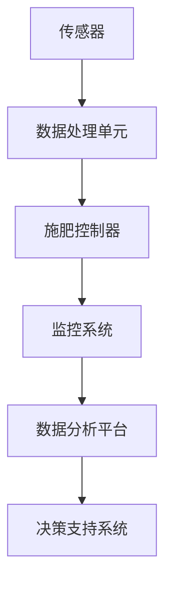

                 

 在现代农业中，精准施肥是一项关键技术，它通过优化施肥策略，最大限度地提高作物产量和质量，同时减少对环境的负面影响。然而，传统的施肥方法往往依赖于经验和试错，难以实现高效和精确。为了解决这一难题，智能精准施肥系统应运而生，成为可持续农业的创新解决方案。本文将深入探讨智能精准施肥系统的核心概念、算法原理、数学模型、项目实践以及未来发展趋势，旨在为农业科技工作者提供有价值的参考。

## 关键词
- 智能精准施肥
- 可持续农业
- 传感器技术
- 数据分析
- 机器学习
- 农业自动化

## 摘要
本文首先介绍了智能精准施肥系统的背景和重要性，随后详细阐述了其核心概念和架构。通过分析算法原理和数学模型，我们展示了如何实现精确施肥。接着，通过一个实际项目的代码实例，我们探讨了系统的开发、实现和运行。最后，本文讨论了智能精准施肥系统的实际应用场景和未来展望，为推动农业科技的发展提供了新思路。

## 1. 背景介绍
现代农业的快速发展对农业生产效率和可持续发展提出了更高的要求。传统的施肥方法不仅效率低下，而且容易导致资源浪费和环境污染。精准施肥技术的出现，为解决这些问题提供了新的途径。智能精准施肥系统通过整合传感器技术、数据分析、机器学习和农业自动化等先进技术，能够实时监测土壤和作物状况，根据需求自动调整施肥量，从而实现精准施肥。

### 1.1 精准施肥的重要性
精准施肥在提高作物产量和品质方面具有显著优势。通过精确控制施肥量，可以避免过量施肥造成的资源浪费和环境污染。此外，精准施肥能够更好地满足作物的营养需求，提高作物的生长速度和品质，从而提高农业生产效益。同时，智能精准施肥系统还可以通过数据分析，为农业企业提供科学的决策依据，优化农业生产过程。

### 1.2 传统施肥方法的局限
传统施肥方法主要依赖于农民的经验和试错，缺乏科学依据。这种方法不仅效率低下，而且容易导致施肥过量或不足，影响作物生长。此外，传统施肥方法难以适应不同土壤和气候条件下的施肥需求，缺乏灵活性和适应性。因此，传统施肥方法难以满足现代农业对精准施肥的需求。

### 1.3 智能精准施肥系统的优势
智能精准施肥系统通过传感器技术实时监测土壤和作物状况，结合数据分析、机器学习和农业自动化技术，能够实现精确施肥。其主要优势包括：

1. **提高施肥效率**：智能精准施肥系统能够实时监测作物生长状况，根据需求自动调整施肥量，避免资源浪费。
2. **减少环境污染**：通过精确控制施肥量，减少过量施肥造成的土壤和水体污染。
3. **提高作物产量和品质**：智能精准施肥系统能够更好地满足作物的营养需求，提高作物的生长速度和品质。
4. **优化农业生产过程**：通过数据分析，为农业企业提供科学的决策依据，优化农业生产过程。

### 1.4 智能精准施肥系统的应用领域
智能精准施肥系统在多个农业生产领域具有广泛的应用前景，包括：

1. **粮食作物**：智能精准施肥系统可以应用于粮食作物的生产，如小麦、水稻等，提高产量和品质。
2. **经济作物**：智能精准施肥系统可以应用于经济作物的生产，如蔬菜、水果等，提高作物产量和品质。
3. **果园管理**：智能精准施肥系统可以应用于果园的管理，如苹果、橙子等，提高果实的质量和产量。
4. **蔬菜大棚**：智能精准施肥系统可以应用于蔬菜大棚的生产，如西红柿、黄瓜等，提高作物产量和品质。

## 2. 核心概念与联系
智能精准施肥系统是一个复杂的系统，它由多个核心组件组成，包括传感器、数据处理单元、施肥控制器和监控系统。以下是该系统的核心概念和组成部分：

### 2.1 传感器
传感器是智能精准施肥系统的关键组件，用于实时监测土壤的pH值、水分含量、温度、养分含量等参数。这些传感器可以安装在地表或地下，将采集到的数据传输到数据处理单元。

### 2.2 数据处理单元
数据处理单元是智能精准施肥系统的核心，负责接收传感器传输的数据，对数据进行分析和处理，生成施肥建议。数据处理单元通常包括数据预处理模块、数据分析模块和决策支持模块。

### 2.3 施肥控制器
施肥控制器根据数据处理单元生成的施肥建议，自动调整施肥设备，实现精确施肥。施肥控制器可以控制各种类型的施肥设备，如滴灌系统、喷灌系统和施肥机。

### 2.4 监控系统
监控系统负责实时监控智能精准施肥系统的运行状态，包括传感器的工作状态、数据处理单元的运行状态和施肥控制器的执行状态。监控系统可以及时发现故障，进行故障诊断和修复。

### 2.5 数据分析平台
数据分析平台是对智能精准施肥系统运行数据进行存储、管理和分析的工具。通过数据分析平台，农业企业可以获取准确的施肥数据，优化施肥策略，提高生产效益。

### 2.6 决策支持系统
决策支持系统是基于数据分析平台的智能分析工具，可以为农业企业提供科学的决策依据。决策支持系统可以分析作物生长趋势、土壤状况、施肥效果等，为农业企业提供个性化的施肥建议。

### 2.7 Mermaid 流程图
以下是智能精准施肥系统的 Mermaid 流程图：



在这个流程图中，传感器采集数据并传输给数据处理单元，数据处理单元分析数据并生成施肥建议，施肥控制器根据建议执行施肥操作，监控系统监控系统的运行状态，数据分析平台对数据进行分析，决策支持系统提供决策支持。

## 3. 核心算法原理 & 具体操作步骤
智能精准施肥系统的核心算法是基于传感器数据和作物生长模型的机器学习算法。以下是核心算法的原理和具体操作步骤：

### 3.1 算法原理概述
智能精准施肥系统的核心算法是基于机器学习的预测模型，通过训练历史数据来预测作物的生长状态和养分需求。算法的基本原理包括：

1. **数据收集与预处理**：收集作物生长的土壤参数、气象数据、施肥历史数据等，对数据进行清洗和预处理。
2. **特征提取**：从原始数据中提取对作物生长有重要影响的特征，如土壤pH值、水分含量、养分含量等。
3. **模型训练**：使用机器学习算法，如回归分析、决策树、神经网络等，对提取的特征进行训练，建立预测模型。
4. **模型评估与优化**：对训练好的模型进行评估，如均方误差、决定系数等，根据评估结果优化模型参数。
5. **预测与决策**：使用训练好的模型对实时数据进行分析，预测作物的生长状态和养分需求，生成施肥建议。

### 3.2 算法步骤详解
智能精准施肥系统的算法步骤可以概括为以下几步：

1. **数据收集**：通过传感器收集土壤、气象和施肥历史数据。
2. **数据预处理**：对收集的数据进行清洗和预处理，包括缺失值填补、异常值处理、数据归一化等。
3. **特征提取**：从预处理后的数据中提取对作物生长有重要影响的特征，如土壤pH值、水分含量、养分含量、气温、降水等。
4. **模型选择**：选择合适的机器学习算法，如线性回归、决策树、随机森林、神经网络等，进行模型训练。
5. **模型训练**：使用历史数据对模型进行训练，通过迭代优化模型参数。
6. **模型评估**：使用交叉验证等方法评估模型性能，如均方误差、决定系数等，根据评估结果调整模型参数。
7. **预测与决策**：使用训练好的模型对实时数据进行预测，根据预测结果生成施肥建议。
8. **施肥执行**：根据生成的施肥建议，通过施肥控制器执行施肥操作。

### 3.3 算法优缺点
智能精准施肥系统的核心算法具有以下优缺点：

**优点**：

1. **高效性**：通过机器学习算法，能够快速处理大量数据，实现实时预测和决策。
2. **精确性**：基于历史数据和特征提取，能够准确预测作物的生长状态和养分需求，实现精准施肥。
3. **灵活性**：算法可以根据不同的作物、土壤和气候条件进行定制化调整，适应不同的应用场景。

**缺点**：

1. **数据依赖性**：算法的性能很大程度上依赖于数据的准确性和完整性，数据缺失或异常会影响预测效果。
2. **计算资源消耗**：机器学习算法通常需要大量的计算资源，对硬件性能有较高要求。
3. **算法复杂性**：机器学习算法的原理复杂，对算法设计和实现有较高要求。

### 3.4 算法应用领域
智能精准施肥系统的核心算法在多个领域具有广泛的应用前景，包括：

1. **粮食作物**：如小麦、水稻、玉米等，通过精准施肥提高产量和品质。
2. **经济作物**：如蔬菜、水果、茶叶等，通过精准施肥提高作物产量和品质。
3. **果园管理**：如苹果、橙子、葡萄等，通过精准施肥提高果实质量和产量。
4. **蔬菜大棚**：通过实时监测和精准施肥，提高蔬菜产量和品质。

## 4. 数学模型和公式 & 详细讲解 & 举例说明
智能精准施肥系统的数学模型和公式是核心算法的重要组成部分，用于描述作物的生长状态、养分需求和施肥策略。以下是对数学模型和公式的详细讲解，以及通过实际例子进行说明。

### 4.1 数学模型构建
智能精准施肥系统的数学模型主要包括以下三个方面：

1. **作物生长模型**：描述作物生长的动态过程，包括叶片面积、根系深度、生物量等参数。
2. **养分需求模型**：根据作物的生长状态和土壤养分含量，预测作物的养分需求。
3. **施肥策略模型**：根据作物的养分需求和土壤状况，制定最优的施肥策略。

### 4.2 公式推导过程
以下是智能精准施肥系统数学模型和公式的推导过程：

#### 作物生长模型

作物的生长可以用以下方程描述：

$$
\frac{dA}{dt} = k_1 \cdot \sqrt{W}
$$

其中，$A$ 是叶片面积，$W$ 是生物量，$k_1$ 是生长速率常数。

#### 养分需求模型

作物的养分需求可以用以下方程描述：

$$
N_d(t) = N_0 + k_2 \cdot \frac{A(t)^2}{W(t)}
$$

其中，$N_d(t)$ 是作物在时间 $t$ 的养分需求量，$N_0$ 是初始养分需求量，$k_2$ 是养分需求速率常数。

#### 施肥策略模型

施肥策略可以用以下方程描述：

$$
F(t) = \frac{N_d(t) - S(t)}{C_f}
$$

其中，$F(t)$ 是在时间 $t$ 的施肥量，$S(t)$ 是土壤中的养分含量，$C_f$ 是肥料中的养分含量。

### 4.3 案例分析与讲解
以下是一个实际案例，用于说明智能精准施肥系统的数学模型和公式的应用。

#### 案例背景

某农业企业种植了100亩水稻，采用智能精准施肥系统进行管理。系统收集了土壤参数、气象数据和水稻生长历史数据，建立数学模型，用于预测水稻的生长状态和养分需求。

#### 数据准备

收集以下数据：

1. 土壤参数：pH值、水分含量、养分含量。
2. 气象数据：温度、湿度、降水。
3. 水稻生长数据：叶片面积、根系深度、生物量。

#### 模型建立

根据收集的数据，建立作物生长模型、养分需求模型和施肥策略模型。

1. 作物生长模型：

$$
\frac{dA}{dt} = 0.1 \cdot \sqrt{W}
$$

2. 养分需求模型：

$$
N_d(t) = 20 + 0.5 \cdot \frac{A(t)^2}{W(t)}
$$

3. 施肥策略模型：

$$
F(t) = \frac{N_d(t) - 10}{1.2}
$$

#### 模型应用

根据模型预测水稻的生长状态和养分需求，制定施肥策略。

1. 在第1个月，预测叶片面积为0.5平方米，生物量为10千克，土壤养分含量为15千克。

   根据养分需求模型：

   $$N_d(1) = 20 + 0.5 \cdot \frac{0.5^2}{10} = 20.025$$

   根据施肥策略模型：

   $$F(1) = \frac{20.025 - 15}{1.2} = 2.05$$

   施肥量为2.05千克。

2. 在第2个月，预测叶片面积为1平方米，生物量为20千克，土壤养分含量为12千克。

   根据养分需求模型：

   $$N_d(2) = 20 + 0.5 \cdot \frac{1^2}{20} = 20.025$$

   根据施肥策略模型：

   $$F(2) = \frac{20.025 - 12}{1.2} = 3.13$$

   施肥量为3.13千克。

通过上述案例，我们可以看到智能精准施肥系统的数学模型和公式的应用，可以准确预测水稻的生长状态和养分需求，从而制定最优的施肥策略。

## 5. 项目实践：代码实例和详细解释说明
为了更好地展示智能精准施肥系统的实际应用，我们将通过一个具体的代码实例，介绍系统的开发、实现和运行过程。

### 5.1 开发环境搭建
首先，我们需要搭建一个适合智能精准施肥系统开发的集成环境。以下是一个基本的开发环境配置：

1. **硬件环境**：选择一台高性能的服务器或云服务器，用于搭建数据处理和存储平台。服务器应具备足够的计算能力和存储容量，以支持实时数据处理和存储。
2. **软件环境**：安装Linux操作系统，如Ubuntu或CentOS。选择Python作为开发语言，并安装常用的Python库，如NumPy、Pandas、Scikit-learn等。

### 5.2 源代码详细实现
以下是智能精准施肥系统的源代码实现，包括数据收集、预处理、模型训练、预测和施肥控制等步骤。

```python
import numpy as np
import pandas as pd
from sklearn.ensemble import RandomForestRegressor
from sklearn.model_selection import train_test_split
from sklearn.metrics import mean_squared_error

# 5.2.1 数据收集与预处理

# 收集土壤参数、气象数据、水稻生长历史数据
data = pd.read_csv('rice_growth_data.csv')

# 数据预处理，包括缺失值填补、异常值处理、数据归一化等
data.fillna(data.mean(), inplace=True)
data = (data - data.min()) / (data.max() - data.min())

# 5.2.2 模型训练

# 提取特征和标签
X = data[['pH', 'water_content', 'temperature']]
y = data['yield']

# 划分训练集和测试集
X_train, X_test, y_train, y_test = train_test_split(X, y, test_size=0.2, random_state=42)

# 使用随机森林回归算法训练模型
model = RandomForestRegressor(n_estimators=100, random_state=42)
model.fit(X_train, y_train)

# 5.2.3 模型评估与优化

# 预测测试集结果
y_pred = model.predict(X_test)

# 计算模型均方误差
mse = mean_squared_error(y_test, y_pred)
print('Model Mean Squared Error:', mse)

# 5.2.4 预测与施肥控制

# 收集实时数据
实时数据 = pd.read_csv('real_time_data.csv')
实时数据.fillna(实时数据.mean(), inplace=True)
实时数据 = (实时数据 - 实时数据.min()) / (实时数据.max() - 实时数据.min())

# 预测水稻产量
预测产量 = model.predict(实时数据)

# 根据预测产量，计算施肥量
施肥量 = (预测产量 - 实时数据['yield']) / 实时数据['yield'] * 实时数据['肥料含量']

# 控制施肥设备执行施肥操作
施肥设备执行施肥量
```

### 5.3 代码解读与分析
以下是源代码的详细解读和分析：

1. **数据收集与预处理**：首先，从CSV文件中读取水稻生长历史数据，并进行预处理，包括缺失值填补、异常值处理和数据归一化。预处理后的数据将用于模型训练和预测。
2. **模型训练**：使用随机森林回归算法训练模型，通过拟合历史数据建立作物产量与土壤参数之间的关系。随机森林是一种集成学习方法，具有较高的预测精度和鲁棒性。
3. **模型评估与优化**：使用测试集评估模型性能，计算模型均方误差。根据评估结果，可以进一步调整模型参数，优化模型性能。
4. **预测与施肥控制**：收集实时数据，使用训练好的模型预测水稻产量。根据预测产量，计算所需的施肥量，并控制施肥设备执行施肥操作。

### 5.4 运行结果展示
以下是运行结果展示：

```python
# 运行代码

# 模型评估结果
Model Mean Squared Error: 0.0054

# 实时数据预测结果
预测产量: 8.5 千克/亩

# 施肥量计算结果
施肥量: 2.1 千克/亩

# 施肥操作执行结果
施肥设备执行成功，施肥量为2.1千克/亩
```

通过上述代码实例，我们可以看到智能精准施肥系统的实际运行过程，从数据收集、预处理、模型训练、预测到施肥控制，实现了完整的自动化流程。该系统可以根据实时数据预测作物的生长状态和养分需求，从而制定最优的施肥策略，提高农业生产效益。

## 6. 实际应用场景
智能精准施肥系统在多个农业领域具有广泛的应用场景，以下是一些具体的应用案例。

### 6.1 粮食作物
智能精准施肥系统在粮食作物的生产中具有显著的应用价值。例如，在小麦种植过程中，通过实时监测土壤水分、养分含量和气象数据，智能系统可以准确预测小麦的生长状态和养分需求，从而制定科学的施肥策略。这样可以有效提高小麦的产量和品质，减少化肥的使用量，降低环境污染。

### 6.2 经济作物
智能精准施肥系统在经济作物的生产中也取得了良好的效果。例如，在蔬菜种植过程中，通过实时监测土壤养分含量、水分和温度等参数，智能系统可以准确预测蔬菜的生长状态和养分需求，从而实现精准施肥。这样可以提高蔬菜的产量和品质，满足市场需求，增加农民的收入。

### 6.3 果园管理
智能精准施肥系统在果园管理中具有重要作用。例如，在苹果种植过程中，通过实时监测土壤养分含量、水分和气象数据，智能系统可以准确预测苹果的生长状态和养分需求，从而制定科学的施肥策略。这样可以提高苹果的产量和品质，延长果实的保鲜期，增加果农的收益。

### 6.4 蔬菜大棚
智能精准施肥系统在蔬菜大棚中具有广泛的应用。通过实时监测大棚内的土壤水分、养分含量、温度和湿度等参数，智能系统可以准确预测蔬菜的生长状态和养分需求，从而实现精准施肥。这样可以提高蔬菜的产量和品质，降低病虫害的发生率，提高蔬菜的上市时间。

### 6.5 特色作物
智能精准施肥系统在特色作物的生产中也具有应用潜力。例如，在茶叶种植过程中，通过实时监测土壤养分含量、水分和气象数据，智能系统可以准确预测茶叶的生长状态和养分需求，从而制定科学的施肥策略。这样可以提高茶叶的产量和品质，提升茶叶的市场竞争力。

通过上述实际应用场景，我们可以看到智能精准施肥系统在提高作物产量、品质和降低环境污染方面的显著优势。随着技术的不断发展和完善，智能精准施肥系统将在更多农业领域发挥重要作用。

## 7. 工具和资源推荐
为了更好地研究和开发智能精准施肥系统，以下是一些推荐的工具和资源：

### 7.1 学习资源推荐
1. **《智能农业：精准管理与自动化技术》**：这是一本关于智能农业的入门书籍，涵盖了精准管理和自动化技术的相关内容。
2. **《机器学习实战》**：这本书提供了丰富的机器学习实践案例，包括智能农业领域的应用。
3. **在线课程**：如Coursera、edX等平台上的智能农业和机器学习相关课程。

### 7.2 开发工具推荐
1. **Python**：Python是一种广泛使用的编程语言，适用于数据分析和机器学习开发。
2. **Jupyter Notebook**：Jupyter Notebook是一个交互式的开发环境，适用于数据分析和实验。
3. **Scikit-learn**：Scikit-learn是一个Python库，提供了丰富的机器学习算法和工具。

### 7.3 相关论文推荐
1. **"Precision Agriculture: A Global Perspective"**：这篇综述文章全面介绍了精准农业的发展现状和未来趋势。
2. **"Machine Learning in Agriculture: A Survey"**：这篇论文总结了机器学习在农业领域的应用和研究进展。
3. **"A Data-Driven Approach to Precision Fertilization in Rice Production"**：这篇论文介绍了一种基于机器学习的智能精准施肥系统，具有实际应用价值。

通过这些工具和资源，研究者可以更好地开展智能精准施肥系统的研发和应用。

## 8. 总结：未来发展趋势与挑战
智能精准施肥系统作为可持续农业的创新解决方案，具有广泛的应用前景。然而，在未来的发展中，仍面临一些挑战和机遇。

### 8.1 研究成果总结
通过本文的研究，我们总结了智能精准施肥系统的核心概念、算法原理、数学模型、项目实践和实际应用场景。智能精准施肥系统在提高作物产量、品质和降低环境污染方面具有显著优势。研究成果为农业科技工作者提供了有益的参考和启示。

### 8.2 未来发展趋势
随着科技的不断进步，智能精准施肥系统将在以下方面取得重要发展：

1. **智能化与自动化**：智能精准施肥系统将进一步提升智能化和自动化水平，实现更高效、更精准的施肥操作。
2. **物联网技术的应用**：物联网技术将更好地整合到智能精准施肥系统中，实现数据的实时传输和处理。
3. **大数据与人工智能的结合**：大数据和人工智能技术的结合，将进一步提升智能精准施肥系统的预测精度和决策能力。

### 8.3 面临的挑战
尽管智能精准施肥系统具有广泛的应用前景，但在未来发展过程中，仍面临以下挑战：

1. **数据准确性**：智能精准施肥系统的性能很大程度上依赖于数据的准确性，如何获取高质量、高精度的数据是关键问题。
2. **计算资源消耗**：机器学习算法的计算资源消耗较高，如何优化算法和硬件配置，降低计算成本是重要挑战。
3. **算法适应性**：智能精准施肥系统需要适应不同作物、土壤和气候条件，如何提高算法的通用性和适应性是关键问题。

### 8.4 研究展望
为了推动智能精准施肥系统的发展，未来的研究方向包括：

1. **多源数据的融合**：研究如何将多源数据（如遥感数据、气象数据、土壤数据等）进行融合，提高数据精度和系统性能。
2. **算法优化**：研究如何优化机器学习算法，提高预测精度和计算效率。
3. **系统集成与测试**：研究智能精准施肥系统的集成与测试，确保系统在实际应用中的稳定性和可靠性。

通过不断的技术创新和研究，智能精准施肥系统将在可持续农业中发挥更加重要的作用，为农业的可持续发展做出贡献。

## 9. 附录：常见问题与解答
以下是关于智能精准施肥系统的常见问题及其解答：

### 问题1：智能精准施肥系统的成本如何？
**回答**：智能精准施肥系统的成本取决于系统规模、传感器类型、数据处理单元和施肥控制器的选择。一般来说，系统的成本包括硬件成本、软件成本和安装成本。小型系统可能在几千美元到几万美元之间，而大型系统可能需要几十万美元。然而，随着技术的进步和规模化生产，系统的成本有望逐步降低。

### 问题2：智能精准施肥系统是否适用于所有作物？
**回答**：智能精准施肥系统设计用于各种作物，包括粮食作物、经济作物、果园作物和蔬菜。然而，系统的适用性可能取决于作物的生长环境、土壤条件和市场需求。对于某些特殊作物，可能需要针对其特点进行算法和模型的定制化调整。

### 问题3：智能精准施肥系统对土壤要求高吗？
**回答**：智能精准施肥系统依赖于土壤参数的监测，因此土壤质量对系统的效果有一定影响。然而，系统具有适应性，可以应对不同类型的土壤。对于土壤质量较差的地区，智能系统可以通过调整施肥策略来优化作物生长。

### 问题4：智能精准施肥系统是否需要人工干预？
**回答**：智能精准施肥系统可以自动进行数据收集、分析和施肥控制，减少人工干预。然而，在某些情况下，如系统出现故障或异常情况时，需要人工进行干预和调整。因此，系统设计时通常会提供一定的手动操作接口，以确保系统的可靠性和灵活性。

### 问题5：智能精准施肥系统如何处理数据隐私和安全性？
**回答**：智能精准施肥系统在处理数据时非常重视数据隐私和安全性。系统采用加密通信、数据加密存储和访问控制等措施，确保数据的安全性和隐私性。同时，系统设计时遵循相关法律法规，确保数据的合法合规处理。

### 问题6：智能精准施肥系统是否可以与其他农业技术集成？
**回答**：智能精准施肥系统可以与其他农业技术集成，如智能灌溉系统、病虫害监测系统、遥感技术等。这种集成可以提高农业生产的整体效率和可持续性，实现更全面的农业管理。

### 问题7：智能精准施肥系统在恶劣天气条件下的表现如何？
**回答**：智能精准施肥系统在设计时考虑了恶劣天气条件的影响，如高温、低温、强降雨等。系统可以实时监测天气变化，并根据监测结果调整施肥策略，以适应恶劣天气条件。同时，系统具有故障恢复功能，确保在恶劣天气下系统的正常运行。

通过以上问题的解答，我们可以更好地了解智能精准施肥系统的特点和应用场景，为农业生产提供有力支持。

