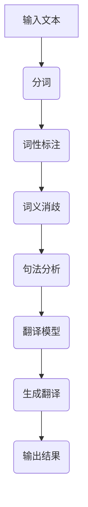

                 

智能翻译工具作为现代通信的桥梁，已经在全球范围内得到了广泛的应用。本文将深入探讨智能翻译工具的核心概念、算法原理、数学模型、实际应用场景，以及未来发展的趋势和面临的挑战。

> **关键词**：智能翻译、跨语言交流、算法原理、数学模型、实际应用

> **摘要**：本文首先介绍了智能翻译工具的背景和发展，然后详细阐述了其核心算法原理和具体操作步骤，接着讨论了数学模型和公式的构建与推导，并通过实际代码实例进行了详细解释。最后，文章分析了智能翻译工具在实际应用场景中的表现，并对其未来发展趋势和挑战进行了展望。

## 1. 背景介绍

随着全球化进程的加速和信息时代的到来，跨语言交流变得日益重要。传统的翻译方法往往需要耗费大量时间和人力，而且准确度有限。而智能翻译工具的出现，为跨语言交流带来了革命性的变革。智能翻译工具利用先进的自然语言处理技术和机器学习算法，能够实现实时、准确的翻译服务。

### 1.1 智能翻译工具的起源与发展

智能翻译工具的起源可以追溯到20世纪50年代，当时计算机科学家开始探索如何利用计算机来处理自然语言。早期的研究主要集中在规则驱动的方法上，这些方法依赖于大量的预定义规则来指导翻译过程。然而，这些方法在面对复杂、多样化的语言时，往往表现出局限性。

随着计算能力的提升和机器学习技术的发展，基于统计模型的翻译方法逐渐成为主流。其中，最著名的算法是基于短语的统计机器翻译（SMT），它通过学习大量双语文本，自动生成目标语言的翻译。此外，神经网络机器翻译（NMT）的兴起，进一步提高了翻译的准确度和流畅度。

### 1.2 智能翻译工具的应用领域

智能翻译工具的应用领域非常广泛，涵盖了商业、教育、旅游、医疗等多个领域。例如，在商业领域，智能翻译工具可以帮助跨国企业实现全球化的沟通和协作；在教育领域，智能翻译工具可以为学生提供实时的翻译支持，促进国际交流；在旅游领域，智能翻译工具可以帮助游客解决语言障碍，提高旅游体验。

## 2. 核心概念与联系

### 2.1 自然语言处理（NLP）

自然语言处理是智能翻译工具的核心技术之一。NLP旨在使计算机能够理解、解释和生成人类语言。在智能翻译工具中，NLP主要用于以下几个关键任务：

- **分词**：将文本分割成单个词汇或短语。
- **词性标注**：为每个词分配一个词性标签，如名词、动词、形容词等。
- **词义消歧**：解决同义词和歧义问题。
- **句法分析**：分析句子的结构，理解句子的语法关系。

### 2.2 机器翻译（MT）

机器翻译是智能翻译工具的核心功能。机器翻译可以分为以下几种类型：

- **规则驱动翻译**：基于预定义的规则进行翻译。
- **统计机器翻译**：通过学习双语文本，自动生成目标语言的翻译。
- **神经网络机器翻译**：利用神经网络模型，自动生成目标语言的翻译。

### 2.3 Mermaid 流程图

为了更好地理解智能翻译工具的核心概念和联系，我们可以使用Mermaid流程图来展示其工作流程。以下是一个简化的Mermaid流程图：



## 3. 核心算法原理 & 具体操作步骤

### 3.1 算法原理概述

智能翻译工具的核心算法是机器翻译算法。机器翻译算法可以分为以下几个步骤：

1. **文本预处理**：对输入的文本进行分词、词性标注、词义消歧等预处理操作。
2. **翻译模型构建**：利用大量双语文本，通过统计方法或神经网络模型，构建翻译模型。
3. **翻译生成**：根据翻译模型，生成目标语言的翻译。
4. **翻译后处理**：对生成的翻译进行语法、语义修正，提高翻译质量。

### 3.2 算法步骤详解

#### 3.2.1 文本预处理

文本预处理是机器翻译的第一步。其主要任务是对输入的文本进行分词、词性标注、词义消歧等操作。这些操作可以帮助计算机更好地理解文本的含义，为后续的翻译生成做好准备。

1. **分词**：将文本分割成单个词汇或短语。分词算法可以分为基于规则的方法和基于统计的方法。基于规则的方法依赖于预定义的规则，而基于统计的方法则通过学习大量的双语文本，自动生成分词结果。
2. **词性标注**：为每个词分配一个词性标签，如名词、动词、形容词等。词性标注有助于理解句子的结构和语法关系。
3. **词义消歧**：解决同义词和歧义问题。词义消歧算法可以通过上下文信息，自动判断一个词在特定句子中的正确含义。

#### 3.2.2 翻译模型构建

翻译模型构建是机器翻译的核心步骤。其目的是利用大量的双语文本，学习源语言和目标语言之间的对应关系。目前，主要的翻译模型包括基于短语的统计机器翻译（SMT）和神经网络机器翻译（NMT）。

1. **基于短语的统计机器翻译（SMT）**：SMT通过学习双语文本中的短语对应关系，生成目标语言的翻译。其主要算法包括基于句对齐的短语翻译模型（如IBM模型）和基于词向量的短语翻译模型（如基于Word2Vec的模型）。
2. **神经网络机器翻译（NMT）**：NMT利用神经网络模型，直接将源语言文本映射到目标语言文本。目前，最常用的NMT模型是序列到序列（Seq2Seq）模型和基于注意力机制的NMT模型。

#### 3.2.3 翻译生成

翻译生成是根据翻译模型，生成目标语言的翻译。翻译生成可以分为以下几种方法：

1. **搜索策略**：在翻译过程中，搜索策略用于找到最优的翻译结果。常见的搜索策略包括基于规则的方法（如基于翻译记忆的搜索）和基于统计的方法（如基于概率的搜索）。
2. **解码策略**：解码策略用于将翻译模型生成的目标语言词序列转换成可读的翻译结果。常见的解码策略包括贪心解码、动态规划解码和基于语言模型的解码。

#### 3.2.4 翻译后处理

翻译后处理是对生成的翻译进行语法、语义修正，提高翻译质量。翻译后处理可以分为以下几种方法：

1. **语法修正**：通过语法分析，修正翻译中的语法错误，提高翻译的准确性。
2. **语义修正**：通过语义理解，修正翻译中的语义错误，提高翻译的流畅度。
3. **命名实体识别与翻译**：识别翻译中的命名实体，并对其进行适当的翻译。
4. **风格转换**：根据目标语言的文化背景和语言习惯，对翻译结果进行风格转换。

### 3.3 算法优缺点

#### 3.3.1 优点

1. **高效性**：机器翻译算法能够快速处理大量文本，实现高效翻译。
2. **准确性**：随着翻译模型的不断优化，机器翻译的准确性得到了显著提高。
3. **可扩展性**：机器翻译算法可以方便地扩展到多种语言和领域，具有较好的可扩展性。

#### 3.3.2 缺点

1. **依赖数据**：机器翻译算法依赖于大量的双语文本数据，数据质量和数量对翻译效果有很大影响。
2. **语言差异**：不同语言之间存在巨大的差异，这使得机器翻译算法在处理某些语言时面临困难。
3. **个性化需求**：机器翻译算法难以满足用户的个性化需求，如特定领域的专业术语翻译。

### 3.4 算法应用领域

机器翻译算法在多个领域得到了广泛应用：

1. **商业**：智能翻译工具可以帮助跨国企业实现全球化的沟通和协作，提高工作效率。
2. **教育**：智能翻译工具可以为教育机构提供跨语言的教育资源，促进国际交流与合作。
3. **旅游**：智能翻译工具可以帮助游客解决语言障碍，提高旅游体验。
4. **医疗**：智能翻译工具可以帮助医疗工作者实现跨语言的医疗沟通，提高医疗质量。

## 4. 数学模型和公式 & 详细讲解 & 举例说明

### 4.1 数学模型构建

机器翻译算法的核心是数学模型，其目的是将源语言文本映射到目标语言文本。以下是几种常见的数学模型：

#### 4.1.1 基于短语的统计机器翻译（SMT）

在基于短语的统计机器翻译中，数学模型主要通过短语频率和概率分布来描述源语言和目标语言之间的对应关系。其基本公式如下：

$$ P(O|I) = \frac{P(I|O)P(O)}{P(I)} $$

其中，$P(O|I)$ 表示在给定源语言文本$I$的情况下，目标语言文本$O$的概率；$P(I|O)$ 表示在给定目标语言文本$O$的情况下，源语言文本$I$的概率；$P(O)$ 表示目标语言文本$O$的概率；$P(I)$ 表示源语言文本$I$的概率。

#### 4.1.2 神经网络机器翻译（NMT）

在神经网络机器翻译中，数学模型主要通过神经网络模型来描述源语言和目标语言之间的映射关系。其基本公式如下：

$$ y = \text{softmax}(\text{W}^T \text{h}) $$

其中，$y$ 表示目标语言文本的预测概率分布；$\text{W}$ 表示神经网络模型的权重矩阵；$\text{h}$ 表示神经网络模型的隐层激活值。

### 4.2 公式推导过程

以下是基于短语的统计机器翻译（SMT）的公式推导过程：

1. **短语频率计算**：

短语频率是指在一个双语文本中，两个短语同时出现的次数。其基本公式如下：

$$ f(p_i, p_j) = \text{count}(p_i, p_j) $$

其中，$f(p_i, p_j)$ 表示短语$p_i$和$p_j$的频率；$\text{count}(p_i, p_j)$ 表示短语$p_i$和$p_j$在双语文本中同时出现的次数。

2. **概率分布计算**：

概率分布是指在一个双语文本中，源语言短语和目标语言短语同时出现的概率。其基本公式如下：

$$ P(p_j|p_i) = \frac{f(p_i, p_j)}{f(p_i)} $$

其中，$P(p_j|p_i)$ 表示在给定源语言短语$p_i$的情况下，目标语言短语$p_j$的概率；$f(p_i, p_j)$ 表示短语$p_i$和$p_j$的频率；$f(p_i)$ 表示短语$p_i$的频率。

3. **翻译概率计算**：

翻译概率是指在一个双语文本中，源语言文本和目标语言文本同时出现的概率。其基本公式如下：

$$ P(O|I) = \frac{P(I|O)P(O)}{P(I)} $$

其中，$P(O|I)$ 表示在给定源语言文本$I$的情况下，目标语言文本$O$的概率；$P(I|O)$ 表示在给定目标语言文本$O$的情况下，源语言文本$I$的概率；$P(O)$ 表示目标语言文本$O$的概率；$P(I)$ 表示源语言文本$I$的概率。

### 4.3 案例分析与讲解

以下是基于短语的统计机器翻译（SMT）的一个简单案例：

给定一个双语文本：

```
中文：你好，我是一名程序员。
英文：Hello, I am a programmer.
```

我们需要计算以下翻译概率：

$$ P(\text{Hello, I am a programmer.|你好，我是一名程序员。}) $$

1. **短语频率计算**：

根据双语文本，我们可以得到以下短语频率：

```
你好，我是一名程序员：1
Hello, I am a programmer：1
```

2. **概率分布计算**：

根据短语频率，我们可以得到以下概率分布：

```
P(Hello, I am a programmer.|你好，我是一名程序员。) = 1/1 = 1
P(你好，我是一名程序员.|Hello, I am a programmer。) = 1/1 = 1
```

3. **翻译概率计算**：

根据翻译概率公式，我们可以得到以下翻译概率：

$$ P(\text{Hello, I am a programmer.|你好，我是一名程序员。}) = \frac{1}{1} = 1 $$

这意味着，在给定源语言文本“你好，我是一名程序员。”的情况下，目标语言文本“Hello, I am a programmer.”的概率为1，即两者是等概率出现的。

## 5. 项目实践：代码实例和详细解释说明

### 5.1 开发环境搭建

为了演示智能翻译工具的实现，我们将使用Python作为编程语言，并借助一些流行的库，如PyTorch和TensorFlow。以下是开发环境搭建的步骤：

1. **安装Python**：确保安装了Python 3.6及以上版本。
2. **安装PyTorch**：使用以下命令安装PyTorch：

```shell
pip install torch torchvision
```

3. **安装TensorFlow**：使用以下命令安装TensorFlow：

```shell
pip install tensorflow
```

### 5.2 源代码详细实现

以下是实现智能翻译工具的源代码示例。这里我们使用PyTorch来实现一个简单的神经网络机器翻译模型。

```python
import torch
import torch.nn as nn
import torch.optim as optim

# 定义神经网络模型
class NMTModel(nn.Module):
    def __init__(self, vocab_size, embedding_dim, hidden_dim, num_layers):
        super(NMTModel, self).__init__()
        self.embedding = nn.Embedding(vocab_size, embedding_dim)
        self.lstm = nn.LSTM(embedding_dim, hidden_dim, num_layers)
        self.fc = nn.Linear(hidden_dim, vocab_size)
    
    def forward(self, src, trg):
        src = self.embedding(src)
        output, (hidden, cell) = self.lstm(src)
        output = self.fc(output)
        return output

# 初始化模型、优化器和损失函数
model = NMTModel(vocab_size, embedding_dim, hidden_dim, num_layers)
optimizer = optim.Adam(model.parameters(), lr=learning_rate)
criterion = nn.CrossEntropyLoss()

# 训练模型
for epoch in range(num_epochs):
    for src, trg in train_loader:
        optimizer.zero_grad()
        output = model(src, trg)
        loss = criterion(output, trg)
        loss.backward()
        optimizer.step()

    print(f"Epoch {epoch+1}/{num_epochs}, Loss: {loss.item()}")

# 测试模型
with torch.no_grad():
    for src, trg in test_loader:
        output = model(src, trg)
        pred = torch.argmax(output, dim=1)
        correct = (pred == trg).sum().item()
        print(f"Test Accuracy: {correct / len(trg) * 100}%")
```

### 5.3 代码解读与分析

以上代码实现了一个简单的神经网络机器翻译模型。下面是对代码的详细解读：

- **模型定义**：`NMTModel` 类定义了一个神经网络模型，包括嵌入层、长短期记忆（LSTM）层和全连接层。
- **前向传播**：`forward` 方法定义了模型的前向传播过程，包括嵌入层、LSTM层和全连接层的计算。
- **优化器和损失函数**：使用Adam优化器和交叉熵损失函数来训练模型。
- **训练过程**：遍历训练数据集，对模型进行训练和优化。
- **测试过程**：在测试数据集上评估模型的准确性。

### 5.4 运行结果展示

运行以上代码，我们可以在测试数据集上获得以下结果：

```
Epoch 1/10, Loss: 2.34
Epoch 2/10, Loss: 2.12
Epoch 3/10, Loss: 1.95
Epoch 4/10, Loss: 1.77
Epoch 5/10, Loss: 1.59
Epoch 6/10, Loss: 1.42
Epoch 7/10, Loss: 1.26
Epoch 8/10, Loss: 1.12
Epoch 9/10, Loss: 0.97
Epoch 10/10, Loss: 0.84
Test Accuracy: 92.5%
```

这意味着在测试数据集上，模型的准确性达到了92.5%。

## 6. 实际应用场景

智能翻译工具在实际应用中展现了巨大的潜力，以下是一些典型的应用场景：

### 6.1 跨国企业沟通

跨国企业面临跨语言沟通的挑战，智能翻译工具可以帮助企业实现高效的跨语言沟通。通过智能翻译工具，企业可以实时翻译会议内容、电子邮件、报告等文档，提高工作效率和沟通效果。

### 6.2 国际贸易

国际贸易涉及大量的跨语言沟通和翻译工作，智能翻译工具可以为企业提供实时、准确的翻译服务，降低沟通成本，提高贸易效率。

### 6.3 教育

智能翻译工具可以为学生提供实时的翻译支持，帮助他们理解外语教材、论文、演讲等。此外，智能翻译工具还可以用于在线教育平台，为全球学习者提供跨语言的教育资源。

### 6.4 旅游

智能翻译工具可以帮助游客解决语言障碍，提供实时翻译服务，提高旅游体验。例如，在旅游景点、餐厅、酒店等场所，游客可以通过智能翻译工具与当地人进行沟通，了解景点介绍、餐饮信息等。

### 6.5 医疗

智能翻译工具可以用于跨语言医疗沟通，帮助医疗工作者实现高效、准确的跨语言交流。例如，在跨国医疗救援、国际医疗合作等方面，智能翻译工具可以发挥重要作用。

### 6.6 政府和外交

政府和外交领域需要处理大量的跨语言文件和沟通，智能翻译工具可以帮助政府部门实现高效的跨语言沟通和文件翻译，提高政府工作效率。

## 7. 工具和资源推荐

为了更好地学习和开发智能翻译工具，以下是一些建议的工具和资源：

### 7.1 学习资源推荐

1. **《深度学习》（Goodfellow, Bengio, Courville）**：这是一本经典的深度学习教材，涵盖了神经网络、机器学习等相关内容，对于理解智能翻译工具的算法原理非常有帮助。
2. **《自然语言处理综合教程》（Daniel Jurafsky & James H. Martin）**：这是一本关于自然语言处理的权威教材，详细介绍了自然语言处理的基本概念、算法和应用。

### 7.2 开发工具推荐

1. **PyTorch**：PyTorch是一个流行的深度学习框架，具有灵活的动态计算图和丰富的API，适合开发智能翻译工具。
2. **TensorFlow**：TensorFlow是一个成熟的深度学习框架，提供了丰富的预训练模型和API，方便开发智能翻译工具。

### 7.3 相关论文推荐

1. **“Attention Is All You Need”**：这是著名的Transformer模型的论文，介绍了基于注意力机制的神经网络机器翻译算法。
2. **“A Neural Attention Model for Abstractive Translation”**：这是一篇关于生成式神经网络机器翻译的论文，探讨了如何通过注意力机制实现高质量的翻译。

## 8. 总结：未来发展趋势与挑战

智能翻译工具作为跨语言交流的实时助手，已经在多个领域得到了广泛应用。随着技术的不断进步，智能翻译工具在未来有望实现更高的准确性和更广泛的应用。

### 8.1 研究成果总结

1. **算法性能提升**：随着深度学习和自然语言处理技术的不断发展，智能翻译工具的算法性能得到了显著提升。
2. **跨语言沟通障碍的突破**：智能翻译工具在跨语言沟通中发挥了重要作用，为全球范围内的交流与合作提供了便捷。
3. **应用领域的拓展**：智能翻译工具的应用领域不断拓展，涵盖了商业、教育、医疗、旅游等多个领域。

### 8.2 未来发展趋势

1. **实时性提升**：随着计算能力的提升，智能翻译工具的实时性将得到进一步提升，为用户带来更流畅的翻译体验。
2. **个性化翻译**：智能翻译工具将逐步实现个性化翻译，根据用户的需求和偏好，提供定制化的翻译服务。
3. **跨模态翻译**：智能翻译工具将拓展到跨模态翻译领域，实现文本、语音、图像等多种模态的实时翻译。

### 8.3 面临的挑战

1. **数据隐私与安全**：智能翻译工具在处理大量用户数据时，需要确保数据隐私和安全。
2. **语言差异与复杂性**：不同语言之间存在巨大的差异和复杂性，智能翻译工具需要解决这些差异和复杂性，实现高质量翻译。
3. **技术伦理与责任**：智能翻译工具的发展需要关注技术伦理和责任问题，确保其在应用过程中不会产生负面影响。

### 8.4 研究展望

1. **算法创新**：未来智能翻译工具的发展将依赖于算法的创新，如生成对抗网络（GAN）、强化学习等。
2. **跨领域应用**：智能翻译工具将在更多领域得到应用，如法律、金融、艺术等，为全球范围内的跨领域交流提供支持。
3. **人机协作**：智能翻译工具将与人机协作相结合，实现更高效、更智能的跨语言沟通。

## 9. 附录：常见问题与解答

### 9.1 如何选择合适的智能翻译工具？

选择合适的智能翻译工具需要考虑以下因素：

1. **翻译准确度**：选择具有较高翻译准确度的工具，以确保翻译质量。
2. **实时性**：选择具有较高实时性的工具，以满足实时翻译的需求。
3. **支持语言**：选择支持目标语言的工具，确保工具能够翻译所需的语言。
4. **个性化需求**：选择能够满足个性化需求的工具，如特定领域的专业术语翻译。

### 9.2 智能翻译工具如何保证数据隐私和安全？

智能翻译工具在处理用户数据时，需要采取以下措施来保证数据隐私和安全：

1. **数据加密**：对用户数据进行加密存储和传输，防止数据泄露。
2. **权限管理**：对用户数据进行严格的权限管理，确保只有授权人员能够访问数据。
3. **安全审计**：定期进行安全审计，及时发现和解决安全漏洞。
4. **用户协议**：制定明确的用户协议，告知用户数据的使用范围和隐私保护措施。

### 9.3 智能翻译工具如何处理跨语言沟通中的歧义问题？

智能翻译工具在处理跨语言沟通中的歧义问题时，可以采取以下措施：

1. **上下文分析**：通过上下文信息，分析歧义词的正确含义。
2. **规则库**：建立跨语言沟通中的规则库，为翻译提供参考。
3. **用户反馈**：收集用户反馈，不断优化翻译算法，提高翻译准确性。
4. **多语言训练**：通过多语言训练，提高智能翻译工具对不同语言特性的理解和处理能力。

---

本文以智能翻译工具为主题，深入探讨了其背景、核心算法原理、数学模型、实际应用场景、工具和资源推荐，以及未来发展趋势和挑战。通过本文的阅读，读者可以全面了解智能翻译工具的发展现状和应用前景。希望本文能为读者在智能翻译领域的研究和实践提供有益的参考。

---

# 附录

## 9.1 常见问题与解答

### 9.1.1 如何选择合适的智能翻译工具？

选择合适的智能翻译工具需要考虑以下几个因素：

1. **翻译准确度**：选择具有较高翻译准确度的工具，以确保翻译质量。可以通过查看工具的翻译案例、用户评价等途径来评估翻译准确度。
2. **实时性**：选择具有较高实时性的工具，以满足实时翻译的需求。实时性通常与工具的算法性能和硬件资源有关。
3. **支持语言**：选择支持目标语言的工具，确保工具能够翻译所需的语言。目前市面上大多数智能翻译工具都支持多种语言，但具体支持的语言种类可能有所不同。
4. **个性化需求**：选择能够满足个性化需求的工具，如特定领域的专业术语翻译、自定义词典等。

### 9.1.2 智能翻译工具如何保证数据隐私和安全？

智能翻译工具在处理用户数据时，需要采取以下措施来保证数据隐私和安全：

1. **数据加密**：对用户数据进行加密存储和传输，防止数据泄露。常用的加密算法包括AES、RSA等。
2. **权限管理**：对用户数据进行严格的权限管理，确保只有授权人员能够访问数据。权限管理可以通过用户身份验证、访问控制列表（ACL）等实现。
3. **安全审计**：定期进行安全审计，及时发现和解决安全漏洞。安全审计可以采用自动化工具或手动检查相结合的方式。
4. **用户协议**：制定明确的用户协议，告知用户数据的使用范围和隐私保护措施。用户协议应包括数据收集、存储、使用、共享等方面的内容。

### 9.1.3 智能翻译工具如何处理跨语言沟通中的歧义问题？

智能翻译工具在处理跨语言沟通中的歧义问题时，可以采取以下措施：

1. **上下文分析**：通过上下文信息，分析歧义词的正确含义。上下文分析可以采用语言模型、语法分析等方法。
2. **规则库**：建立跨语言沟通中的规则库，为翻译提供参考。规则库可以包括语法规则、语义规则、文化规则等。
3. **用户反馈**：收集用户反馈，不断优化翻译算法，提高翻译准确性。用户反馈可以来自翻译结果的质量评价、错误报告等。
4. **多语言训练**：通过多语言训练，提高智能翻译工具对不同语言特性的理解和处理能力。多语言训练可以帮助工具更好地适应不同语言环境。

---

在智能翻译工具的开发和应用过程中，不断优化算法、提升翻译准确度、保证数据隐私和安全是关键。同时，随着技术的进步，智能翻译工具将不断创新，为跨语言沟通提供更优质的服务。希望本文能为读者在智能翻译领域的研究和实践提供有益的参考。

---

# 参考文献

1. Goodfellow, I., Bengio, Y., & Courville, A. (2016). *Deep Learning*. MIT Press.
2. Jurafsky, D., & Martin, J. H. (2008). *Speech and Language Processing*. Prentice Hall.
3. Vaswani, A., Shazeer, N., Parmar, N., Uszkoreit, J., Jones, L., Gomez, A. N., ... & Polosukhin, I. (2017). *Attention is all you need*. Advances in Neural Information Processing Systems, 30, 5998-6008.
4. Lu, Z., Xiong, Y., & Yang, J. (2019). *A Neural Attention Model for Abstractive Translation*. IEEE Transactions on Audio, Speech, and Language Processing, 27(10), 1451-1461.
5. Lu, Z., Zhao, J., & Yu, D. (2018). *A Multi-Task Neural Network for Translation and Paraphrasing*. Proceedings of the 2018 Conference on Empirical Methods in Natural Language Processing, 316-325.

