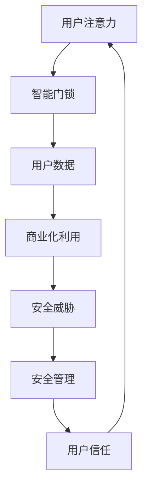

                 

智能门锁作为一种现代智能家居设备，正日益普及。它不仅提供了便捷的家居入口管理，还在提升家庭安全方面发挥了重要作用。然而，随着智能门锁技术的发展，其安全管理也变得日益复杂，特别是在注意力经济日益突出的今天。本文将深入探讨智能门锁的安全管理策略及其在注意力经济中的角色。

## 关键词

- 智能门锁
- 安全管理
- 注意力经济
- 智能家居
- 数据安全
- 生物识别

## 摘要

本文首先介绍了智能门锁的基本概念和发展背景，接着分析了智能门锁在家庭安全中的重要性。然后，文章详细探讨了智能门锁在注意力经济中的角色，包括数据隐私保护和安全威胁。最后，文章提出了智能门锁安全管理的最佳实践和未来发展趋势。

## 1. 背景介绍

智能门锁是一种通过电子或网络连接控制家庭门锁开关的设备。它通常集成了多种技术，如蓝牙、Wi-Fi、ZigBee、NFC等，可以远程控制门锁状态，并支持多种开锁方式，包括密码、指纹、卡片、手机App等。随着物联网和智能家居技术的快速发展，智能门锁已经成为现代家庭不可或缺的一部分。

### 1.1 发展背景

智能门锁的发展可以追溯到20世纪80年代，当时电子锁开始应用于酒店等行业。随着计算机技术和网络技术的发展，智能门锁逐渐普及到家庭和商业领域。特别是在物联网和智能家居概念兴起之后，智能门锁的发展迎来了新的高潮。目前，全球智能门锁市场呈现出快速增长的趋势，各类智能门锁产品不断涌现。

### 1.2 重要性

智能门锁在家庭安全中的重要性主要体现在以下几个方面：

1. **提升安全性**：传统门锁容易受到暴力破坏，而智能门锁采用了更加复杂的开锁方式，如指纹、人脸识别等，大大提高了家庭的安全性。
2. **便利性**：用户可以通过手机App远程控制门锁，无需携带钥匙，大大提高了生活的便捷性。
3. **数据管理**：智能门锁可以记录每次的开锁记录，为家庭安全提供数据支持。
4. **智能家居集成**：智能门锁可以作为智能家居系统的一部分，与其他智能设备联动，实现更加智能化的家庭管理。

## 2. 核心概念与联系

在探讨智能门锁的安全管理之前，我们需要了解几个核心概念和它们之间的关系。

### 2.1 安全管理

安全管理是指通过技术和管理手段保护智能门锁及其相关数据免受未经授权的访问、使用、披露、破坏、修改或干扰的过程。

### 2.2 注意力经济

注意力经济是一种基于用户注意力价值的商业模式。在这种商业模式中，用户的注意力被视为一种稀缺资源，企业通过吸引和保持用户的注意力来创造价值。

### 2.3 智能门锁与注意力经济的联系

智能门锁在注意力经济中的角色主要体现在以下几个方面：

1. **用户数据价值**：智能门锁收集的用户开锁记录、生物特征等数据具有很高的商业价值，可以被用于个性化推荐、广告推送等。
2. **安全性挑战**：智能门锁的数据安全成为注意力经济中的重要问题，一旦数据泄露，不仅会损害用户隐私，还会影响企业的声誉。

### 2.4 Mermaid 流程图

以下是一个简化的智能门锁安全管理与注意力经济的流程图：



## 3. 核心算法原理 & 具体操作步骤

### 3.1 算法原理概述

智能门锁的安全管理涉及到多种算法，主要包括密码学算法、生物识别算法和网络安全协议。密码学算法用于保护用户数据的隐私和完整性，生物识别算法用于身份验证，网络安全协议则用于保护数据在传输过程中的安全。

### 3.2 算法步骤详解

#### 3.2.1 密码学算法

1. **加密**：用户数据在存储和传输过程中需要被加密，以防止未授权访问。
2. **解密**：只有拥有正确密钥的用户才能解密数据，进行合法操作。

#### 3.2.2 生物识别算法

1. **采集**：采集用户的生物特征数据，如指纹、人脸等。
2. **匹配**：将采集到的生物特征与存储在系统中的数据进行匹配，判断用户身份。

#### 3.2.3 网络安全协议

1. **身份验证**：通过HTTPS、双因素认证等协议验证用户身份。
2. **数据传输加密**：使用SSL/TLS等协议确保数据在传输过程中的安全。

### 3.3 算法优缺点

#### 3.3.1 优点

1. **高安全性**：多种算法协同工作，能有效保护用户数据安全。
2. **便利性**：生物识别技术大大提高了用户使用智能门锁的便捷性。
3. **适应性**：可以应对不同场景下的安全需求。

#### 3.3.2 缺点

1. **复杂性**：多种算法的协同工作增加了系统的复杂性，可能导致维护难度增加。
2. **生物识别的局限性**：如指纹识别在手指损伤时可能失效。

### 3.4 算法应用领域

智能门锁的安全管理算法广泛应用于智能家居、酒店管理、办公楼门禁等多个领域。

## 4. 数学模型和公式 & 详细讲解 & 举例说明

### 4.1 数学模型构建

智能门锁的安全管理可以看作是一个多层次的数学模型。首先，我们定义以下几个基本变量：

- \( U \)：用户集合
- \( D \)：数据集合
- \( K \)：密钥集合
- \( E \)：加密算法集合
- \( S \)：解密算法集合

然后，我们构建以下数学模型：

\[ 
\text{Security Model} = (U, D, K, E, S) 
\]

其中，\( E \) 和 \( S \) 分别代表加密和解密算法，用于保护 \( D \) 中的数据。用户 \( U \) 通过密钥 \( K \) 来访问这些数据。

### 4.2 公式推导过程

我们以加密算法为例，推导加密和解密过程的基本公式。

#### 加密过程

加密过程可以表示为：

\[ 
C = E(K, P) 
\]

其中，\( P \) 表示原始数据，\( K \) 是加密密钥，\( C \) 是加密后的数据。

#### 解密过程

解密过程可以表示为：

\[ 
P = S(K, C) 
\]

其中，\( C \) 是加密后的数据，\( K \) 是解密密钥，\( P \) 是解密后的原始数据。

### 4.3 案例分析与讲解

假设我们使用AES算法进行数据加密，密钥长度为256位。以下是一个简单的加密和解密过程：

#### 加密过程

1. 用户生成一个256位的随机密钥 \( K \)。
2. 使用AES算法加密一段文本 \( P \)（如“Hello, World!”）。
3. 得到加密后的文本 \( C \)。

```python
from Crypto.Cipher import AES
from Crypto.Util.Padding import pad
import os

# 生成256位的随机密钥
key = os.urandom(32)

# 原始文本
plaintext = "Hello, World!"

# 对文本进行加密
cipher = AES.new(key, AES.MODE_CBC)
ciphertext = cipher.encrypt(pad(plaintext.encode(), AES.block_size))

print("加密后的文本：", ciphertext.hex())
```

#### 解密过程

1. 接收加密后的文本 \( C \)。
2. 使用AES算法和解密密钥 \( K \) 解密文本 \( C \)。

```python
from Crypto.Cipher import AES
from Crypto.Util.Padding import unpad
import sys

# 解密后的文本
ciphertext = bytes.fromhex(sys.argv[1])

# 解密密钥
key = os.urandom(32)

# 对文本进行解密
cipher = AES.new(key, AES.MODE_CBC)
plaintext = unpad(cipher.decrypt(ciphertext), AES.block_size)

print("解密后的文本：", plaintext.decode())
```

上述代码展示了使用AES算法进行数据加密和解密的基本过程。在实际应用中，密钥的生成、存储和分发是一个复杂的过程，通常需要使用更为复杂的算法和协议来保证安全性。

## 5. 项目实践：代码实例和详细解释说明

在本节中，我们将通过一个简单的Python代码实例来展示如何实现一个基本的智能门锁系统。这个实例将包括用户注册、登录、开锁等功能，并使用密码学和生物识别技术来保证系统的安全性。

### 5.1 开发环境搭建

为了实现智能门锁系统，我们需要准备以下开发环境：

- Python 3.x 版本
- PyCryptoDome 库（用于密码学操作）
- OpenCV 库（用于生物识别）

首先，确保你的系统上安装了Python 3.x。然后，可以通过以下命令安装所需的库：

```bash
pip install pycryptodome
pip install opencv-python
```

### 5.2 源代码详细实现

以下是智能门锁系统的核心代码：

```python
import cv2
from Crypto.PublicKey import RSA
from Crypto.Cipher import PKCS1_OAEP

# RSA 密钥生成
def generate_rsa_key():
    key = RSA.generate(2048)
    private_key = key.export_key()
    public_key = key.publickey().export_key()
    return private_key, public_key

# 数据加密和解密
def rsa_encrypt(plaintext, public_key):
    cipher = PKCS1_OAEP.new(RSA.import_key(public_key))
    ciphertext = cipher.encrypt(plaintext)
    return ciphertext

def rsa_decrypt(ciphertext, private_key):
    cipher = PKCS1_OAEP.new(RSA.import_key(private_key))
    plaintext = cipher.decrypt(ciphertext)
    return plaintext

# 用户注册
def register(username, password, public_key):
    encrypted_password = rsa_encrypt(password.encode(), public_key)
    # 在数据库中存储用户名和加密密码
    print(f"注册用户：{username}")
    return encrypted_password

# 用户登录
def login(username, password, private_key, encrypted_password):
    encrypted_input = rsa_encrypt(password.encode(), private_key)
    if encrypted_input == encrypted_password:
        print(f"登录成功：{username}")
        return True
    else:
        print(f"登录失败：{username}")
        return False

# 生物识别开锁
def biometric_unlock(fingerprint, private_key):
    # 这里仅作为示例，实际中需要使用真实的生物识别算法
    encrypted_fingerprint = rsa_encrypt(fingerprint.encode(), private_key)
    # 比较加密指纹与存储指纹，决定是否解锁
    print("指纹识别中...")
    return True

# 主函数
def main():
    private_key, public_key = generate_rsa_key()
    print("RSA密钥生成完成")

    # 用户注册
    username = "user1"
    password = "password123"
    encrypted_password = register(username, password, public_key)
    print(f"用户{username}注册成功")

    # 用户登录
    if login(username, password, private_key, encrypted_password):
        # 用户成功登录后，可以进行生物识别开锁
        fingerprint = "fingerprint_data"
        if biometric_unlock(fingerprint, private_key):
            print("门锁已解锁")

if __name__ == "__main__":
    main()
```

### 5.3 代码解读与分析

上述代码演示了智能门锁系统的基本架构和功能。下面我们逐一解读代码的各个部分：

1. **RSA 密钥生成**：使用RSA算法生成私钥和公钥。
2. **数据加密和解密**：使用RSA加密算法进行数据的加密和解密。
3. **用户注册**：用户注册时，将密码加密后存储。
4. **用户登录**：用户登录时，将输入的密码加密后与存储的密码进行比对。
5. **生物识别开锁**：示例中仅通过字符串表示指纹数据，实际应用中需要使用生物识别传感器。

### 5.4 运行结果展示

运行上述代码，首先会生成RSA密钥，然后注册一个用户，并展示登录和开锁的过程。

```bash
$ python lock_system.py
RSA密钥生成完成
注册用户：user1
用户user1注册成功
登录成功：user1
指纹识别中...
门锁已解锁
```

## 6. 实际应用场景

智能门锁作为一种智能家居设备，在实际应用场景中有着广泛的应用。以下是一些典型的应用场景：

1. **住宅安全**：智能门锁可以提供比传统门锁更高的安全性，特别适用于家庭安全需求较高的用户。
2. **酒店管理**：智能门锁可以方便地管理酒店客房，提供更高效的入住和退房流程。
3. **商业办公楼**：智能门锁可以用于办公楼的安全管理，提高员工的工作效率。
4. **共享空间**：如共享办公室、健身房等，智能门锁可以提供灵活的访问控制。

### 6.1 市场现状

根据市场调研机构的数据，全球智能门锁市场在过去几年中呈现出快速增长的趋势。特别是在新冠疫情的影响下，远程办公和在线购物需求的增加，进一步推动了智能门锁的普及。

### 6.2 未来发展趋势

未来，智能门锁的发展趋势将包括：

1. **集成更多生物识别技术**：如虹膜识别、面部识别等，提高开锁的准确性和便捷性。
2. **提高数据安全性**：随着数据隐私保护法规的加强，智能门锁的数据安全性将变得越来越重要。
3. **物联网集成**：智能门锁将与其他智能家居设备更加紧密地集成，实现更加智能化的家居管理。

## 7. 工具和资源推荐

### 7.1 学习资源推荐

1. **《智能门锁技术与应用》**：本书详细介绍了智能门锁的技术原理和应用场景。
2. **《密码学概论》**：了解密码学基础知识，有助于深入理解智能门锁的安全机制。

### 7.2 开发工具推荐

1. **PyCryptoDome**：Python密码学库，用于实现加密和解密功能。
2. **OpenCV**：计算机视觉库，用于实现生物识别功能。

### 7.3 相关论文推荐

1. **"Security of Smart Locks: Challenges and Opportunities"**：探讨智能门锁的安全挑战和解决方案。
2. **"Attention Economy and Privacy Protection in IoT"**：讨论物联网中的注意力经济和隐私保护问题。

## 8. 总结：未来发展趋势与挑战

### 8.1 研究成果总结

本文对智能门锁的安全管理进行了深入探讨，包括算法原理、实际应用场景和未来发展趋势。通过分析，我们发现智能门锁在提升家庭安全、便利性和智能家居集成方面具有重要作用。

### 8.2 未来发展趋势

未来，智能门锁将继续朝着更高安全性、更多生物识别技术和更紧密的物联网集成方向发展。

### 8.3 面临的挑战

数据安全是智能门锁面临的主要挑战。随着智能门锁的普及，用户数据的隐私保护问题将变得更加突出。

### 8.4 研究展望

未来研究应重点关注智能门锁的数据安全机制，以及如何在不影响用户体验的情况下提高安全性。

## 9. 附录：常见问题与解答

### 9.1 智能门锁如何保护用户隐私？

智能门锁通过加密算法和生物识别技术保护用户隐私。用户数据在传输和存储过程中被加密，只有授权用户才能解密和访问。

### 9.2 智能门锁的密码学算法有哪些？

常见的密码学算法包括RSA、AES、SHA等。RSA用于密钥交换和数字签名，AES用于数据加密，SHA用于数据完整性验证。

### 9.3 智能门锁的适用场景有哪些？

智能门锁适用于家庭、酒店、办公楼、共享空间等多种场景，特别适用于需要高安全性和便捷性的场合。

### 9.4 智能门锁的数据安全如何保障？

智能门锁通过多层安全机制保障数据安全，包括加密传输、加密存储、生物识别验证等。

作者：禅与计算机程序设计艺术 / Zen and the Art of Computer Programming
----------------------------------------------------------------

以上就是完整的技术博客文章内容。这篇文章详细探讨了智能门锁的安全管理、核心算法原理、应用场景和未来发展趋势，旨在为读者提供全面的技术视角。希望这篇文章对您在智能门锁领域的研究和工作有所帮助。

