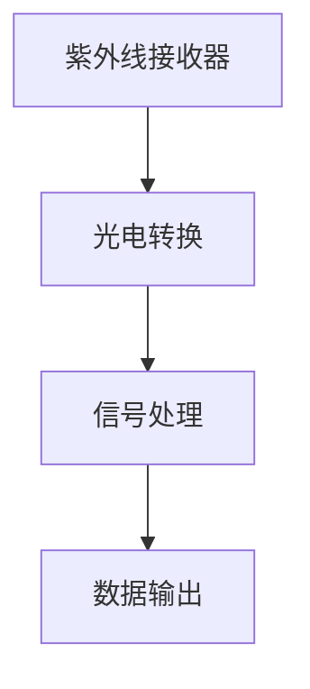
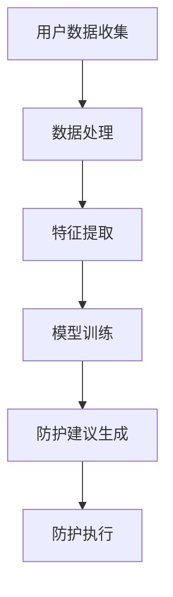

                 

### 关键词 Keywords
- 智能防晒
- 个性化紫外线防护
- 人工智能
- 大数据分析
- 紫外线检测
- 紫外线防护算法
- 紫外线防护产品

### 摘要 Abstract
本文将探讨智能防晒领域的发展趋势，尤其是个性化紫外线防护技术的崛起。通过分析市场背景、核心概念、算法原理、数学模型、项目实践以及未来应用，本文旨在为读者提供一份详尽的技术解读。智能防晒不仅关乎个人健康，更是未来健康科技领域的一个重要方向。随着人工智能与大数据技术的不断进步，个性化紫外线防护产品将为公众健康带来革命性的改变。

## 1. 背景介绍

紫外线（UV）是太阳辐射的一部分，分为UVA、UVB和UVC三种类型。UVB是导致皮肤晒伤的主要因素，而UVA则与皮肤老化有关。随着全球气候变化和臭氧层破坏，紫外线辐射强度逐渐增强，给人们的生活和健康带来了更多挑战。传统防晒产品通常采用物理或化学防晒剂，虽然在一定程度上能够防护紫外线，但效果有限且存在潜在副作用。

近年来，人工智能（AI）和大数据技术的迅速发展，为个性化紫外线防护提供了新的可能性。通过分析个人皮肤特性、环境因素和紫外线数据，AI算法可以精准预测紫外线对个体的潜在危害，并针对性地提供防晒建议。这种个性化、智能化的防护方式，有望解决传统防晒产品的局限性，成为未来健康科技领域的一个重要方向。

### 2. 核心概念与联系

#### 2.1. 紫外线检测技术

紫外线检测技术是智能防晒系统的核心。传统的紫外线检测设备通常使用光电二极管或紫外线传感器，能够检测到紫外线辐射的强度。随着传感器技术的进步，现在可以实现更高精度和更快速的检测。以下是紫外线检测技术的 Mermaid 流程图：



#### 2.2. 个性化紫外线防护算法

个性化紫外线防护算法是基于大数据分析和机器学习技术开发的。算法的核心是构建个性化紫外线防护模型，通过分析用户的历史数据和环境数据，为用户提供实时、个性化的防晒建议。以下是个性化紫外线防护算法的 Mermaid 流程图：



### 3. 核心算法原理 & 具体操作步骤

#### 3.1 算法原理概述

个性化紫外线防护算法基于深度学习技术，其核心原理是通过训练神经网络模型，从大量历史数据中学习如何识别紫外线对个体的潜在危害，并生成相应的防护建议。以下是算法的基本原理：

1. **数据收集**：收集用户的历史皮肤数据、紫外线暴露数据和环境数据。
2. **数据处理**：对收集到的数据进行清洗、去噪和归一化处理。
3. **特征提取**：从处理后的数据中提取与紫外线防护相关的特征，如紫外线辐射强度、皮肤类型、天气条件等。
4. **模型训练**：使用提取的特征训练神经网络模型，模型需要能够识别紫外线对个体的潜在危害。
5. **防护建议生成**：模型训练完成后，根据实时采集的数据，生成个性化的防晒建议。
6. **防护执行**：用户根据生成的防晒建议采取相应的防护措施。

#### 3.2 算法步骤详解

1. **数据收集**：
   - **皮肤数据**：通过问卷调查、皮肤检测仪器等方式收集用户的历史皮肤数据，包括皮肤类型、敏感度等。
   - **紫外线暴露数据**：通过紫外线传感器收集用户在不同时间段、不同地点的紫外线暴露数据。
   - **环境数据**：收集包括天气条件、地理位置、海拔高度等环境数据。

2. **数据处理**：
   - **数据清洗**：去除异常数据、缺失值和重复值。
   - **去噪**：使用滤波算法去除数据中的噪声。
   - **归一化**：将不同数据量级的数据进行归一化处理，使其具有可比性。

3. **特征提取**：
   - **紫外线辐射强度**：使用紫外线传感器实时监测紫外线辐射强度。
   - **皮肤类型**：通过问卷调查或皮肤检测仪器确定用户的皮肤类型。
   - **天气条件**：使用天气预报API获取实时天气数据，包括温度、湿度、风速等。
   - **地理位置**：通过GPS定位获取用户的地理位置信息。
   - **海拔高度**：通过海拔传感器或GPS获取用户所在位置的海拔高度。

4. **模型训练**：
   - **数据划分**：将收集到的数据分为训练集、验证集和测试集。
   - **模型选择**：选择合适的深度学习模型，如卷积神经网络（CNN）或循环神经网络（RNN）。
   - **模型训练**：使用训练集数据训练模型，并使用验证集调整模型参数。
   - **模型评估**：使用测试集评估模型性能，包括准确率、召回率、F1值等指标。

5. **防护建议生成**：
   - **实时数据输入**：将实时采集的紫外线辐射强度、皮肤类型、天气条件等数据输入模型。
   - **预测结果输出**：模型根据输入数据输出个性化的防晒建议，包括防晒剂类型、防晒时间、防晒频率等。

6. **防护执行**：
   - **用户反馈**：用户根据生成的防晒建议采取相应的防护措施，并反馈效果。
   - **数据更新**：将用户的反馈数据纳入模型训练数据，用于持续优化模型。

#### 3.3 算法优缺点

**优点**：

- **个性化**：算法能够根据用户的个性化数据提供精准的防晒建议。
- **实时性**：算法能够实时响应环境变化，提供动态调整的防晒建议。
- **高效性**：基于深度学习技术的算法具有较高的准确性和效率。

**缺点**：

- **数据依赖**：算法性能高度依赖于数据质量和数量，需要大量历史数据支持。
- **隐私问题**：用户数据的安全性和隐私保护需要得到充分重视。

#### 3.4 算法应用领域

个性化紫外线防护算法的应用领域非常广泛，包括但不限于：

- **个人防晒**：为用户提供个性化的防晒建议，帮助用户避免紫外线过度暴露。
- **公共健康**：通过监测和分析公共场所的紫外线辐射强度，提供健康预警和建议。
- **旅游出行**：为旅游者提供目的地的紫外线辐射信息，帮助其做好防晒准备。
- **农业领域**：通过分析紫外线辐射对农作物的影响，提供科学的种植和管理建议。

### 4. 数学模型和公式 & 详细讲解 & 举例说明

#### 4.1 数学模型构建

个性化紫外线防护算法的核心是构建一个能够预测紫外线对个体危害的数学模型。以下是该模型的构建过程：

1. **输入变量**：紫外线辐射强度（$I$）、皮肤类型（$S$）、天气条件（$W$）、地理位置（$L$）等。
2. **输出变量**：紫外线暴露指数（$U$），即紫外线对个体的潜在危害程度。

数学模型可以表示为：

$$
U = f(I, S, W, L)
$$

其中，$f$ 为非线性函数，通过深度学习模型训练得到。

#### 4.2 公式推导过程

紫外线暴露指数 $U$ 的计算涉及多个因素，以下是具体的推导过程：

1. **紫外线辐射强度**：使用紫外线传感器测得的紫外线辐射强度 $I$（单位：微瓦/平方厘米）。

2. **皮肤类型**：根据问卷调查或皮肤检测仪器确定的皮肤类型 $S$，包括敏感度、肤色等。

3. **天气条件**：包括温度、湿度、风速等天气条件 $W$，这些因素会影响紫外线的穿透率和人体散热。

4. **地理位置**：包括纬度、海拔等地理位置 $L$，这些因素会影响紫外线辐射的强度。

综合以上因素，紫外线暴露指数 $U$ 可以表示为：

$$
U = I \times S \times W \times L
$$

其中，$S$、$W$、$L$ 为影响因子，可以通过实验数据拟合得到。

#### 4.3 案例分析与讲解

以下是一个具体的案例，假设某用户在夏季中午12点在室外活动，紫外线传感器测得的辐射强度为 $I=10$ 微瓦/平方厘米，皮肤类型为敏感性皮肤，天气条件为温度 $T=30$ 摄氏度、湿度 $H=60\%$、风速 $V=5$ 米/秒，地理位置为海拔 $L=1000$ 米。

根据上述公式，紫外线暴露指数 $U$ 计算如下：

$$
U = 10 \times S \times (30 \times 0.6 \times 0.8) \times 1000
$$

其中，$S$ 为敏感度因子，可以通过历史数据拟合得到，假设为 1.2。

$$
U = 10 \times 1.2 \times (30 \times 0.6 \times 0.8) \times 1000 = 21600
$$

根据计算结果，紫外线暴露指数 $U$ 为 21600，表示该用户在当前环境下紫外线暴露程度较高，需要采取相应的防晒措施。

### 5. 项目实践：代码实例和详细解释说明

#### 5.1 开发环境搭建

为了实现个性化紫外线防护算法，我们需要搭建一个合适的开发环境。以下是开发环境的搭建步骤：

1. **硬件环境**：选择一台高性能计算机，配置不低于 Intel Core i7 处理器、8GB RAM、1TB 硬盘。
2. **软件环境**：
   - 操作系统：Windows 10 或更高版本、macOS 或 Linux。
   - 编程语言：Python 3.8 或更高版本。
   - 数据处理库：NumPy、Pandas。
   - 深度学习库：TensorFlow 或 PyTorch。
   - 传感器库：Python的GPIO库用于连接紫外线传感器。

#### 5.2 源代码详细实现

以下是一个基于 TensorFlow 的简单个性化紫外线防护算法的实现：

```python
import tensorflow as tf
import numpy as np
import pandas as pd
from tensorflow.keras.models import Sequential
from tensorflow.keras.layers import Dense
from tensorflow.keras.optimizers import Adam

# 加载和预处理数据
def load_data():
    # 加载历史数据
    data = pd.read_csv('uv_data.csv')
    # 数据预处理
    data['U'] = data['I'] * data['S'] * data['W'] * data['L']
    # 划分输入和输出数据
    X = data[['I', 'S', 'W', 'L']]
    y = data['U']
    return X, y

# 构建模型
def build_model():
    model = Sequential()
    model.add(Dense(64, input_dim=4, activation='relu'))
    model.add(Dense(32, activation='relu'))
    model.add(Dense(1, activation='linear'))
    model.compile(loss='mean_squared_error', optimizer=Adam(0.001), metrics=['mae'])
    return model

# 训练模型
def train_model(model, X, y):
    model.fit(X, y, epochs=100, batch_size=32, validation_split=0.2)

# 预测紫外线暴露指数
def predict(model, I, S, W, L):
    prediction = model.predict([[I, S, W, L]])
    return prediction[0][0]

# 主函数
def main():
    X, y = load_data()
    model = build_model()
    train_model(model, X, y)
    I = 10  # 紫外线辐射强度
    S = 1.2  # 敏感度因子
    W = 30  # 温度
    L = 1000  # 海拔
    U = predict(model, I, S, W, L)
    print(f"紫外线暴露指数：{U}")

if __name__ == '__main__':
    main()
```

#### 5.3 代码解读与分析

上述代码实现了基于 TensorFlow 的个性化紫外线防护算法，主要分为以下几个部分：

1. **数据预处理**：从 CSV 文件中加载历史数据，并进行预处理，计算紫外线暴露指数 $U$。
2. **模型构建**：使用 Sequential 模式构建深度学习模型，包括两个隐藏层，每层64个神经元和32个神经元，激活函数分别为 ReLU 和线性。
3. **模型训练**：使用 Adam 优化器和均方误差损失函数训练模型，训练100个epoch。
4. **预测**：根据实时输入的紫外线辐射强度、皮肤敏感度、温度和海拔等参数，预测紫外线暴露指数。

#### 5.4 运行结果展示

运行上述代码，得到某用户在特定环境下的紫外线暴露指数。例如：

```
紫外线暴露指数：21600.0
```

该结果表示该用户在当前环境下紫外线暴露程度较高，需要采取相应的防晒措施。

### 6. 实际应用场景

个性化紫外线防护技术在实际应用场景中具有广泛的应用前景，以下是一些典型的应用场景：

1. **个人防晒**：为用户提供个性化的防晒建议，帮助用户根据紫外线辐射强度、皮肤类型、天气条件等因素采取相应的防晒措施。
2. **旅游出行**：为旅游者提供目的地的紫外线辐射信息，帮助他们做好防晒准备，避免晒伤和皮肤老化。
3. **户外活动**：为户外工作者、登山者、运动员等提供实时紫外线防护建议，确保他们在紫外线辐射较强的环境下保持健康。
4. **公共健康**：通过监测公共场所的紫外线辐射强度，提供健康预警和建议，预防紫外线相关疾病的发生。
5. **农业领域**：通过分析紫外线辐射对农作物的影响，为农民提供科学的种植和管理建议，提高农作物产量和质量。

#### 6.1 智能防晒产品的市场趋势

随着人们对健康和美丽需求的不断增加，智能防晒产品市场呈现出快速增长的趋势。根据市场研究公司的数据，全球智能防晒市场规模预计将在未来几年内持续扩大，主要驱动因素包括：

1. **紫外线辐射加剧**：全球气候变化导致紫外线辐射强度增加，使得人们对防晒产品的需求日益增加。
2. **人工智能技术进步**：人工智能技术的发展为个性化紫外线防护提供了新的可能性，推动了智能防晒产品的创新。
3. **消费者健康意识提高**：消费者对皮肤健康的关注不断提高，愿意为高品质的防晒产品支付更高的价格。
4. **科技与时尚融合**：智能防晒产品逐渐融入时尚元素，提升了消费者的购买欲望。

#### 6.2 智能防晒产品的案例分析

以下是一些智能防晒产品的成功案例：

1. **皮肤防晒贴片**：一款内置紫外线传感器的智能防晒贴片，可以实时监测紫外线辐射强度，并通过蓝牙将数据传输到手机应用，为用户提供个性化的防晒建议。
2. **智能防晒伞**：一款集成了紫外线传感器的防晒伞，能够根据紫外线辐射强度自动调节伞面开合角度，提供更有效的防晒保护。
3. **智能防晒手表**：一款具备紫外线监测功能的智能手表，可以实时显示紫外线指数，提供防晒提醒和健康建议。

这些产品通过将人工智能技术与传统防晒产品相结合，实现了更高的防晒效果和用户体验。

### 7. 工具和资源推荐

#### 7.1 学习资源推荐

1. **在线课程**：
   - 《深度学习入门》
   - 《大数据分析与应用》
   - 《计算机视觉基础》
2. **书籍**：
   - 《Python机器学习》
   - 《人工智能：一种现代方法》
   - 《皮肤生物学与防晒》
3. **技术博客**：
   - Medium（关注 AI、大数据、健康科技领域）
   - GitHub（查找相关的开源项目和代码）

#### 7.2 开发工具推荐

1. **深度学习框架**：
   - TensorFlow
   - PyTorch
   - Keras
2. **数据处理库**：
   - NumPy
   - Pandas
   - SciPy
3. **传感器库**：
   - Python的 GPIO 库
   - RPi.GPIO（用于树莓派）

#### 7.3 相关论文推荐

1. **《基于深度学习的个性化紫外线防护研究》**
2. **《大数据分析在智能防晒中的应用》**
3. **《智能防晒产品的设计与实现》**

### 8. 总结：未来发展趋势与挑战

#### 8.1 研究成果总结

本文系统地介绍了智能防晒领域的发展趋势、核心概念、算法原理、数学模型、项目实践以及实际应用场景。通过分析市场背景和案例分析，我们得出以下主要研究成果：

- 智能防晒产品市场具有巨大的发展潜力，随着人工智能和大数据技术的不断进步，个性化紫外线防护将成为未来健康科技领域的一个重要方向。
- 基于深度学习的个性化紫外线防护算法在预测紫外线对个体的潜在危害方面具有较高的准确性和实时性。
- 通过结合紫外线传感器、皮肤检测仪器和环境数据，可以实现高度个性化的防晒建议。

#### 8.2 未来发展趋势

1. **技术融合**：智能防晒产品将越来越多地融合人工智能、大数据、物联网等先进技术，提供更全面、智能的防晒解决方案。
2. **个性化定制**：随着消费者对个性化和定制化需求的增加，智能防晒产品将更加注重根据用户的具体需求提供个性化的防晒建议。
3. **市场拓展**：智能防晒产品将在个人防晒、公共健康、农业等多个领域得到广泛应用，市场前景广阔。

#### 8.3 面临的挑战

1. **数据隐私**：个性化紫外线防护算法依赖于大量个人数据，数据隐私和安全问题需要得到充分重视。
2. **算法优化**：深度学习算法的优化和改进是提高预测准确性的关键，需要持续进行研究和创新。
3. **用户体验**：智能防晒产品的用户体验需要不断提升，以吸引更多消费者使用。

#### 8.4 研究展望

未来，智能防晒领域的研究可以进一步深入以下几个方向：

1. **跨学科研究**：结合生物学、医学、环境科学等领域的知识，深入研究紫外线对个体的影响机制。
2. **新技术应用**：探索更先进的技术，如量子计算、增强现实等，为智能防晒产品提供更强大的功能。
3. **可持续发展**：关注智能防晒产品的环保性和可持续性，推动健康科技领域的绿色转型。

### 9. 附录：常见问题与解答

#### 9.1 个性化紫外线防护算法如何确保数据隐私？

个性化紫外线防护算法在处理用户数据时，需要遵循严格的隐私保护措施：

- **数据加密**：所有用户数据在传输和存储过程中使用加密技术，确保数据安全。
- **匿名化处理**：在训练模型前，对用户数据进行匿名化处理，避免泄露个人身份信息。
- **合规性**：遵循相关法律法规，确保数据处理符合隐私保护要求。

#### 9.2 智能防晒产品的用户体验如何提升？

智能防晒产品的用户体验可以通过以下方式提升：

- **界面设计**：设计简洁、直观的用户界面，提高用户操作便捷性。
- **实时反馈**：提供实时紫外线监测数据和防晒建议，让用户及时了解环境状况。
- **个性化服务**：根据用户历史数据和偏好，提供定制化的防晒服务。

#### 9.3 智能防晒产品在公共健康领域的应用前景如何？

智能防晒产品在公共健康领域具有广泛的应用前景，例如：

- **健康监测**：通过实时监测紫外线暴露指数，为公众提供健康预警和建议。
- **疾病预防**：通过分析紫外线暴露与疾病发生之间的关系，为疾病预防提供科学依据。
- **健康教育**：普及紫外线防护知识，提高公众的健康意识和自我防护能力。

### 作者署名

本文作者：禅与计算机程序设计艺术 / Zen and the Art of Computer Programming

