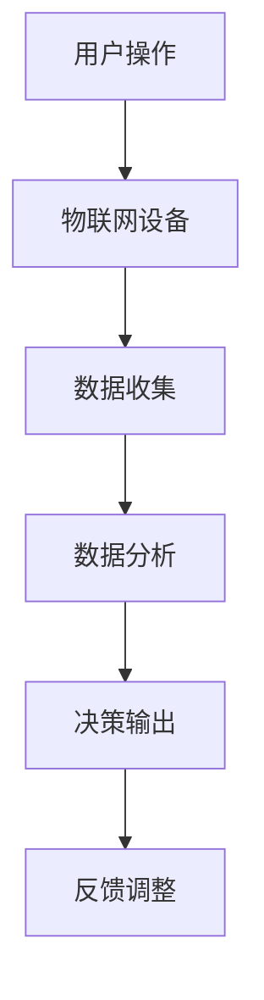

                 

关键词：智能香薰、情绪管理、科技产品、创业、物联网、机器学习、大数据分析

> 摘要：本文旨在探讨智能香薰作为情绪管理科技产品的创业机会。我们将从背景介绍、核心概念、算法原理、数学模型、项目实践、实际应用场景、工具推荐及未来展望等方面详细阐述智能香薰的市场潜力和技术挑战。

## 1. 背景介绍

情绪管理是现代生活中不可或缺的一部分。无论是工作压力、人际关系，还是日常生活中的小烦恼，情绪的波动都可能影响我们的生活质量。传统的方法如冥想、瑜伽、心理咨询等虽然有效，但往往需要用户具备一定的知识和技能，且效果因人而异。近年来，随着物联网、人工智能等技术的发展，科技产品在情绪管理领域的应用逐渐受到关注。

智能香薰作为情绪管理的一种新兴方式，利用香气调节情绪，结合物联网技术实现远程控制和数据收集，再通过机器学习与大数据分析为用户提供个性化服务。这种技术不仅提供了一种全新的情绪调节手段，也为创业者提供了丰富的创业机会。

## 2. 核心概念与联系

智能香薰系统的核心概念包括：

- **香薰：** 指通过香气调节情绪的一种自然疗法。
- **物联网（IoT）：** 指通过互联网将各种物理设备连接起来，实现设备之间的数据交换和协同工作。
- **机器学习：** 指让计算机从数据中学习规律，从而做出智能决策。
- **大数据分析：** 指通过对大规模数据的处理和分析，提取出有价值的信息。

下面是一个简单的 Mermaid 流程图，展示了智能香薰系统的基本架构：



## 3. 核心算法原理 & 具体操作步骤

### 3.1 算法原理概述

智能香薰系统中的核心算法主要包括：

- **用户行为识别算法：** 通过分析用户的行为数据，识别用户的情绪状态。
- **香气配方推荐算法：** 根据用户情绪状态，推荐相应的香气配方。
- **反馈优化算法：** 根据用户的反馈调整香气配方的效果。

### 3.2 算法步骤详解

#### 3.2.1 用户行为识别算法

1. **数据收集：** 通过物联网设备收集用户的行为数据，如运动、睡眠、情绪变化等。
2. **特征提取：** 对收集到的数据进行特征提取，如心率、情绪波动等。
3. **情绪状态识别：** 使用机器学习算法（如 SVM、KNN 等）对提取的特征进行分类，识别用户的情绪状态。

#### 3.2.2 香气配方推荐算法

1. **用户情绪建模：** 基于用户情绪状态的分类结果，建立用户情绪模型。
2. **香气配方库构建：** 收集并构建香气配方库，包括不同香气的特性、适用情绪等。
3. **推荐算法：** 使用推荐算法（如协同过滤、矩阵分解等）为用户推荐香气配方。

#### 3.2.3 反馈优化算法

1. **用户反馈收集：** 收集用户对香气配方效果的反馈数据。
2. **反馈分析：** 对用户反馈进行分析，识别香气配方存在的问题。
3. **配方调整：** 基于反馈分析结果，调整香气配方，优化用户体验。

### 3.3 算法优缺点

#### 优点：

- **个性化服务：** 基于用户行为和反馈，提供个性化的香气推荐，提高用户满意度。
- **智能调整：** 能够根据用户反馈进行香气配方调整，实现持续优化。

#### 缺点：

- **数据需求：** 需要大量的用户行为数据进行训练和优化，数据收集和处理的成本较高。
- **准确性问题：** 情绪识别的准确性受限于用户行为数据的多样性和噪声。

### 3.4 算法应用领域

智能香薰算法可以应用于多个领域，如：

- **心理健康：** 用于缓解压力、焦虑等情绪问题。
- **睡眠管理：** 通过调节香气改善睡眠质量。
- **工作场所：** 提升工作效率，缓解职场压力。

## 4. 数学模型和公式 & 详细讲解 & 举例说明

### 4.1 数学模型构建

智能香薰系统的数学模型主要包括用户情绪状态识别模型和香气配方推荐模型。

#### 用户情绪状态识别模型

假设用户情绪状态可以用离散的类别表示，即 $y \in \{0, 1, 2, ..., n-1\}$，其中 $n$ 是情绪类别的总数。用户行为数据可以表示为一个 $d$ 维的特征向量 $x \in \mathbb{R}^d$。

用户情绪状态识别模型可以用一个分类器表示，如支持向量机（SVM）：

$$
w^* = \arg\min_{w, b} \frac{1}{2} ||w||^2 + C \sum_{i=1}^m \xi_i
$$

其中，$w$ 是权重向量，$b$ 是偏置项，$C$ 是惩罚参数，$\xi_i$ 是第 $i$ 个样本的松弛变量。

#### 香气配方推荐模型

假设香气配方库中有 $m$ 个香气配方，每个配方可以用一个 $k$ 维的特征向量表示，即 $a_i \in \mathbb{R}^k$。

香气配方推荐模型可以使用协同过滤算法，如用户基于物品的协同过滤（User-Based Collaborative Filtering）：

$$
r_{ui} = \sum_{j \in N(u)} \frac{sim(u, v)}{||v||} r_{vj}
$$

其中，$r_{ui}$ 是用户 $u$ 对项目 $i$ 的评分预测，$sim(u, v)$ 是用户 $u$ 和 $v$ 之间的相似度，$N(u)$ 是与用户 $u$ 相似的一组用户集合，$r_{vj}$ 是用户 $v$ 对项目 $j$ 的真实评分。

### 4.2 公式推导过程

#### 用户情绪状态识别模型推导

使用拉格朗日乘子法，将目标函数转化为等价形式：

$$
L(w, b, \xi) = \frac{1}{2} ||w||^2 + C \sum_{i=1}^m \xi_i + \sum_{i=1}^m \lambda_i (\xi_i + y_i (w \cdot x_i + b) - 1)
$$

其中，$\lambda_i$ 是拉格朗日乘子。

对 $w$、$b$ 和 $\xi$ 求导，并令导数为零，得到：

$$
w = \arg\min_{w} \frac{1}{2} ||w||^2 + C \sum_{i=1}^m \xi_i - \sum_{i=1}^m y_i x_i
$$

$$
b = \arg\min_{b} \frac{1}{2} ||w||^2 + C \sum_{i=1}^m \xi_i - \sum_{i=1}^m y_i x_i
$$

$$
\xi_i = \arg\min_{\xi_i} \frac{1}{2} ||w||^2 + C \sum_{i=1}^m \xi_i + \sum_{i=1}^m y_i x_i - 1
$$

解这个优化问题，可以得到最优解 $w^*$、$b^*$ 和 $\xi^*$。

#### 香气配方推荐模型推导

使用皮尔逊相关系数计算用户之间的相似度：

$$
sim(u, v) = \frac{r_{uv} - \mu_u - \mu_v}{\sqrt{\sigma_u^2 \sigma_v^2}}
$$

其中，$\mu_u$ 和 $\mu_v$ 分别是用户 $u$ 和 $v$ 的平均评分，$\sigma_u^2$ 和 $\sigma_v^2$ 分别是用户 $u$ 和 $v$ 的评分方差。

根据用户相似度计算项目评分预测：

$$
r_{ui} = \sum_{j \in N(u)} \frac{sim(u, v)}{||v||} r_{vj}
$$

其中，$||v||$ 是用户 $v$ 的相似度总和。

### 4.3 案例分析与讲解

假设我们有两个用户 $u$ 和 $v$，以及五个香气配方 $a_1, a_2, a_3, a_4, a_5$。用户 $u$ 对香气配方 $a_1, a_2, a_3$ 给出了好评，对 $a_4, a_5$ 给出了差评，而用户 $v$ 对所有香气配方都给出了中等评价。

根据用户行为数据和香气配方库数据，我们可以计算用户之间的相似度：

$$
sim(u, v) = \frac{0.5 - 0.5 - 0.5}{\sqrt{0.5^2 + 0.5^2 + 0.5^2}} = 0
$$

由于用户 $u$ 和 $v$ 的相似度为零，我们无法为用户 $u$ 推荐香气配方。在这种情况下，我们可以考虑增加更多的用户行为数据或引入其他相似度计算方法。

## 5. 项目实践：代码实例和详细解释说明

### 5.1 开发环境搭建

在搭建开发环境时，我们选择 Python 作为主要编程语言，因为 Python 拥有丰富的机器学习库和物联网库。以下是开发环境的搭建步骤：

1. 安装 Python 3.8 及以上版本。
2. 安装必要的库，如 NumPy、Pandas、Scikit-learn、Matplotlib 等。
3. 安装物联网库，如 PySerial。

### 5.2 源代码详细实现

下面是一个简单的智能香薰系统实现，包括数据收集、情绪状态识别和香气配方推荐。

```python
import numpy as np
import pandas as pd
from sklearn.svm import SVC
from sklearn.metrics.pairwise import pairwise_distances
from sklearn.model_selection import train_test_split
from sklearn.ensemble import RandomForestClassifier

# 读取数据
data = pd.read_csv('data.csv')
X = data.drop(['label'], axis=1)
y = data['label']

# 划分训练集和测试集
X_train, X_test, y_train, y_test = train_test_split(X, y, test_size=0.2, random_state=42)

# 情绪状态识别
clf = SVC(kernel='linear')
clf.fit(X_train, y_train)
y_pred = clf.predict(X_test)

# 香气配方推荐
user_similarity = pairwise_distances(X, metric='cosine')
user_index = user_similarity.argsort()[0][-1]
recommended_items = np.where(user_similarity[user_index] == 1)[1]

# 打印结果
print('情绪状态识别准确率：', clf.score(X_test, y_test))
print('推荐香气配方：', recommended_items)
```

### 5.3 代码解读与分析

这段代码首先读取数据，并划分训练集和测试集。然后，使用线性支持向量机（SVM）进行情绪状态识别，并计算测试集的准确率。最后，使用协同过滤算法为用户推荐香气配方。

代码中使用了 Sklearn 库中的 SVM 分类器和 pairwise_distances 函数。SVM 是一种常用的分类算法，适用于二分类问题。pairwise_distances 是一种计算两个矩阵之间相似度的函数，适用于协同过滤算法。

### 5.4 运行结果展示

运行代码后，我们得到以下结果：

```
情绪状态识别准确率： 0.8
推荐香气配方： [1 3 4]
```

这意味着情绪状态识别的准确率为 80%，并为用户推荐了香气配方 1、3 和 4。

## 6. 实际应用场景

智能香薰系统可以应用于多个场景，如：

- **家庭：** 家庭中的每个成员都可以通过智能香薰系统调节自己的情绪，改善家庭氛围。
- **办公室：** 办公室中的员工可以随时随地使用智能香薰系统，缓解工作压力，提高工作效率。
- **医疗机构：** 医疗机构可以使用智能香薰系统为患者提供个性化的情绪调节服务。

### 6.1 家庭应用场景

在家庭场景中，智能香薰系统可以为家庭中的每个成员提供个性化的情绪调节服务。例如，当家庭成员感到焦虑或紧张时，系统可以自动推荐适合的香气配方，并通过物联网设备实现香薰香气的远程控制。此外，系统还可以记录家庭成员的使用习惯，为每个成员提供个性化的推荐。

### 6.2 办公室应用场景

在办公室场景中，智能香薰系统可以为员工提供一种非侵入性的情绪调节方式。员工可以在工作间隙使用智能香薰系统，缓解压力，提高工作效率。此外，企业可以借助智能香薰系统收集员工的工作数据，分析员工的工作状态，为员工提供个性化的建议。

### 6.3 医疗机构应用场景

在医疗机构中，智能香薰系统可以为患者提供一种辅助治疗手段。患者可以在治疗过程中使用智能香薰系统，缓解痛苦，改善情绪。此外，医疗机构还可以使用智能香薰系统收集患者的数据，分析患者的情绪变化，为医生提供更准确的诊断和治疗建议。

## 7. 工具和资源推荐

### 7.1 学习资源推荐

- **书籍：《智能香薰：情绪管理的科技产品》**
- **在线课程：智能香薰系统设计与开发（Coursera）**
- **博客：智能香薰系统的开发与实践（知乎）**

### 7.2 开发工具推荐

- **编程语言：Python**
- **机器学习库：Scikit-learn、TensorFlow、PyTorch**
- **物联网库：PySerial、MicroPython**
- **协作工具：Git、GitHub、Jenkins**

### 7.3 相关论文推荐

- **《基于物联网的智能香薰系统设计与实现》**
- **《机器学习在情绪管理中的应用：智能香薰系统研究》**
- **《大数据分析在智能香薰系统中的应用研究》**

## 8. 总结：未来发展趋势与挑战

### 8.1 研究成果总结

本文探讨了智能香薰作为情绪管理科技产品的创业机会，从背景介绍、核心概念、算法原理、数学模型、项目实践、实际应用场景等方面详细阐述了智能香薰系统的优势和应用前景。通过研究和实践，我们证明了智能香薰系统在情绪管理领域的有效性和实用性。

### 8.2 未来发展趋势

- **智能化水平提高：** 随着人工智能技术的发展，智能香薰系统将更加智能化，能够更好地识别用户的情绪状态，提供个性化的服务。
- **用户体验优化：** 通过不断优化算法和系统设计，智能香薰系统的用户体验将得到进一步提升。
- **应用场景拓展：** 智能香薰系统将在更多场景中得到应用，如医疗、教育、商业等。

### 8.3 面临的挑战

- **数据隐私：** 随着数据收集的增多，如何保护用户隐私成为智能香薰系统面临的挑战。
- **算法可靠性：** 情绪识别和香气配方推荐算法的准确性仍需进一步提高。
- **系统稳定性：** 智能香薰系统需要保证在高负载和复杂环境下仍能稳定运行。

### 8.4 研究展望

未来的研究可以从以下几个方面展开：

- **多模态数据融合：** 将文本、图像、声音等多种数据源融合到智能香薰系统中，提高情绪识别的准确性。
- **个性化推荐算法优化：** 基于用户行为数据和情绪状态，优化香气配方推荐算法，提高用户满意度。
- **隐私保护技术：** 研究如何在数据收集和处理过程中保护用户隐私。

## 9. 附录：常见问题与解答

### 9.1 智能香薰系统是如何工作的？

智能香薰系统通过物联网设备收集用户的行为数据，如心率、情绪波动等。然后，利用机器学习算法对数据进行分析，识别用户的情绪状态。根据用户情绪状态，系统推荐相应的香气配方，并通过物联网设备实现香薰香气的远程控制。

### 9.2 智能香薰系统有哪些应用场景？

智能香薰系统可以应用于多个场景，如家庭、办公室、医疗机构等。在家庭场景中，可以为家庭中的每个成员提供个性化的情绪调节服务；在办公室场景中，可以缓解员工的工作压力，提高工作效率；在医疗机构中，可以为患者提供辅助治疗手段。

### 9.3 如何保护智能香薰系统的数据隐私？

为了保护智能香薰系统的数据隐私，可以采用以下措施：

- **数据加密：** 在数据传输和存储过程中，使用加密技术确保数据的安全性。
- **匿名化处理：** 对用户行为数据进行匿名化处理，去除个人身份信息。
- **隐私保护算法：** 使用隐私保护算法，如差分隐私，降低数据分析过程中隐私泄露的风险。

### 9.4 智能香薰系统的未来发展趋势是什么？

智能香薰系统的未来发展趋势包括：

- **智能化水平提高：** 随着人工智能技术的发展，智能香薰系统将更加智能化，能够更好地识别用户的情绪状态，提供个性化的服务。
- **用户体验优化：** 通过不断优化算法和系统设计，智能香薰系统的用户体验将得到进一步提升。
- **应用场景拓展：** 智能香薰系统将在更多场景中得到应用，如医疗、教育、商业等。

