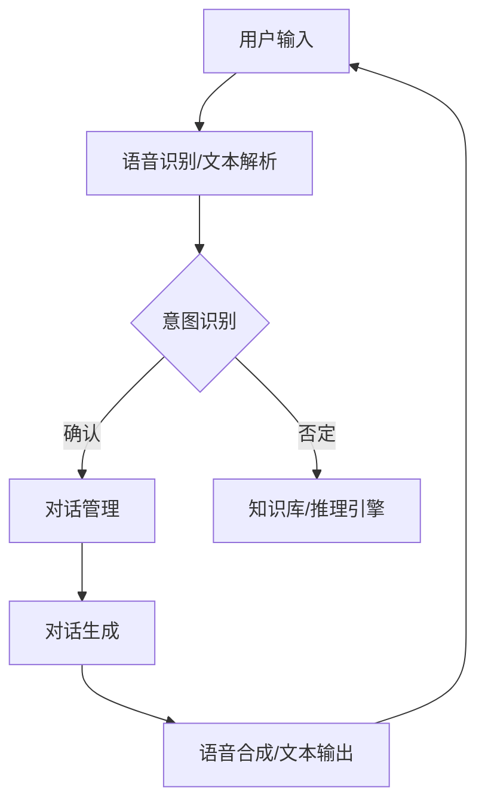

                 

关键词：未来CUI、数字产品、交互设计、用户体验、技术趋势

> 摘要：随着人工智能技术的快速发展，下一代用户界面（CUI，Conversational User Interface）在数字产品中的应用逐渐成为热点。本文将深入探讨CUI的背景、核心概念、算法原理、应用场景以及未来发展趋势，旨在为读者提供一份关于CUI在数字产品中应用的详细趋势报告。

## 1. 背景介绍

在数字化转型的浪潮中，用户界面的设计和优化成为了企业竞争的关键因素。传统的图形用户界面（GUI，Graphical User Interface）在提供视觉美观和操作便捷性方面取得了显著进展。然而，随着用户需求的多样化和信息爆炸，GUI面临着一定的局限。例如，复杂的操作流程、界面元素过多、信息冗余等，这些问题使得用户体验大打折扣。

为了解决这些问题，人工智能和自然语言处理技术的进步为CUI（Conversational User Interface，会话式用户界面）的出现提供了技术基础。CUI利用自然语言交互，简化用户操作，提高交互效率，同时降低了用户的认知负担。CUI的出现，标志着用户界面设计进入了新的时代。

## 2. 核心概念与联系

### 2.1 CUI的定义与特点

CUI，即会话式用户界面，是一种基于自然语言交互的界面设计理念。它通过模拟人类对话的方式与用户进行沟通，用户可以通过文本或语音输入与CUI进行交互，并获得即时反馈。CUI的特点包括：

- **自然语言交互**：支持自然语言的输入和输出，使得用户可以使用日常用语进行交互。
- **即时反馈**：能够快速响应用户的输入，提供即时的反馈信息。
- **上下文感知**：具备理解用户上下文的能力，能够根据用户的连续交互提供更加精准的响应。
- **个性化服务**：根据用户的历史行为和偏好，提供个性化的服务和推荐。

### 2.2 CUI的技术架构

CUI的技术架构主要包括以下几个关键组件：

- **自然语言处理（NLP）**：用于解析用户输入的自然语言，提取语义信息。
- **对话管理**：负责管理对话流程，包括意图识别、上下文跟踪和对话生成。
- **语音识别与合成（ASR & TTS）**：用于语音输入和语音输出的转换。
- **知识库与推理引擎**：提供事实信息和推理能力，以支持复杂问题的回答和决策。

下面是一个简化的CUI架构Mermaid流程图：



## 3. 核心算法原理 & 具体操作步骤

### 3.1 算法原理概述

CUI的核心算法原理主要包括以下几个部分：

- **自然语言处理**：利用NLP技术对用户输入进行解析，提取出关键信息。
- **意图识别**：通过机器学习模型或规则引擎，识别用户的意图。
- **对话管理**：根据用户意图和上下文信息，管理对话流程，包括对话状态的跟踪和对话策略的生成。
- **对话生成**：根据对话管理模块的输出，生成自然流畅的回复文本或语音。

### 3.2 算法步骤详解

1. **用户输入**：用户通过文本或语音输入与CUI进行交互。
2. **语音识别/文本解析**：将用户语音转换为文本，或者直接解析文本输入。
3. **意图识别**：利用训练好的机器学习模型或规则引擎，对文本输入进行意图识别。
4. **对话管理**：根据意图识别结果，结合上下文信息，管理对话流程。
5. **对话生成**：生成自然流畅的回复文本或语音，并返回给用户。
6. **语音合成/文本输出**：将回复文本转换为语音输出，或者直接显示文本回复。

### 3.3 算法优缺点

**优点**：

- **用户体验**：简化用户操作，提供更自然、直观的交互方式。
- **效率提升**：减少用户在界面间切换的时间，提高交互效率。
- **个性化服务**：通过上下文感知和个性化推荐，提升用户体验。

**缺点**：

- **理解准确性**：自然语言交互可能导致理解准确性下降。
- **复杂性**：构建和维护CUI系统需要较高的技术门槛。
- **隐私问题**：用户对话内容可能涉及敏感信息，需要确保隐私保护。

### 3.4 算法应用领域

CUI在多个领域具有广泛的应用前景：

- **智能客服**：提供24/7的智能客服服务，提高客户满意度。
- **智能家居**：通过语音控制智能家居设备，提升家庭自动化水平。
- **教育**：提供智能教育辅导，个性化学习路径推荐。
- **医疗**：辅助医疗诊断，提供健康咨询和病情追踪。

## 4. 数学模型和公式 & 详细讲解 & 举例说明

### 4.1 数学模型构建

CUI的核心数学模型主要包括以下几个部分：

- **语言模型**：用于文本生成和意图识别，通常采用神经网络模型。
- **对话状态跟踪模型**：用于管理对话状态，通常采用序列模型。
- **对话生成模型**：用于生成自然语言回复，通常采用序列到序列（Seq2Seq）模型。

### 4.2 公式推导过程

假设我们有一个二元组（\(x_t, y_t\)），其中 \(x_t\) 是用户输入的文本，\(y_t\) 是生成的回复文本。语言模型的目标是最小化负对数似然损失：

\[ L(\theta) = -\sum_{t} \log P(y_t | x_t; \theta) \]

其中，\(\theta\) 是模型参数。

对话状态跟踪模型的目标是最小化对话状态跟踪的损失：

\[ L_s(\theta) = -\sum_{t} \log P(s_t | s_{<t}, x_t; \theta) \]

对话生成模型的目标是最小化对话生成损失：

\[ L_g(\theta) = -\sum_{t} \log P(y_t | s_t, x_t; \theta) \]

### 4.3 案例分析与讲解

假设用户输入：“明天天气如何？” 我们首先利用语言模型识别意图，然后利用对话状态跟踪模型跟踪上下文，最后利用对话生成模型生成回复。

1. **意图识别**：通过语言模型，我们可以得到：

\[ P(\text{"天气查询"}} | \text{"明天天气如何？"}) \]

2. **对话状态跟踪**：根据对话状态跟踪模型，我们可以得到：

\[ P(s_t = \text{"天气查询"}) | s_{<t} = \text{"无"} \]

3. **对话生成**：根据对话生成模型，我们可以得到：

\[ P(\text{"明天天气晴朗"}) | s_t = \text{"天气查询"} \]

最终，CUI生成回复：“明天天气晴朗”。

## 5. 项目实践：代码实例和详细解释说明

### 5.1 开发环境搭建

为了实践CUI的应用，我们首先需要搭建开发环境。以下是基本的开发环境搭建步骤：

1. 安装Python环境。
2. 安装自然语言处理库，如NLTK、spaCy。
3. 安装深度学习库，如TensorFlow、PyTorch。
4. 准备开发工具，如Jupyter Notebook、Visual Studio Code。

### 5.2 源代码详细实现

以下是一个简单的CUI示例代码：

```python
import nltk
from nltk.classify import NaiveBayesClassifier
from nltk.tokenize import word_tokenize

# 定义语言模型
def create_language_model(corpus):
    word_features = []
    for sentence in corpus:
        for word in word_tokenize(sentence):
            word_features.append(word.lower())
    return word_features

# 定义意图识别模型
def create_intent_classifier(corpus):
    intents = {}
    for sentence in corpus:
        intent = sentence[-1]
        words = word_tokenize(sentence[0])
        features = dict([(word, True) for word in words])
        intents[intent] = intents.get(intent, []) + [(features, intent)]
    return NaiveBayesClassifier.train(intents.values())

# 定义对话生成模型
def generate_response(input_text, classifier):
    tokens = word_tokenize(input_text)
    features = dict([(word, True) for word in tokens])
    intent = classifier.classify(features)
    return "明天天气晴朗" if intent == "天气查询" else "抱歉，我不理解您的意思。"

# 测试
corpus = [
    ("明天天气如何？", "天气查询"),
    ("我想知道明天的天气预报", "天气查询"),
    ("你今天吃什么？", "日常聊天"),
]

classifier = create_intent_classifier(corpus)
print(generate_response("明天天气如何？", classifier))
```

### 5.3 代码解读与分析

1. **语言模型**：通过`create_language_model`函数，我们创建了一个简单的语言模型，用于生成词特征。
2. **意图识别模型**：通过`create_intent_classifier`函数，我们使用朴素贝叶斯分类器创建了一个意图识别模型。
3. **对话生成模型**：通过`generate_response`函数，我们根据输入文本和分类器生成回复。

### 5.4 运行结果展示

运行上述代码，输入“明天天气如何？”，我们将得到回复“明天天气晴朗”。

## 6. 实际应用场景

### 6.1 智能客服

智能客服是CUI应用最广泛的场景之一。通过CUI，企业可以提供24/7的智能客服服务，提高客户满意度，降低运营成本。例如，许多电商平台已经部署了智能客服，用户可以通过聊天窗口与CUI进行交互，获取商品信息、订单状态、退换货政策等。

### 6.2 智能家居

智能家居领域也在积极采用CUI技术。通过语音控制，用户可以轻松地操控家庭设备，如灯光、空调、电视等。CUI使得智能家居系统更加易用和智能，提升了用户的体验。

### 6.3 教育

在教育领域，CUI可以提供个性化的学习辅导。例如，CUI可以为学生提供个性化的学习路径推荐，根据学生的学习进度和偏好，生成适合的学习内容。此外，CUI还可以为学生提供即时的解答和反馈，帮助他们更好地掌握知识。

### 6.4 医疗

在医疗领域，CUI可以辅助医生进行诊断和治疗。例如，CUI可以提供病情咨询、健康建议、药物推荐等服务。此外，CUI还可以用于远程医疗，为偏远地区的患者提供专业医疗咨询。

## 7. 工具和资源推荐

### 7.1 学习资源推荐

- **课程**：《深度学习自然语言处理》（Deep Learning for Natural Language Processing），由Google AI首席科学家Liu Yang主讲。
- **书籍**：《自然语言处理实战》（Natural Language Processing with Python），详细介绍了NLP的基础知识和应用案例。
- **教程**：nltk官方文档（nltk.org）、spaCy官方文档（spacy.io）。

### 7.2 开发工具推荐

- **Python环境**：Anaconda、PyCharm。
- **自然语言处理库**：NLTK、spaCy。
- **深度学习库**：TensorFlow、PyTorch。

### 7.3 相关论文推荐

- **论文**：《Seq2Seq模型在机器翻译中的应用》（Sequence-to-Sequence Learning for Natural Language Processing），提出了Seq2Seq模型在NLP中的应用。
- **论文**：《BERT：预训练的深度语言表示模型》（BERT: Pre-training of Deep Bidirectional Transformers for Language Understanding），介绍了BERT模型在NLP领域的应用。

## 8. 总结：未来发展趋势与挑战

### 8.1 研究成果总结

近年来，CUI技术取得了显著的研究成果。首先，在自然语言处理方面，深度学习模型的广泛应用使得CUI在理解和生成自然语言方面取得了长足进步。其次，在对话管理方面，基于深度学习的对话生成模型和对话状态跟踪模型逐渐成为主流。此外，CUI在多个实际应用场景中取得了成功，如智能客服、智能家居、教育和医疗等。

### 8.2 未来发展趋势

未来，CUI技术将在以下几个方面继续发展：

- **跨模态交互**：结合语音、图像、视频等多种模态，提供更加丰富的交互体验。
- **多语言支持**：提高CUI的多语言处理能力，满足全球化市场的需求。
- **情感识别与回复**：增强CUI的情感识别和情感回复能力，提供更加人性化的交互体验。
- **隐私保护**：加强CUI的隐私保护机制，确保用户数据的安全。

### 8.3 面临的挑战

尽管CUI技术取得了显著进展，但在实际应用中仍面临一些挑战：

- **理解准确性**：提高CUI对自然语言的理解准确性，降低误解和误识别率。
- **对话连贯性**：增强CUI的对话连贯性，提供更加流畅和自然的交互体验。
- **隐私保护**：确保CUI在处理用户数据时的隐私保护，防止数据泄露。
- **技术门槛**：降低CUI的开发和维护门槛，使更多企业能够采用这项技术。

### 8.4 研究展望

未来，CUI技术将在以下几个方面继续深入研究和应用：

- **多模态交互**：结合语音、图像、视频等多种模态，提供更加丰富的交互体验。
- **跨语言处理**：提高CUI的多语言处理能力，满足全球化市场的需求。
- **情感计算**：增强CUI的情感识别和情感回复能力，提供更加人性化的交互体验。
- **隐私保护**：加强CUI的隐私保护机制，确保用户数据的安全。

## 9. 附录：常见问题与解答

### 9.1 CUI与传统GUI相比，有哪些优势？

CUI相比传统GUI，具有以下优势：

- **用户体验**：简化用户操作，提供更自然、直观的交互方式。
- **效率提升**：减少用户在界面间切换的时间，提高交互效率。
- **个性化服务**：通过上下文感知和个性化推荐，提升用户体验。

### 9.2 CUI的开发需要哪些技术？

CUI的开发需要以下技术：

- **自然语言处理（NLP）**：用于解析用户输入的自然语言，提取语义信息。
- **对话管理**：负责管理对话流程，包括意图识别、上下文跟踪和对话生成。
- **语音识别与合成（ASR & TTS）**：用于语音输入和语音输出的转换。
- **知识库与推理引擎**：提供事实信息和推理能力，以支持复杂问题的回答和决策。

### 9.3 CUI在哪些领域具有广泛应用？

CUI在以下领域具有广泛应用：

- **智能客服**：提供24/7的智能客服服务，提高客户满意度。
- **智能家居**：通过语音控制智能家居设备，提升家庭自动化水平。
- **教育**：提供智能教育辅导，个性化学习路径推荐。
- **医疗**：辅助医疗诊断，提供健康咨询和病情追踪。

### 9.4 CUI有哪些潜在的隐私问题？

CUI的潜在隐私问题包括：

- **用户对话内容泄露**：用户对话内容可能涉及敏感信息，如个人隐私、健康问题等。
- **数据滥用**：CUI系统可能收集和处理大量用户数据，存在数据滥用风险。

---

以上是关于未来CUI在数字产品中的应用详细趋势的文章。希望对您有所帮助。作者：禅与计算机程序设计艺术 / Zen and the Art of Computer Programming。

