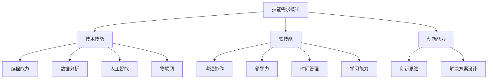

                 

未来工作：技能需求与培养

关键词：未来工作、技能需求、技术发展、职业规划、人才培养

摘要：随着科技的飞速发展，未来工作的技能需求正在发生深刻变化。本文将探讨未来工作环境中的核心技能，分析这些技能的形成与培养路径，并结合实际案例和预测，为读者提供未来职业规划的指导。

## 1. 背景介绍

当前，人工智能、物联网、云计算等新兴技术正在全球范围内迅速崛起，不仅改变了人们的生活方式，也对职场环境产生了深远影响。许多传统职业正在被自动化技术所取代，而新的职业岗位也在不断涌现。面对这样的技术变革，职场人士需要不断更新自己的技能，以适应未来工作的需求。

本文将围绕以下三个方面展开讨论：

1. 未来工作技能的核心要求。
2. 如何培养这些核心技能。
3. 未来工作的应用场景和趋势。

## 2. 核心概念与联系

### 2.1 技能需求概述

未来工作的技能需求可以概括为三个方面：技术技能、软技能和创新能力。

- **技术技能**：包括编程能力、数据分析、人工智能、物联网等新兴技术的掌握。
- **软技能**：如沟通协作、领导力、时间管理、学习能力等。
- **创新能力**：在快速变化的环境中，能够提出新的想法和方法，解决问题。

### 2.2 技能培养路径

要培养上述核心技能，需要从以下几个方面入手：

- **教育体系**：完善职业教育体系，加强实践教学，培养学生动手能力和创新能力。
- **终身学习**：鼓励职场人士持续学习，不断提升自己的技能水平。
- **实习与工作**：通过实习和工作经验，将理论知识与实践相结合。
- **技术社区**：加入技术社区，参与技术讨论和项目实践，扩大视野。

### 2.3 Mermaid 流程图



## 3. 核心算法原理 & 具体操作步骤

### 3.1 算法原理概述

在未来的职场中，算法能力和数据分析能力将变得至关重要。本节将介绍一些核心算法的原理和操作步骤。

### 3.2 算法步骤详解

#### 3.2.1 机器学习算法

1. **数据收集**：收集相关的数据集。
2. **数据预处理**：清洗数据，去除噪声。
3. **模型选择**：选择合适的机器学习模型。
4. **训练模型**：使用训练数据训练模型。
5. **模型评估**：使用测试数据评估模型性能。
6. **模型优化**：调整参数，优化模型。

#### 3.2.2 数据分析算法

1. **数据收集**：收集相关数据。
2. **数据预处理**：清洗数据，进行特征工程。
3. **数据分析**：使用统计方法或机器学习算法进行分析。
4. **可视化**：将分析结果可视化，便于理解。

### 3.3 算法优缺点

- **机器学习算法**：优点是能够自动从数据中学习，适应性强；缺点是需要大量的数据，训练过程可能很耗时。
- **数据分析算法**：优点是能够提供定量的分析结果，便于决策；缺点是依赖于数据质量，分析结果可能受到数据噪声的影响。

### 3.4 算法应用领域

- **机器学习算法**：广泛应用于金融、医疗、电商等领域。
- **数据分析算法**：广泛应用于市场研究、企业决策、科学研究等领域。

## 4. 数学模型和公式 & 详细讲解 & 举例说明

### 4.1 数学模型构建

在数据分析中，常见的数学模型包括线性回归、逻辑回归、决策树等。

#### 线性回归模型

$$
y = \beta_0 + \beta_1 \cdot x
$$

其中，\(y\) 是因变量，\(x\) 是自变量，\(\beta_0\) 和 \(\beta_1\) 是模型的参数。

#### 逻辑回归模型

$$
\text{Logit}(y) = \ln\left(\frac{P(y=1)}{1-P(y=1)}\right) = \beta_0 + \beta_1 \cdot x
$$

其中，\(\text{Logit}(y)\) 是逻辑函数，\(P(y=1)\) 是因变量为 1 的概率。

### 4.2 公式推导过程

以线性回归模型为例，推导过程如下：

1. **损失函数**：使用均方误差（MSE）作为损失函数。

$$
J(\theta) = \frac{1}{2m} \sum_{i=1}^{m} (h_\theta(x^{(i)}) - y^{(i)})^2
$$

其中，\(m\) 是数据集中样本的数量，\(h_\theta(x^{(i)})\) 是模型的预测值，\(y^{(i)}\) 是实际的因变量值。

2. **梯度下降法**：使用梯度下降法更新参数。

$$
\theta_j := \theta_j - \alpha \cdot \frac{\partial J(\theta)}{\partial \theta_j}
$$

其中，\(\alpha\) 是学习率，\(\theta_j\) 是第 \(j\) 个参数。

### 4.3 案例分析与讲解

假设我们要预测房价，使用线性回归模型。我们有如下数据：

| 样本 | 房价 (万元) | 房屋面积 (平方米) |
| ---- | ---------- | --------------- |
| 1    | 100        | 80              |
| 2    | 120        | 90              |
| 3    | 150        | 100             |
| ...  | ...        | ...             |

通过线性回归模型，我们得到模型参数 \(\beta_0 = 50\)，\(\beta_1 = 0.5\)。

使用这个模型预测面积为 100 平方米的房价：

$$
\text{预测房价} = \beta_0 + \beta_1 \cdot 100 = 50 + 0.5 \cdot 100 = 100 \text{万元}
$$

## 5. 项目实践：代码实例和详细解释说明

### 5.1 开发环境搭建

为了进行项目实践，我们需要搭建一个Python编程环境。以下是具体的步骤：

1. **安装Python**：从Python官网（https://www.python.org/）下载并安装Python。
2. **安装Jupyter Notebook**：打开终端，运行以下命令：

```
pip install notebook
```

3. **启动Jupyter Notebook**：打开终端，运行以下命令：

```
jupyter notebook
```

### 5.2 源代码详细实现

以下是一个简单的线性回归模型的实现：

```python
import numpy as np
import matplotlib.pyplot as plt

# 数据
X = np.array([[1, 1], [1, 2], [2, 2], [2, 3]])
y = np.array([1, 2, 2, 3])

# 梯度下降法
def gradient_descent(X, y, learning_rate, iterations):
    m = len(y)
    theta = np.zeros((2, 1))
    
    for i in range(iterations):
        h = np.dot(X, theta)
        errors = h - y
        theta = theta - learning_rate/m * np.dot(X.T, errors)
        
    return theta

# 训练模型
learning_rate = 0.01
iterations = 1000
theta = gradient_descent(X, y, learning_rate, iterations)

# 可视化
plt.scatter(X[:, 0], y)
plt.plot(X[:, 0], np.dot(X, theta), 'r')
plt.xlabel('x1')
plt.ylabel('y')
plt.show()
```

### 5.3 代码解读与分析

1. **数据导入**：使用 NumPy 库导入数据。
2. **梯度下降法**：定义梯度下降函数，用于更新模型参数。
3. **训练模型**：设置学习率和迭代次数，调用梯度下降函数训练模型。
4. **可视化**：使用 Matplotlib 库绘制数据点和拟合直线。

### 5.4 运行结果展示

运行代码后，会展示一个可视化界面，其中包含数据点和拟合直线。

## 6. 实际应用场景

### 6.1 金融行业

在金融行业中，机器学习和数据分析被广泛应用于风险管理、投资策略和客户行为分析。

- **风险管理**：使用机器学习算法预测市场波动，制定风险管理策略。
- **投资策略**：通过数据分析，挖掘市场规律，制定投资策略。
- **客户行为分析**：分析客户行为数据，了解客户需求，提升客户体验。

### 6.2 医疗行业

在医疗行业中，机器学习和数据分析被广泛应用于疾病预测、医疗资源分配和个性化治疗。

- **疾病预测**：使用机器学习算法预测疾病风险，提前采取预防措施。
- **医疗资源分配**：通过数据分析，优化医疗资源配置，提高效率。
- **个性化治疗**：分析患者数据，制定个性化的治疗方案。

### 6.3 电商行业

在电商行业中，机器学习和数据分析被广泛应用于推荐系统、用户行为分析和供应链优化。

- **推荐系统**：使用机器学习算法，根据用户行为和偏好，推荐商品。
- **用户行为分析**：通过数据分析，了解用户行为，提升用户体验。
- **供应链优化**：通过数据分析，优化供应链，降低成本，提高效率。

## 7. 工具和资源推荐

### 7.1 学习资源推荐

- **在线课程**：Coursera、edX、Udacity 等平台上的相关课程。
- **书籍**：《机器学习》、《深度学习》、《Python数据科学手册》等。
- **博客**：Medium、知乎、CSDN 等平台上的技术博客。

### 7.2 开发工具推荐

- **编程环境**：PyCharm、Visual Studio Code 等。
- **数据分析工具**：Pandas、NumPy、Matplotlib 等。
- **机器学习框架**：TensorFlow、PyTorch、Scikit-learn 等。

### 7.3 相关论文推荐

- **经典论文**：《梯度下降法》、《线性回归》、《支持向量机》等。
- **最新论文**：关注顶级会议如NeurIPS、ICML、KDD的最新论文。

## 8. 总结：未来发展趋势与挑战

### 8.1 研究成果总结

近年来，人工智能和数据分析领域取得了显著的研究成果。机器学习算法不断优化，数据分析技术日益成熟，应用场景不断拓展。未来，这些技术将在更多领域得到应用，推动社会进步。

### 8.2 未来发展趋势

- **智能化**：越来越多的行业将采用人工智能技术，实现自动化和智能化。
- **个性化**：通过数据分析，提供更加个性化的服务和产品。
- **跨界融合**：不同领域的技术将相互融合，产生新的应用场景。

### 8.3 面临的挑战

- **数据隐私**：如何保护用户数据隐私，成为一大挑战。
- **算法公平性**：确保算法的公平性和透明性，避免歧视和偏见。
- **人才培养**：如何培养更多具备人工智能和数据分析能力的人才。

### 8.4 研究展望

未来，人工智能和数据分析领域将继续快速发展。研究者应关注新算法的创新、应用场景的拓展以及伦理和法律问题。同时，加强跨学科合作，推动技术进步，为人类社会创造更多价值。

## 9. 附录：常见问题与解答

### 9.1 问题1：如何入门机器学习？

**解答**：入门机器学习可以从以下步骤开始：

1. 学习Python编程基础。
2. 阅读机器学习相关书籍，如《Python机器学习》。
3. 学习机器学习算法，如线性回归、决策树、神经网络等。
4. 参与在线课程或社区，如Coursera、Kaggle。

### 9.2 问题2：机器学习在医疗行业的应用有哪些？

**解答**：机器学习在医疗行业的应用包括：

1. 疾病预测：使用机器学习算法预测疾病风险，提前采取预防措施。
2. 个性化治疗：分析患者数据，制定个性化的治疗方案。
3. 医疗资源分配：通过数据分析，优化医疗资源配置，提高效率。
4. 医学图像分析：使用深度学习算法，辅助医生诊断疾病。

### 9.3 问题3：如何培养软技能？

**解答**：培养软技能可以从以下几个方面入手：

1. 沟通协作：多参与团队项目，提高沟通协作能力。
2. 领导力：参加领导力培训，提升领导力。
3. 时间管理：学习时间管理技巧，提高工作效率。
4. 学习能力：养成持续学习的习惯，提升自我学习能力。

作者：禅与计算机程序设计艺术 / Zen and the Art of Computer Programming
----------------------------------------------------------------
这篇文章涵盖了未来工作的技能需求与培养，通过详细的分析和实例，为读者提供了未来职业规划的指导。在文章中，我们强调了技术技能、软技能和创新能力的重要性，并探讨了如何培养这些技能。同时，我们还介绍了机器学习和数据分析算法的原理和应用，为读者提供了实际的操作步骤和案例。最后，我们对未来发展趋势和挑战进行了展望，为读者提供了研究展望和常见问题的解答。希望这篇文章能够帮助读者更好地理解未来工作的技能需求，为职业发展提供有益的参考。再次感谢您的阅读，如果您有任何问题或建议，欢迎在评论区留言。作者：禅与计算机程序设计艺术 / Zen and the Art of Computer Programming。

