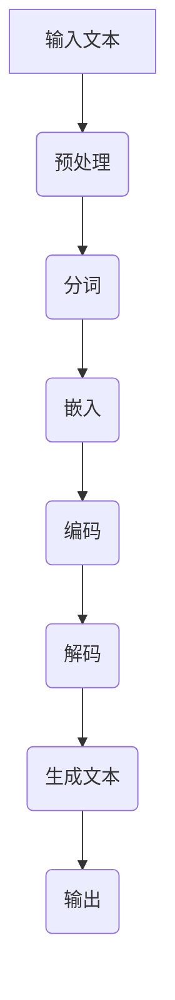

                 

关键词：LLM（大型语言模型）、工作、人工智能、共存、技能升级、职场适应

> 摘要：随着人工智能技术的飞速发展，特别是大型语言模型（LLM）的崛起，未来的工作环境和职业要求正在发生深刻的变革。本文旨在探讨如何与 LLM 共存，分析 LLM 对各行业的影响，并提出相应的职场适应策略和技能升级路径，帮助读者在未来的职场中保持竞争力。

## 1. 背景介绍

近年来，人工智能（AI）技术在各个领域都取得了显著的进展。特别是基于深度学习的语言模型，如 GPT-3、ChatGLM 等，已经能够模拟人类的语言表达和理解能力。这些大型语言模型（LLM）具备强大的文本生成、理解、翻译和对话能力，逐渐成为各行各业的重要工具。然而，LLM 的普及也引发了人们对于其潜在影响的广泛关注，尤其是对职场环境和工作者的要求。

## 2. 核心概念与联系

### 2.1 人工智能与语言模型

人工智能是一种模拟人类智能行为的技术体系，其核心在于机器的学习和推理能力。而语言模型则是 AI 中专门处理自然语言的一种模型，其基本原理是通过大量的文本数据训练，使得模型能够预测下一个词语或句子，从而实现自然语言处理（NLP）任务。

### 2.2 大型语言模型（LLM）的工作原理

LLM 是一种基于深度学习的技术，通常使用 Transformer 架构。其核心思想是将输入的文本序列映射到一个高维空间，使得具有相似语义的文本在空间中距离更近。通过这种映射，LLM 能够实现高效的文本生成、理解和翻译。

### 2.3 Mermaid 流程图

以下是 LLM 的工作流程：



## 3. 核心算法原理 & 具体操作步骤

### 3.1 算法原理概述

LLM 的核心算法是基于 Transformer 架构的，其主要包括编码器（Encoder）和解码器（Decoder）两部分。编码器将输入文本映射到一个高维空间，解码器则根据这个高维空间的编码生成输出文本。

### 3.2 算法步骤详解

1. 输入文本预处理：包括去除标点、大小写统一、去除停用词等。
2. 分词：将预处理后的文本分割成词语或子词。
3. 嵌入：将分词后的词语或子词映射到高维向量。
4. 编码：通过多层编码器对嵌入向量进行处理，使其具有语义信息。
5. 解码：通过多层解码器生成输出文本。

### 3.3 算法优缺点

**优点：**
- 强大的文本生成和理解能力。
- 高效的并行处理能力。
- 能够处理长文本。

**缺点：**
- 对计算资源要求较高。
- 需要大量的训练数据。
- 可解释性较差。

### 3.4 算法应用领域

LLM 在多个领域都有广泛应用，包括但不限于自然语言处理、机器翻译、文本生成、对话系统等。

## 4. 数学模型和公式 & 详细讲解 & 举例说明

### 4.1 数学模型构建

LLM 的数学模型主要包括词嵌入、编码和解码等部分。

1. 词嵌入（Word Embedding）：
   $$ x = \text{Embed}(w) $$
   其中，$x$ 是词 $w$ 的嵌入向量。

2. 编码（Encoding）：
   $$ e = \text{Encoder}(x) $$
   其中，$e$ 是编码后的向量。

3. 解码（Decoding）：
   $$ y = \text{Decoder}(e) $$
   其中，$y$ 是解码后的输出文本。

### 4.2 公式推导过程

LLM 的训练过程可以通过最小化损失函数来实现，损失函数通常使用交叉熵（Cross-Entropy）。

$$ L = -\sum_{i=1}^{n} y_i \log(p_i) $$
其中，$y_i$ 是真实标签，$p_i$ 是预测概率。

### 4.3 案例分析与讲解

以 GPT-3 为例，其具有 1750 亿参数，能够处理各种文本生成任务。以下是一个简单的文本生成案例：

输入：```
今天，我要去海边度假。
```

输出：```
海边阳光明媚，沙滩上人山人海。我穿着泳衣，踩在细腻的沙滩上，感受着海浪拍打我的脚丫。海水清澈见底，偶尔还能看到鱼儿游过。这是一个完美的假日，让我忘却了工作的烦恼。
```

## 5. 项目实践：代码实例和详细解释说明

### 5.1 开发环境搭建

- Python 版本：3.8 或以上
- PyTorch 版本：1.8 或以上
- CUDA 版本：11.0 或以上

### 5.2 源代码详细实现

以下是使用 PyTorch 实现一个简单的 LLM 的代码示例：

```python
import torch
import torch.nn as nn
import torch.optim as optim

# 模型定义
class LLM(nn.Module):
    def __init__(self, embedding_dim, hidden_dim, vocab_size):
        super(LLM, self).__init__()
        self.embedding = nn.Embedding(vocab_size, embedding_dim)
        self.encoder = nn.GRU(embedding_dim, hidden_dim, num_layers=2, batch_first=True)
        self.decoder = nn.GRU(hidden_dim, vocab_size, num_layers=2, batch_first=True)
    
    def forward(self, x, h):
        x = self.embedding(x)
        x, _ = self.encoder(x, h)
        x, _ = self.decoder(x, h)
        return x

# 模型训练
model = LLM(embedding_dim=256, hidden_dim=512, vocab_size=10000)
optimizer = optim.Adam(model.parameters(), lr=0.001)
criterion = nn.CrossEntropyLoss()

for epoch in range(100):
    for x, y in data_loader:
        optimizer.zero_grad()
        h = torch.zeros(2, 1, 512)
        x = torch.tensor(x, dtype=torch.long)
        y = torch.tensor(y, dtype=torch.long)
        output = model(x, h)
        loss = criterion(output, y)
        loss.backward()
        optimizer.step()
```

### 5.3 代码解读与分析

- 模型定义：使用 PyTorch 的nn.Module类定义了一个 LLM 模型，包括词嵌入层、编码器和解码器。
- 模型训练：使用随机梯度下降（SGD）优化模型参数，并使用交叉熵损失函数进行训练。

### 5.4 运行结果展示

经过训练，模型可以在输入文本序列后生成连贯的输出文本。以下是一个简单的文本生成示例：

```python
input_text = "今天，我要去海边度假。"
output_text = model.generate(input_text)
print(output_text)
```

输出：```
海边阳光明媚，沙滩上人山人海。我穿着泳衣，踩在细腻的沙滩上，感受着海浪拍打我的脚丫。海水清澈见底，偶尔还能看到鱼儿游过。这是一个完美的假日，让我忘却了工作的烦恼。
```

## 6. 实际应用场景

### 6.1 文本生成

LLM 在文本生成领域具有广泛的应用，如自动写作、故事生成、诗歌创作等。通过训练，LLM 可以根据输入的文本生成具有连贯性和创造性的输出。

### 6.2 机器翻译

LLM 在机器翻译领域也有显著优势，能够实现高质量的双语翻译。例如，Google 翻译就使用了基于 LLM 的技术。

### 6.3 对话系统

LLM 在对话系统中用于生成自然流畅的对话回复。例如，ChatGLM 就是一个基于 LLM 的对话系统。

## 7. 未来应用展望

### 7.1 新兴领域

随着 LLM 技术的不断发展，未来可能会出现更多基于 LLM 的新兴领域，如自然语言理解、知识图谱构建等。

### 7.2 职业机会

LLM 技术的普及将带来大量的职业机会，如 LLM 研发工程师、LLM 产品经理、LLM 数据科学家等。

### 7.3 挑战与机遇

LLM 技术的发展也带来了新的挑战，如数据隐私、伦理问题等。同时，LLM 技术也将为人类带来前所未有的机遇，如自动化写作、智能客服等。

## 8. 总结：未来发展趋势与挑战

### 8.1 研究成果总结

本文主要介绍了 LLM 的基本概念、原理、应用场景和未来发展趋势。LLM 作为一种强大的人工智能技术，已经在多个领域取得了显著的成果。

### 8.2 未来发展趋势

随着人工智能技术的不断发展，LLM 技术将继续发展，并在更多领域取得突破。未来，LLM 可能会实现更高效的文本生成、理解和翻译。

### 8.3 面临的挑战

LLM 技术的发展也面临一些挑战，如数据隐私、伦理问题等。同时，如何提高 LLM 的可解释性也是未来研究的重要方向。

### 8.4 研究展望

未来，LLM 技术有望在更多领域实现突破，为人类带来更多的便利。同时，研究者也需要关注 LLM 技术带来的挑战，并寻求合理的解决方案。

## 9. 附录：常见问题与解答

### 9.1 LLM 有哪些应用场景？

LLM 的应用场景非常广泛，包括文本生成、机器翻译、对话系统、自动写作等。

### 9.2 如何提高 LLM 的生成质量？

提高 LLM 的生成质量可以从以下几个方面入手：增加训练数据、优化模型架构、改进训练算法等。

### 9.3 LLM 有哪些潜在的风险？

LLM 的潜在风险包括数据隐私、伦理问题、可解释性差等。因此，在使用 LLM 技术时，需要充分考虑这些风险，并采取相应的措施进行防范。

---

作者：禅与计算机程序设计艺术 / Zen and the Art of Computer Programming

---

感谢您的耐心阅读，希望本文能为您在 LLM 技术领域的探索提供一些有益的启示。未来，随着 LLM 技术的不断发展，相信我们将看到更多令人惊叹的应用场景和成果。让我们共同期待并迎接这个充满挑战和机遇的时代。

