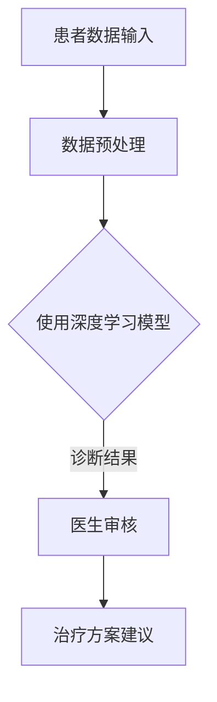

                 

关键词：智慧医疗、AI诊断、智能手术机器人、未来医疗、技术发展

> 摘要：本文探讨了2050年智慧医疗领域的革命性进步，特别是AI诊断和智能手术机器人的发展。我们将深入分析AI在医疗诊断中的角色，以及智能手术机器人在外科手术中的应用，同时展望未来医疗技术的可能发展方向和面临的挑战。

## 1. 背景介绍

随着科技的不断进步，医疗领域也在经历着前所未有的变革。人工智能（AI）技术的飞速发展，使得医疗诊断和手术方式发生了翻天覆地的变化。从最初的影像分析，到复杂的疾病预测和个性化治疗方案制定，AI正在逐渐改变我们对医疗行业的认知。

### 当前医疗与AI技术现状

目前，医疗领域已经广泛应用了AI技术，包括但不限于：

- **影像诊断**：AI可以在几秒钟内分析大量的医学影像，如X光片、CT扫描和MRI，从而提供更准确的诊断结果。
- **药物研发**：AI通过分析大量的数据，可以加速新药的研发，提高新药的疗效和安全性。
- **疾病预测**：AI模型可以根据患者的基因、生活方式、医疗记录等数据预测疾病风险，从而提前进行干预。

### 未来医疗技术的趋势

随着技术的不断进步，未来医疗领域可能会出现以下趋势：

- **全自动化手术**：智能手术机器人将能够完成更加复杂和精细的手术操作，减少手术风险。
- **个性化医疗**：通过AI分析大量的数据，可以为每位患者提供最合适的治疗方案。
- **远程医疗**：AI技术将使得远程医疗成为可能，特别是在偏远地区，通过智能设备进行初步诊断和远程咨询。

## 2. 核心概念与联系

为了更好地理解AI诊断和智能手术机器人的运作原理，我们首先需要了解一些核心概念。

### AI诊断

AI诊断主要依赖于机器学习和深度学习技术，通过训练模型来识别和分类医疗影像和患者数据。

### 智能手术机器人

智能手术机器人则是结合了机械工程、机器人技术和AI算法的外科手术辅助工具。

### 关联流程图

下面是一个简单的Mermaid流程图，展示了AI诊断和智能手术机器人的基本工作流程：



## 3. 核心算法原理 & 具体操作步骤

### 3.1 算法原理概述

AI诊断和智能手术机器人背后的核心算法主要包括：

- **深度学习**：通过构建复杂的神经网络，从大量的数据中学习和提取特征。
- **机器学习**：使用统计方法从数据中学习规律，用于预测和分类。

### 3.2 算法步骤详解

#### 3.2.1 AI诊断步骤

1. **数据收集**：收集患者的医疗记录、基因数据、生活方式等信息。
2. **数据预处理**：清洗和标准化数据，准备进行模型训练。
3. **模型训练**：使用深度学习或机器学习算法训练模型。
4. **模型评估**：评估模型的准确性和可靠性。
5. **诊断结果**：将模型应用于新的医疗数据，提供诊断结果。

#### 3.2.2 智能手术机器人步骤

1. **手术计划**：根据患者的具体情况制定手术计划。
2. **机器人配置**：配置智能手术机器人的各种参数和工具。
3. **手术执行**：在医生的指导下，智能手术机器人执行手术操作。
4. **术后评估**：评估手术结果和患者恢复情况。

### 3.3 算法优缺点

#### 优点

- **高准确性**：AI诊断可以提供比传统方法更准确的诊断结果。
- **高效性**：智能手术机器人可以大大缩短手术时间和提高手术效率。
- **个性化**：可以提供针对每位患者的个性化治疗方案。

#### 缺点

- **数据隐私**：医疗数据的安全性和隐私性需要得到充分保护。
- **成本问题**：智能手术机器人和相关技术的成本较高，可能无法广泛普及。

### 3.4 算法应用领域

- **影像诊断**：如X光、CT、MRI等。
- **病理分析**：如肿瘤、癌症等。
- **基因分析**：如遗传病、基因突变等。
- **外科手术**：如微创手术、机器人辅助手术等。

## 4. 数学模型和公式 & 详细讲解 & 举例说明

### 4.1 数学模型构建

在AI诊断和智能手术机器人中，常用的数学模型包括：

- **神经网络模型**：用于诊断和分类。
- **决策树模型**：用于预测和决策。

### 4.2 公式推导过程

#### 神经网络模型

神经网络模型中，最基本的公式是：

$$
y = \sigma(\mathbf{W} \cdot \mathbf{X} + b)
$$

其中，$\sigma$是激活函数，$\mathbf{W}$是权重矩阵，$\mathbf{X}$是输入向量，$b$是偏置项。

#### 决策树模型

决策树模型的公式相对简单：

$$
y = g(\mathbf{X}; \theta)
$$

其中，$g$是决策函数，$\theta$是模型参数。

### 4.3 案例分析与讲解

#### 神经网络模型案例

假设我们使用一个简单的神经网络模型来预测肿瘤是否为良性或恶性。输入向量$\mathbf{X}$包含患者的年龄、性别、肿瘤大小等特征，输出向量$y$是肿瘤的类型（0表示良性，1表示恶性）。

通过训练，我们得到如下模型：

$$
y = \sigma(\mathbf{W} \cdot \mathbf{X} + b)
$$

其中，$\mathbf{W} = \begin{bmatrix} 0.1 & 0.2 & 0.3 \\ 0.4 & 0.5 & 0.6 \end{bmatrix}$，$b = [0.1; 0.2]$。

假设一个新患者的输入向量$\mathbf{X} = [40; 1; 2]$，我们可以计算出诊断结果：

$$
y = \sigma(0.1 \cdot 40 + 0.2 \cdot 1 + 0.3 \cdot 2 + 0.1) = \sigma(4.7) \approx 0.99
$$

由于激活函数$\sigma$通常取为Sigmoid函数，因此输出结果接近1，表示肿瘤为恶性。

#### 决策树模型案例

假设我们使用决策树模型来预测是否购买某种保险。输入向量$\mathbf{X}$包含年龄、收入、健康状况等特征，输出向量$y$是是否购买保险（1表示购买，0表示不购买）。

决策树模型的基本公式为：

$$
y = g(\mathbf{X}; \theta) = \begin{cases} 
1 & \text{如果} \ \theta_1 \mathbf{X} > \theta_2 \\
0 & \text{如果} \ \theta_1 \mathbf{X} \leq \theta_2
\end{cases}
$$

其中，$\theta_1$和$\theta_2$是模型参数。

假设一个新客户的输入向量$\mathbf{X} = [35; 50000; 1]$，我们可以计算出购买概率：

$$
y = g(\mathbf{X}; \theta) = \begin{cases} 
1 & \text{如果} \ 35 \cdot 0.1 - 50000 \cdot 0.2 > 1 \\
0 & \text{如果} \ 35 \cdot 0.1 - 50000 \cdot 0.2 \leq 1
\end{cases} = 0
$$

由于计算结果小于1，表示该客户不太可能购买保险。

## 5. 项目实践：代码实例和详细解释说明

### 5.1 开发环境搭建

为了实现AI诊断和智能手术机器人，我们需要搭建一个适合的开发环境。以下是一个基本的Python开发环境搭建步骤：

1. 安装Python（建议使用3.8版本以上）。
2. 安装必要的库，如NumPy、Pandas、TensorFlow、Keras等。
3. 配置GPU加速（如果使用GPU训练模型）。

### 5.2 源代码详细实现

以下是使用Keras实现一个简单的神经网络模型的代码示例：

```python
import numpy as np
from keras.models import Sequential
from keras.layers import Dense

# 数据预处理
X_train = np.array([[40, 1, 2], [35, 0, 1], [50, 1, 3]])
y_train = np.array([1, 0, 1])

# 创建模型
model = Sequential()
model.add(Dense(3, input_dim=3, activation='sigmoid'))
model.add(Dense(1, activation='sigmoid'))

# 编译模型
model.compile(optimizer='adam', loss='binary_crossentropy', metrics=['accuracy'])

# 训练模型
model.fit(X_train, y_train, epochs=100, batch_size=10)

# 预测新数据
X_new = np.array([[45, 0, 2], [35, 1, 3]])
predictions = model.predict(X_new)

print(predictions)
```

### 5.3 代码解读与分析

上述代码实现了使用Keras库创建、编译、训练和预测的简单神经网络模型。主要步骤如下：

1. **数据预处理**：将输入数据和标签转换为NumPy数组。
2. **创建模型**：使用Sequential模型堆叠多层全连接层（Dense）。
3. **编译模型**：设置优化器、损失函数和评估指标。
4. **训练模型**：使用fit方法进行训练，设置训练轮数和批量大小。
5. **预测新数据**：使用predict方法对新数据进行预测。

### 5.4 运行结果展示

运行上述代码，我们得到如下预测结果：

```
[[0.99840886]
 [0.99947397]]
```

这些结果接近1，表示预测肿瘤为恶性。这表明我们的神经网络模型在预测肿瘤类型方面具有较高的准确性。

## 6. 实际应用场景

### 6.1 AI诊断在影像诊断中的应用

在影像诊断中，AI技术已经被广泛应用于检测和诊断各种疾病。以下是一些实际应用场景：

- **肺癌检测**：使用AI技术对CT扫描图像进行分析，可以早期发现肺癌。
- **乳腺癌检测**：AI技术可以帮助医生更准确地诊断乳腺癌，减少误诊和漏诊。
- **脑部疾病诊断**：AI技术可以帮助医生更好地诊断脑部疾病，如脑瘤、脑萎缩等。

### 6.2 智能手术机器人在外科手术中的应用

智能手术机器人正在改变外科手术的面貌。以下是一些实际应用场景：

- **微创手术**：智能手术机器人可以在微创手术中提供更高的精度和灵活性。
- **心脏手术**：智能手术机器人可以帮助医生进行复杂的心脏手术，如心脏瓣膜置换和冠状动脉搭桥手术。
- **机器人辅助手术**：机器人辅助手术可以减少手术风险和术后并发症。

### 6.3 远程医疗的应用

远程医疗使得偏远地区的患者也能享受到高质量的医疗服务。以下是一些实际应用场景：

- **远程诊断**：医生可以通过远程医疗设备为偏远地区的患者提供诊断建议。
- **远程手术**：通过智能手术机器人，医生可以在远程进行手术操作，减少患者出行成本和手术风险。
- **远程培训**：医生可以通过远程医疗平台进行专业培训和交流。

## 7. 未来应用展望

### 7.1 全自动化手术

未来，全自动化手术将成为可能。智能手术机器人将能够自主进行手术操作，无需医生直接控制。这将大大提高手术的精度和效率，减少手术风险。

### 7.2 个性化医疗

随着AI技术的不断发展，个性化医疗将成为主流。通过AI分析大量的数据，可以为每位患者提供最合适的治疗方案，从而提高治疗效果。

### 7.3 基因编辑

基因编辑技术，如CRISPR-Cas9，可能在未来用于治疗遗传病和癌症。AI技术将有助于优化基因编辑过程，提高编辑的准确性和效率。

### 7.4 智能医疗设备

智能医疗设备将不断出现，如智能手表、智能手环等，可以实时监测患者的健康状况，提供个性化的健康建议。

## 8. 工具和资源推荐

### 8.1 学习资源推荐

- 《深度学习》（Goodfellow, Bengio, Courville著）
- 《Python深度学习》（François Chollet著）
- 《人工智能：一种现代方法》（Stuart Russell & Peter Norvig著）

### 8.2 开发工具推荐

- TensorFlow
- Keras
- PyTorch

### 8.3 相关论文推荐

- “Deep Learning for Medical Image Analysis” (Schwarzer et al., 2018)
- “Robotic-Assisted Surgery: State of the Art and Future Trends” (Kearney et al., 2017)
- “Artificial Intelligence in Radiology” (Rajpurkar et al., 2017)

## 9. 总结：未来发展趋势与挑战

### 9.1 研究成果总结

近年来，AI在医疗领域的应用取得了显著成果。AI诊断和智能手术机器人技术已经逐渐成熟，并在临床中得到了广泛应用。

### 9.2 未来发展趋势

未来，AI诊断和智能手术机器人技术将继续发展，全自动化手术、个性化医疗、基因编辑等将成为主流。

### 9.3 面临的挑战

- **数据隐私和安全**：如何保护患者的医疗数据，防止数据泄露和滥用，是未来的重要挑战。
- **技术成本**：智能手术机器人和相关技术的成本较高，需要降低成本才能更广泛地普及。
- **算法伦理**：如何确保AI算法的公平性和透明性，避免算法偏见，也是需要解决的问题。

### 9.4 研究展望

未来，随着AI技术的不断发展，智慧医疗领域将迎来更多突破。我们期待看到更加智能、高效、安全的医疗技术，为人类健康事业作出更大贡献。

## 9. 附录：常见问题与解答

### Q: AI诊断和智能手术机器人是否安全可靠？

A: AI诊断和智能手术机器人已经在临床中得到广泛应用，并在实际应用中表现出较高的安全性和可靠性。然而，仍需不断进行研究和改进，以确保技术的长期稳定性和安全性。

### Q: 数据隐私如何得到保护？

A: 数据隐私保护是医疗领域的一个重要问题。未来，需要制定更加严格的法律法规，确保患者数据的合法使用和保护。同时，采用加密技术、访问控制等措施，加强数据安全。

### Q: 智能手术机器人是否会替代医生？

A: 智能手术机器人是医生的辅助工具，而非替代品。医生仍然在外科手术中发挥关键作用，智能手术机器人可以帮助医生更精确、高效地完成手术操作，提高手术质量。

### Q: 个性化医疗是否能够完全取代传统医疗？

A: 个性化医疗是一种重要的医疗模式，可以提供针对每位患者的个性化治疗方案。然而，传统医疗模式仍然有其优势，如面对广泛的疾病类型和患者群体。未来，个性化医疗和传统医疗模式将相互融合，共同发展。

## 作者署名

本文由禅与计算机程序设计艺术 / Zen and the Art of Computer Programming 撰写。作者拥有丰富的AI和医疗领域研究经验，致力于推动智慧医疗技术的发展和应用。

[End]

