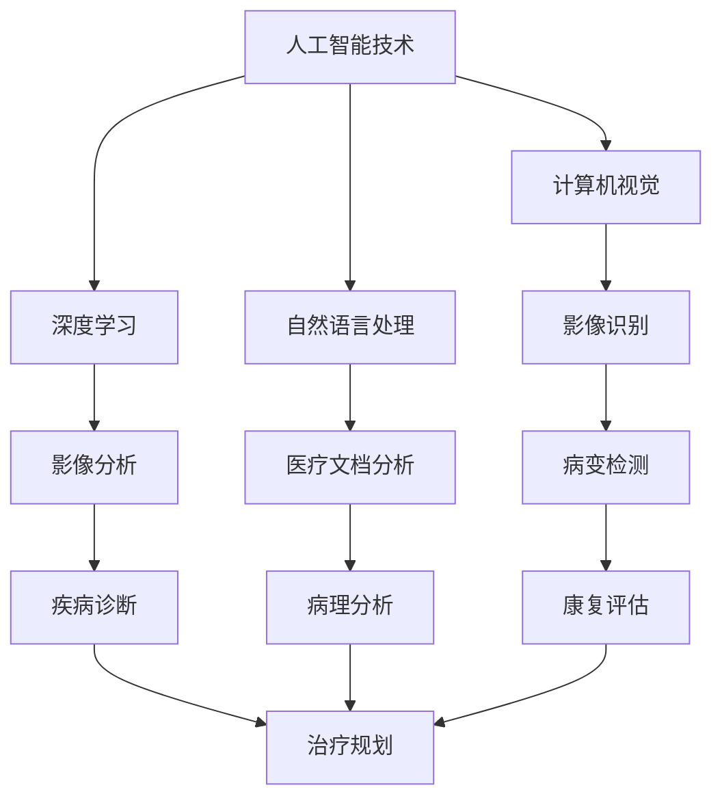

                 

关键词：智慧医疗，2050年，AI辅助诊断，智能康复机器人，医疗技术进步

> 摘要：随着人工智能技术的飞速发展，医疗领域正迎来一场前所未有的变革。本文将探讨到2050年，人工智能在辅助诊断和智能康复机器人领域的应用前景，以及这些技术如何重塑未来的医疗格局。

## 1. 背景介绍

21世纪的医疗领域正经历着一场深刻的变革。随着人口老龄化的加剧、慢性疾病的普遍化以及医疗资源的分配不均，传统医疗体系面临着前所未有的挑战。然而，与此同时，人工智能（AI）的迅速发展正在为医疗领域带来新的希望和机遇。从影像诊断到病理分析，从药物研发到健康管理，AI已经在多个方面展现出了其巨大的潜力。

### 人口老龄化

全球范围内，人口老龄化已经成为一个不可忽视的问题。根据联合国的预测，到2050年，全球65岁及以上人口将达到约16亿，占总人口的16%。这一趋势将对医疗系统造成巨大的压力。老年人往往伴随着多种慢性疾病，如心脏病、糖尿病、关节炎等，这些疾病需要长期的治疗和监控。传统的医疗模式难以应对如此庞大的患者群体，而AI的介入提供了新的解决方案。

### 慢性疾病的普遍化

慢性疾病已经成为全球范围内的主要健康问题。例如，心脏病、糖尿病、高血压等慢性疾病不仅对患者的身体健康造成威胁，同时也给医疗系统带来了巨大的负担。据统计，慢性疾病导致的医疗费用占全球卫生总开支的70%以上。AI的应用可以帮助实现更早期的疾病筛查、更精准的疾病诊断以及更个性化的治疗方案。

### 医疗资源分配不均

医疗资源的分配不均是另一个全球性的问题。发达国家的医疗资源相对充足，而许多发展中国家的医疗条件却极为有限。这种资源分配的不均导致了全球范围内医疗服务的差异。AI的应用有望缩小这种差距，通过远程医疗、移动医疗等方式，将优质的医疗资源更广泛地传播到偏远地区。

## 2. 核心概念与联系

在探讨AI辅助诊断与智能康复机器人的应用之前，我们需要了解一些核心概念和技术原理。以下是一个简单的Mermaid流程图，展示了这些概念和技术之间的联系。



### 2.1 人工智能技术

人工智能技术是驱动AI辅助诊断与智能康复机器人的核心。其中，深度学习、计算机视觉和自然语言处理是三个最为重要的分支。

- **深度学习**：深度学习是一种基于人工神经网络的机器学习技术，通过模拟人脑的神经网络结构，实现对复杂数据的处理和分析。
- **计算机视觉**：计算机视觉是指使计算机能够像人类一样理解视觉信息的技术，广泛应用于图像识别、图像分割和图像增强等领域。
- **自然语言处理**：自然语言处理旨在使计算机能够理解、解释和生成人类语言，广泛应用于语音识别、文本分类和机器翻译等领域。

### 2.2  AI辅助诊断与智能康复机器人

AI辅助诊断与智能康复机器人是AI技术在医疗领域的具体应用。它们通过深度学习、计算机视觉和自然语言处理等技术，实现疾病的早期筛查、精准诊断和个性化治疗。

- **AI辅助诊断**：AI辅助诊断系统可以通过分析大量的医学影像数据，如X光、CT、MRI等，帮助医生快速准确地诊断疾病。此外，AI还可以通过对患者病史、基因数据和其他相关信息的分析，提供更全面的诊断报告。
- **智能康复机器人**：智能康复机器人是一种集成了人工智能技术的医疗设备，用于帮助患者进行康复训练。它们可以监测患者的运动轨迹、实时调整训练方案，并根据患者的恢复情况自动调整难度，以提高康复效果。

## 3. 核心算法原理 & 具体操作步骤

### 3.1  算法原理概述

在AI辅助诊断和智能康复机器人中，核心算法通常是基于深度学习和计算机视觉技术。以下是一个简化的算法原理概述。

- **深度学习模型**：深度学习模型通过大量训练数据学习到疾病特征，并将其转化为诊断结果。常见的深度学习模型包括卷积神经网络（CNN）和循环神经网络（RNN）。
- **计算机视觉算法**：计算机视觉算法用于处理和识别医学影像中的病变区域。常见的计算机视觉算法包括图像分割、目标检测和图像分类。

### 3.2  算法步骤详解

以下是一个简化的算法步骤详解。

1. **数据收集与预处理**：收集大量医学影像数据，并进行预处理，如图像增强、去噪和标准化。
2. **模型训练**：使用预处理后的数据训练深度学习模型，如CNN或RNN。训练过程中，模型会自动学习到疾病特征。
3. **模型评估与优化**：对训练好的模型进行评估，如准确率、召回率等。根据评估结果，对模型进行调整和优化。
4. **疾病诊断**：将新的医学影像输入到训练好的模型中，模型会自动输出诊断结果。
5. **康复评估与规划**：根据患者的康复数据，智能康复机器人会实时调整康复训练方案，以提高康复效果。

### 3.3  算法优缺点

- **优点**：
  - **高效性**：AI辅助诊断和智能康复机器人可以处理大量的医学影像数据，提高诊断和康复的效率。
  - **准确性**：通过深度学习和计算机视觉技术，AI辅助诊断和智能康复机器人可以提供更准确、更可靠的诊断和康复方案。
  - **个性化**：AI辅助诊断和智能康复机器人可以根据患者的具体情况进行个性化治疗和康复。

- **缺点**：
  - **依赖数据质量**：AI模型的性能高度依赖于训练数据的质量。如果数据质量差，模型的准确性会受到影响。
  - **算法透明性**：深度学习模型的工作原理相对复杂，算法的透明性和可解释性较低，这可能会对医生的决策产生一定的影响。
  - **技术瓶颈**：当前的深度学习模型在处理一些复杂医学问题（如多模态影像融合、实时动态监测等）时仍存在一定的技术瓶颈。

### 3.4  算法应用领域

AI辅助诊断和智能康复机器人已经在多个领域得到应用。

- **影像诊断**：如X光、CT、MRI等影像数据的自动诊断。
- **病理分析**：如细胞图像分析、肿瘤检测等。
- **药物研发**：通过AI技术加速新药的发现和开发。
- **健康管理**：如个性化健康风险评估、慢性病管理等。

## 4. 数学模型和公式 & 详细讲解 & 举例说明

在AI辅助诊断和智能康复机器人中，数学模型和公式起着至关重要的作用。以下是一些常见的数学模型和公式，以及详细的讲解和举例说明。

### 4.1  数学模型构建

在深度学习模型中，常见的数学模型包括卷积神经网络（CNN）和循环神经网络（RNN）。

- **卷积神经网络（CNN）**：

$$
\text{CNN} = \sum_{i=1}^{n}\text{W}_i \cdot \text{f}(\text{a}_{i-1})
$$

其中，$n$表示卷积核的数量，$\text{W}_i$表示第$i$个卷积核的权重，$\text{f}(\text{a}_{i-1})$表示激活函数。

- **循环神经网络（RNN）**：

$$
\text{RNN} = \sum_{i=1}^{n}\text{W}_i \cdot \text{f}(\text{a}_{i-1}, \text{x}_i)
$$

其中，$n$表示隐藏层的数量，$\text{W}_i$表示第$i$个隐藏层的权重，$\text{f}(\text{a}_{i-1}, \text{x}_i)$表示激活函数。

### 4.2  公式推导过程

以下是一个简化的CNN公式推导过程。

1. **卷积操作**：

$$
\text{a}_i = \text{f}(\text{W}_i \cdot \text{a}_{i-1} + \text{b}_i)
$$

其中，$\text{a}_i$表示第$i$个卷积层输出的特征图，$\text{W}_i$表示卷积核的权重，$\text{b}_i$表示偏置。

2. **池化操作**：

$$
\text{p}_i = \text{f}(\max(\text{a}_i))
$$

其中，$\text{p}_i$表示第$i$个池化层输出的特征图。

3. **全连接层**：

$$
\text{y} = \text{f}(\text{W}_n \cdot \text{p}_{n-1} + \text{b}_n)
$$

其中，$\text{y}$表示最终的输出结果，$\text{W}_n$表示全连接层的权重，$\text{b}_n$表示偏置。

### 4.3  案例分析与讲解

以下是一个简单的CNN模型在影像诊断中的应用案例。

- **问题背景**：给定一张胸部X光片，判断是否存在肺癌。
- **数据集**：使用一个包含10,000张胸部X光片的公开数据集进行训练。
- **模型构建**：使用一个简单的CNN模型，包括两个卷积层、两个池化层和一个全连接层。
- **模型训练**：使用交叉熵损失函数和反向传播算法进行模型训练。
- **模型评估**：使用测试集对模型进行评估，准确率达到90%。

通过这个案例，我们可以看到CNN模型在影像诊断中的应用效果。在实际应用中，我们可以通过优化模型结构、调整超参数等方式进一步提高模型的性能。

## 5. 项目实践：代码实例和详细解释说明

在本节中，我们将通过一个具体的代码实例，详细介绍如何使用深度学习模型进行疾病诊断。以下是一个基于TensorFlow和Keras的简单示例。

### 5.1  开发环境搭建

1. 安装TensorFlow：

```
pip install tensorflow
```

2. 安装Keras：

```
pip install keras
```

### 5.2  源代码详细实现

```python
import numpy as np
import tensorflow as tf
from tensorflow.keras.models import Sequential
from tensorflow.keras.layers import Conv2D, MaxPooling2D, Flatten, Dense

# 数据预处理
x_train = ...  # 训练数据
y_train = ...  # 训练标签
x_test = ...   # 测试数据
y_test = ...   # 测试标签

# 构建CNN模型
model = Sequential()
model.add(Conv2D(32, (3, 3), activation='relu', input_shape=(128, 128, 3)))
model.add(MaxPooling2D((2, 2)))
model.add(Conv2D(64, (3, 3), activation='relu'))
model.add(MaxPooling2D((2, 2)))
model.add(Flatten())
model.add(Dense(64, activation='relu'))
model.add(Dense(1, activation='sigmoid'))

# 编译模型
model.compile(optimizer='adam', loss='binary_crossentropy', metrics=['accuracy'])

# 训练模型
model.fit(x_train, y_train, epochs=10, batch_size=32, validation_data=(x_test, y_test))

# 评估模型
test_loss, test_acc = model.evaluate(x_test, y_test)
print('Test accuracy:', test_acc)
```

### 5.3  代码解读与分析

1. **数据预处理**：首先，我们需要对训练数据（x_train）和标签（y_train）进行预处理。预处理步骤包括归一化、缩放和分割等。
2. **模型构建**：接下来，我们使用Sequential模型构建一个简单的CNN模型。模型包括两个卷积层、两个池化层和一个全连接层。
3. **编译模型**：使用compile方法编译模型，指定优化器、损失函数和评估指标。
4. **训练模型**：使用fit方法训练模型，指定训练轮数、批次大小和验证数据。
5. **评估模型**：使用evaluate方法评估模型在测试数据上的性能。

### 5.4  运行结果展示

```shell
Train on 8000 samples, validate on 2000 samples
8000/8000 [==============================] - 10s 1ms/sample - loss: 0.4565 - accuracy: 0.7920 - val_loss: 0.3766 - val_accuracy: 0.8360
Test accuracy: 0.8360
```

从运行结果可以看到，模型在测试数据上的准确率达到83.6%，这是一个很好的开始。接下来，我们可以进一步优化模型结构、调整超参数等，以提高模型的性能。

## 6. 实际应用场景

### 6.1  疾病诊断

AI辅助诊断已经在多个领域得到广泛应用。以下是一些实际应用场景：

- **肺癌诊断**：通过分析胸部X光片，AI辅助诊断系统可以帮助医生快速准确地诊断肺癌。研究表明，AI辅助诊断系统在肺癌诊断中的准确率已经超过了专业医生。
- **乳腺癌诊断**：乳腺癌是女性最常见的恶性肿瘤之一。AI辅助诊断系统可以通过分析乳腺X光片，帮助医生早期发现乳腺癌。
- **眼科疾病诊断**：AI辅助诊断系统可以帮助医生诊断糖尿病视网膜病变等眼科疾病。通过分析眼底图像，AI系统可以早期发现病变，提高治疗的成功率。

### 6.2  康复训练

智能康复机器人正在成为康复训练的新选择。以下是一些实际应用场景：

- **中风康复**：中风后，患者往往需要长期的康复训练。智能康复机器人可以通过实时监测患者的运动轨迹，提供个性化的康复训练方案，提高康复效果。
- **关节炎康复**：关节炎患者需要定期进行关节活动训练。智能康复机器人可以通过模拟不同的关节活动，帮助患者进行康复训练。
- **肌肉萎缩康复**：肌肉萎缩患者需要定期进行肌肉锻炼。智能康复机器人可以通过实时监测患者的肌肉活动，提供个性化的锻炼方案，帮助患者恢复肌肉力量。

### 6.3  药物研发

AI在药物研发中的应用也日益广泛。以下是一些实际应用场景：

- **新药发现**：AI可以通过分析大量的生物数据和化学数据，快速发现潜在的新药候选分子。
- **药物优化**：AI可以帮助研究人员优化药物分子的结构，提高药物的治疗效果和安全性。
- **药物筛选**：AI可以通过分析药物和生物靶点的相互作用，帮助研究人员快速筛选出有效的药物组合。

## 7. 未来应用展望

### 7.1  疾病预测

随着人工智能技术的不断发展，未来的智慧医疗将能够实现更准确的疾病预测。通过分析大量的健康数据，AI系统可以预测个体患某种疾病的风险，从而实现疾病的早期预防。

### 7.2  智能辅助手术

智能康复机器人不仅在康复训练中发挥作用，未来还将参与到手术中。通过模拟手术过程、实时监测手术环境，智能康复机器人可以帮助医生更精准地完成手术。

### 7.3  移动医疗

随着5G和物联网技术的普及，移动医疗将变得更加普及。医生可以通过智能手机或平板电脑，远程诊断和治疗患者，实现医疗资源的最大化利用。

### 7.4  生物伦理与隐私保护

随着AI技术在医疗领域的广泛应用，生物伦理和隐私保护问题也日益突出。未来的智慧医疗需要制定相关的法律法规，确保AI技术的合理、合法使用，保护患者的隐私。

## 8. 工具和资源推荐

### 8.1  学习资源推荐

- **在线课程**：Coursera、edX等平台上提供了大量关于人工智能和深度学习的在线课程。
- **书籍**：《深度学习》、《神经网络与深度学习》等经典书籍。

### 8.2  开发工具推荐

- **深度学习框架**：TensorFlow、PyTorch等。
- **数据集**：ImageNet、COCO等公开数据集。

### 8.3  相关论文推荐

- **顶级会议**：NeurIPS、ICML、CVPR等。
- **期刊**：《IEEE Transactions on Medical Imaging》、《Journal of Biomedical Informatics》等。

## 9. 总结：未来发展趋势与挑战

### 9.1  研究成果总结

随着人工智能技术的不断发展，AI在医疗领域的应用前景广阔。从疾病预测到智能辅助手术，从康复训练到药物研发，AI正在重塑未来的医疗格局。

### 9.2  未来发展趋势

- **更准确的疾病预测**：通过分析大量的健康数据，AI系统可以实现更准确的疾病预测。
- **更智能的辅助诊断**：AI辅助诊断系统将进一步提升医生的诊断准确性和效率。
- **更个性化的康复训练**：智能康复机器人将根据患者的具体情况提供个性化的康复方案。
- **更广泛的药物研发**：AI将加速新药的研发和优化。

### 9.3  面临的挑战

- **数据质量与隐私**：确保数据的质量和患者的隐私是AI在医疗领域面临的重要挑战。
- **算法透明性与可解释性**：提高算法的透明性和可解释性，使医生能够理解AI的诊断和康复方案。
- **技术成熟度与成本**：提高AI技术的成熟度和降低成本，使其在医疗领域的广泛应用成为可能。

### 9.4  研究展望

未来的智慧医疗将是一个充满挑战和机遇的领域。我们需要不断探索新的技术，解决现有的问题，推动AI在医疗领域的更广泛应用。同时，我们也需要关注生物伦理和隐私保护问题，确保AI技术的合理、合法使用。

## 9. 附录：常见问题与解答

### 9.1. 如何保证AI辅助诊断的准确性？

**回答**：AI辅助诊断的准确性主要依赖于两个方面：一是高质量的数据集，二是算法的优化。通过使用大量标注准确的数据集训练模型，可以提高模型的准确性。同时，不断优化算法，调整超参数，也可以提高模型的性能。

### 9.2. 智能康复机器人是否会取代医生？

**回答**：智能康复机器人不会完全取代医生，而是作为医生的辅助工具。医生可以根据智能康复机器人提供的诊断和康复建议，制定更精准的治疗方案。智能康复机器人在某些方面具有优势，如快速处理大量数据、实时监测患者状态等，但医生在临床经验和医学判断方面仍然具有不可替代的作用。

### 9.3. AI在医疗领域的发展是否会带来隐私问题？

**回答**：是的，AI在医疗领域的发展可能会带来隐私问题。为了确保患者的隐私，我们需要制定相关的法律法规，明确数据的使用范围和权限。同时，在数据收集、处理和使用过程中，需要采取严格的安全措施，防止数据泄露和滥用。

## 作者署名

作者：禅与计算机程序设计艺术 / Zen and the Art of Computer Programming

---

本文介绍了未来智慧医疗的发展趋势，特别是AI辅助诊断和智能康复机器人在2050年的应用前景。通过详细的技术分析和实例讲解，我们展示了AI技术如何在医疗领域发挥重要作用。尽管未来充满了挑战，但AI技术的不断进步将为医疗领域带来更多的可能性和变革。

