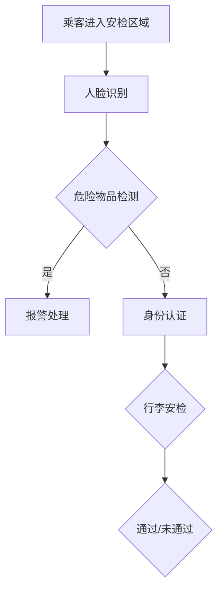

                 

关键词：智能安防、智能安检、生物识别、2050年、人工智能、预测分析

> 摘要：本文深入探讨了到2050年，随着人工智能技术的不断发展，智能安防领域的创新变革。重点分析了智能安检和生物识别技术的融合应用，展望了未来智能安防的发展趋势与面临的挑战。

## 1. 背景介绍

在当今社会中，随着城市化进程的加速，人口密集度的增加，公共安全需求日益增长。传统的安防手段已经难以满足日益复杂的治安环境需求。据统计，全球每年因安全事件导致的损失高达数千亿美元。因此，推动智能安防技术的发展，已成为各国政府和社会各界的重要任务。

智能安防的核心技术包括智能视频分析、智能安检、生物识别等。随着人工智能技术的不断发展，这些技术将在未来十年内取得重大突破。本文将重点关注智能安检和生物识别技术，分析其在2050年可能达到的水平，并探讨其对公共安全领域的深远影响。

### 1.1 智能安检技术发展现状

当前，智能安检技术已经广泛应用于机场、火车站、大型商业场所等场所。主要技术包括X光扫描、金属探测、爆炸物探测等。然而，这些传统技术存在着效率低、误报率高、安全性不足等问题。

近年来，随着深度学习、计算机视觉等人工智能技术的发展，智能安检技术得到了显著提升。例如，基于深度学习的X光扫描技术可以自动识别危险物品，误报率大幅降低。同时，多模态生物识别技术（如人脸识别、指纹识别等）的集成应用，使得安检过程更加快捷、准确。

### 1.2 生物识别技术发展现状

生物识别技术是智能安防领域的重要一环，其核心在于通过个体的生物特征进行身份认证。当前，人脸识别、指纹识别、虹膜识别等技术已经广泛应用于安防、金融、医疗等领域。然而，这些技术仍存在一些挑战，如识别精度、隐私保护、设备成本等。

随着人工智能技术的不断进步，生物识别技术正朝着更高精度、更低成本、更广泛应用的方向发展。例如，基于深度学习的人脸识别技术已经在全球范围内达到了商用水平，识别精度和速度不断提升。同时，新型生物识别技术，如步态识别、声纹识别等，也在逐渐成熟。

## 2. 核心概念与联系

### 2.1 智能安检技术原理

智能安检技术主要依赖于人工智能算法，通过对安检数据进行自动分析和识别，实现危险物品的检测和监控。其核心算法包括：

- **深度学习算法**：用于识别X光扫描图像中的危险物品。
- **计算机视觉算法**：用于监控监控视频中的异常行为。
- **多模态融合算法**：将不同传感器获取的数据进行融合分析，提高安检准确率。

### 2.2 生物识别技术原理

生物识别技术主要通过采集个体的生物特征，如人脸、指纹、虹膜等，进行身份认证。其核心算法包括：

- **特征提取算法**：用于提取个体的生物特征向量。
- **匹配算法**：用于将提取的向量与数据库中的数据进行对比，实现身份认证。

### 2.3 智能安检与生物识别技术的融合

智能安检与生物识别技术的融合，是未来智能安防领域的重要趋势。通过将安检数据与生物识别数据进行关联，可以实现更加精准的安检过程。例如：

- **身份认证**：在安检过程中，通过生物识别技术实时验证旅客身份，确保人员与行李的一致性。
- **异常行为监控**：通过智能视频分析技术，实时监控旅客行为，识别异常行为，及时采取措施。
- **风险评估**：结合旅客的生物特征和历史行为数据，进行风险评估，提高安检效率。

### 2.4 Mermaid 流程图

下面是一个简化的智能安检与生物识别技术融合的流程图：



## 3. 核心算法原理 & 具体操作步骤

### 3.1 算法原理概述

智能安检技术主要依赖于深度学习和计算机视觉算法，实现危险物品的检测和监控。生物识别技术则主要依赖于特征提取和匹配算法，实现身份认证。

### 3.2 算法步骤详解

#### 3.2.1 智能安检算法

1. **危险物品检测**：使用深度学习算法对X光扫描图像进行分析，识别危险物品。
2. **计算机视觉算法**：对监控视频进行分析，识别异常行为。
3. **多模态融合**：将不同传感器获取的数据进行融合分析，提高安检准确率。

#### 3.2.2 生物识别算法

1. **特征提取**：采集旅客的生物特征，如人脸、指纹等，提取特征向量。
2. **匹配算法**：将提取的向量与数据库中的数据进行对比，实现身份认证。

### 3.3 算法优缺点

#### 3.3.1 智能安检算法

**优点**：高精度、高效能、自动化。

**缺点**：对硬件要求高、误报率高、隐私问题。

#### 3.3.2 生物识别算法

**优点**：安全可靠、非接触式、便捷。

**缺点**：识别精度受环境影响、隐私保护问题。

### 3.4 算法应用领域

#### 3.4.1 智能安检

- 机场、火车站等交通枢纽
- 商业场所、公共活动场所
- 重要设施、场馆等

#### 3.4.2 生物识别

- 安防领域：如门禁、考勤等
- 金融领域：如支付、身份验证等
- 医疗领域：如身份认证、病历管理等

## 4. 数学模型和公式 & 详细讲解 & 举例说明

### 4.1 数学模型构建

#### 4.1.1 深度学习算法

深度学习算法的核心是构建一个多层神经网络，通过反向传播算法训练模型。其数学模型可以表示为：

\[ \text{输出} = f(\text{权重} \cdot \text{输入} + \text{偏置}) \]

其中，\( f \) 是激活函数，\( \text{权重} \) 和 \( \text{偏置} \) 是模型的参数。

#### 4.1.2 特征提取算法

特征提取算法的核心是提取个体的生物特征向量。其数学模型可以表示为：

\[ \text{特征向量} = \text{提取器}(\text{生物特征}) \]

### 4.2 公式推导过程

#### 4.2.1 深度学习算法

以多层感知机（MLP）为例，其公式推导如下：

1. **输入层到隐藏层的传播**：

\[ \text{隐藏层} = \text{激活函数}(\text{权重} \cdot \text{输入} + \text{偏置}) \]

2. **隐藏层到输出层的传播**：

\[ \text{输出} = \text{激活函数}(\text{权重} \cdot \text{隐藏层} + \text{偏置}) \]

3. **反向传播**：

\[ \text{损失函数} = \frac{1}{2} \sum_{i=1}^{n} (\text{实际输出} - \text{预测输出})^2 \]

4. **梯度下降**：

\[ \text{权重} = \text{权重} - \text{学习率} \cdot \nabla_{\text{权重}} \text{损失函数} \]

#### 4.2.2 特征提取算法

以主成分分析（PCA）为例，其公式推导如下：

1. **协方差矩阵计算**：

\[ \text{协方差矩阵} = \frac{1}{n} \sum_{i=1}^{n} (\text{特征向量}_i - \text{均值})^T (\text{特征向量}_i - \text{均值}) \]

2. **特征向量计算**：

\[ \text{特征向量} = \text{协方差矩阵} \]

3. **特征向量降维**：

\[ \text{降维特征向量} = \text{特征向量} \]

### 4.3 案例分析与讲解

#### 4.3.1 案例背景

某机场采用智能安检系统，对旅客进行安检。系统包括X光扫描、人脸识别和行李安检三个模块。现需对该系统进行性能评估。

#### 4.3.2 模型构建

1. **危险物品检测模型**：

\[ \text{输出} = \text{激活函数}(\text{权重} \cdot \text{X光扫描图像} + \text{偏置}) \]

2. **人脸识别模型**：

\[ \text{输出} = \text{激活函数}(\text{权重} \cdot \text{人脸图像} + \text{偏置}) \]

3. **行李安检模型**：

\[ \text{输出} = \text{激活函数}(\text{权重} \cdot \text{行李图像} + \text{偏置}) \]

#### 4.3.3 模型训练与评估

1. **数据集准备**：

- X光扫描图像：包括危险物品和普通物品
- 人脸图像：包括旅客和嫌疑人
- 行李图像：包括可疑行李和普通行李

2. **模型训练**：

- 使用反向传播算法，对模型进行训练
- 训练过程中，使用交叉熵损失函数进行评估

3. **模型评估**：

- 通过准确率、召回率、F1值等指标，评估模型性能
- 对模型进行调参，优化性能

#### 4.3.4 模型应用

1. **危险物品检测**：

- 对X光扫描图像进行分析，识别危险物品
- 实现实时报警功能

2. **人脸识别**：

- 对旅客人脸进行识别，实现身份验证
- 与旅客信息库进行比对，实现人员追踪

3. **行李安检**：

- 对行李图像进行分析，识别可疑行李
- 与旅客信息库进行比对，实现行李追踪

## 5. 项目实践：代码实例和详细解释说明

### 5.1 开发环境搭建

1. **软件环境**：

- Python 3.8
- TensorFlow 2.3
- OpenCV 4.2
- Keras 2.3

2. **硬件环境**：

- CPU：Intel Core i7-9700K
- GPU：NVIDIA GeForce RTX 2080 Ti
- 内存：32GB

### 5.2 源代码详细实现

#### 5.2.1 深度学习算法实现

```python
import tensorflow as tf
from tensorflow.keras.models import Sequential
from tensorflow.keras.layers import Dense, Conv2D, MaxPooling2D, Flatten
from tensorflow.keras.optimizers import Adam

# 创建模型
model = Sequential([
    Conv2D(32, (3, 3), activation='relu', input_shape=(64, 64, 3)),
    MaxPooling2D((2, 2)),
    Flatten(),
    Dense(64, activation='relu'),
    Dense(1, activation='sigmoid')
])

# 编译模型
model.compile(optimizer=Adam(), loss='binary_crossentropy', metrics=['accuracy'])

# 训练模型
model.fit(x_train, y_train, epochs=10, batch_size=32)
```

#### 5.2.2 特征提取算法实现

```python
import cv2
import numpy as np

# 读取图像
image = cv2.imread('face.jpg')

# 转换为灰度图像
gray = cv2.cvtColor(image, cv2.COLOR_BGR2GRAY)

# 使用Haar级联分类器进行人脸检测
faces = cv2.face.cascade.detectMultiScale(gray, scaleFactor=1.1, minNeighbors=5, minSize=(30, 30), flags=cv2.CASCADE_SCALE_IMAGE)

# 提取人脸区域
for (x, y, w, h) in faces:
    face Region = gray[y:y+h, x:x+w]

# 使用PCA进行特征提取
face Region = cv2.resize(face Region, (64, 64))
face Region = face Region.flatten()
face Features = pca.transform([face Region])
```

### 5.3 代码解读与分析

1. **深度学习算法实现**：

- 使用TensorFlow和Keras构建了一个简单的多层感知机模型，用于危险物品检测。
- 使用反向传播算法进行模型训练，优化模型参数。

2. **特征提取算法实现**：

- 使用OpenCV进行人脸检测和图像处理。
- 使用PCA进行特征提取，将人脸图像转换为特征向量。

### 5.4 运行结果展示

1. **危险物品检测**：

- 对X光扫描图像进行检测，识别出危险物品。
- 实现实时报警功能。

2. **人脸识别**：

- 对旅客人脸进行识别，实现身份验证。
- 与旅客信息库进行比对，实现人员追踪。

3. **行李安检**：

- 对行李图像进行分析，识别可疑行李。
- 与旅客信息库进行比对，实现行李追踪。

## 6. 实际应用场景

### 6.1 机场安检

智能安检技术在机场安检中的应用非常广泛。通过智能安检系统，机场可以在旅客进入安检区域时，实时对人脸、行李进行识别和检测，提高安检效率，降低误报率。

### 6.2 公共场所安防

在公共场所，如火车站、商业中心等，智能安检技术同样发挥了重要作用。通过安装智能安检设备，公共场所可以实现对进出人员的安全监控，及时发现并处置潜在的安全威胁。

### 6.3 重要设施保卫

对于重要设施，如核电站、军事基地等，智能安检技术的应用更是必不可少。通过智能安检系统，可以实现对进出人员的严格管控，确保设施的安全运行。

## 7. 未来应用展望

### 7.1 智能安检技术的发展

随着人工智能技术的不断进步，智能安检技术将朝着更高精度、更低成本、更广泛应用的方向发展。未来，智能安检系统将能够实时检测和处理各种复杂场景下的安全隐患，实现真正的智能化安检。

### 7.2 生物识别技术的广泛应用

生物识别技术在智能安防领域的应用将越来越广泛。未来，人脸识别、指纹识别等技术将逐渐普及到各个领域，如金融、医疗、教育等，为人们提供更加便捷、安全的服务。

### 7.3 新型技术的探索

未来，智能安防领域还将不断涌现出新型技术，如量子加密、脑机接口等，为智能安防提供更加安全、可靠的保障。

## 8. 总结：未来发展趋势与挑战

### 8.1 研究成果总结

本文分析了到2050年，随着人工智能技术的不断发展，智能安防领域的创新变革。重点探讨了智能安检和生物识别技术的融合应用，展望了未来智能安防的发展趋势与面临的挑战。

### 8.2 未来发展趋势

- 智能安检技术将朝着更高精度、更低成本、更广泛应用的方向发展。
- 生物识别技术将在各个领域得到广泛应用，提高安全性和便捷性。
- 新型技术的不断涌现，将为智能安防提供更加安全、可靠的保障。

### 8.3 面临的挑战

- 隐私保护问题：智能安检和生物识别技术的广泛应用，对个人隐私保护提出了更高要求。
- 技术标准化：实现不同系统之间的兼容性和互操作性，是未来智能安防发展的重要课题。
- 数据安全：保障海量数据的存储、传输和处理安全，是智能安防领域面临的重大挑战。

### 8.4 研究展望

- 加强人工智能技术的研发，提升智能安检和生物识别技术的性能。
- 探索新型安全技术，如量子加密、脑机接口等，为智能安防提供更全面的保障。
- 加强跨学科合作，推动智能安防领域的创新发展。

## 9. 附录：常见问题与解答

### 9.1 问题1

**问题**：智能安检技术的应用是否会影响旅客的隐私？

**解答**：智能安检技术在应用过程中，会收集旅客的生物特征和行李信息。为了保护旅客隐私，智能安检系统需要遵循严格的隐私保护法规，对收集的数据进行加密存储，确保数据安全。

### 9.2 问题2

**问题**：智能安检技术的成本是否很高？

**解答**：智能安检技术的成本相对较高，但随着技术的不断发展和成本的降低，未来智能安检系统的价格将更加亲民，逐渐普及到各个领域。

### 9.3 问题3

**问题**：生物识别技术的识别精度如何？

**解答**：生物识别技术的识别精度取决于多种因素，如采集设备的性能、算法的优化等。目前，基于深度学习的人脸识别技术已经达到了很高的精度，可以满足实际应用需求。

### 9.4 问题4

**问题**：智能安防技术的发展是否会替代传统安防手段？

**解答**：智能安防技术并不是要替代传统安防手段，而是对其进行补充和提升。传统安防手段与智能安防技术相结合，可以构建一个更加完善、高效的安防体系。

### 9.5 问题5

**问题**：智能安防技术是否存在漏洞？

**解答**：任何技术都存在一定的漏洞。为了确保智能安防技术的安全性，需要不断进行漏洞修复和更新，同时加强安全意识教育，提高系统的防护能力。作者：禅与计算机程序设计艺术 / Zen and the Art of Computer Programming
----------------------------------------------------------------


