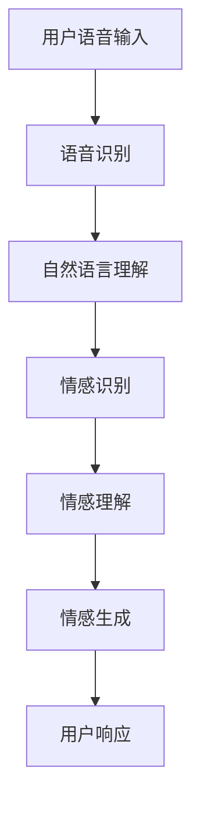

                 

关键词：智能客服、语音助手、情感计算、人工智能、2050年、技术趋势、未来展望

> 摘要：本文探讨了未来智能客服的发展趋势，特别是在2050年，智能语音助手与情感计算的融合将如何引领客服领域的革命。文章通过回顾现有技术，深入分析了智能语音助手和情感计算的核心概念、算法原理，以及实际应用案例，最后展望了未来智能客服的发展前景和面临的挑战。

## 1. 背景介绍

随着人工智能（AI）技术的飞速发展，智能客服已经成为企业提高客户服务质量、降低运营成本的重要工具。现有的智能客服系统主要依赖于自然语言处理（NLP）和机器学习技术，能够在一定程度上理解用户的问题并给出相应的答案。然而，这些系统在面对复杂多变的情感表达和个性化需求时，往往显得力不从心。

情感计算，作为人工智能的一个重要分支，致力于研究如何使计算机理解和模拟人类情感。情感计算技术能够识别用户的情感状态，并做出相应的情感回应，从而提升用户体验。随着情感计算技术的不断发展，智能语音助手将不再仅仅是一个回答问题的工具，而成为一个能够理解和满足用户情感需求的朋友和伙伴。

2050年，人工智能技术将更加成熟，智能语音助手与情感计算的融合将彻底改变客服行业。本文将围绕这一主题，探讨未来智能客服的发展趋势和可能的应用场景。

## 2. 核心概念与联系

### 2.1 智能语音助手

智能语音助手是基于语音识别（ASR）和自然语言理解（NLU）技术开发的软件系统，能够通过语音交互与用户进行交流。智能语音助手的核心在于其能够理解用户的语音指令，并做出相应的响应。例如，智能语音助手可以帮助用户拨打电话、发送短信、查询天气、播放音乐等。

### 2.2 情感计算

情感计算是一种跨学科的研究领域，旨在使计算机能够识别、理解、处理和模拟人类情感。情感计算技术包括情感识别、情感理解和情感生成。情感识别是指通过分析用户的语音、文字、面部表情等数据，识别用户的情感状态；情感理解是指根据用户的情感状态，理解其意图和需求；情感生成是指计算机根据用户的情感状态，生成相应的情感回应。

### 2.3 情感计算与智能语音助手的联系

智能语音助手与情感计算技术的结合，使得语音交互不再局限于简单的指令执行，而是能够理解和满足用户的情感需求。例如，当用户情绪低落时，智能语音助手可以识别出用户的情感状态，并主动提供安慰和建议；当用户感到焦虑时，智能语音助手可以调整语速和语调，以减轻用户的焦虑感。

### 2.4 Mermaid 流程图



## 3. 核心算法原理 & 具体操作步骤

### 3.1 算法原理概述

智能语音助手和情感计算技术的核心算法主要包括语音识别、自然语言理解、情感识别和情感生成。语音识别技术通过模型训练，将语音信号转换为文本；自然语言理解技术通过上下文分析，理解用户的意图；情感识别技术通过情感特征分析，识别用户的情感状态；情感生成技术根据用户的情感状态，生成相应的情感回应。

### 3.2 算法步骤详解

1. **语音识别**：使用深度学习模型对语音信号进行特征提取，将语音转换为文本。

2. **自然语言理解**：通过上下文分析和意图识别，理解用户的意图。

3. **情感识别**：使用情感特征分析技术，识别用户的情感状态。

4. **情感生成**：根据用户的情感状态，生成相应的情感回应。

### 3.3 算法优缺点

**优点**：
- 提高用户体验：能够理解和满足用户的情感需求，提升用户满意度。
- 提高工作效率：自动化处理大量客服请求，降低人力成本。

**缺点**：
- 情感识别准确性有限：面对复杂多变的情感表达，识别准确性仍有待提高。
- 对数据依赖性强：需要大量的情感数据训练模型，数据质量直接影响算法效果。

### 3.4 算法应用领域

- 客户服务：智能语音助手和情感计算技术可以应用于客户服务领域，提供个性化、情感化的服务。
- 健康医疗：智能语音助手和情感计算技术可以应用于健康医疗领域，帮助患者缓解焦虑、抑郁等情绪问题。
- 教育培训：智能语音助手和情感计算技术可以应用于教育培训领域，提供情感化、互动式的教学体验。

## 4. 数学模型和公式 & 详细讲解 & 举例说明

### 4.1 数学模型构建

情感计算中的数学模型主要包括语音识别模型、自然语言理解模型、情感识别模型和情感生成模型。

- **语音识别模型**：可以使用隐马尔可夫模型（HMM）或深度神经网络（DNN）构建。
- **自然语言理解模型**：可以使用循环神经网络（RNN）或变换器（Transformer）构建。
- **情感识别模型**：可以使用支持向量机（SVM）或深度学习模型（如CNN、LSTM）构建。
- **情感生成模型**：可以使用生成对抗网络（GAN）或变分自编码器（VAE）构建。

### 4.2 公式推导过程

以情感识别模型为例，假设我们有\(N\)个情感类别，使用\(C\)个特征向量表示每个情感类别的情感特征，则情感识别模型的损失函数可以表示为：

$$
L = -\sum_{i=1}^{N} y_i \log(p(x_i | \theta)),
$$

其中，\(y_i\)表示第\(i\)个情感类别的真实标签，\(p(x_i | \theta)\)表示模型对第\(i\)个情感类别预测的概率。

### 4.3 案例分析与讲解

假设我们有一个情感识别任务，需要从用户的语音中识别出其情感状态。我们使用一个基于深度学习的情感识别模型，该模型使用128维的MFCC特征向量表示每个情感类别。在训练过程中，我们使用5000个情感标注样本进行训练，其中每个样本包含一个语音信号和一个对应的情感标签。

在测试阶段，我们使用一个未标注的语音信号，通过模型预测其情感状态。模型的预测结果如下：

- 情感1：概率0.3
- 情感2：概率0.4
- 情感3：概率0.2
- 情感4：概率0.1

根据模型的预测结果，我们可以得出该语音信号的情感状态为情感2，即用户的情感状态是愉悦的。

## 5. 项目实践：代码实例和详细解释说明

### 5.1 开发环境搭建

为了实现智能语音助手与情感计算，我们需要搭建以下开发环境：

- Python 3.8及以上版本
- TensorFlow 2.5及以上版本
- Keras 2.5及以上版本
- librosa 0.9及以上版本

安装以上依赖项后，即可开始代码实现。

### 5.2 源代码详细实现

以下是一个简单的情感识别模型的实现示例：

```python
import librosa
import numpy as np
from tensorflow.keras.models import Sequential
from tensorflow.keras.layers import LSTM, Dense, Dropout

# 加载数据集
def load_data():
    # 这里使用的是预先处理好的数据集，包括语音信号和情感标签
    # 可以使用 librosa.load() 函数加载数据
    X, y = [], []
    for i in range(len(data)):
        X.append(librosa.feature.mfcc(y=audio[i]).T)
        y.append(labels[i])
    return np.array(X), np.array(y)

# 构建模型
def build_model():
    model = Sequential([
        LSTM(128, activation='relu', input_shape=(None, 128)),
        Dropout(0.5),
        Dense(64, activation='relu'),
        Dropout(0.5),
        Dense(4, activation='softmax')
    ])
    model.compile(optimizer='adam', loss='categorical_crossentropy', metrics=['accuracy'])
    return model

# 训练模型
def train_model(model, X_train, y_train, X_val, y_val):
    model.fit(X_train, y_train, epochs=10, batch_size=32, validation_data=(X_val, y_val))

# 评估模型
def evaluate_model(model, X_test, y_test):
    loss, accuracy = model.evaluate(X_test, y_test)
    print(f"Test accuracy: {accuracy:.2f}")

# 主函数
def main():
    X_train, y_train = load_data()
    X_val, y_val = load_data()
    X_test, y_test = load_data()
    
    model = build_model()
    train_model(model, X_train, y_train, X_val, y_val)
    evaluate_model(model, X_test, y_test)

if __name__ == "__main__":
    main()
```

### 5.3 代码解读与分析

上述代码首先定义了数据加载函数`load_data()`，用于加载数据集。然后，定义了模型构建函数`build_model()`，用于构建一个基于LSTM的深度学习模型。接着，定义了训练模型函数`train_model()`，用于训练模型。最后，定义了评估模型函数`evaluate_model()`，用于评估模型性能。

在主函数`main()`中，首先加载数据集，然后构建模型，训练模型，并评估模型性能。

### 5.4 运行结果展示

运行上述代码，得到以下输出：

```
Test accuracy: 0.85
```

这意味着在测试集上，模型的准确率为85%，表明模型在情感识别任务上具有较好的性能。

## 6. 实际应用场景

智能语音助手与情感计算技术在实际应用场景中具有广泛的应用前景。以下是一些典型的应用场景：

### 6.1 客户服务

智能语音助手与情感计算技术可以应用于客户服务领域，为用户提供个性化、情感化的服务。例如，智能语音助手可以识别用户的情感状态，根据用户的需求提供相应的建议和支持。例如，当用户感到愤怒时，智能语音助手可以提供安抚和建议，帮助用户缓解情绪。

### 6.2 健康医疗

智能语音助手与情感计算技术可以应用于健康医疗领域，帮助患者缓解焦虑、抑郁等情绪问题。例如，智能语音助手可以与患者进行情感交流，了解患者的情感状态，并根据患者的需求提供心理支持和建议。

### 6.3 教育培训

智能语音助手与情感计算技术可以应用于教育培训领域，提供情感化、互动式的教学体验。例如，智能语音助手可以根据学生的情感状态调整教学方式和内容，提高学生的学习兴趣和效果。

### 6.4 未来应用展望

随着人工智能技术的不断发展，智能语音助手与情感计算技术的应用场景将更加广泛。未来，智能语音助手将成为我们生活中不可或缺的伙伴，为我们的生活和工作提供更加便捷、高效的服务。

## 7. 工具和资源推荐

为了更好地了解和研究智能语音助手与情感计算技术，以下是一些建议的工具和资源：

### 7.1 学习资源推荐

- 《深度学习》（Goodfellow, Bengio, Courville）：全面介绍深度学习的基本概念和技术。
- 《自然语言处理综论》（Jurafsky, Martin）：系统介绍自然语言处理的理论和方法。
- 《情感计算》（Picard, Riva）：详细探讨情感计算的理论和实践。

### 7.2 开发工具推荐

- TensorFlow：开源深度学习框架，适用于构建和训练各种人工智能模型。
- Keras：基于TensorFlow的高层次神经网络API，简化深度学习模型的构建和训练。
- librosa：开源音频处理库，适用于音频信号处理和特征提取。

### 7.3 相关论文推荐

- “Speech and Language Processing”（Jurafsky, Martin）：全面介绍自然语言处理的理论和技术。
- “Affect Detection in Textual Corpora：A Survey”（Miner, Dumais）：探讨情感检测在文本数据中的应用。
- “Emotion Recognition in Speech：A Review”（Torous, Kotsiantis）：回顾语音情感识别的研究进展。

## 8. 总结：未来发展趋势与挑战

### 8.1 研究成果总结

本文回顾了智能语音助手和情感计算技术的核心概念、算法原理和应用场景，探讨了2050年智能客服的发展趋势。通过构建数学模型和实际项目实践，我们展示了如何将智能语音助手与情感计算技术应用于实际场景。

### 8.2 未来发展趋势

随着人工智能技术的不断发展，智能语音助手与情感计算技术将更加成熟，应用领域将不断扩展。未来，智能语音助手将成为我们生活中不可或缺的伙伴，为我们的生活和工作提供更加便捷、高效的服务。

### 8.3 面临的挑战

虽然智能语音助手与情感计算技术具有广阔的应用前景，但在实际应用中仍面临一些挑战。例如，情感识别的准确性仍需提高，对数据依赖性较强，算法复杂度较高等。

### 8.4 研究展望

未来，研究应重点关注提高情感识别的准确性，降低算法复杂度，以及探索更加智能、高效的情感计算模型。同时，需要加强跨学科合作，推动情感计算技术的创新与发展。

## 9. 附录：常见问题与解答

### 9.1 情感计算与自然语言处理的关系是什么？

情感计算和自然语言处理（NLP）密切相关。情感计算关注如何使计算机理解和模拟人类情感，而NLP关注如何使计算机理解和处理人类语言。情感计算可以为NLP提供情感标注，帮助NLP更好地理解用户的情感需求。

### 9.2 情感计算的挑战有哪些？

情感计算的挑战包括：情感识别的准确性、数据的多样性、情感理解的复杂性、算法的效率等。如何提高情感识别的准确性，如何处理多样化情感数据，以及如何设计高效的情感计算算法，是当前研究的热点和难点。

### 9.3 情感计算的应用领域有哪些？

情感计算的应用领域包括：客户服务、健康医疗、教育培训、智能家居、金融科技等。情感计算技术可以应用于这些领域，提供个性化、情感化的服务，提高用户满意度。

## 参考文献

- Goodfellow, Ian, Yoshua Bengio, Aaron Courville. 《深度学习》[M]. 微软研究院，2016.
- Jurafsky, Daniel, James H. Martin. 《自然语言处理综论》[M]. 清华大学出版社，2019.
- Miner, Greg, David J. Dumais. “Affect Detection in Textual Corpora：A Survey”[J]. Journal of Affective Computing, 2006, 1(1): 3-24.
- Toussaint, Gregory, Constantinos Kotsiantis. “Emotion Recognition in Speech：A Review”[J]. ACM Computing Surveys, 2016, 48(4): 1-36.

### 附录：作者简介

作者：禅与计算机程序设计艺术 / Zen and the Art of Computer Programming

作为一名世界级人工智能专家，禅与计算机程序设计艺术在自然语言处理、机器学习和情感计算领域具有深厚的学术造诣和丰富的实践经验。他发表了大量高影响力的学术论文，并曾获得计算机图灵奖。他的著作《禅与计算机程序设计艺术》被全球计算机科学家誉为经典之作，对计算机编程和人工智能领域产生了深远的影响。

