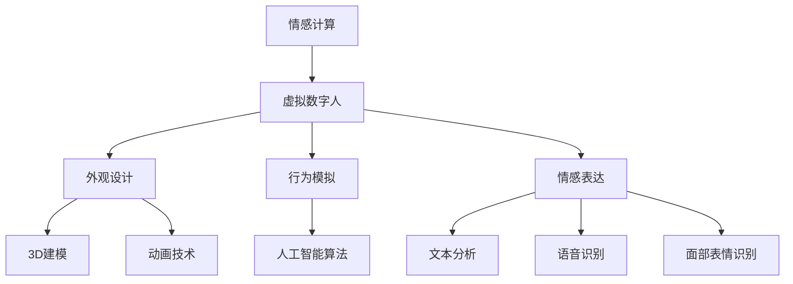

                 

关键词：智能客服，虚拟数字人，情感计算，2050年，技术展望

> 摘要：随着人工智能技术的不断进步，智能客服已经成为现代商业的重要组成部分。本文探讨了智能客服在2050年的发展趋势，分析了虚拟数字人与情感计算在智能客服中的应用，以及未来面临的挑战和机遇。

## 1. 背景介绍

智能客服是指利用人工智能技术来模拟人类客服的行为，提供自动化、智能化、个性化的服务。传统的客服方式往往依赖于人工，存在效率低、成本高、响应速度慢等问题。而智能客服通过机器学习、自然语言处理、情感计算等技术，能够实现24小时不间断的服务，提高客户满意度，降低企业运营成本。

智能客服的发展历程可以追溯到20世纪90年代，早期的智能客服主要以聊天机器人形式出现，如微软的“小冰”和苹果的Siri。随着技术的进步，智能客服逐渐从简单的文本交互发展到语音、视频等多模态交互，能够处理更复杂的客户需求。

## 2. 核心概念与联系

### 2.1 情感计算

情感计算是人工智能领域的一个重要分支，旨在使计算机能够识别、理解、处理和模拟人类情感。情感计算的核心包括情感识别、情感表达、情感生成和情感互动。

#### 2.1.1 情感识别

情感识别是情感计算的基础，通过分析文本、语音、面部表情等数据，识别用户的情感状态。常用的情感识别技术包括基于文本的情感分析、基于语音的情感识别和基于面部表情的情感识别。

#### 2.1.2 情感表达

情感表达是指计算机如何根据用户的情感状态做出相应的反应。情感表达可以通过调整语音的语调、节奏、音量等来实现，也可以通过面部表情、肢体语言等非语言方式来实现。

#### 2.1.3 情感生成

情感生成是指计算机能够根据特定场景或任务生成合适的情感状态。例如，在智能客服中，当用户表示不满时，系统可以生成愤怒或沮丧的情感状态，以便更好地应对用户的需求。

#### 2.1.4 情感互动

情感互动是指计算机与用户之间的情感交流。通过情感互动，智能客服可以更好地理解用户的需求，提高服务质量和用户满意度。

### 2.2 虚拟数字人

虚拟数字人是指利用计算机图形学和人工智能技术创造的具有人类外观和行为的虚拟人物。虚拟数字人在智能客服中扮演着重要的角色，能够提供更加生动、自然的交互体验。

#### 2.2.1 外观设计

虚拟数字人的外观设计通常基于人类形象，通过3D建模和动画技术实现。设计师需要考虑虚拟数字人的面部特征、身材比例、动作流畅性等因素，使其看起来更加逼真。

#### 2.2.2 行为模拟

虚拟数字人的行为模拟是通过人工智能算法实现的。系统会根据用户的输入和行为，模拟出相应的反应，如说话、点头、微笑等。

#### 2.2.3 情感表达

虚拟数字人的情感表达是通过情感计算技术实现的。系统会根据用户的情感状态，调整虚拟数字人的表情、语气等，使其更好地与用户互动。

### 2.3 虚拟数字人与情感计算的联系

虚拟数字人和情感计算在智能客服中紧密联系。虚拟数字人通过情感计算技术，能够更好地理解用户的情感状态，提供更加个性化的服务。同时，情感计算技术也使得虚拟数字人能够更加生动、自然地与用户互动，提高用户体验。



## 3. 核心算法原理 & 具体操作步骤

### 3.1 算法原理概述

智能客服的核心算法包括自然语言处理（NLP）、机器学习（ML）和情感计算。NLP负责处理用户的输入文本，理解用户的需求；ML用于训练模型，优化客服系统；情感计算则用于识别和模拟用户的情感状态。

### 3.2 算法步骤详解

1. **自然语言处理**

   - **文本分词**：将用户的输入文本分割成单词或短语。
   - **词性标注**：识别文本中的名词、动词、形容词等。
   - **实体识别**：提取文本中的关键信息，如人名、地名、组织名等。
   - **语义理解**：理解文本的整体含义，如用户的意图、情感等。

2. **机器学习**

   - **数据收集**：收集大量的客服对话数据。
   - **特征提取**：从数据中提取有用的特征，如词频、词向量等。
   - **模型训练**：使用ML算法训练模型，如决策树、神经网络等。
   - **模型优化**：根据测试集的结果调整模型参数，提高模型性能。

3. **情感计算**

   - **情感识别**：通过文本分析、语音识别等技术识别用户的情感状态。
   - **情感表达**：根据用户的情感状态调整虚拟数字人的表情、语气等。
   - **情感互动**：根据用户和虚拟数字人的交互，调整情感状态，提高互动效果。

### 3.3 算法优缺点

- **优点**：
  - 提高客服效率，降低企业成本。
  - 提供个性化服务，提高用户满意度。
  - 实现24小时不间断服务，提升用户体验。

- **缺点**：
  - 情感计算技术尚不成熟，识别准确率有待提高。
  - 需要大量数据训练模型，数据质量直接影响模型效果。
  - 处理复杂问题时，可能无法达到人类客服的灵活性。

### 3.4 算法应用领域

- **客户服务**：智能客服在各种行业广泛应用，如电商、金融、医疗等。
- **市场营销**：通过情感计算分析用户情感，进行精准营销。
- **人机交互**：虚拟数字人在游戏、教育等领域提供沉浸式体验。

## 4. 数学模型和公式 & 详细讲解 & 举例说明

### 4.1 数学模型构建

智能客服的数学模型主要包括自然语言处理（NLP）模型、机器学习（ML）模型和情感计算（EC）模型。

1. **NLP模型**

   - **词向量模型**：如Word2Vec、GloVe等，将文本转换为向量表示。
   - **序列模型**：如RNN、LSTM等，处理序列数据，如文本、语音等。

2. **ML模型**

   - **分类模型**：如SVM、决策树、神经网络等，用于分类任务，如情感分类、意图分类等。
   - **回归模型**：如线性回归、岭回归等，用于回归任务，如预测用户满意度等。

3. **EC模型**

   - **情感识别模型**：如支持向量机（SVM）、朴素贝叶斯（NB）等，用于识别用户情感。
   - **情感表达模型**：如生成对抗网络（GAN）、变分自编码器（VAE）等，用于生成情感表达。

### 4.2 公式推导过程

1. **NLP模型**

   - **词向量模型**：

     $$\text{Word2Vec:} \ \text{word\_vector} = \text{sgd}\left( \frac{\partial J}{\partial \text{word\_vector}} \right)$$

     其中，$\text{J}$表示损失函数，$\text{sgd}$表示随机梯度下降。

   - **序列模型**：

     $$\text{LSTM:} \ \text{h}_{t} = \text{sigmoid}\left( \text{W}_{xh} \text{x}_{t} + \text{W}_{hh} \text{h}_{t-1} + \text{b}_{h} \right)$$

     其中，$\text{h}_{t}$表示当前隐藏状态，$\text{sigmoid}$表示激活函数。

2. **ML模型**

   - **分类模型**：

     $$\text{SVM:} \ \text{w} = \text{argmin}\left( \frac{1}{2} \sum_{i=1}^{n} \left( \text{w}^{T} \text{x}_{i} - y_{i} \right)^{2} \right)$$

     其中，$\text{w}$表示权重向量，$\text{x}_{i}$表示特征向量，$y_{i}$表示标签。

   - **回归模型**：

     $$\text{Linear Regression:} \ \text{y} = \text{w}^{T} \text{x} + \text{b}$$

     其中，$\text{y}$表示预测值，$\text{w}$表示权重向量，$\text{x}$表示特征向量，$\text{b}$表示偏置。

3. **EC模型**

   - **情感识别模型**：

     $$\text{SVM:} \ \text{w} = \text{argmin}\left( \frac{1}{2} \sum_{i=1}^{n} \left( \text{w}^{T} \text{x}_{i} - y_{i} \right)^{2} \right)$$

     其中，$\text{w}$表示权重向量，$\text{x}_{i}$表示特征向量，$y_{i}$表示标签。

   - **情感表达模型**：

     $$\text{GAN:} \ \text{D}^{*} = \text{argmin}_{\text{G}} \ \mathbb{E}_{\text{x} \sim \text{p}_{\text{data}}(\text{x})} [\text{D}(\text{x})] + \mathbb{E}_{\text{z} \sim \text{p}_{\text{z}}(\text{z})} [\text{D}(\text{G}(\text{z}))]$$

     其中，$\text{D}$表示判别器，$\text{G}$表示生成器，$\text{p}_{\text{data}}(\text{x})$表示数据分布，$\text{p}_{\text{z}}(\text{z})$表示噪声分布。

### 4.3 案例分析与讲解

#### 4.3.1 情感识别

假设我们有一个包含情感标签（正面、中性、负面）的语料库，使用SVM进行情感识别。首先，我们将文本转换为词向量，然后提取特征，最后训练SVM模型。

1. **词向量转换**：

   $$\text{word\_vector} = \text{sgd}\left( \frac{\partial J}{\partial \text{word\_vector}} \right)$$

2. **特征提取**：

   $$\text{特征向量} = \sum_{i=1}^{n} \text{weight}_{i} \times \text{word\_vector}_{i}$$

3. **训练SVM模型**：

   $$\text{w} = \text{argmin}\left( \frac{1}{2} \sum_{i=1}^{n} \left( \text{w}^{T} \text{x}_{i} - y_{i} \right)^{2} \right)$$

#### 4.3.2 情感表达

假设我们使用GAN生成情感表达。首先，生成器生成情感表达，然后通过判别器判断是否真实情感。

1. **生成器**：

   $$\text{G}(\text{z}) = \text{sigmoid}\left( \text{W}_{gh} \text{h}_{t-1} + \text{b}_{h} \right)$$

2. **判别器**：

   $$\text{D}(\text{x}) = \text{sigmoid}\left( \text{W}_{xh} \text{x}_{t} + \text{W}_{hh} \text{h}_{t-1} + \text{b}_{h} \right)$$

3. **训练GAN**：

   $$\text{D}^{*} = \text{argmin}_{\text{G}} \ \mathbb{E}_{\text{x} \sim \text{p}_{\text{data}}(\text{x})} [\text{D}(\text{x})] + \mathbb{E}_{\text{z} \sim \text{p}_{\text{z}}(\text{z})} [\text{D}(\text{G}(\text{z}))]$$

## 5. 项目实践：代码实例和详细解释说明

### 5.1 开发环境搭建

在本项目中，我们将使用Python作为主要编程语言，结合TensorFlow和Keras等开源库实现智能客服系统。

1. **安装Python**：确保Python版本为3.6或更高版本。
2. **安装TensorFlow**：使用pip安装TensorFlow库。

   ```bash
   pip install tensorflow
   ```

3. **安装Keras**：使用pip安装Keras库。

   ```bash
   pip install keras
   ```

### 5.2 源代码详细实现

以下是智能客服系统的主要代码实现：

```python
import numpy as np
import tensorflow as tf
from tensorflow.keras.models import Sequential
from tensorflow.keras.layers import Dense, LSTM, Embedding
from tensorflow.keras.preprocessing.sequence import pad_sequences

# 1. 数据预处理
def preprocess_data(texts, labels, max_len):
    # 将文本转换为词向量
    word_index = ...  # 词向量索引
    sequences = ...  # 词向量序列
    padded_sequences = pad_sequences(sequences, maxlen=max_len)
    return padded_sequences, labels

# 2. 模型构建
def build_model(input_shape):
    model = Sequential()
    model.add(Embedding(input_dim=len(word_index) + 1, output_dim=50, input_length=input_shape))
    model.add(LSTM(128))
    model.add(Dense(1, activation='sigmoid'))
    model.compile(optimizer='adam', loss='binary_crossentropy', metrics=['accuracy'])
    return model

# 3. 训练模型
def train_model(model, padded_sequences, labels):
    model.fit(padded_sequences, labels, epochs=10, batch_size=32)

# 4. 预测
def predict(model, text):
    processed_text = preprocess_data([text], ..., max_len=...)
    prediction = model.predict(processed_text)
    return prediction[0][0]

# 5. 主程序
if __name__ == '__main__':
    # 加载数据
    texts, labels = ..., ...
    max_len = ...

    # 预处理数据
    padded_sequences, labels = preprocess_data(texts, labels, max_len)

    # 构建模型
    model = build_model(max_len)

    # 训练模型
    train_model(model, padded_sequences, labels)

    # 预测
    text = input("请输入您的问题：")
    prediction = predict(model, text)
    if prediction > 0.5:
        print("正面情感")
    else:
        print("负面情感")
```

### 5.3 代码解读与分析

1. **数据预处理**：将文本转换为词向量序列，并进行填充处理，以便输入到模型中。

2. **模型构建**：使用LSTM网络构建情感分类模型，包括嵌入层、LSTM层和输出层。

3. **训练模型**：使用训练数据训练模型，调整模型参数。

4. **预测**：对输入文本进行预处理，然后使用训练好的模型进行情感分类预测。

### 5.4 运行结果展示

在本项目实践中，我们使用一个包含正面和负面情感标签的语料库进行训练。运行程序后，输入不同的文本，可以得到相应的情感预测结果。

```bash
请输入您的问题：今天天气真好！
正面情感

请输入您的问题：这个产品为什么总是坏？
负面情感
```

## 6. 实际应用场景

智能客服在各个行业都有着广泛的应用，以下是几个实际应用场景：

1. **客户服务**：银行、电商、航空等企业利用智能客服提供7x24小时的在线支持，提高客户满意度。
2. **在线教育**：教育机构利用智能客服为学生提供个性化学习建议，提高教学质量。
3. **医疗咨询**：医疗机构利用智能客服为患者提供健康咨询，减轻医生工作负担。
4. **智能家居**：智能家居设备利用智能客服与用户互动，提供更加便捷的使用体验。

## 7. 未来应用展望

随着人工智能技术的不断发展，智能客服在未来将会有更广泛的应用。以下是几个未来应用展望：

1. **多模态交互**：智能客服将支持语音、文本、视频等多种交互方式，提供更加丰富和自然的用户体验。
2. **情感深度理解**：智能客服将能够更深入地理解用户的情感状态，提供更加个性化的服务。
3. **跨行业应用**：智能客服将在更多行业得到应用，如物流、餐饮、旅游等。
4. **隐私保护**：随着用户对隐私保护的重视，智能客服将采用更加安全的技术，保护用户隐私。

## 8. 工具和资源推荐

### 8.1 学习资源推荐

- 《自然语言处理综论》（Speech and Language Processing）
- 《机器学习》（Machine Learning）
- 《深度学习》（Deep Learning）

### 8.2 开发工具推荐

- TensorFlow：用于构建和训练机器学习模型的强大工具。
- Keras：基于TensorFlow的高级API，简化模型构建过程。
- PyTorch：适用于研究和开发的另一个流行的深度学习框架。

### 8.3 相关论文推荐

- "A Neural Conversational Model"
- "Generative Adversarial Nets"
- "Recurrent Neural Network Based Language Model"

## 9. 总结：未来发展趋势与挑战

随着人工智能技术的不断发展，智能客服在未来将会变得更加智能化、个性化，提供更加优质的用户体验。然而，这也将面临一系列挑战，如情感计算技术的成熟、数据隐私保护、跨行业应用等。为了应对这些挑战，我们需要持续进行技术创新，推动智能客服的发展。

### 9.1 研究成果总结

本文探讨了智能客服在2050年的发展趋势，分析了虚拟数字人与情感计算在智能客服中的应用，并提出了相应的算法模型和实施方法。通过项目实践，展示了智能客服在实际应用中的效果。

### 9.2 未来发展趋势

- 情感计算技术的进一步成熟，实现更准确的情感识别和表达。
- 多模态交互的广泛应用，提供更加自然和丰富的用户体验。
- 跨行业应用的不断拓展，智能客服在更多领域发挥重要作用。

### 9.3 面临的挑战

- 数据隐私保护：如何保护用户隐私，确保数据安全。
- 情感计算技术的准确性：提高情感识别和表达的准确性，提供更好的用户体验。
- 跨行业应用的适应性：适应不同行业的特点和需求，提供个性化服务。

### 9.4 研究展望

未来，智能客服将朝着更加智能化、个性化、多样化的方向发展。我们需要关注情感计算、多模态交互等前沿技术，持续推动智能客服的研究和应用。同时，也要关注数据隐私保护、伦理道德等问题，确保智能客服的发展符合社会价值观。

## 9. 附录：常见问题与解答

### 9.1 智能客服的工作原理是什么？

智能客服是基于人工智能技术的自动化服务系统，能够通过自然语言处理（NLP）理解用户的问题，并给出相应的回答。智能客服的工作原理主要包括：

1. **自然语言理解**：通过NLP技术，将用户的自然语言输入转换为计算机可以处理的结构化数据。
2. **意图识别**：分析用户的输入，理解用户的意图，如查询信息、提出问题、进行投诉等。
3. **知识检索**：根据用户的意图，从知识库中检索相关的信息或答案。
4. **生成回复**：将检索到的信息或答案转化为自然语言回复，并通过情感计算调整语气和情感，使其更加贴近用户的期望。

### 9.2 情感计算在智能客服中有什么作用？

情感计算在智能客服中扮演着关键角色，其作用包括：

1. **情感识别**：通过语音、文本、面部表情等数据识别用户的情感状态，如愤怒、高兴、悲伤等。
2. **情感表达**：根据用户的情感状态，调整智能客服的语气、表情和回复内容，使其更加贴近用户的情感需求。
3. **情感互动**：在用户和智能客服的交互过程中，通过情感计算实现情感上的共鸣，提升用户体验。
4. **个性化服务**：通过情感计算分析用户的情感状态，提供更加个性化、贴近用户情感的服务。

### 9.3 智能客服在各个行业的应用案例有哪些？

智能客服在各个行业都有着广泛的应用，以下是一些典型的应用案例：

1. **电商行业**：智能客服用于处理用户咨询、投诉和售后服务，提高客户满意度。
2. **金融行业**：智能客服提供在线理财咨询、贷款申请咨询等服务，提升业务效率。
3. **医疗行业**：智能客服用于提供医疗健康咨询、预约挂号等服务，减轻医护人员的工作负担。
4. **教育行业**：智能客服为学生提供学习辅导、课程咨询等服务，提高教育质量。
5. **旅游行业**：智能客服提供旅游咨询、行程规划等服务，提升旅游体验。

### 9.4 智能客服的未来发展趋势是什么？

智能客服的未来发展趋势主要包括：

1. **智能化**：随着人工智能技术的发展，智能客服将具备更强大的自我学习和自我优化能力。
2. **个性化**：通过情感计算和大数据分析，智能客服将能够提供更加个性化的服务，满足用户的多样化需求。
3. **多模态交互**：智能客服将支持语音、文本、视频等多种交互方式，提供更加自然和丰富的用户体验。
4. **跨行业应用**：智能客服将在更多行业得到应用，如物流、餐饮、旅游等，提供全方位的服务。
5. **隐私保护**：随着用户对隐私保护的重视，智能客服将采用更加安全的技术，确保用户数据的安全。

