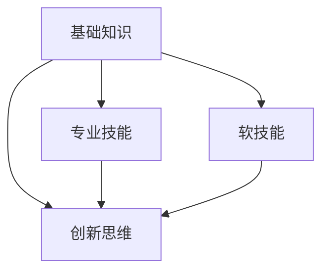

                 

 关键词：未来社会、人才需求、技能培养、新时代、技能框架、教育体系、技术发展、创新思维

> 摘要：本文深入探讨了未来社会对人才的需求，分析了如何培养适应新时代的技能。通过阐述新兴技术的趋势，提出了技能培养的框架和方法，并探讨了教育体系如何适应这一变化，最后提出了未来发展的挑战和展望。

## 1. 背景介绍

随着科技的飞速发展，人类社会正经历着前所未有的变革。互联网、人工智能、大数据、区块链等新兴技术的广泛应用，正在深刻地改变着人们的生活方式、工作模式和社会结构。未来社会将是一个高度数字化、智能化的社会，这也对人才的技能要求提出了新的挑战。

在这样的大背景下，如何培养适应新时代的人才成为了一个亟待解决的问题。传统的教育体系往往注重理论知识的传授，而忽略了实践能力和创新思维的培养。因此，我们需要重新审视教育体系，探索如何培养能够适应未来社会发展的技能。

## 2. 核心概念与联系

### 2.1 技能需求分析

在探讨未来社会的人才需求时，我们需要明确几个核心概念：

- **技术技能**：包括编程、数据分析、机器学习等。
- **软技能**：如沟通能力、团队合作、解决问题的能力等。
- **创新思维**：能够面对未知、解决问题、创造新价值的思维能力。

这些技能之间并不是孤立的，它们相互联系、相互促进。例如，技术技能可以帮助人们更好地解决复杂问题，而软技能则能够帮助人们更好地团队合作，创新思维则可以激发新的创意和解决方案。

### 2.2 技能培养框架

为了培养适应新时代的人才，我们需要建立一个全面的技能培养框架。这个框架应该包括以下几个层次：

- **基础知识**：包括数学、物理、计算机科学等基础学科。
- **专业技能**：根据不同的行业和领域，培养特定的技术技能。
- **软技能**：包括沟通、团队合作、领导力等。
- **创新思维**：通过实践、案例分析、跨学科学习等，培养创新思维。

### 2.3 技能培养方法

在技能培养方面，我们可以采取以下几种方法：

- **项目驱动学习**：通过实际项目来培养实践能力和解决问题的能力。
- **跨学科学习**：鼓励学生跨学科学习，培养综合能力。
- **案例教学**：通过案例分析，让学生了解真实世界的问题和解决方案。
- **在线教育**：利用在线平台，提供灵活的学习方式，满足不同学生的学习需求。

### 2.4 Mermaid 流程图

下面是一个简单的 Mermaid 流程图，展示了技能培养的框架和联系：



## 3. 核心算法原理 & 具体操作步骤

### 3.1 算法原理概述

在培养技能的过程中，算法原理是非常重要的一部分。算法是一种系统的方法，用于解决问题或执行任务。在人工智能和数据分析领域，算法的作用尤为突出。

- **机器学习算法**：通过训练模型，让计算机从数据中学习并做出预测。
- **深度学习算法**：一种特殊的机器学习算法，通过多层神经网络来模拟人脑的学习过程。
- **数据分析算法**：用于处理和分析大量数据，提取有价值的信息。

### 3.2 算法步骤详解

以下是培养算法能力的一些基本步骤：

1. **了解基本算法**：学习常见的算法，如排序、搜索、动态规划等。
2. **实践编程**：通过编写代码，将算法应用到实际问题中。
3. **分析算法复杂度**：了解算法的时间复杂度和空间复杂度，优化算法性能。
4. **学习高级算法**：深入学习更复杂的算法，如神经网络、决策树等。
5. **案例学习**：通过分析案例，了解算法在实际问题中的应用。

### 3.3 算法优缺点

每种算法都有其优缺点，我们需要根据具体问题选择合适的算法。

- **优点**：高效、准确、自动。
- **缺点**：可能需要大量的数据，算法设计复杂。

### 3.4 算法应用领域

算法应用广泛，包括但不限于以下领域：

- **金融**：风险评估、投资策略。
- **医疗**：疾病预测、药物研发。
- **交通**：路线规划、交通流量分析。
- **娱乐**：推荐系统、游戏设计。

## 4. 数学模型和公式 & 详细讲解 & 举例说明

### 4.1 数学模型构建

在数据分析中，数学模型是非常重要的一部分。一个基本的数学模型通常包括以下几个部分：

- **变量定义**：明确模型的输入和输出变量。
- **函数关系**：建立变量之间的函数关系。
- **约束条件**：设定模型的约束条件。

### 4.2 公式推导过程

以下是一个简单的线性回归模型的推导过程：

$$
Y = \beta_0 + \beta_1X + \epsilon
$$

其中，$Y$ 是因变量，$X$ 是自变量，$\beta_0$ 和 $\beta_1$ 是模型参数，$\epsilon$ 是误差项。

### 4.3 案例分析与讲解

假设我们有一个房价预测的模型，输入变量是房屋的面积，输出变量是房价。我们可以使用线性回归模型来建立这个模型。

- **变量定义**：$X$ 表示房屋面积，$Y$ 表示房价。
- **函数关系**：根据历史数据，我们可以得到线性关系 $Y = \beta_0 + \beta_1X$。
- **约束条件**：模型参数 $\beta_0$ 和 $\beta_1$ 需要通过最小二乘法求解。

通过这个简单的例子，我们可以看到数学模型在数据分析中的应用。

## 5. 项目实践：代码实例和详细解释说明

### 5.1 开发环境搭建

在开始项目实践之前，我们需要搭建一个合适的开发环境。以下是推荐的开发工具和软件：

- **编程语言**：Python
- **开发环境**：PyCharm
- **数据集**：Kaggle上的房价数据集

### 5.2 源代码详细实现

以下是一个简单的房价预测项目的源代码：

```python
import pandas as pd
from sklearn.linear_model import LinearRegression

# 读取数据
data = pd.read_csv('house_price_data.csv')

# 分离特征和标签
X = data['area']
Y = data['price']

# 创建线性回归模型
model = LinearRegression()

# 训练模型
model.fit(X.values.reshape(-1, 1), Y.values)

# 预测房价
predicted_price = model.predict([[X.mean()]])
print(f'预测房价为：{predicted_price[0]}')
```

### 5.3 代码解读与分析

这段代码首先导入了必要的库，然后读取了数据集，分离了特征和标签，创建了线性回归模型，并进行了模型训练和预测。

### 5.4 运行结果展示

运行这段代码，我们可以得到房价的预测结果。这个结果可以作为一个初步的参考，但实际应用中可能需要更复杂的模型和更多的数据。

## 6. 实际应用场景

### 6.1 金融领域

在金融领域，算法和数学模型被广泛应用于风险评估、投资策略、市场预测等方面。通过机器学习和深度学习技术，金融机构可以更准确地预测市场趋势，制定更有效的投资策略。

### 6.2 医疗领域

在医疗领域，算法和数据分析可以帮助医生进行疾病预测、药物研发、个性化治疗等方面。例如，通过分析患者的电子健康记录，医生可以更准确地预测患者患病风险，从而提前采取预防措施。

### 6.3 交通领域

在交通领域，算法和数据分析可以帮助优化交通流量、规划路线、提高运输效率。通过分析交通数据，政府和企业可以更好地应对交通拥堵问题，提高城市的交通管理效率。

### 6.4 未来应用展望

随着技术的不断进步，算法和数学模型在各个领域的应用前景将更加广泛。未来，我们将看到更多的智能应用场景，如智能家居、智能城市、自动驾驶等。这些应用将极大地改变人们的生活方式，也对人才的技能要求提出了更高的挑战。

## 7. 工具和资源推荐

### 7.1 学习资源推荐

- **在线课程**：Coursera、edX、Udacity等平台提供了大量的计算机科学和数据分析课程。
- **书籍**：《深度学习》、《机器学习》、《Python编程：从入门到实践》等。
- **论文**：通过学术数据库如IEEE Xplore、ACM Digital Library等，可以获取最新的研究论文。

### 7.2 开发工具推荐

- **编程语言**：Python、R、Java等。
- **开发环境**：PyCharm、Eclipse、VSCode等。
- **数据集**：Kaggle、UCI机器学习库等。

### 7.3 相关论文推荐

- **《深度学习：概率视角》**：提供深度学习的概率解释。
- **《机器学习年度回顾》**：汇总了过去一年的机器学习领域的重要研究成果。
- **《大数据杀熟：互联网企业如何利用数据分析进行价格歧视》**：探讨大数据在商业中的应用。

## 8. 总结：未来发展趋势与挑战

### 8.1 研究成果总结

随着技术的不断进步，算法和数学模型在各个领域的应用越来越广泛。我们已经看到了大数据、人工智能、深度学习等技术如何改变金融、医疗、交通等行业的运作方式。

### 8.2 未来发展趋势

未来，随着5G、物联网、区块链等技术的发展，算法和数学模型的应用将更加广泛。我们将看到更多的智能应用场景，如智能家居、智能城市、自动驾驶等。

### 8.3 面临的挑战

尽管前景广阔，但我们也面临一些挑战：

- **数据隐私**：如何在保障用户隐私的前提下，充分利用数据进行分析和预测。
- **算法公平性**：如何确保算法的决策公平，避免偏见和歧视。
- **人才培养**：如何培养适应未来社会发展的技能，特别是在软技能和创新思维方面。

### 8.4 研究展望

未来，我们需要进一步加强算法和数学模型的研究，探索如何更好地应对这些挑战。同时，我们也需要推动教育体系的改革，培养更多具有创新能力和实践能力的人才。

## 9. 附录：常见问题与解答

### 9.1 人工智能是否会取代人类？

人工智能不会完全取代人类，而是与人类共同工作，解决复杂问题，提高工作效率。

### 9.2 数据分析的主要应用领域有哪些？

数据分析的主要应用领域包括金融、医疗、交通、市场营销等。

### 9.3 如何学习算法和数学模型？

可以通过在线课程、书籍、实践项目等多种方式学习算法和数学模型。

### 9.4 算法在金融领域的应用有哪些？

算法在金融领域的应用包括风险评估、投资策略、市场预测等。

作者：禅与计算机程序设计艺术 / Zen and the Art of Computer Programming
----------------------------------------------------------------

### 后记

本文从未来社会的背景出发，分析了人才需求的变化，探讨了如何培养适应新时代的技能。通过阐述算法原理、数学模型、项目实践等内容，旨在为读者提供全面的技能培养框架和方法。面对未来，我们需要不断学习、适应，才能在新的时代中取得成功。希望本文能为读者带来启发和帮助。

