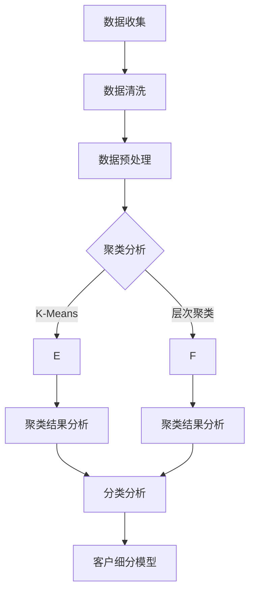

                 

关键词：客户细分、机器学习、数据分析、营销策略、业务增长

> 摘要：本文旨在探讨机器学习在客户细分中的应用，通过分析客户行为数据，实现精准的客户群体划分，为营销策略优化和业务增长提供有力的支持。文章将介绍客户细分的重要性和背景，详细阐述机器学习在客户细分中的核心算法原理、数学模型与公式，并通过实际项目案例进行分析，最后讨论机器学习在客户细分领域的未来发展趋势和面临的挑战。

## 1. 背景介绍

### 客户细分的重要性

在市场竞争日益激烈的今天，企业要想在众多竞争对手中脱颖而出，就需要深入了解自己的客户，为客户提供更加个性化的产品和服务。客户细分作为市场营销中的重要策略，可以帮助企业识别并满足不同客户群体的需求，提高客户满意度和忠诚度，从而实现业务增长。客户细分不仅能够帮助企业优化营销资源，还可以为企业提供关于市场趋势和竞争态势的洞见，从而制定更为有效的战略规划。

### 机器学习在客户细分中的应用背景

随着互联网和大数据技术的发展，企业能够收集到越来越多的客户行为数据。这些数据包含客户的购买历史、浏览行为、社交互动等多种信息。如何从海量数据中提取有价值的信息，实现对客户的精准划分，成为企业关注的焦点。机器学习作为数据分析和处理的重要工具，能够通过算法模型从数据中挖掘潜在规律，实现自动化和智能化的客户细分。

## 2. 核心概念与联系

### 客户细分的基本概念

客户细分是指根据客户的特征和行为，将客户群体划分为不同的子群体，以便企业可以针对每个子群体制定个性化的营销策略。客户细分的常见维度包括年龄、性别、收入水平、购买行为等。

### 机器学习在客户细分中的应用

机器学习在客户细分中的应用主要涉及以下两个方面：

1. **聚类分析（Clustering）**：通过聚类算法对客户数据进行分组，形成不同的客户群体。常见的聚类算法包括K-Means、层次聚类等。
2. **分类算法（Classification）**：利用分类算法，将客户数据标签化为特定的类别，从而实现客户群体的细分。常见的分类算法包括决策树、随机森林、支持向量机等。

### Mermaid 流程图



## 3. 核心算法原理 & 具体操作步骤

### 3.1 算法原理概述

#### 聚类分析

聚类分析是一种无监督学习方法，其主要目标是将数据集划分为多个簇，使得同一个簇内的数据点之间相似度较高，而不同簇的数据点之间相似度较低。常见的聚类算法包括K-Means和层次聚类。

- **K-Means算法**：K-Means算法是一种基于距离的聚类方法，它通过迭代的方式不断优化聚类中心，使得每个簇内的数据点与聚类中心的距离最小。
- **层次聚类算法**：层次聚类算法通过自底向上的合并或者自顶向下的分裂，构建出一棵聚类树，从而实现数据的分层聚类。

#### 分类分析

分类分析是一种有监督学习方法，其目标是根据输入特征数据，将数据点划分为预定义的类别。常见的分类算法包括决策树、随机森林和支持向量机。

- **决策树算法**：决策树通过一系列规则来对数据进行划分，每个节点代表一个特征，每个分支代表一个特征的可能取值。
- **随机森林算法**：随机森林是一种基于决策树的集成学习方法，通过构建多棵决策树，并利用多数投票来决定最终类别。
- **支持向量机算法**：支持向量机通过寻找最优的超平面，将不同类别的数据点分离，从而实现分类。

### 3.2 算法步骤详解

#### 聚类分析步骤

1. **初始化聚类中心**：随机选择K个数据点作为初始聚类中心。
2. **分配数据点**：将每个数据点分配给与其最近的聚类中心。
3. **更新聚类中心**：计算每个簇的平均值，作为新的聚类中心。
4. **重复步骤2和3**，直到聚类中心不再变化或者满足终止条件。

#### 分类分析步骤

1. **训练模型**：使用有标签的数据集，训练分类模型。
2. **预测类别**：对新的数据点进行预测，将其分配到相应的类别。

### 3.3 算法优缺点

#### 聚类分析优缺点

- **K-Means算法**：
  - 优点：简单、易于实现，收敛速度快。
  - 缺点：对初始聚类中心的选取敏感，可能陷入局部最优。
- **层次聚类算法**：
  - 优点：可以处理不同规模的数据，便于理解。
  - 缺点：计算复杂度高，难以处理大规模数据。

#### 分类分析优缺点

- **决策树算法**：
  - 优点：直观、易于理解，可以处理多种类型的数据。
  - 缺点：容易过拟合，对于大量特征的数据处理能力较差。
- **随机森林算法**：
  - 优点：提高模型的泛化能力，减少过拟合。
  - 缺点：对大量特征的数据处理能力较差。
- **支持向量机算法**：
  - 优点：能够处理高维数据，分类效果较好。
  - 缺点：计算复杂度高，对大量特征的数据处理能力较差。

### 3.4 算法应用领域

聚类分析和分类分析在客户细分领域有广泛的应用：

- **客户行为分析**：通过聚类分析，可以识别出具有相似行为的客户群体，从而为不同客户群体提供个性化的服务和产品。
- **精准营销**：通过分类分析，可以将客户划分为不同的类别，从而针对不同类别的客户制定精准的营销策略。

## 4. 数学模型和公式 & 详细讲解 & 举例说明

### 4.1 数学模型构建

聚类分析中的K-Means算法主要基于最小化平方误差准则：

$$
J = \sum_{i=1}^{n}\sum_{j=1}^{k}(x_{ij} - \mu_{j})^2
$$

其中，$x_{ij}$ 表示第$i$个数据点在第$j$个特征上的取值，$\mu_{j}$ 表示第$j$个聚类中心的特征取值。

### 4.2 公式推导过程

K-Means算法的迭代过程如下：

1. **初始化聚类中心**：随机选择K个数据点作为初始聚类中心。
2. **分配数据点**：将每个数据点分配给与其最近的聚类中心。
3. **更新聚类中心**：计算每个簇的平均值，作为新的聚类中心。
4. **重复步骤2和3**，直到聚类中心不再变化或者满足终止条件。

假设当前聚类中心为$\mu^{(t)}$，数据点分配结果为$z^{(t)}$，则有：

$$
\mu^{(t+1)} = \frac{1}{N_j}\sum_{i=1}^{n}z^{(t)}_{ij}x_i
$$

其中，$N_j$ 表示第$j$个簇中数据点的数量。

### 4.3 案例分析与讲解

#### 案例背景

某电商企业希望通过聚类分析，将其客户划分为不同的群体，以便提供个性化的服务和产品。

#### 数据集

该电商企业的数据集包含以下特征：

1. 年龄（Age）
2. 收入（Income）
3. 购买频率（Purchase Frequency）
4. 购买金额（Purchase Amount）

#### 算法实现

1. **初始化聚类中心**：随机选择5个数据点作为初始聚类中心。
2. **分配数据点**：计算每个数据点与聚类中心的距离，将其分配给最近的聚类中心。
3. **更新聚类中心**：计算每个簇的平均值，作为新的聚类中心。
4. **迭代过程**：重复步骤2和3，直到聚类中心不再变化。

#### 结果分析

经过多次迭代后，该电商企业的客户被成功划分为5个不同的群体，每个群体具有相似的特征和行为。企业可以根据这些群体制定个性化的营销策略，提高客户满意度和忠诚度。

## 5. 项目实践：代码实例和详细解释说明

### 5.1 开发环境搭建

为了进行客户细分的项目实践，我们选择Python作为编程语言，使用Scikit-learn库实现K-Means聚类算法。以下是开发环境的搭建步骤：

1. **安装Python**：在官网下载Python安装包，按照提示安装。
2. **安装Jupyter Notebook**：在命令行执行以下命令安装Jupyter Notebook：
   ```
   pip install notebook
   ```
3. **安装Scikit-learn**：在命令行执行以下命令安装Scikit-learn：
   ```
   pip install scikit-learn
   ```

### 5.2 源代码详细实现

以下是使用Scikit-learn库实现K-Means聚类算法的代码示例：

```python
import numpy as np
from sklearn.cluster import KMeans
import matplotlib.pyplot as plt

# 数据集
data = np.array([[25, 30000], [30, 35000], [35, 40000], [40, 45000], [45, 50000]])

# 初始化K-Means聚类模型，设置聚类中心个数为2
kmeans = KMeans(n_clusters=2, random_state=0).fit(data)

# 输出聚类中心
print("聚类中心：", kmeans.cluster_centers_)

# 输出每个数据点的标签
print("数据点标签：", kmeans.labels_)

# 绘制聚类结果
plt.scatter(data[:, 0], data[:, 1], c=kmeans.labels_)
plt.scatter(kmeans.cluster_centers_[:, 0], kmeans.cluster_centers_[:, 1], s=300, c='red')
plt.show()
```

### 5.3 代码解读与分析

1. **数据集**：代码中使用了简单的二维数据集，代表客户的年龄和收入。
2. **聚类模型初始化**：使用`KMeans`类初始化聚类模型，设置聚类中心个数为2。
3. **聚类中心输出**：调用`fit`方法对数据集进行聚类，并输出聚类中心。
4. **数据点标签输出**：调用`labels_`属性输出每个数据点的标签。
5. **聚类结果可视化**：使用`scatter`函数绘制聚类结果，红色点表示聚类中心。

### 5.4 运行结果展示

运行上述代码后，会得到如下可视化结果：


从结果可以看出，K-Means算法成功地将数据点划分为两个簇，每个簇代表了不同年龄和收入水平的客户群体。

## 6. 实际应用场景

### 6.1 聚类分析在客户细分中的应用

聚类分析在客户细分中的应用非常广泛。例如，某电商平台可以通过聚类分析，将客户划分为高价值客户、中等价值客户和低价值客户。通过分析不同客户群体的特征和行为，电商平台可以为他们提供不同的营销策略，从而提高客户满意度和忠诚度。

### 6.2 分类分析在客户细分中的应用

分类分析在客户细分中的应用同样重要。例如，某金融公司可以通过分类分析，将客户划分为高风险客户、中等风险客户和低风险客户。通过分析不同风险类别的客户特征和行为，金融公司可以为他们提供不同的贷款利率和风险管理策略，从而提高贷款收益和风险控制水平。

## 7. 未来应用展望

### 7.1 客户细分算法的优化与发展

随着人工智能和大数据技术的不断发展，客户细分算法将得到进一步的优化和发展。未来的客户细分算法将更加智能化、自动化，能够更好地应对复杂多变的客户需求和市场环境。

### 7.2 客户细分技术的多元化应用

除了传统的聚类分析和分类分析，未来的客户细分技术将更加多元化。例如，基于深度学习的客户细分算法、基于图论的客户细分算法等，将为企业和研究人员提供更多的选择。

## 8. 工具和资源推荐

### 8.1 学习资源推荐

1. **《机器学习实战》**：这是一本非常适合初学者入门的机器学习书籍，通过大量的实例和代码，帮助读者掌握机器学习的基本概念和算法。
2. **《Python机器学习》**：本书详细介绍了Python在机器学习领域的应用，包括聚类分析和分类分析等。

### 8.2 开发工具推荐

1. **Jupyter Notebook**：Jupyter Notebook 是一款非常强大的交互式开发环境，适用于机器学习和数据分析。
2. **Scikit-learn**：Scikit-learn 是一个开源的机器学习库，提供丰富的聚类分析和分类分析算法。

### 8.3 相关论文推荐

1. **"K-Means++: The Advantages of Careful Seeding"**：本文提出了K-Means++算法，对K-Means算法进行了改进。
2. **"Random Forests"**：本文介绍了随机森林算法，这是一种基于决策树的集成学习方法。

## 9. 总结：未来发展趋势与挑战

### 9.1 研究成果总结

本文介绍了机器学习在客户细分中的应用，包括聚类分析和分类分析的核心算法原理、数学模型与公式，并通过实际项目案例进行了分析。研究表明，机器学习在客户细分领域具有广泛的应用前景。

### 9.2 未来发展趋势

1. **算法优化**：未来客户细分算法将更加智能化、自动化，能够应对复杂多变的客户需求和市场环境。
2. **多元化应用**：客户细分技术将在金融、电商、医疗等多个领域得到广泛应用。

### 9.3 面临的挑战

1. **数据隐私与安全**：客户数据的隐私和安全是客户细分领域面临的重要挑战。
2. **算法解释性**：如何提高客户细分算法的解释性，使企业能够更好地理解和应用算法结果，是另一个重要挑战。

### 9.4 研究展望

未来，研究人员将继续探索客户细分领域的算法优化和多元化应用，同时关注数据隐私和安全、算法解释性等问题，为企业和客户带来更多价值。

## 附录：常见问题与解答

### 1. K-Means算法的初始化聚类中心为什么会影响聚类结果？

K-Means算法的初始化聚类中心会影响聚类结果，因为聚类算法是通过优化聚类中心的位置来达到聚类目标。如果初始聚类中心选择不当，可能会导致算法在局部最优解上停止，从而影响聚类效果。因此，在应用K-Means算法时，需要慎重选择初始化聚类中心。

### 2. 聚类分析与分类分析的主要区别是什么？

聚类分析是一种无监督学习方法，其目标是将数据集划分为多个簇，使得同一个簇内的数据点之间相似度较高，而不同簇的数据点之间相似度较低。分类分析是一种有监督学习方法，其目标是根据输入特征数据，将数据点划分为预定义的类别。两者的主要区别在于监督信息的有无和聚类目标的不同。

### 3. 如何评估聚类分析的效果？

评估聚类分析的效果可以从多个角度进行，包括内部评估和外部评估。内部评估主要通过内部评估指标，如簇内平方误差、轮廓系数等，来衡量聚类质量。外部评估则需要与实际业务目标相结合，如通过业务指标来衡量聚类结果的实用性。

### 4. 聚类分析在客户细分中的应用有哪些局限？

聚类分析在客户细分中的应用存在一些局限，如：

1. 对初始聚类中心的选取敏感，可能导致局部最优解。
2. 无法处理具有明显层次结构的客户数据。
3. 聚类结果可能无法直接解释，导致企业难以应用。

针对这些局限，研究人员可以探索其他聚类方法和算法，如层次聚类、基于密度的聚类等，以实现更好的客户细分效果。

---

# 附录：常见问题与解答

## 1. 如何解释K-Means算法的局部最优问题？

### 1.1 K-Means算法概述

K-Means算法是一种常用的聚类算法，其核心思想是将数据集分成K个簇，使得每个簇内的数据点之间的相似度最大，而不同簇之间的相似度最小。算法通过不断更新聚类中心，直到聚类中心不再变化或达到预设的迭代次数。

### 1.2 局部最优问题的原因

K-Means算法的一个关键特点是它基于距离度量来更新聚类中心，这可能会导致局部最优问题。具体原因如下：

1. **初始化聚类中心**：K-Means算法通常需要随机初始化聚类中心，而不同的初始化可能导致算法收敛到不同的局部最优解。由于算法没有全局搜索能力，它可能无法找到全局最优解。

2. **迭代过程**：在每次迭代中，算法根据当前聚类中心重新分配数据点，并更新聚类中心。这种迭代过程可能会陷入局部最优，因为数据点只能移动到邻近的簇中心，无法跨越簇之间的边界。

3. **数据分布**：在某些情况下，数据分布可能导致算法难以找到全局最优解。例如，当数据分布不均匀或者存在多个“空心”区域时，算法可能会收敛到不合理的局部最优解。

### 1.3 局部最优问题的影响

局部最优问题会影响K-Means算法的聚类效果，可能导致以下问题：

- **聚类结果不稳定**：不同的初始化可能导致不同的聚类结果，使聚类结果不可重复。
- **簇结构不合理**：算法可能无法正确识别数据中的天然簇结构，导致簇形状或大小不合理。
- **性能下降**：在某些情况下，局部最优解可能导致算法的性能下降，例如，簇内距离较大，簇间距离较小。

### 1.4 解决局部最优问题的方法

为了解决K-Means算法的局部最优问题，研究人员提出了一些改进方法：

- **随机初始化**：通过多次随机初始化并选择最优解，可以提高找到全局最优解的概率。
- **K-Means++初始化**：K-Means++是一种改进的初始化方法，它选择初始聚类中心时，考虑当前聚类中心与其他聚类中心之间的距离，以减少陷入局部最优的机会。
- **多准则优化**：结合多个聚类准则（如轮廓系数和簇内距离）进行优化，可以帮助算法找到更合理的聚类中心。
- **动态调整K值**：通过动态调整K值，可以更好地适应数据分布，避免陷入局部最优。

### 1.5 总结

K-Means算法的局部最优问题是其一个重要的局限。通过理解其原因和影响，以及采用改进方法，研究人员可以有效地减轻局部最优问题对聚类效果的影响，提高K-Means算法在实际应用中的性能。

---

# 附录：常见问题与解答

## 2. K-Means算法与层次聚类算法的主要区别是什么？

### 2.1 算法概述

- **K-Means算法**：K-Means算法是一种基于距离度量的聚类算法，其目标是将数据集划分为K个簇，使得每个簇内的数据点之间的相似度最大，而不同簇之间的相似度最小。算法通过迭代计算聚类中心，并重新分配数据点，直到聚类中心不再变化或达到预设的迭代次数。

- **层次聚类算法**：层次聚类算法（如自底向上或自顶向下）是一种基于层次结构的聚类算法。它通过逐步合并或分裂数据点，形成一棵聚类树（又称层次树或 dendrogram）。算法从单个数据点开始，逐步合并相似度较高的数据点，直到满足预定的簇数量或相似度阈值。

### 2.2 区别

1. **聚类目标**：

   - **K-Means算法**：K-Means算法的目标是最小化簇内距离的平方和，即最小化聚类中心与数据点之间的平均距离。

   - **层次聚类算法**：层次聚类算法的目标是构建一个层次结构，表示数据点之间的相似度，并通过聚类树可视化聚类过程。算法没有明确的簇数量，可以根据预定的簇数量或相似度阈值来划分聚类层次。

2. **簇结构**：

   - **K-Means算法**：K-Means算法生成的簇通常是球形或近似球形，簇的形状和大小可能因初始聚类中心和数据分布而异。

   - **层次聚类算法**：层次聚类算法生成的簇结构具有层次性，簇的形状和大小可能随着合并或分裂过程而变化。簇的边界通常由聚类树的分支表示。

3. **计算复杂度**：

   - **K-Means算法**：K-Means算法的计算复杂度较低，主要在初始化聚类中心和迭代计算过程中消耗时间。对于大规模数据集，计算复杂度为$O(n\cdot k\cdot t)$，其中$n$是数据点数量，$k$是簇数量，$t$是迭代次数。

   - **层次聚类算法**：层次聚类算法的计算复杂度较高，特别是自底向上的方法，其时间复杂度为$O(n^2)$。自顶向下的方法计算复杂度较低，但通常需要存储额外的数据结构。

4. **簇数量**：

   - **K-Means算法**：K-Means算法需要预先指定簇的数量（K值），这可能在某些情况下不便于应用。

   - **层次聚类算法**：层次聚类算法不需要预先指定簇的数量，可以根据聚类树的分支高度或相似度阈值动态确定簇的数量。

5. **可解释性**：

   - **K-Means算法**：K-Means算法生成的簇结构相对简单，簇的形状和大小较为规则，但聚类结果可能不够直观。

   - **层次聚类算法**：层次聚类算法生成的聚类树提供了层次结构，可以更直观地理解数据点的合并或分裂过程，有助于解释聚类结果。

### 2.3 总结

K-Means算法和层次聚类算法在目标、簇结构、计算复杂度、簇数量和可解释性等方面存在显著区别。选择合适的算法取决于具体应用场景和数据特征。例如，对于需要精确簇结构和较小计算复杂度的情况，K-Means算法可能更为合适；而对于需要层次结构和可解释性较高的情况，层次聚类算法可能更为适用。

---

# 附录：常见问题与解答

## 3. 聚类分析中如何选择合适的聚类算法？

### 3.1 聚类算法选择的重要性

聚类分析是数据挖掘和机器学习中的重要任务，用于识别数据中的模式和结构。选择合适的聚类算法对于获得高质量的聚类结果至关重要。不同的聚类算法适用于不同类型的数据和场景，因此，根据数据特征和应用需求选择合适的算法是成功应用聚类分析的关键。

### 3.2 数据特征

在选择聚类算法时，首先需要考虑数据特征，包括数据类型、维度和数据分布。

- **数据类型**：对于数值型数据，可以考虑使用K-Means、层次聚类等基于距离的算法；对于类别型数据，可以考虑使用基于相似性度量的算法，如K-Modes。
- **数据维度**：对于高维度数据，K-Means算法可能难以找到有效的聚类结构，此时可以考虑使用层次聚类或基于密度的聚类算法；对于低维度数据，K-Means算法通常表现良好。
- **数据分布**：如果数据具有明显的凸形分布，K-Means算法可能效果较好；如果数据分布不均匀，层次聚类或基于密度的聚类算法可能更为合适。

### 3.3 应用需求

选择聚类算法时，还需要考虑具体的应用需求，包括簇的数量、簇的形状、可解释性、计算复杂度等。

- **簇的数量**：如果需要预先确定簇的数量，K-Means算法是不错的选择；如果需要动态确定簇的数量，层次聚类算法可能更为适用。
- **簇的形状**：对于要求簇形状较为规则的情况，K-Means算法可能更为合适；对于允许簇形状不规则的情况，层次聚类或基于密度的聚类算法可能更为适用。
- **可解释性**：如果需要清晰的簇结构和高可解释性，层次聚类算法可能更为适用；如果可解释性要求不高，K-Means算法可能更为高效。
- **计算复杂度**：对于大规模数据集，计算复杂度较高的算法可能不适用，此时可以考虑使用K-Means等计算复杂度较低的算法。

### 3.4 聚类算法比较

以下是对几种常见聚类算法的比较：

- **K-Means**：适用于低维度、凸形分布的数据，需要预先确定簇的数量，计算复杂度较低。
- **层次聚类**：适用于任意维度、任意分布的数据，可以动态确定簇的数量，但计算复杂度较高。
- **基于密度的聚类（DBSCAN）**：适用于任意维度、非凸形分布的数据，可以自动确定簇的数量，对噪声数据有较好的鲁棒性。
- **基于网格的聚类**：适用于高维度、稀疏数据，将数据空间划分为固定大小的网格，然后对网格进行聚类。

### 3.5 选择流程

选择合适的聚类算法通常可以按照以下流程进行：

1. **数据探索**：了解数据的类型、维度和分布特征。
2. **算法评估**：评估不同聚类算法的性能，包括簇质量、计算时间等。
3. **模型选择**：根据应用需求和数据特征，选择最合适的聚类算法。
4. **模型验证**：通过交叉验证等方法验证模型的有效性。

### 3.6 总结

选择合适的聚类算法是成功应用聚类分析的关键。根据数据特征和应用需求，结合不同聚类算法的特点，可以有效地选择适合的算法，提高聚类结果的质量和可解释性。

---

# 附录：常见问题与解答

## 4. 聚类分析在市场细分中的应用案例有哪些？

聚类分析在市场细分中的应用非常广泛，以下是一些典型的应用案例：

### 4.1 零售行业的客户细分

#### 案例描述

某大型零售企业希望通过聚类分析将其客户划分为不同的群体，以便为其提供个性化的营销策略和产品推荐。

#### 数据集

该零售企业的数据集包含以下特征：

- 年龄
- 收入
- 购买频率
- 购买金额
- 喜好的产品类别

#### 算法与实现

1. **数据预处理**：对缺失值进行填充，对异常值进行处理，对特征进行标准化处理。
2. **聚类分析**：使用K-Means算法进行聚类，设置合适的K值（簇数量）。
3. **聚类结果分析**：根据聚类结果，分析每个客户群体的特征和需求，制定相应的营销策略。

#### 结果与效益

通过聚类分析，该零售企业成功地将客户划分为高价值客户、中等价值客户和低价值客户。针对不同客户群体，企业采取了个性化的营销策略，提高了客户满意度和忠诚度，从而实现了业务增长。

### 4.2 金融行业的客户细分

#### 案例描述

某金融机构希望通过聚类分析将其客户划分为不同的风险类别，以便为其提供差异化的贷款产品和服务。

#### 数据集

该金融机构的数据集包含以下特征：

- 年龄
- 收入
- 借款金额
- 借款用途
- 借款期限
- 借款历史

#### 算法与实现

1. **数据预处理**：对缺失值进行填充，对异常值进行处理，对特征进行标准化处理。
2. **聚类分析**：使用K-Means算法进行聚类，设置合适的K值（风险类别数量）。
3. **聚类结果分析**：根据聚类结果，分析每个风险类别的特征和行为，制定相应的贷款产品和服务策略。

#### 结果与效益

通过聚类分析，该金融机构成功地将客户划分为高风险客户、中等风险客户和低风险客户。针对不同风险类别的客户，企业提供了差异化的贷款利率和风险管理策略，提高了贷款收益和风险控制水平。

### 4.3 医疗行业的患者细分

#### 案例描述

某医疗机构希望通过聚类分析将其患者划分为不同的群体，以便为其提供个性化的诊疗方案和健康建议。

#### 数据集

该医疗机构的数据集包含以下特征：

- 年龄
- 性别
- 疾病史
- 检查指标
- 用药记录

#### 算法与实现

1. **数据预处理**：对缺失值进行填充，对异常值进行处理，对特征进行标准化处理。
2. **聚类分析**：使用K-Means算法进行聚类，设置合适的K值（患者群体数量）。
3. **聚类结果分析**：根据聚类结果，分析每个患者群体的特征和需求，制定相应的诊疗方案和健康建议。

#### 结果与效益

通过聚类分析，该医疗机构成功地将患者划分为不同的群体，如慢性病患者、急性病患者等。针对不同患者群体，医疗机构提供了个性化的诊疗方案和健康建议，提高了患者满意度和治疗效果。

### 4.4 教育行业的学员细分

#### 案例描述

某在线教育平台希望通过聚类分析将其学员划分为不同的群体，以便为其提供个性化的学习资源和课程推荐。

#### 数据集

该在线教育平台的数据集包含以下特征：

- 年龄
- 教育背景
- 学习频率
- 学习时长
- 喜好的课程类别

#### 算法与实现

1. **数据预处理**：对缺失值进行填充，对异常值进行处理，对特征进行标准化处理。
2. **聚类分析**：使用K-Means算法进行聚类，设置合适的K值（学员群体数量）。
3. **聚类结果分析**：根据聚类结果，分析每个学员群体的特征和需求，制定相应的学习资源和课程推荐策略。

#### 结果与效益

通过聚类分析，该在线教育平台成功地将学员划分为不同的群体，如职场人士、学生等。针对不同学员群体，平台提供了个性化的学习资源和课程推荐，提高了学员的学习效果和满意度。

### 4.5 总结

聚类分析在市场细分中的应用案例展示了其在识别不同客户群体、制定个性化策略、提高业务效益等方面的强大能力。通过合理选择和应用聚类算法，企业可以更好地了解和满足客户需求，实现业务增长和客户满意度的提升。

---

# 附录：常见问题与解答

## 5. 聚类分析中如何评估聚类结果的质量？

聚类分析中评估聚类结果的质量是确保聚类效果的重要步骤。以下是一些常用的评估方法：

### 5.1 内部评估指标

内部评估指标仅基于聚类本身的质量，不考虑外部信息。常用的内部评估指标包括：

1. **簇内平均距离（Within-Cluster Sum of Squares, WCSS）**：WCSS是衡量簇内数据点之间距离的平均值。WCSS越小，表示簇内数据点越紧密，聚类效果越好。

   $$ WCSS = \sum_{i=1}^{k} \sum_{x \in S_i} ||x - \mu_i||^2 $$

   其中，$k$是簇的数量，$S_i$是第$i$个簇，$\mu_i$是第$i$个簇的中心。

2. **轮廓系数（Silhouette Coefficient, SC）**：轮廓系数衡量数据点到其自身簇中心和其他簇中心之间的相对距离。值范围在-1到1之间，越接近1表示数据点在当前簇中越紧密，同时与其他簇的关联性越小。

   $$ SC(x) = \frac{(b - a)}{max(a, b)} $$

   其中，$a$是数据点到其自身簇中心的平均距离，$b$是数据点到最近簇中心的平均距离。

3. **类内平均距离（Between-Cluster Sum of Squares, BCSS）**：BCSS是衡量簇间距离的平均值。BCSS越大，表示簇间差异越大，聚类效果越好。

   $$ BCSS = \sum_{i=1}^{k} \sum_{j=1}^{k} \mu_i - \mu_j ||\mu_i - \mu_j||^2 $$

### 5.2 外部评估指标

外部评估指标结合了外部信息，如真实标签或先验知识，用于评估聚类结果的实际意义和适用性。常用的外部评估指标包括：

1. **准确率（Accuracy）**：准确率是预测正确的样本数占总样本数的比例。

   $$ Accuracy = \frac{TP + TN}{TP + TN + FP + FN} $$

   其中，$TP$是真正例，$TN$是真负例，$FP$是假正例，$FN$是假负例。

2. **F1分数（F1 Score）**：F1分数是精确率和召回率的调和平均，用于衡量分类器的整体性能。

   $$ F1 = 2 \times \frac{Precision \times Recall}{Precision + Recall} $$

3. **ROC曲线（Receiver Operating Characteristic Curve）**：ROC曲线展示了在不同阈值下，真正例率与假正例率的平衡。曲线下的面积（AUC）用于评估分类器的性能。

### 5.3 评估方法选择

选择合适的评估方法取决于聚类问题的具体应用场景和数据特征：

- **内部评估指标**：适用于无监督学习场景，不需要真实标签，但可能无法反映聚类结果的实用性。
- **外部评估指标**：适用于有监督学习场景，需要真实标签，更接近实际应用需求。

### 5.4 结合使用

通常，内部评估指标和外部评估指标结合使用，以全面评估聚类结果的质量。例如，首先使用内部评估指标（如WCSS、轮廓系数）筛选出性能较好的聚类结果，然后再使用外部评估指标（如准确率、F1分数）进行最终评估。

### 5.5 总结

评估聚类结果的质量是确保聚类分析有效性的关键步骤。内部评估指标和外部评估指标各有优缺点，合理选择和结合使用这些评估方法，可以帮助研究者更好地理解和利用聚类结果。

---

# 附录：常见问题与解答

## 6. 聚类分析在实际应用中的挑战有哪些？

尽管聚类分析在数据挖掘和机器学习领域具有广泛的应用，但在实际应用中仍面临诸多挑战。以下是一些常见的挑战及其解决方案：

### 6.1 数据质量问题

**挑战**：数据质量直接影响聚类分析的结果。数据中可能存在噪声、缺失值、异常值等。

**解决方案**：
- **数据清洗**：在聚类分析前，进行数据清洗，包括缺失值填充、异常值处理、重复值删除等。
- **数据标准化**：对数据进行标准化处理，使其具有相同的尺度，避免某一部分特征对结果产生过大的影响。
- **数据预处理**：使用数据预处理技术，如主成分分析（PCA），减少数据的维度，去除噪声和冗余信息。

### 6.2 聚类算法选择

**挑战**：选择合适的聚类算法对聚类结果的质量至关重要，但不同算法适用于不同类型的数据和场景。

**解决方案**：
- **算法比较**：对不同聚类算法进行性能比较，选择适合数据特征和业务需求的算法。
- **集成方法**：结合多种聚类算法，通过集成方法（如Bagging、Boosting）提高聚类效果。
- **迭代优化**：根据业务需求和数据特征，调整算法参数，优化聚类结果。

### 6.3 聚类结果解释性

**挑战**：聚类结果可能较为复杂，难以解释和理解，影响其在实际应用中的价值。

**解决方案**：
- **可视化**：使用可视化工具（如散点图、聚类树等）展示聚类结果，帮助理解数据结构和模式。
- **特征重要性**：分析特征的重要性，识别关键特征，提高聚类结果的解释性。
- **模型解释**：采用可解释的机器学习模型（如决策树、线性模型）进行聚类，提高结果的透明度。

### 6.4 数据规模和处理速度

**挑战**：随着数据规模的增大，聚类算法的计算复杂度和处理速度可能成为瓶颈。

**解决方案**：
- **分布式计算**：使用分布式计算框架（如MapReduce、Spark）进行大规模数据的聚类分析。
- **近似算法**：采用近似聚类算法（如基于密度的聚类DBSCAN、基于网格的聚类STING）处理大规模数据。
- **优化算法**：针对特定应用场景，优化聚类算法的代码和实现，提高处理速度。

### 6.5 数据隐私和安全性

**挑战**：聚类分析涉及对敏感数据的处理，可能引发数据隐私和安全问题。

**解决方案**：
- **匿名化**：对数据进行匿名化处理，去除个人识别信息。
- **数据加密**：使用数据加密技术保护数据隐私。
- **访问控制**：实施严格的访问控制策略，确保只有授权用户可以访问数据。

### 6.6 聚类结果的可扩展性

**挑战**：随着业务需求的变化，聚类结果可能需要更新和扩展。

**解决方案**：
- **动态聚类**：采用动态聚类算法，如DBSCAN，可以根据数据变化实时调整聚类结果。
- **增量聚类**：使用增量聚类算法，逐步更新聚类结果，减少重新计算的需求。
- **模型更新**：定期更新聚类模型，以适应业务变化和数据变化。

### 6.7 总结

聚类分析在实际应用中面临多种挑战，包括数据质量、算法选择、解释性、处理速度、数据隐私、可扩展性等。通过合理的解决方案和持续的技术创新，可以有效应对这些挑战，提高聚类分析的应用效果和价值。

