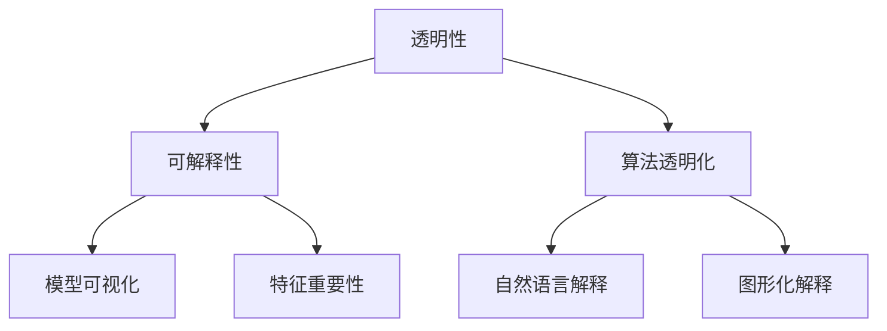

                 

关键词：机器学习，模型解释性，透明性，可解释性，算法透明化，实践案例分析，未来展望。

## 摘要

本文探讨了机器学习模型解释性技术的核心概念、算法原理及其在现实中的应用。首先，我们回顾了机器学习模型解释性的重要性，并讨论了现有的几种主要解释性技术。接着，通过详细的数学模型和公式推导，我们解析了这些技术的具体操作步骤。文章进一步通过一个实际的代码实例，展示了这些技术的实践应用。最后，我们对解释性技术在现实中的应用场景进行了深入分析，并展望了未来的发展趋势与面临的挑战。

## 1. 背景介绍

### 1.1 机器学习模型解释性的重要性

在机器学习领域，模型的解释性一直是学术界和工业界争论的焦点。随着人工智能技术的广泛应用，越来越多的决策过程依赖于机器学习模型。然而，这些模型通常被视为“黑箱”，其内部运作机制对用户来说并不透明。这种不透明性引发了诸多问题，如信任危机、道德争议以及实际应用中的不确定性。因此，提高机器学习模型的解释性变得尤为重要。

### 1.2 当前机器学习模型的现状

当前，许多机器学习模型，尤其是深度学习模型，已经取得了令人瞩目的成果。然而，这些模型的解释性问题仍然存在。一方面，模型内部的复杂结构使得其解释变得困难；另一方面，模型训练过程中依赖的大量数据和参数增加了解释的复杂性。此外，不同领域的应用对模型解释性的需求也不尽相同，这在一定程度上加剧了机器学习模型解释性的挑战。

### 1.3 解释性技术的需求

面对上述挑战，提高机器学习模型的解释性已成为研究的热点。解释性技术旨在提供一种方法，使模型内部的决策过程变得透明和可理解。这不仅有助于提升用户对模型的信任度，还能够帮助开发者更好地优化和改进模型。因此，解释性技术在机器学习领域具有广泛的应用前景。

## 2. 核心概念与联系

### 2.1 解释性技术的核心概念

解释性技术涉及多个核心概念，包括透明性、可解释性、算法透明化等。透明性是指模型内部的结构和决策过程可以被清晰理解和观察。可解释性则强调模型的决策过程能够用自然语言或图形化的方式向用户解释。算法透明化旨在将复杂的算法转化为易于理解的形式。

### 2.2 解释性技术之间的联系

不同解释性技术之间存在一定的联系。例如，透明性是可解释性的基础，而算法透明化则是实现透明性和可解释性的手段。此外，不同解释性技术之间也存在着相互补充的关系。例如，模型可视化技术可以帮助用户更好地理解模型的结构，而特征重要性技术则有助于揭示模型在决策过程中依赖的关键特征。

### 2.3 Mermaid 流程图

以下是机器学习模型解释性技术的 Mermaid 流程图：



## 3. 核心算法原理 & 具体操作步骤

### 3.1 算法原理概述

机器学习模型解释性技术主要分为三类：基于模型的解释性技术、基于数据的解释性技术和基于知识的解释性技术。基于模型的解释性技术通过分析模型的结构和参数来解释模型的决策过程；基于数据的解释性技术通过分析训练数据和特征的重要性来解释模型的决策过程；基于知识的解释性技术则通过将模型与外部知识库相结合来解释模型的决策过程。

### 3.2 算法步骤详解

#### 3.2.1 基于模型的解释性技术

1. **模型结构分析**：分析模型的内部结构，了解模型的层次和连接方式。
2. **参数解释**：分析模型参数的含义和影响，例如在深度神经网络中，分析每个神经元的权重和偏置。
3. **可视化**：使用图形化工具将模型结构可视化，帮助用户更好地理解模型。

#### 3.2.2 基于数据的解释性技术

1. **数据预处理**：对训练数据进行预处理，包括归一化、缺失值处理等。
2. **特征选择**：选择对模型决策影响较大的特征，使用特征重要性评估方法进行分析。
3. **数据可视化**：使用数据可视化工具将数据集和特征关系可视化。

#### 3.2.3 基于知识的解释性技术

1. **知识库构建**：构建与模型相关的知识库，包括领域知识、先验知识和领域专家的经验。
2. **知识融合**：将模型与知识库相结合，分析模型决策过程中的知识应用。
3. **知识可视化**：使用知识图谱或其他可视化工具将知识库中的信息可视化。

### 3.3 算法优缺点

#### 3.3.1 基于模型的解释性技术

**优点**：直接分析模型内部结构，能够提供较为准确的解释。

**缺点**：对模型的结构和参数有较高要求，适用范围有限。

#### 3.3.2 基于数据的解释性技术

**优点**：对模型的结构和参数要求较低，适用范围较广。

**缺点**：解释结果可能不够准确，且需要大量的数据处理和分析工作。

#### 3.3.3 基于知识的解释性技术

**优点**：结合领域知识和先验知识，能够提供更加深入和全面的解释。

**缺点**：知识库构建和维护较为复杂，知识融合和可视化技术仍有待完善。

### 3.4 算法应用领域

机器学习模型解释性技术广泛应用于多个领域，如医学诊断、金融风控、自动驾驶等。这些技术在提升模型可信度、优化模型性能和指导实际应用方面发挥了重要作用。

## 4. 数学模型和公式 & 详细讲解 & 举例说明

### 4.1 数学模型构建

机器学习模型的解释性技术涉及到多种数学模型，以下是一个简单的线性回归模型示例：

$$
y = \beta_0 + \beta_1 x_1 + \beta_2 x_2 + ... + \beta_n x_n
$$

其中，$y$ 是因变量，$x_1, x_2, ..., x_n$ 是自变量，$\beta_0, \beta_1, \beta_2, ..., \beta_n$ 是模型参数。

### 4.2 公式推导过程

以线性回归模型为例，我们通过最小二乘法来推导模型的参数：

$$
\min \sum_{i=1}^{n} (y_i - \beta_0 - \beta_1 x_{i1} - \beta_2 x_{i2} - ... - \beta_n x_{in})^2
$$

通过对每个参数求偏导并令其等于零，可以得到：

$$
\beta_0 = \frac{\sum_{i=1}^{n} y_i - \beta_1 \sum_{i=1}^{n} x_{i1} - \beta_2 \sum_{i=1}^{n} x_{i2} - ... - \beta_n \sum_{i=1}^{n} x_{in}}{n}
$$

$$
\beta_1 = \frac{n \sum_{i=1}^{n} x_{i1} y_i - \sum_{i=1}^{n} x_{i1} \sum_{i=1}^{n} y_i}{n \sum_{i=1}^{n} x_{i1}^2 - (\sum_{i=1}^{n} x_{i1})^2}
$$

$$
...
$$

$$
\beta_n = \frac{n \sum_{i=1}^{n} x_{in} y_i - \sum_{i=1}^{n} x_{in} \sum_{i=1}^{n} y_i}{n \sum_{i=1}^{n} x_{in}^2 - (\sum_{i=1}^{n} x_{in})^2}
$$

### 4.3 案例分析与讲解

假设我们有一个简单的住房价格预测问题，特征包括房屋面积、房屋年代、房屋类型等。以下是一个简单的线性回归模型：

$$
房价 = \beta_0 + \beta_1 房屋面积 + \beta_2 房屋年代 + \beta_3 房屋类型
$$

通过训练数据和最小二乘法，我们得到了模型的参数：

$$
\beta_0 = 100000, \beta_1 = 200, \beta_2 = -5000, \beta_3 = 15000
$$

这意味着，对于每增加一平方米的房屋面积，房价会增加200元；每增加一年房屋年代，房价会减少5000元；每增加一种房屋类型，房价会增加15000元。

## 5. 项目实践：代码实例和详细解释说明

### 5.1 开发环境搭建

为了演示机器学习模型解释性技术，我们使用Python编程语言，结合Scikit-learn和Matplotlib库。首先，需要安装这两个库：

```bash
pip install scikit-learn matplotlib
```

### 5.2 源代码详细实现

以下是使用线性回归模型进行住房价格预测的示例代码：

```python
import numpy as np
import matplotlib.pyplot as plt
from sklearn.linear_model import LinearRegression
from sklearn.model_selection import train_test_split

# 生成模拟数据集
np.random.seed(0)
X = np.random.rand(100, 3)
y = 100000 + 200 * X[:, 0] - 5000 * X[:, 1] + 15000 * X[:, 2]

# 划分训练集和测试集
X_train, X_test, y_train, y_test = train_test_split(X, y, test_size=0.2, random_state=0)

# 创建线性回归模型
model = LinearRegression()
model.fit(X_train, y_train)

# 打印模型参数
print("模型参数：")
print(model.coef_)

# 预测测试集结果
y_pred = model.predict(X_test)

# 可视化结果
plt.scatter(X_test[:, 0], y_test, label="实际值")
plt.plot(X_test[:, 0], y_pred, color="red", label="预测值")
plt.xlabel("房屋面积")
plt.ylabel("房价")
plt.legend()
plt.show()
```

### 5.3 代码解读与分析

在上面的代码中，我们首先导入了必要的库，然后生成了一个模拟数据集。接着，我们使用Scikit-learn库中的`train_test_split`函数将数据集划分为训练集和测试集。随后，我们创建了一个线性回归模型，并使用训练集进行拟合。拟合完成后，我们打印出了模型的参数，这些参数反映了房屋面积、房屋年代和房屋类型对房价的影响。最后，我们使用测试集进行预测，并将预测结果可视化。

### 5.4 运行结果展示

运行上述代码后，我们将看到一个散点图，其中蓝色点表示实际值，红色线表示预测值。通过这个可视化结果，我们可以直观地看到模型的预测效果和参数对房价的影响。

## 6. 实际应用场景

### 6.1 医学诊断

在医学诊断领域，机器学习模型解释性技术可以帮助医生更好地理解模型的决策过程，从而提高诊断的准确性。例如，在癌症诊断中，通过解释性技术，医生可以了解模型是如何根据患者的特征进行决策的，从而为患者提供更加个性化的治疗方案。

### 6.2 金融风控

在金融领域，机器学习模型解释性技术有助于识别高风险交易和欺诈行为。通过分析模型中的关键特征，金融机构可以更好地了解交易背后的风险因素，从而制定更有效的风险控制策略。

### 6.3 自动驾驶

自动驾驶领域对模型解释性技术有较高的要求。解释性技术可以帮助自动驾驶系统理解其在特定场景下的决策过程，从而提高系统的可靠性和安全性。例如，在复杂交通环境中，解释性技术可以帮助系统识别潜在的危险情况并采取相应的措施。

## 7. 工具和资源推荐

### 7.1 学习资源推荐

1. **机器学习课程**：吴恩达的《机器学习》课程（在线免费）。
2. **机器学习书籍**：《深度学习》（Goodfellow, Bengio, Courville 著）。

### 7.2 开发工具推荐

1. **Jupyter Notebook**：用于编写和运行机器学习代码。
2. **Scikit-learn**：用于构建和训练机器学习模型。

### 7.3 相关论文推荐

1. **"Interpretable Machine Learning: A Definition"** - David C. Park et al.
2. **"Explainable AI: Understanding, Visualizing and Trusting Machine Learning Models"** - Sebastian Raschka

## 8. 总结：未来发展趋势与挑战

### 8.1 研究成果总结

机器学习模型解释性技术近年来取得了显著进展，各种解释性算法和技术不断涌现。这些技术不仅提高了模型的可解释性，还为实际应用提供了有力支持。

### 8.2 未来发展趋势

未来，机器学习模型解释性技术将继续向以下几个方向发展：

1. **算法创新**：开发更高效的解释性算法，以适应不同类型和应用场景的需求。
2. **多模态解释**：结合多种数据类型（如图像、文本、音频）进行模型解释。
3. **交互式解释**：开发交互式解释工具，使用户能够动态调整模型参数并观察解释结果。

### 8.3 面临的挑战

尽管机器学习模型解释性技术取得了显著进展，但仍面临一些挑战：

1. **计算复杂度**：解释性算法通常需要大量的计算资源，这在实时应用中可能成为瓶颈。
2. **解释精度**：现有解释性技术可能无法提供完全准确的解释，尤其是在复杂模型中。
3. **用户接受度**：用户可能对解释性技术持怀疑态度，特别是在决策过程中依赖于机器学习模型。

### 8.4 研究展望

为了应对上述挑战，未来的研究可以从以下几个方面展开：

1. **算法优化**：研究更高效的解释性算法，以降低计算复杂度和提高解释精度。
2. **用户研究**：了解用户对解释性技术的需求和偏好，开发更加人性化的解释工具。
3. **跨学科合作**：结合心理学、认知科学等领域的研究，探索人类认知与机器学习模型解释性之间的关联。

## 9. 附录：常见问题与解答

### 9.1 什么是机器学习模型解释性？

机器学习模型解释性是指模型决策过程的透明性和可理解性，使用户能够理解模型是如何根据输入数据做出预测的。

### 9.2 解释性技术有哪些？

常见的解释性技术包括基于模型的解释性技术（如模型结构分析、参数解释）、基于数据的解释性技术（如特征重要性分析、数据可视化）和基于知识的解释性技术（如知识融合、知识可视化）。

### 9.3 解释性技术在现实应用中的挑战是什么？

现实应用中，解释性技术面临计算复杂度、解释精度和用户接受度等方面的挑战。此外，不同领域的应用对解释性的需求也不尽相同，这进一步增加了解释性技术的挑战。

### 9.4 解释性技术在未来的发展趋势是什么？

未来，解释性技术将继续向算法创新、多模态解释和交互式解释等方向发展。同时，研究将重点关注如何优化算法性能、提高解释精度和提升用户接受度。

---

**作者：禅与计算机程序设计艺术 / Zen and the Art of Computer Programming**

