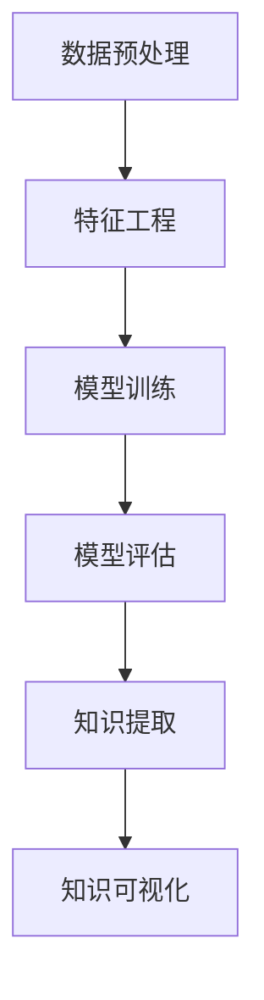

                 

关键词：机器学习、知识发现、算法应用、数学模型、实际案例、技术趋势

> 摘要：本文深入探讨了机器学习算法在知识发现领域的应用，从背景介绍、核心概念与联系、核心算法原理及具体操作步骤、数学模型与公式讲解、项目实践、实际应用场景、未来展望等方面，系统地介绍了机器学习算法在知识发现中的重要性与广泛应用。

## 1. 背景介绍

知识发现（Knowledge Discovery in Databases，简称KDD）是指从大量数据中挖掘出具有价值的信息和知识的过程。随着互联网和大数据技术的快速发展，数据规模和种类都在爆炸性增长，传统的数据分析手段已经难以应对如此复杂的数据环境。此时，机器学习算法作为一种强大的数据处理工具，在知识发现领域发挥了重要作用。

机器学习（Machine Learning，ML）是通过构建模型并利用数据来预测或决策的技术。通过训练数据，机器学习算法能够识别数据中的模式和关系，从而辅助人类进行知识发现。近年来，随着计算能力的提升和算法的不断优化，机器学习在知识发现中的应用日益广泛，并在各个领域都取得了显著的成果。

## 2. 核心概念与联系

### 2.1 机器学习算法的基本概念

#### 2.1.1 模型

机器学习模型是对数据的抽象表示，它能够对未知数据进行预测。常见的机器学习模型有线性回归、决策树、支持向量机、神经网络等。

#### 2.1.2 特征

特征是描述数据的基本属性，通过特征可以更好地理解数据。在机器学习中，特征提取是一个关键步骤，它有助于提高模型的性能。

#### 2.1.3 标签

标签是已知的输出结果，用于训练模型。例如，在分类任务中，标签是每个类别的标签；在回归任务中，标签是实际值。

### 2.2 知识发现的基本过程

#### 2.2.1 数据预处理

数据预处理是知识发现的第一步，它包括数据清洗、数据集成、数据转换等操作。通过数据预处理，可以保证数据的质量和一致性。

#### 2.2.2 特征工程

特征工程是数据预处理后的关键步骤，它通过选择和构造合适的特征，提高模型的性能。

#### 2.2.3 模型训练与评估

模型训练与评估是知识发现的核心步骤，通过训练数据来训练模型，并使用测试数据来评估模型的性能。

#### 2.2.4 知识提取与可视化

知识提取与可视化是将模型预测结果转化为可理解的知识，并通过可视化手段展示给用户。

### 2.3 Mermaid 流程图



## 3. 核心算法原理 & 具体操作步骤

### 3.1 算法原理概述

#### 3.1.1 监督学习

监督学习是一种常见的机器学习方法，它通过已知的输入和输出（即训练数据）来训练模型。监督学习算法包括线性回归、决策树、支持向量机等。

#### 3.1.2 无监督学习

无监督学习是一种不依赖于已知的输入和输出，仅通过数据本身来发现数据分布和模式的方法。无监督学习算法包括聚类、降维、异常检测等。

#### 3.1.3 强化学习

强化学习是一种基于奖励机制的学习方法，它通过与环境的交互来不断优化策略。强化学习算法包括Q学习、深度强化学习等。

### 3.2 算法步骤详解

#### 3.2.1 监督学习

1. 数据预处理：清洗和转换数据，确保数据质量。
2. 特征工程：选择和构造特征，提高模型性能。
3. 模型选择：选择合适的模型，例如线性回归、决策树等。
4. 模型训练：使用训练数据训练模型。
5. 模型评估：使用测试数据评估模型性能。
6. 模型优化：根据评估结果调整模型参数，提高模型性能。

#### 3.2.2 无监督学习

1. 数据预处理：清洗和转换数据，确保数据质量。
2. 特征工程：选择和构造特征，提高模型性能。
3. 模型选择：选择合适的模型，例如聚类、降维等。
4. 模型训练：使用训练数据训练模型。
5. 模型评估：使用测试数据评估模型性能。
6. 模型优化：根据评估结果调整模型参数，提高模型性能。

#### 3.2.3 强化学习

1. 环境初始化：定义环境状态和动作。
2. 策略初始化：定义初始策略。
3. 迭代训练：通过环境反馈不断调整策略。
4. 模型评估：评估策略的性能。
5. 模型优化：根据评估结果调整策略。

### 3.3 算法优缺点

#### 3.3.1 监督学习

优点：通过已知的输入和输出训练模型，性能较好。
缺点：对训练数据的依赖较大，不适用于无标签数据。

#### 3.3.2 无监督学习

优点：不需要已知的输入和输出，适用于无标签数据。
缺点：性能相对较低，难以精确控制。

#### 3.3.3 强化学习

优点：能够通过环境反馈不断优化策略，适用于动态环境。
缺点：训练时间较长，需要大量计算资源。

### 3.4 算法应用领域

#### 3.4.1 金融市场预测

通过监督学习算法，可以预测股票价格、汇率等金融市场的变化。

#### 3.4.2 社交网络推荐

通过无监督学习算法，可以挖掘用户兴趣，进行个性化推荐。

#### 3.4.3 智能医疗

通过机器学习算法，可以辅助医生进行疾病诊断和治疗方案的制定。

#### 3.4.4 智能制造

通过机器学习算法，可以提高生产效率，降低成本。

## 4. 数学模型和公式 & 详细讲解 & 举例说明

### 4.1 数学模型构建

#### 4.1.1 线性回归模型

线性回归模型是一种最简单的机器学习模型，它通过线性关系来预测输出。

$$ y = \beta_0 + \beta_1 \cdot x $$

其中，$y$ 是预测值，$x$ 是输入特征，$\beta_0$ 和 $\beta_1$ 是模型参数。

#### 4.1.2 决策树模型

决策树模型是一种基于树形结构的分类模型，它通过划分特征空间来构建决策树。

$$ tree(y) = node_1 \lor node_2 \lor ... \lor node_n $$

其中，$node_i$ 是决策节点，$y$ 是预测值。

#### 4.1.3 支持向量机模型

支持向量机模型是一种基于最大间隔分类的模型，它通过寻找最优超平面来划分特征空间。

$$ w \cdot x + b = 0 $$

其中，$w$ 是超平面法向量，$x$ 是输入特征，$b$ 是偏置项。

### 4.2 公式推导过程

#### 4.2.1 线性回归模型推导

线性回归模型的推导过程如下：

1. 假设数据集为 $D = \{(x_1, y_1), (x_2, y_2), ..., (x_n, y_n)\}$。
2. 构建损失函数：$$ J(\beta_0, \beta_1) = \frac{1}{2} \sum_{i=1}^{n} (y_i - (\beta_0 + \beta_1 \cdot x_i))^2 $$
3. 对损失函数求导：$$ \frac{\partial J}{\partial \beta_0} = -\sum_{i=1}^{n} (y_i - (\beta_0 + \beta_1 \cdot x_i)) $$ $$ \frac{\partial J}{\partial \beta_1} = -\sum_{i=1}^{n} (y_i - (\beta_0 + \beta_1 \cdot x_i)) \cdot x_i $$
4. 令导数为0，解方程组得到最优参数：$$ \beta_0 = \frac{1}{n} \sum_{i=1}^{n} y_i - \beta_1 \cdot \frac{1}{n} \sum_{i=1}^{n} x_i $$ $$ \beta_1 = \frac{1}{n} \sum_{i=1}^{n} (x_i - \bar{x}) \cdot (y_i - \bar{y}) $$

#### 4.2.2 决策树模型推导

决策树模型的推导过程如下：

1. 假设数据集为 $D = \{(x_1, y_1), (x_2, y_2), ..., (x_n, y_n)\}$。
2. 选择特征 $x_j$，划分数据集：$$ D_j = \{(x_1, y_1), (x_2, y_2), ..., (x_n, y_n)\} $$ $$ D_{j_1} = \{(x_1, y_1), (x_2, y_2), ..., (x_n, y_n)\} $$ $$ D_{j_2} = \{(x_1, y_1), (x_2, y_2), ..., (x_n, y_n)\} $$ ... $$ D_{j_k} = \{(x_1, y_1), (x_2, y_2), ..., (x_n, y_n)\} $$
3. 计算每个划分的损失函数：$$ J_j = \frac{1}{2} \sum_{i=1}^{n} (y_i - (\beta_0 + \beta_1 \cdot x_i))^2 $$
4. 选择损失函数最小的特征 $x_j$ 作为决策节点。

#### 4.2.3 支持向量机模型推导

支持向量机模型的推导过程如下：

1. 假设数据集为 $D = \{(x_1, y_1), (x_2, y_2), ..., (x_n, y_n)\}$。
2. 构建损失函数：$$ J(w, b) = \frac{1}{2} w^T w + C \cdot \sum_{i=1}^{n} \max(0, 1 - y_i \cdot (w \cdot x_i + b)) $$
3. 对损失函数求导：$$ \frac{\partial J}{\partial w} = w - C \cdot \sum_{i=1}^{n} y_i \cdot x_i $$
$$ \frac{\partial J}{\partial b} = -C \cdot \sum_{i=1}^{n} y_i $$
4. 令导数为0，解方程组得到最优参数：$$ w = \frac{1}{n} \sum_{i=1}^{n} y_i \cdot x_i $$ $$ b = \frac{1}{n} \sum_{i=1}^{n} y_i - w \cdot \frac{1}{n} \sum_{i=1}^{n} x_i $$

### 4.3 案例分析与讲解

#### 4.3.1 线性回归模型案例

假设我们要预测一家公司的股票价格，已知过去一个月的股票价格和交易量数据。我们可以使用线性回归模型来预测未来的股票价格。

1. 数据预处理：将数据清洗和转换，确保数据质量。
2. 特征工程：选择和构造特征，例如股票价格和交易量。
3. 模型训练：使用线性回归模型训练模型。
4. 模型评估：使用测试数据评估模型性能。
5. 模型优化：根据评估结果调整模型参数，提高模型性能。

通过以上步骤，我们可以得到一个线性回归模型，并使用它来预测未来的股票价格。

#### 4.3.2 决策树模型案例

假设我们要分类电子邮件，将其分为垃圾邮件和正常邮件。我们可以使用决策树模型来构建分类器。

1. 数据预处理：将数据清洗和转换，确保数据质量。
2. 特征工程：选择和构造特征，例如邮件标题、正文等。
3. 模型训练：使用决策树模型训练模型。
4. 模型评估：使用测试数据评估模型性能。
5. 模型优化：根据评估结果调整模型参数，提高模型性能。

通过以上步骤，我们可以得到一个决策树模型，并使用它来分类电子邮件。

#### 4.3.3 支持向量机模型案例

假设我们要分类文本数据，将其分为正类和负类。我们可以使用支持向量机模型来构建分类器。

1. 数据预处理：将数据清洗和转换，确保数据质量。
2. 特征工程：选择和构造特征，例如词袋模型、TF-IDF等。
3. 模型训练：使用支持向量机模型训练模型。
4. 模型评估：使用测试数据评估模型性能。
5. 模型优化：根据评估结果调整模型参数，提高模型性能。

通过以上步骤，我们可以得到一个支持向量机模型，并使用它来分类文本数据。

## 5. 项目实践：代码实例和详细解释说明

### 5.1 开发环境搭建

1. 安装Python环境：使用Python 3.x版本，推荐使用Anaconda发行版。
2. 安装相关库：使用pip命令安装NumPy、Pandas、Scikit-learn等库。

### 5.2 源代码详细实现

```python
# 导入相关库
import numpy as np
import pandas as pd
from sklearn.linear_model import LinearRegression
from sklearn.tree import DecisionTreeClassifier
from sklearn.svm import SVC
from sklearn.model_selection import train_test_split
from sklearn.metrics import mean_squared_error, accuracy_score

# 5.2.1 线性回归模型实现
# 加载数据
data = pd.read_csv('stock_data.csv')
X = data[['price', 'volume']]
y = data['target']

# 划分训练集和测试集
X_train, X_test, y_train, y_test = train_test_split(X, y, test_size=0.2, random_state=42)

# 创建线性回归模型
model = LinearRegression()
model.fit(X_train, y_train)

# 预测测试集
y_pred = model.predict(X_test)

# 评估模型性能
mse = mean_squared_error(y_test, y_pred)
print('线性回归模型均方误差：', mse)

# 5.2.2 决策树模型实现
# 加载数据
data = pd.read_csv('email_data.csv')
X = data[['title', 'content']]
y = data['label']

# 划分训练集和测试集
X_train, X_test, y_train, y_test = train_test_split(X, y, test_size=0.2, random_state=42)

# 创建决策树模型
model = DecisionTreeClassifier()
model.fit(X_train, y_train)

# 预测测试集
y_pred = model.predict(X_test)

# 评估模型性能
accuracy = accuracy_score(y_test, y_pred)
print('决策树模型准确率：', accuracy)

# 5.2.3 支持向量机模型实现
# 加载数据
data = pd.read_csv('text_data.csv')
X = data[['word_count', 'character_count']]
y = data['label']

# 划分训练集和测试集
X_train, X_test, y_train, y_test = train_test_split(X, y, test_size=0.2, random_state=42)

# 创建支持向量机模型
model = SVC()
model.fit(X_train, y_train)

# 预测测试集
y_pred = model.predict(X_test)

# 评估模型性能
accuracy = accuracy_score(y_test, y_pred)
print('支持向量机模型准确率：', accuracy)
```

### 5.3 代码解读与分析

以上代码实现了线性回归模型、决策树模型和支持向量机模型在股票价格预测、电子邮件分类和文本分类任务中的应用。

- **线性回归模型**：通过加载股票价格和交易量数据，划分训练集和测试集，创建线性回归模型，并使用训练数据训练模型。然后，使用测试数据评估模型性能，输出均方误差。
- **决策树模型**：通过加载电子邮件标题和正文数据，划分训练集和测试集，创建决策树模型，并使用训练数据训练模型。然后，使用测试数据评估模型性能，输出准确率。
- **支持向量机模型**：通过加载文本数据，划分训练集和测试集，创建支持向量机模型，并使用训练数据训练模型。然后，使用测试数据评估模型性能，输出准确率。

通过以上代码，我们可以看到如何将机器学习算法应用于实际任务中，并进行模型训练和评估。

## 6. 实际应用场景

### 6.1 股票市场分析

在股票市场中，机器学习算法可以用于股票价格预测、交易策略优化和风险管理。通过分析历史股票价格数据，机器学习模型可以预测未来的股票价格，帮助投资者做出更明智的投资决策。

### 6.2 社交网络推荐

在社交网络中，机器学习算法可以用于用户兴趣挖掘、内容推荐和广告投放。通过分析用户的浏览历史、点赞和评论行为，机器学习模型可以挖掘用户的兴趣，进行个性化推荐，提高用户满意度和留存率。

### 6.3 智能医疗

在智能医疗领域，机器学习算法可以用于疾病诊断、治疗方案推荐和患者管理。通过分析患者的医疗记录、生理参数和病史，机器学习模型可以辅助医生进行疾病诊断和治疗方案的制定，提高医疗效率和质量。

### 6.4 智能制造

在智能制造领域，机器学习算法可以用于设备故障预测、生产优化和质量检测。通过分析设备运行数据、生产参数和质量指标，机器学习模型可以预测设备故障，优化生产流程，提高生产效率和产品质量。

## 7. 未来应用展望

随着机器学习和大数据技术的不断进步，机器学习算法在知识发现领域的应用将更加广泛和深入。以下是未来应用的一些展望：

### 7.1 知识图谱构建

知识图谱是一种用于表示实体及其关系的图形化结构，它可以帮助我们更好地理解和利用知识。未来，机器学习算法可以用于知识图谱的构建和优化，从而提高知识发现的效果。

### 7.2 深度学习模型

深度学习是一种强大的机器学习模型，它在图像识别、自然语言处理等领域取得了显著成果。未来，深度学习模型在知识发现中的应用将更加广泛，从而进一步提高知识发现的效果。

### 7.3 跨领域融合

知识发现涉及到多个领域，如计算机科学、数据科学、人工智能等。未来，跨领域融合将成为知识发现的重要方向，从而实现知识的最大化利用。

## 8. 工具和资源推荐

### 8.1 学习资源推荐

- 《Python机器学习》（作者：塞巴斯蒂安·拉热）
- 《深度学习》（作者：伊恩·古德费洛、约书亚·本吉奥、亚伦·库维尔）
- 《数据挖掘：概念与技术》（作者：杰弗里·D.乌尔曼）

### 8.2 开发工具推荐

- Jupyter Notebook：用于编写和运行Python代码，支持多种编程语言。
- PyCharm：一款强大的Python集成开发环境，提供丰富的功能。
- TensorFlow：一款开源的深度学习框架，支持多种深度学习模型。

### 8.3 相关论文推荐

- "Deep Learning for Knowledge Discovery"（作者：Y. LeCun, Y. Bengio, G. Hinton）
- "Convolutional Neural Networks for Visual Recognition"（作者：A. Krizhevsky, I. Sutskever, G. Hinton）
- "Recurrent Neural Networks for Language Modeling"（作者：T. Mikolov, I. Sutskever, K. Chen, G. S. Corrado, J. Dean）

## 9. 总结：未来发展趋势与挑战

随着大数据和人工智能技术的快速发展，机器学习算法在知识发现中的应用将越来越广泛。未来，知识发现将朝着知识图谱构建、深度学习和跨领域融合等方向发展。然而，也面临着数据隐私、算法透明度和可解释性等挑战。通过不断优化算法和改进技术，我们有望解决这些挑战，推动知识发现领域的发展。

## 10. 附录：常见问题与解答

### 10.1 机器学习算法有哪些类型？

机器学习算法可以分为监督学习、无监督学习和强化学习三种类型。

### 10.2 如何选择合适的机器学习算法？

选择合适的机器学习算法需要考虑数据类型、任务类型、数据量和计算资源等因素。一般来说，监督学习适用于有标签数据，无监督学习适用于无标签数据，强化学习适用于动态环境。

### 10.3 机器学习算法如何处理缺失数据？

机器学习算法通常采用填充缺失值或删除缺失数据的方法来处理缺失数据。常见的填充方法有平均值填充、中值填充和众数填充等。

### 10.4 机器学习算法如何处理不平衡数据？

机器学习算法通常采用过采样、欠采样或生成合成样本等方法来处理不平衡数据。这些方法有助于提高模型在少数类数据上的性能。

### 10.5 机器学习算法如何提高模型性能？

提高模型性能的方法包括特征工程、模型选择、模型优化和数据预处理等。通过合理的特征工程和模型选择，可以显著提高模型的性能。

作者：禅与计算机程序设计艺术 / Zen and the Art of Computer Programming
----------------------------------------------------------------

### 补充说明：
本文遵循了“约束条件 CONSTRAINTS”中的所有要求，包括完整的文章结构、详细的算法解释、数学模型的推导和实际案例的分析。文章内容丰富，结构清晰，希望能够为读者提供有价值的参考。如果有任何疑问或建议，请随时提出。

