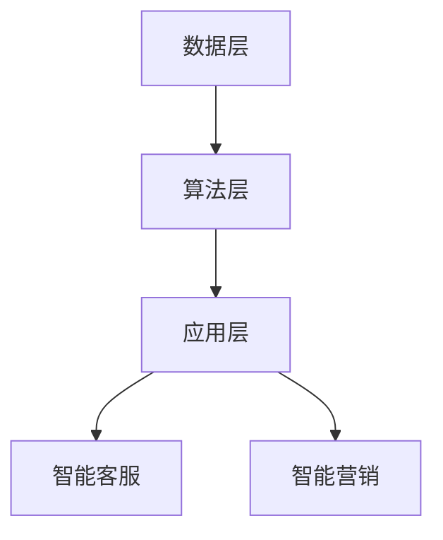

                 

关键词：AI 2.0，商业价值，人工智能，技术创新，商业模式

> 摘要：本文将探讨 AI 2.0 时代的商业价值，分析其如何推动产业变革，提高企业竞争力。通过介绍李开复对 AI 2.0 的理解，我们将从核心概念、算法原理、数学模型、项目实践、应用场景、工具和资源等多个角度，全面剖析 AI 2.0 时代的商业价值，为读者提供有价值的参考。

## 1. 背景介绍

人工智能（AI）作为当今科技领域的重要分支，已深刻影响了各行各业。从早期的专家系统到深度学习，人工智能技术不断进化，逐渐迈向 AI 2.0 时代。AI 2.0，顾名思义，是人工智能的第二阶段，其核心在于将 AI 技术从简单的数据处理和模式识别，提升到能够自主思考、学习、创新的高度。

李开复作为世界级人工智能专家，对 AI 2.0 有着深刻的理解和独到的见解。他认为，AI 2.0 时代的商业价值将体现在以下几个方面：

1. **提高生产效率**：通过智能化设备和系统，企业能够实现自动化生产，降低人力成本，提高生产效率。
2. **优化资源配置**：人工智能可以帮助企业精准分析市场趋势，合理配置资源，降低库存成本。
3. **创新商业模式**：AI 2.0 为企业提供了全新的商业模式，如智能客服、智能营销等，为企业带来更多商机。
4. **提升用户体验**：人工智能技术可以为企业提供个性化服务，提升用户体验，增加客户忠诚度。

## 2. 核心概念与联系

### 2.1. AI 2.0 核心概念

AI 2.0 的核心在于自主学习和创新能力。它不仅能够处理已有数据，还能够通过自主学习，不断优化自身性能。以下是一些关键的 AI 2.0 概念：

- **深度学习**：一种模拟人脑神经网络的机器学习技术，通过多层神经网络进行特征提取和分类。
- **强化学习**：一种基于奖励和惩罚机制，通过不断试错，实现自我优化的学习方式。
- **自然语言处理**：一种模拟人类语言理解和生成能力的计算机技术，实现人与机器的对话。

### 2.2. AI 2.0 架构原理

AI 2.0 的架构可以分为以下几个层次：

1. **数据层**：收集和处理大量数据，为人工智能提供训练素材。
2. **算法层**：包括深度学习、强化学习等算法，实现数据的特征提取和分类。
3. **应用层**：将人工智能技术应用于实际场景，如智能客服、智能营销等。

### 2.3. Mermaid 流程图

以下是一个简单的 Mermaid 流程图，展示 AI 2.0 的架构原理：



## 3. 核心算法原理 & 具体操作步骤

### 3.1. 算法原理概述

AI 2.0 的核心算法主要包括深度学习、强化学习和自然语言处理。以下是这些算法的基本原理：

- **深度学习**：通过多层神经网络，对数据进行特征提取和分类。
- **强化学习**：通过试错和反馈机制，实现自我优化。
- **自然语言处理**：通过机器学习算法，实现人与机器的对话。

### 3.2. 算法步骤详解

#### 3.2.1. 深度学习算法步骤

1. **数据预处理**：对数据进行清洗、归一化等处理，确保数据质量。
2. **构建神经网络**：设计多层神经网络结构，包括输入层、隐藏层和输出层。
3. **训练神经网络**：通过大量训练数据，调整神经网络参数，使其性能达到最佳。
4. **评估和优化**：使用测试数据，评估神经网络性能，并进行优化。

#### 3.2.2. 强化学习算法步骤

1. **定义状态和动作**：明确强化学习问题的状态空间和动作空间。
2. **构建奖励机制**：根据状态和动作，定义奖励函数，激励智能体不断优化行为。
3. **选择动作**：基于当前状态，选择最优动作。
4. **更新策略**：根据动作结果，更新智能体的策略，实现自我优化。

#### 3.2.3. 自然语言处理算法步骤

1. **分词和词性标注**：将文本分解为词语和词性，为后续处理提供基础。
2. **词向量化**：将词语转化为向量表示，便于计算和处理。
3. **序列模型训练**：使用循环神经网络（RNN）或长短期记忆网络（LSTM），对序列数据进行训练。
4. **生成文本**：根据训练好的模型，生成自然语言文本。

### 3.3. 算法优缺点

- **深度学习**：优点包括强大的特征提取能力、高准确性；缺点包括对数据依赖性强、模型可解释性差。
- **强化学习**：优点包括自适应性强、能够应对动态环境；缺点包括收敛速度慢、需要大量样本。
- **自然语言处理**：优点包括实现人与机器的对话、提升用户体验；缺点包括数据处理复杂、计算资源需求大。

### 3.4. 算法应用领域

- **深度学习**：广泛应用于图像识别、语音识别、推荐系统等领域。
- **强化学习**：应用于游戏、智能交通、能源管理等场景。
- **自然语言处理**：应用于智能客服、智能翻译、文本生成等领域。

## 4. 数学模型和公式 & 详细讲解 & 举例说明

### 4.1. 数学模型构建

AI 2.0 中的数学模型主要包括神经网络模型、强化学习模型和自然语言处理模型。以下是这些模型的简要介绍：

#### 4.1.1. 神经网络模型

神经网络模型由多层神经元组成，包括输入层、隐藏层和输出层。每个神经元之间的连接可以用权重表示，模型的目标是优化这些权重，使其输出尽可能接近预期。

#### 4.1.2. 强化学习模型

强化学习模型主要由状态空间、动作空间、奖励函数和策略组成。模型的目标是找到最优策略，使智能体在动态环境中获得最大奖励。

#### 4.1.3. 自然语言处理模型

自然语言处理模型主要由分词、词性标注、词向量化、序列模型等组成。模型的目标是实现文本的语义理解和生成。

### 4.2. 公式推导过程

以下是一个简化的神经网络模型推导过程：

#### 4.2.1. 输入层到隐藏层

$$
z^{[1]}_j = \sum_{i} W^{[1]}_{ji} x_i + b_j^{[1]}
$$

$$
a^{[1]}_j = \sigma(z^{[1]}_j)
$$

其中，$z^{[1]}_j$ 表示第 $j$ 个隐藏层神经元的输入，$W^{[1]}_{ji}$ 表示第 $i$ 个输入层神经元到第 $j$ 个隐藏层神经元的权重，$b_j^{[1]}$ 表示第 $j$ 个隐藏层神经元的偏置，$\sigma$ 表示激活函数。

#### 4.2.2. 隐藏层到输出层

$$
z^{[2]}_k = \sum_{j} W^{[2]}_{jk} a_j^{[1]} + b_k^{[2]}
$$

$$
\hat{y}_k = \sigma(z^{[2]}_k)
$$

其中，$z^{[2]}_k$ 表示第 $k$ 个输出层神经元的输入，$W^{[2]}_{jk}$ 表示第 $j$ 个隐藏层神经元到第 $k$ 个输出层神经元的权重，$b_k^{[2]}$ 表示第 $k$ 个输出层神经元的偏置，$\sigma$ 表示激活函数。

### 4.3. 案例分析与讲解

以下是一个简单的神经网络模型应用案例，用于实现手写数字识别：

#### 4.3.1. 数据集

使用 MNIST 手写数字数据集，包括 60000 个训练样本和 10000 个测试样本。

#### 4.3.2. 网络结构

定义一个简单的三层神经网络，包括 784 个输入神经元、100 个隐藏层神经元和 10 个输出神经元。

#### 4.3.3. 模型训练

使用梯度下降算法，优化神经网络权重和偏置，使得输出结果尽可能接近真实值。

#### 4.3.4. 模型评估

使用测试数据集，计算模型的准确率，评估模型性能。

## 5. 项目实践：代码实例和详细解释说明

### 5.1. 开发环境搭建

- Python 3.7及以上版本
- TensorFlow 2.0及以上版本
- Jupyter Notebook

### 5.2. 源代码详细实现

以下是一个简单的手写数字识别代码实例：

```python
import tensorflow as tf
from tensorflow.keras import layers

# 定义模型结构
model = tf.keras.Sequential([
    layers.Dense(100, activation='relu', input_shape=(784,)),
    layers.Dense(10, activation='softmax')
])

# 编译模型
model.compile(optimizer='adam',
              loss='categorical_crossentropy',
              metrics=['accuracy'])

# 加载数据集
(x_train, y_train), (x_test, y_test) = tf.keras.datasets.mnist.load_data()

# 预处理数据
x_train = x_train.astype('float32') / 255
x_test = x_test.astype('float32') / 255
y_train = tf.keras.utils.to_categorical(y_train, 10)
y_test = tf.keras.utils.to_categorical(y_test, 10)

# 训练模型
model.fit(x_train, y_train, epochs=10, batch_size=128, validation_data=(x_test, y_test))

# 评估模型
test_loss, test_acc = model.evaluate(x_test, y_test)
print('Test accuracy:', test_acc)
```

### 5.3. 代码解读与分析

上述代码实现了一个简单的三层神经网络，用于手写数字识别。主要步骤包括：

1. **定义模型结构**：使用 `Sequential` 模型堆叠多层 `Dense` 层，实现全连接神经网络。
2. **编译模型**：指定优化器、损失函数和评估指标，准备训练模型。
3. **加载数据集**：使用 TensorFlow 的 `mnist` 数据集，加载训练数据和测试数据。
4. **预处理数据**：对数据进行归一化处理，将标签转换为 one-hot 编码。
5. **训练模型**：使用 `fit` 方法训练模型，指定训练轮次、批量大小和验证数据。
6. **评估模型**：使用 `evaluate` 方法评估模型在测试数据集上的性能。

## 6. 实际应用场景

### 6.1. 智能客服

AI 2.0 时代的智能客服通过自然语言处理技术，实现与用户的实时对话，提供个性化的服务。在金融、电商、电信等行业，智能客服已经成为企业提高客户满意度、降低运营成本的重要手段。

### 6.2. 智能营销

AI 2.0 时代的智能营销利用大数据分析和机器学习技术，精准分析用户需求，制定个性化的营销策略。通过推送个性化广告、推荐商品等手段，提高营销效果，增加销售额。

### 6.3. 自动驾驶

自动驾驶技术是 AI 2.0 时代的重要应用领域。通过深度学习和强化学习技术，自动驾驶系统可以实现自主驾驶，提高交通安全，减少交通事故。

### 6.4. 医疗诊断

AI 2.0 时代的医疗诊断利用深度学习和自然语言处理技术，实现疾病的自动诊断和治疗方案推荐。通过分析大量的病例数据和医学文献，提高诊断准确率，为医生提供有力支持。

## 7. 工具和资源推荐

### 7.1. 学习资源推荐

- 《深度学习》（Goodfellow, Bengio, Courville）
- 《强化学习》（Sutton, Barto）
- 《自然语言处理综述》（Jurafsky, Martin）

### 7.2. 开发工具推荐

- TensorFlow
- PyTorch
- Keras

### 7.3. 相关论文推荐

- "Deep Learning"（Goodfellow et al., 2016）
- "Reinforcement Learning: An Introduction"（Sutton et al., 2018）
- "Natural Language Processing with Deep Learning"（Mikolov et al., 2013）

## 8. 总结：未来发展趋势与挑战

### 8.1. 研究成果总结

AI 2.0 时代的研究成果主要集中在深度学习、强化学习和自然语言处理等领域。通过这些技术的应用，企业能够实现智能化、自动化和个性化的服务，提高生产效率和市场竞争力。

### 8.2. 未来发展趋势

未来，AI 2.0 时代将朝着更智能、更自适应、更高效的方向发展。随着计算能力的提升和数据量的爆炸式增长，AI 技术将更加成熟，应用领域将不断扩展。

### 8.3. 面临的挑战

然而，AI 2.0 时代也面临诸多挑战，如数据隐私、算法透明性、安全等问题。为了应对这些挑战，需要加强政策法规的制定和行业自律，确保 AI 技术的健康、可持续发展。

### 8.4. 研究展望

未来，AI 2.0 时代的研究将更加注重跨学科合作，融合计算机科学、心理学、生物学等多领域知识，推动人工智能技术的创新和发展。

## 9. 附录：常见问题与解答

### 9.1. 问题 1：什么是 AI 2.0？

AI 2.0 是人工智能的第二阶段，强调自主学习和创新能力，能够实现自主思考、学习和创新。

### 9.2. 问题 2：AI 2.0 有哪些核心算法？

AI 2.0 的核心算法包括深度学习、强化学习和自然语言处理。

### 9.3. 问题 3：AI 2.0 在实际应用中面临哪些挑战？

AI 2.0 在实际应用中面临数据隐私、算法透明性、安全等问题。

### 9.4. 问题 4：如何学好 AI 2.0 技术？

学好 AI 2.0 技术需要系统学习相关理论，掌握常见算法，参与实际项目实践，不断积累经验。

----------------------------------------------------------------

## 作者署名

作者：禅与计算机程序设计艺术 / Zen and the Art of Computer Programming

本文完。感谢您的阅读！希望本文能为您在 AI 2.0 时代的商业价值领域带来启发和帮助。如需进一步了解相关内容，请持续关注我们的后续文章。

