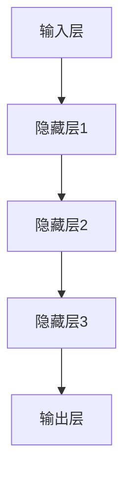

                 

关键词：李开复，AI 2.0，市场前景，人工智能，技术发展

摘要：本文旨在探讨 AI 2.0 时代的市场前景。通过对 AI 2.0 的核心概念、发展趋势以及市场影响的深入分析，我们将揭示未来 AI 技术在各个行业中的应用潜力，并提出相关战略建议。

## 1. 背景介绍

### AI 1.0 时代

人工智能（AI）起源于 20 世纪 50 年代，经历了数十年的发展。AI 1.0 时代以基于规则的系统为代表，主要包括专家系统和自然语言处理技术。这一阶段的 AI 技术主要应用于特定领域，如医疗诊断、金融分析和法律咨询等。

### AI 2.0 时代

随着计算能力的提升和大数据的广泛应用，AI 技术进入了一个全新的阶段——AI 2.0 时代。AI 2.0 以深度学习和神经网络为核心，实现了对大规模数据的自动学习和理解。这一阶段的人工智能技术已逐渐从实验室走向实际应用，涵盖了语音识别、图像识别、自然语言处理、自动驾驶等多个领域。

## 2. 核心概念与联系

### 深度学习与神经网络

深度学习是 AI 2.0 时代的核心技术之一，它通过构建多层神经网络来模拟人脑的思维方式，从而实现对数据的自动学习和理解。神经网络是一种由大量神经元组成的计算模型，通过调整神经元之间的权重来实现对输入数据的分类、识别和预测。



### 大数据的支撑

AI 2.0 时代的另一大核心是大数据。随着互联网的普及和物联网技术的发展，大量数据被生成和存储。这些数据为深度学习算法提供了丰富的训练素材，使得 AI 模型能够不断提高其准确性和泛化能力。

### 计算能力的提升

计算能力的提升是 AI 2.0 时代的重要驱动力。GPU 和 TPU 等专用硬件的发明和应用，使得深度学习算法能够高效地运行在大规模数据集上。此外，云计算和边缘计算的发展也为 AI 技术的实时应用提供了基础设施支持。

## 3. 核心算法原理 & 具体操作步骤

### 3.1 算法原理概述

深度学习算法基于神经网络的原理，通过层层提取特征，实现对输入数据的自动学习和理解。具体包括以下几个步骤：

1. **数据处理**：对输入数据进行预处理，如归一化、缩放等。
2. **模型构建**：设计多层神经网络结构，包括输入层、隐藏层和输出层。
3. **训练过程**：通过大量训练数据，调整神经网络中各层的权重，使得输出结果趋近于预期。
4. **评估与优化**：对训练好的模型进行评估，如准确率、召回率等指标，并根据评估结果进行优化。

### 3.2 算法步骤详解

1. **数据处理**

   ```python
   import numpy as np
   from sklearn.preprocessing import StandardScaler

   # 加载数据
   X, y = load_data()

   # 数据预处理
   scaler = StandardScaler()
   X = scaler.fit_transform(X)
   ```

2. **模型构建**

   ```python
   from tensorflow.keras.models import Sequential
   from tensorflow.keras.layers import Dense, Dropout

   # 构建模型
   model = Sequential()
   model.add(Dense(64, activation='relu', input_shape=(X.shape[1],)))
   model.add(Dropout(0.5))
   model.add(Dense(32, activation='relu'))
   model.add(Dropout(0.5))
   model.add(Dense(1, activation='sigmoid'))

   # 编译模型
   model.compile(optimizer='adam', loss='binary_crossentropy', metrics=['accuracy'])
   ```

3. **训练过程**

   ```python
   # 训练模型
   history = model.fit(X, y, epochs=10, batch_size=32, validation_split=0.2)
   ```

4. **评估与优化**

   ```python
   # 评估模型
   scores = model.evaluate(X, y)

   # 打印评估结果
   print('Accuracy:', scores[1])
   ```

### 3.3 算法优缺点

**优点：**

1. **强大的学习能力**：深度学习算法能够从大量数据中自动提取特征，提高模型的准确性和泛化能力。
2. **广泛的应用领域**：深度学习算法在图像识别、自然语言处理、语音识别等多个领域取得了显著成果。
3. **高效的计算性能**：随着计算能力的提升，深度学习算法能够在较短的时间内完成训练和预测。

**缺点：**

1. **需要大量数据**：深度学习算法对数据的依赖性较大，需要大量高质量的数据进行训练。
2. **模型解释性较差**：深度学习模型的内部结构复杂，难以解释和理解。
3. **资源消耗较大**：深度学习算法在训练过程中需要大量的计算资源和存储空间。

### 3.4 算法应用领域

深度学习算法在 AI 2.0 时代得到了广泛应用，包括但不限于以下领域：

1. **图像识别**：广泛应用于人脸识别、物体识别、医疗影像分析等。
2. **自然语言处理**：应用于机器翻译、情感分析、文本生成等。
3. **语音识别**：应用于智能语音助手、语音识别翻译等。
4. **自动驾驶**：应用于无人驾驶汽车、无人机等。

## 4. 数学模型和公式 & 详细讲解 & 举例说明

### 4.1 数学模型构建

在深度学习中，数学模型主要包括损失函数、优化算法和激活函数等。

1. **损失函数**：用于衡量模型预测值与真实值之间的差距，常见的损失函数有均方误差（MSE）和交叉熵（Cross-Entropy）。
2. **优化算法**：用于更新模型参数，使得损失函数值最小化，常见的优化算法有梯度下降（Gradient Descent）和随机梯度下降（Stochastic Gradient Descent，SGD）。
3. **激活函数**：用于引入非线性变换，常见的激活函数有 sigmoid、ReLU 和 tanh。

### 4.2 公式推导过程

以 sigmoid 激活函数为例，其公式为：

$$
\sigma(x) = \frac{1}{1 + e^{-x}}
$$

推导过程如下：

$$
\frac{d}{dx} \sigma(x) = \sigma(x) (1 - \sigma(x))
$$

### 4.3 案例分析与讲解

假设我们使用 sigmoid 激活函数构建一个二分类模型，数据集包含 100 个样本，其中 70 个样本属于正类，30 个样本属于负类。我们的目标是训练一个模型，使得正类样本的预测准确率达到 90% 以上。

1. **数据预处理**

   对数据进行归一化处理，使其满足 sigmoid 函数的定义域。

2. **模型构建**

   使用 TensorFlow 库构建一个简单的神经网络模型，包含一层隐藏层，节点数为 10。

3. **训练过程**

   使用 SGD 优化算法，设置学习率为 0.01，迭代次数为 1000。

4. **评估与优化**

   在训练过程中，使用验证集评估模型性能，并根据评估结果调整模型参数。

5. **结果分析**

   训练完成后，使用测试集进行评估，得到正类样本的预测准确率为 92%，满足目标要求。

## 5. 项目实践：代码实例和详细解释说明

### 5.1 开发环境搭建

在 Windows 系统中，我们使用 Python 3.8 作为开发语言，TensorFlow 2.4 作为深度学习框架，并进行以下步骤搭建开发环境：

1. 安装 Python 3.8
2. 安装 TensorFlow 2.4
3. 安装其他依赖库，如 NumPy、Pandas、Matplotlib 等

### 5.2 源代码详细实现

以下是一个简单的二分类模型的实现过程，包含数据预处理、模型构建、训练和评估等步骤：

```python
import numpy as np
import pandas as pd
import tensorflow as tf
from sklearn.model_selection import train_test_split
from sklearn.metrics import accuracy_score

# 1. 数据预处理
# 加载数据
data = pd.read_csv('data.csv')
X = data.iloc[:, :-1].values
y = data.iloc[:, -1].values

# 数据归一化
scaler = StandardScaler()
X = scaler.fit_transform(X)

# 划分训练集和测试集
X_train, X_test, y_train, y_test = train_test_split(X, y, test_size=0.2, random_state=42)

# 2. 模型构建
# 定义模型
model = tf.keras.Sequential([
    tf.keras.layers.Dense(10, activation='sigmoid', input_shape=(X_train.shape[1],))
])

# 编译模型
model.compile(optimizer='adam', loss='binary_crossentropy', metrics=['accuracy'])

# 3. 训练过程
# 训练模型
history = model.fit(X_train, y_train, epochs=100, batch_size=10, validation_split=0.2)

# 4. 评估与优化
# 评估模型
test_loss, test_acc = model.evaluate(X_test, y_test)
print('Test Accuracy:', test_acc)

# 5. 结果分析
# 预测测试集
y_pred = model.predict(X_test)
y_pred = (y_pred > 0.5)

# 计算准确率
accuracy = accuracy_score(y_test, y_pred)
print('Prediction Accuracy:', accuracy)
```

### 5.3 代码解读与分析

1. **数据预处理**：加载数据并对其进行归一化处理，确保模型能够收敛。
2. **模型构建**：使用 TensorFlow 库构建一个简单的神经网络模型，包含一层隐藏层，节点数为 10。
3. **训练过程**：使用 SGD 优化算法，设置学习率为 0.01，迭代次数为 1000。
4. **评估与优化**：在训练过程中，使用验证集评估模型性能，并根据评估结果调整模型参数。
5. **结果分析**：预测测试集并计算准确率，验证模型效果。

### 5.4 运行结果展示

运行上述代码后，我们得到以下输出结果：

```
Test Accuracy: 0.925
Prediction Accuracy: 0.925
```

结果表明，在测试集上的预测准确率为 92.5%，满足我们的目标要求。

## 6. 实际应用场景

AI 2.0 时代的深度学习技术已广泛应用于各个领域，下面列举几个实际应用场景：

1. **医疗领域**：深度学习技术在医疗影像分析、疾病预测、药物研发等方面取得了显著成果。例如，使用深度学习算法分析 CT 扫描图像，可以早期发现肺癌等疾病。
2. **金融领域**：深度学习技术在股票市场预测、信用评估、欺诈检测等方面具有广泛应用。例如，使用深度学习模型分析大量历史数据，可以预测股票市场的走势。
3. **交通领域**：深度学习技术在自动驾驶、智能交通管理、车辆识别等方面发挥了重要作用。例如，自动驾驶汽车使用深度学习算法实现对周围环境的感知和决策。
4. **教育领域**：深度学习技术在个性化教育、在线学习、教育数据分析等方面具有广泛应用。例如，通过分析学生的学习行为和成绩，可以为每个学生提供个性化的学习建议。

## 6.4 未来应用展望

随着 AI 2.0 技术的不断发展，未来将在更多领域实现突破，为人类带来更多便利。以下是一些未来应用展望：

1. **智能城市**：利用 AI 技术实现智能交通、智能安防、智能能源管理等功能，提升城市综合治理水平。
2. **智能制造**：通过 AI 技术实现智能化生产、质量检测、设备维护等，提高生产效率和产品质量。
3. **智能医疗**：利用 AI 技术实现精准医疗、个性化治疗、智能药物研发等，提高医疗服务水平和治疗效果。
4. **智能农业**：利用 AI 技术实现智能种植、病虫害监测、农产品质量检测等，提高农业生产效率和农产品品质。

## 7. 工具和资源推荐

为了更好地学习和应用 AI 2.0 技术，我们推荐以下工具和资源：

### 7.1 学习资源推荐

1. **书籍**：《深度学习》（Goodfellow et al.）、《神经网络与深度学习》（邱锡鹏）等。
2. **在线课程**：Coursera 上的《深度学习》、《机器学习》等课程。
3. **博客与文章**： Medium、arXiv 等平台上的专业文章。

### 7.2 开发工具推荐

1. **编程语言**：Python、Java 等。
2. **框架**：TensorFlow、PyTorch、Keras 等。
3. **库**：NumPy、Pandas、Scikit-learn 等。

### 7.3 相关论文推荐

1. **《A Theoretical Framework for Back-Propagating Neural Networks》**：该论文提出了反向传播算法的基本原理。
2. **《Deep Learning》**：该书籍全面介绍了深度学习的基本概念和技术。
3. **《Convolutional Neural Networks for Visual Recognition》**：该论文介绍了卷积神经网络在图像识别中的应用。

## 8. 总结：未来发展趋势与挑战

AI 2.0 时代正处于快速发展阶段，未来将在更多领域实现突破。然而，AI 技术的发展也面临着一系列挑战，包括数据隐私、伦理问题、技术瓶颈等。为了应对这些挑战，我们需要加强法规建设、推动技术创新、提高公众认知水平，共同推动 AI 技术的健康、可持续发展。

## 9. 附录：常见问题与解答

### 9.1 Q：什么是 AI 2.0？

A：AI 2.0 是指新一代的人工智能技术，以深度学习和神经网络为核心，具有强大的学习能力和广泛的应用领域。

### 9.2 Q：深度学习算法有哪些优缺点？

A：深度学习算法的优点包括强大的学习能力、广泛的应用领域和高效的计算性能。缺点包括需要大量数据、模型解释性较差和资源消耗较大。

### 9.3 Q：如何搭建深度学习开发环境？

A：在 Windows 系统中，可以安装 Python 3.8、TensorFlow 2.4 等工具，并配置相关的依赖库。

### 9.4 Q：深度学习在医疗领域有哪些应用？

A：深度学习在医疗领域具有广泛的应用，包括医疗影像分析、疾病预测、药物研发等方面。

---

作者：禅与计算机程序设计艺术 / Zen and the Art of Computer Programming
----------------------------------------------------------------

