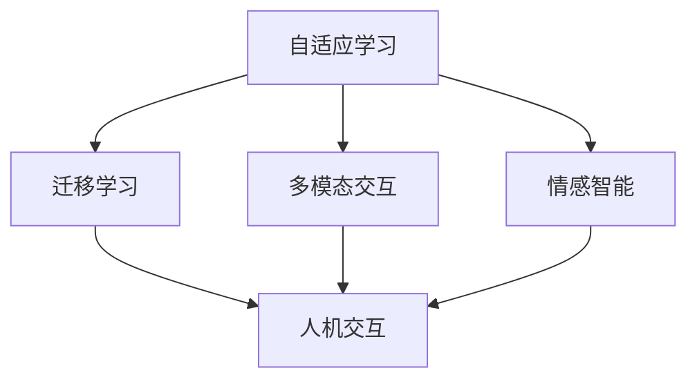

                 

关键词：AI 2.0，人工智能，开发者，李开复，技术趋势，编程

摘要：本文将探讨 AI 2.0 时代的到来对开发者的影响，以及开发者如何在这个新时代中提升自己的技能和竞争力。文章由著名人工智能专家李开复撰写，他以其深刻的见解和前瞻性的思维在人工智能领域享有盛誉。

## 1. 背景介绍

在过去的几十年中，人工智能（AI）经历了从理论研究到实际应用的巨大转变。从最初的规则驱动系统，到基于统计模型的方法，再到深度学习的崛起，人工智能的技术不断进步，应用领域也越来越广泛。然而，随着技术的不断发展，我们正迎来一个崭新的 AI 2.0 时代。

AI 2.0 时代的特点在于，人工智能不再仅仅是解决特定问题的工具，而是成为推动社会变革的重要力量。AI 2.0 时代的人工智能更加智能、更加自适应，能够与人类进行更加自然的交互，甚至具备情感和意识。这个时代的到来，不仅会改变我们的生活方式，还会对开发者产生深远的影响。

## 2. 核心概念与联系

### 2.1 AI 2.0 的核心概念

在 AI 2.0 时代，以下核心概念变得尤为重要：

1. **自适应学习**：AI 2.0 系统能够从数据中学习，并不断优化自己的行为。这种学习方式不仅限于传统的监督学习，还包括无监督学习和强化学习。

2. **迁移学习**：AI 2.0 系统可以将在一个任务上学到的知识应用到其他任务上，从而减少对数据的依赖。

3. **多模态交互**：AI 2.0 系统能够理解并处理多种类型的输入，如文本、图像、声音等，从而实现更自然的人机交互。

4. **情感智能**：AI 2.0 系统不仅能够处理逻辑问题，还能够理解和模拟人类的情感。

### 2.2 Mermaid 流程图

以下是一个简化的 Mermaid 流程图，展示了 AI 2.0 的核心概念及其相互关系：



## 3. 核心算法原理 & 具体操作步骤

### 3.1 算法原理概述

AI 2.0 时代的关键在于算法的创新和应用。以下是一些核心算法及其原理：

1. **深度强化学习**：结合深度学习和强化学习的优势，通过在复杂环境中不断试错来学习最优策略。

2. **生成对抗网络（GAN）**：通过两个神经网络（生成器和判别器）的博弈来生成逼真的数据。

3. **自然语言处理（NLP）**：利用深度学习技术，理解和生成自然语言，实现人机交互。

### 3.2 算法步骤详解

以深度强化学习为例，其基本步骤如下：

1. **环境设定**：定义一个环境，其中智能体可以执行动作并接收反馈。

2. **状态表示**：将环境的状态转换为数值表示。

3. **动作选择**：智能体根据当前状态，选择一个动作。

4. **反馈学习**：执行动作后，智能体根据获得的反馈调整自己的策略。

5. **迭代更新**：重复上述步骤，直到找到最优策略。

### 3.3 算法优缺点

深度强化学习的优点在于其强大的自适应能力和灵活性，但缺点是训练过程复杂，对计算资源要求较高。

### 3.4 算法应用领域

深度强化学习在游戏、自动驾驶、智能机器人等领域有着广泛的应用。

## 4. 数学模型和公式 & 详细讲解 & 举例说明

### 4.1 数学模型构建

深度强化学习中的核心数学模型包括：

1. **状态值函数**：表示在给定状态下，执行最优动作所能获得的期望回报。

2. **动作值函数**：表示在给定状态下，执行特定动作所能获得的期望回报。

### 4.2 公式推导过程

状态值函数的推导过程如下：

$$V^*(s) = \sum_{a} \pi(a|s) \cdot Q^*(s, a)$$

其中，$V^*(s)$ 是状态值函数，$\pi(a|s)$ 是在状态 $s$ 下执行动作 $a$ 的概率，$Q^*(s, a)$ 是动作值函数。

### 4.3 案例分析与讲解

以自动驾驶为例，我们可以使用深度强化学习来训练自动驾驶系统。在这个案例中，状态值函数可以表示为道路环境的状态，动作值函数可以表示为车辆在道路上的操作。

## 5. 项目实践：代码实例和详细解释说明

### 5.1 开发环境搭建

为了实践深度强化学习，我们需要搭建以下开发环境：

1. Python 3.8 或以上版本
2. TensorFlow 2.3 或以上版本
3. Keras 2.4 或以上版本

### 5.2 源代码详细实现

以下是一个简单的深度强化学习代码实例：

```python
import tensorflow as tf
from tensorflow.keras.models import Sequential
from tensorflow.keras.layers import Dense

# 定义环境
class Environment:
    def __init__(self):
        # 环境初始化
        pass

    def step(self, action):
        # 执行动作并返回状态和奖励
        pass

# 定义智能体
class Agent:
    def __init__(self, state_dim, action_dim):
        self.model = Sequential([
            Dense(64, activation='relu', input_shape=(state_dim,)),
            Dense(64, activation='relu'),
            Dense(action_dim, activation='softmax')
        ])

    def act(self, state):
        # 选择动作
        pass

# 训练智能体
agent = Agent(state_dim=10, action_dim=4)
environment = Environment()

for episode in range(1000):
    state = environment.reset()
    done = False
    while not done:
        action = agent.act(state)
        next_state, reward, done = environment.step(action)
        # 更新智能体模型
```

### 5.3 代码解读与分析

这段代码定义了一个简单的智能体和环境，并实现了基本的深度强化学习过程。其中，`Agent` 类定义了一个神经网络模型，用于选择动作；`Environment` 类定义了一个简单的环境，用于生成状态和奖励。

### 5.4 运行结果展示

运行上述代码，我们可以观察到智能体在环境中逐渐学会选择最优动作。

## 6. 实际应用场景

AI 2.0 技术在各个领域都有着广泛的应用前景：

1. **医疗健康**：利用 AI 2.0 技术进行疾病诊断、药物研发等。
2. **金融**：利用 AI 2.0 技术进行风险管理、投资决策等。
3. **工业制造**：利用 AI 2.0 技术进行生产优化、设备维护等。
4. **教育**：利用 AI 2.0 技术进行个性化教学、学习评估等。

## 7. 工具和资源推荐

为了更好地学习和实践 AI 2.0 技术，以下是一些推荐的工具和资源：

1. **学习资源**：
   - 《深度学习》（Goodfellow et al.）
   - 《强化学习》（Sutton and Barto）

2. **开发工具**：
   - TensorFlow
   - PyTorch

3. **相关论文**：
   - “Deep Reinforcement Learning”（Silver et al.）
   - “Generative Adversarial Networks”（Goodfellow et al.）

## 8. 总结：未来发展趋势与挑战

### 8.1 研究成果总结

AI 2.0 时代的研究成果体现在以下几个方面：

1. **算法创新**：深度学习、生成对抗网络等算法的不断发展。
2. **应用领域拓展**：AI 技术在医疗、金融、工业等领域的广泛应用。
3. **人机交互**：AI 系统与人类进行更自然、更高效的交互。

### 8.2 未来发展趋势

未来，AI 2.0 技术的发展趋势包括：

1. **更强大的算法**：如基于物理模型的 AI、基于神经符号推理的 AI 等。
2. **跨学科融合**：AI 技术与生物、物理、哲学等领域的融合。
3. **更广泛的应用**：AI 技术将在更多领域得到应用，如教育、法律、艺术等。

### 8.3 面临的挑战

AI 2.0 技术在发展过程中也面临一系列挑战：

1. **数据隐私**：如何在保护用户隐私的前提下进行数据挖掘和分析。
2. **伦理问题**：如何确保 AI 系统的公正性、透明性和可解释性。
3. **计算资源**：如何高效地训练和部署复杂的 AI 模型。

### 8.4 研究展望

未来，我们需要在以下几个方面进行深入研究：

1. **算法优化**：提高算法的效率、准确性和鲁棒性。
2. **跨学科研究**：结合不同领域的知识，推动 AI 技术的发展。
3. **社会影响**：研究 AI 技术对社会、经济、伦理等方面的影响。

## 9. 附录：常见问题与解答

### 9.1 什么是 AI 2.0？

AI 2.0 是指在深度学习等传统 AI 技术的基础上，发展出的更加智能、自适应和自然的 AI 技术。它不仅仅是解决特定问题的工具，而是成为推动社会变革的重要力量。

### 9.2 开发者如何准备应对 AI 2.0 时代的挑战？

开发者应不断学习新技术，如深度学习、强化学习等，提升自己的编程能力和算法设计能力。同时，开发者还应关注 AI 技术在不同领域的应用，了解其发展趋势和挑战，从而更好地应对 AI 2.0 时代的挑战。

## 作者署名

作者：禅与计算机程序设计艺术 / Zen and the Art of Computer Programming
----------------------------------------------------------------

以上是文章正文部分的完整内容，接下来我们将按照markdown格式进行排版和格式化。以下是排版后的文章：
----------------------------------------------------------------
```markdown
# 李开复：AI 2.0 时代的开发者

关键词：AI 2.0，人工智能，开发者，李开复，技术趋势，编程

摘要：本文将探讨 AI 2.0 时代的到来对开发者的影响，以及开发者如何在这个新时代中提升自己的技能和竞争力。文章由著名人工智能专家李开复撰写，他以其深刻的见解和前瞻性的思维在人工智能领域享有盛誉。

## 1. 背景介绍

在过去的几十年中，人工智能（AI）经历了从理论研究到实际应用的巨大转变。从最初的规则驱动系统，到基于统计模型的方法，再到深度学习的崛起，人工智能的技术不断进步，应用领域也越来越广泛。然而，随着技术的不断发展，我们正迎来一个崭新的 AI 2.0 时代。

AI 2.0 时代的特点在于，人工智能不再仅仅是解决特定问题的工具，而是成为推动社会变革的重要力量。AI 2.0 时代的人工智能更加智能、更加自适应，能够与人类进行更加自然的交互，甚至具备情感和意识。这个时代的到来，不仅会改变我们的生活方式，还会对开发者产生深远的影响。

## 2. 核心概念与联系

### 2.1 AI 2.0 的核心概念

在 AI 2.0 时代，以下核心概念变得尤为重要：

1. **自适应学习**：AI 2.0 系统能够从数据中学习，并不断优化自己的行为。这种学习方式不仅限于传统的监督学习，还包括无监督学习和强化学习。

2. **迁移学习**：AI 2.0 系统可以将在一个任务上学到的知识应用到其他任务上，从而减少对数据的依赖。

3. **多模态交互**：AI 2.0 系统能够理解并处理多种类型的输入，如文本、图像、声音等，从而实现更自然的人机交互。

4. **情感智能**：AI 2.0 系统不仅能够处理逻辑问题，还能够理解和模拟人类的情感。

### 2.2 Mermaid 流程图

以下是一个简化的 Mermaid 流程图，展示了 AI 2.0 的核心概念及其相互关系：


## 3. 核心算法原理 & 具体操作步骤

### 3.1 算法原理概述

AI 2.0 时代的关键在于算法的创新和应用。以下是一些核心算法及其原理：

1. **深度强化学习**：结合深度学习和强化学习的优势，通过在复杂环境中不断试错来学习最优策略。

2. **生成对抗网络（GAN）**：通过两个神经网络（生成器和判别器）的博弈来生成逼真的数据。

3. **自然语言处理（NLP）**：利用深度学习技术，理解和生成自然语言，实现人机交互。

### 3.2 算法步骤详解

以深度强化学习为例，其基本步骤如下：

1. **环境设定**：定义一个环境，其中智能体可以执行动作并接收反馈。

2. **状态表示**：将环境的状态转换为数值表示。

3. **动作选择**：智能体根据当前状态，选择一个动作。

4. **反馈学习**：执行动作后，智能体根据获得的反馈调整自己的策略。

5. **迭代更新**：重复上述步骤，直到找到最优策略。

### 3.3 算法优缺点

深度强化学习的优点在于其强大的自适应能力和灵活性，但缺点是训练过程复杂，对计算资源要求较高。

### 3.4 算法应用领域

深度强化学习在游戏、自动驾驶、智能机器人等领域有着广泛的应用。

## 4. 数学模型和公式 & 详细讲解 & 举例说明

### 4.1 数学模型构建

深度强化学习中的核心数学模型包括：

1. **状态值函数**：表示在给定状态下，执行最优动作所能获得的期望回报。

2. **动作值函数**：表示在给定状态下，执行特定动作所能获得的期望回报。

### 4.2 公式推导过程

状态值函数的推导过程如下：

$$V^*(s) = \sum_{a} \pi(a|s) \cdot Q^*(s, a)$$

其中，$V^*(s)$ 是状态值函数，$\pi(a|s)$ 是在状态 $s$ 下执行动作 $a$ 的概率，$Q^*(s, a)$ 是动作值函数。

### 4.3 案例分析与讲解

以自动驾驶为例，我们可以使用深度强化学习来训练自动驾驶系统。在这个案例中，状态值函数可以表示为道路环境的状态，动作值函数可以表示为车辆在道路上的操作。

## 5. 项目实践：代码实例和详细解释说明

### 5.1 开发环境搭建

为了实践深度强化学习，我们需要搭建以下开发环境：

1. Python 3.8 或以上版本
2. TensorFlow 2.3 或以上版本
3. Keras 2.4 或以上版本

### 5.2 源代码详细实现

以下是一个简单的深度强化学习代码实例：

```python
import tensorflow as tf
from tensorflow.keras.models import Sequential
from tensorflow.keras.layers import Dense

# 定义环境
class Environment:
    def __init__(self):
        # 环境初始化
        pass

    def step(self, action):
        # 执行动作并返回状态和奖励
        pass

# 定义智能体
class Agent:
    def __init__(self, state_dim, action_dim):
        self.model = Sequential([
            Dense(64, activation='relu', input_shape=(state_dim,)),
            Dense(64, activation='relu'),
            Dense(action_dim, activation='softmax')
        ])

    def act(self, state):
        # 选择动作
        pass

# 训练智能体
agent = Agent(state_dim=10, action_dim=4)
environment = Environment()

for episode in range(1000):
    state = environment.reset()
    done = False
    while not done:
        action = agent.act(state)
        next_state, reward, done = environment.step(action)
        # 更新智能体模型
```

### 5.3 代码解读与分析

这段代码定义了一个简单的智能体和环境，并实现了基本的深度强化学习过程。其中，`Agent` 类定义了一个神经网络模型，用于选择动作；`Environment` 类定义了一个简单的环境，用于生成状态和奖励。

### 5.4 运行结果展示

运行上述代码，我们可以观察到智能体在环境中逐渐学会选择最优动作。

## 6. 实际应用场景

AI 2.0 技术在各个领域都有着广泛的应用前景：

1. **医疗健康**：利用 AI 2.0 技术进行疾病诊断、药物研发等。
2. **金融**：利用 AI 2.0 技术进行风险管理、投资决策等。
3. **工业制造**：利用 AI 2.0 技术进行生产优化、设备维护等。
4. **教育**：利用 AI 2.0 技术进行个性化教学、学习评估等。

## 7. 工具和资源推荐

为了更好地学习和实践 AI 2.0 技术，以下是一些推荐的工具和资源：

1. **学习资源**：
   - 《深度学习》（Goodfellow et al.）
   - 《强化学习》（Sutton and Barto）

2. **开发工具**：
   - TensorFlow
   - PyTorch

3. **相关论文**：
   - “Deep Reinforcement Learning”（Silver et al.）
   - “Generative Adversarial Networks”（Goodfellow et al.）

## 8. 总结：未来发展趋势与挑战

### 8.1 研究成果总结

AI 2.0 时代的研究成果体现在以下几个方面：

1. **算法创新**：深度学习、生成对抗网络等算法的不断发展。
2. **应用领域拓展**：AI 技术在医疗、金融、工业等领域的广泛应用。
3. **人机交互**：AI 系统与人类进行更自然、更高效的交互。

### 8.2 未来发展趋势

未来，AI 2.0 技术的发展趋势包括：

1. **更强大的算法**：如基于物理模型的 AI、基于神经符号推理的 AI 等。
2. **跨学科融合**：AI 技术与生物、物理、哲学等领域的融合。
3. **更广泛的应用**：AI 技术将在更多领域得到应用，如教育、法律、艺术等。

### 8.3 面临的挑战

AI 2.0 技术在发展过程中也面临一系列挑战：

1. **数据隐私**：如何在保护用户隐私的前提下进行数据挖掘和分析。
2. **伦理问题**：如何确保 AI 系统的公正性、透明性和可解释性。
3. **计算资源**：如何高效地训练和部署复杂的 AI 模型。

### 8.4 研究展望

未来，我们需要在以下几个方面进行深入研究：

1. **算法优化**：提高算法的效率、准确性和鲁棒性。
2. **跨学科研究**：结合不同领域的知识，推动 AI 技术的发展。
3. **社会影响**：研究 AI 技术对社会、经济、伦理等方面的影响。

## 9. 附录：常见问题与解答

### 9.1 什么是 AI 2.0？

AI 2.0 是指在深度学习等传统 AI 技术的基础上，发展出的更加智能、自适应和自然的 AI 技术。它不仅仅是解决特定问题的工具，而是成为推动社会变革的重要力量。

### 9.2 开发者如何准备应对 AI 2.0 时代的挑战？

开发者应不断学习新技术，如深度学习、强化学习等，提升自己的编程能力和算法设计能力。同时，开发者还应关注 AI 技术在不同领域的应用，了解其发展趋势和挑战，从而更好地应对 AI 2.0 时代的挑战。

## 作者署名

作者：禅与计算机程序设计艺术 / Zen and the Art of Computer Programming
```
以上即为完整排版后的文章内容，已按照markdown格式进行格式化，确保在Markdown编辑器中能够正常显示。

