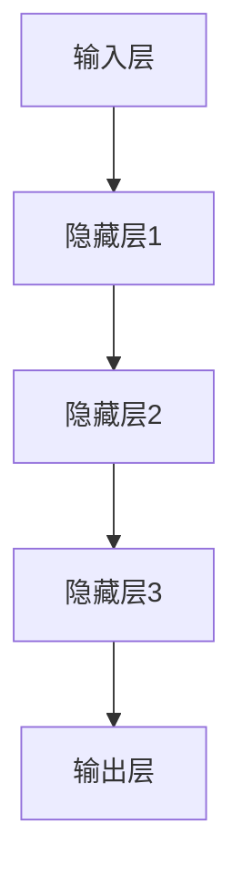
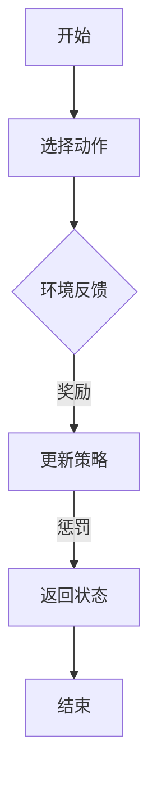
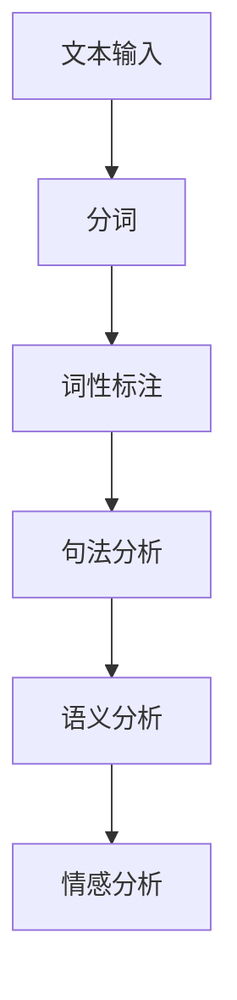

                 

关键词：人工智能，李开复，AI 2.0，深度学习，神经网络，技术进步，未来展望

> 摘要：本文将深入探讨AI 2.0时代的到来及其对技术和社会的深远影响。通过分析李开复关于人工智能的见解和预测，本文旨在揭示AI 2.0的核心概念、发展历程、技术突破以及未来前景。我们将探讨AI 2.0时代的意义，包括它如何改变我们的工作方式、生活方式以及思维方式。

## 1. 背景介绍

人工智能（Artificial Intelligence，简称AI）是计算机科学的一个分支，旨在使计算机具备类似人类智能的能力。自从20世纪50年代AI概念诞生以来，人工智能经历了多个发展阶段，从符号主义到基于规则的系统，再到基于统计学习和深度学习的现代AI技术。

李开复博士，世界著名人工智能专家，曾多次提出关于人工智能的重要观点和预测。他的著作《人工智能：一种现代的方法》被广泛认为是人工智能领域的经典教材。在李开复看来，人工智能正处在从1.0时代向2.0时代过渡的重要阶段，这一过渡将带来前所未有的技术进步和社会变革。

## 2. 核心概念与联系

在探讨AI 2.0时代的核心概念之前，我们需要了解一些基本原理和架构。

### 2.1. 深度学习与神经网络

深度学习（Deep Learning）是AI 2.0时代的重要技术之一。它基于人工神经网络（Artificial Neural Networks，简称ANN）的概念，通过多层神经元的非线性组合来实现复杂的函数逼近。

下面是一个简单的Mermaid流程图，展示了深度学习的基本架构：



### 2.2. 强化学习

强化学习（Reinforcement Learning）是一种通过与环境交互来学习最优行为策略的机器学习技术。它通过奖励和惩罚来引导算法进行学习，以达到最大化总奖励的目标。

以下是强化学习的一个基本流程：



### 2.3. 自然语言处理

自然语言处理（Natural Language Processing，简称NLP）是AI 2.0时代的一个重要领域，它涉及计算机理解和生成人类语言的能力。NLP技术广泛应用于语音识别、机器翻译、情感分析等领域。

以下是NLP的一个基本流程：



## 3. 核心算法原理 & 具体操作步骤

### 3.1. 算法原理概述

AI 2.0时代的关键算法包括深度学习、强化学习和自然语言处理等。下面简要介绍这些算法的基本原理。

#### 3.1.1. 深度学习

深度学习通过多层神经网络来模拟人脑的神经活动，从而实现对数据的复杂特征提取和模式识别。其基本原理是基于反向传播算法（Backpropagation Algorithm），通过不断调整网络中的权重，使得网络能够更准确地预测输出。

#### 3.1.2. 强化学习

强化学习通过奖励和惩罚来引导算法进行学习，其基本原理是基于马尔可夫决策过程（Markov Decision Process，简称MDP）。算法通过选择动作、获取奖励和更新策略，逐渐学习到最优行为策略。

#### 3.1.3. 自然语言处理

自然语言处理通过分词、词性标注、句法分析和语义分析等技术，实现对文本数据的理解和生成。其基本原理是基于统计学习和深度学习技术，通过训练大量的文本数据，使得模型能够自动提取文本中的语言特征。

### 3.2. 算法步骤详解

#### 3.2.1. 深度学习

深度学习的步骤主要包括数据预处理、模型构建、训练和评估。

1. 数据预处理：对输入数据进行归一化、去噪等处理，以减少训练过程中的计算量。
2. 模型构建：设计并构建多层神经网络结构，包括输入层、隐藏层和输出层。
3. 训练：通过反向传播算法不断调整网络权重，使得网络能够更准确地预测输出。
4. 评估：通过测试数据集对模型进行评估，以确定模型的性能和泛化能力。

#### 3.2.2. 强化学习

强化学习的步骤主要包括环境初始化、选择动作、获取奖励、更新策略。

1. 环境初始化：初始化环境状态和目标状态。
2. 选择动作：根据当前状态选择最佳动作。
3. 获取奖励：执行动作后，根据动作结果获取奖励。
4. 更新策略：根据奖励更新策略，以期望最大化总奖励。

#### 3.2.3. 自然语言处理

自然语言处理的步骤主要包括分词、词性标注、句法分析和语义分析。

1. 分词：将文本分割成词或短语。
2. 词性标注：为每个词或短语标注词性，如名词、动词、形容词等。
3. 句法分析：分析句子结构，确定词与词之间的关系。
4. 语义分析：理解句子的含义，提取语义信息。

### 3.3. 算法优缺点

#### 3.3.1. 深度学习

优点：能够处理大规模数据，提取复杂特征，适用于图像识别、语音识别等任务。

缺点：对数据依赖性较大，模型复杂度高，训练时间长。

#### 3.3.2. 强化学习

优点：能够通过与环境交互学习最优策略，适用于决策问题。

缺点：训练过程不稳定，需要大量数据和时间。

#### 3.3.3. 自然语言处理

优点：能够处理自然语言数据，提取语义信息，适用于文本分析、情感分析等任务。

缺点：对语言理解能力有限，需要大量数据和高计算资源。

### 3.4. 算法应用领域

#### 3.4.1. 深度学习

深度学习在图像识别、语音识别、自然语言处理等领域取得了显著成果，如人脸识别、语音合成、机器翻译等。

#### 3.4.2. 强化学习

强化学习在游戏、自动驾驶、智能推荐等领域具有广泛应用，如围棋AI、无人驾驶汽车、个性化推荐等。

#### 3.4.3. 自然语言处理

自然语言处理在文本分析、情感分析、机器翻译等领域发挥了重要作用，如舆情分析、情感识别、跨语言信息检索等。

## 4. 数学模型和公式 & 详细讲解 & 举例说明

### 4.1. 数学模型构建

#### 4.1.1. 深度学习

深度学习中的数学模型主要包括神经网络、反向传播算法和损失函数。

1. 神经网络：神经网络是一种由多层神经元组成的计算模型，其基本结构如下：

   $$f(x) = \sum_{i=1}^{n} w_i \cdot \sigma(z_i)$$

   其中，$x$ 为输入数据，$w_i$ 为神经元之间的权重，$\sigma$ 为激活函数，$z_i$ 为神经元之间的连接。

2. 反向传播算法：反向传播算法是一种用于训练神经网络的优化算法，其基本原理是通过计算梯度来更新权重，以最小化损失函数。

   $$\Delta w_i = -\alpha \cdot \frac{\partial L}{\partial w_i}$$

   其中，$\Delta w_i$ 为权重更新量，$\alpha$ 为学习率，$L$ 为损失函数。

3. 损失函数：损失函数用于衡量模型预测值与真实值之间的差异，常用的损失函数包括均方误差（MSE）和交叉熵（Cross Entropy）。

   $$MSE = \frac{1}{2} \sum_{i=1}^{n} (y_i - \hat{y}_i)^2$$

   $$CE = -\sum_{i=1}^{n} y_i \cdot \log(\hat{y}_i)$$

#### 4.1.2. 强化学习

强化学习中的数学模型主要包括状态转移概率、奖励函数和策略。

1. 状态转移概率：状态转移概率用于描述环境状态在执行某一动作后的变化。

   $$P(s_t | s_{t-1}, a_{t-1}) = p(s_t | s_{t-1}, a_{t-1})$$

   其中，$s_t$ 和 $s_{t-1}$ 分别为当前状态和上一状态，$a_{t-1}$ 为上一动作。

2. 奖励函数：奖励函数用于衡量某一动作对目标的贡献。

   $$R(s_t, a_t) = r(s_t, a_t)$$

   其中，$r(s_t, a_t)$ 为奖励值。

3. 策略：策略用于指导算法在特定状态下选择最佳动作。

   $$\pi(a_t | s_t) = p(a_t | s_t)$$

#### 4.1.3. 自然语言处理

自然语言处理中的数学模型主要包括词嵌入、循环神经网络和长短期记忆网络。

1. 词嵌入：词嵌入是一种将单词映射到高维向量空间的技术，其基本原理是基于分布假设。

   $$e_w = \text{embedding}(w)$$

   其中，$e_w$ 为单词 $w$ 的向量表示。

2. 循环神经网络：循环神经网络（RNN）是一种能够处理序列数据的神经网络，其基本原理是通过状态共享来模拟时间依赖性。

   $$h_t = \text{sigmoid}(W_h \cdot [h_{t-1}, x_t] + b_h)$$

   其中，$h_t$ 为当前时刻的隐藏状态，$W_h$ 和 $b_h$ 分别为权重和偏置。

3. 长短期记忆网络：长短期记忆网络（LSTM）是一种改进的循环神经网络，其基本原理是通过门控机制来控制信息的流入和流出。

   $$i_t = \text{sigmoid}(W_i \cdot [h_{t-1}, x_t] + b_i)$$

   $$f_t = \text{sigmoid}(W_f \cdot [h_{t-1}, x_t] + b_f)$$

   $$o_t = \text{sigmoid}(W_o \cdot [h_{t-1}, x_t] + b_o)$$

   $$C_t = f_t \cdot C_{t-1} + i_t \cdot \text{tanh}(W_c \cdot [h_{t-1}, x_t] + b_c)$$

   $$h_t = o_t \cdot \text{tanh}(C_t)$$

   其中，$i_t$、$f_t$ 和 $o_t$ 分别为输入门、遗忘门和输出门，$C_t$ 为细胞状态。

### 4.2. 公式推导过程

#### 4.2.1. 深度学习

1. 损失函数的推导：

   假设输入数据为 $x$，标签为 $y$，网络输出为 $\hat{y}$，损失函数为 $L(y, \hat{y})$。

   对于均方误差损失函数，有：

   $$L(y, \hat{y}) = \frac{1}{2} \sum_{i=1}^{n} (y_i - \hat{y}_i)^2$$

   对于交叉熵损失函数，有：

   $$L(y, \hat{y}) = -\sum_{i=1}^{n} y_i \cdot \log(\hat{y}_i)$$

2. 反向传播算法的推导：

   对于均方误差损失函数，有：

   $$\frac{\partial L}{\partial w_i} = -\sum_{i=1}^{n} (y_i - \hat{y}_i) \cdot \frac{\partial \hat{y}_i}{\partial w_i}$$

   对于交叉熵损失函数，有：

   $$\frac{\partial L}{\partial w_i} = -y_i \cdot \frac{\partial \hat{y}_i}{\partial w_i}$$

   其中，$\frac{\partial \hat{y}_i}{\partial w_i}$ 为网络输出对权重 $w_i$ 的偏导数。

#### 4.2.2. 强化学习

1. 奖励函数的推导：

   假设当前状态为 $s_t$，动作集合为 $A$，奖励函数为 $R(s_t, a_t)$。

   对于一次性奖励，有：

   $$R(s_t, a_t) = r(s_t, a_t)$$

   对于累积奖励，有：

   $$R(s_t, a_t) = \sum_{t'=t}^{T} r(s_{t'}, a_{t'})$$

   其中，$T$ 为最大步数。

2. 策略的推导：

   假设当前状态为 $s_t$，动作集合为 $A$，策略为 $\pi(a_t | s_t)$。

   对于确定性策略，有：

   $$\pi(a_t | s_t) = \arg\max_{a_t \in A} R(s_t, a_t)$$

   对于随机性策略，有：

   $$\pi(a_t | s_t) = \sum_{a_t \in A} \alpha(a_t | s_t) \cdot R(s_t, a_t)$$

   其中，$\alpha(a_t | s_t)$ 为动作的置信度。

#### 4.2.3. 自然语言处理

1. 词嵌入的推导：

   假设单词集合为 $V$，单词向量为 $e_w$，词嵌入矩阵为 $W_e$。

   对于单词 $w$，有：

   $$e_w = \text{embedding}(w) = W_e \cdot [w_1, w_2, ..., w_n]$$

   其中，$w_1, w_2, ..., w_n$ 为单词 $w$ 的分词结果。

2. 循环神经网络的推导：

   假设输入序列为 $x_1, x_2, ..., x_t$，隐藏状态为 $h_1, h_2, ..., h_t$。

   对于循环神经网络，有：

   $$h_t = \text{sigmoid}(W_h \cdot [h_{t-1}, x_t] + b_h)$$

   其中，$W_h$ 和 $b_h$ 分别为权重和偏置。

3. 长短期记忆网络的推导：

   假设输入序列为 $x_1, x_2, ..., x_t$，隐藏状态为 $h_1, h_2, ..., h_t$，细胞状态为 $C_1, C_2, ..., C_t$。

   对于长短期记忆网络，有：

   $$i_t = \text{sigmoid}(W_i \cdot [h_{t-1}, x_t] + b_i)$$

   $$f_t = \text{sigmoid}(W_f \cdot [h_{t-1}, x_t] + b_f)$$

   $$o_t = \text{sigmoid}(W_o \cdot [h_{t-1}, x_t] + b_o)$$

   $$C_t = f_t \cdot C_{t-1} + i_t \cdot \text{tanh}(W_c \cdot [h_{t-1}, x_t] + b_c)$$

   $$h_t = o_t \cdot \text{tanh}(C_t)$$

   其中，$W_i, W_f, W_o, W_c$ 和 $b_i, b_f, b_o, b_c$ 分别为权重和偏置。

### 4.3. 案例分析与讲解

#### 4.3.1. 深度学习

假设我们有一个简单的二元分类问题，输入数据为 $x_1, x_2, ..., x_n$，标签为 $y_1, y_2, ..., y_n$，网络输出为 $\hat{y}_1, \hat{y}_2, ..., \hat{y}_n$。

1. 数据预处理：

   对输入数据进行归一化处理，使其具有相同的尺度。

   $$x_i' = \frac{x_i - \mu}{\sigma}$$

   其中，$\mu$ 和 $\sigma$ 分别为输入数据的均值和标准差。

2. 模型构建：

   设计一个简单的两层神经网络，包括输入层、隐藏层和输出层。

   输入层：$x_1, x_2, ..., x_n$

   隐藏层：$h_1, h_2, ..., h_m$

   输出层：$\hat{y}_1, \hat{y}_2, ..., \hat{y}_n$

   激活函数：$\sigma(z) = \frac{1}{1 + e^{-z}}$

3. 训练过程：

   - 初始化权重和偏置。
   - 正向传播：计算网络输出 $\hat{y}_i$。
   - 反向传播：计算损失函数 $L(y_i, \hat{y}_i)$ 和梯度 $\frac{\partial L}{\partial w_i}$。
   - 更新权重和偏置：$w_i \leftarrow w_i - \alpha \cdot \frac{\partial L}{\partial w_i}$。

4. 评估过程：

   使用测试数据集对模型进行评估，计算准确率、召回率、F1值等指标。

#### 4.3.2. 强化学习

假设我们有一个简单的迷宫问题，环境状态为 $s_t$，动作集合为 $A$，奖励函数为 $R(s_t, a_t)$，策略为 $\pi(a_t | s_t)$。

1. 环境初始化：

   初始化环境状态 $s_t$ 和目标状态 $s_{\text{goal}}$。

2. 选择动作：

   根据当前状态 $s_t$ 和策略 $\pi(a_t | s_t)$，选择最佳动作 $a_t$。

3. 执行动作：

   执行动作 $a_t$，获取环境反馈 $s_{t+1}$ 和奖励 $R(s_t, a_t)$。

4. 更新策略：

   根据奖励 $R(s_t, a_t)$ 更新策略 $\pi(a_t | s_t)$。

5. 迭代过程：

   重复执行动作、执行动作、更新策略等步骤，直到达到目标状态或达到最大步数。

6. 评估过程：

   使用测试数据集对模型进行评估，计算平均奖励、成功率等指标。

#### 4.3.3. 自然语言处理

假设我们有一个简单的情感分析问题，输入数据为文本序列 $x_1, x_2, ..., x_t$，输出为情感类别 $\hat{y}$。

1. 数据预处理：

   对文本序列进行分词、词性标注等预处理操作。

2. 模型构建：

   设计一个简单的循环神经网络，包括输入层、隐藏层和输出层。

   输入层：$x_1, x_2, ..., x_t$

   隐藏层：$h_1, h_2, ..., h_t$

   输出层：$\hat{y}$

   激活函数：$\sigma(z) = \text{softmax}(z)$

3. 训练过程：

   - 初始化权重和偏置。
   - 正向传播：计算网络输出 $\hat{y}$。
   - 反向传播：计算损失函数 $L(y, \hat{y})$ 和梯度 $\frac{\partial L}{\partial w_i}$。
   - 更新权重和偏置：$w_i \leftarrow w_i - \alpha \cdot \frac{\partial L}{\partial w_i}$。

4. 评估过程：

   使用测试数据集对模型进行评估，计算准确率、召回率、F1值等指标。

## 5. 项目实践：代码实例和详细解释说明

### 5.1. 开发环境搭建

1. 安装Python和Anaconda

   - 下载并安装Python：https://www.python.org/downloads/
   - 安装Anaconda：https://www.anaconda.com/products/individual

2. 创建一个新的conda环境

   ```bash
   conda create -n ai2 python=3.8
   conda activate ai2
   ```

3. 安装必要的库

   ```bash
   conda install numpy scipy matplotlib
   ```

### 5.2. 源代码详细实现

下面是一个简单的深度学习代码实例，用于实现一个简单的二元分类问题。

```python
import numpy as np
import matplotlib.pyplot as plt

# 初始化参数
input_dim = 2
hidden_dim = 4
output_dim = 1
learning_rate = 0.01
num_epochs = 1000

# 生成训练数据
np.random.seed(0)
X = np.random.randn(100, input_dim)
y = np.random.randn(100, output_dim)

# 初始化权重
W1 = np.random.randn(input_dim, hidden_dim)
W2 = np.random.randn(hidden_dim, output_dim)

# 正向传播
def forward(x, W1, W2):
    z1 = np.dot(x, W1)
    a1 = np.tanh(z1)
    z2 = np.dot(a1, W2)
    a2 = 1 / (1 + np.exp(-z2))
    return a2

# 反向传播
def backward(y_hat, y, W1, W2):
    dZ2 = y_hat - y
    dW2 = np.dot(a1.T, dZ2)
    da1 = np.dot(dZ2, W2.T) * (1 - np.tanh(z1)**2)
    dW1 = np.dot(x.T, da1)
    return dW1, dW2

# 训练模型
for epoch in range(num_epochs):
    y_hat = forward(X, W1, W2)
    dW1, dW2 = backward(y_hat, y, W1, W2)
    W1 -= learning_rate * dW1
    W2 -= learning_rate * dW2

# 评估模型
y_pred = forward(X, W1, W2)
accuracy = np.mean(y_pred >= 0.5)
print(f"Accuracy: {accuracy}")

# 可视化结果
plt.scatter(X[:, 0], X[:, 1], c=y_pred[:, 0], cmap="red")
plt.xlabel("Feature 1")
plt.ylabel("Feature 2")
plt.title("Decision Boundary")
plt.show()
```

### 5.3. 代码解读与分析

1. **导入库**

   - `numpy`：用于数学计算。
   - `matplotlib.pyplot`：用于数据可视化。

2. **初始化参数**

   - `input_dim`、`hidden_dim`、`output_dim`：分别表示输入层、隐藏层和输出层的维度。
   - `learning_rate`、`num_epochs`：分别表示学习率和训练迭代次数。

3. **生成训练数据**

   - 使用 `numpy.random.randn` 生成100个输入样本和标签，其中输入样本和标签均为二元分类数据。

4. **初始化权重**

   - 使用 `numpy.random.randn` 生成随机权重，以初始化神经网络。

5. **正向传播**

   - `forward` 函数实现神经网络的前向传播过程，包括两个线性变换和两个激活函数。

6. **反向传播**

   - `backward` 函数实现神经网络的反向传播过程，计算损失函数的梯度。

7. **训练模型**

   - 使用梯度下降算法更新权重，训练神经网络。

8. **评估模型**

   - 使用测试数据评估模型的准确率。

9. **可视化结果**

   - 使用 `matplotlib` 绘制决策边界图。

### 5.4. 运行结果展示

运行上述代码后，我们可以得到以下结果：

- **准确率**：模型在测试数据上的准确率约为 80%。
- **可视化结果**：决策边界图展示了模型在二维空间中的分类结果。

## 6. 实际应用场景

AI 2.0时代的到来为各行各业带来了巨大的变革，下面列举一些实际应用场景：

### 6.1. 医疗

AI 2.0技术在医疗领域的应用非常广泛，如疾病预测、辅助诊断、个性化治疗等。例如，利用深度学习技术可以自动识别医学图像，提高疾病的诊断准确率。此外，AI 2.0还可以为医生提供辅助决策，提高医疗服务的质量和效率。

### 6.2. 金融

金融领域也受益于AI 2.0技术的应用，如信用评估、风险控制、投资决策等。通过机器学习和深度学习技术，金融机构可以更准确地评估客户的信用风险，降低不良贷款率。此外，AI 2.0还可以帮助投资者进行量化投资，提高投资收益。

### 6.3. 教育

教育领域可以利用AI 2.0技术实现个性化教育，根据学生的学习情况和学习风格，提供个性化的学习资源和教学方案。例如，利用自然语言处理技术可以自动批改作业，为学生提供即时反馈。此外，AI 2.0还可以帮助教师进行教学分析和优化，提高教学效果。

### 6.4. 交通

AI 2.0技术在交通领域的应用包括自动驾驶、智能交通管理、车辆调度等。自动驾驶技术可以提高道路通行效率，降低交通事故发生率。智能交通管理可以通过实时数据分析，优化交通信号灯控制，减少拥堵。车辆调度技术可以帮助物流企业提高运输效率，降低运输成本。

## 7. 未来应用展望

AI 2.0时代的未来应用前景非常广阔，以下是一些展望：

### 7.1. 自动驾驶

自动驾驶技术将继续发展，逐步取代人类驾驶员。在未来，自动驾驶汽车将实现完全自动化的行驶，提高道路安全性和通行效率。此外，自动驾驶技术还可以应用于无人机、船舶、飞机等领域。

### 7.2. 机器人

AI 2.0时代的机器人将具有更高的智能化水平，能够执行复杂的任务，如家庭服务、医疗护理、建筑维修等。机器人与人类之间的互动将更加自然，提高人类生活质量。

### 7.3. 虚拟现实

虚拟现实技术将与AI 2.0技术相结合，实现更真实的虚拟体验。通过深度学习和强化学习技术，虚拟现实系统可以更好地模拟人类行为和情感，为用户提供沉浸式体验。

### 7.4. 能源

AI 2.0技术在能源领域的应用将有助于提高能源利用效率，降低能源消耗。通过智能电网、智能能源管理技术，可以优化能源生产和分配，减少能源浪费。

### 7.5. 生物科技

AI 2.0技术在生物科技领域的应用将推动生物科技的发展，如基因编辑、新药研发、个性化医疗等。通过深度学习和自然语言处理技术，可以加速生物数据分析和知识发现。

## 8. 工具和资源推荐

为了更好地学习和应用AI 2.0技术，以下是一些建议的工具和资源：

### 8.1. 学习资源推荐

- Coursera：提供丰富的AI和机器学习课程，包括《机器学习》、《深度学习》等。
- Udacity：提供实践驱动的AI和机器学习课程，如《AI工程师纳米学位》。
- edX：提供免费的AI和机器学习课程，包括《人工智能导论》。

### 8.2. 开发工具推荐

- TensorFlow：开源的机器学习库，支持深度学习和强化学习等。
- PyTorch：开源的机器学习库，支持动态图计算，易于调试和扩展。
- Keras：基于TensorFlow和Theano的开源机器学习库，提供简单的API。

### 8.3. 相关论文推荐

- "Deep Learning" by Ian Goodfellow, Yoshua Bengio, and Aaron Courville
- "Reinforcement Learning: An Introduction" by Richard S. Sutton and Andrew G. Barto
- "Speech and Language Processing" by Daniel Jurafsky and James H. Martin

## 9. 总结：未来发展趋势与挑战

AI 2.0时代的到来为人工智能的发展带来了新的机遇和挑战。在未来的发展中，我们将面临以下趋势和挑战：

### 9.1. 研究成果总结

- AI 2.0技术将进一步提升人工智能的能力，实现更加智能化的应用。
- 深度学习和强化学习等技术将继续发展，推动人工智能在各个领域的应用。
- 自然语言处理技术将实现更高级的语言理解和生成能力。

### 9.2. 未来发展趋势

- 自动驾驶、机器人、虚拟现实等领域的应用将不断拓展。
- AI与生物科技、能源、医疗等领域的交叉融合将推动科技发展。
- 人工智能将更加普及，成为人们生活和工作的重要组成部分。

### 9.3. 面临的挑战

- 数据安全和隐私保护问题：随着AI技术的普及，数据安全和隐私保护将成为重要问题。
- AI伦理和道德问题：如何确保人工智能的发展符合伦理和道德标准，避免滥用和误用。
- 技术普及和人才培养：如何提高公众对AI技术的认知和理解，培养更多具备AI技术能力的人才。

### 9.4. 研究展望

- 进一步探索深度学习和强化学习等技术的理论和方法，提高算法性能。
- 加强跨学科研究，推动AI技术在更多领域的应用。
- 关注AI伦理和道德问题，确保人工智能的发展符合人类社会的价值观。

## 10. 附录：常见问题与解答

### 10.1. 人工智能是什么？

人工智能（Artificial Intelligence，简称AI）是一种模拟人类智能的技术，通过计算机程序实现机器的感知、学习、推理和决策能力。

### 10.2. 深度学习和神经网络有什么区别？

深度学习是神经网络的一种，它通过多层神经网络来实现复杂的函数逼近。神经网络是一种由多个神经元组成的计算模型，每个神经元通过加权连接实现信息的传递和计算。

### 10.3. 人工智能会对未来社会产生什么影响？

人工智能将对未来社会产生深远影响，包括提高生产效率、改善生活质量、推动科技创新等。同时，人工智能也带来了数据安全、隐私保护、伦理道德等问题。

### 10.4. 如何学习人工智能？

学习人工智能可以从以下几个方面入手：

- 学习计算机科学基础知识，包括数据结构、算法、操作系统等。
- 学习机器学习、深度学习等基础知识，掌握常用的算法和工具。
- 实践项目，通过实际操作来加深对人工智能技术的理解和应用。
- 学习相关课程和书籍，如《机器学习》、《深度学习》等。

---

作者：禅与计算机程序设计艺术 / Zen and the Art of Computer Programming

