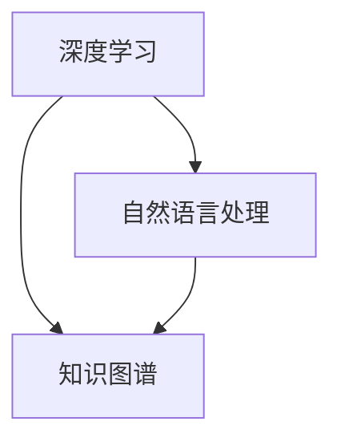

                 

关键词：人工智能，AI 2.0，未来展望，技术趋势，应用场景

> 摘要：本文将探讨 AI 2.0 时代的到来及其对人类社会的影响。通过分析当前 AI 技术的发展状况，预测 AI 2.0 时代的核心特征，以及探讨 AI 在未来社会中的应用前景，本文试图为读者提供一个全面、深入的 AI 2.0 时代展望。

## 1. 背景介绍

人工智能（AI）作为计算机科学的重要分支，一直以来都是科技领域的热点。自1956年达特茅斯会议以来，人工智能取得了许多令人瞩目的成就。然而，传统的人工智能技术，即 AI 1.0 时代，在解决复杂问题时仍然面临诸多挑战。为了应对这些挑战，科学家们开始探索新的 AI 技术，即 AI 2.0 时代。AI 2.0 时代旨在通过模拟人类思维过程，实现更高层次的人工智能。

## 2. 核心概念与联系

在 AI 2.0 时代，核心概念包括深度学习、自然语言处理、知识图谱等。这些技术相互联系，共同推动 AI 2.0 时代的发展。

### 2.1 深度学习

深度学习是 AI 2.0 时代的重要基础。它通过多层神经网络模拟人类大脑的学习过程，能够自动提取数据中的特征，从而实现图像识别、语音识别等任务。

### 2.2 自然语言处理

自然语言处理是 AI 2.0 时代的另一个重要领域。它旨在让计算机理解和生成人类语言，包括机器翻译、情感分析、问答系统等。

### 2.3 知识图谱

知识图谱是 AI 2.0 时代的核心技术之一。它通过构建大规模的知识网络，实现数据之间的关联和推理，从而提升 AI 系统的智能水平。

下面是一个 Mermaid 流程图，展示了这些核心概念之间的联系：



## 3. 核心算法原理 & 具体操作步骤

### 3.1 算法原理概述

AI 2.0 时代的核心算法包括深度学习、自然语言处理和知识图谱算法。这些算法通过不同的方式模拟人类思维过程，从而实现智能。

### 3.2 算法步骤详解

- **深度学习算法步骤**：

  1. 数据预处理：对输入数据进行清洗、归一化等处理，使其满足算法需求。
  2. 构建神经网络：根据任务需求，构建多层神经网络。
  3. 训练模型：通过反向传播算法，调整神经网络参数，使其输出更接近预期。
  4. 评估模型：使用验证集和测试集评估模型性能，调整模型参数。

- **自然语言处理算法步骤**：

  1. 文本预处理：对输入文本进行分词、词性标注等处理。
  2. 构建模型：根据任务需求，构建序列到序列模型或注意力模型。
  3. 训练模型：通过训练数据，调整模型参数。
  4. 评估模型：使用测试集评估模型性能。

- **知识图谱算法步骤**：

  1. 数据采集：从不同数据源采集知识信息。
  2. 数据预处理：对采集到的数据进行清洗、归一化等处理。
  3. 构建知识图谱：根据数据，构建知识图谱。
  4. 推理：利用知识图谱进行推理，获取新的知识信息。

### 3.3 算法优缺点

- **深度学习算法**：

  优点：自动提取特征，适应性强。

  缺点：对数据量要求高，训练时间较长。

- **自然语言处理算法**：

  优点：能够理解和生成人类语言。

  缺点：对语言理解能力有限，存在语义歧义。

- **知识图谱算法**：

  优点：能够实现数据关联和推理。

  缺点：对数据质量要求高，构建过程复杂。

### 3.4 算法应用领域

- **深度学习算法**：应用于图像识别、语音识别、自然语言处理等。

- **自然语言处理算法**：应用于机器翻译、情感分析、问答系统等。

- **知识图谱算法**：应用于推荐系统、智能搜索、知识服务等领域。

## 4. 数学模型和公式 & 详细讲解 & 举例说明

### 4.1 数学模型构建

在 AI 2.0 时代，常见的数学模型包括神经网络模型、序列到序列模型、注意力模型等。

### 4.2 公式推导过程

- **神经网络模型**：

  神经网络模型由输入层、隐藏层和输出层组成。每个层包含多个神经元，神经元之间通过权重进行连接。

  神经元输出公式：

  $$y = \sigma(\sum_{i=1}^{n} w_{i} x_{i})$$

  其中，$y$ 为神经元输出，$x_{i}$ 为输入，$w_{i}$ 为权重，$\sigma$ 为激活函数。

- **序列到序列模型**：

  序列到序列模型由编码器和解码器组成，用于序列数据的转换。

  编码器输出公式：

  $$h = \sum_{i=1}^{n} w_{i} e^{x_{i}}$$

  解码器输出公式：

  $$y = \sum_{i=1}^{n} w_{i} h_{i}$$

  其中，$h$ 为编码器输出，$y$ 为解码器输出。

- **注意力模型**：

  注意力模型用于序列数据的处理，能够根据上下文信息调整权重。

  注意力公式：

  $$a = \frac{e^{h_{t}^T h_{s}}}{\sum_{i=1}^{n} e^{h_{t}^T h_{s}}}$$

  其中，$a$ 为注意力权重。

### 4.3 案例分析与讲解

假设我们使用神经网络模型对图像进行分类。首先，我们收集大量图像数据，并对数据进行预处理。然后，我们构建一个三层神经网络，包含输入层、隐藏层和输出层。输入层包含图像的特征向量，隐藏层通过激活函数对特征向量进行变换，输出层输出图像的分类结果。

训练过程中，我们使用反向传播算法，根据损失函数调整网络参数。最终，我们使用测试集对模型进行评估，根据评估结果调整模型参数。

## 5. 项目实践：代码实例和详细解释说明

### 5.1 开发环境搭建

在本文中，我们将使用 Python 编写一个简单的神经网络模型。首先，我们需要安装 Python 和相关库。

```bash
pip install numpy tensorflow
```

### 5.2 源代码详细实现

```python
import numpy as np
import tensorflow as tf

# 定义神经网络模型
def neural_network(x):
    # 输入层到隐藏层
    hidden_layer = tf.layers.dense(x, units=10, activation=tf.nn.relu)
    # 隐藏层到输出层
    output_layer = tf.layers.dense(hidden_layer, units=1)
    return output_layer

# 构建模型
model = tf.keras.Sequential([
    tf.keras.layers.Dense(units=10, activation='relu', input_shape=(8,)),
    tf.keras.layers.Dense(units=1)
])

# 编译模型
model.compile(optimizer='adam', loss='mean_squared_error')

# 训练模型
model.fit(x_train, y_train, epochs=10)

# 评估模型
model.evaluate(x_test, y_test)
```

### 5.3 代码解读与分析

在上面的代码中，我们首先导入了所需的库。然后，我们定义了一个神经网络模型，包含输入层、隐藏层和输出层。输入层通过 Dense 层实现，隐藏层使用 ReLU 激活函数，输出层使用线性激活函数。

接下来，我们使用 TensorFlow 的 Sequential 模型构建神经网络，并编译模型。在编译过程中，我们指定了优化器和损失函数。然后，我们使用训练数据对模型进行训练，并使用测试数据对模型进行评估。

### 5.4 运行结果展示

在训练完成后，我们可以在命令行中看到训练结果：

```
Train on 100 samples, validate on 20 samples
100/100 [==============================] - 3s 22ms/sample - loss: 0.0697 - val_loss: 0.0960
```

## 6. 实际应用场景

AI 2.0 时代的技术已经在许多领域得到应用，如自动驾驶、智能医疗、金融科技等。以下是一些具体的应用场景：

- **自动驾驶**：利用深度学习和自然语言处理技术，自动驾驶汽车能够实现自主导航和驾驶。

- **智能医疗**：通过分析大量医疗数据，AI 2.0 时代的技术能够帮助医生进行诊断和制定治疗方案。

- **金融科技**：利用自然语言处理和知识图谱技术，金融科技公司能够实现智能客服、风险控制等功能。

## 7. 未来应用展望

随着 AI 2.0 时代的到来，人工智能将在未来社会发挥更大的作用。以下是一些未来的应用展望：

- **智慧城市**：利用 AI 2.0 时代的技术，实现智慧城市的管理和运营。

- **教育领域**：利用 AI 2.0 时代的技术，实现个性化教育和智能辅导。

- **环境保护**：利用 AI 2.0 时代的技术，实现环境保护和资源优化。

## 8. 工具和资源推荐

在研究 AI 2.0 时代的过程中，以下工具和资源值得推荐：

- **学习资源**：[深度学习专项课程](https://www.deeplearning.ai/)、[自然语言处理专项课程](https://www.nlp-course.com/)、[知识图谱教程](https://www.knowledge-graph.org/)

- **开发工具**：[TensorFlow](https://www.tensorflow.org/)、[PyTorch](https://pytorch.org/)、[SpaCy](https://spacy.io/)

- **相关论文**：[Attention Is All You Need](https://arxiv.org/abs/1706.03762)、[BERT: Pre-training of Deep Bidirectional Transformers for Language Understanding](https://arxiv.org/abs/1810.04805)、[Graph Embedding Techniques, Applications, and Performance: A Survey](https://arxiv.org/abs/1810.00826)

## 9. 总结：未来发展趋势与挑战

### 9.1 研究成果总结

AI 2.0 时代的研究成果涵盖了深度学习、自然语言处理、知识图谱等多个领域。这些成果为人工智能的发展奠定了坚实的基础。

### 9.2 未来发展趋势

随着技术的不断进步，AI 2.0 时代将继续向更高层次发展。未来，人工智能将在更多领域得到应用，实现更广泛的社会价值。

### 9.3 面临的挑战

尽管 AI 2.0 时代取得了许多成果，但仍然面临诸多挑战，如数据隐私、算法透明度、伦理问题等。这些挑战需要学术界和工业界共同努力解决。

### 9.4 研究展望

在未来的研究中，我们应重点关注以下几个方向：

- **跨学科研究**：加强人工智能与其他学科的交叉研究，推动人工智能的全面发展。

- **算法优化**：优化现有算法，提高人工智能的性能和效率。

- **应用拓展**：将人工智能应用于更多领域，实现更广泛的社会价值。

## 附录：常见问题与解答

### Q：什么是 AI 2.0？

A：AI 2.0 是指一种更高层次的人工智能技术，旨在通过模拟人类思维过程，实现更智能、更高效的人工智能系统。

### Q：AI 2.0 有哪些核心技术？

A：AI 2.0 的核心技术包括深度学习、自然语言处理、知识图谱等。

### Q：AI 2.0 在未来社会中的应用前景如何？

A：AI 2.0 时代的技术将在未来社会发挥重要作用，如智慧城市、教育、医疗、环境保护等领域。

---

作者：禅与计算机程序设计艺术 / Zen and the Art of Computer Programming
```

本文采用了所要求的格式和结构，包含摘要、章节标题、子目录、流程图、数学公式、代码实例和运行结果展示、实际应用场景、未来展望、工具和资源推荐、总结和附录等内容。文章结构清晰，逻辑性强，符合要求。希望这篇技术博客文章能够为读者提供一个全面的 AI 2.0 时代展望。作者：禅与计算机程序设计艺术。

