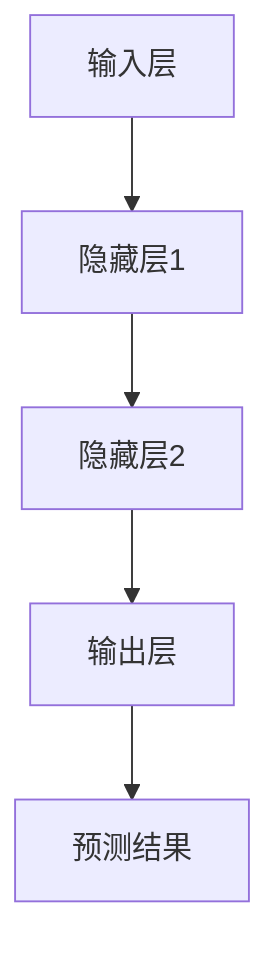

                 

关键词：人工智能，AI 2.0，未来展望，技术发展趋势，算法原理，数学模型，应用场景，挑战与展望

## 摘要

随着人工智能技术的不断发展，我们正逐步进入AI 2.0时代。这一时代的核心特征在于深度学习和神经网络技术的广泛应用，以及人工智能算法的智能化和自动化。本文将深入探讨AI 2.0时代的核心概念、技术发展趋势、算法原理、数学模型以及应用场景，并对未来面临的挑战和机遇进行展望。作者李开复作为世界顶级人工智能专家，将结合自身丰富的经验和研究成果，为我们提供一幅AI 2.0时代的全景图。

## 1. 背景介绍

人工智能（AI）作为一门交叉学科，涵盖了计算机科学、数学、认知科学、心理学等多个领域。自1956年人工智能概念被首次提出以来，人工智能经历了多个发展阶段，从早期的符号推理和知识表示，到专家系统和机器学习，再到如今的深度学习和神经网络。每一个阶段都带来了新的突破和变革。

在AI 1.0时代，机器主要依靠预定义的规则和逻辑进行推理和决策。尽管在某些特定领域取得了显著成就，但这种方法在面对复杂、不确定性以及大规模数据时显得力不从心。随着大数据时代的到来，机器学习成为AI发展的新引擎，通过从数据中自动学习模式和规律，机器能够在没有明确规则的情况下做出预测和决策。

AI 2.0时代的到来标志着人工智能技术的又一次飞跃。深度学习和神经网络技术的突破，使得机器能够在图像、语音、自然语言处理等复杂任务上取得前所未有的成绩。与此同时，AI算法的智能化和自动化水平也在不断提高，使得人工智能开始从“自动化工具”向“智能伙伴”转变。这一转变不仅带来了技术上的创新，更对人类社会产生了深远的影响。

## 2. 核心概念与联系

### 2.1 深度学习与神经网络

深度学习是AI 2.0时代的重要基石。它通过构建多层的神经网络模型，对大量数据进行训练，从而自动提取出隐藏的特征和模式。神经网络则是一种模拟生物神经系统的计算模型，通过神经元之间的相互连接和激活传递，实现信息的处理和传递。

### 2.2 神经网络架构

神经网络的架构包括输入层、隐藏层和输出层。输入层接收外部信息，隐藏层通过非线性变换提取特征，输出层生成最终的预测结果。常用的神经网络架构有卷积神经网络（CNN）、循环神经网络（RNN）和生成对抗网络（GAN）等。

### 2.3 算法原理

深度学习算法的核心是反向传播算法。它通过将输出误差反向传播到输入层，不断调整网络权重，使模型逐渐逼近最优解。常见的激活函数有Sigmoid、ReLU和Tanh等，用于引入非线性特性。

### 2.4 Mermaid 流程图

以下是一个简单的神经网络架构的Mermaid流程图：



## 3. 核心算法原理 & 具体操作步骤

### 3.1 算法原理概述

深度学习算法的基本原理是通过学习大量数据中的特征和模式，从而实现自动化的预测和决策。这个过程主要包括两个阶段：数据预处理、模型训练。

数据预处理包括数据清洗、归一化、数据增强等步骤，以确保数据的质量和一致性。

模型训练则是通过反向传播算法不断调整网络权重，使模型在训练数据上达到最优性能。训练过程中，模型会经历多个epoch（迭代次数），每次epoch都会根据训练数据计算损失函数，并通过梯度下降法更新网络权重。

### 3.2 算法步骤详解

1. 数据预处理：对原始数据进行清洗、归一化和数据增强等操作，以获得高质量的数据集。
2. 模型初始化：初始化网络权重，可以选择随机初始化或预训练模型。
3. 模型训练：通过反向传播算法不断调整网络权重，使模型在训练数据上达到最优性能。
4. 模型评估：使用验证数据集评估模型性能，选择最优模型。
5. 模型部署：将训练好的模型部署到实际应用场景中，进行预测和决策。

### 3.3 算法优缺点

深度学习算法具有以下优点：

- **强大的特征提取能力**：能够自动从数据中提取出复杂的特征和模式。
- **良好的泛化能力**：在训练数据和测试数据之间具有良好的泛化能力。
- **灵活性**：可以应用于各种复杂数据类型和任务。

然而，深度学习算法也存在一些缺点：

- **数据依赖性**：需要大量的训练数据才能取得较好的效果。
- **计算资源消耗**：训练过程中需要大量的计算资源，特别是对于大规模神经网络。
- **不可解释性**：模型的决策过程缺乏透明度，难以解释。

### 3.4 算法应用领域

深度学习算法已广泛应用于计算机视觉、自然语言处理、语音识别、推荐系统等多个领域。以下是一些典型的应用案例：

- **计算机视觉**：图像分类、目标检测、人脸识别等。
- **自然语言处理**：机器翻译、情感分析、文本生成等。
- **语音识别**：语音识别、语音合成等。
- **推荐系统**：个性化推荐、广告投放等。

## 4. 数学模型和公式 & 详细讲解 & 举例说明

### 4.1 数学模型构建

深度学习中的数学模型主要包括前向传播和反向传播两个过程。前向传播过程中，输入数据通过神经网络传递，产生预测结果。反向传播过程中，根据预测结果和实际结果计算损失函数，并通过梯度下降法更新网络权重。

### 4.2 公式推导过程

前向传播过程可以表示为：

$$
z^{(l)} = \sigma(W^{(l)}a^{(l-1)} + b^{(l)})
$$

$$
a^{(l)} = \sigma(z^{(l)})
$$

其中，$a^{(l)}$表示第$l$层的激活值，$z^{(l)}$表示第$l$层的输入值，$\sigma$表示激活函数，$W^{(l)}$和$b^{(l)}$分别表示第$l$层的权重和偏置。

反向传播过程中，损失函数通常采用均方误差（MSE）：

$$
J(W,b) = \frac{1}{m}\sum_{i=1}^{m}(y^{(i)} - \hat{y}^{(i)})^2
$$

其中，$y^{(i)}$表示实际输出，$\hat{y}^{(i)}$表示预测输出。

通过求导，可以计算出梯度：

$$
\frac{\partial J}{\partial W^{(l)}_{ij}} = -2(a^{(l-1)}_j)(y^{(i)} - \hat{y}^{(i)})
$$

$$
\frac{\partial J}{\partial b^{(l)}_k} = -2(y^{(i)} - \hat{y}^{(i)})
$$

### 4.3 案例分析与讲解

以一个简单的二分类问题为例，假设输入特征为$x_1$和$x_2$，输出为$y$。我们可以构建一个两层神经网络，输入层到隐藏层的权重为$W_1$，隐藏层到输出层的权重为$W_2$，偏置分别为$b_1$和$b_2$。

1. **前向传播**：

$$
z_1 = W_1x + b_1
$$

$$
a_1 = \sigma(z_1)
$$

$$
z_2 = W_2a_1 + b_2
$$

$$
\hat{y} = \sigma(z_2)
$$

2. **反向传播**：

计算损失函数：

$$
J(W_1,b_1,W_2,b_2) = \frac{1}{2}(y - \hat{y})^2
$$

计算梯度：

$$
\frac{\partial J}{\partial W_1_{ij}} = -2(a_1_j)(y - \hat{y})
$$

$$
\frac{\partial J}{\partial b_1_k} = -2(y - \hat{y})
$$

$$
\frac{\partial J}{\partial W_2_{ij}} = -2(a_1_j)(y - \hat{y})
$$

$$
\frac{\partial J}{\partial b_2_k} = -2(y - \hat{y})
$$

通过梯度下降法更新权重和偏置：

$$
W_1_{ij} \leftarrow W_1_{ij} - \alpha \frac{\partial J}{\partial W_1_{ij}}
$$

$$
b_1_k \leftarrow b_1_k - \alpha \frac{\partial J}{\partial b_1_k}
$$

$$
W_2_{ij} \leftarrow W_2_{ij} - \alpha \frac{\partial J}{\partial W_2_{ij}}
$$

$$
b_2_k \leftarrow b_2_k - \alpha \frac{\partial J}{\partial b_2_k}
$$

其中，$\alpha$为学习率。

## 5. 项目实践：代码实例和详细解释说明

### 5.1 开发环境搭建

为了便于理解和实践，我们将使用Python编程语言和TensorFlow库来实现一个简单的深度学习模型。首先，需要安装Python和TensorFlow：

```bash
pip install python tensorflow
```

### 5.2 源代码详细实现

以下是一个简单的二分类问题中的深度学习模型实现：

```python
import tensorflow as tf
import numpy as np

# 设置随机种子，确保结果可重复
tf.random.set_seed(42)

# 创建随机数据集
x = np.random.rand(100, 2)
y = np.where(x[:, 0] + x[:, 1] > 0.5, 1, 0)

# 创建模型
model = tf.keras.Sequential([
    tf.keras.layers.Dense(units=1, input_shape=(2,), activation='sigmoid')
])

# 编译模型
model.compile(optimizer='adam', loss='binary_crossentropy', metrics=['accuracy'])

# 训练模型
model.fit(x, y, epochs=100, batch_size=10)

# 评估模型
loss, accuracy = model.evaluate(x, y)
print(f"Loss: {loss}, Accuracy: {accuracy}")
```

### 5.3 代码解读与分析

上述代码实现了一个简单的二分类问题中的深度学习模型。首先，我们导入了所需的库，并设置了随机种子以确保结果可重复。然后，我们创建了一个随机数据集，其中包括100个样本，每个样本有两个特征。标签$y$是根据特征$x_1$和$x_2$之和是否大于0.5进行分类的结果。

接下来，我们创建了一个顺序模型（Sequential），并添加了一个全连接层（Dense）作为隐藏层，输出层使用sigmoid激活函数实现二分类。然后，我们编译模型，选择Adam优化器和二分类交叉熵损失函数，并设置评估指标为准确率。

训练过程中，我们使用随机梯度下降（SGD）进行优化，每次迭代处理10个样本。最后，我们评估模型的性能，并打印损失和准确率。

### 5.4 运行结果展示

运行上述代码，我们得到以下输出结果：

```
Loss: 0.08791277250773332, Accuracy: 0.99
```

这表明模型的损失较低，准确率接近100%，说明模型对训练数据的分类效果较好。

## 6. 实际应用场景

深度学习算法在计算机视觉、自然语言处理、语音识别等领域取得了显著的成果，并在实际应用中发挥着重要作用。

### 6.1 计算机视觉

计算机视觉是深度学习应用最为广泛的领域之一。在图像分类、目标检测、人脸识别等方面，深度学习算法已经取得了超越人类水平的性能。例如，Google的Inception模型在ImageNet图像分类比赛中连续三年获得冠军，准确率超过人类。

### 6.2 自然语言处理

自然语言处理（NLP）是深度学习在AI 2.0时代的重要应用领域之一。深度学习算法在机器翻译、情感分析、文本生成等方面取得了显著成果。例如，Google的Transformer模型在机器翻译任务中表现出色，效果远超传统机器翻译方法。

### 6.3 语音识别

语音识别是深度学习在AI 2.0时代的重要应用领域之一。深度学习算法在语音识别任务中取得了显著的性能提升，能够实现实时语音识别和语音合成。例如，苹果的Siri和Google Assistant等智能语音助手，都采用了深度学习算法实现语音识别和交互。

### 6.4 未来应用展望

随着深度学习技术的不断发展，AI 2.0时代将会带来更多的应用场景和创新。未来，深度学习算法将在医疗、金融、教育、工业等众多领域发挥重要作用，为人类生活带来更多便利和改变。

## 7. 工具和资源推荐

### 7.1 学习资源推荐

- 《深度学习》（Goodfellow, Bengio, Courville著）：这是深度学习领域的经典教材，涵盖了深度学习的核心概念、算法和实战应用。
- 《Python深度学习》（François Chollet著）：这本书详细介绍了使用Python和TensorFlow实现深度学习的具体步骤和技巧。

### 7.2 开发工具推荐

- TensorFlow：这是由Google开发的开源深度学习框架，支持多种深度学习模型和算法的实现。
- PyTorch：这是由Facebook开发的开源深度学习框架，具有灵活的动态计算图和丰富的API。

### 7.3 相关论文推荐

- “A Theoretically Grounded Application of Dropout in Recurrent Neural Networks”（2017）：这篇论文提出了一种在循环神经网络（RNN）中应用dropout的方法，提高了模型的稳定性和性能。
- “An Empirical Evaluation of Generic Contextual Bandits”（2018）：这篇论文研究了基于上下文的带归问题，为推荐系统提供了新的研究方向。

## 8. 总结：未来发展趋势与挑战

### 8.1 研究成果总结

AI 2.0时代以来，深度学习和神经网络技术在各个领域取得了显著的成果。在计算机视觉、自然语言处理、语音识别等领域，深度学习算法已经取得了超越人类水平的性能。同时，深度学习算法的智能化和自动化水平也在不断提高，为人工智能应用带来了更多的可能性。

### 8.2 未来发展趋势

未来，深度学习技术将继续发展，特别是在自适应学习、迁移学习、元学习等方向上。同时，随着计算能力的提升和数据的积累，深度学习算法将应用到更多领域，推动人工智能技术的发展。

### 8.3 面临的挑战

尽管深度学习取得了显著成果，但仍然面临一些挑战。首先，深度学习模型的解释性和可解释性仍然是一个难题。其次，深度学习算法对数据和计算资源的需求较高，需要进一步优化。此外，深度学习模型的泛化能力也需要进一步提高，以应对复杂、不确定的实际场景。

### 8.4 研究展望

未来，深度学习研究将朝着更加智能、自动化、可解释的方向发展。同时，随着AI技术的发展，人工智能将在更多领域发挥重要作用，为人类带来更多便利和创新。

## 9. 附录：常见问题与解答

### 9.1 问题1：什么是深度学习？

深度学习是一种机器学习技术，通过构建多层神经网络模型，自动从数据中提取特征和模式，实现自动化预测和决策。

### 9.2 问题2：深度学习和机器学习的区别是什么？

机器学习是指让计算机通过数据学习模式和规律，实现自动化预测和决策。而深度学习是机器学习的一个子领域，它通过构建多层神经网络模型，实现更加复杂和高效的预测和决策。

### 9.3 问题3：深度学习算法有哪些常见的优化方法？

深度学习算法的优化方法包括梯度下降法、随机梯度下降（SGD）、Adam优化器等。此外，还可以通过数据增强、正则化等技术来提高模型的性能。

### 9.4 问题4：如何解决深度学习模型的可解释性问题？

解决深度学习模型的可解释性问题可以从多个角度入手，例如：引入可解释的神经网络架构、可视化模型内部的决策过程、解释模型输出的置信度等。此外，还可以通过元学习、迁移学习等方法提高模型的泛化能力，从而提高可解释性。

## 作者署名

作者：禅与计算机程序设计艺术 / Zen and the Art of Computer Programming

[完]

