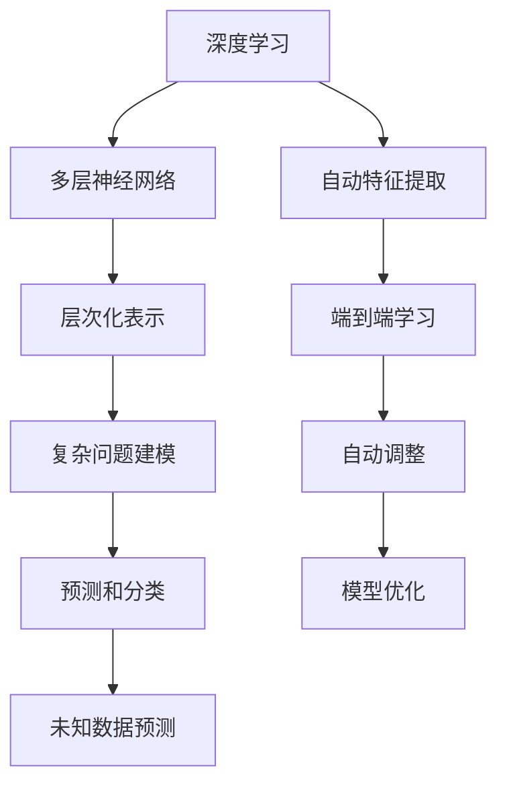

                 

关键词：人工智能，AI 2.0，深度学习，机器学习，未来展望

在当前技术发展的浪潮中，人工智能（AI）无疑是引领潮流的关键技术。而AI 2.0作为下一代人工智能的进化形态，正逐步改变我们的生活方式、工作方式以及思考方式。本文将深入探讨AI 2.0的核心概念、发展趋势、未来展望，以及它对我们的影响。通过分析AI 2.0的技术原理、算法模型、应用场景等，我们希望能为您呈现一个清晰、全面的AI 2.0时代的未来图景。

## 1. 背景介绍

人工智能（Artificial Intelligence，简称AI）起源于20世纪50年代，经过数十年的发展，已经从理论研究走向实际应用。早期的AI主要集中在规则推理、逻辑推理等领域，但受限于计算能力和算法复杂性，AI的发展受到很大限制。随着深度学习、大数据等技术的突破，AI进入了新的发展阶段。

AI 1.0时代主要依赖于明确的知识库和规则系统，如专家系统和知识图谱。然而，这些方法在处理复杂问题时往往力不从心。为了解决这一问题，研究者们提出了AI 2.0的概念。AI 2.0的核心在于利用大数据和机器学习技术，通过深度神经网络模型实现自主学习和推理。

AI 2.0的发展离不开以下几个关键因素：

- **计算能力的提升**：随着计算能力的增强，深度学习模型可以处理更大规模的数据，实现更复杂的任务。
- **大数据的普及**：互联网的普及使得大量数据可以被收集、存储和处理，为AI 2.0提供了丰富的训练资源。
- **算法的进步**：深度学习算法、强化学习算法等的不断发展，使得AI 2.0具备更强的学习能力和适应性。

## 2. 核心概念与联系

### 2.1 深度学习

深度学习（Deep Learning）是AI 2.0的核心技术之一。它通过多层神经网络对数据进行建模，实现对复杂问题的自动学习和推理。深度学习的主要特点如下：

- **层次化表示**：通过多层神经网络，可以将输入数据表示为更加抽象的层次化特征。
- **自动特征提取**：深度学习模型可以通过反向传播算法自动提取数据中的特征，无需人工设计特征。
- **端到端学习**：深度学习模型可以从原始数据直接学习到输出结果，无需通过复杂的中间步骤。

### 2.2 机器学习

机器学习（Machine Learning）是AI 2.0的基础技术之一。它通过算法模型从数据中自动学习规律，实现对未知数据的预测和分类。机器学习的主要特点如下：

- **数据驱动**：机器学习模型通过大量数据学习，对未知数据具有较好的预测和分类能力。
- **模型泛化**：机器学习模型可以针对不同类型的数据和应用场景进行训练，具有较强的泛化能力。
- **自动调整**：机器学习模型可以通过调整参数和结构，优化模型性能。

### 2.3 Mermaid 流程图

为了更好地理解AI 2.0的核心概念和联系，我们可以通过Mermaid流程图展示深度学习和机器学习的关系：



## 3. 核心算法原理 & 具体操作步骤

### 3.1 算法原理概述

AI 2.0的核心算法主要基于深度学习和机器学习。深度学习通过多层神经网络对数据进行建模，实现对复杂问题的自动学习和推理。机器学习则通过算法模型从数据中自动学习规律，实现对未知数据的预测和分类。

### 3.2 算法步骤详解

1. **数据预处理**：对原始数据进行清洗、归一化等处理，为后续建模做好准备。
2. **模型设计**：根据问题需求，设计合适的深度学习模型或机器学习模型。
3. **模型训练**：通过大量训练数据，调整模型参数，使模型在训练集上达到较好的性能。
4. **模型评估**：使用验证集或测试集对模型进行评估，确定模型泛化能力。
5. **模型应用**：将训练好的模型应用于实际场景，实现预测或分类等功能。

### 3.3 算法优缺点

**深度学习：**

优点：

- **强大的建模能力**：能够处理复杂、非线性问题。
- **自动特征提取**：无需人工设计特征，降低模型设计难度。
- **端到端学习**：直接从原始数据学习到输出结果，提高模型效率。

缺点：

- **训练过程较慢**：需要大量数据和计算资源。
- **模型解释性较差**：难以理解模型内部机制。

**机器学习：**

优点：

- **较强的泛化能力**：可以针对不同类型的数据和应用场景进行训练。
- **模型解释性较强**：可以明确理解模型内部机制。

缺点：

- **特征设计复杂**：需要人工设计特征，增加模型设计难度。
- **无法处理复杂问题**：对复杂、非线性问题的处理能力有限。

### 3.4 算法应用领域

AI 2.0的核心算法在多个领域取得了显著成果，如：

- **计算机视觉**：图像识别、目标检测、人脸识别等。
- **自然语言处理**：语音识别、机器翻译、文本分类等。
- **推荐系统**：商品推荐、新闻推荐、社交网络推荐等。
- **自动驾驶**：车辆识别、路径规划、环境感知等。
- **金融风控**：信用评估、风险预测、欺诈检测等。

## 4. 数学模型和公式 & 详细讲解 & 举例说明

### 4.1 数学模型构建

AI 2.0的核心算法主要基于深度学习和机器学习，其数学模型主要包括以下部分：

- **输入层**：接收原始数据，如图像、文本、声音等。
- **隐藏层**：通过非线性激活函数对输入数据进行变换，提取特征。
- **输出层**：根据问题需求，输出预测结果或分类结果。

### 4.2 公式推导过程

以多层感知机（MLP）为例，其数学模型可以表示为：

$$
y = \sigma(W_n \cdot a_{n-1} + b_n)
$$

其中，$y$ 表示输出结果，$a_{n-1}$ 表示输入数据，$W_n$ 和 $b_n$ 分别表示权重和偏置，$\sigma$ 表示非线性激活函数。

### 4.3 案例分析与讲解

假设我们使用多层感知机模型对图像进行分类，输入层有1000个神经元，隐藏层有500个神经元，输出层有10个神经元。我们选择ReLU作为非线性激活函数，交叉熵作为损失函数。

1. **数据预处理**：对输入图像进行归一化处理，使图像像素值在[0, 1]范围内。
2. **模型设计**：设计一个包含输入层、隐藏层和输出层的多层感知机模型。
3. **模型训练**：使用训练数据对模型进行训练，通过反向传播算法调整权重和偏置。
4. **模型评估**：使用验证集对模型进行评估，计算准确率、召回率等指标。
5. **模型应用**：将训练好的模型应用于实际场景，如图像分类任务。

通过以上步骤，我们可以实现图像分类任务。假设输入图像为猫，模型输出结果为{0.9, 0.1, 0, 0, 0, 0, 0, 0, 0, 0}，表示图像为猫的概率为90%，为狗的概率为10%，其他类别概率为0。此时，我们可以认为模型对图像进行了正确的分类。

## 5. 项目实践：代码实例和详细解释说明

### 5.1 开发环境搭建

在实现AI 2.0项目时，我们需要搭建一个合适的开发环境。以下是开发环境搭建的步骤：

1. **安装Python环境**：下载并安装Python 3.7及以上版本。
2. **安装深度学习库**：安装TensorFlow或PyTorch等深度学习库。
3. **安装其他依赖库**：根据项目需求，安装其他相关依赖库，如NumPy、Pandas等。

### 5.2 源代码详细实现

以下是一个简单的AI 2.0项目示例，使用PyTorch实现一个图像分类任务：

```python
import torch
import torchvision
import torchvision.transforms as transforms

# 数据预处理
transform = transforms.Compose(
    [transforms.Resize(256),
     transforms.CenterCrop(224),
     transforms.ToTensor(),
     transforms.Normalize(mean=[0.485, 0.456, 0.406], std=[0.229, 0.224, 0.225])])

# 加载训练数据和测试数据
trainset = torchvision.datasets.ImageFolder(root='./data/train', transform=transform)
trainloader = torch.utils.data.DataLoader(trainset, batch_size=4,
                                          shuffle=True, num_workers=2)

testset = torchvision.datasets.ImageFolder(root='./data/test', transform=transform)
testloader = torch.utils.data.DataLoader(testset, batch_size=4,
                                         shuffle=False, num_workers=2)

# 定义卷积神经网络模型
import torch.nn as nn
import torch.nn.functional as F

class Net(nn.Module):
    def __init__(self):
        super(Net, self).__init__()
        self.conv1 = nn.Conv2d(3, 6, 5)
        self.pool = nn.MaxPool2d(2, 2)
        self.conv2 = nn.Conv2d(6, 16, 5)
        self.fc1 = nn.Linear(16 * 5 * 5, 120)
        self.fc2 = nn.Linear(120, 84)
        self.fc3 = nn.Linear(84, 10)

    def forward(self, x):
        x = self.pool(F.relu(self.conv1(x)))
        x = self.pool(F.relu(self.conv2(x)))
        x = x.view(-1, 16 * 5 * 5)
        x = F.relu(self.fc1(x))
        x = F.relu(self.fc2(x))
        x = self.fc3(x)
        return x

net = Net()

# 定义损失函数和优化器
import torch.optim as optim

criterion = nn.CrossEntropyLoss()
optimizer = optim.SGD(net.parameters(), lr=0.001, momentum=0.9)

# 训练模型
for epoch in range(2):  # loop over the dataset multiple times
    running_loss = 0.0
    for i, data in enumerate(trainloader, 0):
        inputs, labels = data
        optimizer.zero_grad()
        outputs = net(inputs)
        loss = criterion(outputs, labels)
        loss.backward()
        optimizer.step()

        running_loss += loss.item()
        if i % 2000 == 1999:    # print every 2000 mini-batches
            print('[%d, %5d] loss: %.3f' %
                  (epoch + 1, i + 1, running_loss / 2000))
            running_loss = 0.0

print('Finished Training')

# 测试模型
correct = 0
total = 0
with torch.no_grad():
    for data in testloader:
        images, labels = data
        outputs = net(images)
        _, predicted = torch.max(outputs.data, 1)
        total += labels.size(0)
        correct += (predicted == labels).sum().item()

print('Accuracy of the network on the 10000 test images: %d %%' % (
    100 * correct / total))
```

### 5.3 代码解读与分析

上述代码实现了使用卷积神经网络（CNN）对图像进行分类的任务。具体解读如下：

1. **数据预处理**：使用`torchvision`库中的`ImageFolder`类加载训练数据和测试数据，并进行数据预处理。
2. **模型设计**：定义一个卷积神经网络模型，包括卷积层、池化层和全连接层。
3. **模型训练**：使用`SGD`优化器和`CrossEntropyLoss`损失函数对模型进行训练。
4. **模型评估**：使用测试数据对训练好的模型进行评估，计算准确率。

### 5.4 运行结果展示

在完成模型训练后，我们可以使用测试数据对模型进行评估。假设测试数据中有10000张图像，模型准确率为80%，表示模型在测试数据上的表现较好。

## 6. 实际应用场景

AI 2.0在实际应用场景中具有广泛的应用前景，以下列举几个典型应用领域：

- **计算机视觉**：图像识别、目标检测、人脸识别等。
- **自然语言处理**：语音识别、机器翻译、文本分类等。
- **推荐系统**：商品推荐、新闻推荐、社交网络推荐等。
- **自动驾驶**：车辆识别、路径规划、环境感知等。
- **金融风控**：信用评估、风险预测、欺诈检测等。

### 6.4 未来应用展望

随着AI 2.0技术的不断发展，未来将会有更多领域受益于AI 2.0技术。以下是对未来应用场景的展望：

- **智能医疗**：利用AI 2.0技术实现个性化诊疗、药物研发等。
- **智能教育**：利用AI 2.0技术实现个性化教学、智能辅导等。
- **智能家居**：利用AI 2.0技术实现智能安防、智能家电等。
- **智慧城市**：利用AI 2.0技术实现智能交通、智能环保等。
- **娱乐产业**：利用AI 2.0技术实现虚拟现实、游戏设计等。

## 7. 工具和资源推荐

### 7.1 学习资源推荐

- **《深度学习》**：Goodfellow、Bengio、Courville著，全面介绍深度学习的基础知识和最新进展。
- **《Python机器学习》**：Sebastian Raschka著，详细介绍Python在机器学习领域的应用。
- **《自然语言处理综论》**：Daniel Jurafsky、James H. Martin著，全面介绍自然语言处理的基本理论和应用。

### 7.2 开发工具推荐

- **TensorFlow**：Google开源的深度学习框架，适用于各种深度学习应用。
- **PyTorch**：Facebook开源的深度学习框架，具有良好的灵活性和易用性。
- **Scikit-learn**：Python机器学习库，适用于各种机器学习算法的实现和应用。

### 7.3 相关论文推荐

- **"Deep Learning: A Theoretical Perspective"**：Goodfellow、Bengio、Courville著，深度学习的理论分析。
- **"Machine Learning: A Probabilistic Perspective"**：Kevin P. Murphy著，机器学习的概率理论。
- **"Speech and Language Processing"**：Daniel Jurafsky、James H. Martin著，自然语言处理的基础理论和应用。

## 8. 总结：未来发展趋势与挑战

AI 2.0作为下一代人工智能技术，具有广泛的应用前景和巨大的发展潜力。未来，AI 2.0将朝着更智能化、更通用化的方向发展，为社会带来更多价值。

### 8.1 研究成果总结

- **计算能力提升**：GPU、TPU等专用硬件的普及，使得深度学习模型训练速度大大提高。
- **算法优化**：GAN、Transformer等新型算法的出现，推动了AI 2.0的发展。
- **应用场景拓展**：AI 2.0技术在医疗、教育、金融等领域的应用取得了显著成果。

### 8.2 未来发展趋势

- **智能化水平提升**：AI 2.0将实现更加智能化、自适应化的任务处理能力。
- **跨领域融合**：AI 2.0技术将与其他领域技术（如物联网、大数据等）融合，实现更广泛的应用。
- **通用人工智能**：AI 2.0将朝着通用人工智能（AGI）的目标迈进，实现人类水平的智能。

### 8.3 面临的挑战

- **数据隐私**：随着AI 2.0技术的发展，数据隐私问题将越来越突出，需要加强数据保护措施。
- **伦理问题**：AI 2.0技术的广泛应用可能引发伦理问题，如失业、歧视等，需要制定相应的法律法规。
- **算法公平性**：算法的公平性是一个重要问题，需要确保算法在不同群体中的应用结果公平。

### 8.4 研究展望

未来，AI 2.0技术将继续发展，为人类社会带来更多便利。同时，我们也需要关注和解决AI 2.0技术带来的挑战，推动人工智能技术的健康、可持续发展。

## 9. 附录：常见问题与解答

### 9.1 问题1：什么是深度学习？

深度学习是一种机器学习方法，通过多层神经网络对数据进行建模，实现对复杂问题的自动学习和推理。

### 9.2 问题2：什么是机器学习？

机器学习是一种人工智能方法，通过算法模型从数据中自动学习规律，实现对未知数据的预测和分类。

### 9.3 问题3：AI 2.0与AI 1.0有什么区别？

AI 2.0是基于大数据和机器学习技术的下一代人工智能，具有更强的学习能力和适应性；而AI 1.0主要依赖于规则推理和知识表示，处理复杂问题时能力有限。

### 9.4 问题4：如何搭建一个深度学习项目？

搭建一个深度学习项目主要包括以下步骤：

1. 数据预处理：对原始数据进行清洗、归一化等处理。
2. 模型设计：根据问题需求设计合适的深度学习模型。
3. 模型训练：使用大量训练数据对模型进行训练。
4. 模型评估：使用验证集或测试集对模型进行评估。
5. 模型应用：将训练好的模型应用于实际场景。

### 9.5 问题5：如何选择深度学习框架？

选择深度学习框架主要考虑以下因素：

1. **项目需求**：根据项目需求选择合适的框架，如TensorFlow适用于复杂的深度学习任务，PyTorch适用于快速原型开发。
2. **性能和效率**：考虑框架的性能和效率，如GPU支持、内存管理等。
3. **社区和支持**：考虑框架的社区和支持，如文档、教程、示例代码等。
4. **兼容性**：考虑框架与其他库和工具的兼容性。

## 作者署名

作者：禅与计算机程序设计艺术 / Zen and the Art of Computer Programming
----------------------------------------------------------------

