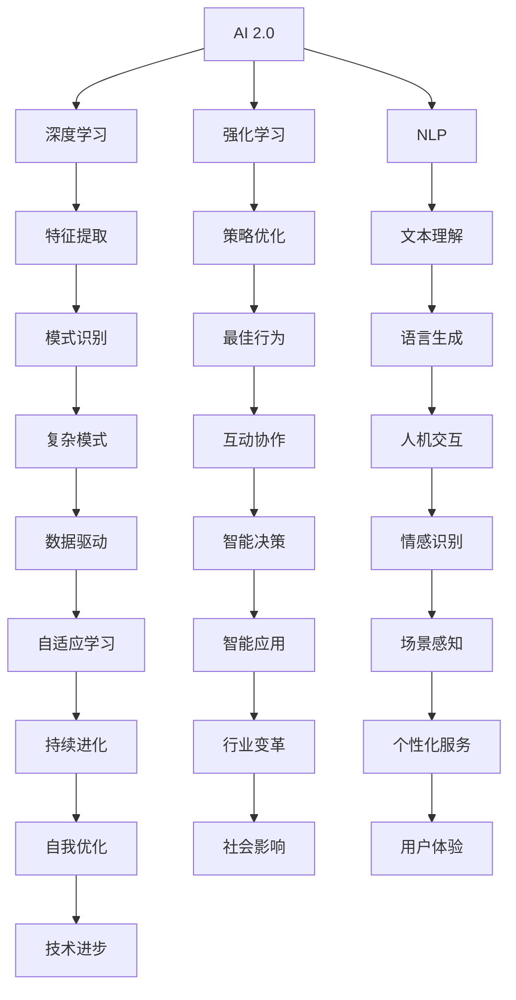

                 

关键词：人工智能，AI 2.0，机遇，未来，技术，发展，挑战

> 摘要：本文深入探讨AI 2.0时代的机遇，解析其背后的技术原理、应用场景、未来发展趋势以及面临的挑战，旨在为读者提供全面而清晰的视野，助力在AI领域取得突破。

## 1. 背景介绍

人工智能（AI）作为计算机科学的一个重要分支，自诞生以来，经历了多个发展阶段。从最初的规则系统、知识表示，到基于统计学习的机器学习，再到深度学习的崛起，每一次技术进步都为AI的发展注入新的活力。然而，随着技术的不断演进，传统的AI已无法满足当今复杂世界的需求。正是在这样的背景下，AI 2.0的概念应运而生。

AI 2.0，也称为下一代人工智能，是相对于第一代人工智能（即传统AI）的称谓。它不仅仅是技术上的升级，更是思维方式的变革。AI 2.0强调的是人工智能的智能化和自适应能力，旨在实现与人类更紧密的互动和协作。在这一时代，人工智能将更加灵活、智能，能够自主学习和进化，从而在各个领域发挥更大的作用。

本文将围绕AI 2.0时代展开讨论，探讨其核心概念、技术原理、应用场景、未来发展趋势和面临的挑战，旨在为读者提供一个全面而深入的视角。

## 2. 核心概念与联系

### 2.1. AI 1.0与AI 2.0的区别

AI 1.0主要依赖于预定义的规则和固定的算法，适用于结构化数据处理的场景，如专家系统、自然语言处理等。而AI 2.0则更加注重智能化和自适应能力，通过深度学习和强化学习等技术，能够从大量未标记的数据中学习，并不断优化自身的性能。

### 2.2. 关键技术

#### 2.2.1. 深度学习

深度学习是AI 2.0的核心技术之一。它通过多层神经网络对数据进行处理，能够自动提取特征，实现复杂模式识别和预测。与传统的机器学习相比，深度学习具有更强的泛化能力和更广泛的应用范围。

#### 2.2.2. 强化学习

强化学习是另一种重要的AI技术，通过奖励机制引导智能体在环境中学习，从而实现最佳行为策略的探索。与监督学习和无监督学习不同，强化学习强调的是智能体与环境之间的互动。

#### 2.2.3. 自然语言处理

自然语言处理（NLP）是AI 2.0在语言领域的应用，通过深度学习等技术实现文本的自动理解、生成和交互。NLP技术的发展，使得AI能够更好地理解和满足人类的需求。

### 2.3. Mermaid流程图

以下是一个简单的Mermaid流程图，展示了AI 2.0的关键技术及其相互关系：



## 3. 核心算法原理 & 具体操作步骤

### 3.1. 算法原理概述

AI 2.0的核心算法包括深度学习、强化学习和自然语言处理。这些算法通过不同的方式实现智能：

#### 3.1.1. 深度学习

深度学习通过多层神经网络对数据进行处理，包括输入层、隐藏层和输出层。输入层接收外部数据，通过隐藏层进行特征提取和模式识别，最终在输出层生成预测结果。

#### 3.1.2. 强化学习

强化学习通过奖励机制引导智能体在环境中学习。智能体根据当前状态选择动作，并接收奖励或惩罚，从而在长期内实现最佳行为策略。

#### 3.1.3. 自然语言处理

自然语言处理通过深度学习等技术，实现文本的自动理解、生成和交互。NLP包括词向量表示、语言模型、文本分类、情感分析等子任务。

### 3.2. 算法步骤详解

#### 3.2.1. 深度学习

1. 数据预处理：对输入数据进行归一化、去噪等处理。
2. 建立神经网络模型：选择合适的网络结构，如卷积神经网络（CNN）、循环神经网络（RNN）等。
3. 训练模型：通过反向传播算法，不断调整网络参数，使模型能够准确预测。
4. 评估模型：使用验证集和测试集评估模型的性能，并进行调优。

#### 3.2.2. 强化学习

1. 初始化智能体：设置初始状态和动作空间。
2. 执行动作：智能体根据当前状态选择动作。
3. 接收奖励：执行动作后，根据环境反馈接收奖励或惩罚。
4. 更新策略：使用奖励信息，通过策略优化算法（如Q-learning、SARSA）更新智能体的行为策略。
5. 重复执行：重复上述步骤，直到达到目标或满足终止条件。

#### 3.2.3. 自然语言处理

1. 词向量表示：将文本转换为向量表示，如Word2Vec、GloVe等。
2. 语言模型：构建基于统计的方法，如n-gram模型、神经网络语言模型等。
3. 文本分类：使用分类算法（如朴素贝叶斯、支持向量机等）对文本进行分类。
4. 情感分析：通过深度学习等技术，对文本的情感倾向进行判断。

### 3.3. 算法优缺点

#### 3.3.1. 深度学习

优点：强大的特征提取能力、广泛的适用性。

缺点：对数据和计算资源的需求较大、难以解释。

#### 3.3.2. 强化学习

优点：能够通过互动学习，实现复杂任务。

缺点：学习过程可能较慢、对环境依赖较大。

#### 3.3.3. 自然语言处理

优点：能够处理自然语言，实现人机交互。

缺点：对语言的理解仍有局限、数据依赖性较高。

### 3.4. 算法应用领域

#### 3.4.1. 深度学习

应用领域：图像识别、语音识别、自然语言处理、推荐系统等。

#### 3.4.2. 强化学习

应用领域：游戏AI、自动驾驶、机器人控制等。

#### 3.4.3. 自然语言处理

应用领域：聊天机器人、智能客服、文本挖掘等。

## 4. 数学模型和公式 & 详细讲解 & 举例说明

### 4.1. 数学模型构建

在AI 2.0中，常见的数学模型包括深度学习模型、强化学习模型和自然语言处理模型。

#### 4.1.1. 深度学习模型

深度学习模型的核心是多层神经网络，包括输入层、隐藏层和输出层。以下是一个简单的多层感知机（MLP）模型：

$$
y = \sigma(z) = \frac{1}{1 + e^{-z}}
$$

其中，$z$ 是网络输出，$\sigma$ 是 sigmoid 函数，$y$ 是预测值。

#### 4.1.2. 强化学习模型

强化学习模型的核心是策略优化，常见的策略优化算法包括 Q-learning 和 SARSA。以下是一个 Q-learning 算法的公式：

$$
Q(s, a) \leftarrow Q(s, a) + \alpha [r + \gamma \max_{a'} Q(s', a') - Q(s, a)]
$$

其中，$Q(s, a)$ 是状态-动作值函数，$r$ 是即时奖励，$\gamma$ 是折扣因子，$\alpha$ 是学习率。

#### 4.1.3. 自然语言处理模型

自然语言处理模型的核心是语言模型，常见的语言模型包括 n-gram 模型和神经网络语言模型。以下是一个 n-gram 语言模型的公式：

$$
P(w_1, w_2, ..., w_n) = \frac{C(w_1, w_2, ..., w_n)}{C(w_1, w_2, ..., w_{n-1})}
$$

其中，$C(w_1, w_2, ..., w_n)$ 是词组 $(w_1, w_2, ..., w_n)$ 在语料库中的出现次数，$C(w_1, w_2, ..., w_{n-1})$ 是词组 $(w_1, w_2, ..., w_{n-1})$ 的出现次数。

### 4.2. 公式推导过程

以下是对 Q-learning 算法公式的推导：

1. 初始状态 $s$ 和动作 $a$。
2. 执行动作 $a$，进入新状态 $s'$，并接收即时奖励 $r$。
3. 目标是最大化长期奖励，即 $r + \gamma \max_{a'} Q(s', a')$。
4. 根据最大化原则，有 $Q(s, a) \leftarrow Q(s, a) + \alpha [r + \gamma \max_{a'} Q(s', a')] - Q(s, a)$。

### 4.3. 案例分析与讲解

以下是一个简单的深度学习模型在图像识别任务中的应用案例：

假设我们使用一个简单的多层感知机（MLP）模型进行图像分类。输入层有 784 个神经元（对应于图像的像素值），隐藏层有 500 个神经元，输出层有 10 个神经元（对应于10个类别）。

1. 数据预处理：将图像数据归一化，并转换为 [0, 1] 范围的浮点数。
2. 模型构建：使用 TensorFlow 和 Keras 框架构建 MLP 模型。
3. 训练模型：使用训练数据集进行训练，并通过反向传播算法优化模型参数。
4. 评估模型：使用验证数据集评估模型性能，并进行调优。
5. 预测：使用测试数据集进行预测，并计算分类准确率。

以下是模型的训练和评估代码：

```python
import tensorflow as tf
from tensorflow.keras.models import Sequential
from tensorflow.keras.layers import Dense
from tensorflow.keras.optimizers import Adam

# 数据预处理
# ...

# 模型构建
model = Sequential()
model.add(Dense(500, activation='relu', input_shape=(784,)))
model.add(Dense(10, activation='softmax'))

# 模型编译
model.compile(optimizer=Adam(), loss='categorical_crossentropy', metrics=['accuracy'])

# 训练模型
# ...

# 评估模型
# ...

# 预测
# ...
```

## 5. 项目实践：代码实例和详细解释说明

### 5.1. 开发环境搭建

在进行AI 2.0项目的开发前，我们需要搭建一个合适的环境。以下是一个基本的开发环境搭建步骤：

1. 安装 Python：在官网上下载并安装 Python 3.8 或以上版本。
2. 安装 TensorFlow：使用 pip 命令安装 TensorFlow，例如：`pip install tensorflow`。
3. 安装 Keras：使用 pip 命令安装 Keras，例如：`pip install keras`。
4. 安装其他依赖：根据需要安装其他相关依赖，例如 NumPy、Pandas 等。

### 5.2. 源代码详细实现

以下是一个简单的AI 2.0项目示例，使用深度学习模型进行图像分类。

```python
import tensorflow as tf
from tensorflow.keras.models import Sequential
from tensorflow.keras.layers import Dense
from tensorflow.keras.optimizers import Adam

# 数据预处理
# ...

# 模型构建
model = Sequential()
model.add(Dense(500, activation='relu', input_shape=(784,)))
model.add(Dense(10, activation='softmax'))

# 模型编译
model.compile(optimizer=Adam(), loss='categorical_crossentropy', metrics=['accuracy'])

# 训练模型
# ...

# 评估模型
# ...

# 预测
# ...
```

### 5.3. 代码解读与分析

1. 数据预处理：对图像数据归一化，并转换为 TensorFlow 可以处理的格式。
2. 模型构建：使用 Sequential 模型构建一个简单的多层感知机（MLP）模型，包括输入层、隐藏层和输出层。
3. 模型编译：设置优化器和损失函数，并编译模型。
4. 训练模型：使用训练数据集进行训练，并通过反向传播算法优化模型参数。
5. 评估模型：使用验证数据集评估模型性能，并进行调优。
6. 预测：使用测试数据集进行预测，并计算分类准确率。

### 5.4. 运行结果展示

以下是运行结果展示的示例：

```python
# 训练模型
model.fit(x_train, y_train, epochs=10, batch_size=32, validation_split=0.2)

# 评估模型
test_loss, test_accuracy = model.evaluate(x_test, y_test)

# 预测
predictions = model.predict(x_test)

print("Test accuracy:", test_accuracy)
```

## 6. 实际应用场景

AI 2.0技术在各行各业都有广泛的应用，以下是一些典型的实际应用场景：

### 6.1. 医疗健康

AI 2.0技术可以用于疾病诊断、药物研发、健康监测等方面。通过深度学习和强化学习，AI系统能够从大量医疗数据中提取有用信息，提高诊断准确率，加速药物研发过程。

### 6.2. 自动驾驶

自动驾驶是AI 2.0技术的另一个重要应用领域。通过深度学习和强化学习，自动驾驶系统能够实时感知环境，进行路径规划和决策，提高行驶安全性。

### 6.3. 金融理财

AI 2.0技术可以用于风险管理、量化交易、智能投顾等方面。通过大数据分析和机器学习算法，AI系统能够识别潜在风险，制定投资策略，为用户提供个性化的理财建议。

### 6.4. 教育

AI 2.0技术可以用于智能教育、个性化学习、教育数据分析等方面。通过自然语言处理和深度学习，AI系统能够为学生提供定制化的学习资源，提高教育质量。

### 6.5. 制造业

AI 2.0技术可以用于智能制造、设备维护、生产优化等方面。通过深度学习和强化学习，AI系统能够实时监测设备状态，预测故障，优化生产流程。

## 7. 未来应用展望

随着AI 2.0技术的不断发展，未来将出现更多创新的应用场景和解决方案。以下是一些未来应用展望：

### 7.1. 智慧城市

AI 2.0技术将推动智慧城市建设，实现交通管理、能源管理、环境监测等方面的智能化。通过大数据分析和深度学习，智慧城市系统能够更好地应对人口增长和城市发展的挑战。

### 7.2. 人类健康

AI 2.0技术将在人类健康领域发挥重要作用，包括个性化医疗、疾病预防、健康管理等。通过深度学习和自然语言处理，AI系统能够为个人提供定制化的健康服务。

### 7.3. 决策支持

AI 2.0技术将成为决策支持的重要工具，应用于政府、企业、金融等领域。通过大数据分析和机器学习，AI系统能够提供更准确、更高效的决策建议。

### 7.4. 智能家居

AI 2.0技术将推动智能家居的发展，实现设备互联互通、自动化控制等功能。通过自然语言处理和深度学习，智能家居系统能够更好地理解和满足用户需求。

### 7.5. 机器人

AI 2.0技术将推动机器人技术的发展，实现更智能、更灵活的机器人。通过深度学习和强化学习，机器人将能够在复杂环境中进行自主决策和行动。

## 8. 工具和资源推荐

### 8.1. 学习资源推荐

1. 《深度学习》（Goodfellow, Bengio, Courville 著）：深度学习的经典教材，适合初学者和进阶者。
2. 《Python机器学习》（Sebastian Raschka 著）：介绍Python在机器学习领域的应用，适合有一定编程基础的读者。
3. 《强化学习：原理与Python实现》（Richard S. Sutton, Andrew G. Barto 著）：强化学习的权威教材，内容全面、系统。

### 8.2. 开发工具推荐

1. TensorFlow：开源的深度学习框架，适用于各种规模的深度学习应用。
2. Keras：基于 TensorFlow 的简单易用的深度学习库，适合快速原型开发。
3. PyTorch：开源的深度学习框架，具有动态计算图和灵活的架构，适用于复杂的深度学习应用。

### 8.3. 相关论文推荐

1. "Deep Learning"（Ian Goodfellow, Yoshua Bengio, Aaron Courville 著）：深度学习的开山之作，涵盖了深度学习的基本概念和技术。
2. "Reinforcement Learning: An Introduction"（Richard S. Sutton, Andrew G. Barto 著）：强化学习的经典教材，介绍了强化学习的理论基础和应用。
3. "Attention Is All You Need"（Ashish Vaswani 等 著）：关于注意力机制的最新研究，对自然语言处理领域具有重要影响。

## 9. 总结：未来发展趋势与挑战

AI 2.0时代为我们带来了前所未有的机遇。随着技术的不断进步，人工智能将在更多领域发挥重要作用，推动社会变革。然而，AI 2.0的发展也面临着诸多挑战，包括数据隐私、伦理道德、算法透明性等。在未来的发展中，我们需要关注这些挑战，并积极探索解决方案。

## 附录：常见问题与解答

### Q: 什么是AI 2.0？

A: AI 2.0，也称为下一代人工智能，相对于第一代人工智能（AI 1.0），更强调智能化和自适应能力，通过深度学习、强化学习等技术，实现更灵活、更智能的人工智能系统。

### Q: AI 2.0有哪些关键技术？

A: AI 2.0的关键技术包括深度学习、强化学习和自然语言处理。深度学习通过多层神经网络实现自动特征提取和模式识别；强化学习通过奖励机制实现智能体的自主学习和优化；自然语言处理通过深度学习等技术实现文本的自动理解和生成。

### Q: AI 2.0有哪些应用领域？

A: AI 2.0的应用领域非常广泛，包括医疗健康、自动驾驶、金融理财、教育、制造业等。通过AI 2.0技术，这些领域将实现更加智能化、高效化的发展。

### Q: AI 2.0的发展面临哪些挑战？

A: AI 2.0的发展面临诸多挑战，包括数据隐私、伦理道德、算法透明性等。如何确保人工智能系统的安全性、公平性和可解释性，是未来需要关注的重要问题。

### Q: 如何学习和开发AI 2.0技术？

A: 学习AI 2.0技术可以从以下几个方面入手：

1. 学习相关理论知识，如深度学习、强化学习、自然语言处理等。
2. 掌握编程技能，如 Python、TensorFlow、PyTorch 等。
3. 实践项目，通过实际操作来加深对技术的理解。
4. 阅读相关论文和书籍，了解最新的研究动态和技术进展。

作者：禅与计算机程序设计艺术 / Zen and the Art of Computer Programming
----------------------------------------------------------------
 

