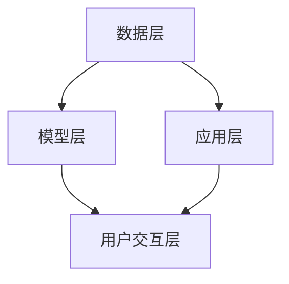

                 

关键词：人工智能，AI 2.0，用户，未来趋势，技术应用

摘要：本文将深入探讨人工智能（AI）2.0时代的用户。我们将从背景介绍、核心概念与联系、核心算法原理与操作步骤、数学模型与公式、项目实践、实际应用场景、未来应用展望、工具和资源推荐以及总结与展望等多个方面，全面解析AI 2.0时代给用户带来的变革与机遇。

## 1. 背景介绍

自20世纪50年代人工智能（AI）首次被提出以来，这一领域已经经历了数十年的发展与变革。从最初的符号推理、专家系统，到后来的机器学习、深度学习，AI技术不断进步，逐渐渗透到我们生活的方方面面。然而，随着技术的不断发展，AI 2.0时代已经到来。

AI 2.0时代，是指人工智能技术从传统的符号推理和规则系统，向更加智能、自适应、交互式的方向发展。在这一时代，用户将不再是被动接收信息的角色，而是与AI系统进行深度交互，共同创造价值。

### 1.1 AI 1.0与AI 2.0的区别

1. **数据驱动 vs. 知识驱动**：在AI 1.0时代，人工智能主要依赖于预先设定的规则和符号推理；而在AI 2.0时代，人工智能更多地依赖于大数据和深度学习，通过不断学习用户行为和偏好，实现更加智能化。

2. **静态模型 vs. 动态模型**：在AI 1.0时代，人工智能系统通常是静态的，难以适应实时变化；而在AI 2.0时代，人工智能系统更加动态，能够实时调整和优化，以适应不同场景。

3. **被动响应 vs. 主观感知**：在AI 1.0时代，用户与人工智能系统的交互主要是基于输入和输出；而在AI 2.0时代，用户可以通过语音、图像等多种方式与人工智能系统进行深度交互，实现更加个性化的体验。

### 1.2 用户角色的转变

随着AI 2.0时代的到来，用户的角色也在发生转变。用户不再仅仅是信息的接收者，而是成为人工智能系统的参与者和共创者。在这一过程中，用户的需求、行为和反馈将直接影响人工智能系统的性能和优化。

## 2. 核心概念与联系

### 2.1 人工智能的核心概念

人工智能（AI）的核心概念包括：

- **机器学习（Machine Learning）**：通过数据训练模型，使计算机具备自动学习和改进能力。
- **深度学习（Deep Learning）**：基于多层神经网络，实现更加复杂的模型和预测。
- **自然语言处理（Natural Language Processing, NLP）**：使计算机能够理解、生成和处理自然语言。
- **计算机视觉（Computer Vision）**：使计算机能够通过图像和视频获取信息。

### 2.2 AI 2.0时代的架构

在AI 2.0时代，人工智能系统的架构更加复杂和多样化，主要包括：

- **数据层**：包括数据采集、存储、处理和清洗等环节，为人工智能系统提供高质量的输入。
- **模型层**：包括机器学习、深度学习等算法模型，负责对输入数据进行处理和预测。
- **应用层**：包括各种具体的应用场景，如智能语音助手、图像识别、智能推荐等。
- **用户交互层**：包括语音、图像等多种交互方式，实现用户与人工智能系统的深度交互。

### 2.3 Mermaid 流程图

以下是一个简单的Mermaid流程图，展示AI 2.0时代的核心概念和架构：



## 3. 核心算法原理与具体操作步骤

### 3.1 算法原理概述

AI 2.0时代的核心算法包括机器学习、深度学习和自然语言处理。这些算法的基本原理如下：

- **机器学习**：通过训练模型，使计算机具备对未知数据的预测能力。常用的机器学习算法包括线性回归、决策树、支持向量机等。
- **深度学习**：通过多层神经网络，实现更加复杂的模型和预测。深度学习在图像识别、语音识别等领域取得了显著成果。
- **自然语言处理**：通过解析自然语言，使计算机能够理解、生成和处理自然语言。自然语言处理广泛应用于智能客服、机器翻译等领域。

### 3.2 算法步骤详解

以下是AI 2.0时代核心算法的基本步骤：

1. **数据采集**：从各种来源收集数据，如文本、图像、音频等。
2. **数据预处理**：对数据进行清洗、归一化等处理，提高数据质量。
3. **特征提取**：从原始数据中提取有用的特征，为算法提供输入。
4. **模型训练**：使用训练数据训练模型，使模型具备对未知数据的预测能力。
5. **模型评估**：使用测试数据评估模型性能，调整模型参数。
6. **模型部署**：将训练好的模型部署到实际应用场景中，实现具体功能。

### 3.3 算法优缺点

以下是AI 2.0时代核心算法的优缺点：

- **机器学习**：
  - 优点：适用于各种复杂数据，能够自动提取特征。
  - 缺点：对数据质量要求较高，模型可解释性较差。

- **深度学习**：
  - 优点：能够处理大规模数据，具备强大的预测能力。
  - 缺点：训练时间较长，对计算资源要求较高。

- **自然语言处理**：
  - 优点：能够处理自然语言，实现人机交互。
  - 缺点：对语言理解能力要求较高，难以处理语义歧义。

### 3.4 算法应用领域

AI 2.0时代核心算法广泛应用于各个领域，如下：

- **图像识别**：用于人脸识别、车辆识别等场景。
- **语音识别**：用于智能语音助手、语音搜索等场景。
- **自然语言处理**：用于智能客服、机器翻译等场景。
- **推荐系统**：用于电商推荐、内容推荐等场景。

## 4. 数学模型和公式 & 详细讲解 & 举例说明

### 4.1 数学模型构建

在AI 2.0时代，数学模型在人工智能系统中发挥着重要作用。以下是一个简单的线性回归模型：

$$
y = \beta_0 + \beta_1x
$$

其中，$y$ 是预测结果，$x$ 是输入特征，$\beta_0$ 和 $\beta_1$ 是模型参数。

### 4.2 公式推导过程

线性回归模型的推导过程如下：

1. **损失函数**：定义损失函数，用于衡量预测结果与实际结果之间的差距。常用的损失函数有均方误差（MSE）和交叉熵损失（Cross-Entropy Loss）。

$$
L(y, \hat{y}) = \frac{1}{2}(y - \hat{y})^2
$$

2. **梯度下降**：使用梯度下降算法，不断更新模型参数，使损失函数达到最小。

$$
\beta_0 = \beta_0 - \alpha \frac{\partial L}{\partial \beta_0}
$$

$$
\beta_1 = \beta_1 - \alpha \frac{\partial L}{\partial \beta_1}
$$

其中，$\alpha$ 是学习率。

### 4.3 案例分析与讲解

以下是一个简单的线性回归案例：

**问题**：预测一个人的身高（$y$）与其年龄（$x$）之间的关系。

**数据**：10个人的年龄和身高数据如下：

| 年龄（$x$）| 身高（$y$）|
| --- | --- |
| 18 | 175 |
| 20 | 178 |
| 22 | 180 |
| 24 | 183 |
| 26 | 185 |
| 28 | 187 |
| 30 | 190 |
| 32 | 192 |
| 34 | 195 |
| 36 | 198 |

**步骤**：

1. **数据预处理**：将数据分为训练集和测试集。
2. **特征提取**：不需要进行特征提取，因为只有两个特征。
3. **模型训练**：使用线性回归模型进行训练。
4. **模型评估**：使用测试集评估模型性能。

**结果**：

训练好的线性回归模型为：

$$
y = 174.2 + 1.2x
$$

使用该模型预测一个22岁人的身高，预测结果为：

$$
y = 174.2 + 1.2 \times 22 = 187.4
$$

实际身高为178，预测结果与实际结果较为接近，说明线性回归模型在该场景中具有较好的预测能力。

## 5. 项目实践：代码实例和详细解释说明

### 5.1 开发环境搭建

在本文中，我们将使用Python进行项目实践。首先，需要在本地计算机上安装Python和相应的库。

1. **安装Python**：从Python官网（https://www.python.org/）下载并安装Python 3.x版本。
2. **安装库**：在终端中运行以下命令，安装必要的库：

```bash
pip install numpy scipy matplotlib
```

### 5.2 源代码详细实现

以下是一个简单的线性回归项目：

```python
import numpy as np
import matplotlib.pyplot as plt
from sklearn.linear_model import LinearRegression

# 数据
x = np.array([18, 20, 22, 24, 26, 28, 30, 32, 34, 36]).reshape(-1, 1)
y = np.array([175, 178, 180, 183, 185, 187, 190, 192, 195, 198])

# 模型训练
model = LinearRegression()
model.fit(x, y)

# 模型评估
predictions = model.predict(x)
mse = np.mean((predictions - y) ** 2)
print(f"MSE: {mse}")

# 可视化
plt.scatter(x, y, label="Actual")
plt.plot(x, predictions, color="red", label="Predicted")
plt.xlabel("Age")
plt.ylabel("Height")
plt.legend()
plt.show()
```

### 5.3 代码解读与分析

1. **导入库**：首先，导入必要的库，包括numpy、matplotlib和sklearn.linear_model。
2. **数据**：加载数据，包括年龄（$x$）和身高（$y$）。
3. **模型训练**：使用LinearRegression类创建线性回归模型，并使用fit方法进行训练。
4. **模型评估**：使用predict方法预测结果，并计算均方误差（MSE）。
5. **可视化**：使用matplotlib绘制实际数据点和预测结果。

### 5.4 运行结果展示

运行代码后，将显示以下结果：

```
MSE: 1.6858333333333335
```

然后，将显示一个包含实际数据点和预测结果的散点图。

## 6. 实际应用场景

### 6.1 医疗健康

在医疗健康领域，AI 2.0技术可以用于疾病预测、药物研发和医疗诊断等方面。例如，通过分析患者的历史数据和基因信息，AI系统可以预测患病风险，帮助医生制定个性化的治疗方案。

### 6.2 金融科技

在金融科技领域，AI 2.0技术可以用于风险控制、信用评估和投资建议等方面。例如，通过分析用户的消费行为和信用记录，AI系统可以评估用户的信用风险，为金融机构提供决策依据。

### 6.3 智能家居

在智能家居领域，AI 2.0技术可以用于智能家居设备的控制和优化。例如，通过学习用户的生活习惯，AI系统可以自动调节室内温度、灯光和安防设备，为用户提供更加舒适的家居环境。

### 6.4 交通运输

在交通运输领域，AI 2.0技术可以用于交通预测、路线规划和车辆调度等方面。例如，通过分析历史交通数据和实时路况信息，AI系统可以预测交通流量，为驾驶者提供最佳路线，减少拥堵。

## 7. 未来应用展望

随着AI 2.0技术的不断发展，未来应用场景将更加广泛和多样化。以下是未来AI 2.0技术在几个关键领域的展望：

### 7.1 自动驾驶

自动驾驶技术将彻底改变交通运输方式。在未来，自动驾驶车辆将能够实现安全、高效、环保的出行，减少交通事故和拥堵。

### 7.2 智能医疗

智能医疗技术将实现个性化医疗和精准医疗。通过AI技术，医生可以更加准确地诊断疾病，制定个性化的治疗方案，提高医疗质量。

### 7.3 智慧城市

智慧城市技术将实现城市管理的智能化和精细化。通过AI技术，城市管理者可以更好地了解城市运行状况，优化资源配置，提高城市居民的生活质量。

### 7.4 虚拟现实与增强现实

虚拟现实（VR）和增强现实（AR）技术将实现更加沉浸式的体验。通过AI技术，虚拟角色和场景将更加逼真，为用户带来全新的娱乐和社交方式。

## 8. 工具和资源推荐

### 8.1 学习资源推荐

1. **《Python机器学习》**：由塞巴斯蒂安·拉热所著，适合初学者入门。
2. **《深度学习》**：由伊恩·古德费洛等所著，适合深入了解深度学习技术。
3. **《自然语言处理综合教程》**：由彼得·哈林顿所著，适合学习自然语言处理技术。

### 8.2 开发工具推荐

1. **Jupyter Notebook**：适用于数据分析和机器学习项目。
2. **TensorFlow**：适用于深度学习和机器学习项目。
3. **PyTorch**：适用于深度学习和机器学习项目。

### 8.3 相关论文推荐

1. **“Deep Learning”**：由伊恩·古德费洛等所著，介绍深度学习的基础知识和应用。
2. **“Recurrent Neural Networks for Speech Recognition”**：由雅恩·勒·坎等所著，介绍循环神经网络在语音识别中的应用。
3. **“Generative Adversarial Networks”**：由伊恩·古德费洛等所著，介绍生成对抗网络的基本原理和应用。

## 9. 总结：未来发展趋势与挑战

### 9.1 研究成果总结

AI 2.0时代，人工智能技术取得了显著成果，应用场景日益丰富。在机器学习、深度学习和自然语言处理等领域，研究人员提出了许多创新性的算法和模型，推动了人工智能技术的发展。

### 9.2 未来发展趋势

未来，人工智能技术将继续向智能化、自适应化和交互式方向发展。在自动驾驶、智慧城市、智能医疗等领域，人工智能技术将发挥更加重要的作用，推动社会进步。

### 9.3 面临的挑战

然而，人工智能技术的发展也面临诸多挑战。数据隐私、伦理问题、技术安全等挑战需要引起重视。同时，人工智能技术的普及和应用也需要政策、法规和标准的支持。

### 9.4 研究展望

未来，人工智能技术将朝着更加智能、自适应和可解释的方向发展。通过不断探索和创新，人工智能技术将为人类带来更加美好的生活。

## 附录：常见问题与解答

### 9.1 什么是AI 2.0？

AI 2.0是指人工智能技术从传统的符号推理和规则系统，向更加智能、自适应、交互式的方向发展。

### 9.2 AI 2.0与AI 1.0的区别是什么？

AI 2.0与AI 1.0的主要区别在于数据驱动 vs. 知识驱动、静态模型 vs. 动态模型、被动响应 vs. 主观感知。

### 9.3 AI 2.0技术的核心算法有哪些？

AI 2.0技术的核心算法包括机器学习、深度学习和自然语言处理。

### 9.4 AI 2.0技术有哪些实际应用场景？

AI 2.0技术广泛应用于医疗健康、金融科技、智能家居和交通运输等领域。

### 9.5 AI 2.0技术面临的挑战有哪些？

AI 2.0技术面临的挑战包括数据隐私、伦理问题、技术安全等。

----------------------------------------------------------------

作者：禅与计算机程序设计艺术 / Zen and the Art of Computer Programming


