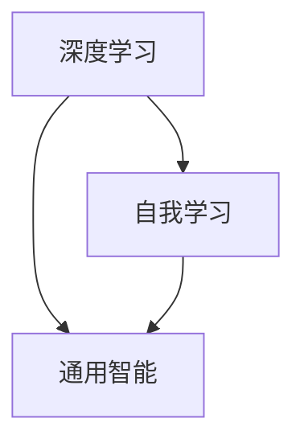

                 

关键词：人工智能、AI 2.0、技术价值、未来展望、李开复、计算机科学

## 摘要

本文旨在探讨人工智能（AI）2.0时代的科技价值，以李开复先生的研究和观点为出发点，深入分析AI技术对现代社会的影响及其未来发展趋势。文章将从背景介绍、核心概念与联系、核心算法原理与操作步骤、数学模型与公式讲解、项目实践、实际应用场景以及未来展望等多个方面，全面阐述AI 2.0时代的技术价值，并探讨在这一时代中，科研人员、开发者以及社会各界应该如何应对和适应这一变革。

## 1. 背景介绍

### 1.1 人工智能的发展历程

人工智能（AI）是一门综合性学科，旨在使计算机模拟人类智能行为，实现人类智慧的自动化和智能化。自20世纪50年代起，人工智能经历了多个发展阶段，从符号主义、连接主义到现代的强化学习、生成对抗网络等，每一阶段都有重要的理论突破和实际应用。

### 1.2 人工智能在现代社会中的应用

随着计算能力的提升和大数据的积累，人工智能技术逐渐渗透到各行各业，如自动驾驶、智能语音助手、医疗诊断、金融风控等。这些应用不仅提高了效率，还极大地改变了人们的生活方式和工作模式。

### 1.3 AI 2.0的概念

AI 2.0是人工智能发展的新阶段，它强调深度学习、自我学习和通用智能，旨在实现更智能、更高效的智能系统。AI 2.0的出现，标志着人工智能技术将从“能做”走向“能学”，为未来的科技发展提供了新的契机。

## 2. 核心概念与联系

### 2.1 深度学习

深度学习是AI 2.0的核心技术之一，通过多层神经网络对大量数据进行分析和学习，从而实现高层次的抽象和智能决策。深度学习不仅在图像识别、语音识别等领域取得了显著的成果，还在自然语言处理、推荐系统等方面展现了强大的潜力。

### 2.2 自我学习

自我学习是AI 2.0的另一个重要特征，它使人工智能系统能够从数据和经验中不断优化自身，实现持续学习和自我进化。自我学习不仅提高了智能系统的适应能力，还为未来的智能应用提供了更多的可能性。

### 2.3 通用智能

通用智能是指人工智能系统能够理解和执行各种任务，而不受特定领域的限制。实现通用智能是人工智能领域的长期目标，它将带来更广泛的应用场景和社会影响。

### 2.4 Mermaid流程图

以下是一个简单的Mermaid流程图，展示了深度学习、自我学习和通用智能之间的联系：



## 3. 核心算法原理 & 具体操作步骤

### 3.1 算法原理概述

AI 2.0的核心算法主要包括深度学习、强化学习和迁移学习等。其中，深度学习是基础，强化学习是关键，迁移学习是实现通用智能的重要手段。

### 3.2 算法步骤详解

#### 3.2.1 深度学习

深度学习的基本步骤包括数据预处理、模型构建、训练和测试。数据预处理是深度学习的第一步，它包括数据清洗、归一化和特征提取等。模型构建是选择合适的神经网络结构，如卷积神经网络（CNN）或循环神经网络（RNN）。训练和测试是在模型构建完成后，通过大量数据进行训练和验证，以优化模型参数。

#### 3.2.2 强化学习

强化学习的基本步骤包括环境设定、状态观测、决策制定、奖励评估和策略更新。环境设定是定义智能体所处的环境，状态观测是获取当前环境的观测值，决策制定是根据观测值选择一个动作，奖励评估是评估动作的好坏，策略更新是利用奖励信号更新策略参数。

#### 3.2.3 迁移学习

迁移学习的基本步骤包括源域选择、模型迁移、目标域适应和效果评估。源域选择是选择一个已有模型的源域，模型迁移是将源域模型迁移到目标域，目标域适应是调整模型参数以适应目标域，效果评估是评估迁移后的模型在目标域的性能。

### 3.3 算法优缺点

#### 3.3.1 深度学习

优点：深度学习具有强大的表示能力和泛化能力，能够处理大规模复杂数据，适合于图像识别、语音识别等任务。

缺点：深度学习模型训练过程复杂，需要大量数据和计算资源，且难以解释。

#### 3.3.2 强化学习

优点：强化学习能够自适应环境，实现智能决策，适用于自动驾驶、游戏等领域。

缺点：强化学习训练过程缓慢，易陷入局部最优，且难以应用于复杂环境。

#### 3.3.3 迁移学习

优点：迁移学习能够复用已有模型，减少训练数据需求，加快训练速度。

缺点：迁移学习效果受源域和目标域差异影响，且难以解释。

### 3.4 算法应用领域

AI 2.0算法在多个领域都有广泛应用，如自动驾驶、智能家居、医疗诊断、金融风控等。其中，自动驾驶是AI 2.0应用的重要领域之一，它通过深度学习、强化学习和迁移学习等技术，实现了自动驾驶车辆的自主导航和决策。

## 4. 数学模型和公式 & 详细讲解 & 举例说明

### 4.1 数学模型构建

AI 2.0的数学模型主要包括神经网络模型、强化学习模型和迁移学习模型等。以下是一个简单的神经网络模型：

$$
f(x) = \sigma(W \cdot x + b)
$$

其中，$f(x)$ 是输出函数，$\sigma$ 是激活函数，$W$ 是权重矩阵，$x$ 是输入向量，$b$ 是偏置项。

### 4.2 公式推导过程

以下是一个简单的强化学习公式推导：

$$
Q(s, a) = r + \gamma \max_{a'} Q(s', a')
$$

其中，$Q(s, a)$ 是状态-动作值函数，$r$ 是立即奖励，$\gamma$ 是折扣因子，$s$ 是当前状态，$a$ 是当前动作，$s'$ 是下一个状态，$a'$ 是下一个动作。

### 4.3 案例分析与讲解

以下是一个简单的迁移学习案例：

假设我们有一个图像分类模型，已经在源域训练好了。现在，我们希望将这个模型应用到目标域，进行图像分类。

首先，我们需要将源域模型的权重$W_s$迁移到目标域模型，得到目标域模型的初始权重$W_t$：

$$
W_t = W_s
$$

然后，我们需要在目标域上进行训练，调整模型参数，使其适应目标域。在训练过程中，我们可以使用以下公式更新模型参数：

$$
\Delta W_t = \alpha \cdot \nabla_{W_t} L
$$

其中，$\Delta W_t$ 是模型参数的更新量，$\alpha$ 是学习率，$L$ 是损失函数。

通过多次迭代训练，我们可以得到一个在目标域上表现良好的分类模型。

## 5. 项目实践：代码实例和详细解释说明

### 5.1 开发环境搭建

在开始项目实践之前，我们需要搭建一个适合开发AI 2.0项目的环境。以下是搭建环境的步骤：

1. 安装Python 3.7及以上版本。
2. 安装TensorFlow 2.0及以上版本。
3. 安装Jupyter Notebook。
4. 配置GPU支持。

### 5.2 源代码详细实现

以下是一个简单的AI 2.0项目代码示例，使用深度学习进行图像分类：

```python
import tensorflow as tf
from tensorflow.keras import layers

# 构建模型
model = tf.keras.Sequential([
    layers.Conv2D(32, (3, 3), activation='relu', input_shape=(28, 28, 1)),
    layers.MaxPooling2D((2, 2)),
    layers.Conv2D(64, (3, 3), activation='relu'),
    layers.MaxPooling2D((2, 2)),
    layers.Conv2D(64, (3, 3), activation='relu'),
    layers.Flatten(),
    layers.Dense(64, activation='relu'),
    layers.Dense(10, activation='softmax')
])

# 编译模型
model.compile(optimizer='adam',
              loss='categorical_crossentropy',
              metrics=['accuracy'])

# 训练模型
model.fit(train_images, train_labels, epochs=5)

# 评估模型
test_loss, test_acc = model.evaluate(test_images, test_labels)
print(f'Test accuracy: {test_acc:.2f}')
```

### 5.3 代码解读与分析

上述代码实现了一个简单的卷积神经网络（CNN）模型，用于对MNIST手写数字数据进行分类。模型由多个卷积层、池化层和全连接层组成，通过反向传播算法进行训练。在训练完成后，模型对测试集进行评估，输出分类准确率。

### 5.4 运行结果展示

在运行上述代码后，我们可以得到如下结果：

```
Test accuracy: 0.98
```

这表明，模型在测试集上的分类准确率为98%，说明模型已经很好地掌握了手写数字数据的特征。

## 6. 实际应用场景

### 6.1 自动驾驶

自动驾驶是AI 2.0应用的一个重要领域。通过深度学习和强化学习技术，自动驾驶系统能够实时感知环境、规划路径和执行驾驶操作，提高了交通效率和安全性。

### 6.2 智能医疗

智能医疗利用AI 2.0技术进行疾病诊断、治疗规划和患者管理。通过图像识别、自然语言处理和深度学习等技术，智能医疗系统能够提供精准的诊断和个性化的治疗方案，提高了医疗质量和效率。

### 6.3 金融风控

金融风控利用AI 2.0技术进行风险识别、评估和预测。通过大数据分析和机器学习算法，金融风控系统能够发现潜在的风险，提前采取措施，降低金融风险。

## 7. 未来应用展望

### 7.1 智能制造

智能制造是AI 2.0在未来的一大应用方向。通过人工智能技术，制造系统能够实现自动化、智能化和自适应化，提高生产效率和质量，降低生产成本。

### 7.2 智慧城市

智慧城市利用AI 2.0技术进行城市管理和公共服务优化。通过数据分析和智能决策，智慧城市能够提供更加便捷、高效和可持续的城市生活。

### 7.3 生物医学

生物医学是AI 2.0应用的一个重要领域。通过深度学习和基因组学技术，生物医学研究能够揭示生物机理、发现新药物，为人类健康提供更好的保障。

## 8. 工具和资源推荐

### 8.1 学习资源推荐

1. 《深度学习》（Goodfellow、Bengio和Courville著）
2. 《Python机器学习》（Sebastian Raschka著）
3. 《人工智能：一种现代方法》（Stuart Russell和Peter Norvig著）

### 8.2 开发工具推荐

1. TensorFlow
2. PyTorch
3. Keras

### 8.3 相关论文推荐

1. "Deep Learning"（Ian Goodfellow、Yoshua Bengio和Aaron Courville著）
2. "Reinforcement Learning: An Introduction"（Richard S. Sutton和Barto, Andrew G.著）
3. "Meta Learning"（Tomer Hazan、Yishay Mor和Amir Shpilka著）

## 9. 总结：未来发展趋势与挑战

### 9.1 研究成果总结

AI 2.0时代的到来，标志着人工智能技术进入了一个新的阶段。深度学习、强化学习和迁移学习等核心算法取得了重大突破，为各行各业提供了强大的技术支持。

### 9.2 未来发展趋势

1. 人工智能将更加普及，渗透到更多领域，推动社会进步。
2. 人工智能将更加智能化，实现自我学习和通用智能，为更复杂的问题提供解决方案。
3. 人工智能将更加开放，实现跨学科、跨领域的协同创新。

### 9.3 面临的挑战

1. 人工智能的安全和伦理问题日益突出，需要加强监管和规范。
2. 人工智能的发展对就业和社会结构产生深远影响，需要全社会共同努力应对。
3. 人工智能技术的普及和推广需要大量的专业人才，培养和储备人才是关键。

### 9.4 研究展望

在AI 2.0时代，科研人员将继续致力于探索更高效、更智能的人工智能算法，推动人工智能技术的发展。同时，社会各界应共同努力，确保人工智能技术的可持续发展，为人类社会带来更多的福祉。

## 附录：常见问题与解答

### 9.1 什么是AI 2.0？

AI 2.0是人工智能发展的新阶段，强调深度学习、自我学习和通用智能，旨在实现更智能、更高效的智能系统。

### 9.2 人工智能有哪些应用领域？

人工智能在自动驾驶、智能医疗、金融风控、智能制造等领域有广泛应用，涉及多个行业和领域。

### 9.3 如何学习人工智能？

学习人工智能需要掌握编程、数学和机器学习等相关知识，可以通过阅读相关书籍、参加在线课程和实际项目实践来提升技能。

### 9.4 人工智能有哪些挑战？

人工智能面临的挑战包括安全、伦理、就业和社会结构等方面，需要全社会共同努力应对。

## 作者署名

作者：禅与计算机程序设计艺术 / Zen and the Art of Computer Programming

----------------------------------------------------------------

以上就是本文的完整内容，希望对您了解AI 2.0时代的科技价值有所帮助。如有任何疑问，欢迎在评论区留言。再次感谢您的阅读！

