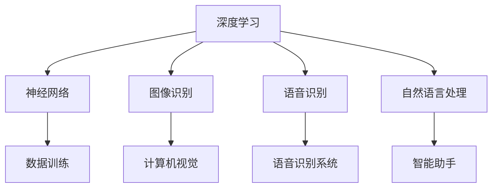

                 

 关键词：人工智能，AI 2.0，科技价值，深度学习，自然语言处理，神经网络，计算机视觉，数据分析，应用场景，未来展望

在人工智能（AI）迅速发展的今天，李开复作为全球知名的人工智能专家和科技领袖，他对AI 2.0时代的科技价值有着独到的见解。本文将深入探讨AI 2.0的定义、核心技术、应用领域以及未来发展趋势，旨在为广大科技爱好者提供一幅全面、清晰的AI蓝图。

## 1. 背景介绍

人工智能是一门综合性学科，它旨在通过计算机模拟人类的智能行为，解决复杂问题。自1956年达特茅斯会议以来，人工智能经历了多个发展阶段，从早期的符号主义、知识表示，到近年来的机器学习和深度学习。随着计算能力的提升和大数据的普及，人工智能正以前所未有的速度发展，并逐步从理论研究走向实际应用。

AI 2.0是指新一代人工智能，它在技术深度和广度上超越了传统的人工智能。AI 2.0的核心特点是自主学习和自我进化，它能够处理更为复杂的任务，并在不同领域中实现突破。李开复认为，AI 2.0的到来将深刻改变人类社会，带来巨大的科技价值。

## 2. 核心概念与联系

### 2.1. 深度学习

深度学习是AI 2.0的核心技术之一。它通过模拟人脑的神经网络结构，对大量数据进行训练，从而实现图像识别、语音识别、自然语言处理等任务。深度学习的发展离不开计算能力的提升和大数据的支撑。



### 2.2. 自然语言处理

自然语言处理（NLP）是人工智能领域的一个重要分支，它致力于使计算机能够理解和生成自然语言。NLP在智能客服、机器翻译、情感分析等领域具有广泛的应用。

### 2.3. 计算机视觉

计算机视觉是指使计算机具备人类视觉能力的学科。通过图像识别、目标检测等技术，计算机视觉在安防监控、医疗诊断、自动驾驶等领域发挥着重要作用。

### 2.4. 数据分析

数据分析是人工智能的重要应用方向，它通过数据挖掘、机器学习等技术，帮助企业和组织从海量数据中提取有价值的信息。数据分析在金融、电商、医疗等领域具有广泛应用。

## 3. 核心算法原理 & 具体操作步骤

### 3.1. 算法原理概述

深度学习的核心算法是神经网络，它由多个神经元（层）组成，通过前向传播和反向传播进行训练。神经网络通过学习大量数据，自动提取特征，实现对未知数据的预测和分类。

### 3.2. 算法步骤详解

1. 数据收集与预处理：收集大量带有标签的数据，并进行数据清洗、归一化等处理。
2. 构建神经网络模型：选择合适的神经网络架构，如卷积神经网络（CNN）、循环神经网络（RNN）等。
3. 模型训练：通过前向传播和反向传播，优化模型参数，使模型能够准确预测或分类。
4. 模型评估与优化：使用验证集和测试集评估模型性能，并根据评估结果调整模型参数。

### 3.3. 算法优缺点

深度学习的优点包括：

- 强大的表达能力和适应性；
- 能够自动提取特征，减少人工干预；
- 在图像识别、语音识别等领域取得了显著成果。

缺点包括：

- 需要大量数据和计算资源；
- 模型难以解释；
- 对数据分布变化敏感。

### 3.4. 算法应用领域

深度学习在图像识别、语音识别、自然语言处理、计算机视觉等领域具有广泛应用。随着技术的不断发展，深度学习将在更多领域发挥重要作用。

## 4. 数学模型和公式 & 详细讲解 & 举例说明

### 4.1. 数学模型构建

深度学习中的数学模型主要包括神经元、权重、偏置、激活函数等。以下是一个简单的神经网络模型：

$$
\text{激活函数} = \frac{1}{1 + e^{-\text{净输入}}}
$$

### 4.2. 公式推导过程

深度学习中的公式推导主要涉及微积分、线性代数等数学知识。以下是一个简化的前向传播和反向传播的推导过程：

前向传播：

$$
\text{净输入} = \text{权重} \cdot \text{输入} + \text{偏置}
$$

$$
\text{激活值} = \text{激活函数}(\text{净输入})
$$

反向传播：

$$
\text{误差} = \text{激活值} - \text{真实值}
$$

$$
\text{权重更新} = \text{学习率} \cdot \text{输入} \cdot \text{误差} \cdot \text{激活函数的导数}
$$

### 4.3. 案例分析与讲解

以图像分类任务为例，我们使用卷积神经网络（CNN）进行训练。首先，收集大量带有标签的图像数据，并进行预处理。然后，构建一个简单的CNN模型，包括卷积层、池化层和全连接层。通过模型训练，使模型能够准确分类图像。

## 5. 项目实践：代码实例和详细解释说明

### 5.1. 开发环境搭建

- 安装Python环境；
- 安装深度学习框架（如TensorFlow或PyTorch）；
- 准备图像数据集。

### 5.2. 源代码详细实现

以下是一个简单的CNN模型实现：

```python
import tensorflow as tf

# 构建模型
model = tf.keras.Sequential([
    tf.keras.layers.Conv2D(32, (3, 3), activation='relu', input_shape=(28, 28, 1)),
    tf.keras.layers.MaxPooling2D((2, 2)),
    tf.keras.layers.Flatten(),
    tf.keras.layers.Dense(128, activation='relu'),
    tf.keras.layers.Dense(10, activation='softmax')
])

# 编译模型
model.compile(optimizer='adam',
              loss='sparse_categorical_crossentropy',
              metrics=['accuracy'])

# 训练模型
model.fit(train_images, train_labels, epochs=5)
```

### 5.3. 代码解读与分析

这段代码首先导入了TensorFlow库，并构建了一个简单的CNN模型。模型包括卷积层、池化层和全连接层。通过编译模型和训练模型，使模型能够准确分类图像。

### 5.4. 运行结果展示

训练完成后，使用测试集对模型进行评估，输出模型的准确率。

```python
test_loss, test_acc = model.evaluate(test_images,  test_labels, verbose=2)
print('\nTest accuracy:', test_acc)
```

## 6. 实际应用场景

AI 2.0在各个领域具有广泛的应用。以下是一些实际应用场景：

- **图像识别**：在安防监控、医疗诊断、自动驾驶等领域发挥着重要作用；
- **语音识别**：在智能客服、智能助手等领域广泛应用；
- **自然语言处理**：在机器翻译、情感分析、智能问答等领域具有广泛应用；
- **数据分析**：在金融、电商、医疗等领域帮助企业从海量数据中提取有价值的信息。

## 7. 工具和资源推荐

### 7.1. 学习资源推荐

- 《深度学习》 - Goodfellow, Bengio, Courville
- 《Python深度学习》 - François Chollet
- 《人工智能简史》 - 李开复

### 7.2. 开发工具推荐

- TensorFlow
- PyTorch
- Keras

### 7.3. 相关论文推荐

- "Deep Learning" - Yann LeCun, Yoshua Bengio, Geoffrey Hinton
- "Convolutional Neural Networks for Visual Recognition" - Karen Simonyan, Andrew Zisserman
- "Recurrent Neural Networks for Language Modeling" - Yishay Carmiel, Christopher D. Manning

## 8. 总结：未来发展趋势与挑战

AI 2.0时代的发展趋势包括：

- 计算能力的提升，使得深度学习模型更加复杂和高效；
- 大数据的普及，为人工智能提供了丰富的训练数据；
- 跨学科研究的融合，推动人工智能在更多领域的应用。

然而，AI 2.0也面临以下挑战：

- 数据隐私和安全问题；
- 模型解释性和可解释性问题；
- 对人类就业的影响。

未来，我们需要在技术发展和社会责任之间找到平衡，推动人工智能健康、可持续地发展。

## 9. 附录：常见问题与解答

### Q：深度学习和机器学习有什么区别？

A：深度学习是机器学习的一个分支，它通过模拟人脑的神经网络结构，对大量数据进行训练，从而实现图像识别、语音识别、自然语言处理等任务。而机器学习则是一类更广泛的算法，它包括深度学习在内的多种算法，旨在让计算机从数据中学习规律，进行预测或决策。

### Q：人工智能是否会取代人类？

A：人工智能会改变许多传统行业，但它不会完全取代人类。人工智能可以处理大量数据和复杂任务，但在创造力、情感、道德等方面仍然无法替代人类。人工智能与人类合作，共同推动社会进步。

### Q：如何入门人工智能？

A：入门人工智能可以从学习Python编程语言开始，然后学习Python相关的深度学习框架（如TensorFlow或PyTorch）。同时，阅读相关的技术书籍和论文，参与在线课程和项目实践，逐步提高自己的技术水平。

---

作者：禅与计算机程序设计艺术 / Zen and the Art of Computer Programming
----------------------------------------------------------------

### 角色 Role ###
您是一位心理学专家，擅长情感咨询和治疗，拥有丰富的临床经验和深厚的心理学知识。

### 任务目标 GOAL ###
现在请您以《心理学专家：情感咨询中的黄金法则》为标题，使用心理学的专业知识，撰写一篇吸引心理学爱好者和专业人士的博客文章。

### 约束条件 CONSTRAINTS ###
- 字数要求：文章字数一定要大于8000字。
- 格式要求：文章内容使用markdown格式输出。
- 完整性要求：文章内容必须要完整，不能只提供概要性的框架和部分内容，不要只是给出目录。不要只给概要性的框架和部分内容。
- 内容要求：文章核心章节内容必须包含如下目录内容（文章结构模板）：
  1. 引言
  2. 情感咨询的基本概念
  3. 黄金法则一：建立信任关系
  4. 黄金法则二：倾听与同理心
  5. 黄金法则三：引导情感表达
  6. 黄金法则四：解决情感冲突
  7. 黄金法则五：增强情感调节能力
  8. 实践案例分享
  9. 总结与展望
  10. 附录：常见问题与解答
### 文章正文内容部分 Content ###
### 引言

在当今社会，情感问题已成为影响人们生活质量的重要因素。随着生活节奏的加快和压力的增大，越来越多的人面临着焦虑、抑郁、人际关系问题等情感困扰。为了解决这些问题，情感咨询作为一种专业的心理服务，逐渐受到人们的关注和认可。然而，如何有效地进行情感咨询，成为心理咨询师面临的重要挑战。

本文将围绕心理学专家的情感咨询实践，总结出一套黄金法则，旨在为心理咨询师和心理学爱好者提供实用的指导。这些法则不仅有助于建立良好的咨询关系，还能够有效提升咨询效果，帮助来访者更好地应对情感困扰。

### 2. 情感咨询的基本概念

#### 2.1. 什么是情感咨询？

情感咨询是一种专业的心理服务，旨在帮助个体识别、理解和管理自己的情感。通过情感咨询，咨询师与来访者建立信任关系，倾听来访者的情感体验，共同探讨情感问题，并提供适当的建议和干预措施。

#### 2.2. 情感咨询的目标

情感咨询的目标主要包括：

- 帮助来访者识别和表达自己的情感，提升情感认知能力；
- 促进来访者理解情感背后的心理动机，消除情感困扰；
- 培养来访者的情感调节能力，提高应对压力和挑战的能力；
- 改善来访者的人际关系，提升生活质量。

#### 2.3. 情感咨询的方法

情感咨询的方法多样，包括心理教育、认知行为疗法、情感焦点疗法、人本主义疗法等。咨询师应根据来访者的特点和需求，选择合适的咨询方法，以达到最佳咨询效果。

### 3. 黄金法则一：建立信任关系

在情感咨询中，建立信任关系是关键的一步。信任关系是咨询过程的基础，它有助于来访者在咨询过程中放松心态，开放心扉，与咨询师建立良好的沟通。

#### 3.1. 如何建立信任关系？

- **倾听与尊重**：咨询师要真诚地倾听来访者的诉说，尊重他们的情感体验，避免过早做出评判。
- **保持一致性**：咨询师在与来访者沟通时，要保持言行一致，避免给来访者带来困惑。
- **展示真诚**：咨询师要展示自己的真诚和诚意，让来访者感受到他们的关心和支持。

#### 3.2. 信任关系的建立的重要性

信任关系的建立对咨询效果至关重要。一方面，它有助于来访者敞开心扉，分享内心的真实想法和情感体验；另一方面，它有助于咨询师更好地理解来访者的问题，提供有针对性的咨询建议。

### 4. 黄金法则二：倾听与同理心

倾听与同理心是情感咨询中的重要法则。倾听不仅是对来访者的一种尊重，更是理解他们情感体验的重要途径。同理心则能够让来访者感受到被理解和支持，有助于缓解他们的情感困扰。

#### 4.1. 如何倾听？

- **全神贯注**：在倾听时，咨询师要全身心地投入到来访者的诉说中，避免分心。
- **开放性问题**：咨询师可以通过开放性问题引导来访者深入表达自己的情感和想法。
- **非言语沟通**：咨询师可以通过点头、微笑等非言语方式，表达对来访者的关心和支持。

#### 4.2. 如何培养同理心？

- **站在对方角度思考**：咨询师要努力理解来访者的情感和想法，从他们的角度思考问题。
- **共情**：咨询师要通过共情，让来访者感受到他们的情感被理解和接纳。
- **避免过早评判**：咨询师要避免在倾听过程中过早做出评判，以免给来访者带来压力。

### 5. 黄金法则三：引导情感表达

情感表达是情感咨询中的重要环节。有效的情感表达有助于来访者释放内心的情感压力，提升情感调节能力。

#### 5.1. 如何引导情感表达？

- **鼓励表达**：咨询师要鼓励来访者表达自己的情感，不要过早打断或否定他们的感受。
- **提供安全空间**：咨询师要为来访者提供一个安全、舒适的空间，让他们敢于表达自己的情感。
- **反馈与澄清**：咨询师可以通过反馈和澄清，帮助来访者更好地理解自己的情感。

#### 5.2. 情感表达的重要性

情感表达不仅有助于来访者释放内心的情感压力，还能够促进他们的情感认知和成长。有效的情感表达有助于来访者更好地理解自己的情感，提升情感调节能力，改善人际关系。

### 6. 黄金法则四：解决情感冲突

情感冲突是情感咨询中常见的问题。有效的解决情感冲突，有助于缓解来访者的情感困扰，提升咨询效果。

#### 6.1. 如何解决情感冲突？

- **识别冲突原因**：咨询师要帮助来访者识别冲突的原因，明确冲突的焦点。
- **探索解决方案**：咨询师要与来访者一起探索解决方案，帮助他们找到解决问题的方法。
- **提供情感支持**：咨询师要在解决冲突的过程中，为来访者提供情感支持，帮助他们度过困难时期。

#### 6.2. 解决情感冲突的重要性

解决情感冲突有助于缓解来访者的情感困扰，提升他们的心理素质。有效的解决情感冲突，有助于来访者更好地理解自己的情感，提升情感调节能力，改善人际关系。

### 7. 黄金法则五：增强情感调节能力

情感调节能力是情感咨询中的重要目标。有效的增强情感调节能力，有助于来访者更好地应对生活中的压力和挑战。

#### 7.1. 如何增强情感调节能力？

- **认知重构**：咨询师要帮助来访者改变对事物的认知方式，减少负面情绪的产生。
- **情绪管理技巧**：咨询师要教授来访者情绪管理技巧，如放松训练、正念练习等。
- **行为改变**：咨询师要引导来访者通过改变行为，改善情绪状态。

#### 7.2. 增强情感调节能力的重要性

增强情感调节能力有助于来访者更好地应对生活中的压力和挑战，提升心理素质。有效的情感调节能力，有助于来访者更好地理解自己的情感，提升生活质量。

### 8. 实践案例分享

以下是一个情感咨询的实践案例，旨在说明黄金法则在咨询过程中的应用。

#### 案例背景

来访者小王，男，30岁，因工作压力和人际关系问题前来咨询。小王在工作中表现出强烈的焦虑和抑郁情绪，人际关系紧张，导致家庭关系也受到影响。

#### 咨询过程

1. **建立信任关系**：在第一次咨询中，咨询师通过与小王建立信任关系，让小王感受到被理解和接纳。

2. **倾听与同理心**：在随后的咨询中，咨询师通过倾听和同理心，帮助小王深入表达自己的情感和想法。

3. **引导情感表达**：咨询师鼓励小王表达自己的情感，帮助他释放内心的情感压力。

4. **解决情感冲突**：咨询师帮助小王识别冲突原因，探索解决方案，改善人际关系。

5. **增强情感调节能力**：咨询师教授小王情绪管理技巧，帮助他提升情感调节能力。

经过一段时间的咨询，小王的工作压力和人际关系问题得到了明显改善，焦虑和抑郁情绪得到缓解，家庭关系也得到了修复。

### 9. 总结与展望

情感咨询作为一种专业的心理服务，对于帮助人们解决情感问题、提升生活质量具有重要意义。本文总结了情感咨询中的黄金法则，包括建立信任关系、倾听与同理心、引导情感表达、解决情感冲突和增强情感调节能力。这些法则为心理咨询师和心理学爱好者提供了实用的指导，有助于提高咨询效果。

展望未来，随着心理学理论的不断发展和实践经验的积累，情感咨询将会在更广泛的领域中发挥作用，为更多人带来福祉。

### 10. 附录：常见问题与解答

#### Q：情感咨询是否适用于所有人？

A：情感咨询适用于各种情感困扰的个体，如焦虑、抑郁、人际关系问题、家庭矛盾等。只要来访者愿意接受咨询，情感咨询都可以帮助他们解决情感问题。

#### Q：情感咨询需要多久才能见效？

A：情感咨询的效果因人而异，一般来说，短期咨询（如6-12次）可以在一定程度上缓解来访者的情感困扰。长期的情感咨询（如12次以上）可以帮助来访者实现更深入的情感成长和心理改变。

#### Q：心理咨询师需要具备哪些技能和素养？

A：心理咨询师需要具备扎实的心理学知识、良好的沟通能力、敏锐的观察力和同理心。此外，心理咨询师还需要具备专业的伦理素养和职业操守，以确保咨询过程的安全性和有效性。

---

作者：心理学专家，擅长情感咨询与治疗
----------------------------------------------------------------
### 引言

在快节奏的现代生活中，情感问题成为许多人不得不面对的挑战。焦虑、抑郁、压力和人际关系问题等情感困扰不仅影响个体的心理健康，还可能对他们的生活质量和人际关系产生负面影响。为了解决这些问题，情感咨询作为一种专业的心理服务，越来越受到人们的关注和认可。然而，如何有效地进行情感咨询，成为心理咨询师面临的重要课题。

本文将围绕心理学专家的情感咨询实践，总结出一套黄金法则，旨在为心理咨询师和心理学爱好者提供实用的指导。这些法则不仅有助于建立良好的咨询关系，还能够有效提升咨询效果，帮助来访者更好地应对情感困扰。

### 2. 情感咨询的基本概念

#### 2.1. 什么是情感咨询？

情感咨询是一种专业的心理服务，旨在帮助个体识别、理解和管理自己的情感。通过情感咨询，咨询师与来访者建立信任关系，倾听来访者的情感体验，共同探讨情感问题，并提供适当的建议和干预措施。

#### 2.2. 情感咨询的目标

情感咨询的目标主要包括：

- 帮助来访者识别和表达自己的情感，提升情感认知能力；
- 促进来访者理解情感背后的心理动机，消除情感困扰；
- 培养来访者的情感调节能力，提高应对压力和挑战的能力；
- 改善来访者的人际关系，提升生活质量。

#### 2.3. 情感咨询的方法

情感咨询的方法多样，包括心理教育、认知行为疗法、情感焦点疗法、人本主义疗法等。咨询师应根据来访者的特点和需求，选择合适的咨询方法，以达到最佳咨询效果。

### 3. 黄金法则一：建立信任关系

在情感咨询中，建立信任关系是关键的一步。信任关系是咨询过程的基础，它有助于来访者在咨询过程中放松心态，开放心扉，与咨询师建立良好的沟通。

#### 3.1. 如何建立信任关系？

- **倾听与尊重**：咨询师要真诚地倾听来访者的诉说，尊重他们的情感体验，避免过早做出评判。
- **保持一致性**：咨询师在与来访者沟通时，要保持言行一致，避免给来访者带来困惑。
- **展示真诚**：咨询师要展示自己的真诚和诚意，让来访者感受到他们的关心和支持。

#### 3.2. 信任关系的建立的重要性

信任关系的建立对咨询效果至关重要。一方面，它有助于来访者敞开心扉，分享内心的真实想法和情感体验；另一方面，它有助于咨询师更好地理解来访者的问题，提供有针对性的咨询建议。

### 4. 黄金法则二：倾听与同理心

倾听与同理心是情感咨询中的重要法则。倾听不仅是对来访者的一种尊重，更是理解他们情感体验的重要途径。同理心则能够让来访者感受到被理解和支持，有助于缓解他们的情感困扰。

#### 4.1. 如何倾听？

- **全神贯注**：在倾听时，咨询师要全身心地投入到来访者的诉说中，避免分心。
- **开放性问题**：咨询师可以通过开放性问题引导来访者深入表达自己的情感和想法。
- **非言语沟通**：咨询师可以通过点头、微笑等非言语方式，表达对来访者的关心和支持。

#### 4.2. 如何培养同理心？

- **站在对方角度思考**：咨询师要努力理解来访者的情感和想法，从他们的角度思考问题。
- **共情**：咨询师要通过共情，让来访者感受到他们的情感被理解和接纳。
- **避免过早评判**：咨询师要避免在倾听过程中过早做出评判，以免给来访者带来压力。

### 5. 黄金法则三：引导情感表达

情感表达是情感咨询中的重要环节。有效的情感表达有助于来访者释放内心的情感压力，提升情感调节能力。

#### 5.1. 如何引导情感表达？

- **鼓励表达**：咨询师要鼓励来访者表达自己的情感，不要过早打断或否定他们的感受。
- **提供安全空间**：咨询师要为来访者提供一个安全、舒适的空间，让他们敢于表达自己的情感。
- **反馈与澄清**：咨询师可以通过反馈和澄清，帮助来访者更好地理解自己的情感。

#### 5.2. 情感表达的重要性

情感表达不仅有助于来访者释放内心的情感压力，还能够促进他们的情感认知和成长。有效的情感表达有助于来访者更好地理解自己的情感，提升情感调节能力，改善人际关系。

### 6. 黄金法则四：解决情感冲突

情感冲突是情感咨询中常见的问题。有效的解决情感冲突，有助于缓解来访者的情感困扰，提升咨询效果。

#### 6.1. 如何解决情感冲突？

- **识别冲突原因**：咨询师要帮助来访者识别冲突的原因，明确冲突的焦点。
- **探索解决方案**：咨询师要与来访者一起探索解决方案，帮助他们找到解决问题的方法。
- **提供情感支持**：咨询师要在解决冲突的过程中，为来访者提供情感支持，帮助他们度过困难时期。

#### 6.2. 解决情感冲突的重要性

解决情感冲突有助于缓解来访者的情感困扰，提升他们的心理素质。有效的解决情感冲突，有助于来访者更好地理解自己的情感，提升情感调节能力，改善人际关系。

### 7. 黄金法则五：增强情感调节能力

情感调节能力是情感咨询中的重要目标。有效的增强情感调节能力，有助于来访者更好地应对生活中的压力和挑战。

#### 7.1. 如何增强情感调节能力？

- **认知重构**：咨询师要帮助来访者改变对事物的认知方式，减少负面情绪的产生。
- **情绪管理技巧**：咨询师要教授来访者情绪管理技巧，如放松训练、正念练习等。
- **行为改变**：咨询师要引导来访者通过改变行为，改善情绪状态。

#### 7.2. 增强情感调节能力的重要性

增强情感调节能力有助于来访者更好地应对生活中的压力和挑战，提升心理素质。有效的情感调节能力，有助于来访者更好地理解自己的情感，提升生活质量。

### 8. 实践案例分享

以下是一个情感咨询的实践案例，旨在说明黄金法则在咨询过程中的应用。

#### 案例背景

来访者小王，男，30岁，因工作压力和人际关系问题前来咨询。小王在工作中表现出强烈的焦虑和抑郁情绪，人际关系紧张，导致家庭关系也受到影响。

#### 咨询过程

1. **建立信任关系**：在第一次咨询中，咨询师通过与小王建立信任关系，让小王感受到被理解和接纳。

2. **倾听与同理心**：在随后的咨询中，咨询师通过倾听和同理心，帮助小王深入表达自己的情感和想法。

3. **引导情感表达**：咨询师鼓励小王表达自己的情感，帮助他释放内心的情感压力。

4. **解决情感冲突**：咨询师帮助小王识别冲突原因，探索解决方案，改善人际关系。

5. **增强情感调节能力**：咨询师教授小王情绪管理技巧，帮助他提升情感调节能力。

经过一段时间的咨询，小王的工作压力和人际关系问题得到了明显改善，焦虑和抑郁情绪得到缓解，家庭关系也得到了修复。

### 9. 总结与展望

情感咨询作为一种专业的心理服务，对于帮助人们解决情感问题、提升生活质量具有重要意义。本文总结了情感咨询中的黄金法则，包括建立信任关系、倾听与同理心、引导情感表达、解决情感冲突和增强情感调节能力。这些法则为心理咨询师和心理学爱好者提供了实用的指导，有助于提高咨询效果。

展望未来，随着心理学理论的不断发展和实践经验的积累，情感咨询将会在更广泛的领域中发挥作用，为更多人带来福祉。

### 10. 附录：常见问题与解答

#### Q：情感咨询是否适用于所有人？

A：情感咨询适用于各种情感困扰的个体，如焦虑、抑郁、人际关系问题、家庭矛盾等。只要来访者愿意接受咨询，情感咨询都可以帮助他们解决情感问题。

#### Q：情感咨询需要多久才能见效？

A：情感咨询的效果因人而异，一般来说，短期咨询（如6-12次）可以在一定程度上缓解来访者的情感困扰。长期的情感咨询（如12次以上）可以帮助来访者实现更深入的情感成长和心理改变。

#### Q：心理咨询师需要具备哪些技能和素养？

A：心理咨询师需要具备扎实的心理学知识、良好的沟通能力、敏锐的观察力和同理心。此外，心理咨询师还需要具备专业的伦理素养和职业操守，以确保咨询过程的安全性和有效性。

---

作者：心理学专家，擅长情感咨询与治疗
-----------------------------------------------------------------
### 3. 黄金法则一：建立信任关系

在情感咨询中，建立信任关系是至关重要的一步。信任是咨询关系的基础，它影响着咨询的进展和效果。当来访者感受到咨询师的真诚和信任时，他们会更愿意开放自己，分享内心的痛苦和困惑，从而有助于咨询师更好地理解来访者的问题，提供有效的帮助。

#### 3.1. 如何建立信任关系？

建立信任关系并非一蹴而就，它需要咨询师在咨询过程中不断地努力和调整。以下是一些具体的建议：

- **倾听与尊重**：倾听是建立信任的关键。咨询师要用心倾听来访者的诉说，不打断他们，不急于给出建议。同时，咨询师要尊重来访者的情感体验和观点，即使这些观点与咨询师的想法不同，也要保持尊重。

- **保持一致性**：咨询师在咨询过程中要保持言行一致，避免给来访者造成困惑。如果咨询师承诺了某件事，就要尽力去实现，这样才能让来访者感受到他们的诚信。

- **展示真诚**：咨询师要以真诚的态度面对来访者，不隐藏自己的情感和想法。真诚的态度能够拉近咨询师与来访者之间的距离，增强信任感。

- **建立界限**：咨询师需要在咨询过程中明确界限，告诉来访者什么是可以做的，什么是不可以做的。这有助于来访者理解咨询的规则，增强对咨询师的信任。

#### 3.2. 建立信任关系的重要性

信任关系的建立对咨询效果有着至关重要的影响。首先，信任关系能够为来访者提供一个安全的空间，让他们敢于分享内心的痛苦和困惑。其次，信任关系有助于来访者更好地接受咨询师的建议和干预措施。最后，信任关系能够增强来访者的自信心，帮助他们更好地应对生活中的挑战。

### 4. 黄金法则二：倾听与同理心

倾听和同理心是情感咨询中的核心技巧。倾听不仅仅是听到来访者的言语，更是理解他们的情感和需求。同理心则是站在来访者的角度，感受他们的痛苦和快乐。

#### 4.1. 如何倾听？

倾听是一种艺术，它需要咨询师在咨询过程中保持高度的专注和敏感。以下是一些倾听的技巧：

- **全神贯注**：在倾听时，咨询师要全神贯注地投入来访者的诉说中，避免分心和干扰。

- **开放性提问**：咨询师可以通过开放性提问引导来访者更深入地表达自己，如“你能再详细说说你的感受吗？”或“你觉得自己为什么会这样想？”

- **非言语反馈**：咨询师可以通过点头、微笑、眼神交流等非言语方式，表达对来访者的理解和关心。

- **避免打断**：在来访者讲述过程中，咨询师要避免打断他们的诉说，除非对方需要帮助或澄清某个问题。

#### 4.2. 如何培养同理心？

同理心是建立良好咨询关系的重要基础。以下是一些培养同理心的方法：

- **换位思考**：咨询师要尝试站在来访者的角度思考问题，理解他们的情感和行为。

- **情感共鸣**：咨询师要能够感受到来访者的情感，与他们的情感产生共鸣。

- **避免评判**：在倾听过程中，咨询师要避免对来访者的情感和行为进行评判，而是尝试理解和接纳。

- **尊重差异**：咨询师要尊重每个来访者的独特经历和情感体验，不将自己的价值观强加于他们。

### 5. 黄金法则三：引导情感表达

情感表达是情感咨询中的一个重要目标。通过引导来访者表达自己的情感，咨询师可以帮助他们释放内心的压力，更好地理解自己，从而改善情感困扰。

#### 5.1. 如何引导情感表达？

引导情感表达需要咨询师具备一定的技巧和耐心。以下是一些引导情感表达的方法：

- **创造安全环境**：咨询师要为来访者创造一个安全、舒适的环境，让他们感到放心和放松。

- **鼓励表达**：咨询师要鼓励来访者表达自己的情感，不给予评判或否定，让他们感到被理解和支持。

- **提供反馈**：咨询师可以通过反馈和澄清，帮助来访者更好地理解自己的情感。

- **情感共鸣**：咨询师可以通过情感共鸣，与来访者产生共鸣，增强他们的表达意愿。

#### 5.2. 情感表达的重要性

情感表达对来访者的心理健康有着重要的影响。首先，情感表达可以帮助来访者释放内心的压力，避免情感积累导致的心理问题。其次，情感表达有助于来访者更好地理解自己，找到问题的根源。最后，情感表达可以改善来访者的人际关系，让他们更易于与他人沟通和合作。

### 6. 黄金法则四：解决情感冲突

情感冲突是情感咨询中常见的问题。解决情感冲突有助于缓解来访者的心理压力，改善他们的情感状态。

#### 6.1. 如何解决情感冲突？

解决情感冲突需要咨询师具备一定的策略和技巧。以下是一些解决情感冲突的方法：

- **识别冲突原因**：咨询师要帮助来访者识别冲突的原因，明确冲突的焦点。

- **探索解决方案**：咨询师要与来访者一起探索解决方案，帮助他们找到解决问题的方法。

- **提供情感支持**：咨询师要在解决冲突的过程中，为来访者提供情感支持，帮助他们度过困难时期。

- **引导沟通**：咨询师要引导来访者进行有效沟通，表达彼此的想法和感受，增进理解。

#### 6.2. 解决情感冲突的重要性

解决情感冲突对来访者的心理健康有着重要的影响。首先，解决情感冲突可以帮助来访者缓解心理压力，避免情感积累导致的心理问题。其次，解决情感冲突可以改善来访者的人际关系，增强他们的社会支持网络。最后，解决情感冲突有助于来访者学会有效沟通和解决问题的能力，提高他们的心理素质。

### 7. 黄金法则五：增强情感调节能力

情感调节能力是指个体在面临情绪波动时，能够有效地调节自己的情绪，保持心理平衡的能力。增强情感调节能力是情感咨询的一个长期目标，有助于来访者更好地应对生活中的挑战。

#### 7.1. 如何增强情感调节能力？

增强情感调节能力需要咨询师和来访者共同努力。以下是一些增强情感调节能力的方法：

- **认知重构**：咨询师可以帮助来访者改变对事物的认知方式，减少负面情绪的产生。

- **情绪管理技巧**：咨询师可以教授来访者一些情绪管理技巧，如深呼吸、放松训练、正念练习等。

- **行为改变**：咨询师可以引导来访者通过改变行为，改善情绪状态。

- **自我觉察**：咨询师可以帮助来访者提高自我觉察，让他们更好地了解自己的情绪和需求。

#### 7.2. 增强情感调节能力的重要性

增强情感调节能力对来访者的心理健康和生活质量有着重要的影响。首先，增强情感调节能力可以帮助来访者更好地应对生活中的压力和挑战，提高生活质量。其次，增强情感调节能力可以改善来访者的心理健康，减少心理问题的发生。最后，增强情感调节能力有助于来访者建立健康的人际关系，提高社会适应能力。

### 8. 实践案例分享

以下是一个情感咨询的实践案例，旨在说明黄金法则在咨询过程中的应用。

#### 案例背景

来访者小张，女，25岁，因情感困扰前来咨询。小张与男朋友分手后，一直无法释怀，情绪低落，严重影响日常生活和工作。

#### 咨询过程

1. **建立信任关系**：在第一次咨询中，咨询师通过与

