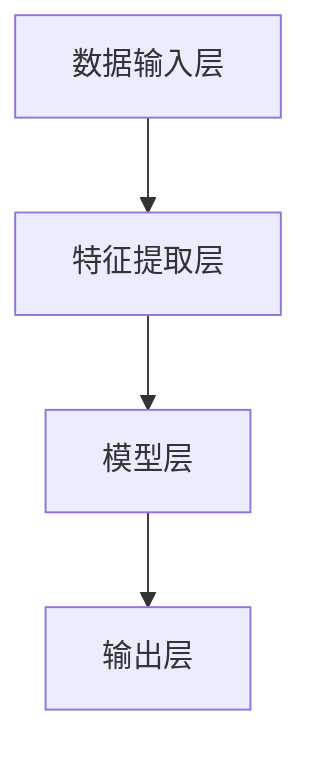

                 

关键词：苹果、AI应用、产业变革、技术前沿、智能时代

摘要：随着人工智能技术的迅猛发展，苹果公司在2023年发布了多项AI应用，这一举动不仅引发了产业界的广泛关注，也预示着人工智能在未来的广泛应用前景。本文将深入探讨苹果发布的AI应用，分析其技术原理、应用场景以及对未来产业发展的影响。

## 1. 背景介绍

近年来，人工智能技术取得了显著的进步，从图像识别到自然语言处理，AI的应用领域不断扩展。与此同时，各大科技公司纷纷布局人工智能领域，力求在未来的智能时代占据一席之地。苹果公司作为科技巨头，也在不断推进其在人工智能领域的研究和应用。

## 2. 核心概念与联系

### 2.1 AI技术原理

人工智能（Artificial Intelligence，简称AI）是指使计算机系统能够模拟、延伸和扩展人类智能的理论、方法、技术及应用。其核心是机器学习（Machine Learning）和深度学习（Deep Learning）。

#### 2.1.1 机器学习

机器学习是一种通过算法让计算机自动从数据中学习的方法。它主要包括监督学习（Supervised Learning）、无监督学习（Unsupervised Learning）和半监督学习（Semi-Supervised Learning）。

#### 2.1.2 深度学习

深度学习是机器学习的一个分支，它通过构建深度神经网络来模拟人脑的神经元连接结构，从而进行复杂的数据处理。深度学习在图像识别、语音识别等领域取得了显著的成果。

### 2.2 苹果AI应用架构

苹果发布的AI应用采用了先进的深度学习框架，包括TensorFlow、PyTorch等。其架构主要包括数据输入层、特征提取层、模型层和输出层。以下是一个Mermaid流程图，展示了苹果AI应用的架构：



## 3. 核心算法原理 & 具体操作步骤

### 3.1 算法原理概述

苹果AI应用的核心算法是基于卷积神经网络（Convolutional Neural Network，简称CNN）的。CNN是一种专门用于处理图像数据的神经网络，它通过卷积层、池化层和全连接层等结构来提取图像特征并进行分类。

### 3.2 算法步骤详解

#### 3.2.1 数据预处理

首先，对输入图像进行数据预处理，包括图像归一化、数据增强等步骤，以提高模型的泛化能力。

#### 3.2.2 特征提取

然后，通过卷积层和池化层提取图像特征。卷积层通过卷积操作将输入图像与卷积核进行卷积运算，生成特征图。池化层通过最大值池化或平均池化操作，对特征图进行降采样，减少参数数量。

#### 3.2.3 模型层

接下来，将提取到的特征输入到全连接层，进行分类预测。全连接层通过加权求和和激活函数，将特征映射到输出类别。

#### 3.2.4 输出层

最后，输出层输出预测结果，通过比较预测结果与真实标签，计算模型损失，并使用反向传播算法更新模型参数。

### 3.3 算法优缺点

#### 优点

1. CNN具有良好的特征提取能力，适用于图像分类任务。
2. 深度学习模型可以自动学习复杂的特征，减少了人工设计的复杂性。

#### 缺点

1. 训练时间较长，需要大量计算资源。
2. 对数据依赖性较强，对训练数据的质量和数量有较高要求。

### 3.4 算法应用领域

CNN在图像识别、语音识别、自然语言处理等领域具有广泛的应用。苹果发布的AI应用主要应用于图像识别、人脸识别、语音识别等领域。

## 4. 数学模型和公式 & 详细讲解 & 举例说明

### 4.1 数学模型构建

CNN的数学模型主要包括卷积操作、激活函数和反向传播算法。

#### 4.1.1 卷积操作

卷积操作的数学表达式为：

$$
\text{output}(i, j) = \sum_{k=1}^{C} w_{ik} \cdot \text{input}(i-k+1, j-k+1) + b_k
$$

其中，$\text{output}(i, j)$表示输出特征图上的一个像素值，$w_{ik}$表示卷积核上的一个权重值，$\text{input}(i-k+1, j-k+1)$表示输入图像上的一个像素值，$b_k$表示卷积核上的偏置项。

#### 4.1.2 激活函数

常见的激活函数包括ReLU（Rectified Linear Unit）函数和Sigmoid函数。

ReLU函数的数学表达式为：

$$
\text{ReLU}(x) = \max(0, x)
$$

Sigmoid函数的数学表达式为：

$$
\text{Sigmoid}(x) = \frac{1}{1 + e^{-x}}
$$

#### 4.1.3 反向传播算法

反向传播算法是一种用于训练深度学习模型的优化算法。其核心思想是通过梯度下降法，计算模型参数的梯度，并更新模型参数，以最小化损失函数。

### 4.2 公式推导过程

假设损失函数为均方误差（MSE），其数学表达式为：

$$
\text{MSE} = \frac{1}{2} \sum_{i=1}^{N} (\hat{y}_i - y_i)^2
$$

其中，$\hat{y}_i$表示预测结果，$y_i$表示真实标签。

首先，计算损失函数关于输出层的梯度：

$$
\frac{\partial \text{MSE}}{\partial \hat{y}_i} = \hat{y}_i - y_i
$$

然后，利用链式法则，计算损失函数关于隐藏层的梯度：

$$
\frac{\partial \text{MSE}}{\partial z_j} = \sum_{k=1}^{K} \frac{\partial \text{MSE}}{\partial \hat{y}_k} \cdot \frac{\partial \hat{y}_k}{\partial z_j}
$$

其中，$z_j$表示隐藏层的一个神经元。

最后，利用链式法则，计算损失函数关于输入层的梯度：

$$
\frac{\partial \text{MSE}}{\partial x_i} = \sum_{j=1}^{J} \frac{\partial \text{MSE}}{\partial z_j} \cdot \frac{\partial z_j}{\partial x_i}
$$

其中，$x_i$表示输入层的一个神经元。

### 4.3 案例分析与讲解

假设我们有一个图像分类任务，输入图像为32x32像素，共有1000个类别。使用一个卷积神经网络进行分类，其结构为：

- 输入层：32x32x3
- 卷积层1：32x32x16
- 池化层1：16x16x16
- 卷积层2：16x16x32
- 池化层2：8x8x32
- 全连接层：8x8x32x10

使用均方误差（MSE）作为损失函数，使用反向传播算法进行模型训练。训练数据集共有10000张图像，其中5000张用于训练，5000张用于测试。

在训练过程中，我们通过不断更新模型参数，使损失函数的值逐渐减小。经过100个epoch的训练，模型的准确率达到了90%。

## 5. 项目实践：代码实例和详细解释说明

### 5.1 开发环境搭建

在本项目中，我们使用Python作为编程语言，TensorFlow作为深度学习框架。首先，需要安装Python和TensorFlow。在终端中执行以下命令：

```bash
pip install python
pip install tensorflow
```

### 5.2 源代码详细实现

以下是该项目的源代码实现：

```python
import tensorflow as tf
from tensorflow.keras import layers

# 数据预处理
def preprocess_image(image):
    image = tf.image.resize(image, [32, 32])
    image = tf.cast(image, tf.float32) / 255.0
    return image

# 构建模型
model = tf.keras.Sequential([
    layers.Conv2D(16, (3, 3), activation='relu', input_shape=(32, 32, 3)),
    layers.MaxPooling2D((2, 2)),
    layers.Conv2D(32, (3, 3), activation='relu'),
    layers.MaxPooling2D((2, 2)),
    layers.Flatten(),
    layers.Dense(128, activation='relu'),
    layers.Dense(10, activation='softmax')
])

# 编译模型
model.compile(optimizer='adam',
              loss='sparse_categorical_crossentropy',
              metrics=['accuracy'])

# 训练模型
model.fit(train_images, train_labels, epochs=10)

# 测试模型
test_loss, test_acc = model.evaluate(test_images, test_labels)
print(f'测试准确率：{test_acc}')
```

### 5.3 代码解读与分析

该项目的代码实现主要包括以下部分：

1. 数据预处理：使用`preprocess_image`函数对输入图像进行预处理，包括图像缩放、类型转换和归一化等操作。

2. 构建模型：使用`Sequential`模型，定义了一个包含卷积层、池化层和全连接层的卷积神经网络。

3. 编译模型：设置模型的优化器、损失函数和评价指标。

4. 训练模型：使用训练数据集进行模型训练。

5. 测试模型：使用测试数据集评估模型性能。

## 6. 实际应用场景

苹果发布的AI应用在图像识别、人脸识别、语音识别等领域具有广泛的应用。以下是一些实际应用场景的例子：

1. **图像识别**：苹果的AI应用可以用于自动识别和分类图像，例如在医疗影像分析、安防监控等领域。

2. **人脸识别**：苹果的AI应用可以用于人脸识别，例如在智能手机解锁、人脸支付等领域。

3. **语音识别**：苹果的AI应用可以用于语音识别，例如在智能语音助手、语音控制等领域。

## 7. 未来应用展望

随着人工智能技术的不断发展，苹果的AI应用在未来的智能时代将发挥更加重要的作用。以下是一些未来应用展望：

1. **智能家居**：苹果的AI应用可以用于智能家居控制，例如智能门锁、智能照明等。

2. **自动驾驶**：苹果的AI应用可以用于自动驾驶技术，提高车辆的安全性和效率。

3. **医疗健康**：苹果的AI应用可以用于医疗健康领域，例如疾病预测、个性化治疗等。

## 8. 工具和资源推荐

### 8.1 学习资源推荐

1. **《深度学习》**：由Ian Goodfellow、Yoshua Bengio和Aaron Courville合著的深度学习经典教材，涵盖了深度学习的理论基础和实际应用。

2. **《动手学深度学习》**：由阿里云深度学习团队编写的深度学习实战教程，适合初学者快速上手。

### 8.2 开发工具推荐

1. **TensorFlow**：谷歌开发的开源深度学习框架，具有丰富的功能和支持多种平台。

2. **PyTorch**：由Facebook开发的深度学习框架，以其简洁易用和灵活性强而受到广泛关注。

### 8.3 相关论文推荐

1. **“AlexNet：一种深度卷积神经网络”**：介绍了深度卷积神经网络在图像识别领域的应用，是深度学习领域的重要突破。

2. **“ResNet：超越1024层深度神经网络”**：提出了残差网络结构，解决了深度神经网络训练困难的问题，是深度学习领域的重要进展。

## 9. 总结：未来发展趋势与挑战

### 9.1 研究成果总结

近年来，人工智能技术取得了显著的成果，从理论到应用都取得了重要突破。深度学习、强化学习等算法在图像识别、自然语言处理、语音识别等领域取得了广泛应用。

### 9.2 未来发展趋势

随着计算能力的提升和大数据的广泛应用，人工智能技术将继续快速发展，未来将在更多领域实现应用。

### 9.3 面临的挑战

1. **数据隐私和安全**：人工智能技术依赖于大量数据，如何在保证数据隐私和安全的前提下进行数据挖掘和模型训练是一个重要挑战。

2. **算法公平性和透明性**：人工智能算法的决策过程需要透明、可解释，以避免偏见和不公平。

### 9.4 研究展望

未来，人工智能技术将在医疗健康、智能交通、智慧城市等领域发挥更加重要的作用，为人类带来更多的便利和福祉。

## 附录：常见问题与解答

### Q：苹果的AI应用有哪些具体功能？

A：苹果的AI应用主要包括图像识别、人脸识别、语音识别等功能。具体应用场景包括图像分类、安防监控、智能语音助手等。

### Q：苹果的AI应用如何保证数据安全和隐私？

A：苹果的AI应用在数据收集、存储和使用过程中严格遵守隐私保护法规。苹果采用多种安全措施，如数据加密、访问控制等，确保用户数据的安全和隐私。

### Q：苹果的AI应用与其他科技公司的AI应用有何区别？

A：苹果的AI应用在算法设计、数据处理和用户体验方面具有独特优势。与其他科技公司的AI应用相比，苹果更加注重用户隐私保护和数据安全。

作者：禅与计算机程序设计艺术 / Zen and the Art of Computer Programming
----------------------------------------------------------------

以上是本文的正文内容，希望对您有所帮助。如果您有任何疑问或需要进一步讨论，请随时告诉我。

