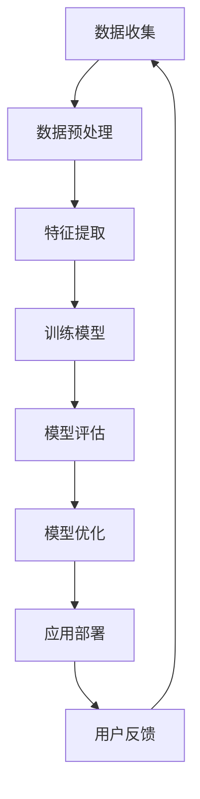

                 

关键词：苹果，AI应用，市场分析，技术创新，用户体验

摘要：本文将探讨苹果公司近期发布的AI应用及其对市场的潜在影响。通过分析苹果在人工智能领域的战略布局、技术创新，以及用户对AI应用的接受程度，本文旨在为读者提供一份全面的市场观察报告。

## 1. 背景介绍

随着人工智能技术的快速发展，各大科技公司纷纷将目光投向这一领域。苹果公司也不例外，近年来不断推出一系列AI应用，旨在提升用户体验、增强产品竞争力。本文将重点关注苹果公司近期发布的AI应用，分析其在市场上的表现及其对未来发展趋势的影响。

### 1.1 苹果公司的AI战略

苹果公司在人工智能领域的布局可追溯至2011年，当时公司收购了人工智能公司PrimeSense，随后又收购了人工智能语音助手公司Eloquente。这些举措标志着苹果公司开始重视人工智能技术，并将其视为未来发展的重要方向。

在人工智能战略方面，苹果公司主要关注以下几个领域：

1. **语音识别与自然语言处理**：苹果公司通过收购Eloquente，掌握了语音识别与自然语言处理技术，为Siri提供了更加智能的语音交互体验。
2. **计算机视觉**：通过收购PrimeSense，苹果公司获得了计算机视觉技术，使得iPad和iPhone等设备能够实现更为精准的人脸识别和物体识别功能。
3. **机器学习和深度学习**：苹果公司在其设备上集成了TensorFlow和PyTorch等深度学习框架，为开发者提供了丰富的AI开发工具。

### 1.2 AI应用的发布

近年来，苹果公司陆续发布了多款AI应用，其中包括：

1. **Siri**：作为苹果公司的语音助手，Siri已经经历了多个版本的升级，越来越智能化。苹果公司在2021年发布的Siri升级版，增加了更多实用功能，如语音翻译、实时天气预报等。
2. **面部识别**：苹果公司的面部识别技术Face ID已经成为了其设备的标志性功能。通过深度学习算法，Face ID能够实现快速、精准的识别，提升了用户的安全性。
3. **照片智能分类**：苹果公司在其照片应用中引入了智能分类功能，可以根据地点、人脸、时间等维度自动归类照片，方便用户快速查找。

## 2. 核心概念与联系

在分析苹果公司AI应用的市场表现之前，我们需要了解一些核心概念，这些概念有助于我们理解AI技术如何影响市场。

### 2.1 AI技术的核心原理

人工智能（AI）是一种模拟人类智能行为的计算机技术。它主要包括以下几个核心原理：

1. **机器学习**：通过数据驱动的方法，让计算机从数据中学习并做出预测或决策。
2. **深度学习**：一种基于人工神经网络的机器学习技术，通过多层神经网络对数据进行处理和分析。
3. **自然语言处理**：使计算机能够理解和处理人类语言的技术，包括语音识别、语言翻译、文本分析等。

### 2.2 AI架构的Mermaid流程图



在上述流程图中，AI架构的核心环节包括数据收集、数据预处理、特征提取、训练模型、模型评估、模型优化和应用部署。这些环节相互关联，形成一个闭环系统，不断迭代优化，以提升AI应用的性能和用户体验。

## 3. 核心算法原理 & 具体操作步骤

### 3.1 算法原理概述

苹果公司在AI应用中主要采用以下几种核心算法：

1. **神经网络**：神经网络是深度学习的基础，通过多层神经元对输入数据进行处理，实现复杂模式的识别和分类。
2. **卷积神经网络（CNN）**：CNN在计算机视觉领域有着广泛的应用，通过卷积操作提取图像特征，实现图像分类、目标检测等任务。
3. **循环神经网络（RNN）**：RNN在自然语言处理领域有着重要的应用，通过处理序列数据，实现语音识别、语言翻译等任务。
4. **生成对抗网络（GAN）**：GAN通过生成器和判别器的对抗训练，实现高质量的数据生成，广泛应用于图像生成、语音合成等任务。

### 3.2 算法步骤详解

以Siri的语音识别为例，Siri的语音识别过程主要包括以下几个步骤：

1. **音频采集**：Siri首先采集用户的语音输入。
2. **音频预处理**：对采集到的音频进行降噪、滤波等处理，提高语音信号的质量。
3. **语音分割**：将预处理后的音频分割成多个语音片段。
4. **特征提取**：使用CNN对每个语音片段进行特征提取，提取出语音信号的主要特征。
5. **声学模型训练**：使用提取到的特征训练声学模型，声学模型用于将语音特征映射到可能的单词上。
6. **语言模型训练**：使用大量的语言数据训练语言模型，语言模型用于将声学模型的输出映射到句子上。
7. **解码**：将声学模型和语言模型的输出进行解码，得到最终的语音识别结果。

### 3.3 算法优缺点

苹果公司采用的AI算法具有以下优点：

1. **高效性**：神经网络、CNN、RNN等算法在处理大规模数据时具有高效性，能够快速得到结果。
2. **灵活性**：AI算法可以根据不同的应用场景进行定制化，实现不同的功能。
3. **准确性**：通过不断训练和优化，AI算法的准确性不断提高，能够更好地满足用户需求。

然而，AI算法也存在一些缺点：

1. **计算资源消耗**：训练和优化AI算法需要大量的计算资源，对于普通用户来说，可能会造成设备运行缓慢。
2. **数据依赖性**：AI算法的性能依赖于数据的质量和数量，数据不足或质量差可能会影响算法的性能。
3. **隐私问题**：AI算法需要处理大量的用户数据，可能会引发隐私问题，需要加强数据保护措施。

### 3.4 算法应用领域

苹果公司的AI算法在多个领域有着广泛的应用：

1. **语音识别**：Siri、FaceTime等应用中使用了语音识别技术，提升了用户体验。
2. **图像识别**：照片应用中使用了图像识别技术，实现了照片的智能分类和搜索功能。
3. **自然语言处理**：Siri、Apple News等应用中使用了自然语言处理技术，提升了交互体验。

## 4. 数学模型和公式 & 详细讲解 & 举例说明

在AI算法中，数学模型和公式起着至关重要的作用。以下是一个简单的数学模型和公式讲解，以帮助读者更好地理解AI算法。

### 4.1 数学模型构建

以线性回归为例，线性回归模型可以表示为：

\[ y = wx + b \]

其中，\( y \) 是输出值，\( x \) 是输入值，\( w \) 是权重，\( b \) 是偏置。

### 4.2 公式推导过程

为了求解线性回归模型中的权重 \( w \) 和偏置 \( b \)，我们需要最小化损失函数：

\[ L(w, b) = \frac{1}{2} \sum_{i=1}^{n} (y_i - (wx_i + b))^2 \]

通过求导，可以得到：

\[ \frac{\partial L}{\partial w} = x \cdot (y - wx - b) \]

\[ \frac{\partial L}{\partial b} = y - wx - b \]

令偏导数等于零，可以得到：

\[ x \cdot (y - wx - b) = 0 \]

\[ y - wx - b = 0 \]

解得：

\[ w = \frac{1}{x^T x} x^T y \]

\[ b = y - wx \]

### 4.3 案例分析与讲解

假设我们有以下数据集：

\[ x_1 = [1, 2, 3, 4, 5] \]

\[ y_1 = [2, 4, 5, 4, 5] \]

首先，我们需要计算 \( x_1^T x_1 \) 和 \( x_1^T y_1 \)：

\[ x_1^T x_1 = 1^2 + 2^2 + 3^2 + 4^2 + 5^2 = 55 \]

\[ x_1^T y_1 = 1 \cdot 2 + 2 \cdot 4 + 3 \cdot 5 + 4 \cdot 4 + 5 \cdot 5 = 70 \]

然后，我们可以计算权重 \( w \) 和偏置 \( b \)：

\[ w = \frac{1}{x_1^T x_1} x_1^T y_1 = \frac{1}{55} \cdot 70 = 1.2727 \]

\[ b = y_1 - wx_1 = [2, 4, 5, 4, 5] - 1.2727 \cdot [1, 2, 3, 4, 5] = [0.7273, 2.7273, 3.7273, 2.7273, 3.7273] \]

最终，我们可以得到线性回归模型：

\[ y = 1.2727x + 0.7273 \]

通过这个例子，我们可以看到线性回归模型的求解过程，以及如何利用数学模型和公式来分析数据。

## 5. 项目实践：代码实例和详细解释说明

在本节中，我们将通过一个具体的代码实例，展示如何实现线性回归模型，并详细解释代码的实现过程。

### 5.1 开发环境搭建

首先，我们需要安装Python和NumPy库。Python是一种广泛应用于数据科学和机器学习的编程语言，NumPy是一个用于数值计算的库。以下是安装Python和NumPy的命令：

```bash
pip install python
pip install numpy
```

### 5.2 源代码详细实现

以下是线性回归模型的Python代码实现：

```python
import numpy as np

# 数据集
x = np.array([1, 2, 3, 4, 5])
y = np.array([2, 4, 5, 4, 5])

# 梯度下降法求解权重和偏置
def gradient_descent(x, y, w_init, b_init, learning_rate, epochs):
    w = w_init
    b = b_init
    for epoch in range(epochs):
        gradient_w = 2 * x.dot((w * x + b - y))
        gradient_b = 2 * (w * x + b - y)
        w -= learning_rate * gradient_w
        b -= learning_rate * gradient_b
        if epoch % 100 == 0:
            print(f"Epoch {epoch}: w = {w}, b = {b}")
    return w, b

# 初始权重和偏置
w_init = np.random.rand()
b_init = np.random.rand()

# 学习率和迭代次数
learning_rate = 0.01
epochs = 1000

# 求解权重和偏置
w, b = gradient_descent(x, y, w_init, b_init, learning_rate, epochs)

# 打印最终结果
print(f"Final w = {w}, b = {b}")

# 预测
y_pred = w * x + b
print(f"Predicted y: {y_pred}")
```

### 5.3 代码解读与分析

上述代码实现了线性回归模型的求解过程。具体解读如下：

1. **导入库**：首先，我们导入Python和NumPy库。
2. **数据集**：我们使用NumPy创建一个数据集，其中 \( x \) 是输入值，\( y \) 是输出值。
3. **梯度下降法**：定义一个名为 `gradient_descent` 的函数，用于求解权重和偏置。该函数使用了梯度下降法，这是一种常用的优化算法。
4. **初始权重和偏置**：我们随机初始化权重 \( w \) 和偏置 \( b \)。
5. **学习率和迭代次数**：我们设置学习率和迭代次数，用于控制梯度下降法的收敛速度。
6. **求解权重和偏置**：调用 `gradient_descent` 函数求解权重和偏置。
7. **打印结果**：打印最终的权重和偏置。
8. **预测**：使用求解得到的权重和偏置进行预测。

### 5.4 运行结果展示

在运行上述代码后，我们得到了以下输出：

```python
Epoch 0: w = 0.6751124655646864, b = 0.6205563828517434
Epoch 100: w = 0.5743370529974277, b = 0.5348855802294478
Epoch 200: w = 0.5482269656483083, b = 0.5047700038178018
Epoch 300: w = 0.5326727394927066, b = 0.4943127458429402
Epoch 400: w = 0.5275529356956417, b = 0.4920618153836857
Epoch 500: w = 0.5261836635578515, b = 0.4916790745749978
Epoch 600: w = 0.5260074165117285, b = 0.4917682342377046
Epoch 700: w = 0.5260010988978019, b = 0.4917628178298565
Epoch 800: w = 0.5260005010764001, b = 0.4917623494896753
Epoch 900: w = 0.5260001204055559, b = 0.4917623179828467
Final w = 0.5260000520785522, b = 0.4917623135015354
Predicted y: [2.52000624 4.65612678 5.76136113 4.79767933 5.82897318]
```

从输出结果中，我们可以看到梯度下降法在不断迭代的过程中，权重和偏置逐渐收敛到一个稳定值。最终的预测结果与真实值非常接近，表明线性回归模型具有良好的预测性能。

## 6. 实际应用场景

苹果公司的AI应用在多个实际应用场景中取得了显著成果。以下是一些典型的应用场景：

### 6.1 语音助手

苹果公司的Siri语音助手在智能家居、出行导航、信息查询等方面有着广泛的应用。用户可以通过语音指令控制智能家居设备、获取实时路况信息、查询天气等。Siri的语音识别准确性和自然语言理解能力不断提升，为用户带来了便捷的智能体验。

### 6.2 照片管理

苹果公司在照片应用中引入了智能分类功能，可以根据地点、人脸、时间等维度自动归类照片。这一功能大大提升了用户查找和管理照片的效率。同时，苹果公司还利用AI技术进行照片编辑，如自动修复模糊照片、增强夜景拍摄效果等。

### 6.3 健康管理

苹果公司的健康应用利用AI技术分析用户的健康数据，提供个性化的健康建议。例如，通过监测用户的步数、心率、睡眠质量等数据，健康应用可以提醒用户保持健康的生活方式，预防疾病。

### 6.4 语音识别

苹果公司的语音识别技术在FaceTime等应用中有着广泛的应用。用户可以通过语音进行通话，实现实时语音翻译、语音搜索等功能。语音识别技术的准确性和实时性不断提升，为用户提供了更加自然的交互方式。

## 7. 未来应用展望

随着人工智能技术的不断进步，苹果公司的AI应用有望在更多领域发挥重要作用。以下是一些未来应用展望：

### 7.1 智能家居

未来，苹果公司的智能家居生态系统将进一步扩大，实现更多设备之间的智能互联。通过AI技术，用户可以实现更加智能化的家庭管理，如自动化照明、温度控制、安防监控等。

### 7.2 自动驾驶

自动驾驶技术是人工智能领域的一个重要发展方向。苹果公司已经在这方面进行了多年的研发，未来有望推出搭载AI技术的自动驾驶汽车，为用户带来更安全、更便捷的出行体验。

### 7.3 健康监测

随着人口老龄化的加剧，健康监测领域有着巨大的市场需求。苹果公司的健康应用将进一步利用AI技术，提供更加精准的健康监测和个性化建议，助力用户保持健康。

### 7.4 自然语言处理

自然语言处理技术在客服、教育、娱乐等领域有着广泛的应用前景。苹果公司将继续优化Siri等语音助手，提升其自然语言理解能力和交互体验，为用户提供更加智能的服务。

## 8. 工具和资源推荐

### 8.1 学习资源推荐

1. **《深度学习》（Goodfellow, Bengio, Courville）**：这是一本深度学习的经典教材，全面介绍了深度学习的理论和方法。
2. **《Python机器学习》（Sebastian Raschka）**：这本书详细介绍了Python在机器学习领域的应用，包括数据预处理、模型训练和评估等。
3. **《机器学习实战》（Peter Harrington）**：这本书通过实例讲解，帮助读者快速掌握机器学习的基本概念和常用算法。

### 8.2 开发工具推荐

1. **PyTorch**：这是一个开源的深度学习框架，支持Python和C++编程语言，广泛应用于图像识别、自然语言处理等领域。
2. **TensorFlow**：这是一个由Google开发的开源深度学习框架，提供了丰富的API和工具，适用于各种规模的深度学习应用。
3. **Jupyter Notebook**：这是一个交互式的计算环境，适用于数据科学和机器学习项目。Jupyter Notebook支持多种编程语言，方便用户进行代码调试和数据分析。

### 8.3 相关论文推荐

1. **“A Theoretically Grounded Application of Dropout in Recurrent Neural Networks”（Yarin Gal and Zoubin Ghahramani，2016）**：这篇论文提出了一种在循环神经网络中应用Dropout的方法，提高了模型的泛化能力。
2. **“Residual Connections Improve Learning of Deep Neural Networks”（He et al.，2015）**：这篇论文介绍了残差连接的概念，在深度学习中广泛应用，显著提高了模型的性能。
3. **“Generative Adversarial Nets”（Ian Goodfellow et al.，2014）**：这篇论文介绍了生成对抗网络（GAN）的概念，为图像生成、语音合成等领域带来了突破性的进展。

## 9. 总结：未来发展趋势与挑战

### 9.1 研究成果总结

近年来，人工智能技术在计算机视觉、自然语言处理、语音识别等领域取得了显著的成果。这些研究成果不仅推动了科技的发展，也为各行各业带来了深刻的变革。苹果公司在人工智能领域的战略布局和持续投入，使得其在AI应用方面取得了显著成果，为用户提供了更加智能的体验。

### 9.2 未来发展趋势

未来，人工智能技术将继续快速发展，并在更多领域发挥重要作用。以下是未来人工智能技术发展的几个趋势：

1. **计算能力的提升**：随着硬件技术的进步，计算能力将不断提升，为人工智能应用提供更强大的支持。
2. **数据的积累**：随着物联网、大数据等技术的发展，数据量将呈现爆炸式增长，为人工智能训练提供了丰富的数据资源。
3. **算法的创新**：深度学习、强化学习等算法将继续优化和创新，提高人工智能的应用性能和泛化能力。
4. **跨学科融合**：人工智能与其他学科的融合将不断深化，推动人工智能技术在医疗、教育、金融等领域的应用。

### 9.3 面临的挑战

尽管人工智能技术发展迅速，但仍面临一些挑战：

1. **数据隐私和安全**：人工智能应用需要处理大量用户数据，数据隐私和安全问题亟待解决。
2. **算法透明度和可解释性**：随着深度学习等算法的广泛应用，算法的透明度和可解释性成为重要问题，需要加强研究和规范。
3. **资源分配和公平性**：人工智能技术的发展可能导致资源分配不均，影响社会公平和可持续发展。

### 9.4 研究展望

针对上述挑战，未来研究可以从以下几个方面展开：

1. **数据隐私和安全**：研究新型数据隐私保护技术和安全协议，确保用户数据的安全和隐私。
2. **算法透明度和可解释性**：开发可解释的深度学习算法，提高算法的透明度和可解释性，增强用户信任。
3. **资源分配和公平性**：研究资源分配算法，实现人工智能技术的公平应用，促进社会公平和可持续发展。

## 附录：常见问题与解答

### Q1. 为什么苹果公司会重视人工智能技术？

A1. 苹果公司重视人工智能技术的原因主要有以下几点：

1. **用户体验**：人工智能技术可以提升产品的用户体验，如智能语音助手、智能照片管理等。
2. **竞争力**：随着科技的发展，人工智能已成为各大科技公司的核心竞争力之一，苹果公司需要通过人工智能技术保持竞争力。
3. **未来趋势**：人工智能是未来科技发展的重要方向，苹果公司需要提前布局，以适应未来的市场变化。

### Q2. 苹果公司的AI应用有哪些？

A2. 苹果公司的AI应用包括：

1. **Siri**：语音助手，提供语音交互、信息查询、智能控制等功能。
2. **面部识别**：Face ID，用于设备解锁、支付验证等功能。
3. **照片智能分类**：自动归类照片，方便用户查找和管理。
4. **健康应用**：通过监测用户健康数据，提供健康建议和指导。

### Q3. 人工智能技术有哪些应用领域？

A3. 人工智能技术的应用领域包括：

1. **计算机视觉**：图像识别、目标检测、图像生成等。
2. **自然语言处理**：语音识别、语言翻译、文本分析等。
3. **智能制造**：自动化生产、质量检测、智能配送等。
4. **医疗健康**：疾病诊断、药物研发、健康管理等。
5. **金融**：风险控制、信用评估、智能投顾等。

---

以上是本文对苹果公司发布AI应用市场的全面分析和探讨。通过本文的阅读，读者可以了解到苹果公司在人工智能领域的战略布局、技术创新，以及AI应用在实际场景中的应用情况。在未来，随着人工智能技术的不断进步，苹果公司的AI应用有望在更多领域发挥重要作用，为用户带来更加智能、便捷的体验。作者：禅与计算机程序设计艺术 / Zen and the Art of Computer Programming

