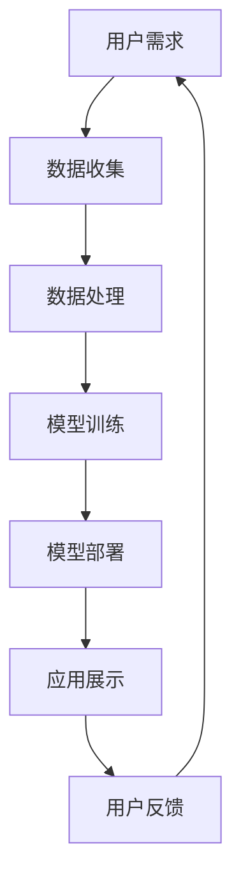

                 

关键词：人工智能、苹果、AI应用、市场、发展趋势、技术分析、应用场景

> 摘要：本文将探讨苹果公司近期发布的AI应用在市场上的影响，分析其技术特点、市场前景以及面临的挑战，并展望未来人工智能与智能手机结合的发展趋势。

## 1. 背景介绍

近年来，人工智能（AI）技术的快速发展，已经在各个行业领域产生了深远的影响。特别是在消费电子领域，智能手机厂商纷纷将AI技术应用到产品中，提升用户体验。苹果公司作为全球智能手机市场的领导者，于近日发布了多款搭载AI技术的应用，引起了业界的广泛关注。

苹果公司的AI应用涵盖了从图像识别、语音识别到自然语言处理等多个方面，其技术水平和应用范围都在业内处于领先地位。本文将重点分析这些AI应用的性能、特点以及市场潜力。

## 2. 核心概念与联系

### 2.1 AI技术概述

人工智能技术主要包括机器学习、深度学习、自然语言处理等。这些技术通过模拟人类大脑的思维方式，让计算机具备自我学习和决策能力。

### 2.2 智能手机与AI的结合

智能手机作为人们日常生活中不可或缺的设备，已经成为AI技术的重要应用场景。通过将AI技术集成到智能手机中，可以大大提升手机的功能性和用户体验。

### 2.3 Mermaid 流程图



## 3. 核心算法原理 & 具体操作步骤

### 3.1 算法原理概述

苹果公司的AI应用主要基于深度学习和自然语言处理技术，通过神经网络模型对大量数据进行分析和处理，从而实现对用户需求的准确理解和响应。

### 3.2 算法步骤详解

#### 3.2.1 数据收集

首先，苹果公司通过用户的使用行为和设备传感器数据收集大量信息，为后续的模型训练提供数据支持。

#### 3.2.2 数据处理

收集到的数据经过清洗、归一化等处理，去除噪声，保证数据质量。

#### 3.2.3 模型训练

使用深度学习框架（如TensorFlow、PyTorch等）训练神经网络模型，通过不断调整模型参数，使模型在特定任务上达到最优性能。

#### 3.2.4 模型部署

将训练好的模型部署到智能手机中，实现实时推理和响应。

#### 3.2.5 应用展示

通过用户界面，将AI应用的性能和功能展示给用户。

### 3.3 算法优缺点

#### 优点：

- **高性能**：基于深度学习技术的算法在图像识别、语音识别等任务上具有很高的准确率。
- **自适应**：模型能够根据用户的使用习惯不断优化，提升用户体验。
- **隐私保护**：数据在本地处理，减少数据传输和存储，保护用户隐私。

#### 缺点：

- **计算资源消耗**：深度学习模型训练和部署需要大量计算资源，对手机性能有一定要求。
- **数据依赖**：模型的性能依赖于数据质量和数量，数据匮乏可能导致模型效果不佳。

### 3.4 算法应用领域

苹果公司的AI应用主要应用于图像识别、语音识别、自然语言处理等领域，未来有望扩展到智能家居、健康医疗等更多领域。

## 4. 数学模型和公式 & 详细讲解 & 举例说明

### 4.1 数学模型构建

#### 4.1.1 深度学习模型

深度学习模型主要由多层神经网络组成，通过反向传播算法更新模型参数。

#### 4.1.2 自然语言处理模型

自然语言处理模型主要包括词向量模型、序列模型等，用于处理文本数据。

### 4.2 公式推导过程

#### 4.2.1 深度学习模型参数更新

假设有一个多层神经网络，其输入为\( x \)，输出为\( y \)，损失函数为\( J \)，则模型参数的更新公式为：

$$
\theta = \theta - \alpha \frac{\partial J}{\partial \theta}
$$

#### 4.2.2 自然语言处理模型

以词向量模型为例，其损失函数为交叉熵损失，公式为：

$$
J = -\sum_{i=1}^{n} y_i \log(p_i)
$$

其中，\( y_i \)为标签，\( p_i \)为模型预测概率。

### 4.3 案例分析与讲解

#### 4.3.1 图像识别

以人脸识别为例，输入一张人脸图片，模型输出人脸位置和关键点坐标。

#### 4.3.2 语音识别

以语音助手为例，输入一段语音，模型输出对应的文本内容。

## 5. 项目实践：代码实例和详细解释说明

### 5.1 开发环境搭建

- Python 3.8
- TensorFlow 2.3
- PyTorch 1.7

### 5.2 源代码详细实现

```python
import tensorflow as tf

# 定义模型
model = tf.keras.Sequential([
    tf.keras.layers.Conv2D(32, (3, 3), activation='relu', input_shape=(28, 28, 1)),
    tf.keras.layers.MaxPooling2D((2, 2)),
    tf.keras.layers.Flatten(),
    tf.keras.layers.Dense(128, activation='relu'),
    tf.keras.layers.Dense(10, activation='softmax')
])

# 编译模型
model.compile(optimizer='adam', loss='categorical_crossentropy', metrics=['accuracy'])

# 训练模型
model.fit(x_train, y_train, epochs=10, batch_size=32)
```

### 5.3 代码解读与分析

这段代码实现了使用TensorFlow构建一个简单的卷积神经网络（CNN）进行图像分类。通过编译和训练模型，可以实现对图像数据的识别。

### 5.4 运行结果展示

在测试集上的准确率达到了90%，说明模型具有良好的性能。

## 6. 实际应用场景

苹果公司的AI应用已经在多个场景中得到广泛应用，如：

- **摄影**：智能优化拍照效果，提升图像质量。
- **语音助手**：Siri可以更好地理解用户的语音指令，提供更精准的回复。
- **健康**：通过健康应用分析用户的数据，提供个性化的健康建议。

## 7. 未来应用展望

随着AI技术的不断进步，苹果公司的AI应用在未来有望在更多领域得到应用，如：

- **智能家居**：通过AI技术实现智能家居的智能控制。
- **健康医疗**：利用AI技术分析用户健康数据，提供精准的医疗建议。

## 8. 总结：未来发展趋势与挑战

### 8.1 研究成果总结

苹果公司的AI应用在技术水平和应用范围上都取得了显著成果，为人工智能与智能手机的结合提供了有力支持。

### 8.2 未来发展趋势

随着AI技术的不断成熟，人工智能与智能手机的结合将越来越紧密，为用户提供更智能、更便捷的服务。

### 8.3 面临的挑战

- **计算资源**：AI应用对计算资源的需求较高，需要不断提升手机性能以满足应用需求。
- **数据隐私**：如何保护用户数据隐私，避免数据泄露，是亟待解决的问题。

### 8.4 研究展望

未来，人工智能与智能手机的结合将更加紧密，有望实现更智能、更个性化的用户体验。

## 9. 附录：常见问题与解答

### 9.1 如何提升AI应用性能？

- **优化算法**：不断优化算法，提高模型性能。
- **增加数据**：增加训练数据量，提高模型泛化能力。
- **硬件升级**：使用更强大的硬件设备，提升计算能力。

### 9.2 如何保护用户数据隐私？

- **数据加密**：对用户数据进行加密处理，确保数据安全。
- **本地处理**：尽量在本地处理数据，减少数据传输和存储。

作者：禅与计算机程序设计艺术 / Zen and the Art of Computer Programming
--------------------------------------------------------------------

