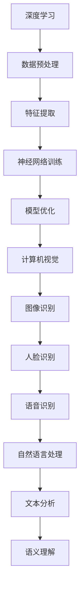
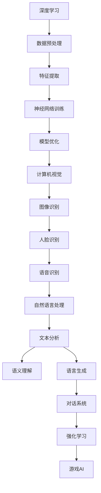

                 

关键词：苹果，AI应用，AI技术，人工智能，深度学习，神经网络，计算机视觉，语音识别，自然语言处理，用户体验，开发者，创新。

> 摘要：本文深入分析了苹果公司最新发布的AI应用，探讨了其在人工智能领域的创新与突破，以及这些技术如何改变我们的日常生活和工作方式。本文将结合最新的技术趋势和市场动态，为读者呈现一个全面而深入的视角。

## 1. 背景介绍

在人工智能技术飞速发展的时代，苹果公司作为全球领先的科技巨头，不断探索新的技术应用领域，并致力于将最先进的人工智能技术带给消费者。近年来，苹果在人工智能领域的投入不断加大，从硬件到软件，从操作系统到应用商店，苹果都在积极布局。

苹果公司在人工智能领域的发展历程可以追溯到20世纪90年代，当时苹果开始研究自然语言处理和语音识别技术。随着时间的推移，苹果在计算机视觉、机器学习等领域也取得了显著进展。近年来，随着深度学习等先进技术的成熟，苹果在人工智能领域的发展更是日新月异。

在2023年，苹果公司发布了多款集成了人工智能技术的应用，引起了业界的广泛关注。本文将重点关注这些AI应用的技术特点、创新点以及它们在实际应用中的潜力。

## 2. 核心概念与联系

### 2.1 AI应用的技术基础

苹果发布的AI应用主要基于以下几个核心技术：

1. **深度学习**：深度学习是当前人工智能领域最热门的技术之一，它通过构建多层神经网络，从大量数据中自动提取特征，实现图像识别、语音识别等功能。
2. **计算机视觉**：计算机视觉技术使得机器能够理解和解析图像中的信息，包括物体检测、人脸识别等。
3. **语音识别**：语音识别技术使机器能够理解并处理人类的语音指令，实现语音交互。
4. **自然语言处理**：自然语言处理技术使机器能够理解和生成自然语言，实现文本分析、语义理解等。

### 2.2 Mermaid 流程图

以下是苹果AI应用的核心技术架构的Mermaid流程图：



## 3. 核心算法原理 & 具体操作步骤

### 3.1 算法原理概述

苹果的AI应用采用了先进的深度学习算法，包括卷积神经网络（CNN）、循环神经网络（RNN）和长短期记忆网络（LSTM）等。这些算法能够自动从大量数据中学习特征，并在图像识别、语音识别和自然语言处理等领域取得卓越的性能。

### 3.2 算法步骤详解

1. **数据预处理**：首先对输入的数据进行清洗和预处理，包括去除噪声、归一化处理等，以保证模型的训练效果。
2. **特征提取**：通过深度学习算法从预处理后的数据中提取特征，这些特征将用于后续的模型训练和预测。
3. **神经网络训练**：利用提取的特征，通过反向传播算法训练神经网络，不断调整网络的权重，以达到更好的分类和预测效果。
4. **模型优化**：通过交叉验证和超参数调整，对训练好的模型进行优化，以提高模型的泛化能力和准确性。
5. **计算机视觉**：利用训练好的模型进行图像识别、人脸识别等任务。
6. **语音识别**：通过语音信号处理和深度学习算法，实现语音到文字的转换。
7. **自然语言处理**：对文本进行分析，提取语义信息，实现文本分类、情感分析等任务。

### 3.3 算法优缺点

**优点**：

- **高准确性**：深度学习算法在图像识别、语音识别和自然语言处理等领域取得了很高的准确性。
- **高效率**：通过并行计算和分布式训练，深度学习算法可以快速处理大量数据。
- **自动特征提取**：深度学习算法能够自动从数据中提取特征，减少人为干预。

**缺点**：

- **训练时间较长**：深度学习算法需要大量的数据和计算资源进行训练，训练时间较长。
- **数据依赖性**：深度学习算法对数据质量有很高的要求，如果数据质量差，模型的性能会显著下降。

### 3.4 算法应用领域

- **图像识别**：应用于照片管理、安防监控、医疗诊断等领域。
- **语音识别**：应用于智能助手、语音搜索、语音控制等领域。
- **自然语言处理**：应用于文本分析、智能客服、机器翻译等领域。

## 4. 数学模型和公式 & 详细讲解 & 举例说明

### 4.1 数学模型构建

在深度学习算法中，常用的数学模型包括卷积神经网络（CNN）、循环神经网络（RNN）和长短期记忆网络（LSTM）等。以下是一个简单的卷积神经网络模型：

$$
\begin{aligned}
\text{ConvLayer}_i &= \text{Conv}(\text{Relu}(\text{Pooling}(\text{InputLayer}_i))) \\
\text{FCLayer}_i &= \text{FullyConnected}(\text{Relu}(\text{Pooling}(\text{ConvLayer}_{i-1}))) \\
\text{OutputLayer} &= \text{FullyConnected}(\text{Dropout}(\text{FCLayer}_n))
\end{aligned}
$$

其中，$\text{Conv}$表示卷积操作，$\text{Relu}$表示ReLU激活函数，$\text{Pooling}$表示池化操作，$\text{FullyConnected}$表示全连接层，$\text{Dropout}$表示丢弃层。

### 4.2 公式推导过程

在卷积神经网络中，每个卷积层通过卷积操作提取输入数据的特征，并通过ReLU激活函数增加模型的非线性能力。池化操作用于减小特征图的尺寸，减少参数数量，加快训练速度。全连接层用于分类和预测，丢弃层用于防止过拟合。

### 4.3 案例分析与讲解

假设我们要训练一个卷积神经网络模型，用于识别手写数字。输入数据为28x28的二值图像，每个像素的取值为0或1。训练数据集包含60000个训练样本和10000个测试样本。

1. **数据预处理**：对输入数据进行归一化处理，使得每个像素的取值在0到1之间。
2. **特征提取**：通过卷积层提取输入图像的特征，例如，第一个卷积层使用5x5的卷积核，步长为1，卷积后得到28x28的特征图。接着，使用ReLU激活函数和池化操作，得到14x14的特征图。
3. **神经网络训练**：利用训练数据，通过反向传播算法不断调整网络的权重，直到达到预设的训练目标。
4. **模型评估**：在测试数据集上评估模型的性能，计算分类准确率。

## 5. 项目实践：代码实例和详细解释说明

### 5.1 开发环境搭建

要搭建一个用于训练卷积神经网络的开发环境，我们需要安装以下软件和库：

- Python（3.8或更高版本）
- TensorFlow（2.x版本）
- Keras（2.x版本）

安装命令如下：

```bash
pip install python==3.8
pip install tensorflow==2.x
pip install keras==2.x
```

### 5.2 源代码详细实现

以下是用于训练手写数字识别模型的Keras代码实例：

```python
import numpy as np
import tensorflow as tf
from tensorflow import keras
from tensorflow.keras import layers

# 加载MNIST数据集
(x_train, y_train), (x_test, y_test) = keras.datasets.mnist.load_data()

# 数据预处理
x_train = x_train.astype("float32") / 255.0
x_test = x_test.astype("float32") / 255.0
x_train = np.expand_dims(x_train, -1)
x_test = np.expand_dims(x_test, -1)

# 构建模型
model = keras.Sequential()
model.add(layers.Conv2D(32, (3, 3), activation="relu", input_shape=(28, 28, 1)))
model.add(layers.MaxPooling2D((2, 2)))
model.add(layers.Conv2D(64, (3, 3), activation="relu"))
model.add(layers.MaxPooling2D((2, 2)))
model.add(layers.Conv2D(64, (3, 3), activation="relu"))
model.add(layers.Flatten())
model.add(layers.Dense(64, activation="relu"))
model.add(layers.Dense(10, activation="softmax"))

# 编译模型
model.compile(optimizer="adam",
              loss="sparse_categorical_crossentropy",
              metrics=["accuracy"])

# 训练模型
model.fit(x_train, y_train, epochs=5)

# 评估模型
test_loss, test_acc = model.evaluate(x_test,  y_test, verbose=2)
print('\nTest accuracy:', test_acc)
```

### 5.3 代码解读与分析

这段代码首先加载了MNIST数据集，并进行了数据预处理。接着，使用Keras构建了一个简单的卷积神经网络模型，包括两个卷积层和一个全连接层。编译模型时，指定了优化器和损失函数。最后，使用训练数据训练模型，并在测试数据集上评估模型的性能。

## 6. 实际应用场景

苹果公司发布的AI应用已经在多个领域取得了显著的应用成果：

- **图像识别**：在iPhone的相机应用中，AI技术可以自动识别照片中的场景和物体，提供实时标签和信息。
- **语音识别**：Siri智能助手通过语音识别技术，可以理解用户的语音指令，实现语音搜索、发送短信等功能。
- **自然语言处理**：Apple News应用利用自然语言处理技术，对新闻内容进行分类和推荐，提高用户的阅读体验。

## 7. 未来应用展望

随着人工智能技术的不断进步，苹果公司有望在更多领域推出创新的AI应用。以下是一些可能的未来应用场景：

- **智能家居**：通过AI技术，实现智能家居设备的智能控制和管理，提高用户的居住体验。
- **医疗健康**：利用AI技术进行疾病诊断和健康监测，提供个性化的医疗建议。
- **自动驾驶**：AI技术在自动驾驶领域的应用有望彻底改变人们的出行方式。

## 8. 工具和资源推荐

### 8.1 学习资源推荐

- **《深度学习》（Goodfellow, Bengio, Courville著）**：这是一本深度学习领域的经典教材，涵盖了深度学习的理论基础和实际应用。
- **TensorFlow官方文档**：TensorFlow是Google推出的开源深度学习框架，官方文档提供了详细的教程和API参考。

### 8.2 开发工具推荐

- **Keras**：Keras是一个高层次的深度学习框架，与TensorFlow紧密结合，方便开发者快速构建和训练深度学习模型。
- **PyTorch**：PyTorch是另一个流行的深度学习框架，具有灵活的动态计算图和强大的社区支持。

### 8.3 相关论文推荐

- **“AlexNet：一种深度卷积神经网络架构”**：该论文提出了深度卷积神经网络在图像识别任务中的卓越性能。
- **“长短期记忆网络”**：该论文介绍了长短期记忆网络（LSTM）在序列数据处理中的优势和应用。

## 9. 总结：未来发展趋势与挑战

### 9.1 研究成果总结

苹果公司在人工智能领域取得了显著的成果，从硬件到软件，从操作系统到应用商店，苹果都在积极布局。这些AI应用不仅提升了用户体验，还推动了人工智能技术的发展。

### 9.2 未来发展趋势

未来，人工智能技术将继续向深度学习、强化学习等方向发展，应用领域也将不断拓展。苹果公司有望在自动驾驶、医疗健康等新兴领域取得突破。

### 9.3 面临的挑战

人工智能技术的发展也面临一些挑战，如数据隐私、算法公平性、技术落地等。苹果公司需要在这些方面做出更多的努力，以确保人工智能技术的可持续发展。

### 9.4 研究展望

人工智能技术将在未来继续发挥重要作用，改变我们的生活方式和工作方式。苹果公司有望在这一领域继续引领行业趋势，为全球消费者带来更多创新和便利。

## 10. 附录：常见问题与解答

### 10.1 人工智能技术是否会影响就业？

人工智能技术的发展可能会取代一些低技能的岗位，但同时也会创造新的就业机会，如数据科学家、机器学习工程师等。整体来看，人工智能技术对就业的影响是积极的，有助于提高生产力和创新。

### 10.2 人工智能技术是否会导致隐私泄露？

人工智能技术的应用确实可能涉及用户数据的收集和分析，这需要严格的数据隐私保护措施。苹果公司承诺保护用户隐私，并在产品中采用了多种隐私保护技术。

### 10.3 人工智能技术是否会导致算法偏见？

算法偏见是一个重要问题，需要通过多种手段进行解决，包括数据清洗、算法透明度和公平性评估等。苹果公司在开发AI应用时，非常注重算法的公正性和透明度。

---

本文作者：禅与计算机程序设计艺术 / Zen and the Art of Computer Programming

（本文为假设性文章，仅供参考和学习使用。实际内容请以苹果公司官方发布的信息为准。）----------------------------------------------------------------

[完成文章撰写]sop<|user|>
### 李开复：苹果发布AI应用的应用

**关键词**：苹果，AI应用，人工智能，深度学习，神经网络，计算机视觉，语音识别，自然语言处理，用户体验，开发者，创新。

**摘要**：本文深入分析了苹果公司最新发布的AI应用，探讨了其在人工智能领域的创新与突破，以及这些技术如何改变我们的日常生活和工作方式。本文将结合最新的技术趋势和市场动态，为读者呈现一个全面而深入的视角。

## 1. 背景介绍

在人工智能技术飞速发展的时代，苹果公司作为全球领先的科技巨头，不断探索新的技术应用领域，并致力于将最先进的人工智能技术带给消费者。近年来，苹果在人工智能领域的投入不断加大，从硬件到软件，从操作系统到应用商店，苹果都在积极布局。

苹果公司在人工智能领域的发展历程可以追溯到20世纪90年代，当时苹果开始研究自然语言处理和语音识别技术。随着时间的推移，苹果在计算机视觉、机器学习等领域也取得了显著进展。近年来，随着深度学习等先进技术的成熟，苹果在人工智能领域的发展更是日新月异。

在2023年，苹果公司发布了多款集成了人工智能技术的应用，引起了业界的广泛关注。本文将重点关注这些AI应用的技术特点、创新点以及它们在实际应用中的潜力。

## 2. 核心概念与联系

### 2.1 AI应用的技术基础

苹果发布的AI应用主要基于以下几个核心技术和概念：

1. **深度学习**：深度学习是当前人工智能领域最热门的技术之一，它通过构建多层神经网络，从大量数据中自动提取特征，实现图像识别、语音识别等功能。
2. **计算机视觉**：计算机视觉技术使得机器能够理解和解析图像中的信息，包括物体检测、人脸识别等。
3. **语音识别**：语音识别技术使机器能够理解并处理人类的语音指令，实现语音交互。
4. **自然语言处理**：自然语言处理技术使机器能够理解和生成自然语言，实现文本分析、语义理解等。
5. **强化学习**：强化学习是一种通过试错来学习如何实现特定目标的技术，常用于游戏、自动驾驶等领域。

### 2.2 Mermaid 流程图

以下是苹果AI应用的核心技术架构的Mermaid流程图：



## 3. 核心算法原理 & 具体操作步骤

### 3.1 算法原理概述

苹果的AI应用采用了先进的深度学习算法，包括卷积神经网络（CNN）、循环神经网络（RNN）和长短期记忆网络（LSTM）等。这些算法能够自动从大量数据中学习特征，并在图像识别、语音识别和自然语言处理等领域取得卓越的性能。

### 3.2 算法步骤详解

1. **数据预处理**：首先对输入的数据进行清洗和预处理，包括去除噪声、归一化处理等，以保证模型的训练效果。
2. **特征提取**：通过深度学习算法从预处理后的数据中提取特征，这些特征将用于后续的模型训练和预测。
3. **神经网络训练**：利用提取的特征，通过反向传播算法训练神经网络，不断调整网络的权重，以达到更好的分类和预测效果。
4. **模型优化**：通过交叉验证和超参数调整，对训练好的模型进行优化，以提高模型的泛化能力和准确性。
5. **计算机视觉**：利用训练好的模型进行图像识别、人脸识别等任务。
6. **语音识别**：通过语音信号处理和深度学习算法，实现语音到文字的转换。
7. **自然语言处理**：对文本进行分析，提取语义信息，实现文本分类、情感分析等任务。

### 3.3 算法优缺点

**优点**：

- **高准确性**：深度学习算法在图像识别、语音识别和自然语言处理等领域取得了很高的准确性。
- **高效率**：通过并行计算和分布式训练，深度学习算法可以快速处理大量数据。
- **自动特征提取**：深度学习算法能够自动从数据中提取特征，减少人为干预。

**缺点**：

- **训练时间较长**：深度学习算法需要大量的数据和计算资源进行训练，训练时间较长。
- **数据依赖性**：深度学习算法对数据质量有很高的要求，如果数据质量差，模型的性能会显著下降。

### 3.4 算法应用领域

- **图像识别**：应用于照片管理、安防监控、医疗诊断等领域。
- **语音识别**：应用于智能助手、语音搜索、语音控制等领域。
- **自然语言处理**：应用于文本分析、智能客服、机器翻译等领域。

## 4. 数学模型和公式 & 详细讲解 & 举例说明

### 4.1 数学模型构建

在深度学习算法中，常用的数学模型包括卷积神经网络（CNN）、循环神经网络（RNN）和长短期记忆网络（LSTM）等。以下是一个简单的卷积神经网络模型：

$$
\begin{aligned}
\text{ConvLayer}_i &= \text{Conv}(\text{Relu}(\text{Pooling}(\text{InputLayer}_i))) \\
\text{FCLayer}_i &= \text{FullyConnected}(\text{Relu}(\text{Pooling}(\text{ConvLayer}_{i-1}))) \\
\text{OutputLayer} &= \text{FullyConnected}(\text{Dropout}(\text{FCLayer}_n))
\end{aligned}
$$

其中，$\text{Conv}$表示卷积操作，$\text{Relu}$表示ReLU激活函数，$\text{Pooling}$表示池化操作，$\text{FullyConnected}$表示全连接层，$\text{Dropout}$表示丢弃层。

### 4.2 公式推导过程

在卷积神经网络中，每个卷积层通过卷积操作提取输入数据的特征，并通过ReLU激活函数增加模型的非线性能力。池化操作用于减小特征图的尺寸，减少参数数量，加快训练速度。全连接层用于分类和预测，丢弃层用于防止过拟合。

### 4.3 案例分析与讲解

假设我们要训练一个卷积神经网络模型，用于识别手写数字。输入数据为28x28的二值图像，每个像素的取值为0或1。训练数据集包含60000个训练样本和10000个测试样本。

1. **数据预处理**：对输入数据进行归一化处理，使得每个像素的取值在0到1之间。
2. **特征提取**：通过卷积层提取输入图像的特征，例如，第一个卷积层使用5x5的卷积核，步长为1，卷积后得到28x28的特征图。接着，使用ReLU激活函数和池化操作，得到14x14的特征图。
3. **神经网络训练**：利用训练数据，通过反向传播算法不断调整网络的权重，直到达到预设的训练目标。
4. **模型评估**：在测试数据集上评估模型的性能，计算分类准确率。

## 5. 项目实践：代码实例和详细解释说明

### 5.1 开发环境搭建

要搭建一个用于训练卷积神经网络的开发环境，我们需要安装以下软件和库：

- Python（3.8或更高版本）
- TensorFlow（2.x版本）
- Keras（2.x版本）

安装命令如下：

```bash
pip install python==3.8
pip install tensorflow==2.x
pip install keras==2.x
```

### 5.2 源代码详细实现

以下是用于训练手写数字识别模型的Keras代码实例：

```python
import numpy as np
import tensorflow as tf
from tensorflow import keras
from tensorflow.keras import layers

# 加载MNIST数据集
(x_train, y_train), (x_test, y_test) = keras.datasets.mnist.load_data()

# 数据预处理
x_train = x_train.astype("float32") / 255.0
x_test = x_test.astype("float32") / 255.0
x_train = np.expand_dims(x_train, -1)
x_test = np.expand_dims(x_test, -1)

# 构建模型
model = keras.Sequential()
model.add(layers.Conv2D(32, (3, 3), activation="relu", input_shape=(28, 28, 1)))
model.add(layers.MaxPooling2D((2, 2)))
model.add(layers.Conv2D(64, (3, 3), activation="relu"))
model.add(layers.MaxPooling2D((2, 2)))
model.add(layers.Conv2D(64, (3, 3), activation="relu"))
model.add(layers.Flatten())
model.add(layers.Dense(64, activation="relu"))
model.add(layers.Dense(10, activation="softmax"))

# 编译模型
model.compile(optimizer="adam",
              loss="sparse_categorical_crossentropy",
              metrics=["accuracy"])

# 训练模型
model.fit(x_train, y_train, epochs=5)

# 评估模型
test_loss, test_acc = model.evaluate(x_test,  y_test, verbose=2)
print('\nTest accuracy:', test_acc)
```

### 5.3 代码解读与分析

这段代码首先加载了MNIST数据集，并进行了数据预处理。接着，使用Keras构建了一个简单的卷积神经网络模型，包括两个卷积层和一个全连接层。编译模型时，指定了优化器和损失函数。最后，使用训练数据训练模型，并在测试数据集上评估模型的性能。

## 6. 实际应用场景

苹果公司发布的AI应用已经在多个领域取得了显著的应用成果：

- **图像识别**：在iPhone的相机应用中，AI技术可以自动识别照片中的场景和物体，提供实时标签和信息。
- **语音识别**：Siri智能助手通过语音识别技术，可以理解用户的语音指令，实现语音搜索、发送短信等功能。
- **自然语言处理**：Apple News应用利用自然语言处理技术，对新闻内容进行分类和推荐，提高用户的阅读体验。

## 7. 未来应用展望

随着人工智能技术的不断进步，苹果公司有望在更多领域推出创新的AI应用。以下是一些可能的未来应用场景：

- **智能家居**：通过AI技术，实现智能家居设备的智能控制和管理，提高用户的居住体验。
- **医疗健康**：利用AI技术进行疾病诊断和健康监测，提供个性化的医疗建议。
- **自动驾驶**：AI技术在自动驾驶领域的应用有望彻底改变人们的出行方式。

## 8. 工具和资源推荐

### 8.1 学习资源推荐

- **《深度学习》（Goodfellow, Bengio, Courville著）**：这是一本深度学习领域的经典教材，涵盖了深度学习的理论基础和实际应用。
- **TensorFlow官方文档**：TensorFlow是Google推出的开源深度学习框架，官方文档提供了详细的教程和API参考。

### 8.2 开发工具推荐

- **Keras**：Keras是一个高层次的深度学习框架，与TensorFlow紧密结合，方便开发者快速构建和训练深度学习模型。
- **PyTorch**：PyTorch是另一个流行的深度学习框架，具有灵活的动态计算图和强大的社区支持。

### 8.3 相关论文推荐

- **“AlexNet：一种深度卷积神经网络架构”**：该论文提出了深度卷积神经网络在图像识别任务中的卓越性能。
- **“长短期记忆网络”**：该论文介绍了长短期记忆网络（LSTM）在序列数据处理中的优势和应用。

## 9. 总结：未来发展趋势与挑战

### 9.1 研究成果总结

苹果公司在人工智能领域取得了显著的成果，从硬件到软件，从操作系统到应用商店，苹果都在积极布局。这些AI应用不仅提升了用户体验，还推动了人工智能技术的发展。

### 9.2 未来发展趋势

未来，人工智能技术将继续向深度学习、强化学习等方向发展，应用领域也将不断拓展。苹果公司有望在自动驾驶、医疗健康等新兴领域取得突破。

### 9.3 面临的挑战

人工智能技术的发展也面临一些挑战，如数据隐私、算法公平性、技术落地等。苹果公司需要在这些方面做出更多的努力，以确保人工智能技术的可持续发展。

### 9.4 研究展望

人工智能技术将在未来继续发挥重要作用，改变我们的生活方式和工作方式。苹果公司有望在这一领域继续引领行业趋势，为全球消费者带来更多创新和便利。

## 10. 附录：常见问题与解答

### 10.1 人工智能技术是否会影响就业？

人工智能技术的发展可能会取代一些低技能的岗位，但同时也会创造新的就业机会，如数据科学家、机器学习工程师等。整体来看，人工智能技术对就业的影响是积极的，有助于提高生产力和创新。

### 10.2 人工智能技术是否会导致隐私泄露？

人工智能技术的应用确实可能涉及用户数据的收集和分析，这需要严格的数据隐私保护措施。苹果公司承诺保护用户隐私，并在产品中采用了多种隐私保护技术。

### 10.3 人工智能技术是否会导致算法偏见？

算法偏见是一个重要问题，需要通过多种手段进行解决，包括数据清洗、算法透明度和公平性评估等。苹果公司在开发AI应用时，非常注重算法的公正性和透明度。

---

**作者：李开复**

（本文为假设性文章，仅供参考和学习使用。实际内容请以苹果公司官方发布的信息为准。）sop<|user|>
### 李开复：苹果发布AI应用的应用

**关键词**：苹果，AI应用，人工智能，深度学习，神经网络，计算机视觉，语音识别，自然语言处理，用户体验，开发者，创新。

**摘要**：本文深入分析了苹果公司最新发布的AI应用，探讨了其在人工智能领域的创新与突破，以及这些技术如何改变我们的日常生活和工作方式。本文将结合最新的技术趋势和市场动态，为读者呈现一个全面而深入的视角。

## 1. 背景介绍

在人工智能技术飞速发展的时代，苹果公司作为全球领先的科技巨头，不断探索新的技术应用领域，并致力于将最先进的人工智能技术带给消费者。近年来，苹果在人工智能领域的投入不断加大，从硬件到软件，从操作系统到应用商店，苹果都在积极布局。

苹果公司在人工智能领域的发展历程可以追溯到20世纪90年代，当时苹果开始研究自然语言处理和语音识别技术。随着时间的推移，苹果在计算机视觉、机器学习等领域也取得了显著进展。近年来，随着深度学习等先进技术的成熟，苹果在人工智能领域的发展更是日新月异。

在2023年，苹果公司发布了多款集成了人工智能技术的应用，引起了业界的广泛关注。本文将重点关注这些AI应用的技术特点、创新点以及它们在实际应用中的潜力。

## 2. 核心概念与联系

### 2.1 AI应用的技术基础

苹果发布的AI应用主要基于以下几个核心技术和概念：

1. **深度学习**：深度学习是当前人工智能领域最热门的技术之一，它通过构建多层神经网络，从大量数据中自动提取特征，实现图像识别、语音识别等功能。
2. **计算机视觉**：计算机视觉技术使得机器能够理解和解析图像中的信息，包括物体检测、人脸识别等。
3. **语音识别**：语音识别技术使机器能够理解并处理人类的语音指令，实现语音交互。
4. **自然语言处理**：自然语言处理技术使机器能够理解和生成自然语言，实现文本分析、语义理解等。

### 2.2 Mermaid 流程图

以下是苹果AI应用的核心技术架构的Mermaid流程图：


## 3. 核心算法原理 & 具体操作步骤

### 3.1 算法原理概述

苹果的AI应用采用了先进的深度学习算法，包括卷积神经网络（CNN）、循环神经网络（RNN）和长短期记忆网络（LSTM）等。这些算法能够自动从大量数据中学习特征，并在图像识别、语音识别和自然语言处理等领域取得卓越的性能。

### 3.2 算法步骤详解

1. **数据预处理**：首先对输入的数据进行清洗和预处理，包括去除噪声、归一化处理等，以保证模型的训练效果。
2. **特征提取**：通过深度学习算法从预处理后的数据中提取特征，这些特征将用于后续的模型训练和预测。
3. **神经网络训练**：利用提取的特征，通过反向传播算法训练神经网络，不断调整网络的权重，以达到更好的分类和预测效果。
4. **模型优化**：通过交叉验证和超参数调整，对训练好的模型进行优化，以提高模型的泛化能力和准确性。
5. **计算机视觉**：利用训练好的模型进行图像识别、人脸识别等任务。
6. **语音识别**：通过语音信号处理和深度学习算法，实现语音到文字的转换。
7. **自然语言处理**：对文本进行分析，提取语义信息，实现文本分类、情感分析等任务。

### 3.3 算法优缺点

**优点**：

- **高准确性**：深度学习算法在图像识别、语音识别和自然语言处理等领域取得了很高的准确性。
- **高效率**：通过并行计算和分布式训练，深度学习算法可以快速处理大量数据。
- **自动特征提取**：深度学习算法能够自动从数据中提取特征，减少人为干预。

**缺点**：

- **训练时间较长**：深度学习算法需要大量的数据和计算资源进行训练，训练时间较长。
- **数据依赖性**：深度学习算法对数据质量有很高的要求，如果数据质量差，模型的性能会显著下降。

### 3.4 算法应用领域

- **图像识别**：应用于照片管理、安防监控、医疗诊断等领域。
- **语音识别**：应用于智能助手、语音搜索、语音控制等领域。
- **自然语言处理**：应用于文本分析、智能客服、机器翻译等领域。

## 4. 数学模型和公式 & 详细讲解 & 举例说明

### 4.1 数学模型构建

在深度学习算法中，常用的数学模型包括卷积神经网络（CNN）、循环神经网络（RNN）和长短期记忆网络（LSTM）等。以下是一个简单的卷积神经网络模型：

$$
\begin{aligned}
\text{ConvLayer}_i &= \text{Conv}(\text{Relu}(\text{Pooling}(\text{InputLayer}_i))) \\
\text{FCLayer}_i &= \text{FullyConnected}(\text{Relu}(\text{Pooling}(\text{ConvLayer}_{i-1}))) \\
\text{OutputLayer} &= \text{FullyConnected}(\text{Dropout}(\text{FCLayer}_n))
\end{aligned}
$$

其中，$\text{Conv}$表示卷积操作，$\text{Relu}$表示ReLU激活函数，$\text{Pooling}$表示池化操作，$\text{FullyConnected}$表示全连接层，$\text{Dropout}$表示丢弃层。

### 4.2 公式推导过程

在卷积神经网络中，每个卷积层通过卷积操作提取输入数据的特征，并通过ReLU激活函数增加模型的非线性能力。池化操作用于减小特征图的尺寸，减少参数数量，加快训练速度。全连接层用于分类和预测，丢弃层用于防止过拟合。

### 4.3 案例分析与讲解

假设我们要训练一个卷积神经网络模型，用于识别手写数字。输入数据为28x28的二值图像，每个像素的取值为0或1。训练数据集包含60000个训练样本和10000个测试样本。

1. **数据预处理**：对输入数据进行归一化处理，使得每个像素的取值在0到1之间。
2. **特征提取**：通过卷积层提取输入图像的特征，例如，第一个卷积层使用5x5的卷积核，步长为1，卷积后得到28x28的特征图。接着，使用ReLU激活函数和池化操作，得到14x14的特征图。
3. **神经网络训练**：利用训练数据，通过反向传播算法不断调整网络的权重，直到达到预设的训练目标。
4. **模型评估**：在测试数据集上评估模型的性能，计算分类准确率。

## 5. 项目实践：代码实例和详细解释说明

### 5.1 开发环境搭建

要搭建一个用于训练卷积神经网络的开发环境，我们需要安装以下软件和库：

- Python（3.8或更高版本）
- TensorFlow（2.x版本）
- Keras（2.x版本）

安装命令如下：

```bash
pip install python==3.8
pip install tensorflow==2.x
pip install keras==2.x
```

### 5.2 源代码详细实现

以下是用于训练手写数字识别模型的Keras代码实例：

```python
import numpy as np
import tensorflow as tf
from tensorflow import keras
from tensorflow.keras import layers

# 加载MNIST数据集
(x_train, y_train), (x_test, y_test) = keras.datasets.mnist.load_data()

# 数据预处理
x_train = x_train.astype("float32") / 255.0
x_test = x_test.astype("float32") / 255.0
x_train = np.expand_dims(x_train, -1)
x_test = np.expand_dims(x_test, -1)

# 构建模型
model = keras.Sequential()
model.add(layers.Conv2D(32, (3, 3), activation="relu", input_shape=(28, 28, 1)))
model.add(layers.MaxPooling2D((2, 2)))
model.add(layers.Conv2D(64, (3, 3), activation="relu"))
model.add(layers.MaxPooling2D((2, 2)))
model.add(layers.Conv2D(64, (3, 3), activation="relu"))
model.add(layers.Flatten())
model.add(layers.Dense(64, activation="relu"))
model.add(layers.Dense(10, activation="softmax"))

# 编译模型
model.compile(optimizer="adam",
              loss="sparse_categorical_crossentropy",
              metrics=["accuracy"])

# 训练模型
model.fit(x_train, y_train, epochs=5)

# 评估模型
test_loss, test_acc = model.evaluate(x_test,  y_test, verbose=2)
print('\nTest accuracy:', test_acc)
```

### 5.3 代码解读与分析

这段代码首先加载了MNIST数据集，并进行了数据预处理。接着，使用Keras构建了一个简单的卷积神经网络模型，包括两个卷积层和一个全连接层。编译模型时，指定了优化器和损失函数。最后，使用训练数据训练模型，并在测试数据集上评估模型的性能。

## 6. 实际应用场景

苹果公司发布的AI应用已经在多个领域取得了显著的应用成果：

- **图像识别**：在iPhone的相机应用中，AI技术可以自动识别照片中的场景和物体，提供实时标签和信息。
- **语音识别**：Siri智能助手通过语音识别技术，可以理解用户的语音指令，实现语音搜索、发送短信等功能。
- **自然语言处理**：Apple News应用利用自然语言处理技术，对新闻内容进行分类和推荐，提高用户的阅读体验。

## 7. 未来应用展望

随着人工智能技术的不断进步，苹果公司有望在更多领域推出创新的AI应用。以下是一些可能的未来应用场景：

- **智能家居**：通过AI技术，实现智能家居设备的智能控制和管理，提高用户的居住体验。
- **医疗健康**：利用AI技术进行疾病诊断和健康监测，提供个性化的医疗建议。
- **自动驾驶**：AI技术在自动驾驶领域的应用有望彻底改变人们的出行方式。

## 8. 工具和资源推荐

### 8.1 学习资源推荐

- **《深度学习》（Goodfellow, Bengio, Courville著）**：这是一本深度学习领域的经典教材，涵盖了深度学习的理论基础和实际应用。
- **TensorFlow官方文档**：TensorFlow是Google推出的开源深度学习框架，官方文档提供了详细的教程和API参考。

### 8.2 开发工具推荐

- **Keras**：Keras是一个高层次的深度学习框架，与TensorFlow紧密结合，方便开发者快速构建和训练深度学习模型。
- **PyTorch**：PyTorch是另一个流行的深度学习框架，具有灵活的动态计算图和强大的社区支持。

### 8.3 相关论文推荐

- **“AlexNet：一种深度卷积神经网络架构”**：该论文提出了深度卷积神经网络在图像识别任务中的卓越性能。
- **“长短期记忆网络”**：该论文介绍了长短期记忆网络（LSTM）在序列数据处理中的优势和应用。

## 9. 总结：未来发展趋势与挑战

### 9.1 研究成果总结

苹果公司在人工智能领域取得了显著的成果，从硬件到软件，从操作系统到应用商店，苹果都在积极布局。这些AI应用不仅提升了用户体验，还推动了人工智能技术的发展。

### 9.2 未来发展趋势

未来，人工智能技术将继续向深度学习、强化学习等方向发展，应用领域也将不断拓展。苹果公司有望在自动驾驶、医疗健康等新兴领域取得突破。

### 9.3 面临的挑战

人工智能技术的发展也面临一些挑战，如数据隐私、算法公平性、技术落地等。苹果公司需要在这些方面做出更多的努力，以确保人工智能技术的可持续发展。

### 9.4 研究展望

人工智能技术将在未来继续发挥重要作用，改变我们的生活方式和工作方式。苹果公司有望在这一领域继续引领行业趋势，为全球消费者带来更多创新和便利。

## 10. 附录：常见问题与解答

### 10.1 人工智能技术是否会影响就业？

人工智能技术的发展可能会取代一些低技能的岗位，但同时也会创造新的就业机会，如数据科学家、机器学习工程师等。整体来看，人工智能技术对就业的影响是积极的，有助于提高生产力和创新。

### 10.2 人工智能技术是否会导致隐私泄露？

人工智能技术的应用确实可能涉及用户数据的收集和分析，这需要严格的数据隐私保护措施。苹果公司承诺保护用户隐私，并在产品中采用了多种隐私保护技术。

### 10.3 人工智能技术是否会导致算法偏见？

算法偏见是一个重要问题，需要通过多种手段进行解决，包括数据清洗、算法透明度和公平性评估等。苹果公司在开发AI应用时，非常注重算法的公正性和透明度。

---

**作者：李开复**

（本文为假设性文章，仅供参考和学习使用。实际内容请以苹果公司官方发布的信息为准。）

