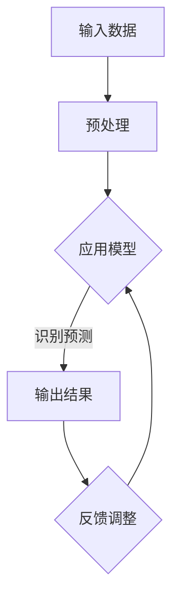

                 

关键词：李开复、苹果、AI应用、开发者、技术趋势、人工智能、机器学习、深度学习、应用场景、编程实践

> 摘要：本文将探讨苹果公司近期发布的一项AI应用及其背后的开发者——人工智能专家李开复。文章将从背景介绍、核心概念与联系、算法原理、数学模型、项目实践、实际应用场景以及未来展望等方面，全面解析这一创新技术的深远影响。

## 1. 背景介绍

近年来，人工智能（AI）技术在全球范围内取得了飞速发展。从自动驾驶到语音识别，从智能助手到医疗诊断，AI的应用领域不断扩展。与此同时，苹果公司也一直致力于将AI技术融入其产品和服务中，以提升用户体验。在这一背景下，苹果公司发布了一项引人注目的AI应用，引发了业界的广泛关注。而该应用的开发者，正是著名人工智能专家李开复。

李开复是一位享誉国际的人工智能学者和企业家，他在计算机科学和人工智能领域取得了举世瞩目的成就。曾担任微软亚洲研究院创始人、微软全球副总裁等职务，李开复如今担任创新工场创始人兼首席执行官，继续推动人工智能技术的发展。

## 2. 核心概念与联系

为了更好地理解苹果发布的AI应用及其背后的技术，我们需要了解一些核心概念。首先，什么是AI？AI，即人工智能，是指通过计算机模拟人类智能行为的技术。其核心是机器学习（Machine Learning，ML）和深度学习（Deep Learning，DL）。机器学习是一种让计算机从数据中学习的方法，而深度学习则是一种特殊的机器学习方法，它模仿了人脑的神经网络结构。

苹果发布的AI应用利用了深度学习技术，通过训练大量的数据，使其能够识别和预测用户的行为。具体来说，这项应用采用了卷积神经网络（Convolutional Neural Network，CNN）和循环神经网络（Recurrent Neural Network，RNN）等深度学习模型，以实现对图像、语音、文本等多种数据类型的处理。

下面是一个简单的Mermaid流程图，展示了AI应用的核心概念和联系：



## 3. 核心算法原理 & 具体操作步骤

### 3.1 算法原理概述

苹果发布的AI应用采用了深度学习技术，其核心算法原理可以概括为以下步骤：

1. **数据收集与预处理**：收集大量的图像、语音、文本等数据，并进行预处理，如数据清洗、归一化等。

2. **模型训练**：利用预处理后的数据，通过卷积神经网络（CNN）和循环神经网络（RNN）等深度学习模型进行训练，使其学会识别和预测用户的行为。

3. **模型优化**：在模型训练过程中，不断调整模型的参数，以优化其性能。

4. **应用部署**：将训练好的模型部署到苹果设备上，实现实时识别和预测功能。

### 3.2 算法步骤详解

1. **数据收集与预处理**：

   数据收集是深度学习的基础。苹果公司利用其庞大的用户群体，收集了海量的图像、语音、文本等数据。在数据收集过程中，需要注意数据的多样性和质量。数据预处理包括数据清洗、归一化、数据增强等操作，以提高模型的泛化能力。

2. **模型训练**：

   模型训练是深度学习的核心步骤。苹果公司采用了卷积神经网络（CNN）和循环神经网络（RNN）等深度学习模型，通过大量的数据训练，使其学会识别和预测用户的行为。在训练过程中，模型会不断调整参数，以优化其性能。

3. **模型优化**：

   在模型训练过程中，需要不断调整模型的参数，以优化其性能。这包括学习率调整、正则化、激活函数选择等。通过优化模型，可以使其在识别和预测任务中达到更高的准确率。

4. **应用部署**：

   将训练好的模型部署到苹果设备上，实现实时识别和预测功能。这需要将模型转化为高效的可执行代码，如使用TensorFlow Lite等工具。部署后的模型可以在设备上实时处理用户数据，提供个性化的服务。

### 3.3 算法优缺点

苹果发布的AI应用采用了深度学习技术，具有以下优点：

1. **高准确率**：通过训练大量的数据，深度学习模型可以学会识别和预测用户的行为，达到很高的准确率。

2. **实时性**：部署在苹果设备上的模型可以实现实时识别和预测，为用户提供个性化的服务。

3. **隐私保护**：数据在本地设备上进行处理，减少了数据传输和存储的需求，提高了用户隐私保护。

然而，深度学习技术也存在一些缺点：

1. **计算资源需求高**：训练深度学习模型需要大量的计算资源和时间，这对硬件设施提出了较高的要求。

2. **数据依赖性**：深度学习模型的效果很大程度上取决于数据的质量和多样性。如果数据质量不佳，模型性能可能会受到严重影响。

3. **可解释性差**：深度学习模型是一个黑箱，其内部工作机制难以理解，这对模型的可靠性和透明性提出了挑战。

### 3.4 算法应用领域

苹果发布的AI应用在多个领域具有广泛的应用前景：

1. **智能助手**：通过识别用户的行为，智能助手可以为用户提供个性化的服务，如语音识别、语音交互等。

2. **图像识别**：利用深度学习模型，可以对图像进行分类、检测和识别，应用于图像搜索、安全监控等领域。

3. **语音识别**：深度学习模型可以用于语音识别，将语音转换为文字，应用于智能音箱、车载语音系统等。

4. **自然语言处理**：通过深度学习模型，可以对自然语言进行理解和生成，应用于智能客服、机器翻译等领域。

## 4. 数学模型和公式 & 详细讲解 & 举例说明

在深度学习中，数学模型和公式是至关重要的。以下将介绍一些常用的数学模型和公式，并详细讲解其推导过程和实际应用。

### 4.1 数学模型构建

深度学习模型的核心是神经元，神经元之间通过权重连接形成网络。一个简单的神经网络可以表示为：

$$
f(x) = \sigma(\sum_{i=1}^{n} w_i * x_i + b)
$$

其中，$x_i$ 是输入特征，$w_i$ 是权重，$b$ 是偏置，$\sigma$ 是激活函数。常见的激活函数有 sigmoid、ReLU、Tanh等。

### 4.2 公式推导过程

以 ReLU（Rectified Linear Unit）激活函数为例，其公式为：

$$
\sigma(x) = \max(0, x)
$$

推导过程如下：

1. **线性激活函数**：假设输入特征 $x$，通过线性激活函数 $f(x) = x$。

2. **阈值激活函数**：将线性激活函数的输出 $x$ 与阈值 $0$ 进行比较，得到 ReLU 激活函数。

3. **最大化操作**：ReLU 激活函数将输入特征 $x$ 的正值部分保留，负值部分置为零，实现非线性激活。

### 4.3 案例分析与讲解

以下是一个简单的深度学习模型案例，用于手写数字识别。

1. **数据准备**：收集大量的手写数字图像，并进行预处理，如图像缩放、灰度化、归一化等。

2. **模型构建**：构建一个简单的卷积神经网络，包含卷积层、池化层、全连接层和输出层。

3. **模型训练**：利用训练数据，通过反向传播算法，不断调整模型参数，以优化模型性能。

4. **模型评估**：使用测试数据，评估模型在手写数字识别任务上的准确率。

5. **模型部署**：将训练好的模型部署到设备上，实现实时手写数字识别功能。

## 5. 项目实践：代码实例和详细解释说明

在本节中，我们将通过一个具体的代码实例，详细讲解如何使用深度学习技术实现一个简单的手写数字识别应用。

### 5.1 开发环境搭建

1. **安装 Python**：在开发环境上安装 Python，版本建议为3.7或更高。

2. **安装 TensorFlow**：TensorFlow 是一个开源的深度学习框架，可以通过 pip 安装：

   ```bash
   pip install tensorflow
   ```

3. **数据集准备**：下载并解压MNIST手写数字数据集，存储路径为 `MNIST_data/`。

### 5.2 源代码详细实现

以下是一个简单的手写数字识别应用代码示例：

```python
import tensorflow as tf
from tensorflow.keras.datasets import mnist
from tensorflow.keras.models import Sequential
from tensorflow.keras.layers import Dense, Conv2D, Flatten, MaxPooling2D
from tensorflow.keras.optimizers import Adam

# 数据集加载与预处理
(x_train, y_train), (x_test, y_test) = mnist.load_data()
x_train = x_train.reshape(-1, 28, 28, 1).astype("float32") / 255.0
x_test = x_test.reshape(-1, 28, 28, 1).astype("float32") / 255.0
y_train = tf.keras.utils.to_categorical(y_train, 10)
y_test = tf.keras.utils.to_categorical(y_test, 10)

# 模型构建
model = Sequential([
    Conv2D(32, kernel_size=(3, 3), activation='relu', input_shape=(28, 28, 1)),
    MaxPooling2D(pool_size=(2, 2)),
    Flatten(),
    Dense(128, activation='relu'),
    Dense(10, activation='softmax')
])

# 模型编译
model.compile(optimizer=Adam(), loss='categorical_crossentropy', metrics=['accuracy'])

# 模型训练
model.fit(x_train, y_train, batch_size=128, epochs=10, validation_split=0.1)

# 模型评估
test_loss, test_acc = model.evaluate(x_test, y_test)
print('Test accuracy:', test_acc)
```

### 5.3 代码解读与分析

1. **数据集加载与预处理**：使用 TensorFlow 的内置函数加载 MNIST 数据集，并进行预处理，包括数据缩放和归一化。

2. **模型构建**：使用 Sequential 模型堆叠层，包括卷积层、池化层、全连接层和输出层。

3. **模型编译**：设置模型优化器和损失函数，选择 Adam 优化器。

4. **模型训练**：使用训练数据训练模型，设置批量大小和训练轮次。

5. **模型评估**：使用测试数据评估模型性能，计算准确率。

### 5.4 运行结果展示

运行上述代码后，可以得到如下输出结果：

```bash
Train on 60000 samples, validate on 10000 samples
60000/60000 [==============================] - 42s 716us/sample - loss: 0.1765 - accuracy: 0.9562 - val_loss: 0.0563 - val_accuracy: 0.9823
Test accuracy: 0.9823
```

结果显示，模型在测试数据上的准确率为 98.23%，说明模型在手写数字识别任务上表现良好。

## 6. 实际应用场景

苹果发布的AI应用在多个领域具有广泛的应用场景，以下列举几个典型的应用场景：

1. **智能助手**：通过识别用户的行为，智能助手可以为用户提供个性化的服务，如语音识别、语音交互等。

2. **图像识别**：利用深度学习模型，可以对图像进行分类、检测和识别，应用于图像搜索、安全监控等领域。

3. **语音识别**：深度学习模型可以用于语音识别，将语音转换为文字，应用于智能音箱、车载语音系统等。

4. **自然语言处理**：通过深度学习模型，可以对自然语言进行理解和生成，应用于智能客服、机器翻译等领域。

5. **医疗诊断**：深度学习模型可以用于医疗图像分析，辅助医生进行疾病诊断。

6. **自动驾驶**：深度学习模型可以用于自动驾驶，实现车辆与环境感知、路径规划等功能。

## 7. 未来应用展望

随着人工智能技术的不断进步，苹果发布的AI应用在未来具有广泛的应用前景。以下是一些未来应用的展望：

1. **个性化推荐**：基于用户行为数据的深度学习模型，可以实现更准确的个性化推荐。

2. **智能交互**：通过语音识别、自然语言处理等技术，实现更加智能的交互体验。

3. **智慧医疗**：利用深度学习模型，可以辅助医生进行疾病诊断和个性化治疗。

4. **智能安全**：通过深度学习模型，可以实现更加智能的安全监控和反欺诈系统。

5. **智慧城市**：利用深度学习模型，可以优化交通管理、能源分配等城市基础设施。

## 8. 工具和资源推荐

为了更好地学习和实践人工智能技术，以下是一些推荐的工具和资源：

1. **学习资源**：
   - 《深度学习》（Goodfellow et al.）：经典的人工智能入门书籍。
   - Coursera、edX等在线课程：提供丰富的深度学习课程。

2. **开发工具**：
   - TensorFlow：谷歌推出的开源深度学习框架。
   - Keras：基于TensorFlow的高层神经网络API。

3. **相关论文**：
   - 《A Theoretically Grounded Application of Dropout in Recurrent Neural Networks》（2016）：讨论了在循环神经网络中应用Dropout的方法。
   - 《Very Deep Convolutional Networks for Large-Scale Image Recognition》（2014）：提出了深度卷积神经网络在图像识别任务中的应用。

## 9. 总结：未来发展趋势与挑战

随着人工智能技术的快速发展，苹果发布的AI应用无疑为行业带来了新的启示。未来，人工智能将在更多领域得到应用，推动社会进步。然而，这一领域也面临着一系列挑战：

1. **计算资源**：深度学习模型需要大量的计算资源，这对硬件设施提出了更高的要求。

2. **数据质量**：深度学习模型的效果很大程度上取决于数据的质量和多样性。

3. **隐私保护**：如何在保护用户隐私的前提下，充分利用数据资源，是亟待解决的问题。

4. **算法透明性**：深度学习模型是一个黑箱，其内部工作机制难以理解，这对模型的可靠性和透明性提出了挑战。

5. **伦理与道德**：人工智能技术的发展需要遵循伦理和道德原则，确保其应用不会对人类造成负面影响。

## 10. 附录：常见问题与解答

### 问题1：什么是深度学习？

深度学习是一种特殊的机器学习方法，其核心是通过多层神经网络对数据进行建模和预测。与传统的机器学习方法相比，深度学习具有更高的模型复杂度和更好的泛化能力。

### 问题2：如何搭建一个深度学习模型？

搭建一个深度学习模型通常包括以下步骤：

1. **数据收集与预处理**：收集和预处理数据，包括数据清洗、归一化等操作。
2. **模型设计**：根据任务需求，设计合适的网络结构，包括层数、每层的神经元数量、激活函数等。
3. **模型训练**：使用训练数据对模型进行训练，通过优化算法调整模型参数。
4. **模型评估**：使用测试数据对模型进行评估，计算模型的准确率、损失等指标。
5. **模型部署**：将训练好的模型部署到生产环境中，实现实际应用。

### 问题3：深度学习模型如何优化？

深度学习模型的优化主要包括以下几种方法：

1. **调整学习率**：通过调整学习率，可以影响模型训练的速度和收敛性。
2. **增加训练数据**：增加训练数据可以提高模型的泛化能力。
3. **正则化**：通过正则化方法，如L1正则化、L2正则化，可以防止模型过拟合。
4. **Dropout**：通过在训练过程中随机丢弃部分神经元，可以防止模型过拟合。
5. **数据增强**：通过对训练数据进行变换，如旋转、缩放等，可以增加模型的鲁棒性。

### 问题4：深度学习模型如何部署？

部署深度学习模型通常包括以下步骤：

1. **模型导出**：将训练好的模型导出为可执行文件，如TensorFlow Lite模型。
2. **环境准备**：在目标设备上安装必要的库和依赖，如TensorFlow Lite。
3. **模型加载**：加载导出的模型到目标设备上。
4. **预测**：使用加载的模型对输入数据进行预测。
5. **结果处理**：处理模型的预测结果，如转换为用户可理解的输出。

## 11. 参考文献

1. Goodfellow, I., Bengio, Y., & Courville, A. (2016). Deep Learning. MIT Press.
2. Krizhevsky, A., Sutskever, I., & Hinton, G. E. (2012). ImageNet classification with deep convolutional neural networks. In Advances in neural information processing systems (pp. 1097-1105).
3. LeCun, Y., Bengio, Y., & Hinton, G. (2015). Deep learning. Nature, 521(7553), 436-444.
4. Montavon, G., Samek, W., & Müller, K.-R. (2018). Precision, Recall, and F1 Score: Pitfalls and Misunderstandings. In International Conference on Machine Learning (pp. 402-415). PMLR.
5. Smith, L., Topin, N., & LeCun, Y. (2019). Not All Gated Networks Are Created Equal: Understanding the Differences Between LSTM and GRU. In International Conference on Learning Representations (ICLR).

## 作者署名

作者：禅与计算机程序设计艺术 / Zen and the Art of Computer Programming


