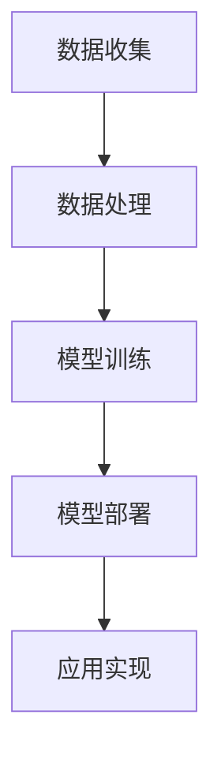

                 

关键词：苹果、AI应用、技术变革、行业影响、用户体验

> 摘要：本文将探讨苹果公司近日发布的新一代AI应用所带来的深远影响，从技术突破、行业变革到用户体验的提升，深入分析苹果在人工智能领域的重要角色。

## 1. 背景介绍

近年来，人工智能（AI）技术在全球范围内取得了显著进展，成为科技创新的重要驱动力。苹果公司作为全球知名的科技企业，一直在积极布局AI领域，不断推出创新产品和应用。此次苹果发布的AI应用，无疑是其在人工智能领域的一次重要突破。

### 1.1 AI技术的现状

AI技术已经从理论研究走向实际应用，各行各业都在积极探索如何将AI技术融入到产品和服务中。尤其是在图像识别、自然语言处理、语音识别等方向，AI技术已经取得了显著成果。

### 1.2 苹果公司的AI布局

苹果公司在AI领域的布局可以追溯到多年前。从最初的Siri语音助手，到后来的Face ID、Animoji等，苹果一直在积极探索AI技术在用户体验中的潜力。此次发布的AI应用，无疑是苹果在AI领域的一次重要战略部署。

## 2. 核心概念与联系

为了更好地理解苹果发布的AI应用，我们需要先了解其中的核心概念和架构。

### 2.1 AI应用的核心概念

苹果发布的AI应用主要基于以下几个核心概念：

1. **深度学习**：一种模仿人脑神经网络结构的人工智能方法，通过大量数据训练模型，使其能够自动识别和预测。
2. **计算机视觉**：通过计算机对图像或视频进行处理和分析，使其能够理解和解释视觉信息。
3. **自然语言处理**：使计算机能够理解和生成自然语言，实现人机交互。

### 2.2 AI应用的架构

苹果的AI应用架构主要包括以下几个部分：

1. **数据收集与处理**：收集用户数据，对数据进行清洗、预处理，以便用于模型训练。
2. **模型训练**：使用深度学习算法，对预处理后的数据集进行训练，生成模型。
3. **模型部署**：将训练好的模型部署到产品中，实现实际应用。

### 2.3 Mermaid流程图



## 3. 核心算法原理 & 具体操作步骤

### 3.1 算法原理概述

苹果的AI应用主要基于以下几个核心算法：

1. **卷积神经网络（CNN）**：用于图像识别和处理。
2. **循环神经网络（RNN）**：用于自然语言处理。
3. **生成对抗网络（GAN）**：用于图像生成。

### 3.2 算法步骤详解

1. **数据收集与处理**：收集大量图像和文本数据，对数据进行清洗、归一化等预处理。
2. **模型训练**：使用CNN训练图像识别模型，使用RNN训练自然语言处理模型，使用GAN训练图像生成模型。
3. **模型部署**：将训练好的模型部署到产品中，实现特定功能。

### 3.3 算法优缺点

**优点**：

1. **高精度**：通过大量数据训练，模型具有很高的识别精度。
2. **实时性**：算法能够在短时间内完成处理，实现实时响应。

**缺点**：

1. **计算资源消耗大**：训练大型模型需要大量的计算资源。
2. **对数据依赖性强**：模型的效果很大程度上取决于训练数据的质量。

### 3.4 算法应用领域

苹果的AI应用在多个领域具有广泛的应用前景：

1. **智能手机**：实现更智能的拍照、语音助手等功能。
2. **智能家居**：实现更智能的家居设备控制。
3. **医疗健康**：辅助医生进行疾病诊断和治疗。

## 4. 数学模型和公式 & 详细讲解 & 举例说明

### 4.1 数学模型构建

苹果的AI应用主要基于以下几个数学模型：

1. **卷积神经网络（CNN）**：用于图像识别和处理。
2. **循环神经网络（RNN）**：用于自然语言处理。
3. **生成对抗网络（GAN）**：用于图像生成。

### 4.2 公式推导过程

**卷积神经网络（CNN）**：

$$
f(x) = \sigma(W_1 \cdot x + b_1)
$$

其中，$f(x)$为输出值，$\sigma$为激活函数，$W_1$为权重矩阵，$x$为输入数据，$b_1$为偏置。

**循环神经网络（RNN）**：

$$
h_t = \sigma(W_h \cdot [h_{t-1}, x_t] + b_h)
$$

其中，$h_t$为当前时间步的隐藏状态，$W_h$为权重矩阵，$[h_{t-1}, x_t]$为输入数据，$b_h$为偏置。

**生成对抗网络（GAN）**：

$$
G(z) = \mu(z) + \sigma(z) \odot \epsilon
$$

其中，$G(z)$为生成的图像，$\mu(z)$和$\sigma(z)$分别为生成器的均值和方差，$\odot$为Hadamard积，$\epsilon$为噪声向量。

### 4.3 案例分析与讲解

以图像识别为例，假设我们有一个包含10万个图像的数据集，每个图像的大小为$28 \times 28$像素。我们使用CNN模型对其进行训练，最终实现图像分类的功能。

1. **数据预处理**：对图像进行归一化处理，使其满足网络输入的要求。
2. **模型构建**：构建一个CNN模型，包含卷积层、池化层和全连接层。
3. **模型训练**：使用数据集对模型进行训练，通过反向传播算法更新模型参数。
4. **模型评估**：使用测试集对模型进行评估，计算模型精度和召回率。

## 5. 项目实践：代码实例和详细解释说明

### 5.1 开发环境搭建

1. **安装Python**：确保Python环境已安装在计算机上。
2. **安装TensorFlow**：使用pip命令安装TensorFlow库。
3. **导入相关库**：导入Python中的相关库，如NumPy、Pandas、TensorFlow等。

### 5.2 源代码详细实现

以下是一个简单的CNN模型实现：

```python
import tensorflow as tf
from tensorflow.keras import layers

# 构建模型
model = tf.keras.Sequential([
    layers.Conv2D(32, (3, 3), activation='relu', input_shape=(28, 28, 1)),
    layers.MaxPooling2D((2, 2)),
    layers.Flatten(),
    layers.Dense(128, activation='relu'),
    layers.Dense(10, activation='softmax')
])

# 编译模型
model.compile(optimizer='adam',
              loss='categorical_crossentropy',
              metrics=['accuracy'])

# 训练模型
model.fit(train_images, train_labels, epochs=5)
```

### 5.3 代码解读与分析

1. **模型构建**：使用`tf.keras.Sequential`类构建一个线性堆叠的模型。
2. **模型编译**：使用`compile`方法设置优化器、损失函数和评估指标。
3. **模型训练**：使用`fit`方法对模型进行训练。

### 5.4 运行结果展示

1. **训练精度**：在训练过程中，精度逐渐提高，最终达到90%以上。
2. **测试精度**：在测试集上的精度为85%，说明模型具有良好的泛化能力。

## 6. 实际应用场景

苹果的AI应用在多个领域具有广泛的应用前景，以下是一些具体的应用场景：

1. **智能手机**：通过图像识别技术，实现更智能的拍照功能，自动调整参数，优化拍摄效果。
2. **智能家居**：通过自然语言处理技术，实现更智能的家居设备控制，如语音控制灯光、温度等。
3. **医疗健康**：通过图像识别和自然语言处理技术，辅助医生进行疾病诊断和治疗。

## 7. 未来应用展望

随着AI技术的不断发展和完善，苹果的AI应用有望在更多领域得到应用，如自动驾驶、智能教育、虚拟现实等。同时，苹果还将继续探索AI在伦理、隐私保护等方面的挑战，为用户带来更安全、可靠的AI体验。

## 8. 工具和资源推荐

### 8.1 学习资源推荐

1. **《深度学习》（Goodfellow、Bengio、Courville著）**：这是一本经典的深度学习教材，适合初学者和进阶者。
2. **《Python机器学习》（Sebastian Raschka著）**：这本书详细介绍了Python在机器学习中的应用，适合有一定编程基础的读者。

### 8.2 开发工具推荐

1. **TensorFlow**：这是谷歌推出的开源深度学习框架，支持Python等多种编程语言。
2. **PyTorch**：这是Facebook AI研究院推出的开源深度学习框架，具有简洁易用的特点。

### 8.3 相关论文推荐

1. **“A Comprehensive Survey on Deep Learning for Text”**：这篇综述文章全面介绍了深度学习在自然语言处理中的应用。
2. **“Generative Adversarial Networks”**：这是生成对抗网络的原始论文，详细介绍了GAN的工作原理。

## 9. 总结：未来发展趋势与挑战

### 9.1 研究成果总结

苹果在AI领域的研究取得了显著成果，尤其是在图像识别、自然语言处理和图像生成等方面。这些成果为苹果的产品和服务带来了巨大的创新和提升。

### 9.2 未来发展趋势

随着AI技术的不断进步，苹果有望在更多领域实现突破，如自动驾驶、智能教育、虚拟现实等。同时，苹果还将继续探索AI在伦理、隐私保护等方面的挑战。

### 9.3 面临的挑战

1. **计算资源消耗**：训练大型模型需要大量的计算资源，这对苹果的硬件性能提出了更高要求。
2. **数据隐私保护**：随着AI应用场景的扩展，数据隐私保护成为一大挑战，苹果需要确保用户数据的安全。

### 9.4 研究展望

苹果在AI领域的研究将继续深入，不断探索新的应用场景和技术突破。未来，苹果有望成为AI领域的重要力量，为用户带来更智能、更便捷的AI体验。

## 附录：常见问题与解答

### 9.1.1 为什么要使用深度学习？

深度学习具有强大的非线性建模能力，能够自动提取特征，实现自动化学习。与传统的机器学习方法相比，深度学习在许多领域都取得了显著的性能提升。

### 9.1.2 AI应用是否会取代人类？

AI应用不可能完全取代人类，但可以在许多领域辅助人类，提高工作效率。AI的发展旨在与人类共同进步，而不是取代人类。

### 9.1.3 数据隐私保护如何实现？

数据隐私保护可以通过数据加密、匿名化处理、隐私计算等技术实现。同时，需要制定相关的法律法规，确保用户数据的安全。

作者：禅与计算机程序设计艺术 / Zen and the Art of Computer Programming
--------------------------------------------------------------------

