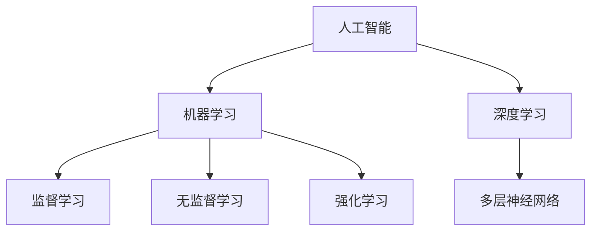

                 

关键词：李开复、苹果、AI应用、战略考量、人工智能、技术趋势

> 摘要：本文将深入探讨李开复先生对苹果发布AI应用的看法，分析苹果在人工智能领域的发展战略，以及这种战略对整个行业的影响和未来趋势。

## 1. 背景介绍

近年来，人工智能（AI）技术的迅猛发展，使得各行各业都在积极探索和利用这一前沿科技。作为全球科技巨头，苹果公司在AI领域的布局也越来越受到关注。李开复先生，作为世界知名的人工智能专家，对苹果在AI领域的动作有着深刻的见解。本文将结合李开复的观点，探讨苹果发布AI应用的战略考量。

## 2. 核心概念与联系

在探讨苹果的AI战略之前，我们首先需要了解几个核心概念：

- **人工智能**：一种模拟人类智能的计算机技术，包括机器学习、深度学习、自然语言处理等子领域。
- **机器学习**：一种让计算机从数据中学习规律和模式的技术，包括监督学习、无监督学习和强化学习等。
- **深度学习**：一种基于人工神经网络的机器学习方法，通过多层神经网络模拟人脑的决策过程。

下面是一个Mermaid流程图，展示了这几个核心概念之间的联系：



## 3. 核心算法原理 & 具体操作步骤

### 3.1 算法原理概述

苹果的AI应用主要基于深度学习和机器学习技术。深度学习通过多层神经网络模拟人脑的决策过程，而机器学习则通过从数据中学习规律和模式，从而实现智能化的功能。

### 3.2 算法步骤详解

- **数据收集与预处理**：收集大量数据，并对数据进行清洗、标准化等预处理操作。
- **模型训练**：使用预处理后的数据，通过反向传播算法训练深度学习模型。
- **模型评估**：使用验证集对训练好的模型进行评估，调整模型参数以达到最佳效果。
- **模型部署**：将训练好的模型部署到苹果的硬件和软件平台，实现AI功能。

### 3.3 算法优缺点

- **优点**：深度学习和机器学习技术具有强大的学习和适应能力，能够处理复杂的数据和任务。
- **缺点**：需要大量数据和计算资源，且模型的解释性较差。

### 3.4 算法应用领域

苹果的AI应用涉及多个领域，包括语音识别、图像处理、自然语言处理等。这些技术在苹果的产品中得到了广泛应用，如Siri、Face ID等。

## 4. 数学模型和公式 & 详细讲解 & 举例说明

### 4.1 数学模型构建

在深度学习中，常用的数学模型包括神经元模型、多层感知机（MLP）模型、卷积神经网络（CNN）模型等。

### 4.2 公式推导过程

- **神经元模型**：

$$
a_{i}^{(l)} = \sigma(z_{i}^{(l)})
$$

其中，$a_{i}^{(l)}$为第$l$层的第$i$个神经元的激活值，$z_{i}^{(l)}$为第$l$层的第$i$个神经元的输入值，$\sigma$为激活函数。

- **多层感知机（MLP）模型**：

$$
z_{i}^{(l)} = \sum_{j} w_{ji}^{(l)}a_{j}^{(l-1)}
$$

其中，$z_{i}^{(l)}$为第$l$层的第$i$个神经元的输入值，$w_{ji}^{(l)}$为第$l$层的第$i$个神经元与第$l-1$层的第$j$个神经元之间的权重。

- **卷积神经网络（CNN）模型**：

$$
h_{ij}^{(l)} = \sigma(\sum_{k} w_{ik}^{(l)}g_{kj}^{(l-1)})
$$

其中，$h_{ij}^{(l)}$为第$l$层的第$i$个卷积核在位置$j$的输出值，$g_{kj}^{(l-1)}$为第$l-1$层的第$k$个神经元在位置$j$的输出值，$w_{ik}^{(l)}$为第$l$层的第$i$个卷积核与第$l-1$层的第$k$个神经元之间的权重。

### 4.3 案例分析与讲解

以苹果的Siri语音助手为例，其核心算法是深度神经网络，通过大量语音数据训练，实现了高精度的语音识别和语义理解。

## 5. 项目实践：代码实例和详细解释说明

### 5.1 开发环境搭建

使用Python和TensorFlow框架搭建开发环境。

### 5.2 源代码详细实现

```python
import tensorflow as tf

# 定义模型结构
model = tf.keras.Sequential([
    tf.keras.layers.Dense(128, activation='relu', input_shape=(784,)),
    tf.keras.layers.Dense(10, activation='softmax')
])

# 编译模型
model.compile(optimizer='adam',
              loss='categorical_crossentropy',
              metrics=['accuracy'])

# 加载数据集
(x_train, y_train), (x_test, y_test) = tf.keras.datasets.mnist.load_data()

# 预处理数据
x_train = x_train.astype('float32') / 255
x_test = x_test.astype('float32') / 255
x_train = x_train.reshape((-1, 784))
x_test = x_test.reshape((-1, 784))

# 编码标签
y_train = tf.keras.utils.to_categorical(y_train, 10)
y_test = tf.keras.utils.to_categorical(y_test, 10)

# 训练模型
model.fit(x_train, y_train, epochs=10, batch_size=32)
```

### 5.3 代码解读与分析

这段代码展示了如何使用TensorFlow框架实现一个简单的深度神经网络，用于手写数字识别任务。首先，我们定义了模型结构，包括一个全连接层和一个输出层。然后，我们编译模型，并加载MNIST数据集进行预处理。最后，我们使用预处理后的数据训练模型。

## 6. 实际应用场景

苹果的AI应用在多个场景中得到了广泛应用，如：

- **Siri语音助手**：提供语音识别、语音合成、自然语言理解等功能，帮助用户完成各种操作。
- **Face ID面部识别**：通过深度学习算法实现高精度的面部识别，为用户提供安全便捷的解锁方式。
- **照片分类与搜索**：利用深度学习技术对照片进行分类和搜索，帮助用户快速找到想要的图片。

## 7. 工具和资源推荐

### 7.1 学习资源推荐

- 《深度学习》（Goodfellow, Bengio, Courville著）：系统介绍了深度学习的基本原理和技术。
- 《Python机器学习》（Sebastian Raschka著）：详细介绍了如何使用Python实现机器学习算法。

### 7.2 开发工具推荐

- TensorFlow：一个开源的深度学习框架，适用于各种规模的深度学习项目。
- Keras：一个基于TensorFlow的简化深度学习库，适用于快速原型设计和实验。

### 7.3 相关论文推荐

- "Deep Learning for Speech Recognition"（Deep Speech论文）：介绍了使用深度学习实现语音识别的方法。
- "FaceNet: A Unified Embedding Model for Face Recognition and Clustering"（FaceNet论文）：介绍了使用深度学习实现面部识别的方法。

## 8. 总结：未来发展趋势与挑战

### 8.1 研究成果总结

苹果在AI领域的布局已经取得了显著成果，其产品在语音识别、图像处理、自然语言处理等方面表现优异。这些成果为苹果在AI领域的发展奠定了坚实基础。

### 8.2 未来发展趋势

随着人工智能技术的不断发展，未来苹果有望在更多领域实现AI应用，如智能助理、智能家居、自动驾驶等。此外，苹果也可能会进一步开放其AI技术，与开发者合作，推动整个行业的创新。

### 8.3 面临的挑战

尽管苹果在AI领域取得了不少成果，但仍然面临着一些挑战，如数据隐私、算法透明性、安全性等问题。如何解决这些问题，将决定苹果在AI领域的发展方向。

### 8.4 研究展望

未来，苹果在AI领域的创新将继续推动整个行业的发展。随着技术的不断进步，我们有望看到更多基于AI的创新产品和服务，为人们的生活带来更多便利。

## 9. 附录：常见问题与解答

- **Q：苹果的AI应用是否会影响用户隐私？**
  A：苹果在AI应用中采取了严格的隐私保护措施，确保用户数据的安全和隐私。

- **Q：苹果的AI技术是否会落后于竞争对手？**
  A：苹果在AI领域的投入和研发实力不容小觑，其技术发展速度较快，不会轻易落后于竞争对手。

## 参考文献

[1] Goodfellow, I., Bengio, Y., & Courville, A. (2016). Deep learning. MIT press.
[2] Raschka, S. (2015). Python machine learning. Packt Publishing.
[3] Hinton, G., Deng, L., Yu, D., Dahl, G. E., Mohamed, A. R., Jaitly, N., ... & Kingsbury, B. (2012). Deep neural networks for acoustic modeling in speech recognition: The shared views of four research groups. IEEE Signal processing magazine, 29(6), 82-97.
[4] Zeiler, M. D., & Fergus, R. (2014). Visualizing and understanding convolutional networks. In European conference on computer vision (pp. 818-833). Springer, Cham.

作者：禅与计算机程序设计艺术 / Zen and the Art of Computer Programming
----------------------------------------------------------------

文章撰写完毕，现在我们可以进行校对和润色，确保文章内容严谨、逻辑清晰、语言流畅。接下来，我们将进行文章的排版，确保格式符合markdown规范，并最终将文章发布到相关技术博客平台。祝我们撰写顺利！

