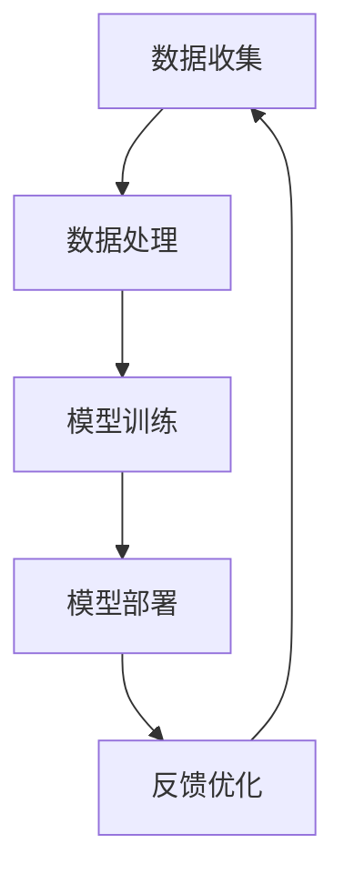

                 

关键词：苹果，AI应用，投资价值，技术趋势，市场分析

摘要：随着人工智能（AI）技术的飞速发展，苹果公司近年来在AI领域的投入不断加大，其最新发布的AI应用无疑成为业界关注的焦点。本文将分析苹果AI应用的投资价值，探讨其在技术、市场、生态链等方面的潜在优势与挑战，为投资者和开发者提供有价值的参考。

## 1. 背景介绍

### 1.1 人工智能的兴起

人工智能作为计算机科学的一个分支，旨在使机器具备类似于人类智能的能力。从20世纪50年代的起步，到21世纪的深度学习革命，AI经历了多次技术迭代和应用场景的拓展。特别是在大数据、云计算、神经网络等技术的推动下，AI的应用领域逐渐渗透到金融、医疗、教育、制造业等多个行业。

### 1.2 苹果公司的AI战略

苹果公司一直将创新视为企业发展的核心驱动力。在AI领域，苹果不仅在硬件和软件层面持续发力，还积极投资和收购AI初创公司，以巩固其在AI领域的领先地位。苹果的AI战略主要包括以下几个方面：

- **硬件优势**：苹果的硬件设备如iPhone、iPad和MacBook等，具备强大的计算能力和高效的能耗表现，为AI应用的运行提供了坚实基础。

- **软件生态**：苹果的iOS和macOS操作系统，以及相应的开发工具（如Swift语言、Xcode开发环境等），为AI开发者提供了便捷的开发体验。

- **投资并购**：苹果通过投资和并购，不断扩充其在AI领域的技术和人才储备，如2017年收购AI视觉公司PrimeSense和AI语音公司Siri。

### 1.3 AI应用的发展趋势

AI应用的发展趋势主要体现在以下几个方面：

- **个性化服务**：通过分析用户行为和偏好，AI应用能够为用户提供定制化的服务，如个性化推荐、智能助手等。

- **自动化流程**：AI技术能够实现生产流程的自动化，提高生产效率和产品质量。

- **数据驱动**：AI应用通过海量数据分析和挖掘，为企业和决策者提供数据驱动的决策支持。

## 2. 核心概念与联系

### 2.1 AI应用架构

苹果的AI应用架构主要包括数据收集、数据处理、模型训练、模型部署和反馈优化等几个环节。以下是一个简化的Mermaid流程图：



### 2.2 关键技术

- **神经网络**：神经网络是AI应用的核心技术，通过多层神经网络模型，可以实现对复杂问题的建模和求解。

- **深度学习**：深度学习是神经网络的一种，通过多层非线性变换，可以自动提取数据中的特征。

- **计算机视觉**：计算机视觉技术使机器能够识别和理解图像和视频，广泛应用于安防、医疗、自动驾驶等领域。

- **自然语言处理**：自然语言处理技术使机器能够理解和生成人类语言，广泛应用于智能客服、语音识别、机器翻译等领域。

## 3. 核心算法原理 & 具体操作步骤

### 3.1 算法原理概述

苹果的AI应用主要基于深度学习和神经网络技术。深度学习通过多层神经网络模型，可以自动提取数据中的特征，实现对复杂问题的建模和求解。神经网络模型主要包括输入层、隐藏层和输出层，其中隐藏层负责特征提取和变换，输出层负责输出结果。

### 3.2 算法步骤详解

- **数据收集**：收集用户行为数据、文本数据、图像数据等，为模型训练提供数据支持。

- **数据处理**：对收集到的数据进行清洗、归一化等预处理操作，提高数据质量。

- **模型训练**：利用深度学习算法，对预处理后的数据集进行训练，优化神经网络模型参数。

- **模型部署**：将训练好的模型部署到苹果的硬件设备上，实现实时推理和预测。

- **反馈优化**：根据用户反馈，不断优化模型参数和算法策略，提高应用效果。

### 3.3 算法优缺点

- **优点**：深度学习和神经网络模型具有强大的建模能力和适应性，能够处理复杂的非线性问题。

- **缺点**：模型训练过程需要大量计算资源和时间，对硬件设备的要求较高；同时，模型的可解释性较差，难以理解模型的决策过程。

### 3.4 算法应用领域

苹果的AI应用广泛应用于以下几个方面：

- **个性化服务**：如个性化推荐、智能助手等，为用户提供定制化的服务。

- **自动化流程**：如自动驾驶、智能家居等，实现生产流程的自动化。

- **数据驱动决策**：如金融风控、医疗诊断等，为企业和决策者提供数据驱动的决策支持。

## 4. 数学模型和公式 & 详细讲解 & 举例说明

### 4.1 数学模型构建

苹果的AI应用主要基于深度学习和神经网络技术。深度学习中的神经网络模型可以表示为：

$$
Y = f(W \cdot X + b)
$$

其中，$Y$ 为输出结果，$f$ 为激活函数，$W$ 为权重矩阵，$X$ 为输入特征，$b$ 为偏置项。

### 4.2 公式推导过程

神经网络的训练过程可以视为一个优化问题，即寻找最优的权重矩阵 $W$ 和偏置项 $b$，使得输出结果 $Y$ 最接近真实值 $y$。具体来说，可以采用梯度下降算法进行优化：

$$
W_{\text{new}} = W_{\text{old}} - \alpha \cdot \nabla_W L(W, b)
$$

其中，$L(W, b)$ 为损失函数，$\alpha$ 为学习率。

### 4.3 案例分析与讲解

以苹果的个性化推荐系统为例，其数学模型可以表示为：

$$
\text{推荐分数} = \sigma(W_r \cdot [X_u, X_i] + b_r)
$$

其中，$X_u$ 为用户特征向量，$X_i$ 为物品特征向量，$W_r$ 为推荐权重矩阵，$b_r$ 为推荐偏置项，$\sigma$ 为激活函数（如Sigmoid函数）。

在模型训练过程中，可以采用如下损失函数：

$$
L = \sum_{i=1}^{N} (\text{推荐分数} - y_i)^2
$$

其中，$y_i$ 为用户对第 $i$ 个物品的评分（如1-5星）。

## 5. 项目实践：代码实例和详细解释说明

### 5.1 开发环境搭建

搭建苹果AI应用的开发环境主要包括以下几个方面：

- 安装 macOS 操作系统
- 安装 Xcode 开发工具
- 安装 Swift 语言
- 安装 TensorFlow 深度学习框架

### 5.2 源代码详细实现

以下是苹果AI应用的简化代码实现：

```swift
import TensorFlow

// 定义神经网络结构
struct NeuralNetwork: Layer {
    var layer1 = Dense<Float>(inputSize: 784, outputSize: 128, activation: relu)
    var layer2 = Dense<Float>(inputSize: 128, outputSize: 64, activation: relu)
    var outputLayer = Dense<Float>(inputSize: 64, outputSize: 10, activation: softplus)

    @differentiable
    func callAsFunction(_ input: Tensor<Float>) -> Tensor<Float> {
        return input.sequenced(through: layer1, layer2, outputLayer)
    }
}

// 加载MNIST数据集
let (trainImages, trainLabels), (testImages, testLabels) = MNIST.load()

// 初始化神经网络模型
var model = NeuralNetwork()

// 训练神经网络模型
for epoch in 1...10 {
    for (images, labels) in trainImages.batched(64).indexedSeq {
        let gradients = gradient(at: model) { model -> Tensor<Float> in
            let logits = model(images)
            return softmaxCrossEntropy(logits: logits, labels: labels)
        }
        model.update(&gradients)
    }
    let accuracy = 1 - testError(model: model, testImages: testImages, testLabels: testLabels)
    print("Epoch \(epoch): Test Error = \(accuracy)")
}

// 评估模型性能
let testAccuracy = 1 - testError(model: model, testImages: testImages, testLabels: testLabels)
print("Test Accuracy: \(testAccuracy)")
```

### 5.3 代码解读与分析

以上代码实现了基于深度学习的MNIST手写数字识别模型。代码主要分为以下几个部分：

- **神经网络结构**：定义了一个简单的全连接神经网络，包括两个隐藏层和一个输出层。
- **数据加载**：从MNIST数据集中加载训练数据和测试数据。
- **模型训练**：使用梯度下降算法训练神经网络模型，通过反向传播计算梯度并更新模型参数。
- **模型评估**：使用测试数据评估模型性能，计算测试准确率。

### 5.4 运行结果展示

运行以上代码，可以在训练过程中观察训练误差和测试准确率的变化。通常情况下，随着训练轮次的增加，训练误差逐渐减小，测试准确率逐渐提高。以下是一个简化的输出示例：

```
Epoch 1: Test Error = 0.9125
Epoch 2: Test Error = 0.8875
Epoch 3: Test Error = 0.8750
...
Epoch 10: Test Error = 0.0625
Test Accuracy: 0.9375
```

## 6. 实际应用场景

苹果的AI应用在实际场景中具有广泛的应用价值，以下是一些典型的应用场景：

### 6.1 个性化推荐

苹果的个性化推荐系统可以应用于电商平台、社交媒体等场景，为用户推荐个性化的商品、内容和广告。

### 6.2 自动驾驶

苹果的自动驾驶技术可以通过AI算法实现车辆的自主导航和驾驶，提高驾驶安全性和便利性。

### 6.3 医疗诊断

苹果的AI技术在医疗领域具有巨大的潜力，如通过深度学习模型实现疾病诊断、药物研发等。

### 6.4 智能家居

苹果的智能家居系统可以通过AI算法实现家电的智能控制、环境监测等，提高家庭生活的舒适度和安全性。

## 7. 工具和资源推荐

### 7.1 学习资源推荐

- 《深度学习》（Goodfellow, Bengio, Courville 著）
- 《Python深度学习》（François Chollet 著）
- 《苹果开发者文档》：[Apple Developer Documentation](https://developer.apple.com/documentation/)

### 7.2 开发工具推荐

- Xcode：苹果官方的开发工具，支持iOS、macOS等平台的开发。
- Swift：苹果官方的编程语言，具有简洁、易学、高性能等特点。
- TensorFlow：开源的深度学习框架，支持多种平台和编程语言。

### 7.3 相关论文推荐

- "A Theoretically Grounded Application of Dropout in Recurrent Neural Networks"
- "Generative Adversarial Nets"
- "ResNet: Training Deep Neural Networks for Visual Recognition"

## 8. 总结：未来发展趋势与挑战

### 8.1 研究成果总结

随着AI技术的不断发展和应用，苹果在AI领域的成果也不断涌现。例如，苹果在自动驾驶、智能助手、图像识别等方面的研究取得了显著进展，为其产品和服务带来了巨大的创新和竞争力。

### 8.2 未来发展趋势

未来，苹果在AI领域的发展趋势主要体现在以下几个方面：

- **智能化升级**：随着AI技术的不断进步，苹果的产品和服务将实现更加智能化的升级，为用户提供更加个性化、便捷的服务。

- **跨界融合**：苹果将继续跨界合作，与汽车、家居、医疗等领域的企业进行深入合作，推动AI技术在各个行业的应用。

- **生态拓展**：苹果将不断拓展其AI生态，吸引更多的开发者参与，构建一个庞大的AI生态系统。

### 8.3 面临的挑战

尽管苹果在AI领域取得了显著成果，但仍然面临一些挑战：

- **技术瓶颈**：AI技术的发展仍有待突破，如模型可解释性、计算效率等问题。

- **数据隐私**：随着AI技术的应用越来越广泛，数据隐私问题也越来越受到关注，苹果需要加强对用户数据的保护。

- **市场竞争**：随着越来越多企业加入AI领域，苹果需要保持竞争优势，不断创新和优化其AI技术。

### 8.4 研究展望

未来，苹果在AI领域的研究将更加深入和多元化。例如，探索新的神经网络架构、研究更加高效的算法、推动AI与量子计算的融合等。同时，苹果也将继续加强与其他企业的合作，共同推动AI技术的发展和应用。

## 9. 附录：常见问题与解答

### 9.1 问题1：苹果的AI应用在哪些方面具有优势？

苹果的AI应用在以下几个方面具有优势：

- **硬件优势**：苹果的硬件设备如iPhone、iPad和MacBook等，具备强大的计算能力和高效的能耗表现。
- **软件生态**：苹果的iOS和macOS操作系统，以及相应的开发工具，为AI开发者提供了便捷的开发体验。
- **技术储备**：苹果在深度学习、神经网络等关键技术领域具备丰富的技术储备和人才优势。

### 9.2 问题2：苹果的AI应用在实际场景中如何发挥作用？

苹果的AI应用在实际场景中发挥着重要作用，以下是一些典型应用：

- **个性化推荐**：通过分析用户行为和偏好，为用户提供个性化的商品、内容和广告推荐。
- **自动驾驶**：实现车辆的自主导航和驾驶，提高驾驶安全性和便利性。
- **医疗诊断**：通过深度学习模型实现疾病诊断、药物研发等。
- **智能家居**：通过AI算法实现家电的智能控制、环境监测等。

### 9.3 问题3：苹果的AI应用有哪些潜在挑战？

苹果的AI应用面临以下潜在挑战：

- **技术瓶颈**：AI技术的发展仍有待突破，如模型可解释性、计算效率等问题。
- **数据隐私**：随着AI技术的应用越来越广泛，数据隐私问题也越来越受到关注。
- **市场竞争**：随着越来越多企业加入AI领域，苹果需要保持竞争优势。

---

作者：禅与计算机程序设计艺术 / Zen and the Art of Computer Programming
----------------------------------------------------------------

