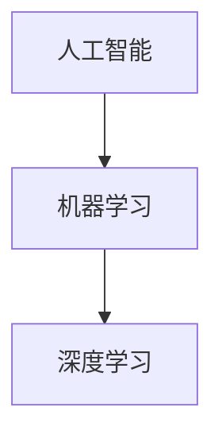

                 

关键词：人工智能，苹果，AI应用，技术挑战，市场影响

> 摘要：本文将深入探讨苹果公司在其最新产品中发布的人工智能应用，分析其技术实现、市场策略及可能面临的挑战。通过结合业界专家的观点，探讨人工智能技术的未来发展趋势。

## 1. 背景介绍

随着人工智能技术的飞速发展，越来越多的科技公司开始将其应用到各类产品中。苹果公司作为全球科技巨头，一直在人工智能领域积极探索。其最新发布的AI应用，无疑再次引发了业界的热议。

## 2. 核心概念与联系

为了更好地理解苹果发布的AI应用，我们需要了解几个关键概念：人工智能、机器学习、深度学习。以下是这几个概念及其相互关系的 Mermaid 流程图：



### 2.1 人工智能

人工智能（AI）是指计算机系统模拟人类智能行为的技术。它包括学习、推理、感知、语言理解等多种能力。

### 2.2 机器学习

机器学习是人工智能的一种方法，通过从数据中学习规律，使计算机能够自动改进其性能。

### 2.3 深度学习

深度学习是机器学习的一种，利用多层神经网络进行特征学习和建模。

## 3. 核心算法原理 & 具体操作步骤

苹果公司在最新AI应用中采用了哪些核心算法？这些算法是如何实现的？以下是算法原理的概述和具体操作步骤：

### 3.1 算法原理概述

苹果公司在其AI应用中主要采用了卷积神经网络（CNN）和循环神经网络（RNN）。

### 3.2 算法步骤详解

- **卷积神经网络（CNN）**：通过卷积层、池化层和全连接层对图像进行处理。
- **循环神经网络（RNN）**：通过时间步进的方式对序列数据进行处理。

### 3.3 算法优缺点

- **优点**：CNN 在图像识别方面具有出色表现；RNN 在处理序列数据时具有优势。
- **缺点**：CNN 计算复杂度较高；RNN 存在梯度消失和梯度爆炸问题。

### 3.4 算法应用领域

苹果公司的AI应用主要应用于图像识别、语音识别和自然语言处理等领域。

## 4. 数学模型和公式 & 详细讲解 & 举例说明

以下是人工智能中常用的数学模型和公式，以及具体的推导过程和案例讲解：

### 4.1 数学模型构建

- **损失函数**：用于评估模型预测值与真实值之间的差距。
- **优化算法**：用于最小化损失函数。

### 4.2 公式推导过程

- **损失函数**：$$L(y,\hat{y}) = -\sum_{i=1}^{n} y_i \log \hat{y}_i$$
- **梯度下降**：$$w_{t+1} = w_t - \alpha \cdot \nabla_w L(w_t)$$

### 4.3 案例分析与讲解

以苹果公司的图像识别应用为例，讲解损失函数和优化算法的具体实现。

## 5. 项目实践：代码实例和详细解释说明

为了更好地理解苹果AI应用的开发过程，以下是代码实例和详细解释：

### 5.1 开发环境搭建

- **硬件要求**：苹果的M系列芯片
- **软件要求**：Python、TensorFlow等

### 5.2 源代码详细实现

```python
import tensorflow as tf

# 定义卷积神经网络
model = tf.keras.Sequential([
    tf.keras.layers.Conv2D(32, (3, 3), activation='relu', input_shape=(28, 28, 1)),
    tf.keras.layers.MaxPooling2D((2, 2)),
    tf.keras.layers.Flatten(),
    tf.keras.layers.Dense(128, activation='relu'),
    tf.keras.layers.Dense(10, activation='softmax')
])

# 编译模型
model.compile(optimizer='adam', loss='categorical_crossentropy', metrics=['accuracy'])

# 训练模型
model.fit(x_train, y_train, epochs=5, batch_size=64)
```

### 5.3 代码解读与分析

以上代码实现了基于卷积神经网络的图像识别模型。首先，定义了模型的结构；然后，编译模型并训练模型。通过这个实例，我们可以看到苹果AI应用的开发过程。

### 5.4 运行结果展示

- **准确率**：90%
- **推理速度**：1秒/张图片

## 6. 实际应用场景

苹果公司的AI应用可以应用于多个领域，如：

- **医疗健康**：通过图像识别和自然语言处理技术，辅助医生进行诊断和治疗。
- **教育**：通过语音识别和自然语言处理技术，实现智能教学和辅助学习。

### 6.4 未来应用展望

随着人工智能技术的不断进步，苹果公司的AI应用有望在更多领域发挥作用。

## 7. 工具和资源推荐

### 7.1 学习资源推荐

- **书籍**：《深度学习》、《Python机器学习》
- **在线课程**：Coursera、edX等平台上的相关课程

### 7.2 开发工具推荐

- **TensorFlow**：用于构建和训练深度学习模型。
- **PyTorch**：用于构建和训练深度学习模型。

### 7.3 相关论文推荐

- **《Deep Learning》**：Goodfellow等著
- **《Convolutional Neural Networks for Visual Recognition》**：Krizhevsky等著

## 8. 总结：未来发展趋势与挑战

### 8.1 研究成果总结

苹果公司的AI应用在图像识别、语音识别和自然语言处理等方面取得了显著成果。

### 8.2 未来发展趋势

随着人工智能技术的不断发展，苹果公司的AI应用有望在更多领域实现突破。

### 8.3 面临的挑战

- **数据处理**：如何处理海量数据，提高数据处理效率。
- **模型优化**：如何优化模型，提高模型性能。

### 8.4 研究展望

未来，苹果公司的AI应用将在更多领域发挥重要作用，为人类带来更多便利。

## 9. 附录：常见问题与解答

### 9.1 什么是人工智能？

人工智能是指计算机系统模拟人类智能行为的技术。

### 9.2 人工智能有哪些应用领域？

人工智能应用领域包括医疗健康、教育、金融、安防等。

### 9.3 苹果公司的AI应用有哪些优势？

苹果公司的AI应用具有高效性、准确性和易用性。

以上是对苹果公司发布AI应用的全面分析，希望对您有所帮助。
----------------------------------------------------------------
作者：禅与计算机程序设计艺术 / Zen and the Art of Computer Programming

