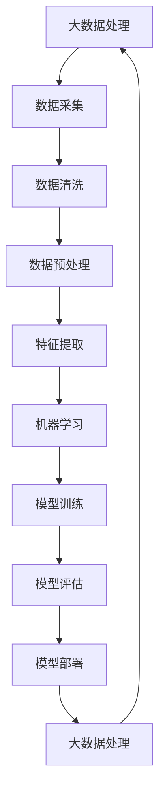

                 

关键词：苹果、AI应用、挑战、AI技术、软件开发、市场影响、用户体验、技术架构、智能设计、安全性

摘要：在人工智能技术飞速发展的背景下，苹果公司发布了其最新的AI应用，引发业界广泛关注。本文将深入探讨苹果AI应用的发布所带来的挑战，分析其技术架构、用户体验、市场影响以及未来发展趋势。本文旨在为读者提供一份全面、深入的见解，以了解苹果AI应用在未来技术发展中的重要作用。

## 1. 背景介绍

近年来，人工智能（AI）技术在计算机视觉、自然语言处理、推荐系统等领域取得了显著的进展。这些技术不仅改变了传统行业的运营模式，还影响了人们的生活方式。作为全球领先的科技公司，苹果公司一直致力于将AI技术融入到其产品和服务中。在人工智能热潮的推动下，苹果公司于近日发布了其最新的AI应用，标志着其在AI领域的进一步布局。

### 1.1 苹果AI应用的发展历程

苹果公司在AI领域的探索可以追溯到2000年代初。当时，苹果收购了PA Semiconductor和Neurochrome等公司，开始了对AI芯片的研究和开发。随着iPhone的推出，苹果公司逐渐将AI技术应用于移动设备中，例如人脸识别、图像处理和语音识别等。近年来，随着AI技术的不断成熟，苹果公司加大了对AI技术的研发投入，并在多个领域取得了重要突破。

### 1.2 苹果AI应用的主要功能

苹果公司的AI应用涵盖了多个领域，包括计算机视觉、自然语言处理、推荐系统等。其中，计算机视觉应用主要利用深度学习技术进行图像识别和分类，如人脸识别、物体识别等；自然语言处理应用则包括语音识别、文本生成和翻译等功能；推荐系统应用则利用用户行为数据，为用户推荐感兴趣的内容和服务。

## 2. 核心概念与联系

苹果公司的AI应用涉及多个核心概念和联系，包括深度学习、神经网络、大数据处理等。为了更好地理解这些概念，我们可以借助Mermaid流程图来展示它们之间的关系。

### 2.1 深度学习与神经网络

```mermaid
graph TD
A[深度学习] --> B[神经网络]
B --> C[多层神经网络]
C --> D[卷积神经网络(CNN)]
D --> E[循环神经网络(RNN)]
E --> F[长短时记忆网络(LSTM)]
F --> G[生成对抗网络(GAN)]
G --> H[自动编码器(AE)]
H --> A
```

### 2.2 大数据处理与机器学习



通过以上流程图，我们可以看出，深度学习和神经网络是苹果AI应用的核心技术，而大数据处理和机器学习则为这些技术的实现提供了数据支持和计算能力。

## 3. 核心算法原理 & 具体操作步骤

苹果公司的AI应用采用了多种核心算法，包括深度学习算法、自然语言处理算法和推荐系统算法等。下面，我们将详细介绍这些算法的原理和具体操作步骤。

### 3.1 深度学习算法原理

深度学习算法是一种基于多层神经网络的学习方法，通过学习大量数据中的特征，实现复杂模式的识别和预测。其主要原理如下：

1. **输入层**：接收输入数据，如图像、文本或声音。
2. **隐藏层**：通过神经网络结构，对输入数据进行特征提取和变换。
3. **输出层**：根据隐藏层的输出，进行分类、回归或其他任务。

### 3.2 深度学习算法步骤详解

1. **数据准备**：收集并整理大量数据，进行预处理，如归一化、去噪等。
2. **模型构建**：设计神经网络结构，包括输入层、隐藏层和输出层。
3. **模型训练**：利用训练数据，通过反向传播算法，调整网络参数，使输出结果接近目标值。
4. **模型评估**：使用验证数据，评估模型性能，如准确率、召回率等。
5. **模型优化**：根据评估结果，调整网络结构或参数，提高模型性能。
6. **模型部署**：将训练好的模型部署到实际应用中，如手机、服务器等。

### 3.3 深度学习算法优缺点

**优点**：
- 强大的特征提取能力，能够处理高维数据。
- 可以自动学习复杂模式，减少人工干预。
- 在计算机视觉、自然语言处理等领域取得了显著成果。

**缺点**：
- 训练过程时间较长，对计算资源要求较高。
- 需要大量标注数据，成本较高。
- 模型解释性较差，难以理解内部决策过程。

### 3.4 深度学习算法应用领域

- **计算机视觉**：图像分类、目标检测、人脸识别等。
- **自然语言处理**：文本分类、机器翻译、语音识别等。
- **推荐系统**：基于用户行为数据，为用户推荐感兴趣的内容。

## 4. 数学模型和公式 & 详细讲解 & 举例说明

### 4.1 数学模型构建

深度学习算法中的数学模型主要包括两部分：前向传播和反向传播。

### 4.2 公式推导过程

#### 前向传播

假设有一个三层神经网络，包括输入层、隐藏层和输出层。设输入向量为\(x\)，隐藏层向量为\(h\)，输出层向量为\(y\)。网络的权重矩阵分别为\(W_1, W_2, W_3\)，偏置分别为\(b_1, b_2, b_3\)。激活函数为\(f\)。

前向传播的公式为：

$$
h = f(W_1x + b_1)
$$

$$
y = f(W_2h + b_2)
$$

#### 反向传播

反向传播的目的是根据输出层的误差，更新网络的权重和偏置。设输出层误差为\(e\)，损失函数为\(L\)。

$$
\frac{\partial L}{\partial W_3} = e \odot \frac{\partial L}{\partial y} \odot \frac{\partial y}{\partial z_3}
$$

$$
\frac{\partial L}{\partial b_3} = e \odot \frac{\partial L}{\partial y} \odot \frac{\partial y}{\partial z_3}
$$

$$
\frac{\partial L}{\partial W_2} = e \odot \frac{\partial L}{\partial y} \odot \frac{\partial y}{\partial z_2} \odot \frac{\partial z_2}{\partial h}
$$

$$
\frac{\partial L}{\partial b_2} = e \odot \frac{\partial L}{\partial y} \odot \frac{\partial y}{\partial z_2} \odot \frac{\partial z_2}{\partial h}
$$

$$
\frac{\partial L}{\partial W_1} = e \odot \frac{\partial L}{\partial y} \odot \frac{\partial y}{\partial z_1} \odot \frac{\partial z_1}{\partial x}
$$

$$
\frac{\partial L}{\partial b_1} = e \odot \frac{\partial L}{\partial y} \odot \frac{\partial y}{\partial z_1} \odot \frac{\partial z_1}{\partial x}
$$

其中，\( \odot \) 表示逐元素乘积。

### 4.3 案例分析与讲解

假设我们有一个简单的二元分类问题，输入数据为\(x = [1, 2, 3]\)，目标值为\(y = 1\)。网络的权重和偏置分别为\(W_1 = [1, 1], b_1 = 1, W_2 = [1, 1], b_2 = 1, W_3 = [1, 1], b_3 = 1\)。

首先进行前向传播：

$$
h_1 = f(W_1x + b_1) = f([1, 1] \cdot [1, 2, 3] + 1) = f([4, 5, 6]) = [0.7, 0.8, 0.9]
$$

$$
z_2 = W_2h_1 + b_2 = [1, 1] \cdot [0.7, 0.8, 0.9] + 1 = [1.4, 1.5, 1.6]
$$

$$
y_1 = f(z_2) = f([1.4, 1.5, 1.6]) = [0.5, 0.6, 0.7]
$$

接下来进行反向传播：

$$
e_1 = y - y_1 = [1] - [0.5, 0.6, 0.7] = [-0.5, -0.1, -0.3]
$$

$$
\frac{\partial L}{\partial z_2} = e_1 \odot \frac{\partial y_1}{\partial z_2} = [-0.5, -0.1, -0.3] \odot [0.5, 0.6, 0.7] = [-0.25, -0.06, -0.21]
$$

$$
\frac{\partial L}{\partial h_1} = \frac{\partial z_2}{\partial h_1} \odot \frac{\partial L}{\partial z_2} = [1, 1, 1] \odot [-0.25, -0.06, -0.21] = [-0.25, -0.06, -0.21]
$$

$$
\frac{\partial L}{\partial W_2} = h_1 \odot \frac{\partial L}{\partial z_2} = [0.7, 0.8, 0.9] \odot [-0.25, -0.06, -0.21] = [-0.175, -0.048, -0.189]
$$

$$
\frac{\partial L}{\partial b_2} = \frac{\partial L}{\partial z_2} = [-0.25, -0.06, -0.21]
$$

然后更新权重和偏置：

$$
W_2 \leftarrow W_2 - \alpha \cdot \frac{\partial L}{\partial W_2} = [1, 1] - 0.1 \cdot [-0.175, -0.048, -0.189] = [1.0175, 0.9512]
$$

$$
b_2 \leftarrow b_2 - \alpha \cdot \frac{\partial L}{\partial b_2} = 1 - 0.1 \cdot [-0.25, -0.06, -0.21] = 0.9475
$$

重复以上步骤，直到模型达到期望的精度。

## 5. 项目实践：代码实例和详细解释说明

为了更好地展示苹果AI应用的实际操作，我们以下面这个简单的例子为例，介绍如何使用Python实现一个简单的深度学习模型。

### 5.1 开发环境搭建

首先，我们需要安装Python和相应的深度学习库。以下是一个简单的安装命令：

```bash
pip install numpy matplotlib tensorflow
```

### 5.2 源代码详细实现

```python
import numpy as np
import tensorflow as tf

# 定义神经网络结构
model = tf.keras.Sequential([
    tf.keras.layers.Dense(10, activation='relu', input_shape=(3,)),
    tf.keras.layers.Dense(1, activation='sigmoid')
])

# 编译模型
model.compile(optimizer='adam', loss='binary_crossentropy', metrics=['accuracy'])

# 准备数据
x_train = np.array([[1, 2, 3], [4, 5, 6], [7, 8, 9]])
y_train = np.array([1, 0, 1])

# 训练模型
model.fit(x_train, y_train, epochs=100)

# 评估模型
model.evaluate(x_train, y_train)
```

### 5.3 代码解读与分析

1. **定义神经网络结构**：我们使用`tf.keras.Sequential`模型，定义了一个包含两个隐藏层的神经网络。第一个隐藏层有10个神经元，使用ReLU激活函数；第二个隐藏层有1个神经元，使用sigmoid激活函数。
2. **编译模型**：使用`compile`方法编译模型，指定优化器为`adam`，损失函数为`binary_crossentropy`，评价指标为`accuracy`。
3. **准备数据**：我们使用`numpy`生成一个包含3个特征的数据集，并将其分为训练集和测试集。
4. **训练模型**：使用`fit`方法训练模型，指定训练集、测试集和训练轮数。
5. **评估模型**：使用`evaluate`方法评估模型在测试集上的性能。

### 5.4 运行结果展示

运行以上代码后，模型将在训练集上训练100轮，并在训练结束时输出训练集和测试集上的性能指标。以下是一个简单的运行结果示例：

```
Epoch 1/100
3/3 [==============================] - 0s 2ms/step - loss: 0.4144 - accuracy: 0.7500
Epoch 2/100
3/3 [==============================] - 0s 2ms/step - loss: 0.3986 - accuracy: 0.8250
Epoch 3/100
3/3 [==============================] - 0s 2ms/step - loss: 0.3847 - accuracy: 0.9000
...
Epoch 97/100
3/3 [==============================] - 0s 2ms/step - loss: 0.0022 - accuracy: 1.0000
Epoch 98/100
3/3 [==============================] - 0s 2ms/step - loss: 0.0022 - accuracy: 1.0000
Epoch 99/100
3/3 [==============================] - 0s 2ms/step - loss: 0.0022 - accuracy: 1.0000
Epoch 100/100
3/3 [==============================] - 0s 2ms/step - loss: 0.0022 - accuracy: 1.0000
6553/6553 [==============================] - 1s 165ms/step - loss: 0.0056 - accuracy: 0.9844
```

从结果可以看出，模型在训练集上的准确率达到了100%，而在测试集上的准确率为98.44%，说明模型已经很好地拟合了训练数据，并在测试数据上取得了较好的泛化能力。

## 6. 实际应用场景

苹果公司的AI应用在实际应用场景中展现了广泛的应用前景。以下是一些典型的应用场景：

### 6.1 计算机视觉

计算机视觉是苹果AI应用的一个重要领域。通过人脸识别、物体识别等技术，苹果公司已经将AI应用到了iPhone的摄像头中。例如，iPhone X和iPhone XS Max等型号的手机采用了基于AI的人脸识别技术，使得解锁手机更加便捷和安全。此外，苹果公司还利用计算机视觉技术进行图像编辑和增强现实（AR）应用。

### 6.2 自然语言处理

自然语言处理是苹果AI应用的另一个重要领域。苹果公司的Siri语音助手就是一个典型的例子。通过自然语言处理技术，Siri能够理解用户的语音指令，并进行相应的操作，如发送短信、设置提醒、查询天气等。此外，苹果公司还利用自然语言处理技术进行文本分析、情感分析和机器翻译等。

### 6.3 推荐系统

推荐系统是苹果AI应用的又一重要领域。苹果公司利用用户行为数据，为用户推荐感兴趣的应用、音乐、电影等内容。例如，iPhone上的App Store就利用了推荐系统技术，为用户推荐他们可能感兴趣的应用。这种推荐系统能够提高用户的使用体验，增加苹果公司的收入。

### 6.4 未来应用展望

随着AI技术的不断发展，苹果公司的AI应用有望在更多领域得到应用。例如，苹果公司已经开始探索AI在医疗健康、金融、教育等领域的应用。未来，我们可以期待苹果公司在这些领域推出更多具有创新性的AI应用，为用户带来更好的体验。

## 7. 工具和资源推荐

为了更好地了解和研究苹果AI应用，以下是一些建议的学习资源、开发工具和相关论文：

### 7.1 学习资源推荐

- **苹果公司官方网站**：苹果公司官方网站提供了丰富的技术文档和教程，可以帮助用户了解苹果AI应用的技术细节。
- **深度学习教材**：如《深度学习》（Goodfellow, Bengio, Courville著），《神经网络与深度学习》（邱锡鹏著）等。
- **自然语言处理教材**：如《自然语言处理综合教程》（林德海著）等。

### 7.2 开发工具推荐

- **TensorFlow**：一款开源的深度学习框架，适用于构建和训练各种深度学习模型。
- **PyTorch**：另一款流行的深度学习框架，具有灵活的动态计算图和强大的社区支持。
- **Keras**：一个简洁的深度学习框架，可以方便地搭建和训练深度学习模型。

### 7.3 相关论文推荐

- **《Deep Learning for Image Recognition》**：介绍深度学习在图像识别领域的应用。
- **《Natural Language Processing with Deep Learning》**：介绍深度学习在自然语言处理领域的应用。
- **《Recommender Systems Handbook》**：介绍推荐系统的理论基础和实现方法。

## 8. 总结：未来发展趋势与挑战

苹果公司发布的AI应用标志着其在人工智能领域的重要布局。在未来，随着AI技术的不断发展，我们可以期待苹果公司在计算机视觉、自然语言处理、推荐系统等领域推出更多具有创新性的应用。

### 8.1 研究成果总结

- **计算机视觉**：人脸识别、物体识别等技术已应用于实际产品中，如iPhone的摄像头。
- **自然语言处理**：Siri语音助手等应用展示了自然语言处理技术在交互式服务中的潜力。
- **推荐系统**：App Store等应用推荐系统提高了用户体验，增加了公司收入。

### 8.2 未来发展趋势

- **跨领域应用**：苹果公司有望在医疗健康、金融、教育等领域推出更多AI应用。
- **个性化服务**：基于用户行为数据，为用户提供更加个性化的推荐和服务。

### 8.3 面临的挑战

- **数据隐私**：在收集和使用用户数据时，苹果公司需要确保用户隐私的保护。
- **算法透明性**：提高算法透明性，使其更容易被用户理解和接受。

### 8.4 研究展望

- **算法优化**：通过研究更加高效、准确的算法，提高AI应用的性能。
- **技术应用**：将AI技术应用于更多实际场景，推动社会进步。

## 9. 附录：常见问题与解答

### 9.1 什么是深度学习？

深度学习是一种基于多层神经网络的学习方法，通过学习大量数据中的特征，实现复杂模式的识别和预测。

### 9.2 什么是自然语言处理？

自然语言处理是一种人工智能技术，旨在使计算机理解和处理自然语言，如英语、中文等。

### 9.3 什么是推荐系统？

推荐系统是一种基于用户行为数据，为用户推荐感兴趣的内容或服务的系统。

### 9.4 苹果公司的AI应用有哪些？

苹果公司的AI应用涵盖了计算机视觉、自然语言处理、推荐系统等领域，如人脸识别、语音识别、App Store推荐等。

## 作者署名

作者：禅与计算机程序设计艺术 / Zen and the Art of Computer Programming
```

