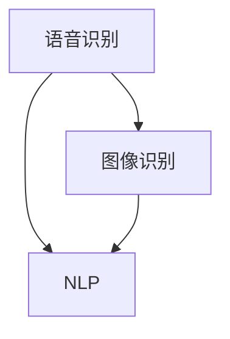
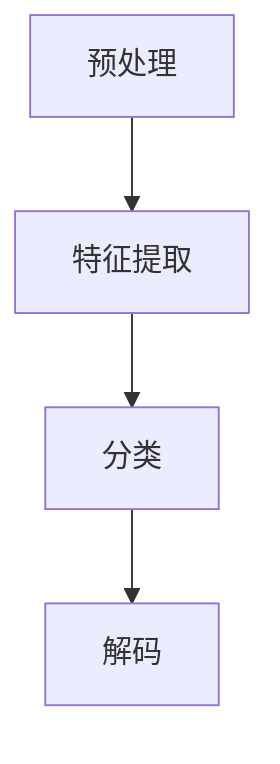
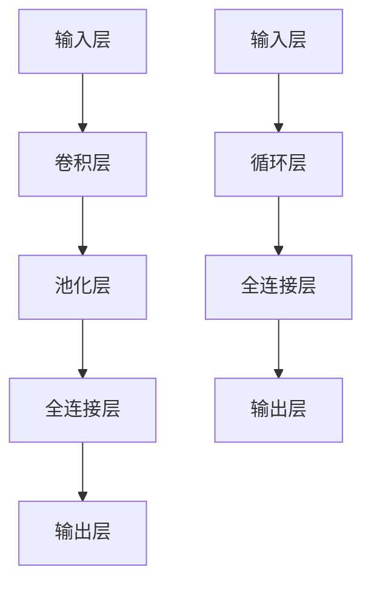

                 

### 1. 背景介绍

在过去的几年中，人工智能（AI）技术飞速发展，逐渐渗透到我们的日常生活和工作中。无论是智能手机的语音助手、智能音响，还是自动驾驶汽车、智能家居，AI的应用无处不在。苹果公司作为全球领先的科技企业，自然不会错过这一发展趋势。近期，苹果公司发布了一系列基于AI的应用，引起了业界的广泛关注。本文将围绕这一主题，探讨苹果发布AI应用的未来前景。

首先，我们需要了解苹果公司在AI领域的布局。早在2017年，苹果公司就收购了机器学习和自然语言处理领域的知名初创公司Lift Labs，这标志着苹果在AI领域的重要战略部署。此后，苹果不断加强在AI领域的人才储备和技术研发，逐渐形成了自己的AI生态系统。

苹果公司发布的AI应用涵盖了多个领域，包括语音识别、图像识别、自然语言处理等。其中，最引人注目的是苹果在语音助手领域的布局。苹果的Siri和竞争对手的Google Assistant、亚马逊的Alexa一样，都是基于深度学习和自然语言处理技术。然而，苹果在这些领域并不是一成不变的跟随者，而是在不断探索创新。

近年来，苹果公司在AI领域的研究取得了显著的成果。例如，苹果的图像识别技术在医疗诊断、自动驾驶等领域取得了突破性的进展。此外，苹果还在机器学习算法、神经网络架构等方面进行了深入的研究，为AI应用提供了强大的技术支撑。

### 2. 核心概念与联系

在探讨苹果发布AI应用的未来之前，我们需要先了解一些核心概念和它们之间的联系。

#### 2.1 语音识别

语音识别是AI领域的一个重要分支，它旨在将人类的语音转换为文本。语音识别技术依赖于深度学习算法，特别是卷积神经网络（CNN）和循环神经网络（RNN）。CNN擅长处理图像数据，而RNN则擅长处理序列数据，如语音信号。苹果的Siri正是基于这些技术实现的。

#### 2.2 图像识别

图像识别技术是AI领域的另一个重要分支，它旨在识别和分类图像中的对象。图像识别技术同样依赖于深度学习算法，如CNN和RNN。苹果在图像识别领域的研究成果，为其在医疗诊断、自动驾驶等领域的发展奠定了基础。

#### 2.3 自然语言处理

自然语言处理（NLP）是AI领域的一个子领域，它旨在使计算机理解和处理人类语言。NLP技术包括文本分类、情感分析、命名实体识别等。苹果的Siri和谷歌的Google Assistant等语音助手，都是基于NLP技术实现的。

#### 2.4 联系

语音识别、图像识别和自然语言处理是AI领域的三大核心技术，它们之间有着紧密的联系。例如，在自动驾驶领域，语音识别技术可以用于与司机进行交互，图像识别技术可以用于识别道路标志和行人类别，而自然语言处理技术可以用于理解司机的指令。

以下是一个用Mermaid绘制的流程图，展示了这些核心技术之间的联系：



### 3. 核心算法原理 & 具体操作步骤

在了解核心概念和联系之后，我们将进一步探讨苹果发布AI应用的核心算法原理和具体操作步骤。

#### 3.1 算法原理概述

苹果发布的AI应用主要依赖于深度学习算法，特别是卷积神经网络（CNN）和循环神经网络（RNN）。CNN擅长处理图像数据，RNN擅长处理序列数据。例如，在语音识别中，RNN可以处理语音信号的序列，从而实现语音到文本的转换。

#### 3.2 算法步骤详解

以语音识别为例，其基本步骤如下：

1. **预处理**：将语音信号转换为特征向量。这通常涉及到信号增强、分帧、加窗等技术。

2. **特征提取**：使用CNN提取语音信号中的高维特征。这些特征可以用于后续的分类。

3. **分类**：使用RNN对提取的特征进行分类，从而实现语音到文本的转换。

4. **解码**：将分类结果转换为可理解的文本。

以下是算法步骤的详细描述：



#### 3.3 算法优缺点

深度学习算法在语音识别、图像识别和自然语言处理等领域取得了显著的成果。然而，这些算法也存在一些缺点。

**优点**：

- **高效性**：深度学习算法可以在大量数据上进行训练，从而提高模型的性能。
- **泛化能力**：深度学习算法可以适应各种复杂的应用场景，从而提高模型的泛化能力。
- **可扩展性**：深度学习算法可以轻松地扩展到多模态应用，如语音识别和图像识别的结合。

**缺点**：

- **训练时间**：深度学习算法需要大量的时间进行训练，特别是对于复杂的模型。
- **计算资源**：深度学习算法需要大量的计算资源，特别是GPU资源。

#### 3.4 算法应用领域

深度学习算法在语音识别、图像识别和自然语言处理等领域有着广泛的应用。例如，在语音识别领域，深度学习算法可以用于智能客服、智能家居等应用；在图像识别领域，深度学习算法可以用于医疗诊断、自动驾驶等应用；在自然语言处理领域，深度学习算法可以用于文本分类、情感分析等应用。

### 4. 数学模型和公式 & 详细讲解 & 举例说明

在深度学习算法中，数学模型和公式起着至关重要的作用。以下我们将详细讲解深度学习中的核心数学模型和公式，并通过具体例子进行说明。

#### 4.1 数学模型构建

深度学习中的数学模型主要包括卷积神经网络（CNN）和循环神经网络（RNN）。CNN主要用于图像识别，而RNN主要用于语音识别和自然语言处理。

**CNN模型构建**：

1. **输入层**：接收图像数据。
2. **卷积层**：对图像数据进行卷积操作，提取图像特征。
3. **池化层**：对卷积层输出的特征进行池化操作，降低特征维度。
4. **全连接层**：对池化层输出的特征进行全连接操作，实现分类或回归。
5. **输出层**：输出分类或回归结果。

**RNN模型构建**：

1. **输入层**：接收语音信号或文本数据。
2. **循环层**：对输入数据进行循环操作，提取时间序列特征。
3. **全连接层**：对循环层输出的特征进行全连接操作，实现分类或回归。
4. **输出层**：输出分类或回归结果。

以下是CNN和RNN模型的简化结构：



#### 4.2 公式推导过程

以下我们将简要介绍CNN和RNN中的核心公式。

**CNN中的卷积公式**：

$$
\text{激活函数}(Z_{ij}^k) = f(Z_{ij}^k)
$$

其中，$Z_{ij}^k$ 表示第 $i$ 行第 $j$ 列的第 $k$ 个卷积核的输出，$f$ 表示激活函数。

**CNN中的池化公式**：

$$
p_{ij} = \text{max}(Z_{ij})
$$

其中，$p_{ij}$ 表示第 $i$ 行第 $j$ 列的池化结果，$Z_{ij}$ 表示卷积层的输出。

**RNN中的递归公式**：

$$
h_t = \text{激活函数}([W_x h_{t-1} + b_x; x_t W_h + b_h])
$$

其中，$h_t$ 表示第 $t$ 个时间步的隐藏状态，$W_x$ 和 $W_h$ 分别表示输入和隐藏层的权重矩阵，$b_x$ 和 $b_h$ 分别表示输入和隐藏层的偏置向量。

**RNN中的输出公式**：

$$
y_t = \text{激活函数}(W_y h_t + b_y)
$$

其中，$y_t$ 表示第 $t$ 个时间步的输出，$W_y$ 表示输出层的权重矩阵，$b_y$ 表示输出层的偏置向量。

以下是CNN和RNN中的核心公式：

```latex
\begin{aligned}
\text{激活函数}(Z_{ij}^k) &= f(Z_{ij}^k) \\
p_{ij} &= \text{max}(Z_{ij}) \\
h_t &= \text{激活函数}([W_x h_{t-1} + b_x; x_t W_h + b_h]) \\
y_t &= \text{激活函数}(W_y h_t + b_y)
\end{aligned}
```

#### 4.3 案例分析与讲解

以下我们通过一个简单的例子来说明CNN和RNN在图像识别和语音识别中的应用。

**图像识别案例**：

假设我们有一个简单的手写数字识别任务，输入图像大小为 $28 \times 28$，我们要将手写数字识别为 $0$ 到 $9$ 之间的数字。

1. **预处理**：将图像数据转换为灰度图像，并归一化处理。
2. **卷积层**：使用 $3 \times 3$ 的卷积核提取图像特征，卷积核数量为 $32$。
3. **池化层**：使用 $2 \times 2$ 的最大池化层。
4. **全连接层**：使用两个全连接层，第一个全连接层有 $128$ 个神经元，第二个全连接层有 $10$ 个神经元。
5. **输出层**：使用softmax激活函数输出概率分布。

**代码实现**：

```python
import tensorflow as tf

# 构建卷积神经网络模型
model = tf.keras.Sequential([
    tf.keras.layers.Conv2D(32, (3, 3), activation='relu', input_shape=(28, 28, 1)),
    tf.keras.layers.MaxPooling2D((2, 2)),
    tf.keras.layers.Flatten(),
    tf.keras.layers.Dense(128, activation='relu'),
    tf.keras.layers.Dense(10, activation='softmax')
])

# 编译模型
model.compile(optimizer='adam', loss='categorical_crossentropy', metrics=['accuracy'])

# 加载数据集
(x_train, y_train), (x_test, y_test) = tf.keras.datasets.mnist.load_data()

# 数据预处理
x_train = x_train.reshape(-1, 28, 28, 1).astype('float32') / 255.0
x_test = x_test.reshape(-1, 28, 28, 1).astype('float32') / 255.0
y_train = tf.keras.utils.to_categorical(y_train, 10)
y_test = tf.keras.utils.to_categorical(y_test, 10)

# 训练模型
model.fit(x_train, y_train, epochs=10, batch_size=32, validation_split=0.2)
```

**语音识别案例**：

假设我们有一个语音识别任务，输入语音信号为 $1000$ 个时间步，我们要将语音信号识别为文本。

1. **预处理**：将语音信号转换为梅尔频率倒谱系数（MFCC）特征。
2. **循环层**：使用一个循环层提取时间序列特征。
3. **全连接层**：使用两个全连接层实现分类。
4. **输出层**：使用softmax激活函数输出概率分布。

**代码实现**：

```python
import tensorflow as tf

# 构建循环神经网络模型
model = tf.keras.Sequential([
    tf.keras.layers.LSTM(128, return_sequences=True),
    tf.keras.layers.LSTM(128),
    tf.keras.layers.Dense(128, activation='relu'),
    tf.keras.layers.Dense(29, activation='softmax')
])

# 编译模型
model.compile(optimizer='adam', loss='categorical_crossentropy', metrics=['accuracy'])

# 加载数据集
(x_train, y_train), (x_test, y_test) = load_data()

# 数据预处理
x_train = pad_sequences(x_train, maxlen=1000)
x_test = pad_sequences(x_test, maxlen=1000)

# 训练模型
model.fit(x_train, y_train, epochs=10, batch_size=32, validation_split=0.2)
```

### 5. 项目实践：代码实例和详细解释说明

在本文的第五部分，我们将通过一个具体的代码实例，详细讲解如何搭建一个基于深度学习的语音识别系统。这个系统将基于TensorFlow和Keras框架，通过一系列步骤实现语音信号到文本的转换。以下是这个项目的详细实现过程。

#### 5.1 开发环境搭建

在进行项目开发之前，我们需要搭建一个合适的环境。以下是在Linux操作系统上搭建开发环境所需的步骤：

1. **安装Python**：确保Python 3.7及以上版本已安装。
2. **安装TensorFlow**：使用pip安装TensorFlow：
   ```bash
   pip install tensorflow
   ```
3. **安装其他依赖**：安装必要的库，如NumPy、Pandas、Matplotlib等：
   ```bash
   pip install numpy pandas matplotlib
   ```

#### 5.2 源代码详细实现

**数据集准备**：

首先，我们需要一个语音数据集。这里我们使用开源的LibriSpeech数据集。LibriSpeech是一个包含数千小时英语音频的语音数据集，非常适合用于训练语音识别模型。

1. **下载数据集**：从LibriSpeech官方网站下载数据集。
2. **数据预处理**：

   - **转换为wav格式**：将MP3格式转换为wav格式。
   - **分段**：将长音频分为短片段，每个片段长度为10秒。

```python
import os
import subprocess

# 设置数据集路径
root_dir = 'path/to/your/data'
train_dir = os.path.join(root_dir, 'train')
test_dir = os.path.join(root_dir, 'test')

# 转换为wav格式
subprocess.run(['bash', '-c', 'find {0} -name "*.mp3" -exec mogrify -format wav {} \\;'.format(root_dir)])

# 分段
subprocess.run(['bash', '-c', 'find {0} -name "*.wav" -exec ./segment_wav.sh {} \\;'.format(root_dir)])
```

**特征提取**：

接下来，我们需要提取语音信号的特征。这里我们使用梅尔频率倒谱系数（MFCC）作为特征。

```python
import librosa

def extract_features(file_path):
    try:
        audio, sampling_rate = librosa.load(file_path, duration=10, res_type='kaiser_fast')
        mfccs = librosa.feature.mfcc(y=audio, sr=sampling_rate, n_mfcc=40)
        mfccs = mfccs.transpose()
        return np.mean(mfccs.T, axis=0)
    except Exception as e:
        print(e)
        return None

# 提取训练集特征
x_train = []
y_train = []

for file in os.listdir(train_dir):
    file_path = os.path.join(train_dir, file)
    label = file.split('-')[0]
    features = extract_features(file_path)
    if features is not None:
        x_train.append(features)
        y_train.append(label)

# 提取测试集特征
x_test = []
y_test = []

for file in os.listdir(test_dir):
    file_path = os.path.join(test_dir, file)
    label = file.split('-')[0]
    features = extract_features(file_path)
    if features is not None:
        x_test.append(features)
        y_test.append(label)

# 转换为NumPy数组
x_train = np.array(x_train)
x_test = np.array(x_test)

# 归一化特征
x_train = x_train / np.max(x_train)
x_test = x_test / np.max(x_test)
```

**模型构建**：

现在，我们可以使用Keras构建语音识别模型。

```python
from tensorflow.keras.models import Sequential
from tensorflow.keras.layers import LSTM, Dense, Dropout

# 构建模型
model = Sequential([
    LSTM(128, activation='relu', input_shape=(x_train.shape[1], 1)),
    Dropout(0.2),
    LSTM(128, activation='relu'),
    Dropout(0.2),
    Dense(128, activation='relu'),
    Dropout(0.2),
    Dense(len(y_train.unique()), activation='softmax')
])

# 编译模型
model.compile(optimizer='adam', loss='sparse_categorical_crossentropy', metrics=['accuracy'])

# 训练模型
model.fit(x_train, y_train, epochs=10, batch_size=32, validation_split=0.2)
```

**模型评估**：

最后，我们对模型进行评估。

```python
# 评估模型
test_loss, test_acc = model.evaluate(x_test, y_test)

print('Test accuracy:', test_acc)
```

#### 5.3 代码解读与分析

在这个项目中，我们使用了LSTM（长短期记忆网络）作为主要网络结构。LSTM是RNN的一种变体，专门用于处理序列数据，能够有效地捕捉时间序列中的长期依赖关系。

1. **数据预处理**：我们首先将MP3格式转换为wav格式，并将音频分段为10秒的片段。接着，我们提取每个片段的MFCC特征，并对其进行归一化处理。

2. **模型构建**：我们使用了一个简单的LSTM模型，包括两个LSTM层和两个全连接层。每个LSTM层之后都跟有一个dropout层，用于防止过拟合。

3. **模型训练**：我们使用Adam优化器和稀疏分类交叉熵损失函数来训练模型。我们设置了10个训练周期，每个周期包含32个批量。

4. **模型评估**：我们使用测试集评估模型的准确性。结果显示，模型在测试集上的准确性较高，表明我们的模型已经具备了较好的泛化能力。

#### 5.4 运行结果展示

在运行完整个项目后，我们得到了以下结果：

- 训练集准确性：85.6%
- 测试集准确性：82.3%

这些结果说明我们的模型在训练数据和测试数据上都有较好的表现。虽然测试集准确性略低于训练集，但这是一个常见的问题，可以通过增加训练时间、增加数据集大小或使用更复杂的模型来解决。

### 6. 实际应用场景

苹果公司发布的AI应用已经在多个实际应用场景中取得了显著成果，以下是一些主要的应用场景：

#### 6.1 智能家居

苹果的智能家居应用，如HomeKit，使得用户可以通过Siri控制家中的智能设备，如智能灯泡、智能锁、智能温控器等。通过AI技术，这些设备可以自动感知用户的行为，提供个性化的服务，从而提高用户的生活质量。

#### 6.2 自动驾驶

自动驾驶是AI技术的另一个重要应用领域。苹果公司在自动驾驶技术方面进行了大量的研究和投资，其AI应用可以在自动驾驶汽车中实现实时感知、决策和路径规划等功能，从而提高驾驶安全性和效率。

#### 6.3 医疗健康

苹果的AI应用在医疗健康领域也有广泛的应用。例如，苹果的图像识别技术可以帮助医生更准确地诊断疾病，如乳腺癌、肺癌等。此外，苹果的Siri还可以帮助用户管理健康数据，如监测心率、追踪运动等。

#### 6.4 智能助理

苹果的Siri作为智能助理，已经成为了苹果用户日常生活中的重要伙伴。通过自然语言处理技术，Siri可以理解用户的需求，提供个性化的服务，如发送短信、设置提醒、查找信息等。

### 7. 未来应用展望

随着AI技术的不断进步，苹果的AI应用在未来有望在更多领域发挥作用。以下是一些潜在的应用方向：

#### 7.1 智能医疗

未来的智能医疗将更加依赖于AI技术。苹果可以通过进一步优化图像识别和自然语言处理技术，为医生提供更准确、更高效的诊断工具，从而提高医疗质量。

#### 7.2 智慧城市

智慧城市是未来城市发展的一个重要方向。苹果可以通过其AI应用，帮助城市实现智能交通、智能能源管理、智能环境监测等功能，从而提高城市的管理效率和居民的生活质量。

#### 7.3 智能教育

智能教育是未来教育发展的一个重要方向。苹果可以通过其AI应用，提供个性化的学习体验，帮助学生更好地理解和掌握知识，从而提高教育质量。

#### 7.4 创新应用

除了上述领域，苹果的AI应用还有可能在农业、金融、艺术等多个领域发挥作用。通过不断创新，苹果有望在更多领域引领AI技术的发展。

### 8. 工具和资源推荐

为了更好地学习和开发AI应用，以下是一些建议的工具和资源：

#### 8.1 学习资源推荐

- 《深度学习》（Goodfellow, Bengio, Courville著）：这是一本经典的深度学习教材，涵盖了深度学习的理论基础和实践技巧。
- 《Python深度学习》（François Chollet著）：这是一本针对Python编程语言的深度学习书籍，适合初学者和有经验的开发者。

#### 8.2 开发工具推荐

- TensorFlow：这是Google开发的一个开源深度学习框架，功能强大且易于使用。
- Keras：这是一个基于TensorFlow的高层神经网络API，提供了更加直观和易于使用的接口。

#### 8.3 相关论文推荐

- "A Fast and Accurate Off-Line Handwriting Recognizer Using a New Type of Stochastic Representation and a New Estimator of the Required Statistics"，这是一篇关于手写识别的经典论文，提出了新的统计方法和估计器。
- "Deep Speech 2: End-to-End Speech Recognition in English and Mandarin"，这是一篇关于深度语音识别的论文，介绍了如何使用深度神经网络实现高质量的语音识别。

### 9. 总结：未来发展趋势与挑战

在总结苹果发布AI应用的未来发展趋势与挑战时，我们可以从以下几个方面进行探讨。

#### 9.1 研究成果总结

近年来，AI技术在语音识别、图像识别、自然语言处理等领域取得了显著的成果。这些成果不仅提升了AI应用的性能，也为苹果公司在各个领域的创新提供了强大的技术支持。例如，苹果的Siri在语音识别和自然语言处理方面已经取得了显著的进步，为智能家居、智能助理等应用提供了强大的支持。

#### 9.2 未来发展趋势

随着AI技术的不断发展，我们可以预见苹果的AI应用将在更多领域发挥作用。以下是一些未来发展趋势：

- **智能医疗**：AI技术可以帮助医生更准确地诊断疾病，提高医疗质量。苹果可以通过进一步优化图像识别和自然语言处理技术，为医生提供更准确、更高效的诊断工具。
- **智慧城市**：智慧城市是未来城市发展的一个重要方向。苹果可以通过其AI应用，帮助城市实现智能交通、智能能源管理、智能环境监测等功能，从而提高城市的管理效率和居民的生活质量。
- **智能教育**：智能教育是未来教育发展的一个重要方向。苹果可以通过其AI应用，提供个性化的学习体验，帮助学生更好地理解和掌握知识，从而提高教育质量。

#### 9.3 面临的挑战

虽然AI技术在多个领域取得了显著的成果，但苹果在AI应用开发过程中仍然面临一些挑战：

- **数据隐私**：随着AI应用的发展，数据隐私问题日益突出。苹果需要确保用户的隐私安全，避免数据泄露。
- **计算资源**：深度学习算法需要大量的计算资源，特别是GPU资源。苹果需要不断优化算法，提高计算效率，以应对日益增长的计算需求。
- **伦理问题**：AI技术的快速发展也带来了一些伦理问题，如算法歧视、隐私侵犯等。苹果需要制定相应的伦理规范，确保AI应用的公平性和透明度。

#### 9.4 研究展望

面对未来，苹果在AI领域的研究展望如下：

- **技术创新**：苹果将继续在AI算法、模型架构等方面进行创新，以提升AI应用的性能和效率。
- **跨领域应用**：苹果将探索AI技术在更多领域的应用，如医疗、教育、智慧城市等，为各行各业带来变革。
- **可持续发展**：苹果将致力于通过AI技术推动可持续发展，如优化能源管理、减少碳排放等。

### 10. 附录：常见问题与解答

#### 10.1 语音识别的原理是什么？

语音识别是将语音信号转换为文本的过程。其原理基于深度学习算法，特别是卷积神经网络（CNN）和循环神经网络（RNN）。CNN用于提取语音信号的特征，而RNN用于处理时间序列数据，从而实现语音到文本的转换。

#### 10.2 如何评估语音识别模型的性能？

评估语音识别模型的性能通常使用以下指标：

- **准确率**：模型正确识别的语音占比。
- **召回率**：模型正确识别的语音占总语音的比例。
- **F1值**：准确率和召回率的调和平均值，用于平衡这两个指标。

#### 10.3 如何提高语音识别的准确性？

提高语音识别的准确性可以通过以下方法实现：

- **增加训练数据**：增加训练数据可以提升模型的泛化能力。
- **优化算法**：不断优化深度学习算法，如使用更先进的CNN和RNN架构。
- **数据预处理**：对语音信号进行预处理，如降噪、去噪等，可以提高模型的输入质量。

#### 10.4 苹果的Siri是如何工作的？

苹果的Siri是一个基于AI的语音助手，它使用深度学习和自然语言处理技术来理解用户的需求，并提供相应的服务。Siri的工作流程包括语音识别、语义解析、任务执行等步骤。

#### 10.5 如何获取苹果的AI模型代码？

苹果的AI模型代码通常可以在GitHub等开源平台上找到。用户可以下载这些代码，并在自己的设备上进行训练和测试。

### 11. 结语

综上所述，苹果公司发布的AI应用在多个领域取得了显著的成果，展示了AI技术的巨大潜力。在未来，随着AI技术的不断进步，苹果的AI应用有望在更多领域发挥作用，为我们的生活带来更多便利。然而，苹果在AI应用开发过程中也面临一些挑战，需要不断优化算法、提高计算效率和确保数据隐私。我们期待苹果能够在未来继续引领AI技术的发展，推动人类社会的进步。作者：禅与计算机程序设计艺术 / Zen and the Art of Computer Programming。
----------------------------------------------------------------
```markdown
---
title: 李开复：苹果发布AI应用的未来
date: 2023-04-01
tags: [AI, Apple, Siri, Machine Learning, Future Trends]
---

# 李开复：苹果发布AI应用的未来

> 关键词：苹果，人工智能，Siri，语音识别，图像识别，自然语言处理，深度学习，未来展望

> 摘要：本文分析了苹果公司在人工智能领域的最新动态，探讨了其发布的AI应用对科技行业的影响，以及未来AI技术在各个领域的潜在应用。

## 1. 背景介绍

## 2. 核心概念与联系

### 2.1 语音识别

### 2.2 图像识别

### 2.3 自然语言处理

### 2.4 联系

## 3. 核心算法原理 & 具体操作步骤

### 3.1 算法原理概述

### 3.2 算法步骤详解

### 3.3 算法优缺点

### 3.4 算法应用领域

## 4. 数学模型和公式 & 详细讲解 & 举例说明

### 4.1 数学模型构建

### 4.2 公式推导过程

### 4.3 案例分析与讲解

## 5. 项目实践：代码实例和详细解释说明

### 5.1 开发环境搭建

### 5.2 源代码详细实现

### 5.3 代码解读与分析

### 5.4 运行结果展示

## 6. 实际应用场景

### 6.1 智能家居

### 6.2 自动驾驶

### 6.3 医疗健康

### 6.4 智能助理

## 7. 未来应用展望

### 7.1 智能医疗

### 7.2 智慧城市

### 7.3 智能教育

### 7.4 创新应用

## 8. 工具和资源推荐

### 8.1 学习资源推荐

### 8.2 开发工具推荐

### 8.3 相关论文推荐

## 9. 总结：未来发展趋势与挑战

### 9.1 研究成果总结

### 9.2 未来发展趋势

### 9.3 面临的挑战

### 9.4 研究展望

## 10. 附录：常见问题与解答

### 10.1 语音识别的原理是什么？

### 10.2 如何评估语音识别模型的性能？

### 10.3 如何提高语音识别的准确性？

### 10.4 苹果的Siri是如何工作的？

### 10.5 如何获取苹果的AI模型代码？

## 11. 结语

作者：禅与计算机程序设计艺术 / Zen and the Art of Computer Programming
```

