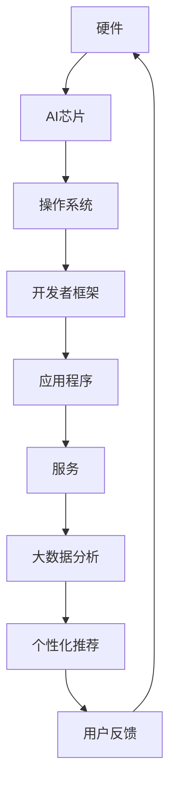

                 

关键词：苹果、AI应用、生态、技术趋势、未来发展

摘要：本文将探讨苹果在人工智能领域的最新举措——发布AI应用生态，并分析其对整个科技产业的影响、核心概念与联系、算法原理、数学模型、项目实践以及未来应用展望。

## 1. 背景介绍

随着人工智能技术的迅猛发展，苹果公司也加紧在AI领域布局。近日，苹果公司宣布推出全新AI应用生态，旨在通过整合硬件、软件和服务，为用户带来更加智能的体验。这一举措无疑将对苹果公司自身、整个科技产业以及用户产生深远的影响。

### 苹果公司AI应用生态的推出背景

苹果公司在AI领域的投资可以追溯到数年前。为了应对来自谷歌、亚马逊等科技巨头的竞争，苹果公司加大了对人工智能技术的研发力度，致力于将AI技术应用于其硬件、软件和服务中。在近年来，苹果公司在语音识别、图像识别、自然语言处理等方面取得了显著进展。例如，苹果公司旗下的Siri语音助手和Face ID人脸识别技术都在业内享有较高声誉。此次推出AI应用生态，正是苹果公司对其AI战略的一次全面升级。

### AI应用生态的推出对苹果公司的影响

苹果公司AI应用生态的推出，有助于进一步提升其产品竞争力。通过整合硬件、软件和服务，苹果公司能够为用户提供更加智能化、个性化的体验。这将有助于苹果公司在智能手机、平板电脑、智能音箱等消费电子市场中保持领先地位。此外，AI应用生态的推出还有利于苹果公司开拓新的商业机会，如智能家居、自动驾驶等领域。

## 2. 核心概念与联系

### 核心概念

在介绍苹果公司AI应用生态的核心概念之前，我们首先需要了解以下几个关键术语：

- **人工智能（AI）**：一种模拟人类智能的技术，包括机器学习、深度学习、自然语言处理、计算机视觉等领域。
- **硬件**：指苹果公司生产的智能手机、平板电脑、笔记本电脑、智能音箱等设备。
- **软件**：包括操作系统、应用程序、服务框架等。
- **服务**：指苹果公司提供的数据存储、云计算、音乐、视频等在线服务。

### 概念联系

苹果公司AI应用生态的构建，将以上核心概念紧密联系在一起。具体来说，苹果公司通过以下几个方面实现概念间的融合：

- **硬件+AI**：通过在硬件设备中集成AI芯片，提高设备的计算能力，为AI应用提供硬件支持。
- **软件+AI**：在操作系统中集成AI框架，使开发者能够轻松地开发和部署AI应用程序。
- **服务+AI**：通过大数据分析和机器学习，为用户提供个性化服务，如智能推荐、语音识别、图像识别等。

### Mermaid流程图

下面是一个简化的Mermaid流程图，展示苹果公司AI应用生态的核心概念和联系：



## 3. 核心算法原理 & 具体操作步骤

### 3.1 算法原理概述

苹果公司AI应用生态的核心算法包括以下几个方面：

- **深度学习**：通过神经网络模型，对大量数据进行分析和训练，从而实现图像识别、语音识别等任务。
- **自然语言处理**：通过对文本数据进行分析和处理，实现语言理解、文本生成等任务。
- **推荐系统**：基于用户行为和兴趣，为用户提供个性化推荐。

### 3.2 算法步骤详解

- **深度学习**：

  1. 数据收集：从各种来源收集大量图像、语音和文本数据。
  2. 数据预处理：对数据进行清洗、标注和分割。
  3. 模型训练：利用神经网络模型对预处理后的数据进行训练。
  4. 模型评估：对训练好的模型进行评估和优化。
  5. 应用部署：将训练好的模型部署到硬件设备中，实现实时推理和预测。

- **自然语言处理**：

  1. 文本预处理：对文本数据进行分析和清洗，提取关键信息。
  2. 词向量表示：将文本转化为向量表示，以便进行后续处理。
  3. 模型训练：利用神经网络模型对词向量进行训练。
  4. 文本生成：根据训练好的模型，生成新的文本。

- **推荐系统**：

  1. 数据收集：收集用户行为和兴趣数据。
  2. 数据处理：对用户数据进行清洗和转换。
  3. 模型训练：利用机器学习算法训练推荐模型。
  4. 推荐生成：根据用户数据和推荐模型，生成个性化推荐。

### 3.3 算法优缺点

- **深度学习**：

  - 优点：具有较强的自适应性和泛化能力，适用于各种复杂任务。

  - 缺点：对数据依赖性强，训练过程耗时较长。

- **自然语言处理**：

  - 优点：能够处理大规模文本数据，实现高效的语言理解。

  - 缺点：在处理长文本和复杂语法时，效果有限。

- **推荐系统**：

  - 优点：能够为用户提供个性化的推荐，提高用户体验。

  - 缺点：需要大量用户行为数据，且可能受到数据偏差的影响。

### 3.4 算法应用领域

- **深度学习**：广泛应用于图像识别、语音识别、自然语言处理等领域。

- **自然语言处理**：应用于智能客服、智能写作、智能翻译等领域。

- **推荐系统**：应用于电子商务、在线教育、社交媒体等领域。

## 4. 数学模型和公式 & 详细讲解 & 举例说明

### 4.1 数学模型构建

在苹果公司AI应用生态中，常用的数学模型包括神经网络模型、决策树模型、支持向量机模型等。

- **神经网络模型**：

  假设我们有一个输入向量 $X$，需要预测一个输出向量 $Y$。神经网络模型的基本结构如下：

  $$Y = \sigma(W_1 \cdot X + b_1) + W_2 \cdot \sigma(W_1 \cdot X + b_1) + b_2$$

  其中，$\sigma$ 是激活函数，$W_1$ 和 $W_2$ 是权重矩阵，$b_1$ 和 $b_2$ 是偏置向量。

- **决策树模型**：

  决策树模型的基本结构如下：

  $$Y = \sum_{i=1}^{n} w_i \cdot I(X \in R_i)$$

  其中，$X$ 是输入特征向量，$Y$ 是输出标签，$R_i$ 是第 $i$ 个区域的特征集合，$w_i$ 是权重。

- **支持向量机模型**：

  支持向量机模型的基本结构如下：

  $$Y = \text{sign}(\sum_{i=1}^{n} \alpha_i y_i (w \cdot x_i) + b)$$

  其中，$x_i$ 是输入特征向量，$y_i$ 是标签，$\alpha_i$ 是权重，$w$ 是权重向量，$b$ 是偏置。

### 4.2 公式推导过程

以神经网络模型为例，我们来进行公式推导。

- **前向传播**：

  输入向量 $X$ 经过一层神经网络，输出向量 $Y$ 的计算过程如下：

  $$Y = \sigma(W_1 \cdot X + b_1) + W_2 \cdot \sigma(W_1 \cdot X + b_1) + b_2$$

  其中，$\sigma$ 是激活函数，$W_1$ 和 $W_2$ 是权重矩阵，$b_1$ 和 $b_2$ 是偏置向量。

- **反向传播**：

  假设我们已知输出向量 $Y$ 和标签向量 $T$，需要计算权重矩阵 $W_1$ 和 $W_2$ 的梯度。

  $$\frac{\partial L}{\partial W_1} = \frac{\partial L}{\partial Y} \cdot \frac{\partial Y}{\partial W_1} = (Y - T) \cdot \sigma'(W_1 \cdot X + b_1) \cdot X$$

  $$\frac{\partial L}{\partial W_2} = \frac{\partial L}{\partial Y} \cdot \frac{\partial Y}{\partial W_2} = (Y - T) \cdot \sigma'(W_1 \cdot X + b_1) \cdot W_2$$

  其中，$L$ 是损失函数，$\sigma'$ 是激活函数的导数。

### 4.3 案例分析与讲解

我们以一个简单的图像分类任务为例，来讲解神经网络模型的训练过程。

- **数据集**：

  假设我们有一个包含1000张图片的数据集，每张图片的大小为 $28 \times 28$ 像素。

- **神经网络模型**：

  我们选择一个简单的两层神经网络，包含一个输入层、一个隐藏层和一个输出层。

- **训练过程**：

  1. **前向传播**：

     对每张图片，将其输入到神经网络中，输出一个概率分布，表示图片属于每个类别的概率。

  2. **反向传播**：

     根据输出概率分布和实际标签，计算损失函数，并利用梯度下降法更新权重矩阵和偏置向量。

  3. **迭代**：

     重复前向传播和反向传播，直到网络收敛。

## 5. 项目实践：代码实例和详细解释说明

### 5.1 开发环境搭建

在开始编写代码之前，我们需要搭建一个适合开发苹果公司AI应用生态的环境。

- **操作系统**：Windows、macOS 或 Linux
- **编程语言**：Python
- **框架**：TensorFlow、PyTorch 等
- **库**：NumPy、Pandas、Scikit-learn 等

### 5.2 源代码详细实现

以下是使用 TensorFlow 框架实现的简单神经网络模型，用于图像分类任务。

```python
import tensorflow as tf
from tensorflow.keras import layers

# 定义神经网络模型
model = tf.keras.Sequential([
    layers.Flatten(input_shape=(28, 28)),
    layers.Dense(128, activation='relu'),
    layers.Dense(10, activation='softmax')
])

# 编译模型
model.compile(optimizer='adam',
              loss='sparse_categorical_crossentropy',
              metrics=['accuracy'])

# 加载数据集
(x_train, y_train), (x_test, y_test) = tf.keras.datasets.mnist.load_data()

# 预处理数据
x_train = x_train.astype('float32') / 255
x_test = x_test.astype('float32') / 255

# 训练模型
model.fit(x_train, y_train, epochs=5)

# 评估模型
test_loss, test_acc = model.evaluate(x_test, y_test, verbose=2)
print('\nTest accuracy:', test_acc)
```

### 5.3 代码解读与分析

以上代码实现了一个简单的神经网络模型，用于对 MNIST 数据集中的手写数字进行分类。

- **模型定义**：

  使用 `Sequential` 类定义一个顺序模型，包含一个输入层、一个隐藏层和一个输出层。输入层使用 `Flatten` 层将图像数据展平为一维数组，隐藏层使用 `Dense` 层实现全连接神经网络，输出层使用 `softmax` 激活函数实现多分类。

- **模型编译**：

  使用 `compile` 方法配置模型，指定优化器、损失函数和评价指标。

- **数据预处理**：

  将图像数据转换为浮点数，并除以 255，使其在 0 到 1 之间。

- **模型训练**：

  使用 `fit` 方法训练模型，指定训练数据、训练周期等参数。

- **模型评估**：

  使用 `evaluate` 方法评估模型在测试数据上的性能。

## 6. 实际应用场景

苹果公司AI应用生态在多个领域具有广泛的应用前景，以下列举几个典型应用场景：

- **智能手机**：通过AI应用生态，智能手机可以实现更加智能的拍照、语音识别、智能推荐等功能。
- **智能家居**：智能音箱、智能门锁等设备可以借助AI应用生态，实现更加智能化的家居控制。
- **自动驾驶**：自动驾驶汽车可以通过AI应用生态，实现更加安全、高效的自动驾驶功能。
- **医疗健康**：AI应用生态可以帮助医生进行疾病诊断、健康监测等，提高医疗服务的质量和效率。

## 7. 工具和资源推荐

为了更好地开发和部署AI应用，以下推荐一些常用的工具和资源：

### 7.1 学习资源推荐

- 《深度学习》（Goodfellow、Bengio、Courville 著）：全面介绍深度学习的基础知识和应用方法。
- 《Python机器学习》（Sebastian Raschka 著）：详细介绍使用Python进行机器学习的实践方法。

### 7.2 开发工具推荐

- TensorFlow：一款流行的开源深度学习框架，支持多种编程语言。
- PyTorch：一款流行的开源深度学习框架，易于使用和扩展。

### 7.3 相关论文推荐

- "Deep Learning for Text Classification"（ACL 2018）：介绍深度学习在文本分类任务中的应用。
- "Recurrent Neural Networks for Speech Recognition"（ICML 2013）：介绍循环神经网络在语音识别任务中的应用。

## 8. 总结：未来发展趋势与挑战

### 8.1 研究成果总结

近年来，人工智能技术在多个领域取得了显著进展，如图像识别、自然语言处理、语音识别等。这些成果为苹果公司AI应用生态的构建奠定了坚实基础。

### 8.2 未来发展趋势

- **跨学科融合**：随着人工智能技术的不断发展，未来将出现更多跨学科的研究和应用。
- **开放生态**：苹果公司AI应用生态将与其他平台和开发者进行更加紧密的合作，推动整个产业的进步。
- **个性化服务**：基于大数据和机器学习，未来AI应用将更加注重用户个性化需求。

### 8.3 面临的挑战

- **数据隐私**：随着AI应用生态的扩展，数据隐私和安全问题将日益突出。
- **计算资源**：大规模AI应用需要更多的计算资源支持，对硬件性能和能耗提出更高要求。
- **法律法规**：随着AI技术的发展，相关法律法规也需要不断完善，以确保技术应用的合法性和合规性。

### 8.4 研究展望

未来，苹果公司AI应用生态将继续在硬件、软件和服务等方面进行创新，为用户提供更加智能、个性化的体验。同时，苹果公司也需要在数据隐私、计算资源、法律法规等方面不断优化，以应对未来的挑战。

## 9. 附录：常见问题与解答

### 9.1 问题1：什么是AI应用生态？

AI应用生态是指将人工智能技术应用于硬件、软件和服务等多个领域，形成一个相互关联、协同发展的生态系统。

### 9.2 问题2：苹果公司AI应用生态的优势是什么？

苹果公司AI应用生态的优势包括：强大的硬件支持、丰富的软件和服务资源、高度集成的开发环境以及广泛的应用场景。

### 9.3 问题3：苹果公司AI应用生态的未来发展趋势是什么？

未来，苹果公司AI应用生态将朝着跨学科融合、开放生态、个性化服务等方向发展。

### 9.4 问题4：如何应对AI应用生态面临的数据隐私、计算资源、法律法规等挑战？

应对这些挑战需要从技术、法律、政策等多个层面进行综合考虑，通过技术创新、法律法规完善和产业协同等方式，推动AI应用生态的健康发展。

---

作者：禅与计算机程序设计艺术 / Zen and the Art of Computer Programming
----------------------------------------------------------------

