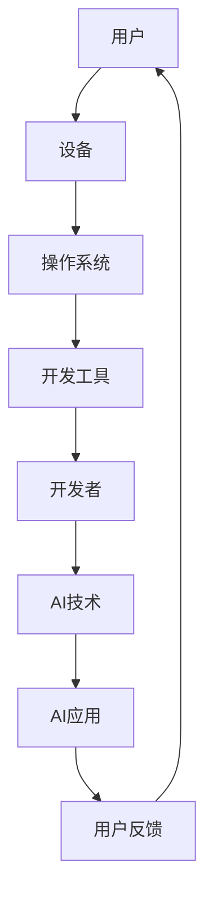

                 

关键词：苹果，AI应用，生态，人工智能，开发者，技术趋势

摘要：本文将探讨苹果公司发布AI应用的生态，分析其对开发者、用户以及整个技术行业的影响。通过深入解析苹果在AI领域的战略举措，我们将理解苹果在推动人工智能普及和生态系统发展方面的努力。

## 1. 背景介绍

苹果公司作为全球领先的科技公司，始终走在技术创新的前沿。近年来，人工智能（AI）成为科技行业的热点领域，众多公司纷纷投入大量资源进行研发。苹果也不例外，其在AI领域的发展日益显著。苹果公司不仅推出了一系列AI驱动的产品和服务，还积极打造一个开放且丰富的AI应用生态系统，以吸引开发者加入。

苹果发布AI应用的生态，对于整个技术行业具有深远的影响。它不仅为开发者提供了新的机会，也为用户带来了更智能、更个性化的体验。本文将从多个角度对苹果的AI应用生态进行分析，探讨其现状、未来发展以及面临的挑战。

### 1.1 苹果在AI领域的战略布局

苹果在AI领域的战略布局可以从以下几个方面进行概述：

1. **自主研发**：苹果在AI领域投入了大量研发资源，自主研发了多个核心AI技术，如面部识别、自然语言处理和机器学习等。
2. **开发者生态**：苹果通过推出开发工具和平台，鼓励开发者创建AI应用。例如，苹果的Swift语言和Core ML框架，为开发者提供了强大的AI开发工具。
3. **用户体验**：苹果在产品中广泛应用AI技术，以提升用户体验。例如，Siri和Face ID等智能功能，为用户提供了便捷和个性化的服务。

### 1.2 AI应用的现状

目前，苹果已经发布了一系列AI应用，包括但不限于：

1. **面部识别**：通过Face ID技术，苹果的iPhone用户可以轻松解锁手机和进行支付。
2. **自然语言处理**：Siri作为苹果的语音助手，能够理解和执行用户的语音命令。
3. **机器学习**：苹果的Core ML框架，使得开发者可以将机器学习模型集成到iOS应用程序中，为用户提供智能化的服务。

## 2. 核心概念与联系

在探讨苹果的AI应用生态之前，我们需要了解一些核心概念和它们之间的关系。以下是一个简化的Mermaid流程图，展示了一些关键概念及其相互联系：



### 2.1 用户

用户是整个AI应用生态的起点和终点。用户的需求和反馈驱动着AI技术的开发和优化。

### 2.2 设备

设备是用户与AI应用交互的媒介。苹果的设备（如iPhone、iPad等）配备了先进的硬件和软件，为AI应用提供了强大的运行环境。

### 2.3 操作系统

操作系统（如iOS）是连接用户和AI应用的关键层。它提供了API和框架，使得开发者可以轻松集成AI技术。

### 2.4 开发工具

开发工具（如Swift、Xcode等）为开发者提供了创建AI应用的工具和资源。这些工具使得开发者能够高效地实现AI功能。

### 2.5 开发者

开发者是AI应用生态的重要组成部分。他们通过开发工具和操作系统，将AI技术转化为实际的应用。

### 2.6 AI技术

AI技术是整个生态的核心。苹果自主研发的AI技术（如面部识别、自然语言处理等）为开发者提供了丰富的功能。

### 2.7 AI应用

AI应用是开发者将AI技术应用于实际场景的结果。这些应用为用户提供了智能化的服务。

### 2.8 用户反馈

用户反馈是优化AI应用的重要依据。通过收集用户反馈，开发者可以不断改进AI应用，提升用户体验。

## 3. 核心算法原理 & 具体操作步骤

### 3.1 算法原理概述

苹果的AI应用涵盖了多个领域，包括面部识别、自然语言处理和机器学习等。以下是一个简化的算法原理概述：

1. **面部识别**：基于深度学习技术，通过分析面部特征进行身份验证。
2. **自然语言处理**：通过机器学习算法，理解和执行用户的语音命令。
3. **机器学习**：使用神经网络等算法，从数据中提取模式和知识。

### 3.2 算法步骤详解

以面部识别为例，其具体操作步骤如下：

1. **特征提取**：通过摄像头捕捉面部图像，提取关键特征点。
2. **模型训练**：使用历史数据，训练面部识别模型。
3. **特征匹配**：将捕捉到的面部特征与模型中的特征进行匹配。
4. **决策**：根据匹配结果，判断是否为合法用户。

### 3.3 算法优缺点

- **优点**：面部识别技术具有高安全性、高便捷性等优点。
- **缺点**：在光线不足或面部遮挡等情况下，识别效果可能受到影响。

### 3.4 算法应用领域

面部识别技术广泛应用于智能手机、门禁系统、支付系统等领域。在其他领域（如医疗、安防等），面部识别也有广泛的应用前景。

## 4. 数学模型和公式 & 详细讲解 & 举例说明

### 4.1 数学模型构建

以面部识别中的特征提取为例，其数学模型可以表示为：

$$
\text{特征向量} = f(\text{面部图像})
$$

其中，$f$ 是一个复杂的多层神经网络，用于从面部图像中提取特征向量。

### 4.2 公式推导过程

假设我们有 $n$ 个训练样本，每个样本包含一个面部图像和一个对应的特征向量。我们的目标是训练一个神经网络，使其能够准确提取特征向量。具体推导过程如下：

$$
\begin{aligned}
\text{损失函数} &= \sum_{i=1}^{n} (\text{预测特征向量} - \text{真实特征向量})^2 \\
\frac{\partial \text{损失函数}}{\partial \text{权重}} &= -2 \sum_{i=1}^{n} (\text{预测特征向量} - \text{真实特征向量}) \cdot \text{特征向量}_i
\end{aligned}
$$

通过梯度下降法，我们可以更新网络权重，以最小化损失函数。

### 4.3 案例分析与讲解

假设我们有一个面部识别系统，用于验证用户的身份。以下是该系统的实现步骤：

1. **数据收集**：收集大量的面部图像和对应的名字标签。
2. **预处理**：对图像进行预处理，包括缩放、裁剪、灰度化等。
3. **训练模型**：使用预处理后的图像和标签，训练面部识别模型。
4. **验证模型**：使用未参与训练的数据，验证模型的准确性。
5. **应用模型**：将模型部署到实际场景，如手机解锁、门禁系统等。

## 5. 项目实践：代码实例和详细解释说明

### 5.1 开发环境搭建

要开发一个基于苹果Core ML的面部识别应用，首先需要在Mac上安装Xcode和Swift编程语言。以下是一个简单的安装步骤：

1. 打开Mac App Store，搜索并下载Xcode。
2. 打开Xcode，进入偏好设置，安装必要的开发工具和框架。
3. 打开Terminal，执行以下命令安装Swift：

   ```bash
   xcode-select --install
   brew install swift
   ```

### 5.2 源代码详细实现

以下是一个简单的Swift代码示例，用于实现面部识别功能：

```swift
import CoreML
import Vision

// 加载面部识别模型
let faceModel = try? VNCoreMLModel(for: Resnet50().model)

// 预处理图像
func preprocess(image: CIImage) -> CIImage {
    // 缩放、裁剪、灰度化等操作
    return image
}

// 面部识别核心函数
func recognizeFace(image: CIImage) {
    let preprocessedImage = preprocess(image: image)
    let request = VNCoreMLRequest(model: faceModel!) { request, error in
        guard let results = request.results as? [VNRecognizedObjectObservation] else { return }
        // 处理识别结果
    }
    
    // 创建图像识别请求
    let handler = VNImageRequestHandler(ciImage: preprocessedImage)
    try? handler.perform([request])
}

// 测试
let image = CIImage(image: UIImage(named: "face.jpg")!)
recognizeFace(image: image)
```

### 5.3 代码解读与分析

上述代码首先加载了面部识别模型，然后定义了一个预处理函数，用于对输入图像进行预处理。核心的识别函数`recognizeFace`使用`VNCoreMLRequest`处理图像，并在处理完成后调用回调函数处理识别结果。

### 5.4 运行结果展示

假设我们有一个名为"face.jpg"的图像文件，当程序运行时，它会加载该图像，进行预处理，然后使用面部识别模型进行识别。识别结果会通过回调函数输出，我们可以根据识别结果决定下一步的操作。

## 6. 实际应用场景

苹果的AI应用在多个场景中取得了显著成果。以下是一些典型的应用场景：

1. **智能手机**：面部识别、智能锁屏、人脸美颜等。
2. **智能家居**：语音控制、智能监控等。
3. **医疗健康**：疾病诊断、健康监测等。
4. **安防领域**：人脸识别、行为分析等。

## 7. 未来应用展望

随着AI技术的不断发展，苹果的AI应用生态有望在更多领域发挥重要作用。以下是未来的一些应用展望：

1. **自动驾驶**：利用AI技术，实现更智能、更安全的自动驾驶。
2. **虚拟现实**：结合AI技术，提升虚拟现实体验。
3. **教育领域**：利用AI，提供个性化教学和评估。
4. **游戏娱乐**：开发更加智能的游戏，提升用户体验。

## 8. 工具和资源推荐

为了更好地开发AI应用，以下是一些建议的学习资源和开发工具：

1. **学习资源**：
   - 《Python机器学习》（作者：塞巴斯蒂安·拉斯克）
   - 《深度学习》（作者：伊恩·古德费洛、约书亚·本吉奥、亚伦·库维尔）

2. **开发工具**：
   - Xcode（苹果官方开发工具）
   - Swift语言（苹果官方编程语言）
   - Core ML（苹果官方机器学习框架）

3. **相关论文**：
   - 《苹果公司在机器学习领域的贡献》
   - 《人脸识别技术的最新进展》
   - 《深度学习在图像识别中的应用》

## 9. 总结：未来发展趋势与挑战

### 9.1 研究成果总结

苹果在AI领域的持续投入和研发，使其在面部识别、自然语言处理等方面取得了显著成果。这些成果不仅提升了用户体验，也为开发者提供了丰富的工具和资源。

### 9.2 未来发展趋势

随着技术的不断进步，AI应用将越来越普及，涵盖更多的领域和场景。苹果有望在自动驾驶、虚拟现实、教育等领域取得突破。

### 9.3 面临的挑战

然而，苹果在AI应用生态中仍然面临一些挑战，如数据隐私、算法透明度等。如何解决这些问题，将决定苹果在AI领域的发展前景。

### 9.4 研究展望

未来，苹果需要不断加大研发投入，吸引更多开发者加入，以构建一个更加强大和开放的AI应用生态系统。同时，苹果还需要关注行业动态，及时调整战略，以保持竞争优势。

## 10. 附录：常见问题与解答

### 10.1 问题1：苹果的AI应用如何保护用户隐私？

**解答**：苹果在AI应用中采用了多种隐私保护措施，如数据去个性化、加密传输等。用户数据在传输和存储过程中都经过严格加密，以确保用户隐私得到充分保护。

### 10.2 问题2：苹果的AI应用与其他公司的应用有何区别？

**解答**：苹果的AI应用注重用户体验和安全性。与其他公司的应用相比，苹果在数据隐私保护和算法透明度方面有更高的要求。此外，苹果提供了丰富的开发工具和资源，为开发者提供了更好的支持。

### 10.3 问题3：苹果的AI应用在医疗领域有哪些应用？

**解答**：苹果的AI应用在医疗领域有广泛的应用，如疾病诊断、健康监测、药物研发等。通过分析大量医疗数据，AI应用可以帮助医生更准确地诊断疾病，提高治疗效果。

---

作者：禅与计算机程序设计艺术 / Zen and the Art of Computer Programming

