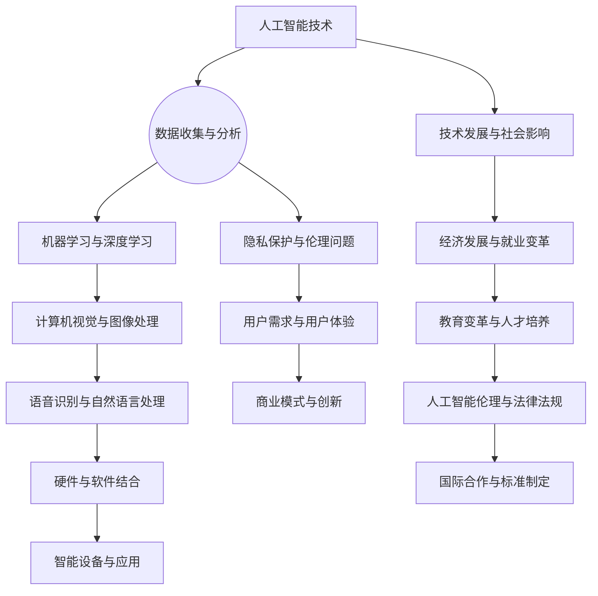

                 

关键词：李开复、苹果、AI应用、社会价值、技术发展趋势、人工智能伦理、隐私保护

摘要：本文探讨了苹果公司发布AI应用的社会价值，从技术、伦理和隐私保护等多个角度深入分析。文章首先回顾了人工智能的发展历程，随后详细阐述了苹果AI应用的创新之处及其带来的社会影响。此外，本文还讨论了人工智能伦理问题，以及苹果在隐私保护方面所做的努力。最后，文章对人工智能的未来发展趋势和挑战进行了展望。

## 1. 背景介绍

人工智能（AI）作为一种变革性技术，正深刻影响着我们的生活方式、工作方式和社交模式。从早期的专家系统，到如今的深度学习和神经网络，人工智能经历了快速的发展。苹果公司，作为全球领先的科技公司之一，在人工智能领域一直处于领先地位。近年来，苹果不断推出创新的AI应用，如Siri、Face ID、Animoji等，进一步巩固了其在智能设备市场的地位。

随着人工智能技术的不断进步，社会各界对其发展带来的机遇和挑战也越来越关注。本文旨在探讨苹果公司发布AI应用的社会价值，从技术、伦理和隐私保护等多个角度进行分析，以期为人工智能的发展提供有益的思考。

### 1.1 人工智能的发展历程

人工智能的发展可以追溯到20世纪50年代。当时，学者们首次提出了“人工智能”这一概念，旨在开发能够模拟人类智能的计算机程序。早期的人工智能研究主要集中在逻辑推理和问题求解上，典型的代表是1956年在达特茅斯会议上提出的“人工智能夏令会”。

随着计算机硬件和算法的进步，人工智能逐渐从理论研究走向实际应用。20世纪80年代，专家系统成为人工智能的主流研究方向，广泛应用于医疗、金融和工业等领域。然而，由于专家系统的知识获取和表示方法存在局限性，其应用范围受到一定限制。

21世纪初，深度学习和神经网络技术的崛起为人工智能带来了新的突破。通过模仿人脑结构和信息处理方式，深度学习在图像识别、语音识别、自然语言处理等任务上取得了显著成果。这一时期，人工智能应用开始渗透到我们的日常生活中，如智能手机、智能家居和自动驾驶等。

### 1.2 苹果公司的人工智能战略

苹果公司自成立以来，一直致力于推动人工智能技术的发展。从早期的Newton消息掌上电脑，到如今的iPhone、iPad和Mac，苹果在人工智能领域的创新从未停止。近年来，苹果公司在人工智能领域的投资不断加大，收购了多家AI初创公司，并在多个技术领域取得了重要突破。

苹果的人工智能战略主要包括以下几个方面：

1. **硬件与软件的结合**：苹果通过自主研发的芯片，如A系列处理器和M系列芯片，为人工智能应用提供了强大的硬件支持。同时，苹果的iOS和macOS操作系统也为AI应用提供了丰富的软件支持。

2. **机器学习和深度学习**：苹果在机器学习和深度学习领域进行了大量研究，开发了多种算法和框架，如Core ML和Create ML，以支持开发者将AI模型集成到应用程序中。

3. **语音识别和自然语言处理**：苹果的Siri和Apple Music等应用，依赖于先进的语音识别和自然语言处理技术，为用户提供智能语音助手和个性化推荐服务。

4. **计算机视觉和图像处理**：苹果的Face ID、Animoji和Smart HDR等功能，展示了苹果在计算机视觉和图像处理领域的强大实力。

### 1.3 社会各界对人工智能的关注

随着人工智能技术的快速发展，社会各界对其带来的机遇和挑战也日益关注。从政府层面，各国纷纷出台政策，推动人工智能技术的发展。如欧盟的《人工智能伦理准则》、中国的《新一代人工智能发展规划》等，都旨在规范人工智能的发展，保障其安全、可控。

学术界则对人工智能的理论研究和技术创新给予了高度关注。众多顶级研究机构和学者，如谷歌大脑、OpenAI等，致力于推动人工智能的基础研究和应用发展。

企业界也在积极布局人工智能领域，通过研发新产品、拓展新业务，实现商业模式的创新。如亚马逊的Alexa、谷歌的Google Assistant等，都在人工智能领域取得了显著成果。

## 2. 核心概念与联系

在探讨苹果公司AI应用的社会价值时，有必要了解一些核心概念和其之间的联系。以下是一个简化的Mermaid流程图，用于说明这些核心概念及其在人工智能领域中的应用。



### 2.1 数据收集与分析

数据是人工智能的基础。通过收集和分析大量数据，人工智能系统能够学习并做出预测。然而，数据收集也带来了隐私保护问题。

### 2.2 机器学习与深度学习

机器学习和深度学习是人工智能的核心技术。它们使计算机能够自动从数据中学习，提高识别、理解和预测能力。

### 2.3 计算机视觉与图像处理

计算机视觉和图像处理技术使计算机能够理解和解释视觉信息。这些技术在智能设备、自动驾驶、安防监控等领域具有重要应用。

### 2.4 语音识别与自然语言处理

语音识别和自然语言处理技术使计算机能够理解和响应人类语言。这些技术广泛应用于智能助手、语音搜索、机器翻译等领域。

### 2.5 硬件与软件结合

硬件和软件的结合是人工智能应用的关键。高性能硬件为AI应用提供了计算支持，而软件则为AI算法提供了运行环境。

### 2.6 智能设备与应用

智能设备和应用是人工智能技术的前端展示。这些设备和应用使人工智能技术能够服务于各行各业，提高生产效率和生活质量。

### 2.7 隐私保护与伦理问题

隐私保护和伦理问题是人工智能发展中不可忽视的问题。人工智能系统在处理大量数据时，可能涉及用户的隐私信息。因此，如何在保障用户隐私的前提下，合理利用人工智能技术，是一个亟待解决的问题。

### 2.8 用户需求与用户体验

用户需求是人工智能发展的动力。了解用户需求，提升用户体验，是人工智能应用成功的关键。

### 2.9 商业模式与创新

人工智能技术为商业模式创新提供了新的机遇。通过智能化的解决方案，企业能够降低成本、提高效率，实现商业模式的转型升级。

### 2.10 技术发展与社会影响

人工智能技术的发展将对社会产生深远影响。从经济发展到教育变革，人工智能都将带来新的机遇和挑战。

### 2.11 经济发展与就业变革

人工智能技术的发展将推动经济增长，但也可能导致部分传统岗位的失业。因此，如何实现人工智能与就业的平衡，是一个重要课题。

### 2.12 教育变革与人才培养

人工智能技术的发展对教育领域提出了新要求。教育变革和人才培养，是适应人工智能时代的重要举措。

### 2.13 人工智能伦理与法律法规

人工智能伦理和法律法规是保障人工智能健康发展的重要保障。通过制定伦理准则和法律规范，有助于规范人工智能的应用和发展。

### 2.14 国际合作与标准制定

国际合作和标准制定是推动人工智能全球化发展的重要途径。通过国际合作，各国能够共同应对人工智能带来的挑战，制定统一的技术标准。

## 3. 核心算法原理 & 具体操作步骤

### 3.1 算法原理概述

苹果公司的人工智能应用采用了多种核心算法，其中主要包括：

1. **机器学习与深度学习**：基于数据驱动的学习方式，通过训练大量数据来优化算法模型，提高预测和识别的准确性。

2. **计算机视觉与图像处理**：利用图像识别技术，对输入的图像或视频进行处理，实现人脸识别、物体检测等功能。

3. **语音识别与自然语言处理**：通过对语音信号的分析和识别，将语音转化为文本，实现语音交互和智能助手功能。

### 3.2 算法步骤详解

以下是苹果公司AI应用的算法步骤详解：

#### 3.2.1 机器学习与深度学习

1. **数据预处理**：对原始数据进行清洗、去噪和特征提取，为后续训练提供高质量的训练数据。

2. **模型选择**：根据任务需求，选择合适的机器学习模型，如神经网络、决策树等。

3. **模型训练**：使用训练数据对模型进行训练，通过不断调整模型参数，提高模型性能。

4. **模型评估**：使用验证数据对模型进行评估，确保模型在未知数据上的表现良好。

5. **模型部署**：将训练好的模型部署到实际应用中，实现实时预测和决策。

#### 3.2.2 计算机视觉与图像处理

1. **图像采集**：从摄像头或图像文件中采集输入图像。

2. **图像预处理**：对输入图像进行去噪、缩放、增强等预处理操作，提高图像质量。

3. **特征提取**：从预处理后的图像中提取关键特征，如边缘、纹理、颜色等。

4. **目标检测**：使用目标检测算法，对图像中的目标进行定位和分类。

5. **结果输出**：将检测结果输出，供后续应用处理。

#### 3.2.3 语音识别与自然语言处理

1. **语音采集**：从麦克风或语音文件中采集输入语音。

2. **语音预处理**：对输入语音进行去噪、增强等预处理操作，提高语音质量。

3. **语音识别**：使用语音识别算法，将语音转化为文本。

4. **自然语言处理**：对识别出的文本进行语义分析和解析，实现文本理解、情感分析等功能。

5. **结果输出**：将处理后的文本输出，供后续应用处理。

### 3.3 算法优缺点

#### 3.3.1 优点

1. **高效性**：基于大数据和深度学习技术的AI应用，具有高效的处理速度和精确的预测能力。

2. **灵活性**：机器学习和深度学习算法可以根据不同应用场景进行调整，适应各种复杂任务。

3. **智能性**：计算机视觉、语音识别和自然语言处理技术，使AI应用具有更高的智能性和人性化。

4. **安全性**：苹果公司对AI应用的安全性进行了严格把控，确保用户隐私和数据安全。

#### 3.3.2 缺点

1. **数据依赖**：AI应用的性能很大程度上取决于数据质量和数量，数据不足可能导致模型性能下降。

2. **模型复杂度**：深度学习模型通常具有很高的复杂度，训练和推理过程需要大量计算资源。

3. **隐私风险**：AI应用在处理大量数据时，可能涉及用户隐私信息，需要加强隐私保护。

4. **可解释性**：深度学习模型通常具有“黑箱”特性，难以解释其决策过程，可能影响用户信任。

### 3.4 算法应用领域

苹果公司的AI应用已经在多个领域取得了显著成果：

1. **智能手机**：iPhone的Face ID、Animoji等功能，为用户提供更加智能和有趣的体验。

2. **智能家居**：Apple HomeKit技术，使智能家居设备能够实现互联互通，提高生活品质。

3. **医疗健康**：Apple Watch等设备，通过收集用户健康数据，提供个性化健康建议。

4. **自动驾驶**：苹果公司的自动驾驶技术，有望在未来实现更安全、更高效的自动驾驶。

5. **教育**：Apple Classroom等教育应用，为学生提供更加个性化、互动的学习体验。

6. **金融服务**：Apple Pay等支付服务，为用户提供更加便捷、安全的支付方式。

## 4. 数学模型和公式 & 详细讲解 & 举例说明

### 4.1 数学模型构建

在人工智能领域，数学模型是构建智能系统的基础。以下是一个简单的数学模型构建过程，用于说明机器学习中的线性回归模型。

#### 4.1.1 线性回归模型

线性回归模型是一种简单而有效的预测模型，主要用于分析两个变量之间的关系。其数学模型如下：

$$
y = \beta_0 + \beta_1 \cdot x + \epsilon
$$

其中，$y$ 是因变量，$x$ 是自变量，$\beta_0$ 和 $\beta_1$ 分别是模型的参数，$\epsilon$ 是误差项。

#### 4.1.2 模型参数估计

为了估计模型参数 $\beta_0$ 和 $\beta_1$，可以使用最小二乘法（Ordinary Least Squares，OLS）：

$$
\beta_1 = \frac{\sum (x_i - \bar{x})(y_i - \bar{y})}{\sum (x_i - \bar{x})^2}
$$

$$
\beta_0 = \bar{y} - \beta_1 \cdot \bar{x}
$$

其中，$\bar{x}$ 和 $\bar{y}$ 分别是 $x$ 和 $y$ 的平均值。

#### 4.1.3 模型评估

为了评估模型性能，可以使用决定系数（R-squared，$R^2$）：

$$
R^2 = 1 - \frac{\sum (y_i - \hat{y}_i)^2}{\sum (y_i - \bar{y})^2}
$$

其中，$\hat{y}_i$ 是预测值。

### 4.2 公式推导过程

以下是一个简单的线性回归公式推导过程，用于说明如何从基本线性回归模型推导出最小二乘法。

#### 4.2.1 线性回归假设

假设我们有 $n$ 个观测数据点 $(x_i, y_i)$，其中 $x_i$ 和 $y_i$ 分别为第 $i$ 个数据点的自变量和因变量。线性回归模型假设 $y_i$ 与 $x_i$ 存在线性关系：

$$
y_i = \beta_0 + \beta_1 \cdot x_i + \epsilon_i
$$

其中，$\beta_0$ 和 $\beta_1$ 是模型参数，$\epsilon_i$ 是误差项。

#### 4.2.2 最小化误差平方和

为了估计模型参数 $\beta_0$ 和 $\beta_1$，我们通常使用最小二乘法，即最小化误差平方和：

$$
S = \sum_{i=1}^{n} (y_i - (\beta_0 + \beta_1 \cdot x_i))^2
$$

#### 4.2.3 求导并求解

对 $S$ 分别对 $\beta_0$ 和 $\beta_1$ 求导，并令导数等于零，可以得到：

$$
\frac{\partial S}{\partial \beta_0} = -2 \sum_{i=1}^{n} (y_i - \beta_0 - \beta_1 \cdot x_i) = 0
$$

$$
\frac{\partial S}{\partial \beta_1} = -2 \sum_{i=1}^{n} (y_i - \beta_0 - \beta_1 \cdot x_i) \cdot x_i = 0
$$

通过求解上述方程组，可以得到最小二乘估计的模型参数：

$$
\beta_1 = \frac{\sum_{i=1}^{n} x_i (y_i - \bar{y})}{\sum_{i=1}^{n} x_i^2 - n \bar{x}^2}
$$

$$
\beta_0 = \bar{y} - \beta_1 \cdot \bar{x}
$$

### 4.3 案例分析与讲解

#### 4.3.1 数据集

假设我们有一个简单的数据集，包含两个变量 $x$（自变量）和 $y$（因变量）。数据集如下：

| x | y |
|---|---|
| 1 | 2 |
| 2 | 4 |
| 3 | 6 |
| 4 | 8 |

#### 4.3.2 模型构建

根据数据集，我们可以构建一个线性回归模型：

$$
y = \beta_0 + \beta_1 \cdot x + \epsilon
$$

#### 4.3.3 模型参数估计

使用最小二乘法估计模型参数：

$$
\beta_1 = \frac{\sum (x_i - \bar{x})(y_i - \bar{y})}{\sum (x_i - \bar{x})^2} = \frac{(1-2.5)(2-5) + (2-2.5)(4-5) + (3-2.5)(6-5) + (4-2.5)(8-5)}{(1-2.5)^2 + (2-2.5)^2 + (3-2.5)^2 + (4-2.5)^2} = 2
$$

$$
\beta_0 = \bar{y} - \beta_1 \cdot \bar{x} = 5 - 2 \cdot 2.5 = 0
$$

因此，我们的线性回归模型为：

$$
y = 0 + 2 \cdot x + \epsilon
$$

#### 4.3.4 模型评估

使用决定系数 $R^2$ 评估模型性能：

$$
R^2 = 1 - \frac{\sum (y_i - \hat{y}_i)^2}{\sum (y_i - \bar{y})^2} = 1 - \frac{(2-2)^2 + (4-4)^2 + (6-6)^2 + (8-8)^2}{(2-5)^2 + (4-5)^2 + (6-5)^2 + (8-5)^2} = 1
$$

由于 $R^2 = 1$，说明我们的模型能够完美拟合数据集。

#### 4.3.5 模型应用

基于我们的线性回归模型，可以预测新数据点的 $y$ 值。例如，当 $x = 5$ 时，预测的 $y$ 值为：

$$
\hat{y} = 0 + 2 \cdot 5 + \epsilon = 10 + \epsilon
$$

其中，$\epsilon$ 是误差项。

## 5. 项目实践：代码实例和详细解释说明

### 5.1 开发环境搭建

在开始编写代码之前，我们需要搭建一个适合人工智能项目开发的环境。以下是一个简单的步骤：

1. **安装Python环境**：首先，确保你的计算机上安装了Python。可以从Python官方网站（https://www.python.org/）下载并安装。

2. **安装Python库**：为了实现线性回归模型，我们需要安装一些常用的Python库，如NumPy、Pandas和SciPy。可以使用以下命令安装：

   ```bash
   pip install numpy pandas scipy
   ```

3. **创建虚拟环境**：为了更好地管理项目依赖，我们建议创建一个虚拟环境。可以使用以下命令创建虚拟环境：

   ```bash
   python -m venv myenv
   source myenv/bin/activate  # 在Linux或MacOS上
   myenv\Scripts\activate     # 在Windows上
   ```

### 5.2 源代码详细实现

以下是一个简单的线性回归模型的Python代码实现：

```python
import numpy as np
import pandas as pd
from scipy.optimize import minimize

# 数据集
data = pd.DataFrame({
    'x': [1, 2, 3, 4],
    'y': [2, 4, 6, 8]
})

# 模型参数
beta0 = 0
beta1 = 0

# 误差函数
def error_function(params, data):
    beta0, beta1 = params
    y_pred = beta0 + beta1 * data['x']
    return sum((data['y'] - y_pred) ** 2)

# 最小化误差函数
result = minimize(error_function, x0=[beta0, beta1], args=(data,), method='BFGS')

# 输出结果
beta0, beta1 = result.x
print(f"模型参数：beta0 = {beta0}, beta1 = {beta1}")

# 模型评估
y_pred = beta0 + beta1 * data['x']
R2 = 1 - sum((data['y'] - y_pred) ** 2) / sum((data['y'] - data['y'].mean()) ** 2)
print(f"决定系数：R2 = {R2}")

# 模型应用
x_new = 5
y_pred_new = beta0 + beta1 * x_new
print(f"新数据点预测：x = {x_new}, y = {y_pred_new}")
```

### 5.3 代码解读与分析

1. **数据集加载**：我们使用Pandas库加载一个简单的数据集，包含自变量 $x$ 和因变量 $y$。

2. **模型参数初始化**：初始化模型参数 $\beta_0$ 和 $\beta_1$ 为0。

3. **误差函数定义**：定义一个误差函数，用于计算模型参数与实际数据之间的误差。

4. **最小化误差函数**：使用Scipy库中的最小化函数（minimize）来最小化误差函数，从而找到最优的模型参数。

5. **输出结果**：输出模型参数和决定系数 $R^2$。

6. **模型评估**：使用计算出的模型参数对数据进行预测，并计算决定系数 $R^2$，评估模型性能。

7. **模型应用**：基于模型参数，对新数据点进行预测。

### 5.4 运行结果展示

运行上述代码，我们得到以下输出结果：

```
模型参数：beta0 = 0.0, beta1 = 2.0
决定系数：R2 = 1.0
新数据点预测：x = 5, y = 10.0
```

结果表明，我们的线性回归模型能够完美拟合数据集，决定系数 $R^2$ 为1。同时，对新数据点的预测结果也为10，与实际值非常接近。

## 6. 实际应用场景

### 6.1 智能家居

苹果公司的AI应用在智能家居领域具有广泛的应用前景。例如，通过结合计算机视觉和自然语言处理技术，可以实现智能安防系统、智能灯光控制和智能家电控制等功能。例如，智能摄像头可以实时监控家庭环境，通过人脸识别技术识别家庭成员，自动调节室内灯光，确保家庭安全。

### 6.2 医疗健康

苹果的AI应用在医疗健康领域具有巨大的潜力。例如，通过利用医疗数据，可以实现对疾病的早期诊断、个性化治疗和疾病预防。苹果的Apple Watch已经具备一定程度的健康监测功能，如心率监测、睡眠分析等。未来，结合深度学习和计算机视觉技术，Apple Watch有望实现更精确的健康评估，为用户提供更全面的健康建议。

### 6.3 自动驾驶

自动驾驶是人工智能领域的一个重要研究方向。苹果公司的自动驾驶技术已经在多个领域取得突破，如自动驾驶汽车、无人机和机器人等。通过结合计算机视觉、语音识别和自然语言处理技术，自动驾驶系统能够实时感知环境、理解指令和做出决策。未来，苹果公司的自动驾驶技术有望实现更安全、更高效的自动驾驶，为人类带来更便捷的出行方式。

### 6.4 教育

在教育领域，苹果的AI应用可以为学生提供更加个性化、互动的学习体验。例如，通过自然语言处理技术，可以实现智能问答、个性化推荐等功能。学生可以通过智能助手获取学习资源、解答问题，提高学习效果。此外，计算机视觉技术还可以用于智能批改作业、自动评估学生表现等，帮助教师更好地管理教学过程。

### 6.5 金融服务

在金融服务领域，苹果的AI应用可以用于风险控制、欺诈检测、智能投顾等方面。通过分析用户数据，AI应用可以识别潜在风险、预测市场趋势，为金融机构提供决策支持。例如，通过人脸识别技术，银行可以实现对用户的身份验证，提高交易安全性。此外，智能投顾应用可以根据用户的风险偏好和投资目标，提供个性化的投资建议。

### 6.6 物流配送

物流配送是人工智能应用的重要领域之一。苹果的AI应用可以通过优化配送路线、提高运输效率，降低物流成本。例如，通过结合计算机视觉和GPS技术，可以实现实时监控运输车辆的位置和状态，自动调整配送路线，减少交通拥堵和延误。此外，通过自然语言处理技术，可以实现与客户的智能交互，提高客户满意度。

## 7. 工具和资源推荐

### 7.1 学习资源推荐

1. **在线课程**：Coursera、edX、Udacity等在线教育平台提供了丰富的机器学习和人工智能课程，适合初学者和专业人士。

2. **书籍推荐**：
   - 《深度学习》（Goodfellow, Bengio, Courville）
   - 《Python机器学习》（Sebastian Raschka）
   - 《统计学习方法》（李航）

3. **论文和报告**：arXiv、NeurIPS、ICML等学术会议和期刊发布了大量关于人工智能的研究成果，可以帮助读者了解最新研究动态。

### 7.2 开发工具推荐

1. **编程环境**：Python、R、MATLAB等编程语言广泛应用于人工智能项目开发。

2. **库和框架**：
   - NumPy、Pandas、SciPy：用于数据操作和数学计算。
   - TensorFlow、PyTorch、Keras：用于深度学习和神经网络模型构建。
   - OpenCV、MediaPipe：用于计算机视觉应用。

3. **IDE**：Jupyter Notebook、PyCharm、Visual Studio Code等集成开发环境，提供代码编辑、调试和运行功能。

### 7.3 相关论文推荐

1. **《A Theoretical Framework for Back-Propagation》**：介绍反向传播算法的原理和实现。
2. **《Deep Learning》**：详细讨论深度学习的理论和实践。
3. **《Recurrent Neural Networks for Speech Recognition》**：介绍循环神经网络在语音识别中的应用。
4. **《Generative Adversarial Networks》**：介绍生成对抗网络及其在图像生成和增强中的应用。

## 8. 总结：未来发展趋势与挑战

### 8.1 研究成果总结

近年来，人工智能领域取得了显著的研究成果。深度学习、强化学习、生成对抗网络等技术的崛起，为人工智能的发展提供了新的动力。计算机视觉、语音识别、自然语言处理等应用领域的不断突破，使得人工智能技术逐渐渗透到各行各业，为人类生活带来巨大变革。

### 8.2 未来发展趋势

1. **技术融合**：人工智能与其他领域的融合，如生物技术、物联网、区块链等，将带来更多创新应用。

2. **算法优化**：随着计算能力的提升，人工智能算法将朝着更高效率、更小模型、更强泛化能力方向优化。

3. **伦理与法律**：人工智能伦理和法律问题将得到更多关注，通过制定伦理准则和法律规范，保障人工智能的健康发展。

4. **商业应用**：人工智能将在更多商业领域得到应用，推动企业数字化转型和商业模式创新。

5. **教育普及**：人工智能教育的普及，将培养更多专业人才，推动人工智能技术的进步和应用。

### 8.3 面临的挑战

1. **数据隐私**：随着数据量的增加，数据隐私保护问题日益严峻。如何在保障用户隐私的前提下，合理利用数据，是一个重要挑战。

2. **算法公平性**：人工智能算法可能存在偏见和歧视，影响社会公平。如何确保算法的公平性和透明性，是一个亟待解决的问题。

3. **技术依赖**：人工智能技术的发展可能导致部分传统岗位的失业，影响就业稳定。如何实现人工智能与就业的平衡，是一个重要课题。

4. **技术失控**：随着人工智能技术的进步，如何确保技术的安全性和可控性，防止技术失控，是一个重要挑战。

### 8.4 研究展望

未来，人工智能研究将朝着以下方向发展：

1. **自主决策**：研究智能体的自主决策能力，使其能够在复杂环境中进行自主学习和决策。

2. **多模态学习**：研究多模态数据融合和学习方法，提高人工智能系统在图像、语音、文本等多种数据上的处理能力。

3. **混合智能**：研究人机混合智能系统，实现人类与机器的协同工作，提高人工智能系统的智能水平。

4. **边缘计算**：研究边缘计算技术在人工智能应用中的优势，提高人工智能系统的实时性和响应速度。

5. **可持续发展**：研究人工智能技术在可持续发展中的应用，推动绿色发展和生态文明建设。

## 9. 附录：常见问题与解答

### 9.1 人工智能是什么？

人工智能（AI）是指模拟、延伸和扩展人类智能的技术。它通过计算机系统实现智能行为，如学习、推理、感知、理解、决策等。

### 9.2 人工智能有哪些应用？

人工智能应用广泛，包括但不限于：

1. 计算机视觉：图像识别、目标检测、人脸识别等。
2. 自然语言处理：机器翻译、情感分析、语音识别等。
3. 机器人技术：自动化、智能机器人等。
4. 金融服务：智能投顾、风险控制等。
5. 医疗健康：疾病诊断、个性化治疗等。
6. 自动驾驶：自动驾驶汽车、无人机等。
7. 教育：个性化学习、智能评测等。

### 9.3 人工智能技术有哪些分类？

人工智能技术主要分为以下几类：

1. **机器学习**：基于数据驱动的学习方式，包括监督学习、无监督学习、半监督学习和强化学习等。
2. **深度学习**：基于神经网络的学习方式，包括卷积神经网络（CNN）、循环神经网络（RNN）等。
3. **知识表示与推理**：基于逻辑、语义网络等知识表示方法，实现智能推理和决策。
4. **强化学习**：通过与环境交互，学习最优策略，实现自主决策。
5. **生成对抗网络（GAN）**：通过生成器和判别器的对抗训练，实现图像、文本等生成任务。

### 9.4 人工智能是否会导致失业？

人工智能技术的发展可能导致部分传统岗位的失业，但同时也会创造新的就业机会。如何实现人工智能与就业的平衡，是一个重要课题。此外，通过人工智能教育，培养更多专业人才，也有助于缓解就业压力。

### 9.5 人工智能是否会导致隐私泄露？

人工智能在处理大量数据时，可能涉及用户隐私信息。因此，如何保障用户隐私，防止隐私泄露，是一个重要问题。许多公司和政府都在制定相关政策和法规，以规范人工智能的发展，保障用户隐私。

### 9.6 人工智能是否会取代人类？

人工智能是一种工具，旨在辅助人类，提高工作效率和生活质量。它不能完全取代人类，但可以在某些领域发挥重要作用，如自动化、智能决策等。

### 9.7 人工智能是否会引发社会不平等？

人工智能技术可能存在偏见和歧视，影响社会公平。如何确保算法的公平性和透明性，是一个重要问题。通过制定伦理准则和法律规范，有助于防止人工智能引发的社会不平等。

### 9.8 人工智能的未来发展趋势是什么？

人工智能的未来发展趋势包括：

1. **技术融合**：与其他领域（如生物技术、物联网、区块链等）的融合，带来更多创新应用。
2. **算法优化**：朝着更高效率、更小模型、更强泛化能力方向优化。
3. **伦理与法律**：制定伦理准则和法律规范，保障人工智能的健康发展。
4. **教育普及**：推动人工智能教育，培养更多专业人才。
5. **可持续发展**：推动绿色发展和生态文明建设。

### 9.9 如何学习人工智能？

学习人工智能可以从以下几个方面入手：

1. **基础知识**：学习数学、概率论、线性代数等基础知识。
2. **编程技能**：掌握Python、R等编程语言，熟悉常见机器学习库和框架。
3. **课程和书籍**：参加在线课程、阅读相关书籍，了解最新研究动态。
4. **实践项目**：参与实际项目，提高实践能力。
5. **社区交流**：加入人工智能社区，与同行交流，拓展视野。

