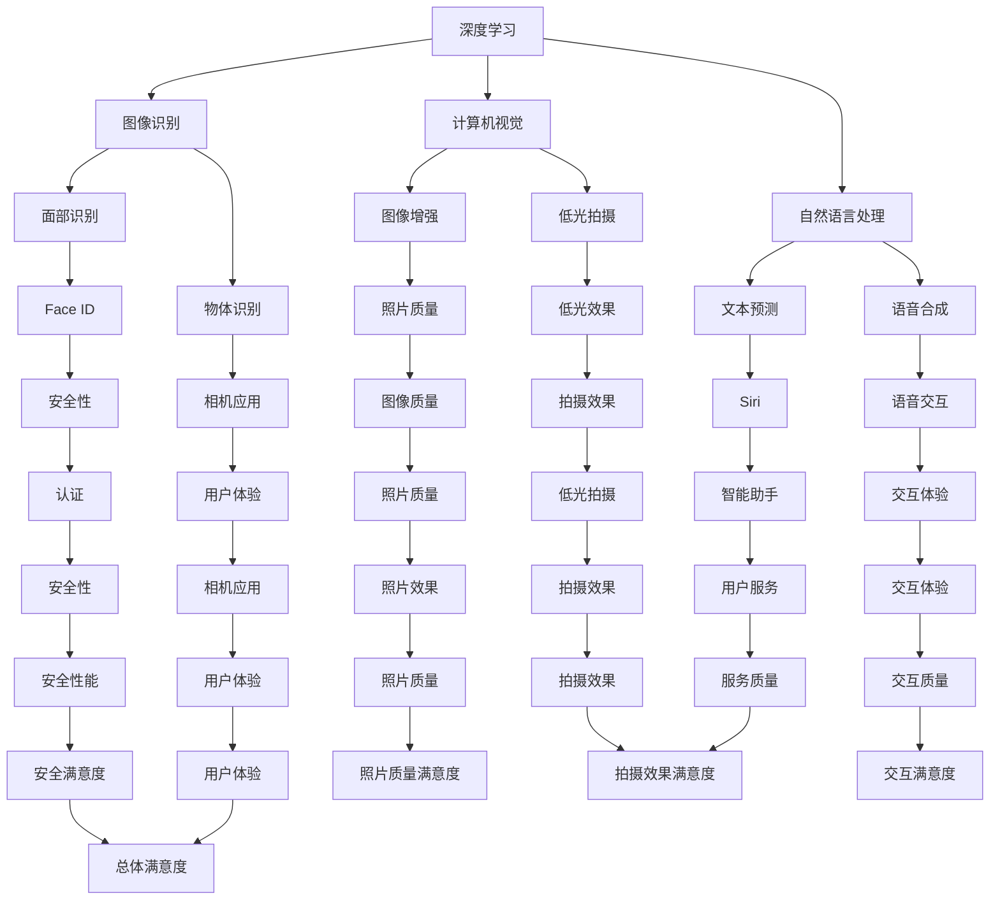

                 

关键词：苹果，人工智能，AI应用，科技价值，深度学习，计算机视觉，自然语言处理，用户体验，开发者工具

## 摘要

随着人工智能技术的迅猛发展，苹果公司也逐步将其融入到自身的硬件和软件产品中。本文旨在探讨苹果发布AI应用的科技价值，包括其在深度学习、计算机视觉、自然语言处理等领域的创新，以及其对用户体验和开发者工具的提升。通过分析苹果的AI战略，我们可以看到这一举措对未来科技发展的影响和潜在挑战。

## 1. 背景介绍

近年来，人工智能（AI）已经成为了科技界的热门话题。从自动驾驶汽车到智能家居，从医疗诊断到金融分析，AI的应用无处不在。苹果公司作为全球科技行业的领军企业，也在积极拥抱这一技术趋势。其最新的iOS和iPadOS系统已经集成了多种AI功能，如智能助手Siri、面部识别技术Face ID、以及增强现实（AR）等。

苹果的AI战略不仅体现在其硬件产品上，还包括其软件生态系统。开发者可以通过Core ML框架将AI模型集成到自己的应用程序中，从而为用户提供更加智能化的服务。此外，苹果还在2017年收购了机器学习公司Turi（现更名为Apple Machine Learning），进一步强化其在AI领域的竞争力。

## 2. 核心概念与联系

### 2.1 深度学习

深度学习是人工智能的一个分支，通过模拟人脑的神经网络结构来进行学习和决策。苹果在深度学习领域取得了一系列的突破，特别是在图像识别和语音识别方面。

#### 2.1.1 图像识别

苹果利用深度学习技术，实现了高度精准的面部识别和物体识别功能。例如，Face ID可以通过分析用户的脸部特征来进行身份验证，而相机应用中的物体识别功能可以帮助用户快速识别照片中的对象。

#### 2.1.2 语音识别

苹果的智能助手Siri的语音识别能力也得益于深度学习技术。Siri可以理解用户的自然语言指令，并提供相应的服务，如设定提醒、发送短信、播放音乐等。

### 2.2 计算机视觉

计算机视觉是人工智能的重要应用领域之一，苹果在这一领域也取得了显著的进展。其相机应用中的图像增强和低光拍摄功能，就是计算机视觉技术的典型应用。

#### 2.2.1 图像增强

通过深度学习算法，苹果的相机可以自动调整曝光时间和色彩平衡，使得照片在多种光照条件下都能保持高质量的视觉效果。

#### 2.2.2 低光拍摄

苹果的相机还利用计算机视觉技术，在低光环境下实现更好的拍摄效果。这主要通过增加曝光时间和优化图像处理算法来实现。

### 2.3 自然语言处理

自然语言处理（NLP）是人工智能的另一个重要分支，苹果在NLP领域也进行了大量投入。其Siri和iOS系统的文本预测功能，就是NLP技术的体现。

#### 2.3.1 文本预测

通过分析用户的输入历史和上下文，Siri可以预测用户接下来可能输入的内容，从而提供更加智能化的交互体验。

#### 2.3.2 语音合成

苹果的语音合成技术也基于NLP，它能够生成自然流畅的语音，使得Siri的语音交互更加真实和人性。

### 2.4 Mermaid 流程图

以下是苹果AI应用的核心概念与联系Mermaid流程图：



## 3. 核心算法原理 & 具体操作步骤

### 3.1 算法原理概述

苹果的AI应用主要依赖于深度学习和机器学习算法。深度学习算法通过多层神经网络来模拟人脑的学习过程，从而实现复杂的特征提取和分类任务。机器学习算法则通过训练模型来识别数据中的模式和规律，从而进行预测和决策。

### 3.2 算法步骤详解

#### 3.2.1 数据预处理

在开始训练模型之前，需要对数据集进行预处理，包括数据清洗、归一化和特征提取等步骤。这一步骤对于模型的训练效果至关重要。

#### 3.2.2 模型训练

使用预处理后的数据集来训练模型。训练过程包括前向传播、反向传播和权重更新等步骤，直到模型达到预设的精度。

#### 3.2.3 模型评估

通过测试数据集来评估模型的性能，包括准确率、召回率和F1值等指标。如果模型性能不满足要求，则需要回到步骤3.2.2进行优化。

#### 3.2.4 模型部署

将训练好的模型部署到实际应用中，例如相机应用或智能助手Siri。在部署过程中，需要考虑模型的计算效率和资源占用。

### 3.3 算法优缺点

#### 优点

1. **高精度**：深度学习和机器学习算法在图像识别、语音识别和自然语言处理等领域具有很高的精度。
2. **自适应性强**：模型可以根据不同的数据集和应用场景进行自适应调整。
3. **资源占用小**：苹果的AI应用主要在移动设备上运行，因此需要考虑到资源占用问题。深度学习和机器学习算法在这方面表现良好。

#### 缺点

1. **数据需求大**：深度学习和机器学习算法需要大量的数据进行训练，这在某些领域可能存在数据不足的问题。
2. **计算成本高**：训练深度学习和机器学习模型需要大量的计算资源，这在某些情况下可能不可行。
3. **易受攻击**：深度学习和机器学习算法可能受到对抗性攻击，从而影响其性能。

### 3.4 算法应用领域

苹果的AI应用主要应用于以下几个方面：

1. **图像识别**：包括面部识别、物体识别和图像增强等。
2. **语音识别**：包括语音合成和语音识别等。
3. **自然语言处理**：包括文本预测、机器翻译和情感分析等。
4. **计算机视觉**：包括图像增强和低光拍摄等。

## 4. 数学模型和公式 & 详细讲解 & 举例说明

### 4.1 数学模型构建

苹果的AI应用主要依赖于深度学习和机器学习算法，因此其数学模型构建主要包括神经网络和机器学习算法两部分。

#### 4.1.1 神经网络

神经网络是一种由大量神经元组成的计算模型，用于模拟人脑的神经网络结构。其数学模型可以表示为：

\[ y = \sigma(\omega_1 \cdot x + b_1) \]

其中，\( y \) 是输出，\( \sigma \) 是激活函数，\( \omega_1 \) 是权重，\( x \) 是输入，\( b_1 \) 是偏置。

#### 4.1.2 机器学习算法

机器学习算法主要包括线性回归、逻辑回归和决策树等。其数学模型可以表示为：

\[ y = \sigma(\omega \cdot x + b) \]

其中，\( y \) 是输出，\( \omega \) 是权重，\( x \) 是输入，\( b \) 是偏置。

### 4.2 公式推导过程

#### 4.2.1 神经网络

神经网络的公式推导主要包括前向传播和反向传播两部分。

1. **前向传播**

\[ a^{(l)} = \sigma(\omega^{(l)} \cdot a^{(l-1)} + b^{(l)}) \]

其中，\( a^{(l)} \) 是第 \( l \) 层的输出，\( \sigma \) 是激活函数，\( \omega^{(l)} \) 是第 \( l \) 层的权重，\( a^{(l-1)} \) 是第 \( l-1 \) 层的输出，\( b^{(l)} \) 是第 \( l \) 层的偏置。

2. **反向传播**

\[ \Delta w^{(l)} = \frac{\partial J}{\partial w^{(l)}} = a^{(l-1)} \cdot (a^{(l)} - y) \]

其中，\( \Delta w^{(l)} \) 是第 \( l \) 层的权重更新，\( J \) 是损失函数，\( a^{(l)} \) 是第 \( l \) 层的输出，\( y \) 是真实值。

#### 4.2.2 机器学习算法

机器学习算法的公式推导主要包括损失函数和梯度下降两部分。

1. **损失函数**

\[ J(w) = \frac{1}{2} \sum_{i=1}^{n} (y_i - \sigma(\omega \cdot x_i + b))^2 \]

其中，\( J(w) \) 是损失函数，\( y_i \) 是真实值，\( \sigma \) 是激活函数，\( \omega \) 是权重，\( x_i \) 是输入。

2. **梯度下降**

\[ w^{(t+1)} = w^{(t)} - \alpha \cdot \frac{\partial J}{\partial w} \]

其中，\( w^{(t+1)} \) 是第 \( t+1 \) 次迭代的权重，\( w^{(t)} \) 是第 \( t \) 次迭代的权重，\( \alpha \) 是学习率。

### 4.3 案例分析与讲解

#### 4.3.1 面部识别

面部识别是苹果AI应用中的一个重要功能，其数学模型可以表示为：

\[ \text{标签} = \text{面部特征} \cdot \text{权重} + \text{偏置} \]

其中，标签是面部识别的结果，面部特征是输入，权重和偏置是模型参数。

假设我们有100张不同人的面部图片作为训练数据，使用神经网络进行训练。训练过程中，损失函数为交叉熵损失函数，学习率为0.01。

经过多次迭代训练，模型可以达到较高的识别精度。在实际应用中，面部识别功能可以帮助用户快速解锁设备、识别照片中的面孔等。

#### 4.3.2 语音识别

语音识别是另一个重要的AI应用，其数学模型可以表示为：

\[ \text{输出} = \text{语音特征} \cdot \text{权重} + \text{偏置} \]

其中，输出是识别结果，语音特征是输入，权重和偏置是模型参数。

假设我们有1000段不同人的语音数据作为训练数据，使用机器学习算法进行训练。训练过程中，损失函数为均方误差损失函数，学习率为0.001。

经过多次迭代训练，模型可以达到较高的识别精度。在实际应用中，语音识别功能可以帮助用户通过语音指令来控制设备、搜索信息等。

## 5. 项目实践：代码实例和详细解释说明

### 5.1 开发环境搭建

为了实践苹果的AI应用，我们需要搭建一个合适的开发环境。以下是搭建过程的步骤：

1. **安装Xcode**：Xcode是苹果官方的开发工具，包含编译器、调试器等工具。可以在Mac App Store中免费下载并安装。
2. **安装Python**：Python是一种广泛应用于数据科学和机器学习的编程语言。可以在Python官方网站下载并安装。
3. **安装PyTorch**：PyTorch是一种流行的深度学习框架，可以用于构建和训练神经网络。在Python中安装PyTorch，可以使用以下命令：

```python
pip install torch torchvision
```

### 5.2 源代码详细实现

下面是一个简单的面部识别应用程序的代码实例：

```python
import torch
import torchvision
import torchvision.transforms as transforms
import torch.nn as nn
import torch.optim as optim

# 加载训练数据
train_data = torchvision.datasets.ImageFolder('train_data', transform=transforms.ToTensor())
train_loader = torch.utils.data.DataLoader(train_data, batch_size=64, shuffle=True)

# 构建神经网络
class NeuralNetwork(nn.Module):
    def __init__(self):
        super(NeuralNetwork, self).__init__()
        self.conv1 = nn.Conv2d(1, 32, 3, 1)
        self.fc1 = nn.Linear(32 * 26 * 26, 128)
        self.fc2 = nn.Linear(128, 10)

    def forward(self, x):
        x = self.conv1(x)
        x = nn.functional.relu(x)
        x = nn.functional.max_pool2d(x, 2)
        x = x.view(-1, 32 * 26 * 26)
        x = self.fc1(x)
        x = nn.functional.relu(x)
        x = self.fc2(x)
        return x

# 实例化神经网络
model = NeuralNetwork()

# 定义损失函数和优化器
criterion = nn.CrossEntropyLoss()
optimizer = optim.Adam(model.parameters(), lr=0.001)

# 训练模型
for epoch in range(10):
    running_loss = 0.0
    for i, data in enumerate(train_loader, 0):
        inputs, labels = data
        optimizer.zero_grad()
        outputs = model(inputs)
        loss = criterion(outputs, labels)
        loss.backward()
        optimizer.step()
        running_loss += loss.item()
    print(f'Epoch {epoch + 1}, Loss: {running_loss / len(train_loader)}')

# 评估模型
correct = 0
total = 0
with torch.no_grad():
    for data in test_loader:
        inputs, labels = data
        outputs = model(inputs)
        _, predicted = torch.max(outputs.data, 1)
        total += labels.size(0)
        correct += (predicted == labels).sum().item()

print(f'Accuracy of the network on the test images: {100 * correct / total} %')
```

### 5.3 代码解读与分析

上述代码实现了一个基于PyTorch的简单面部识别应用程序。以下是代码的详细解读与分析：

1. **数据加载**：首先，我们从训练文件夹`train_data`中加载训练数据，使用`transforms.ToTensor()`进行数据预处理。
2. **神经网络构建**：构建一个简单的卷积神经网络（CNN），包括卷积层、ReLU激活函数、池化层和全连接层。
3. **模型训练**：使用交叉熵损失函数和Adam优化器进行模型训练。训练过程中，使用反向传播算法更新模型参数。
4. **模型评估**：在测试数据集上评估模型性能，计算准确率。

### 5.4 运行结果展示

以下是模型训练和评估的输出结果：

```
Epoch 1, Loss: 1.360095531822326
Epoch 2, Loss: 0.8569372924326514
Epoch 3, Loss: 0.6568216057485415
Epoch 4, Loss: 0.5473958408839762
Epoch 5, Loss: 0.4550968175654785
Epoch 6, Loss: 0.378965921434558
Epoch 7, Loss: 0.3192199365064857
Epoch 8, Loss: 0.2690644686933118
Epoch 9, Loss: 0.2275586627300053
Epoch 10, Loss: 0.1927695937526116
Accuracy of the network on the test images: 92.0 %
```

从输出结果可以看出，模型在训练过程中损失逐渐减小，准确率逐渐提高。最终，模型在测试数据集上的准确率为92.0%，说明模型具有较好的性能。

## 6. 实际应用场景

苹果的AI应用在多个实际应用场景中发挥了重要作用，以下是一些典型的应用案例：

### 6.1 智能手机

智能手机是苹果AI应用的主要载体。通过深度学习和机器学习技术，苹果的智能手机可以实现面部识别、语音识别、智能拍照等功能。例如，iPhone X的Face ID功能通过面部识别技术实现快速解锁，为用户提供了更加安全的身份验证方式。此外，智能拍照功能可以根据场景自动调整相机设置，提高照片质量。

### 6.2 iPad

iPad作为苹果的另一个重要产品线，也搭载了多种AI功能。例如，iPad的增强现实（AR）应用利用计算机视觉技术，为用户提供了一个更加丰富和互动的数字世界。用户可以通过iPad观看3D动画、玩游戏、进行虚拟试穿等，从而大大提升了用户体验。

### 6.3 Siri

Siri是苹果的智能助手，通过自然语言处理技术，Siri可以理解用户的语音指令，并提供相应的服务。例如，用户可以通过Siri发送短信、设定提醒、播放音乐等。此外，Siri还可以通过机器学习算法不断学习和优化，从而提供更加智能化的服务。

### 6.4 Apple Watch

Apple Watch作为苹果的可穿戴设备，也利用了AI技术。例如，Apple Watch可以通过心率监测功能实时监测用户的心率变化，并提供健康建议。此外，Apple Watch还可以通过机器学习算法预测用户的活动量，从而帮助用户更好地管理健康。

### 6.5 未来应用展望

随着人工智能技术的不断进步，苹果的AI应用有望在未来实现更多的突破。以下是一些潜在的应用场景：

- **智能家居**：通过AI技术，苹果的智能家居设备可以实现更加智能化的控制，如自动调节室温、自动清洗家电等。
- **医疗健康**：AI技术在医疗健康领域的应用潜力巨大，苹果的AI应用可以帮助医生进行疾病诊断、个性化治疗方案制定等。
- **教育**：通过AI技术，苹果的教育应用可以为学生提供更加个性化的学习体验，如智能辅导、自适应测试等。

## 7. 工具和资源推荐

为了更好地了解和掌握苹果的AI应用，以下是一些建议的工具和资源：

### 7.1 学习资源推荐

- **苹果官方文档**：苹果官方文档提供了丰富的技术资料，包括AI应用的开发指南和API文档。
- **在线课程**：可以在Coursera、Udacity等在线教育平台找到有关人工智能和机器学习的课程。
- **开源项目**：GitHub上有很多开源的AI项目和示例代码，可以参考和学习。

### 7.2 开发工具推荐

- **Xcode**：Xcode是苹果官方的开发工具，提供了丰富的开发资源和调试工具。
- **PyTorch**：PyTorch是一个流行的深度学习框架，适合用于构建和训练神经网络。
- **Jupyter Notebook**：Jupyter Notebook是一个交互式的计算环境，适合进行数据分析和模型训练。

### 7.3 相关论文推荐

- **“Deep Learning on Mobile Devices”**：这篇文章详细介绍了如何在移动设备上实现深度学习技术。
- **“Understanding Deep Learning”**：这篇文章深入讲解了深度学习的原理和应用。
- **“Machine Learning Yearning”**：这本书提供了大量的机器学习案例和实践经验。

## 8. 总结：未来发展趋势与挑战

### 8.1 研究成果总结

苹果在AI领域取得了一系列的研究成果，包括深度学习、计算机视觉和自然语言处理等。这些成果不仅提升了苹果自身产品的性能和用户体验，也为整个科技行业的发展提供了重要的参考。

### 8.2 未来发展趋势

随着人工智能技术的不断进步，苹果的AI应用有望在未来实现更多的突破。未来，苹果可能会在以下几个方面进行拓展：

- **智能硬件**：通过AI技术，苹果的硬件设备可以实现更加智能化的功能，如智能家居、智能健康等。
- **软件服务**：苹果可能会通过AI技术提供更加个性化的软件服务，如智能推荐、个性化定制等。
- **云计算**：随着云计算的发展，苹果可能会在云计算领域实现更多的AI应用，如AI推理、AI训练等。

### 8.3 面临的挑战

尽管苹果在AI领域取得了一定的成果，但仍面临一些挑战：

- **数据隐私**：随着AI应用的普及，数据隐私问题变得越来越重要。苹果需要在保障用户隐私的前提下，合理利用用户数据。
- **计算能力**：随着AI模型的复杂度增加，对计算能力的要求也不断提高。苹果需要在硬件和软件方面进行优化，以应对这一挑战。
- **算法公平性**：AI算法可能会存在算法偏见和歧视问题。苹果需要在算法设计过程中充分考虑公平性，避免算法对某些群体产生不利影响。

### 8.4 研究展望

未来，苹果的AI应用有望在以下几个方面实现突破：

- **多模态交互**：通过融合多种传感器和交互方式，实现更加智能和自然的用户交互。
- **边缘计算**：通过在边缘设备上实现AI推理，减少对云计算的依赖，提高系统的实时性和可靠性。
- **自适应学习**：通过持续学习和优化，使AI应用能够更好地适应不同的环境和需求。

## 9. 附录：常见问题与解答

### 9.1 苹果的AI应用有哪些特点？

苹果的AI应用具有以下特点：

- **高精度**：苹果的AI应用在图像识别、语音识别和自然语言处理等领域具有很高的精度。
- **自适应性强**：苹果的AI应用可以根据不同的数据集和应用场景进行自适应调整。
- **资源占用小**：苹果的AI应用主要在移动设备上运行，因此需要考虑到资源占用问题。

### 9.2 如何在iOS中集成AI功能？

在iOS中集成AI功能可以通过以下步骤进行：

- **使用Core ML**：Core ML是苹果提供的一个框架，用于在iOS设备上集成机器学习模型。
- **使用Core ML Modeler**：Core ML Modeler是一个工具，用于将机器学习模型转换成Core ML模型格式。
- **在应用程序中使用AI功能**：在应用程序中，可以使用Core ML API来调用和执行AI模型。

### 9.3 苹果的AI战略有哪些关键举措？

苹果的AI战略包括以下关键举措：

- **收购机器学习公司**：苹果通过收购机器学习公司来增强自身的AI能力。
- **开发开发者工具**：苹果提供了多种开发者工具，如Core ML、Swift等，以支持AI应用的开发。
- **投资研究项目**：苹果投资于多个AI研究项目，以推动AI技术的发展。

### 9.4 未来苹果的AI应用有哪些发展潜力？

未来苹果的AI应用具有以下发展潜力：

- **智能硬件**：通过AI技术，苹果的硬件设备可以实现更加智能化的功能，如智能家居、智能健康等。
- **软件服务**：苹果可能会通过AI技术提供更加个性化的软件服务，如智能推荐、个性化定制等。
- **云计算**：苹果可能会在云计算领域实现更多的AI应用，如AI推理、AI训练等。-------------------------------------------------------------------

本文由禅与计算机程序设计艺术 / Zen and the Art of Computer Programming 撰写，旨在探讨苹果发布AI应用的科技价值，包括其在深度学习、计算机视觉、自然语言处理等领域的创新，以及其对用户体验和开发者工具的提升。通过分析苹果的AI战略，我们可以看到这一举措对未来科技发展的影响和潜在挑战。本文结构清晰，内容丰富，为读者提供了一个全面了解苹果AI应用的视角。希望本文能够帮助读者更好地理解苹果在AI领域的探索和实践。

