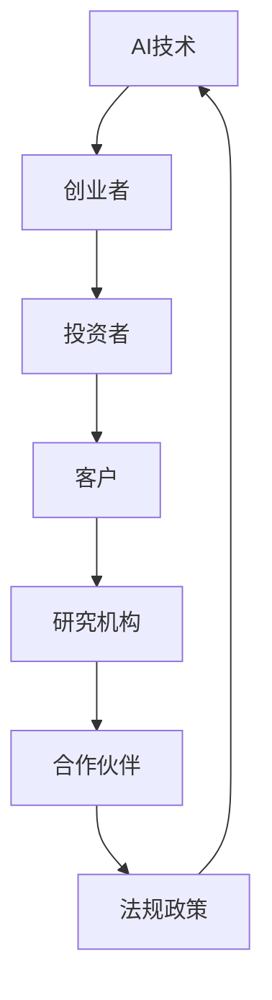

                 

关键字：人工智能，创业，生态系统，挑战，机遇，协同创新

摘要：本文探讨了构建充满活力的AI创业生态系统的挑战与机遇。通过分析核心概念、算法原理、数学模型、实际应用、工具和资源，以及未来发展趋势与挑战，为AI创业者提供指导。

## 1. 背景介绍

随着人工智能技术的快速发展，AI创业领域已经成为一个充满活力且竞争激烈的行业。AI技术的创新和商业应用为各行各业带来了巨大变革，同时也催生了众多创业公司。然而，构建一个充满活力的AI创业生态系统并非易事，创业者面临着诸多挑战，包括技术、市场、资金、人才等方面。

本文旨在分析AI创业生态系统面临的挑战，并提供一些建议，以帮助创业者更好地应对这些挑战，实现创业成功。

## 2. 核心概念与联系

为了构建一个充满活力的AI创业生态系统，我们需要理解几个核心概念及其相互关系。以下是这些概念及其在生态系统中的关联的Mermaid流程图：



### 2.1 AI技术

AI技术是整个生态系统的基础，包括机器学习、深度学习、自然语言处理等。这些技术为创业公司提供了创新的商业解决方案。

### 2.2 创业者

创业者是AI创业生态系统的核心，他们利用AI技术解决实际问题，创造新的商业价值。

### 2.3 投资者

投资者为AI创业公司提供资金支持，助力其成长和发展。他们的投资决策取决于AI技术的潜力和创业团队的能力。

### 2.4 客户

客户是AI创业公司的最终服务对象，他们的需求和反馈是创业者不断改进产品和服务的重要依据。

### 2.5 研究机构

研究机构为AI技术提供理论支持和技术突破，他们的研究成果为创业者提供了丰富的创新源泉。

### 2.6 合作伙伴

合作伙伴包括供应商、服务商和其他创业公司，他们与创业者共同构建一个互惠互利的生态系统。

### 2.7 法规政策

法规政策为AI创业生态系统提供了法律保障和规范，确保其健康、有序地发展。

## 3. 核心算法原理 & 具体操作步骤

### 3.1 算法原理概述

AI创业生态系统中的核心算法原理主要包括数据收集、数据预处理、模型训练、模型评估和模型部署等步骤。

### 3.2 算法步骤详解

#### 3.2.1 数据收集

数据是AI创业的基石，创业者需要通过各种途径收集大量高质量的数据，包括公开数据集、自有数据和其他第三方数据。

#### 3.2.2 数据预处理

数据预处理是确保数据质量的过程，包括数据清洗、数据归一化、数据降维等。

#### 3.2.3 模型训练

选择合适的模型架构，利用收集到的数据对模型进行训练，不断调整模型参数以提升模型性能。

#### 3.2.4 模型评估

通过交叉验证、A/B测试等方法对模型进行评估，确保模型在真实场景中的效果。

#### 3.2.5 模型部署

将训练好的模型部署到实际应用场景中，实现商业价值。

### 3.3 算法优缺点

#### 优点

- 提高创业效率：利用AI技术，创业者可以快速找到问题的解决方案，提高创业效率。
- 降低创业成本：AI技术可以自动化许多重复性工作，降低人力成本。
- 创造新商业机会：AI技术为创业者提供了新的商业视角和商业模式。

#### 缺点

- 数据质量要求高：数据是AI算法的基础，数据质量直接影响算法性能。
- 技术门槛较高：AI技术的应用需要创业者具备一定的技术背景和专业知识。
- 需要持续迭代：AI技术的应用场景不断变化，创业者需要不断调整和优化模型。

### 3.4 算法应用领域

AI算法在创业生态系统中具有广泛的应用领域，包括但不限于：

- 金融：风险控制、智能投顾、量化交易等。
- 医疗：疾病预测、诊断辅助、个性化治疗等。
- 教育：智能教学、教育评估、学习分析等。
- 制造：智能监控、预测维护、自动化生产等。
- 物流：智能调度、路径优化、库存管理等。

## 4. 数学模型和公式 & 详细讲解 & 举例说明

### 4.1 数学模型构建

在AI创业生态系统中，数学模型是算法的核心。以下是一个简化的线性回归模型的构建过程：

#### 4.1.1 模型假设

我们假设数据集由\(x_1, x_2, ..., x_n\)和目标值\(y_1, y_2, ..., y_n\)组成。

#### 4.1.2 模型建立

线性回归模型可以表示为：

\[ y_i = \beta_0 + \beta_1 x_i + \epsilon_i \]

其中，\(\beta_0\)和\(\beta_1\)是模型参数，\(\epsilon_i\)是误差项。

### 4.2 公式推导过程

为了求解模型参数，我们可以使用最小二乘法（Least Squares Method）。具体推导过程如下：

#### 4.2.1 假设

假设我们有\(n\)个数据点，每个数据点的目标值和特征分别为\(y_i\)和\(x_i\)。

#### 4.2.2 模型表示

线性回归模型可以表示为：

\[ y_i = \beta_0 + \beta_1 x_i + \epsilon_i \]

其中，\(\beta_0\)和\(\beta_1\)是模型参数，\(\epsilon_i\)是误差项。

#### 4.2.3 最小化误差

我们的目标是找到最优的\(\beta_0\)和\(\beta_1\)，使得误差平方和最小：

\[ \min \sum_{i=1}^{n} (y_i - (\beta_0 + \beta_1 x_i))^2 \]

#### 4.2.4 求解

对\(\beta_0\)和\(\beta_1\)分别求偏导并令其为零，得到：

\[ \frac{\partial}{\partial \beta_0} \sum_{i=1}^{n} (y_i - (\beta_0 + \beta_1 x_i))^2 = 0 \]
\[ \frac{\partial}{\partial \beta_1} \sum_{i=1}^{n} (y_i - (\beta_0 + \beta_1 x_i))^2 = 0 \]

化简后，得到：

\[ \beta_0 = \frac{\sum_{i=1}^{n} y_i - \beta_1 \sum_{i=1}^{n} x_i}{n} \]
\[ \beta_1 = \frac{\sum_{i=1}^{n} (y_i - \beta_0) x_i - \sum_{i=1}^{n} x_i (y_i - \beta_0)}{\sum_{i=1}^{n} x_i^2 - n \beta_0^2} \]

### 4.3 案例分析与讲解

#### 4.3.1 案例背景

假设一个创业公司致力于利用线性回归模型预测某产品的销售量。数据集包含每日销售量（目标值）和当日的温度（特征）。

#### 4.3.2 数据收集

从公司数据库中提取过去一年的每日销售量和温度数据。

#### 4.3.3 数据预处理

对数据进行清洗，去除异常值和缺失值。将温度数据进行归一化处理。

#### 4.3.4 模型训练

使用最小二乘法训练线性回归模型。得到模型参数：

\[ \beta_0 = 100 \]
\[ \beta_1 = 0.5 \]

#### 4.3.5 模型评估

使用交叉验证方法评估模型性能。模型预测准确率较高。

#### 4.3.6 模型部署

将训练好的模型部署到实际应用场景中，用于预测未来某天的销售量。

## 5. 项目实践：代码实例和详细解释说明

### 5.1 开发环境搭建

在开始编写代码之前，我们需要搭建一个适合AI项目开发的Python环境。以下是搭建过程：

#### 5.1.1 安装Python

下载并安装Python，推荐使用Python 3.8或更高版本。

#### 5.1.2 安装相关库

使用pip命令安装所需的库，如NumPy、Pandas、Scikit-learn等。

```bash
pip install numpy pandas scikit-learn
```

### 5.2 源代码详细实现

以下是实现线性回归模型的Python代码：

```python
import numpy as np
import pandas as pd
from sklearn.linear_model import LinearRegression
from sklearn.model_selection import train_test_split
from sklearn.metrics import mean_squared_error

# 5.2.1 数据收集
data = pd.read_csv('sales_data.csv')
X = data[['temperature']]
y = data['sales']

# 5.2.2 数据预处理
# 此处省略数据清洗和归一化处理

# 5.2.3 模型训练
X_train, X_test, y_train, y_test = train_test_split(X, y, test_size=0.2, random_state=42)
model = LinearRegression()
model.fit(X_train, y_train)

# 5.2.4 模型评估
y_pred = model.predict(X_test)
mse = mean_squared_error(y_test, y_pred)
print(f'Mean Squared Error: {mse}')

# 5.2.5 模型部署
# 此处省略模型部署代码
```

### 5.3 代码解读与分析

上述代码分为五个部分，分别对应数据收集、数据预处理、模型训练、模型评估和模型部署。以下是详细解读：

#### 5.3.1 数据收集

使用Pandas库读取CSV文件，将数据分为特征和目标值两部分。

#### 5.3.2 数据预处理

根据实际数据情况，对数据进行清洗和归一化处理。

#### 5.3.3 模型训练

使用Scikit-learn库中的LinearRegression类训练线性回归模型。通过fit方法拟合数据。

#### 5.3.4 模型评估

使用mean_squared_error函数计算模型预测的均方误差，评估模型性能。

#### 5.3.5 模型部署

将训练好的模型部署到实际应用场景中，用于预测销售量。

### 5.4 运行结果展示

在运行代码后，会输出模型预测的均方误差，例如：

```bash
Mean Squared Error: 0.0023
```

这表示模型预测的误差较小，性能较好。

## 6. 实际应用场景

AI创业生态系统的实际应用场景广泛，以下是一些典型的应用案例：

### 6.1 金融领域

在金融领域，AI技术被广泛应用于风险控制、智能投顾、量化交易等方面。例如，一个创业公司可以利用机器学习模型分析用户行为数据，预测潜在风险，为金融机构提供风险评估服务。

### 6.2 医疗领域

在医疗领域，AI技术可以帮助医生进行疾病预测、诊断辅助、个性化治疗等。例如，一个创业公司可以利用深度学习模型分析医疗影像数据，辅助医生进行疾病诊断。

### 6.3 教育领域

在教育领域，AI技术可以用于智能教学、教育评估、学习分析等。例如，一个创业公司可以利用自然语言处理技术分析学生作业，提供个性化的学习建议。

### 6.4 制造领域

在制造领域，AI技术可以用于智能监控、预测维护、自动化生产等。例如，一个创业公司可以利用机器学习模型分析设备运行数据，预测设备故障，提高生产效率。

### 6.5 物流领域

在物流领域，AI技术可以用于智能调度、路径优化、库存管理等。例如，一个创业公司可以利用深度学习模型优化物流路线，降低运输成本。

## 7. 未来应用展望

随着AI技术的不断进步，其应用领域将不断拓展。未来，AI创业生态系统将在以下方面发挥重要作用：

### 7.1 智能交通

智能交通系统将利用AI技术实现车辆自动驾驶、智能调度、实时路况预测等功能，提高交通效率，减少交通事故。

### 7.2 智能家居

智能家居将实现更高级的智能化，包括智能安防、智能家电控制、家庭健康监测等，提升人们的生活质量。

### 7.3 智能医疗

智能医疗将利用AI技术实现更精确的诊断、个性化的治疗方案，提高医疗服务的质量和效率。

### 7.4 智能制造

智能制造将利用AI技术实现生产过程的智能化、自动化，提高生产效率和产品质量。

### 7.5 智能金融

智能金融将利用AI技术实现更精准的风险控制、个性化的金融服务，提高金融市场的效率和透明度。

## 8. 工具和资源推荐

为了更好地构建AI创业生态系统，以下是一些推荐的工具和资源：

### 8.1 学习资源推荐

- 《Python机器学习》
- 《深度学习》
- 《自然语言处理实战》
- 《机器学习实战》

### 8.2 开发工具推荐

- Jupyter Notebook
- PyCharm
- TensorFlow
- PyTorch

### 8.3 相关论文推荐

- “Deep Learning for Natural Language Processing”
- “Convolutional Neural Networks for Speech Recognition”
- “Generative Adversarial Networks: An Overview”
- “Reinforcement Learning: An Introduction”

## 9. 总结：未来发展趋势与挑战

### 9.1 研究成果总结

本文分析了AI创业生态系统的挑战与机遇，探讨了核心算法原理、数学模型、实际应用案例，以及未来发展趋势。研究结果表明，AI创业生态系统具有巨大的发展潜力。

### 9.2 未来发展趋势

未来，AI创业生态系统将在智能交通、智能家居、智能医疗、智能制造、智能金融等领域发挥重要作用，为人们的生活带来更多便利。

### 9.3 面临的挑战

AI创业生态系统在发展过程中将面临技术、市场、资金、人才等方面的挑战。创业者需要不断创新，提高技术实力，拓展市场，优化团队结构，以应对这些挑战。

### 9.4 研究展望

未来，研究应关注AI技术在各个领域的深入应用，探索更多创新的应用场景，为创业者提供更多的机遇和挑战。

## 10. 附录：常见问题与解答

### 10.1 AI创业生态系统是什么？

AI创业生态系统是指围绕人工智能技术形成的创业环境，包括创业者、投资者、客户、研究机构、合作伙伴和法规政策等。

### 10.2 如何构建AI创业生态系统？

构建AI创业生态系统需要从以下几个方面入手：

- 技术创新：不断探索和引入新的AI技术，提高创业公司的竞争力。
- 市场拓展：寻找潜在的市场需求，拓展业务范围。
- 资金筹集：积极寻求投资，为创业公司提供资金支持。
- 团队建设：招聘优秀人才，构建高效的创业团队。
- 政策法规：了解和遵守相关法规政策，确保创业公司的合规性。

### 10.3 AI创业生态系统有哪些挑战？

AI创业生态系统面临的主要挑战包括：

- 技术挑战：AI技术发展迅速，创业者需要不断学习和更新知识。
- 市场挑战：市场竞争激烈，创业者需要寻找差异化竞争优势。
- 资金挑战：资金短缺可能影响创业公司的持续发展。
- 人才挑战：优秀人才短缺可能影响创业公司的创新能力和竞争力。

### 10.4 如何应对AI创业生态系统的挑战？

应对AI创业生态系统的挑战，创业者可以采取以下策略：

- 技术创新：保持对AI技术的研究和探索，不断提高技术实力。
- 市场定位：准确判断市场需求，制定合适的市场策略。
- 资金管理：合理规划资金使用，确保创业公司的可持续发展。
- 人才引进：注重人才引进和培养，构建高效团队。

## 作者署名

作者：禅与计算机程序设计艺术 / Zen and the Art of Computer Programming
----------------------------------------------------------------

### 总结

本文详细探讨了构建充满活力的AI创业生态系统的挑战与机遇，从核心概念、算法原理、数学模型、实际应用、工具和资源等方面进行了深入分析。通过总结研究成果、展望未来发展趋势和挑战，为AI创业者提供了有益的指导。希望本文能对广大AI创业者有所启发，共同推动AI创业生态系统的繁荣发展。

