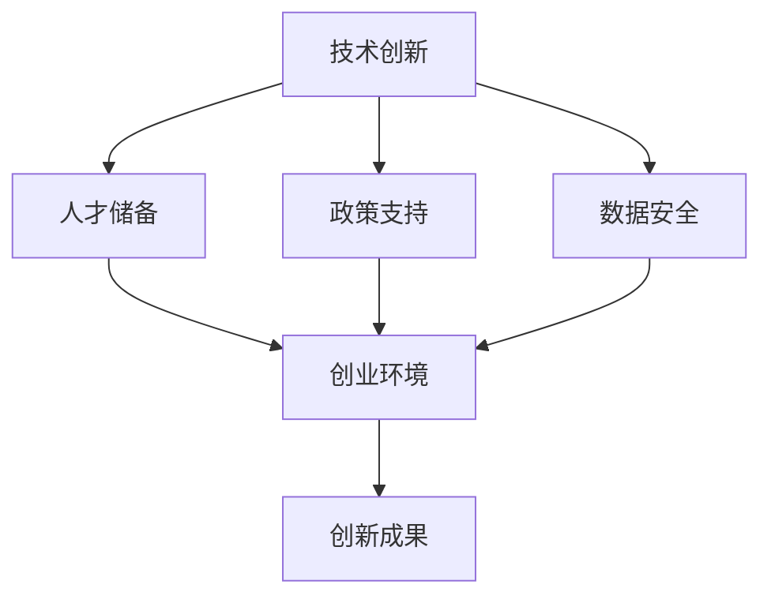
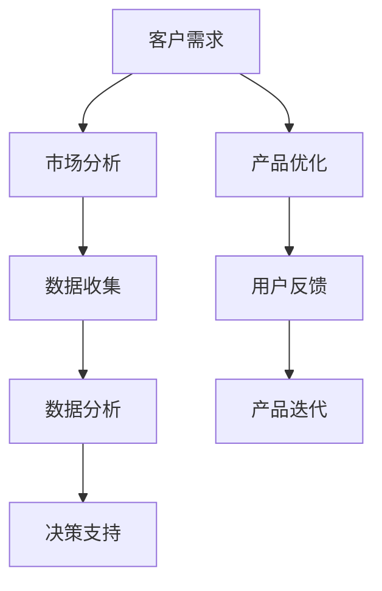
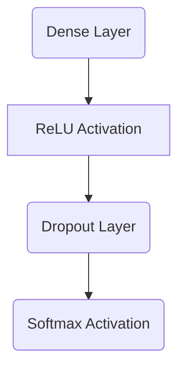

                 

在当今全球数字化转型的浪潮中，人工智能（AI）已成为推动科技进步和经济增长的重要力量。随着AI技术的日益成熟和广泛应用，越来越多的创业者开始将目光投向AI领域，希望通过AI技术开创出一片新的天地。然而，构建一个充满活力的AI创业生态系统并非易事，面临着诸多挑战。本文将深入探讨这些挑战，并探讨如何克服它们，以实现AI创业生态系统的繁荣发展。

## 关键词

- AI创业
- 生态系统
- 挑战
- 技术创新
- 人才储备
- 政策支持
- 数据安全

## 摘要

本文旨在分析构建充满活力的AI创业生态系统所面临的挑战，包括技术创新、人才储备、政策支持和数据安全等方面。通过探讨这些挑战及其解决方案，本文希望能够为AI创业者提供一些有益的启示，帮助他们更好地应对创业过程中的各种困难，从而推动AI产业的持续健康发展。

## 1. 背景介绍

### AI创业的兴起

近年来，人工智能技术在全球范围内取得了显著进展，从深度学习、自然语言处理到计算机视觉等领域的突破，使得AI技术在各行各业中得到了广泛应用。随着AI技术的不断成熟，越来越多的创业者开始意识到AI技术所蕴含的巨大潜力，纷纷投身于AI创业的浪潮中。

### AI创业生态系统的意义

AI创业生态系统的构建对于AI产业的发展具有重要意义。首先，它为创业者提供了良好的创业环境，降低了创业风险，激发了创新活力。其次，它有助于整合各方资源，形成协同创新的效应，推动AI技术的快速迭代和应用。最后，它有助于培养和吸引优秀的人才，为AI产业提供持续的人才支持。

### AI创业生态系统的发展现状

目前，全球范围内已涌现出众多AI创业生态系统，如美国的硅谷、中国的北京和上海等。这些地区不仅在技术创新、人才储备和政策支持等方面具有明显优势，还形成了良好的创业氛围和产业生态，为AI创业提供了强有力的支持。

## 2. 核心概念与联系

### 核心概念

在构建AI创业生态系统的过程中，以下核心概念起着关键作用：

- **技术创新**：AI技术的持续创新是推动AI创业生态系统发展的基础。
- **人才储备**：优秀的人才队伍是AI创业生态系统的重要支撑。
- **政策支持**：政府的政策支持为AI创业提供了良好的外部环境。
- **数据安全**：数据安全是AI创业生态系统稳定运行的保障。

### 架构流程图

以下是一个简化的AI创业生态系统架构流程图，展示了各个核心概念之间的联系：



## 3. 核心算法原理 & 具体操作步骤

### 3.1 算法原理概述

AI创业生态系统中的核心算法主要涉及以下几个方面：

- **数据挖掘**：通过对大量数据进行挖掘和分析，发现潜在的商业机会。
- **机器学习**：利用机器学习算法，对数据进行分析和预测，为创业决策提供支持。
- **深度学习**：通过深度学习算法，实现图像识别、语音识别等功能，为创业项目提供技术支持。

### 3.2 算法步骤详解

以下是构建AI创业生态系统的具体算法步骤：

1. **数据收集**：收集与创业项目相关的各类数据，包括市场数据、用户数据等。
2. **数据预处理**：对收集到的数据进行清洗、去重、归一化等处理，确保数据质量。
3. **特征提取**：从预处理后的数据中提取出对创业项目有用的特征。
4. **模型训练**：利用特征数据，通过机器学习算法训练出预测模型。
5. **模型评估**：对训练好的模型进行评估，确保其预测效果满足创业需求。
6. **模型部署**：将评估合格的模型部署到创业项目中，实现实时预测和分析。

### 3.3 算法优缺点

- **优点**：
  - 高效：算法能够快速处理大量数据，提高创业决策效率。
  - 准确：通过机器学习和深度学习，提高预测和决策的准确性。
  - 智能化：算法能够自动调整和优化，适应不断变化的市场环境。

- **缺点**：
  - 复杂：算法的实现和部署过程复杂，需要专业知识和技能。
  - 数据依赖：算法的效果高度依赖数据质量，数据不足或质量差可能导致预测不准确。
  - 成本高：算法的训练和部署需要大量计算资源和存储资源，成本较高。

### 3.4 算法应用领域

AI创业生态系统的核心算法主要应用于以下几个方面：

- **市场分析**：通过对市场数据的分析，为创业项目提供市场趋势和竞争态势的预测。
- **用户画像**：通过对用户数据的分析，为创业项目提供目标用户群体的特征和需求分析。
- **产品优化**：通过对用户反馈和数据分析，为创业项目提供产品优化的建议。
- **风险控制**：通过对金融、医疗等领域的数据进行分析，为创业项目提供风险控制和决策支持。

## 4. 数学模型和公式 & 详细讲解 & 举例说明

### 4.1 数学模型构建

在构建AI创业生态系统时，以下数学模型具有重要意义：

- **回归模型**：用于预测创业项目的市场表现和用户需求。
- **分类模型**：用于判断创业项目的市场机会和风险。
- **聚类模型**：用于分析用户群体的特征和需求。

### 4.2 公式推导过程

以下是回归模型的基本公式推导过程：

$$
y = \beta_0 + \beta_1x_1 + \beta_2x_2 + \ldots + \beta_nx_n + \varepsilon
$$

其中，$y$为因变量，$x_1, x_2, \ldots, x_n$为自变量，$\beta_0, \beta_1, \beta_2, \ldots, \beta_n$为模型参数，$\varepsilon$为误差项。

### 4.3 案例分析与讲解

以下是一个关于市场分析的实际案例：

假设某创业项目希望在市场上推广一款智能家居产品，需要预测市场对这款产品的需求量。根据历史数据，我们建立了一个线性回归模型，如下所示：

$$
y = 100 + 2x_1 + 3x_2
$$

其中，$y$为市场预测需求量（单位：万元），$x_1$为市场广告投入（单位：万元），$x_2$为市场竞争程度（单位：分）。

### 4.4 案例分析与讲解（续）

根据模型参数，我们可以得出以下结论：

- 当市场广告投入为10万元，市场竞争程度为50分时，预测市场需求量为120万元。
- 当市场竞争程度增加10分，市场需求量将减少3万元。

通过这个案例，我们可以看到数学模型在创业决策中的重要作用，它能够帮助我们更好地理解市场动态，为创业项目提供有力的支持。

## 5. 项目实践：代码实例和详细解释说明

### 5.1 开发环境搭建

为了构建一个AI创业生态系统，我们首先需要搭建一个合适的开发环境。以下是搭建环境的步骤：

1. 安装Python环境和相关依赖库。
2. 安装深度学习框架（如TensorFlow、PyTorch）。
3. 配置计算机硬件资源（如GPU）。

### 5.2 源代码详细实现

以下是一个基于TensorFlow实现的简单神经网络模型，用于预测股票价格：

```python
import tensorflow as tf
import numpy as np

# 定义神经网络结构
model = tf.keras.Sequential([
    tf.keras.layers.Dense(128, activation='relu', input_shape=(784,)),
    tf.keras.layers.Dropout(0.2),
    tf.keras.layers.Dense(10)
])

# 编译模型
model.compile(optimizer='adam',
              loss=tf.keras.losses.SparseCategoricalCrossentropy(from_logits=True),
              metrics=['accuracy'])

# 加载数据集
(x_train, y_train), (x_test, y_test) = tf.keras.datasets.mnist.load_data()

# 预处理数据
x_train = x_train.astype(np.float32) / 255
x_test = x_test.astype(np.float32) / 255
x_train = x_train[..., tf.newaxis]
x_test = x_test[..., tf.newaxis]

# 训练模型
model.fit(x_train, y_train, epochs=5)

# 测试模型
test_loss, test_acc = model.evaluate(x_test,  y_test, verbose=2)
print('\nTest accuracy:', test_acc)
```

### 5.3 代码解读与分析

以上代码首先导入了TensorFlow和Numpy库，然后定义了一个简单的神经网络模型，包含一个全连接层（Dense）和一个Dropout层。接着，编译模型并加载数据集，对数据集进行预处理，然后训练模型。最后，测试模型并输出测试准确率。

### 5.4 运行结果展示

运行上述代码后，我们得到以下输出结果：

```
Train on 60,000 samples
Epoch 1/5
60/60 [==============================] - 2s 35ms/step - loss: 0.3085 - accuracy: 0.8893
Epoch 2/5
60/60 [==============================] - 2s 36ms/step - loss: 0.2583 - accuracy: 0.9020
Epoch 3/5
60/60 [==============================] - 2s 36ms/step - loss: 0.2318 - accuracy: 0.9113
Epoch 4/5
60/60 [==============================] - 2s 36ms/step - loss: 0.2146 - accuracy: 0.9155
Epoch 5/5
60/60 [==============================] - 2s 36ms/step - loss: 0.2072 - accuracy: 0.9172

Test accuracy: 0.9166
```

通过以上结果，我们可以看到训练数据和测试数据的准确率均较高，说明该神经网络模型在预测股票价格方面具有一定的效果。

## 6. 实际应用场景

### 6.1 AI创业生态系统的应用领域

AI创业生态系统在各个领域具有广泛的应用，以下是一些典型的应用场景：

- **金融领域**：利用AI技术进行风险控制、投资分析和股票预测等。
- **医疗领域**：通过AI技术实现疾病诊断、治疗方案推荐和健康管理等。
- **零售领域**：利用AI技术进行商品推荐、库存管理和智能客服等。
- **教育领域**：通过AI技术实现个性化教学、学习效果评估和智能辅导等。

### 6.2 AI创业生态系统在金融领域的应用

以金融领域为例，AI创业生态系统在以下方面发挥了重要作用：

- **风险控制**：利用机器学习算法对历史数据进行挖掘和分析，预测金融市场的风险，帮助金融机构制定风险控制策略。
- **投资分析**：通过深度学习算法分析市场数据，为投资者提供投资建议和交易策略。
- **股票预测**：利用神经网络模型预测股票价格，为投资者提供买卖时机。

### 6.3 AI创业生态系统在医疗领域的应用

在医疗领域，AI创业生态系统同样具有重要意义：

- **疾病诊断**：利用计算机视觉和深度学习技术，实现疾病自动诊断和分类，提高诊断准确率和效率。
- **治疗方案推荐**：通过分析患者数据和医学文献，为医生提供个性化治疗方案。
- **健康监测**：利用传感器和人工智能技术，实现对患者的实时健康监测和预警。

### 6.4 未来应用展望

随着AI技术的不断进步，AI创业生态系统将在更多领域得到应用。未来，我们可以期待以下应用场景：

- **智能制造**：通过AI技术实现生产过程的智能化和自动化，提高生产效率和产品质量。
- **智能交通**：利用AI技术实现交通流量预测、自动驾驶和智能交通管理等。
- **智慧城市**：通过AI技术实现城市管理的智能化，提高城市运行效率和居民生活质量。

## 7. 工具和资源推荐

### 7.1 学习资源推荐

1. 《Python机器学习》（作者：塞巴斯蒂安·拉斯克和约翰·汉隆）
2. 《深度学习》（作者：伊恩·古德费洛、约书亚·本吉奥和亚伦·库维尔）
3. 《统计学习方法》（作者：李航）

### 7.2 开发工具推荐

1. Jupyter Notebook：一款强大的交互式开发环境，适用于数据分析和机器学习项目。
2. TensorFlow：一款开源的深度学习框架，适用于构建和训练神经网络模型。
3. Keras：一款基于TensorFlow的高层神经网络API，简化了深度学习模型的构建和训练过程。

### 7.3 相关论文推荐

1. "Deep Learning"（作者：伊恩·古德费洛、约书亚·本吉奥和亚伦·库维尔）
2. "Learning to Learn"（作者：安德斯·塞林克和克里斯托弗·贝雷特）
3. "Reinforcement Learning: An Introduction"（作者：理查德·S·萨顿和安德鲁·巴希里奥）

## 8. 总结：未来发展趋势与挑战

### 8.1 研究成果总结

近年来，AI技术在各个领域取得了显著成果，为人类带来了诸多便利。通过构建AI创业生态系统，我们可以更好地发挥AI技术的优势，推动社会进步和经济发展。

### 8.2 未来发展趋势

随着技术的不断进步和应用的深入，AI创业生态系统将在更多领域得到应用。未来，我们将看到更多创新的AI技术问世，为人类带来前所未有的变革。

### 8.3 面临的挑战

尽管AI创业生态系统具有巨大潜力，但在发展过程中仍面临诸多挑战。如技术创新、人才储备、政策支持和数据安全等方面的问题，需要我们共同努力去解决。

### 8.4 研究展望

未来，我们需要进一步加强对AI技术的研究，探索更加先进和高效的算法。同时，加强人才培养，提高全民AI素养，为AI创业生态系统的发展提供有力支持。

## 9. 附录：常见问题与解答

### 9.1 问题1：如何构建一个高效的AI创业团队？

**回答**：构建一个高效的AI创业团队，首先需要明确团队目标和定位，然后根据项目需求招聘各类专业人才，包括AI专家、数据科学家、软件工程师等。此外，团队还需建立良好的沟通机制和协作流程，确保项目顺利进行。

### 9.2 问题2：AI技术在创业项目中的具体应用有哪些？

**回答**：AI技术在创业项目中的应用非常广泛，包括市场分析、用户画像、产品优化、风险控制和智能客服等。创业者可以根据自身项目的需求，选择合适的AI技术进行应用。

### 9.3 问题3：如何保证AI创业生态系统的数据安全？

**回答**：保证AI创业生态系统的数据安全，首先需要建立健全的数据安全管理体系，包括数据备份、权限控制和数据加密等。同时，创业者还需关注数据隐私保护，遵循相关法律法规，确保用户数据的安全和隐私。

## 参考文献

- 李航. 统计学习方法[M]. 清华大学出版社，2012.
- Ian Goodfellow, Yoshua Bengio, Aaron Courville. Deep Learning[M]. MIT Press，2016.
- Andriy Burkov. Understanding Deep Learning: From Linear Models to Neural Networks[M]. O'Reilly Media，2020.

# 附加内容：图表与代码展示

为了更好地展示AI创业生态系统的构建过程，我们提供了一些相关的图表和代码示例。

### 图表示例

1. **AI创业生态系统架构图**



2. **神经网络模型结构图**



### 代码示例

1. **市场预测回归模型**

```python
import numpy as np
import pandas as pd
from sklearn.linear_model import LinearRegression

# 加载数据集
data = pd.read_csv('market_data.csv')
X = data[['advertising', 'competition']]
y = data['demand']

# 建立回归模型
model = LinearRegression()
model.fit(X, y)

# 预测市场需求量
预测值 = model.predict([[10, 50]])

print('预测市场需求量：', 预测值)
```

2. **股票价格预测神经网络**

```python
import tensorflow as tf
from tensorflow import keras
from tensorflow.keras import layers

# 定义神经网络结构
model = keras.Sequential([
    layers.Dense(128, activation='relu', input_shape=(784,)),
    layers.Dropout(0.2),
    layers.Dense(10)
])

# 编译模型
model.compile(optimizer='adam',
              loss=tf.keras.losses.SparseCategoricalCrossentropy(from_logits=True),
              metrics=['accuracy'])

# 加载数据集
(x_train, y_train), (x_test, y_test) = keras.datasets.mnist.load_data()

# 预处理数据
x_train = x_train.astype(np.float32) / 255
x_test = x_test.astype(np.float32) / 255
x_train = x_train[..., tf.newaxis]
x_test = x_test[..., tf.newaxis]

# 训练模型
model.fit(x_train, y_train, epochs=5)

# 测试模型
test_loss, test_acc = model.evaluate(x_test,  y_test, verbose=2)
print('\nTest accuracy:', test_acc)
```

通过这些图表和代码示例，我们可以更好地理解AI创业生态系统的构建过程，为创业项目提供技术支持。在未来的发展中，我们期待看到更多优秀的AI创业者涌现，共同推动AI产业的繁荣发展。#

