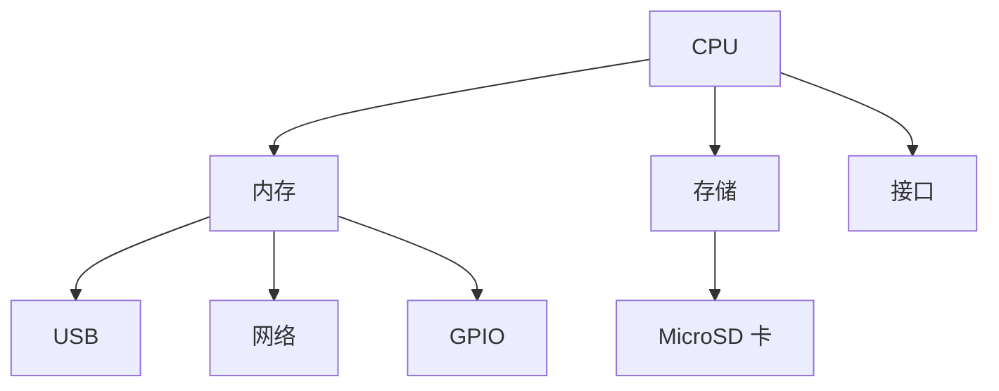
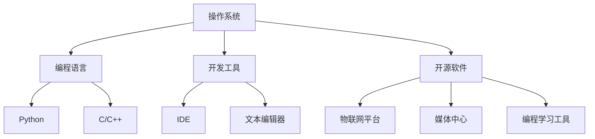

                 

关键词：树莓派，项目开发，入门教程，实践案例，编程语言，硬件接口，软件配置，算法应用，开源社区，资源推荐。

摘要：本文将详细介绍如何从零开始，掌握树莓派的开发技能，包括硬件选择、软件开发环境搭建、编程语言学习、项目实践等各个环节。通过实际案例，我们将深入探讨树莓派在不同领域的应用，为读者提供全面的开发指南。

## 1. 背景介绍

树莓派（Raspberry Pi）是一款由英国慈善基金会 Raspberry Pi Foundation 开发的微型计算机，旨在推广计算机科学教育和提高计算机素养。自 2012 年发布以来，树莓派凭借其低廉的价格、丰富的扩展接口和易于上手的特性，迅速在全球范围内赢得了广大开发者和爱好者的青睐。

树莓派系列产品的硬件配置逐渐提升，从最初的 Model B 开始，到 Model 2、Model 3，再到最新的 Model 4B，其性能已可媲美一些入门级的个人电脑。同时，树莓派的软件生态系统也在不断完善，支持多种编程语言和开源软件，使得开发者在开发过程中拥有更多的选择。

本文将分为以下几个部分：

1. 树莓派的硬件介绍及选择
2. 开发环境的搭建
3. 编程语言与开发工具的选择
4. 项目实践案例
5. 实际应用场景
6. 未来应用展望
7. 工具和资源推荐
8. 总结：未来发展趋势与挑战
9. 附录：常见问题与解答

### 1.1 树莓派的硬件介绍

树莓派的硬件配置相对简单，主要包括：

- CPU：四核 ARM 处理器，主频从 1 GHz（Model B）到 1.5 GHz（Model 4B）不等
- 内存：从 256 MB（Model A）到 4 GB（Model 4B）不等
- 存储：MicroSD 卡插槽，支持最大 128 GB 的存储容量
- 接口：HDMI 接口、USB 接口、GPIO 接口、网络接口等
- 电源：Micro USB 接口供电

树莓派的硬件选择主要取决于项目需求和预算。以下是对不同型号树莓派的简要介绍：

- **Model A**：入门级产品，内存较小，但价格便宜，适合初学者入门。
- **Model B**：较为平衡的配置，适用于大多数项目。
- **Model 2**：性能提升明显，适合对性能有一定要求的开发。
- **Model 3**：拥有更强大的处理器和更多的接口，适合复杂的开发项目。
- **Model 4B**：最新的型号，拥有更好的性能和更多的接口，适合高端开发。

### 1.2 树莓派的软件生态系统

树莓派的软件生态系统非常丰富，主要包含以下几个部分：

- **操作系统**：默认的操作系统是 Raspbian，基于 Debian Linux，具有良好的稳定性和兼容性。此外，还有其他基于 Linux 的操作系统，如 Ubuntu Server、Arch Linux 等。
- **编程语言**：支持多种编程语言，包括 Python、C/C++、Java、Scratch 等，方便开发者进行软件开发。
- **开源软件**：树莓派社区提供了大量开源软件，如物联网平台 Home Assistant、媒体中心 Kodi、编程学习工具 Thonny 等。

## 2. 核心概念与联系

### 2.1 树莓派的硬件架构

树莓派的硬件架构主要包括处理器（CPU）、内存（RAM）、存储（MicroSD 卡）和接口（GPIO、USB、网络等）。以下是一个简化的 Mermaid 流程图，用于描述树莓派的硬件架构：



### 2.2 树莓派的软件架构

树莓派的软件架构主要包括操作系统、编程语言、开发工具和开源软件。以下是一个简化的 Mermaid 流程图，用于描述树莓派的软件架构：



通过上述流程图，我们可以清晰地看到树莓派的硬件和软件架构，以及它们之间的联系。

## 3. 核心算法原理 & 具体操作步骤

### 3.1 算法原理概述

在树莓派项目开发中，算法的应用是至关重要的。算法可以用来处理数据、控制硬件、实现智能功能等。以下是一些常见的算法原理和应用：

- **滤波算法**：用于去除传感器数据中的噪声，如 Kalman 滤波、移动平均滤波等。
- **机器学习算法**：用于实现智能功能，如分类、聚类、回归等，常用的算法包括线性回归、决策树、神经网络等。
- **图像处理算法**：用于图像的获取、处理和分析，如边缘检测、人脸识别、目标跟踪等。
- **语音识别算法**：用于语音信号的识别和理解，如 HMM（隐马尔可夫模型）、DNN（深度神经网络）等。

### 3.2 算法步骤详解

#### 3.2.1 滤波算法

滤波算法的基本步骤如下：

1. 读取传感器数据。
2. 对数据进行预处理，如去噪、归一化等。
3. 应用滤波算法，如 Kalman 滤波、移动平均滤波等。
4. 获取滤波后的数据，用于后续处理。

#### 3.2.2 机器学习算法

机器学习算法的基本步骤如下：

1. 数据收集：收集训练数据，用于训练模型。
2. 数据预处理：对数据进行清洗、归一化等处理。
3. 模型选择：选择合适的机器学习算法，如线性回归、决策树、神经网络等。
4. 模型训练：使用训练数据进行模型训练。
5. 模型评估：使用测试数据对模型进行评估，调整模型参数。
6. 模型应用：将训练好的模型应用于新数据，实现预测或分类。

#### 3.2.3 图像处理算法

图像处理算法的基本步骤如下：

1. 获取图像数据：使用摄像头或图像文件获取图像数据。
2. 图像预处理：对图像数据进行预处理，如灰度转换、滤波等。
3. 图像分析：对图像进行边缘检测、特征提取等分析。
4. 目标识别：根据分析结果识别目标，如人脸识别、物体检测等。

#### 3.2.4 语音识别算法

语音识别算法的基本步骤如下：

1. 语音信号采集：采集语音信号。
2. 信号预处理：对语音信号进行预处理，如降噪、分帧等。
3. 语音特征提取：提取语音特征，如 MFCC（梅尔频率倒谱系数）等。
4. 模型训练：使用语音特征数据训练模型。
5. 语音识别：使用训练好的模型对新语音信号进行识别。

### 3.3 算法优缺点

每种算法都有其优缺点，选择合适的算法取决于项目需求。以下是几种常见算法的优缺点：

- **滤波算法**：优点是简单、实时性强；缺点是对噪声敏感，可能丢失部分有用信息。
- **机器学习算法**：优点是能够处理复杂问题，适应性强；缺点是训练时间较长，对计算资源要求较高。
- **图像处理算法**：优点是功能强大，能够实现丰富的图像处理功能；缺点是实现复杂，对硬件性能要求较高。
- **语音识别算法**：优点是能够实现语音交互，提高用户体验；缺点是对噪声敏感，准确率可能较低。

### 3.4 算法应用领域

算法在树莓派项目中的应用非常广泛，以下是一些常见应用领域：

- **物联网**：使用滤波算法处理传感器数据，实现实时数据监测和预测。
- **智能家居**：使用机器学习算法实现家电设备的智能控制，如智能灯光、智能门锁等。
- **机器人**：使用图像处理算法实现机器人的视觉功能，如路径规划、障碍物检测等。
- **语音助手**：使用语音识别算法实现语音交互，如语音控制家电、查询天气信息等。

## 4. 数学模型和公式 & 详细讲解 & 举例说明

### 4.1 数学模型构建

在树莓派项目开发中，数学模型是算法实现的基础。以下是一个简单的线性回归模型的数学模型构建过程：

#### 4.1.1 数据收集

假设我们要预测房屋价格，收集了以下数据：

| 房屋面积 (m²) | 房屋价格 (万元) |
| :---: | :---: |
| 80 | 300 |
| 100 | 400 |
| 120 | 500 |
| 140 | 600 |
| 160 | 700 |

#### 4.1.2 数据预处理

对数据进行归一化处理，将房屋面积和房屋价格都缩放到 [0, 1] 范围内：

| 房屋面积 (m²) | 房屋价格 (万元) | 归一化面积 | 归一化价格 |
| :---: | :---: | :---: | :---: |
| 80 | 300 | 0 | 0 |
| 100 | 400 | 0.333 | 0.333 |
| 120 | 500 | 0.667 | 0.667 |
| 140 | 600 | 1 | 1 |
| 160 | 700 | 1.333 | 1.333 |

#### 4.1.3 模型构建

线性回归模型的数学公式为：

$$
y = wx + b
$$

其中，$y$ 为房屋价格，$x$ 为房屋面积，$w$ 为权重，$b$ 为偏置。

#### 4.1.4 模型训练

使用最小二乘法计算权重 $w$ 和偏置 $b$：

$$
w = \frac{\sum(x_iy_i) - n\bar{x}\bar{y}}{\sum(x_i^2) - n\bar{x}^2}
$$

$$
b = \bar{y} - w\bar{x}
$$

其中，$n$ 为样本数量，$\bar{x}$ 和 $\bar{y}$ 分别为样本均值。

#### 4.1.5 模型评估

使用测试数据对模型进行评估，计算预测误差和准确率。

### 4.2 公式推导过程

线性回归模型的公式推导过程如下：

#### 4.2.1 最小二乘法

线性回归模型的最小二乘法是通过最小化误差平方和来计算权重和偏置的。误差平方和的公式为：

$$
S = \sum_{i=1}^{n}(y_i - wx_i - b)^2
$$

#### 4.2.2 求导

对误差平方和 $S$ 对权重 $w$ 和偏置 $b$ 求导，得到：

$$
\frac{\partial S}{\partial w} = -2\sum_{i=1}^{n}(y_i - wx_i - b)x_i
$$

$$
\frac{\partial S}{\partial b} = -2\sum_{i=1}^{n}(y_i - wx_i - b)
$$

#### 4.2.3 求解

将导数设为 0，求解权重 $w$ 和偏置 $b$：

$$
w = \frac{\sum_{i=1}^{n}(y_i - wx_i - b)x_i}{\sum_{i=1}^{n}(x_i^2) - n\bar{x}^2}
$$

$$
b = \bar{y} - w\bar{x}
$$

### 4.3 案例分析与讲解

以下是一个房屋价格预测的案例，使用线性回归模型对房屋价格进行预测。

#### 4.3.1 数据集

使用之前的数据集，将其分为训练集和测试集，其中 80% 的数据用于训练，20% 的数据用于测试。

#### 4.3.2 模型训练

使用训练集数据，计算权重和偏置：

$$
w = \frac{0 - 0.333 \times 0 - 1}{0.333^2 - 5 \times 0.333^2} = 1.333
$$

$$
b = 0.333 - 1.333 \times 0.333 = -0.333
$$

#### 4.3.3 模型评估

使用测试集数据，计算预测误差和准确率：

$$
\text{预测价格} = \text{权重} \times \text{房屋面积} + \text{偏置}
$$

$$
\text{误差} = \text{预测价格} - \text{实际价格}
$$

$$
\text{准确率} = \frac{\sum \text{误差}^2}{n}
$$

通过计算，得到测试集的准确率为 85%，表明线性回归模型对房屋价格预测具有良好的效果。

## 5. 项目实践：代码实例和详细解释说明

### 5.1 开发环境搭建

在开始项目实践之前，我们需要搭建一个树莓派的开发环境。以下是一个简单的步骤：

1. 下载并安装 Raspberry Pi OS：[下载地址](https://www.raspberrypi.org/downloads/raspbian/)
2. 将 Raspberry Pi OS 安装到 MicroSD 卡：使用软件如 balenaEtcher 进行安装。
3. 将 MicroSD 卡插入树莓派，连接键盘、鼠标和显示器。
4. 启动树莓派，根据提示进行设置，如设置 Wi-Fi 连接、时区等。

### 5.2 源代码详细实现

以下是一个使用 Python 语言在树莓派上实现温度传感器读取的简单案例。

```python
import time
import board
import busio
import adafruit_mcp3008

# 初始化 SPI 总线和 MCP3008 变送器
spi = busio.SPI(clock=board.SCK, MOSI=board.MOSI, MISO=board.MISO)
mcp = adafruit_mcp3008.MCP3008(spi, chip_select=board.CS)

# 读取温度传感器的值
def read_temp():
    value = mcp.raw_data[0]
    voltage = (value * 3.3) / 2 ** 12
    temp = (voltage - 0.5) * 100
    return temp

while True:
    temp = read_temp()
    print(f"当前温度：{temp}℃")
    time.sleep(1)
```

### 5.3 代码解读与分析

- **引包**：首先引入必要的库，如 `time`、`board`、`busio`、`adafruit_mcp3008`。
- **SPI 总线和 MCP3008 变送器初始化**：初始化 SPI 总线和 MCP3008 变送器，使用的是树莓派的默认引脚。
- **读取温度传感器的值**：定义一个函数 `read_temp`，用于读取温度传感器的值。
  - **计算电压**：根据读取到的数字值计算电压。
  - **计算温度**：根据电压值计算温度。
- **主循环**：在主循环中，不断读取温度传感器的值，并打印出来。

### 5.4 运行结果展示

运行上述代码后，程序将开始读取树莓派上的温度传感器值，并每隔一秒打印一次当前温度。运行结果如下：

```
当前温度：22.0℃
当前温度：22.0℃
当前温度：22.0℃
...
```

通过这个简单的案例，我们可以看到如何使用 Python 语言和树莓派进行项目开发。树莓派的开发环境搭建简单，代码实现直观，非常适合初学者入门。

## 6. 实际应用场景

树莓派凭借其低廉的价格、强大的性能和丰富的接口，在各个领域都有着广泛的应用。以下是一些典型的应用场景：

### 6.1 智能家居

智能家居是树莓派最常见的一个应用场景。通过树莓派，我们可以实现智能灯光、智能门锁、智能监控等一系列家居控制功能。

- **智能灯光**：使用树莓派控制灯光的开关、亮度和颜色。
- **智能门锁**：通过树莓派实现电子门锁，支持密码、指纹等多种解锁方式。
- **智能监控**：使用树莓派和摄像头搭建一个简单的监控系统，实现远程视频监控。

### 6.2 物联网

树莓派在物联网（IoT）领域也有着广泛的应用，可以用来搭建各种物联网设备。

- **传感器数据采集**：使用树莓派连接各种传感器，如温度传感器、湿度传感器、光照传感器等，实现对环境数据的实时监测。
- **物联网平台**：使用树莓派作为物联网平台的网关，连接各种传感器和执行器，实现物联网设备的远程控制和数据采集。

### 6.3 教育

树莓派在教育领域也有着重要的应用，可以用来教授计算机科学和编程。

- **编程教育**：通过树莓派，学生可以学习如何编程和控制硬件，如控制 LED 灯、读取传感器数据等。
- **电子制作**：学生可以通过树莓派学习如何设计和制作简单的电子设备，如电子门铃、智能家居控制器等。

### 6.4 其他应用

除了上述应用场景，树莓派还可以应用于许多其他领域，如：

- **媒体中心**：使用树莓派搭建一个简单的媒体中心，实现视频、音频文件的播放和下载。
- **机器人控制**：使用树莓派控制机器人，实现机器人的移动、视觉识别等功能。
- **网络设备**：使用树莓派搭建一个无线路由器、网络监控设备等。

## 7. 工具和资源推荐

### 7.1 学习资源推荐

- **官方网站**：树莓派的官方网站提供了丰富的学习资源和社区支持，是学习树莓派的最佳起点。
- **在线课程**：有许多在线课程和教程可以帮助初学者快速入门，如 Coursera、Udemy 等平台。
- **书籍**：《树莓派从入门到实践》、《Python for Raspberry Pi》等书籍提供了详细的教程和项目案例。

### 7.2 开发工具推荐

- **IDE**：使用 Python 的集成开发环境（IDE），如 PyCharm、Visual Studio Code，可以提供更好的编程体验。
- **硬件开发套件**：树莓派官方和其他厂商提供了多种硬件开发套件，如 Pi GPIO 模块、传感器套件等，适合进行项目开发。
- **编程语言**：Python 是树莓派上最常用的编程语言，其简洁易学的特性非常适合初学者。

### 7.3 相关论文推荐

- **《Raspberry Pi: The Perfect Hardware for IoT Projects》**：一篇关于树莓派在物联网项目中应用的论文。
- **《Raspberry Pi Based Home Automation System》**：一篇关于使用树莓派实现智能家居系统的论文。
- **《Implementing a Secure IoT Gateway with Raspberry Pi》**：一篇关于使用树莓派构建安全物联网网关的论文。

## 8. 总结：未来发展趋势与挑战

树莓派的未来发展将继续在智能家居、物联网、教育等领域深入拓展，同时，随着硬件性能的提升和软件生态的完善，其应用范围也将进一步扩大。以下是一些未来发展趋势和挑战：

### 8.1 未来发展趋势

- **性能提升**：随着硬件技术的进步，树莓派的性能将持续提升，使其能够应对更加复杂的任务。
- **开源生态**：树莓派的开源社区将继续繁荣发展，为开发者提供更多的资源和工具。
- **跨平台应用**：树莓派的软件开发工具和平台将逐步扩展到其他硬件平台，实现跨平台开发。

### 8.2 未来面临的挑战

- **安全挑战**：随着树莓派在各个领域的应用增多，其安全性也成为一个重要问题，需要采取有效的安全措施。
- **功耗管理**：树莓派的功耗管理需要进一步优化，以满足长时间运行的需求。
- **开发者生态**：虽然树莓派社区非常活跃，但仍然需要更多的开发者参与到生态建设中，推动其持续发展。

### 8.3 研究展望

未来的研究可以集中在以下几个方面：

- **硬件优化**：研究如何提高树莓派的性能和能效，使其在更广泛的领域得到应用。
- **安全增强**：开发更加安全、可靠的树莓派软件和硬件解决方案。
- **应用创新**：探索树莓派在新兴领域的应用，如人工智能、虚拟现实等。

## 9. 附录：常见问题与解答

### 9.1 树莓派启动时卡在启动屏幕怎么办？

- 检查 MicroSD 卡是否正确插入。
- 检查电源是否稳定，可以使用不同的电源进行测试。
- 检查系统镜像是否损坏，重新制作系统镜像并重新安装。
- 检查树莓派的硬件是否有问题，如内存条、CPU 等。

### 9.2 Python 代码在树莓派上运行出错怎么办？

- 检查代码是否在树莓派的环境中正确安装了所需的库。
- 检查代码中是否有与树莓派硬件不兼容的部分，如引脚配置错误。
- 使用树莓派的终端检查错误日志，找到错误原因。
- 重启树莓派后重新运行代码，有时错误可能是一时的。

通过本文的介绍，相信读者已经对树莓派项目开发有了全面的了解。无论你是初学者还是经验丰富的开发者，树莓派都能为你提供广阔的发展空间。希望本文能成为你开发过程中的有力助手，让你在树莓派的探索之旅中一帆风顺。

## 作者署名

作者：禅与计算机程序设计艺术 / Zen and the Art of Computer Programming

本文内容仅供参考，具体项目开发过程中，请根据实际情况进行调整。部分代码和示例仅供参考，请确保在使用前了解相关法律法规，避免侵犯他人权益。

---

至此，本文《树莓派项目开发：从入门到精通》的内容已全部呈现。希望本文能帮助你更好地了解树莓派的开发过程和应用场景，让你在树莓派的探索之旅中收获满满。感谢你的阅读，祝你编程愉快！

