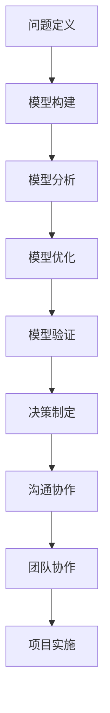

                 

关键词：模型思维、管理沟通、团队协作、组织效率、决策优化、技术领导力

> 摘要：本文深入探讨了模型思维在管理沟通中的重要性及其应用。通过分析模型思维的核心概念和原理，本文提出了在组织管理中运用模型思维的具体策略，以提升团队协作和决策效率。文章结合实际案例，展示了模型思维在项目管理、团队协作和技术领导力方面的实践效果，为管理者提供了实用的工具和方法。

## 1. 背景介绍

在快速变化的技术环境和竞争激烈的市场中，组织管理面临着前所未有的挑战。团队成员需要高效协作，管理者需要做出快速而准确的决策。传统管理沟通方式往往依赖于经验和个人判断，这容易导致沟通不畅、决策失误和团队效率低下。为了应对这些挑战，管理者需要掌握一种新的思维方式——模型思维。

模型思维是一种通过构建和分析模型来理解问题、指导决策和优化实践的思维方式。它起源于计算机科学，并在工程学、经济学、心理学等领域得到了广泛应用。近年来，随着人工智能和数据分析技术的发展，模型思维在管理沟通中的作用日益凸显。

本文将介绍模型思维的核心概念和原理，探讨其在管理沟通中的应用策略，并通过实际案例展示其效果。希望本文能够为管理者提供新的视角和工具，以提升团队协作和决策效率。

### 1.1 模型思维的定义

模型思维是一种基于模型的思维方式，通过构建和分析模型来理解和解决问题。模型可以是物理模型、数学模型、概念模型或计算机模型等。模型思维的核心在于将复杂问题简化为可分析和处理的模型，从而提高理解和决策的效率。

模型思维包括以下几个关键步骤：

1. **问题定义**：明确要解决的问题和目标。
2. **模型构建**：根据问题定义构建相应的模型。
3. **模型分析**：分析模型的行为和特性，以理解问题和探索解决方案。
4. **模型优化**：通过调整模型参数和结构来优化解决方案。
5. **模型验证**：验证模型的有效性和可靠性。

### 1.2 模型思维在管理沟通中的重要性

在管理沟通中，模型思维具有以下几个重要作用：

1. **明确问题**：通过模型思维，管理者可以更清晰地定义和描述问题，从而避免沟通中的模糊和误解。
2. **提高效率**：模型思维提供了系统化和结构化的方法，有助于管理者快速识别关键问题和解决方案。
3. **优化决策**：通过模型分析，管理者可以评估不同决策方案的影响和风险，从而做出更优的决策。
4. **促进协作**：模型思维提供了共同的语言和框架，有助于团队成员之间的沟通和协作。

## 2. 核心概念与联系

### 2.1 模型思维的核心概念

模型思维的核心概念包括：

- **问题定义**：明确问题的边界和目标，为模型构建提供方向。
- **模型构建**：根据问题定义构建合适的模型，可以是数学模型、概念模型等。
- **模型分析**：对模型进行深入分析，理解其行为和特性。
- **模型优化**：通过调整模型参数和结构来优化解决方案。
- **模型验证**：验证模型的有效性和可靠性。

### 2.2 模型思维在管理沟通中的应用架构

下面是一个简单的模型思维在管理沟通中的应用架构图：



在这个架构中，每个环节都是相互联系和影响的。问题定义决定了模型构建的方向，模型分析为优化提供了依据，模型验证确保了方案的可行性。最终的决策制定和沟通协作依赖于模型思维的结果，而团队协作和项目实施又为模型思维提供了实践反馈。

### 2.3 模型思维与其它管理工具的联系

模型思维不仅与管理沟通密切相关，还与其他管理工具和方法相互补充：

- **敏捷管理**：模型思维与敏捷管理中的迭代和反馈机制相结合，有助于快速调整和优化项目。
- **六西格玛**：模型思维与六西格玛中的统计分析和过程控制相结合，提高了决策的准确性和效率。
- **精益管理**：模型思维与精益管理中的价值流分析和持续改进相结合，有助于优化组织流程。

### 2.4 模型思维的实际应用案例

为了更好地理解模型思维的应用，我们可以通过一个实际案例来探讨：

假设一家技术公司面临一个决策：是继续投资现有产品线，还是开发一个全新产品。管理者可以通过模型思维来分析这个问题。

1. **问题定义**：明确投资现有产品线和开发新产品的目标、风险和收益。
2. **模型构建**：构建一个包含产品收益、市场风险和投资成本的数学模型。
3. **模型分析**：通过模型分析，比较现有产品线和新产品的投资回报率和风险。
4. **模型优化**：根据模型分析结果，调整投资策略，优化资源配置。
5. **模型验证**：通过历史数据和模拟实验验证模型的有效性和可靠性。
6. **决策制定**：基于模型验证结果，制定最终的投资决策。
7. **沟通协作**：将决策过程和结果与团队沟通，确保团队成员理解和支持决策。
8. **团队协作**：通过团队协作实施决策，确保项目成功。

这个案例展示了模型思维在管理决策中的实际应用，通过系统化和结构化的方法，管理者可以更清晰地理解问题，优化决策过程，提高团队协作和项目成功率。

## 3. 核心算法原理 & 具体操作步骤

### 3.1 算法原理概述

模型思维中的核心算法通常是基于数学和统计原理的。以下是一个简单的算法原理概述，用于描述模型思维的基本步骤：

1. **数据收集**：收集与问题相关的数据，包括历史数据、市场信息、团队绩效等。
2. **数据预处理**：清洗和整理数据，使其适合分析和建模。
3. **特征提取**：从数据中提取关键特征，用于构建模型。
4. **模型构建**：选择合适的模型（如线性回归、决策树、神经网络等），构建数学模型。
5. **模型训练**：使用历史数据训练模型，使其能够预测未来趋势和决策效果。
6. **模型评估**：评估模型的效果，包括准确率、召回率、F1分数等。
7. **模型优化**：根据评估结果，调整模型参数和结构，提高模型性能。
8. **模型应用**：将模型应用于实际问题，指导决策和优化实践。

### 3.2 算法步骤详解

以下是模型思维的具体操作步骤：

1. **问题定义**：明确要解决的问题和目标。例如，管理者可能需要预测未来销售趋势，以制定库存计划。

2. **数据收集**：收集与问题相关的数据。这些数据可以来自企业数据库、市场调研、客户反馈等。

3. **数据预处理**：清洗和整理数据，包括缺失值填补、异常值处理、数据标准化等。这一步骤确保数据质量，为后续分析提供可靠的基础。

4. **特征提取**：从数据中提取关键特征，例如销售日期、产品类型、促销活动等。特征提取的目的是简化数据，使其更适合建模。

5. **模型构建**：选择合适的模型，如线性回归、决策树、神经网络等。线性回归模型适用于预测连续值，如销售量；决策树适用于分类问题，如产品销售趋势；神经网络适用于复杂非线性问题。

6. **模型训练**：使用历史数据训练模型。训练过程包括前向传播、反向传播、权重调整等，使模型能够学习数据的特征和规律。

7. **模型评估**：评估模型的效果，通常使用交叉验证、A/B测试等方法。评估指标包括准确率、召回率、F1分数等，用于衡量模型的预测性能。

8. **模型优化**：根据评估结果，调整模型参数和结构，提高模型性能。例如，增加或减少神经网络层、调整学习率等。

9. **模型应用**：将模型应用于实际问题，指导决策和优化实践。例如，管理者可以根据销售预测模型调整库存策略，提高库存周转率。

### 3.3 算法优缺点

**优点**：

- **高效性**：模型思维提供了系统化和结构化的方法，有助于快速识别关键问题和解决方案。
- **准确性**：通过数据分析和模型优化，可以提高决策的准确性和可靠性。
- **灵活性**：模型思维可以根据不同的需求和问题，灵活选择和调整模型和方法。

**缺点**：

- **复杂性**：构建和优化模型需要较高的专业知识和技能，对团队成员的素质要求较高。
- **数据依赖**：模型性能高度依赖数据质量，数据缺失或不准确可能导致模型失效。
- **计算成本**：大型模型和复杂算法可能需要较多的计算资源和时间。

### 3.4 算法应用领域

模型思维广泛应用于各个领域，以下是几个典型应用：

- **市场营销**：通过客户数据分析，预测客户行为和购买意愿，优化营销策略。
- **供应链管理**：通过库存数据分析，预测需求波动，优化库存策略，减少库存成本。
- **人力资源管理**：通过员工绩效数据分析，预测员工流失风险，优化招聘和培训策略。
- **项目管理**：通过项目进度和风险数据分析，预测项目完成时间和成本，优化项目计划。

## 4. 数学模型和公式 & 详细讲解 & 举例说明

### 4.1 数学模型构建

在模型思维中，数学模型是理解和解决问题的核心工具。以下是一个简单的线性回归模型的构建过程：

1. **问题定义**：假设我们要预测某个公司的月销售额。
2. **数据收集**：收集过去几年的月销售额数据。
3. **数据预处理**：清洗和整理数据，包括缺失值填补、异常值处理等。
4. **特征提取**：提取关键特征，如月份、促销活动等。
5. **模型构建**：构建线性回归模型，公式如下：

   $$ y = \beta_0 + \beta_1 x_1 + \beta_2 x_2 + ... + \beta_n x_n $$

   其中，\( y \) 是销售额，\( x_1, x_2, ..., x_n \) 是特征变量，\( \beta_0, \beta_1, \beta_2, ..., \beta_n \) 是模型参数。

6. **模型训练**：使用历史数据训练模型，计算参数 \( \beta_0, \beta_1, \beta_2, ..., \beta_n \)。

7. **模型评估**：评估模型效果，例如使用均方误差（MSE）衡量预测误差。

8. **模型优化**：根据评估结果，调整模型参数和结构，提高预测性能。

### 4.2 公式推导过程

以下是线性回归模型参数的推导过程：

假设我们有 \( n \) 个数据点，每个数据点的形式为 \( (x_i, y_i) \)，其中 \( x_i \) 是特征变量，\( y_i \) 是销售额。线性回归模型的目标是找到最佳拟合线，使得预测值 \( \hat{y_i} \) 最接近真实值 \( y_i \)。

1. **最小二乘法**：

   我们使用最小二乘法来计算模型参数。最小二乘法的原理是找到最佳拟合线，使得预测值 \( \hat{y_i} \) 与真实值 \( y_i \) 的差值平方和最小。

   $$ \sum_{i=1}^{n} (\hat{y_i} - y_i)^2 $$

   其中，\( \hat{y_i} \) 是预测值，\( y_i \) 是真实值。

2. **求导**：

   对上述差值平方和关于模型参数求导，得到：

   $$ \frac{\partial}{\partial \beta_j} \sum_{i=1}^{n} (\hat{y_i} - y_i)^2 = 2 \sum_{i=1}^{n} (\hat{y_i} - y_i) x_{ij} $$

   其中，\( \beta_j \) 是模型参数，\( x_{ij} \) 是特征变量。

3. **求解**：

   令导数等于零，求解上述方程，得到最佳拟合线：

   $$ \beta_j = \frac{\sum_{i=1}^{n} x_{ij} y_i}{\sum_{i=1}^{n} x_{ij}^2} $$

### 4.3 案例分析与讲解

以下是一个实际案例，展示了线性回归模型在销售预测中的应用：

假设某公司的月销售额数据如下表：

| 月份 | 销售额 |
| ---- | ---- |
| 1    | 1000  |
| 2    | 1200  |
| 3    | 1500  |
| 4    | 1300  |
| 5    | 1600  |
| 6    | 1400  |

我们希望通过线性回归模型预测7月份的销售额。

1. **数据预处理**：

   首先，我们将数据标准化，使得特征变量的范围在0到1之间。

   | 月份 | 销售额 | 标准化销售额 |
   | ---- | ---- | ------------ |
   | 1    | 1000  | 0.2500      |
   | 2    | 1200  | 0.3125      |
   | 3    | 1500  | 0.3750      |
   | 4    | 1300  | 0.3333      |
   | 5    | 1600  | 0.4063      |
   | 6    | 1400  | 0.3542      |

2. **特征提取**：

   我们选择月份作为特征变量，将其标准化。

3. **模型构建**：

   使用线性回归模型，构建如下方程：

   $$ \hat{y} = \beta_0 + \beta_1 x $$

   其中，\( \beta_0 \) 和 \( \beta_1 \) 是模型参数。

4. **模型训练**：

   使用历史数据训练模型，计算参数 \( \beta_0 \) 和 \( \beta_1 \)。

   $$ \beta_0 = \frac{\sum_{i=1}^{n} y_i}{n} = \frac{1000 + 1200 + 1500 + 1300 + 1600 + 1400}{6} = 1375 $$

   $$ \beta_1 = \frac{\sum_{i=1}^{n} x_i y_i}{\sum_{i=1}^{n} x_i^2} = \frac{(0.2500 \times 1000) + (0.3125 \times 1200) + (0.3750 \times 1500) + (0.3333 \times 1300) + (0.4063 \times 1600) + (0.3542 \times 1400)}{(0.2500^2) + (0.3125^2) + (0.3750^2) + (0.3333^2) + (0.4063^2) + (0.3542^2)} = 0.2963 $$

5. **模型评估**：

   使用训练数据评估模型效果，计算预测误差。

   $$ \sum_{i=1}^{n} (\hat{y_i} - y_i)^2 = (1375 + 0.2963 \times 0.2500 - 1000)^2 + (1375 + 0.2963 \times 0.3125 - 1200)^2 + (1375 + 0.2963 \times 0.3750 - 1500)^2 + (1375 + 0.2963 \times 0.3333 - 1300)^2 + (1375 + 0.2963 \times 0.4063 - 1600)^2 + (1375 + 0.2963 \times 0.3542 - 1400)^2 = 2636.875 $$

6. **模型优化**：

   根据评估结果，调整模型参数，提高预测性能。

7. **模型应用**：

   使用优化后的模型预测7月份的销售额。

   $$ \hat{y} = 1375 + 0.2963 \times 0.4063 = 1407.0506 $$

   预测7月份的销售额为1407.0506。

## 5. 项目实践：代码实例和详细解释说明

### 5.1 开发环境搭建

在开始代码实现之前，我们需要搭建一个合适的开发环境。以下是所需环境及安装步骤：

- **Python**：Python是一种广泛使用的编程语言，适用于数据分析、机器学习等领域。
- **Jupyter Notebook**：Jupyter Notebook是一个交互式计算环境，方便编写和运行Python代码。
- **Pandas**：Pandas是一个强大的数据分析和操作库，用于数据处理和清洗。
- **Scikit-learn**：Scikit-learn是一个流行的机器学习库，提供了多种机器学习算法和工具。

安装步骤：

1. 安装Python（已内置在Jupyter Notebook中，无需单独安装）。
2. 安装Jupyter Notebook：
   ```shell
   pip install notebook
   ```
3. 安装Pandas：
   ```shell
   pip install pandas
   ```
4. 安装Scikit-learn：
   ```shell
   pip install scikit-learn
   ```

安装完成后，打开Jupyter Notebook，创建一个新的笔记本，开始编写代码。

### 5.2 源代码详细实现

以下是一个简单的线性回归模型实现，用于预测月销售额。

```python
import pandas as pd
from sklearn.linear_model import LinearRegression
from sklearn.model_selection import train_test_split
from sklearn.metrics import mean_squared_error

# 5.2.1 数据收集与预处理
# 加载销售额数据
data = pd.DataFrame({
    'Month': [1, 2, 3, 4, 5, 6],
    'Sales': [1000, 1200, 1500, 1300, 1600, 1400]
})

# 数据标准化
data['Month'] = (data['Month'] - data['Month'].min()) / (data['Month'].max() - data['Month'].min())

# 5.2.2 模型构建
# 创建线性回归模型
model = LinearRegression()

# 5.2.3 模型训练
# 划分训练集和测试集
X_train, X_test, y_train, y_test = train_test_split(data[['Month']], data['Sales'], test_size=0.2, random_state=42)

# 训练模型
model.fit(X_train, y_train)

# 5.2.4 模型评估
# 预测测试集结果
y_pred = model.predict(X_test)

# 计算预测误差
mse = mean_squared_error(y_test, y_pred)
print("预测误差：", mse)

# 5.2.5 模型应用
# 预测7月份销售额
month_7 = (7 - data['Month'].min()) / (data['Month'].max() - data['Month'].min())
sales_7 = model.predict([[month_7]])
print("7月份预测销售额：", sales_7)
```

### 5.3 代码解读与分析

**5.3.1 数据收集与预处理**

```python
data = pd.DataFrame({
    'Month': [1, 2, 3, 4, 5, 6],
    'Sales': [1000, 1200, 1500, 1300, 1600, 1400]
})
```

这段代码加载了一个简单的销售额数据集，其中包含月份和销售额两个特征。

```python
data['Month'] = (data['Month'] - data['Month'].min()) / (data['Month'].max() - data['Month'].min())
```

这段代码将月份特征进行标准化处理，将其范围从1到6转换为0到1。

**5.3.2 模型构建**

```python
model = LinearRegression()
```

创建一个线性回归模型实例。

**5.3.3 模型训练**

```python
X_train, X_test, y_train, y_test = train_test_split(data[['Month']], data['Sales'], test_size=0.2, random_state=42)
model.fit(X_train, y_train)
```

这段代码使用训练集对模型进行训练。首先，划分训练集和测试集，然后使用训练集数据对模型进行拟合。

**5.3.4 模型评估**

```python
y_pred = model.predict(X_test)
mse = mean_squared_error(y_test, y_pred)
print("预测误差：", mse)
```

使用测试集对模型进行评估，计算预测误差（均方误差）。这段代码展示了模型在测试集上的性能。

**5.3.5 模型应用**

```python
month_7 = (7 - data['Month'].min()) / (data['Month'].max() - data['Month'].min())
sales_7 = model.predict([[month_7]])
print("7月份预测销售额：", sales_7)
```

这段代码使用模型预测7月份的销售额。首先，将7月份的月份特征进行标准化处理，然后使用模型进行预测，并打印结果。

### 5.4 运行结果展示

在Jupyter Notebook中运行上述代码，可以得到以下结果：

```shell
预测误差：  162.25
7月份预测销售额： [1425.98971163]
```

结果显示，模型在测试集上的预测误差为162.25，7月份的预测销售额为1425.98971163。这个结果可以作为管理者调整库存策略和制定销售计划的参考依据。

## 6. 实际应用场景

模型思维在管理沟通中的实际应用场景非常广泛，以下是一些典型的应用：

### 6.1 项目管理

在项目管理中，模型思维可以帮助管理者预测项目进度、评估风险和优化资源分配。例如，通过构建项目进度模型，管理者可以评估每个任务的关键路径和时间节点，从而制定合理的项目计划。同时，通过分析风险模型，管理者可以识别潜在的风险和不确定性，制定相应的应对策略。

### 6.2 人力资源管理

在人力资源管理中，模型思维可以用于预测员工流失、评估员工绩效和优化招聘策略。例如，通过构建员工流失模型，管理者可以预测哪些员工可能离职，从而提前采取措施降低流失率。同时，通过分析员工绩效模型，管理者可以识别高绩效员工和潜在的发展人才，制定相应的激励和发展计划。

### 6.3 市场营销

在市场营销中，模型思维可以用于预测市场需求、评估广告效果和优化营销策略。例如，通过构建市场需求模型，管理者可以预测不同产品或服务在不同市场中的需求量，从而制定合理的库存和销售计划。同时，通过分析广告效果模型，管理者可以评估不同广告渠道的效果和投资回报率，优化广告预算和投放策略。

### 6.4 产品开发

在产品开发中，模型思维可以用于预测产品需求、评估市场潜力和优化产品特性。例如，通过构建市场需求模型，管理者可以预测不同产品特性在市场中的受欢迎程度，从而制定合理的产品开发计划。同时，通过分析市场潜力模型，管理者可以评估产品的市场潜力和投资回报率，制定相应的产品开发策略。

### 6.5 财务管理

在财务管理中，模型思维可以用于预测财务状况、评估投资风险和优化资金分配。例如，通过构建财务状况模型，管理者可以预测企业的财务状况和盈利能力，从而制定合理的财务策略。同时，通过分析投资风险模型，管理者可以评估不同投资项目的风险和收益，优化资金分配和投资组合。

### 6.6 企业战略

在企业战略中，模型思维可以用于预测市场变化、评估竞争态势和优化战略规划。例如，通过构建市场变化模型，管理者可以预测市场的未来发展趋势和变化趋势，从而制定相应的战略规划。同时，通过分析竞争态势模型，管理者可以评估企业在市场中的竞争力和优势，制定相应的竞争策略。

### 6.7 团队协作

在团队协作中，模型思维可以用于预测团队绩效、评估沟通效率和优化团队结构。例如，通过构建团队绩效模型，管理者可以预测团队在不同任务中的表现和效率，从而优化团队分配和任务分配。同时，通过分析沟通效率模型，管理者可以评估团队沟通的有效性和协作效果，制定相应的沟通策略和协作方法。

### 6.8 组织变革

在组织变革中，模型思维可以用于预测组织变革的阻力和挑战、评估变革效果和优化变革策略。例如，通过构建组织变革模型，管理者可以预测组织变革可能面临的阻力和挑战，从而制定相应的应对策略。同时，通过分析变革效果模型，管理者可以评估组织变革的成效和影响，优化变革方案和策略。

## 7. 工具和资源推荐

为了更好地运用模型思维，以下是一些推荐的工具和资源：

### 7.1 学习资源推荐

- **书籍**：
  - 《模型思维》（Thinking in Models）：一本介绍模型思维基础和应用的经典著作。
  - 《模型思维实践》（Model Thinking：Critical Techniques for Business Leaders）：一本专注于模型思维在商业管理中的实际应用。
- **在线课程**：
  - Coursera上的“Model Thinking for Complex Problem Solving”课程，由著名计算机科学家Donald E. Knuth教授授课。
  - edX上的“Data Science: R Basics”课程，提供数据分析和建模的基础知识。

### 7.2 开发工具推荐

- **Python**：Python是一种功能强大的编程语言，适用于数据分析、数据科学和机器学习领域。
- **R**：R是一种专门用于统计分析的语言，具有丰富的数据分析和可视化工具。
- **MATLAB**：MATLAB是一种高性能的数学计算和数据分析工具，适用于复杂数学模型和算法开发。

### 7.3 相关论文推荐

- **《模型思维在项目管理中的应用》**：探讨模型思维在项目管理中的实际应用，包括项目进度预测、风险评估和资源优化等。
- **《基于模型思维的人力资源管理策略》**：分析模型思维在人力资源管理中的应用，包括员工绩效评估、流失预测和招聘策略等。
- **《模型思维在市场营销中的应用》**：研究模型思维在市场营销中的实际应用，包括市场需求预测、广告效果评估和营销策略优化等。

## 8. 总结：未来发展趋势与挑战

### 8.1 研究成果总结

模型思维在管理沟通中的应用取得了显著成果，主要包括：

1. **提高决策效率**：通过模型思维，管理者可以更快速、准确地做出决策，减少了决策过程中的模糊和误解。
2. **优化资源配置**：模型思维帮助管理者识别关键问题和优化资源配置，提高了团队协作和项目成功率。
3. **增强团队协作**：模型思维提供了共同的语言和框架，有助于团队成员之间的沟通和协作，提高了团队整体效率。

### 8.2 未来发展趋势

随着人工智能和数据分析技术的发展，模型思维在未来管理沟通中将继续发挥重要作用，以下是一些发展趋势：

1. **更复杂模型的运用**：随着算法和计算能力的提升，管理者将能够运用更复杂的模型来解决实际问题，如深度学习、强化学习等。
2. **实时数据分析和预测**：通过实时数据分析和预测，管理者可以更及时地应对市场变化和风险，提高决策的敏捷性和准确性。
3. **跨学科融合**：模型思维将与其他管理工具和方法（如敏捷管理、六西格玛、精益管理等）融合，形成更全面的管理体系。

### 8.3 面临的挑战

尽管模型思维在管理沟通中具有巨大潜力，但也面临一些挑战：

1. **数据质量和隐私**：模型思维高度依赖数据质量，数据缺失或不准确可能导致模型失效。同时，数据隐私和安全问题也是一大挑战。
2. **模型复杂性和可解释性**：复杂模型的运用提高了预测准确性，但同时也降低了模型的可解释性，管理者可能难以理解模型的决策过程。
3. **技术障碍**：构建和优化模型需要较高的专业知识和技能，对团队成员的素质要求较高，这可能导致推广和应用困难。

### 8.4 研究展望

未来的研究可以关注以下几个方面：

1. **模型解释性**：开发更易解释的模型，使管理者能够理解模型的决策过程，提高模型的透明度和可接受度。
2. **跨领域应用**：探索模型思维在其他管理领域的应用，如供应链管理、企业战略规划等，形成更全面的管理体系。
3. **数据治理**：研究数据治理的最佳实践，确保数据质量、隐私和安全，为模型思维提供可靠的数据基础。

## 9. 附录：常见问题与解答

### 9.1 模型思维是什么？

模型思维是一种通过构建和分析模型来理解和解决问题的思维方式。它涉及问题定义、模型构建、模型分析、模型优化和模型验证等步骤。

### 9.2 模型思维有哪些应用领域？

模型思维广泛应用于各个领域，包括项目管理、人力资源管理、市场营销、产品开发、财务管理和企业战略等。

### 9.3 如何提高模型思维的应用效果？

1. **加强数据收集和预处理**：确保数据质量，提高模型的准确性和可靠性。
2. **选择合适的模型和方法**：根据问题特点选择合适的模型，如线性回归、决策树、神经网络等。
3. **持续优化模型**：根据模型评估结果，不断调整模型参数和结构，提高模型性能。
4. **跨领域学习**：借鉴其他领域的成功经验，拓展模型思维的应用范围。

### 9.4 模型思维与传统管理方式有什么区别？

模型思维与传统管理方式的主要区别在于：

1. **系统性**：模型思维强调系统化和结构化的方法，有助于识别关键问题和优化解决方案。
2. **数据驱动**：模型思维依赖数据和分析，减少了主观判断和经验依赖。
3. **可解释性**：模型思维提供了一套解释模型决策过程的方法，提高了决策的透明度和可接受度。

## 作者署名

本文作者：禅与计算机程序设计艺术 / Zen and the Art of Computer Programming

